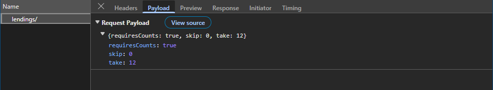
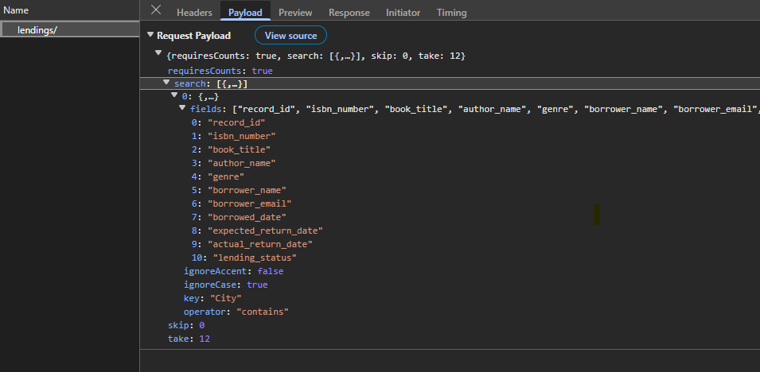
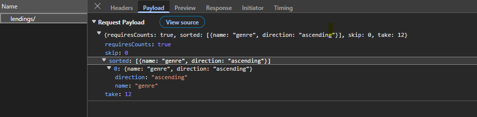
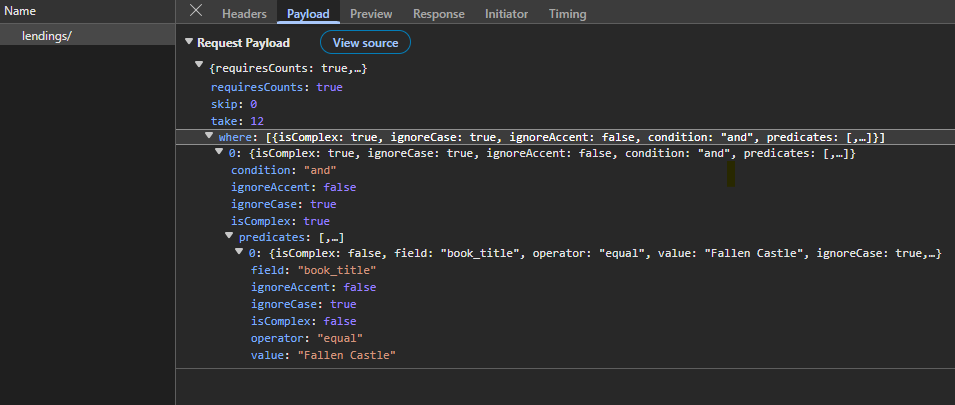
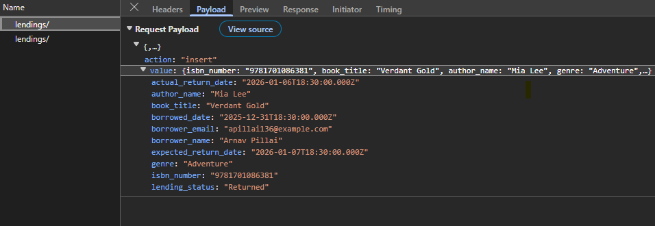
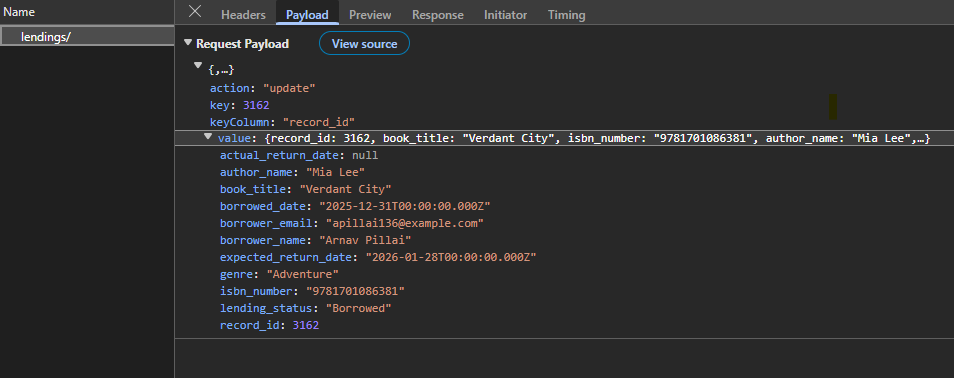
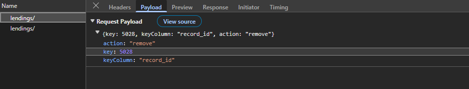

# Syncfusion React Grid with Django REST Framework (DRF)

The Syncfusion [React Grid](https://ej2.syncfusion.com/react/documentation/grid/getting-started) combined with Django REST Framework and Microsoft SQL Server provides a robust, scalable data‑driven application architecture. The Syncfusion React Grid delivers a rich, high‑performance client‑side experience with advanced features like paging, sorting, filtering, searching and CRUD operations.

**What is Django REST Framework?**

[**Django**](https://docs.djangoproject.com/en/6.0) is a high‑level Python web framework used to build secure and scalable backend applications quickly. It includes built‑in features such as database ORM, URL routing, authentication, and security, allowing developers to focus on application logic instead of repetitive setup.

[**Django REST Framework (DRF)**](https://www.django-rest-framework.org/) extends Django to build RESTful APIs that return data in JSON format. It simplifies creating APIs with support for serializers, authentication, pagination, filtering, and CRUD operations, making it well suited for frontend applications like React.

**What is Microsoft SQL Server?**

[**Microsoft SQL Server**](https://learn.microsoft.com/en-us/sql/sql-server/what-is-sql-server?view=sql-server-ver17) is a database system used to store and manage application data in an organized way. It allows applications to save, read, update, and delete data securely and efficiently, making it a common choice for backend systems that work with web frameworks and APIs.

## Prerequisites

- **Node.js** LTS (v20+), npm/yarn.
- **React** 18+ (Vite).
- **Python** 3.11+.
- **Django** 5.2+, **Django REST Framework**.
- **Microsoft SQL Server** (or adapt to Postgre/MySQL/SQLite).

## Setting up the Django REST Framework for Microsoft SQL database

The Django REST Framework backend serves as the core data service, managing API requests that provide the data powering the Syncfusion React Grid.

### Step 1: Set up the Django REST Framework server and install required packages

**Instructions:**

1. Open a terminal ( for example, an integrated terminal in Visual Studio Code or Windows Command Prompt opened with  <kbd>Win+R</kbd>, or macOS Terminal launched with <kbd>Cmd+Space</kbd> ).

2. Before creating the Django project, set up a virtual environment. A virtual environment keeps project dependencies isolated, ensuring that package installations do not affect other projects.

The following commands create and activate the environment:

```bash
python -m venv .venv
.venv\Scripts\activate   # Mac/Linux: source .venv/bin/activate
```
3. Once the virtual environment is active, install the required packages for Django REST Framework and Microsoft SQL Server support:

```bash
pip install django djangorestframework django-filter django-cors-headers mssql-django pyodbc
```
- `mssql-django` enables `Django` to connect to SQL Server through `pyodbc`.
- For Django settings reference, see [databases](https://docs.djangoproject.com/en/6.0/ref/settings/#databases).

4. Initialize the `Django` Project and Application:

For this guide, a `Django` project named **django_server** is created, along with a new application module, using the following commands:

```bash
django-admin startproject django_server .
python manage.py startapp library
```
The **django_server** folder is now created. This initializes the project structure and creates the library app, which will contain the models, views, and API logic for the Django REST Framework backend.


### Step 2: Configure Django settings

The file **django_server/settings.py** is automatically generated when a Django project is created.

This step updates the file to establish the SQL Server connection and enable essential Django REST Framework features such as CORS, filtering, and pagination.

**Instructions:**

1. Opens the (**django_server/settings.py**) file.
2. Define the SQL server database connection: 

The `DATABASES` section configures Django to connect to SQL Server.

```
DATABASES = {
    "default": {
        "ENGINE": "mssql",
        "NAME": "LibraryDB",
        "USER": "django_user",
        "PASSWORD": "Django@123",
        "HOST": "(localdb)\\MSSQLLocalDB",
        "OPTIONS": {
            "driver": "ODBC Driver 18 for SQL Server",
            "trustServerCertificate": "yes",
        },
    }
}
```
**Line breakdown:**
- **ENGINE**: Database backend; for SQL Server via `mssql-django`, set to `"mssql"`.
- **NAME**: Database name to connect to (e.g., **LibraryDB**).
- **USER**: SQL Server login used by Django.
- **PASSWORD**: Password for the above user.
- **HOST**: Server/instance name or address (e.g., **(localdb)\\MSSQLLocalDB** or a hostname).
- **OPTIONS.driver**: ODBC driver to use (e.g., **ODBC Driver 18 for SQL Server**). Must be installed on the machine.
- **OPTIONS.trustServerCertificate**: When **"yes"**, accepts the server certificate without validation (convenient for local/dev). For production, configure TLS properly and remove this override.


3. Add required applications:

Add the required packages to the **INSTALLED_APPS** list to enable `REST APIs`, filtering, CORS, and the project’s app (library):

```
INSTALLED_APPS = [
    "django.contrib.admin",
    "django.contrib.auth",
    "django.contrib.contenttypes",
    "django.contrib.sessions",
    "django.contrib.messages",
    "django.contrib.staticfiles",
    "rest_framework",
    "django_filters",
    "corsheaders",
    "library",
]
```
**Purpose of key apps:**
- **rest_framework** – Core Django REST Framework functionality support.
- **corsheaders** - Cross‑origin access for frontend frameworks.
- **library** - Application created in the project.

4. Configure middleware:

Middleware processes incoming requests.

```
MIDDLEWARE = [
    "corsheaders.middleware.CorsMiddleware",
    "django.middleware.security.SecurityMiddleware",
    "django.contrib.sessions.middleware.SessionMiddleware",
    "django.middleware.common.CommonMiddleware",
    "django.middleware.csrf.CsrfViewMiddleware",
    "django.contrib.auth.middleware.AuthenticationMiddleware",
    "django.contrib.messages.middleware.MessageMiddleware",
    "django.middleware.clickjacking.XFrameOptionsMiddleware",
]
```
> Place **CORS** middleware near the top so preflight requests are handled correctly.

5. Enable **CORS** for the React development server:

Add the React dev origin so the browser can call the API during development.

```
CORS_ALLOWED_ORIGINS = [
    "http://localhost:5173",
]
```
This prevents cross‑origin access errors while the frontend calls backend APIs during development.

6. Configure **Django REST Framework (DRF)**.

The `REST_FRAMEWORK` section defines the API’s input formats, data parsing rules, pagination behavior, and features for filtering, searching, and ordering.

```
REST_FRAMEWORK = {
    "DATETIME_INPUT_FORMATS": [
        "%Y-%m-%dT%H:%M:%S.%fZ",
        "%Y-%m-%dT%H:%M:%SZ",
        "%Y-%m-%dT%H:%M:%S",
        "iso-8601",
    ],
    "DATE_INPUT_FORMATS": [
        "%Y-%m-%d",
        "%Y-%m-%dT%H:%M:%S.%fZ",
        "%Y-%m-%dT%H:%M:%SZ",
        "%Y-%m-%dT%H:%M:%S",
        "iso-8601",
    ],
    "DEFAULT_PARSER_CLASSES": [
        "rest_framework.parsers.JSONParser",
        "rest_framework.parsers.FormParser",
        "rest_framework.parsers.MultiPartParser",
    ],
    "DEFAULT_PAGINATION_CLASS": "rest_framework.pagination.PageNumberPagination",
    "PAGE_SIZE": 12,
    "DEFAULT_FILTER_BACKENDS": [
        "django_filters.rest_framework.DjangoFilterBackend",
        "rest_framework.filters.SearchFilter",
        "rest_framework.filters.OrderingFilter",
    ],
}
```

### Step 3: Define models

A Django model defines the way data is stored and accessed in the database. Each model maps to a database table and exposes its fields as structured records that can be queried, created, updated, and deleted by the application and API.

**Instructions:**

1. Open the (**library/models.py**) file. This file contains the model definitions for the library app.

2. Add the "BookLending" model.

The model describes the table structure, including fields for book details, borrower details, important dates, and lending status.

Indexed fields ("book_title", "author_name", "genre", "lending_status") speed up server‑side filtering/search; default ordering shows most recent borrowings first.

```
[library/models.py]

from django.db import models

class BookLending(models.Model):
    record_id = models.AutoField(primary_key=True)
    book_title = models.CharField(max_length=255)
    isbn_number = models.CharField(max_length=32, db_index=True)
    author_name = models.CharField(max_length=255)
    genre = models.CharField(max_length=100)
    borrower_name = models.CharField(max_length=255)
    borrower_email = models.EmailField()
    borrowed_date = models.DateField()
    expected_return_date = models.DateField()
    actual_return_date = models.DateField(null=True, blank=True)
    lending_status = models.CharField(max_length=20)

    class Meta:
        indexes = [
            models.Index(fields=["book_title"]),
            models.Index(fields=["author_name"]),
            models.Index(fields=["genre"]),
            models.Index(fields=["lending_status"]),
        ]
        ordering = ["-borrowed_date"]

    def __str__(self):
        return f"{self.book_title} ({self.isbn_number}) - {self.borrower_name}"
```
3. Create database migrations:

Django migrations are the mechanism that convert model definitions into real SQL Server tables and columns. Whenever a model is created or modified, migrations ensure the database structure stays updated.

- **Generate a new migration**

    Open the Visual Studio Code Terminal and run the following command:

    ```bash
        python manage.py makemigrations
    ```
    **Explanation:**
    - Scans the (**models.py**) file for any new or updated models.
    - Creates a migration file inside the (**library/migrations**) folder.
    - This migration file acts as a blueprint describing the required database changes.

- **Apply the migration to the database**

    After the migration file is created, run the next command:

    ```bash
        python manage.py migrate
    ```
    **Explanation:**
    - Reads the migration blueprint created earlier.
    - Creates the required SQL Server tables.
    - Adds all fields defined in the model.
    - Updates or modifies existing tables if the model structure changed.

    This step updates the actual database and ensures the structure matches the "BookLending" model.

**Purpose of migrations:**

Migrations act as a bridge between the `Python` models and the SQL Server database.
- Every change in a model (new field, renamed field, removed field, new model) is recorded as a migration.
- These changes are applied safely without writing SQL manually.
- The database structure remains consistent across all environments (development, staging, production).
- Whenever a model is modified in the future:
```bash
    makemigrations → migrate
```
This sequence updates the database schema automatically.

### Step 4: Configure API routing

API routing defines the URLs through which the application exposes CRUD operations for book‑lending records.

A Django REST Framework router automatically generates RESTful routes for the "BookLendingViewSet", allowing the API to handle listing, retrieving, creating, updating, and deleting records under a single endpoint.

**Instructions:**

1. Open the following auto generated file named (**django_server/urls.py**). This file controls all top‑level routes in the Django project.

2. Register the "BookLendingViewSet" with a DRF router:

Add the following code to define the "api/lendings" route.

```
[django_server/urls.py]

from django.contrib import admin
from django.urls import path, include
from rest_framework.routers import DefaultRouter
from library.views import BookLendingViewSet

router = DefaultRouter()
router.register(r'api/lendings', BookLendingViewSet, basename='lendings')

urlpatterns = [
    path('admin/', admin.site.urls),
    path('', include(router.urls)),
]
```
**Explanation:**
- The router connects the "BookLendingViewSet" to the URL path `api/lendings`.
- Standard REST routes (list, retrieve, create, update, delete) are generated automatically.
- No manual URL writing for each action is required.
- All router‑generated routes are added to the project through include(router.urls).
- This keeps the API structure organized and avoids repetitive URL definitions.

### Step 5: ViewSet implementation

The final part is the ViewSet, which receives all incoming requests and routes them to the appropriate custom services. Update **library/views.py** with the following code to properly wire all services to the viewset:

```
from django.db import transaction
from rest_framework import viewsets, status
from rest_framework.response import Response

from .models import BookLending
from .serializers import BookLendingSerializer
from .services.datamanager.engine import DataManagerEngine
from .services.ej2_crud import handle_crud_action

class BookLendingViewSet(viewsets.ModelViewSet):
    queryset = BookLending.objects.all()
    serializer_class = BookLendingSerializer

    dm_engine = DataManagerEngine()

    def create(self, request, *args, **kwargs):
        payload = request.data

        # 1) DataManager READ via POST (initial load / filtering / sorting / paging / search / select)
        if self.dm_engine.is_dm_read(payload):
            mode, data, total_count, requires_counts = self.dm_engine.read(self.get_queryset(), payload)

            if mode == "values":
                # select-mode returns list[dict] (already projected)
                response_payload = {'result': data, 'count': total_count} if requires_counts else data
                return Response(response_payload, status=status.HTTP_200_OK)

            # rows-mode: serialize model instances
            serialized = self.get_serializer(data, many=True).data
            response_payload = {'result': serialized, 'count': total_count} if requires_counts else serialized
            return Response(response_payload, status=status.HTTP_200_OK)

        # 2) UrlAdaptor CRUD actions via POST
        crud_response = handle_crud_action(self, payload)
        if crud_response is not None:
            return crud_response

        # 3) Fallback: standard RESTful create
        serializer = self.get_serializer(data=payload)
        serializer.is_valid(raise_exception=True)
        with transaction.atomic():
            self.perform_create(serializer)
            instance = serializer.instance
            if instance is not None:
                instance.refresh_from_db()
            output_data = self.get_serializer(instance).data
        headers = self.get_success_headers(serializer.data)
        return Response(output_data, status=status.HTTP_201_CREATED, headers=headers)
```
> A detailed breakdown of DataManager payloads mapping to Django operations (filtering, sorting, paging, searching, selection, and CRUD) will be explained in the [Data Operations](#perform-data-operations) & [CRUD](#performing-crud-operations) section.


## Integrate Syncfusion React Grid with Django REST Framework

The Syncfusion React Grid is a robust, high‑performance component built to efficiently display, manage, and manipulate large datasets. It provides advanced features such as sorting, filtering, and paging. Follow these steps to render the grid and integrate it with a Django backend.

### Step 1 : Creating the React client application

Create a new React application using `create vite@latest`, which provides a faster development environment, smaller bundle sizes, and optimized builds.

Open a Visual Studio Code terminal or Command prompt and run the below command:

```bash
npm create vite@latest client -- --template react-ts
cd client
```
This command creates a React application named **client** with the essential folder structure and files required to begin development immediately.

The integration process begins by installing the required Syncfusion React Grid packages before establishing the DRF API.

### Step 2: Install Syncfusion Grid packages

Install the necessary Syncfusion packages using the below command in Visual Studio Code terminal or Command prompt:

```bash
npm install @syncfusion/ej2-react-grids @syncfusion/ej2-data --save
```
- **@syncfusion/ej2-react-grids** – Required package for integrating the Syncfusion Grid component in React.
- **@syncfusion/ej2-data** – Provides data utilities for binding and manipulating Grid data.

### Step 3: Including required Syncfusion stylesheets

Once the dependencies are installed, the required CSS files are made available in the (**../node_modules/@syncfusion**) package directory, and the corresponding CSS references are included in the **index.css** file.

```css
[src/index.css]

@import '../node_modules/@syncfusion/ej2-base/styles/bootstrap5.3.css';  
@import '../node_modules/@syncfusion/ej2-buttons/styles/bootstrap5.3.css';  
@import '../node_modules/@syncfusion/ej2-calendars/styles/bootstrap5.3.css';  
@import '../node_modules/@syncfusion/ej2-dropdowns/styles/bootstrap5.3.css';  
@import '../node_modules/@syncfusion/ej2-inputs/styles/bootstrap5.3.css';  
@import '../node_modules/@syncfusion/ej2-navigations/styles/bootstrap5.3.css';
@import '../node_modules/@syncfusion/ej2-popups/styles/bootstrap5.3.css';
@import '../node_modules/@syncfusion/ej2-splitbuttons/styles/bootstrap5.3.css';
@import '../node_modules/@syncfusion/ej2-notifications/styles/bootstrap5.3.css';
@import '../node_modules/@syncfusion/ej2-react-grids/styles/bootstrap5.3.css';
```

For this project, the `Bootstrap 5.3` theme is used. A different theme can be selected or the existing theme can be customized based on project requirements. Refer to the [Syncfusion React Components Appearance](https://ej2.syncfusion.com/react/documentation/appearance/theme) documentation to learn more about theming and customization options.

### Step 4: Configure DataManager with Django REST Framework (DRF)

The Syncfusion [DataManager](https://ej2.syncfusion.com/react/documentation/data/getting-started) acts as a communication layer between the React Grid and backend services. It sends all Grid operations—such as reading data, sorting, filtering, searching, paging, and performing CRUD actions—to the server in a standardized format.

The [UrlAdaptor](https://ej2.syncfusion.com/react/documentation/data/adaptors#url-adaptor) is a built‑in adaptor that formats requests for REST-style endpoints, like the Django REST Framework API. It serializes all Grid actions and posts them to the DRF API endpoint, then processes the JSON responses returned by the server.

When using `DataManager` with `UrlAdaptor`, the server is expected to return a specific response structure:

**result**: The list of data displayed in the current view, supporting on‑demand loading for large datasets.
**count**: The total count of records in the dataset.

This response format ensures seamless interaction between the React Grid and backend services, enabling all data operations to work consistently.

**Instructions:**
1. Open the (**App.tsx**) file.
2. Create a `DataManager` instance with the `UrlAdaptor` inside the React component and point it to the DRF endpoint. This `DataManager` will serialize all Grid interactions (data and CRUD) and post them to the DRF server.

```ts
import { DataManager, UrlAdaptor } from '@syncfusion/ej2-data';

const data = new DataManager({
  url: 'http://localhost:8000/api/lendings/',
  adaptor: new UrlAdaptor(),
  crossDomain: true
});

```
**Explanation:**
- **url** - Base API endpoint exposed by the Django router.
- **adaptor** - Converts Grid operations into standard REST requests.
- **crossDomain** - Enables communication with a backend running on a different port.

3. Configure the Grid Component.

```ts
[App.tsx]

import React, { useMemo } from 'react';
import { GridComponent, ColumnsDirective, ColumnDirective } from '@syncfusion/ej2-react-grids';
import { DataManager, UrlAdaptor } from '@syncfusion/ej2-data';

const App: React.FC = () => {
  return (
    <GridComponent
      dataSource={data}
    >
      <ColumnsDirective>
        <ColumnDirective field="record_id" headerText="Record ID" width="120" isPrimaryKey={true} visible={false} />
        {/* Include additional columns here */}
      </ColumnsDirective>
    </GridComponent>
  );
};

export default App;
```


## Perform data operations

### Step 1: Add toolbar with CRUD and search options

The [toolbar](https://ej2.syncfusion.com/react/documentation/api/grid#toolbar) provides buttons for adding, editing, deleting records, and searching the data.

**Instructions:**
1. Open the (**App.tsx**) file.
2. Update the Grid component to include the `toolbar` property with CRUD and search options.

```ts
[App.tsx]

import React, { useMemo } from 'react';
import {
  GridComponent, ColumnsDirective, ColumnDirective, Edit, Toolbar, Search, Inject
} from '@syncfusion/ej2-react-grids';
import { DataManager, UrlAdaptor } from '@syncfusion/ej2-data';

const App: React.FC = () => {

  return (
    <GridComponent
      dataSource={data}
      toolbar={['Add','Edit','Delete','Update','Cancel','Search']}
      editSettings={{ allowAdding: true, allowEditing: true, allowDeleting: true }}
    >
      <ColumnsDirective>
        <ColumnDirective field="record_id" headerText="Record ID" width="120" isPrimaryKey={true} visible={false} />
        {/* Include additional columns here */}
      </ColumnsDirective>
      <Inject services={[Edit, Toolbar, Search]} />
    </GridComponent>
  );
};

export default App;
```
### Step 2: Implement paging feature

Paging divides large datasets into smaller pages to improve performance and usability.

**Instructions:**
1. Enable paging by setting [allowPaging](https://ej2.syncfusion.com/react/documentation/api/grid#allowpaging) to "true" on the Grid so that paging requests include the required `skip` and `take` parameters.

2. Configure **pageSettings** to define the page size and any additional paging options needed for the intended layout and interaction design.

```ts
[App.tsx]

const pageSettings = useMemo(() => ({ pageSize: 12, pageSizes: [10, 12, 20, 50, 100] }), []);

<GridComponent
    dataSource={data}
    allowPaging={true}
    pageSettings={pageSettings}>
    <ColumnsDirective>
        <ColumnDirective field="record_id" headerText="Record ID" width="120" isPrimaryKey={true} visible={false} />
        {/* Include additional columns here */}
    </ColumnsDirective>
    <Inject services={[Page]} />
</GridComponent>
```

3. Enable Server‑Side paging in DRF:

The server processes paging requests by reading the `skip` and `take` parameters sent in the request payload.

Before slicing the queryset, the backend computes the full number of matching rows. If the payload requests counts, the response includes a `count` field along with the current page of records.

Create a new **library/services/datamanager/engine.py** file and add the single‑pass read orchestration logic below.

```
from typing import Any, Dict, Tuple
from django.db.models import QuerySet
from .parsing import to_bool, json_or_value
from .search import apply_search
from .filters import build_q_from_where
from .sorting import apply_sorting

class DataManagerEngine:
    DM_READ_KEYS = {"requiresCounts", "skip", "take", "sorted", "where", "search", "select"}

    def is_dm_read(self, payload: Dict[str, Any]) -> bool:
        return any(key in payload for key in self.DM_READ_KEYS)

    def read(self, base_queryset: QuerySet, payload: Dict[str, Any]) -> Tuple[str, QuerySet, int, bool]:
        queryset = base_queryset
        queryset = apply_search(queryset, payload)
        where_filters = json_or_value(payload.get('where'))
        if where_filters:
            q_obj = build_q_from_where(queryset.model, where_filters)
            if q_obj:
                queryset = queryset.filter(q_obj)
        sort_descriptors = json_or_value(payload.get('sorted'))
        queryset = apply_sorting(queryset, sort_descriptors)
        try:
            skip = int(payload.get('skip', 0))
        except Exception:
            skip = 0
        try:
            take = int(payload.get('take', 12))
        except Exception:
            take = 12
        requires_counts = to_bool(payload.get('requiresCounts'), False)
        total_count = queryset.count()
        paged_queryset = queryset[skip: skip + take]
        return 'rows', paged_queryset, total_count, requires_counts
```

> All `DataManager` operations searching, filtering, sorting, and paging are invoked through the `read()` method of the `DataManagerEngine` class in (**library/services/datamanager/engine.py**) file.

**Explanation:**
- The **read()** method calculates the total number of matching records after applying search, filters, and sorting.
- The queryset is sliced using the skip and take values to obtain the current page.
- When requiresCounts is present, the result includes:
    - a list of records for the requested page.
    - a `count` value representing the total matches before paging.

**Below image shows the "page" query passed to the DRF:**



Paging feature is now active with "12" records per page.

### Step 3: Implement searching feature

Searching allows users to locate rows by supplying a term that can be checked against one or more fields, making it easy to find relevant records quickly.

**Instructions:**

1. Ensure the `toolbar` includes the "Search" item.

```ts
    <GridComponent
      dataSource={data}
      toolbar={['Search']}>
      <ColumnsDirective>
        <ColumnDirective field="record_id" headerText="Record ID" width="120" isPrimaryKey={true} visible={false} />
        {/* Include additional columns here */}
      </ColumnsDirective>
      <Inject services={[ Toolbar, Search]} />
    </GridComponent>
```

2. Enable Server‑Side searching in DRF:

The Grid sends one or more search blocks, each containing a search term, an operator, and a list of target fields. The server expands the fields in each block into an **OR** condition and combines multiple blocks together using **AND**, producing a single `Q` predicate that can be applied to the query set before other operations.

- **Create a file:** Create a new file named **library/services/datamanager/search.py**.

- **Import required utilities:** Imports typing tools, ORM primitives, and helper utilities:

    ```
    [library/services/datamanager/search.py]

    from typing import Any, Dict, List, Type
    from django.db import models
    from django.db.models import Q, QuerySet
    from .parsing import json_or_value, normalize_operator, to_bool
    from .filters import build_q_from_leaf_predicate
    ```

- **Apply search blocks:** The "apply_search" function processes search blocks, builds the corresponding `Q` predicates, and applies them to the queryset.

    ```
    def apply_search(queryset: QuerySet, payload: Dict[str, Any]) -> QuerySet:
        search_blocks = payload.get('search')
        if not search_blocks:
            return queryset
        search_blocks = json_or_value(search_blocks)
        if isinstance(search_blocks, dict):
            search_blocks = [search_blocks]
        if not isinstance(search_blocks, list) or not search_blocks:
            return queryset
        model: Type[models.Model] = queryset.model
        combined_and_q = Q()
        for block in search_blocks:
            fields_in_block: List[str] = block.get('fields') or []
            operator_name: str = normalize_operator(block.get('operator') or 'contains')
            search_term: Any = block.get('key') or block.get('searchKey')
            ignore_case: bool = to_bool(block.get('ignoreCase'), True)
            if not fields_in_block:
                single_field = block.get('field')
                if single_field:
                    fields_in_block = [single_field]
            if not fields_in_block or search_term is None:
                continue
            block_or_q = Q()
            for field_name in fields_in_block:
                leaf_predicate = {
                    'isComplex': False,
                    'field': field_name,
                    'operator': operator_name,
                    'value': search_term,
                    'ignoreCase': ignore_case,
                }
                block_or_q |= build_q_from_leaf_predicate(model, leaf_predicate)
            combined_and_q &= block_or_q
        return queryset.filter(combined_and_q) if combined_and_q else queryset
    ```

    **Explanation:**
    - The ViewSet passes the request payload to `DataManagerEngine.read()`.
    - The read engine calls "apply_search()" before filtering, sorting, or paging.
    - Each search block creates a set of **OR** conditions for its fields.
    - Multiple blocks are combined using **AND**.
    - The final queryset contains only rows matching all search criteria.

**Below image shows the "search" query passed to the DRF:**



### Step 4: Implement sorting feature

Sorting allows records to be organized by clicking on column headers to arrange data in ascending or descending order.

**Instructions:**
1. Enable sorting by setting [allowSorting](https://ej2.syncfusion.com/react/documentation/api/grid#allowsorting) to "true" on the Grid so that sort changes are emitted.

```ts
    <GridComponent
        dataSource={data}
        allowSorting={true}
    >
      <ColumnsDirective>
        <ColumnDirective field="record_id" headerText="Record ID" width="120" isPrimaryKey={true} visible={false} />
        {/* Include additional columns here */}
      </ColumnsDirective>
      <Inject services={[ Sort ]} />
    </GridComponent>
```

2. Enable Server‑Side sorting in DRF:

When a column header is clicked, the Grid generates a list of sort descriptors.

Each descriptor contains:
- the `field` name.
- the `sort` direction (ascending or descending).

The server maps these descriptors to Django `order_by()` fields, using a leading hyphen to indicate descending order, and applies them before any paging occurs.

Create a new **library/services/datamanager/sorting.py** file and add the content below:

```
from typing import Any, List, Optional
from django.db.models import QuerySet

def apply_sorting(queryset: QuerySet, sort_descriptors: Any) -> QuerySet:
    if not isinstance(sort_descriptors, list) or not sort_descriptors:
        return queryset
    order_by_fields: List[str] = []
    for s in sort_descriptors:
        if not isinstance(s, dict):
            continue
        field: Optional[str] = s.get('name') or s.get('field')
        direction: str = (s.get('direction') or 'ascending').strip().lower()
        if field:
            prefix = '-' if direction == 'descending' else ''
            order_by_fields.append(prefix + field)
    return queryset.order_by(*order_by_fields) if order_by_fields else queryset
```

**Explanation:**
- `DataManagerEngine.read()` invokes "apply_sorting()" after searching and filtering.
- "apply_sorting()" builds an `order_by()` list and orders the query set prior to paging.

**Below image shows the "sort" query passed to the DRF:**



> To apply multiple sorting conditions in sequence, press and hold the <kbd>Ctrl</kbd> key while clicking on the desired column headers.

### Step 5: Implement filtering feature

Filtering helps refine records by applying conditions on column values. It allows selecting specific values or using simple comparison options such as equals, greater than, or less than to display only the matching data.

**Instructions:**
1. Enable filtering by setting **[allowFiltering](https://ej2.syncfusion.com/react/documentation/api/grid#allowfiltering)** to **true** on the Grid so that filter interactions are sent to the server.
2. Optionally configure the filtering user interface (for example, Menu, CheckBox, or Excel style) by setting the[filterSettings](https://ej2.syncfusion.com/react/documentation/api/grid#filtersettings) property.

```ts
    <GridComponent
        dataSource={data}
        allowFiltering={true}
        filterSettings={{type: "Excel" }}>
      <ColumnsDirective>
        <ColumnDirective field="record_id" headerText="Record ID" width="120" isPrimaryKey={true} visible={false} />
        {/* Include additional columns here */}
      </ColumnsDirective>
      <Inject services={[ Filter ]} />
    </GridComponent>
```

3. Enable Server‑Side filtering in DRF:

The Grid posts a nested `where` structure that represents the filter tree. The server converts this `where` structure into Django `Q` objects and applies them to the query set before sorting and paging, ensuring that only rows that satisfy the requested conditions are returned.

- **Create a new file:** Create a new **library/services/datamanager/filters.py** file.

- **Import required utilities:** Import typing/Django primitives and shared parsing helpers.

    ```
    from typing import Any, Dict, List, Optional, Type
    from django.db import models
    from django.db.models import Q
    from .parsing import json_or_value, normalize_operator, to_bool, coerce_value_for_field
    ```

- **Build Q for a single (leaf) predicate:** Map a single leaf condition `{ field, operator, value }` to a Django `Q` filter.

    ```
    def build_q_from_leaf_predicate(model: Type[models.Model], predicate: Dict[str, Any]) -> Q:
        field_name: Optional[str] = predicate.get('field')
        operator_name: str = normalize_operator(predicate.get('operator'))
        raw_value: Any = predicate.get('value', None)
        ignore_case: bool = to_bool(predicate.get('ignoreCase'), True)
        if not field_name:
            return Q()
        coerced_value = coerce_value_for_field(model, field_name, raw_value)
        if operator_name in ('equal', 'eq'):
            lookup = field_name + ('__iexact' if ignore_case else '__exact')
            return Q(**{lookup: coerced_value})
        if operator_name in ('notequal', 'ne'):
            lookup = field_name + ('__iexact' if ignore_case else '__exact')
            return ~Q(**{lookup: coerced_value})
        if operator_name in ('contains',):
            lookup = field_name + ('__icontains' if ignore_case else '__contains')
            return Q(**{lookup: coerced_value})
        # ... map other operators (gt/gte/lt/lte/startswith/endswith/isnull, etc.) ...
        return Q()
    ```

- **Combine nested `where` into one Q:** Convert the nested `where` tree (AND/OR groups and leaves) to a single `Q` expression.

    ```
    def build_q_from_where(model: Type[models.Model], where_clause: Any) -> Q:
        if where_clause is None:
            return Q()
        where_clause = json_or_value(where_clause)
        if isinstance(where_clause, list):
            combined_q = Q()
            for predicate in where_clause:
                combined_q &= build_q_from_where(model, predicate)
            return combined_q
        if isinstance(where_clause, dict):
            is_complex: bool = where_clause.get('isComplex', False)
            if is_complex:
                condition: str = (where_clause.get('condition') or 'and').strip().lower()
                predicates_list: List[Dict[str, Any]] = where_clause.get('predicates') or []
                if condition == 'or':
                    combined_or_q = Q(); has_any = False
                    for child_predicate in predicates_list:
                        child_q = build_q_from_where(model, child_predicate)
                        if not has_any:
                            combined_or_q = child_q; has_any = True
                        else:
                            combined_or_q |= child_q
                    return combined_or_q
                else:
                    combined_and_q = Q()
                    for child_predicate in predicates_list:
                        combined_and_q &= build_q_from_where(model, child_predicate)
                    return combined_and_q
            else:
                return build_q_from_leaf_predicate(model, where_clause)
        return Q()
    ```

    **Explanation:**
    - The view set detects `DataManager` request and forwards the payload to `DataManagerEngine.read()`.
    - Inside "read()", the function "build_q_from_where()" converts the tree into Django `Q` predicates, and the query set is filtered before sorting and paging.

**Below image shows the "filter" query passed to the DRF:**



**Filter logic with multiple checkbox selections:**

When a user selects multiple checkbox values for the same column (e.g., (book-title = "Verdant Gold" OR author_name = "Mia Lee")), the Grid sends a nested predicate block where all selected values are combined using OR logic.

- Top‑level predicates across different fields are combined using AND logic.
- Nested predicates within the same field are combined using OR logic.
- This enables expressions such as:(author_name = "Mia Lee" OR author_name = "Emma Clark").


## Performing CRUD operations

CRUD operations allow creating, updating, and deleting rows directly in the Grid, with changes persisted to the database through DRF.

**Instructions:**
1. Enable editing by configuring the Grid’s [editSettings](https://ej2.syncfusion.com/react/documentation/api/grid#editsettings) with the required properties such as [allowAdding](https://ej2.syncfusion.com/react/documentation/api/grid/editSettingsModel#allowadding), [allowEditing](https://ej2.syncfusion.com/react/documentation/api/grid/editSettingsModel#allowediting), and [allowDeleting](https://ej2.syncfusion.com/react/documentation/api/grid/editSettingsModel#allowdeleting) so that the Grid can initiate add, edit, and delete actions from the toolbar or row UI.

2. Ensure that the `Add`, `Edit`, `Delete`, `Update`, and `Cancel` items are added to the `toolbar`.

3. Handle CRUD Operations in DRF:

When the Grid performs any CRUD action, it sends a request to the backend (using the UrlAdaptor). `DRF` receives this payload and identifies the intended action through the action key.

The ViewSet examines this value and dispatches the request to the appropriate function inside `ej2_crud.py`.

Each handler:
- Validates the incoming data with the serializer.
- Performs the operation inside a database transaction.
- Ensures data integrity even if an error occurs.

Open the **library/services/ej2_crud.py** file and include the following code:

```
def handle_crud_action(viewset, payload) -> Optional[Response]:
    """
    Dispatch UrlAdaptor CRUD by 'action' key.
    Returns a DRF Response when handled, otherwise None.
    """
    action = (payload.get('action') or '').lower()
    if action == 'insert':
        return _handle_insert(viewset, payload)
    if action == 'update':
        return _handle_update(viewset, payload)
    if action in ('remove', 'delete'):
        return _handle_remove(viewset, payload)
    return None
```

**Explanation:**
- The `handle_crud_action` function reads the action field from the incoming Grid payload.
- Based on the action (insert, update, remove/delete), it routes the request to the corresponding handler function.
- Each handler performs the actual database operation.
- If the action is unknown, it returns None, allowing the ViewSet to continue with default behavior.

**Insert:**

Insert operation creates a new record in the database using the values provided from the Grid.

Open (**library/services/ej2_crud.py**) and add the following code:

```
from django.db import transaction
from rest_framework import status
from rest_framework.response import Response

def _handle_insert(viewset, payload) -> Response:
    record_data = payload.get('value') or payload
    serializer = viewset.get_serializer(data=record_data)
    serializer.is_valid(raise_exception=True)
    with transaction.atomic():
        viewset.perform_create(serializer)
        instance = serializer.instance
        if instance is not None:
            instance.refresh_from_db()
        output_data = viewset.get_serializer(instance).data
    return Response(output_data, status=status.HTTP_201_CREATED)
```

**Explanation:**
- When a user creates a new record in the Grid, the Grid posts a payload that includes `action: 'insert'` and a `value` object that contains the new field values to be saved.
- The insert action calls the `_handle_insert()` function, which validates the values with the serializer and writes the record inside a database transaction to ensure consistency.
- After the record is created, `_handle_insert()` refreshes the instance from the database, serializes the completed row, and returns it so that the Grid can immediately display the new record with any server‑side defaults applied.

**Below image shows the added data passed to the DRF:**



**Update:**

Update operation modifies an existing record by applying the edited values sent from the Grid.

Open the **library/services/ej2_crud.py** file and include the following code:

```
from rest_framework import status
from rest_framework.response import Response

def _handle_update(viewset, payload) -> Response:
    record_id = payload.get('key') or payload.get('id') or payload.get('record_id')
    record_data = payload.get('value') or payload
    if record_id is None:
        return Response({'detail': 'Missing key for update.'}, status=status.HTTP_400_BAD_REQUEST)
    instance = viewset.get_queryset().filter(pk=record_id).first()
    if not instance:
        return Response({'detail': f'Record {record_id} not found.'}, status=status.HTTP_404_NOT_FOUND)
    serializer = viewset.get_serializer(instance, data=record_data, partial=False)
    serializer.is_valid(raise_exception=True)
    from django.db import transaction
    with transaction.atomic():
        viewset.perform_update(serializer)
        instance.refresh_from_db()
        output_data = viewset.get_serializer(instance).data
    return Response(output_data, status=status.HTTP_200_OK)
```

**Explanation:**
- When a user edits a record and saves the changes in the Grid, the Grid posts a payload that contains `action: 'update'`, the primary key in `key`, and the changed fields in `value`.
- The update action calls the `_handle_update()` function, which loads the targeted instance, validates the new values with the serializer, and persists the changes inside a transaction.
- After the update, `_handle_update()` refreshes the instance from the database, serializes the updated row, and returns it so that the Grid remains synchronized with the authoritative values stored on the server.

**Below image shows the updated data passed to the DRF:**



**Delete:**

Delete operation removes an existing record from the database based on the primary key provided by the Grid.

Open the **library/services/ej2_crud.py** file and include the following code:

```
from rest_framework import status
from rest_framework.response import Response

def _handle_remove(viewset, payload) -> Response:
    record_id = payload.get('key') or payload.get('id') or payload.get('record_id')
    if record_id is None:
        return Response({'detail': 'Missing key for delete.'}, status=status.HTTP_400_BAD_REQUEST)
    instance = viewset.get_queryset().filter(pk=record_id).first()
    if not instance:
        return Response({'detail': f'Record {record_id} not found.'}, status=status.HTTP_404_NOT_FOUND)
    deleted_payload = viewset.get_serializer(instance).data
    from django.db import transaction
    with transaction.atomic():
        viewset.perform_destroy(instance)
    return Response(deleted_payload, status=status.HTTP_200_OK)
```

**Explanation:**
- When a user deletes a record in the Grid, the Grid posts a payload that specifies `action: 'remove'` together with the primary key that identifies the record to be deleted.
- The delete action calls the `_handle_remove()` function, which serializes the target instance, deletes it inside a transaction, and prepares a confirmation payload.
- The `_handle_remove()` function returns the confirmation payload to the client so that the Grid can remove the row from the UI and the user can see that the deletion has been completed successfully.

**Below image shows the deleted key passed to the DRF:**



> Normal/Inline editing is the default edit [mode](https://ej2.syncfusion.com/react/documentation/api/grid/editsettings#mode) for the Grid component. To enable CRUD operations, ensure that the [isPrimaryKey](https://ej2.syncfusion.com/react/documentation/api/grid/column#isprimarykey) property is set to "true" for a specific Grid Column which has unique values.

## Running the application

- Open a terminal or Command Prompt. Start the Django server first, and then run the React client.

### Run the Django server

- Run the following commands to start the server:

```bash
python manage.py makemigrations
python manage.py migrate
python manage.py runserver 8000
```

### Run the client

Execute the below commands to run the client application:

```bash
npm run dev
```


## Complete Sample Repository

For a complete working implementation of this example, refer to the following GitHub repository:

[Syncfusion DataGrid with DRF Sample](https://github.com/SyncfusionExamples/syncfusion-react-grid-component-with-django-server)

## Summary

This guide walks through the following key areas:

1. [Prerequisites](#prerequisites) - Review the tools, frameworks, and versions required to build the application.
2. [Setting up the Django REST Framework for Microsoft SQL Database](#setting-up-the-django-rest-framework-for-microsoft-sql-database) - Set up Django REST Framework and connect it to a Microsoft SQL Server database.
3. [Setting up the React application](#integrate-syncfusion-react-grid-with-django-rest-framework) - Create and configure the React application with the Syncfusion React Grid.
4. [Performing data operation](#perform-data-operations) - Handle server‑side data operations such as filtering, searching, sorting, and paging.
5. [Perform CRUD operations](#performing-crud-operations) - Enable create, update, and delete operations from the Grid using DRF.
6. [View Set Implementation](#step-5-viewset-implementation) - Implement Django REST Framework view set to efficiently manage API endpoints and services.
7. [Running the application](#running-the-application) - Run the Django and React applications locally for development.
8. [GitHub sample](#complete-sample-repository) - Explore a complete working sample available on GitHub.

The application now offers a reliable, scalable solution for managing book lending records with a robust Django REST API on Microsoft SQL Server and a Syncfusion React Grid front end.
