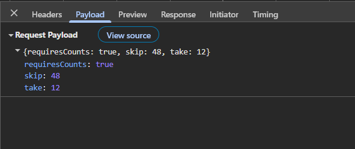
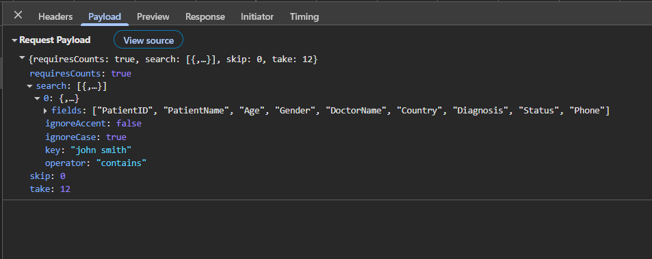
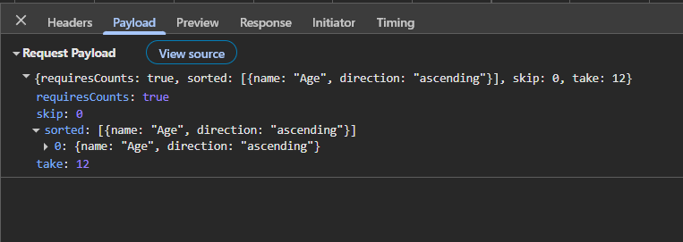
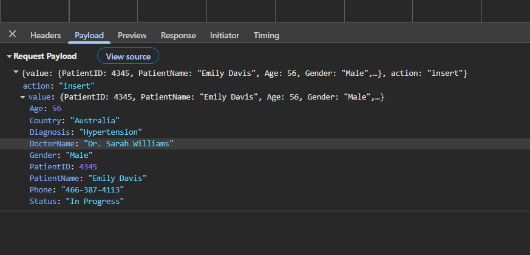
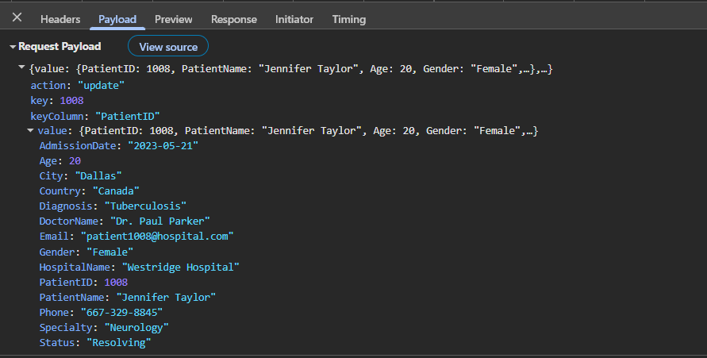
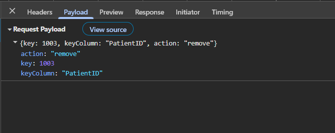

# Connecting the React Grid with Express.js Server

[Express.js](https://expressjs.com/) is a lightweight and flexible Node.js web application framework that provides a simple set of features for building REST APIs quickly. Express.js follows a traditional REST API approach with multiple endpoints for different data operations.

**Application architecture:**

- **Backend**: Express.js server (Node.js) - Handles REST API endpoints, patient data CRUD operations, and business logic.
- **Frontend**: React application - Displays the Syncfusion DataGrid UI with `UrlAdaptor` for seamless data binding.
- **Data Model**: Hospital Patient Management System with comprehensive patient information.

## Prerequisites

| Software / Package          | Recommended version          | Purpose                                 |
|-----------------------------|------------------------------|--------------------------------------   |
| Node.js                     | 20.x LTS or later            | Runtime                                 |
| npm / yarn / pnpm           | 11.x or later                | Package manager                         | 
| Vite                        | 7.3.1                        | Use this to create the React application |
| TypeScript                  | 5.x or later                 | Server‑side and client‑side type safety |

## Setting up the Express.js backend using Node.js

The Express.js backend acts as the central REST API service, handling HTTP requests and responses that power the Syncfusion React Grid.

### Step 1: Create the Express server and install required packages

Before configuring the Express.js API, a proper project structure must be created to host the backend server. This folder will contain the server configuration, required dependencies, and sample data used for processing API requests.

For this implementation, an Express.js server is created to manage a **Hospital Patient Management System** with comprehensive patient data including demographics, medical information, doctor assignments, and hospital details.

**Create project root folder:**

Open a terminal (for example, an integrated terminal in Visual Studio Code, Windows Command prompt opened with <kbd>Win+R</kbd>, or macOS Terminal launched with <kbd>Cmd+Space</kbd>) and run the following commands.

```bash
mkdir ej2-react-grid-with-express-js
cd ej2-react-grid-with-express-js
```

**Create backend server folder:**

Create a new server folder with all necessary subdirectories for organizing code by responsibility.

```bash
mkdir server
cd server
mkdir src
cd src
mkdir controllers routes utils types
cd ..
```

The folder structure after this step should look like:

```
ej2-react-grid-with-express-js/
├── server/
│   └── src/
│       ├── controllers/
│       ├── routes/
│       ├── utils/
│       └── types/
```

**Initialize Node.js and install packages:**

Run the following commands in the terminal window (ensure it is in the **server** directory) to install the required packages.

```bash
npm init -y
npm install express cors
npm install -D typescript ts-node nodemon @types/express @types/cors @types/node
```

**Package descriptions:**
- **express** – Web framework for building REST APIs and defining HTTP routes.
- **cors** – Enables cross-origin requests from the React client to the Express server.
- **typescript, ts-node, nodemon** – Enables TypeScript based development with auto-reload on file changes.
- **@types/express, @types/cors, @types/node** – Type definitions for Express, CORS, and Node.js.

The **server** folder is now created with all required subdirectories, and packages are installed. The project is ready for setting up TypeScript configuration, defining data interfaces, creating API routes, and implementing controller logic.

**Current folder structure:**

```
ej2-react-grid-with-express-js/
└── server/
    ├── node_modules/
    ├── src/
    │   ├── controllers/
    │   ├── routes/
    │   ├── utils/
    │   └── types/
    ├── package.json
    └── package-lock.json
```

### Step 2: Configure TypeScript

TypeScript configuration tells the compiler how to convert TypeScript to JavaScript and sets up the project structure.

Create a new **tsconfig.json** in the **server** folder using the below command:

```bash
npx tsc --init
```

Replace **server/tsconfig.json** file content with the following configuration:

```json
{
  "compilerOptions": {
    "target": "ES2020",
    "module": "commonjs",
    "outDir": "./dist",
    "rootDir": "./src",
    "strict": true,
    "esModuleInterop": true,
    "skipLibCheck": true,
    "forceConsistentCasingInFileNames": true,
    "resolveJsonModule": true,
    "moduleResolution": "node"
  },
  "include": ["src/**/*"],
  "exclude": ["node_modules", "dist"]
}
```

### Step 3: Setup npm scripts for development

Scripts in `package.json` make it easy to run and build the server. Update the **server/package.json** file with the following scripts.

```json
{
  "scripts": {
    "dev": "nodemon --exec ts-node src/server.ts",
    "start": "ts-node src/server.ts",
    "build": "tsc"
  }
}
```

### Step 4: Create TypeScript interfaces

Express.js requires clear data type definitions to ensure type safety throughout the application. Create a new file at (**server/src/types/interface.ts**) with the following content.

```typescript
export interface Patient {
  PatientID: number;
  PatientName: string;
  Age: number;
  Gender: string;
  Email: string;
  Phone: string;
  DoctorName: string;
  Specialty: string;
  HospitalName: string;
  City: string;
  Country: string;
  AdmissionDate: string;
  Diagnosis: string;
  Status: string;
}

export interface DataManagerRequest {
  skip?: number;
  take?: number;
  sorted?: Array<{ name: string; direction: string }>;
  where?: any[];
  search?: Array<{ fields: string[]; key: string; operator: string; ignoreCase: boolean }>;
  requiresCounts?: boolean;
}
```

### Step 5: Generate sample data

Create a new file at (**server/src/utils/data.ts**) with the following content.

```typescript
import { Patient } from "../types/interface";

const patientNames = [
  "John Smith", "Sarah Johnson", "Michael Brown", "Emily Davis", "Robert Wilson", ...];
const doctorNames = [
  "Dr. James Johnson", "Dr. Sarah Williams", "Dr. Michael Brown", "Dr. Emily Davis", ...];
const genders = ["Male", "Female"];
...
...

export function generatePatients(count: number): Patient[] {
  let patients: Patient[] = Array.from({ length: count }, (_, i) => {
    const admissionDate = new Date(2023, Math.floor(Math.random() * 12), Math.floor(Math.random() * 28) + 1);
    return {
      PatientID: 1001 + i,
      PatientName: patientNames[i % patientNames.length],
      Age: Math.floor(Math.random() * 70) + 18,
      Gender: genders[Math.floor(Math.random() * genders.length)],
      Email: `patient${1001 + i}@hospital.com`,
      DoctorName: doctorNames[Math.floor(Math.random() * doctorNames.length)],
      ...
    };
  });
  return patients;
}
```

**Purpose**: This utility generates 1000 patient records in-memory, eliminating the need for a real database during development and testing.

### Step 6: Create the Express server configuration

Create a new server file at (**server/server.ts**) that initializes Express.js, sets up middleware, and defines routes.

```typescript
import express, { Application } from 'express';
import cors from 'cors';
import patientRoutes from './src/routes/patients.routes';

const app: Application = express();
const PORT = 5000;
app.use(cors({
  origin: '*',
  methods: ['POST'],
  allowedHeaders: ['Content-Type', 'Authorization']
}));
app.use(express.json());
app.use(express.urlencoded({ extended: true }));
app.use('/api/patients', patientRoutes);
app.listen(PORT, () => {});
export default app;
```

### Step 7: Create API routes

Create a new routes file at (**server/src/routes/patients.routes.ts**) that defines all HTTP endpoints for data operations.

```typescript
import { Router } from 'express';
import { getPatients, createPatient, updatePatient,deletePatient} from '../controllers/patients.controller';

const router = Router();
// Used to get the data
router.post('/', (req, res) => {
    return getPatients(req, res);
});
// Used for Insert operation
router.post('/create', (req, res) => { return createPatient(req, res); });
// Used for Edit operation
router.post('/update', (req, res) => { return updatePatient(req, res); });
// Used for Delete operation
router.post('/remove', (req, res) => { return deletePatient(req, res); });

export default router;
```

## Perform data operations in server

Create a new controller file at (**server/src/controllers/patients.controller.ts**) to handle all server request operations for data actions. 

Inside this file, add a `getPatients` method to return the data to the client when a request is sent. Ensure the response follows a structured format that includes both the current view dataset and the total data count. This approach supports on‑demand data loading and enables the client to handle operations such as paging or filtering effectively when using Syncfusion data binding approaches.

The required response format includes:

 - **result**: The list of data displayed in the current view, supporting on‑demand loading for large datasets.
 - **count**: The total count of records in the dataset.

```typescript
res.json({result: result, count: count});
```

The complete code is available [here]().

### Filtering

Filtering allows to narrow down the data based on certain conditions. It is done by applying specific rules or criteria to include only the records that match those rules while excluding all others.

```typescript
const applyWhere = (data: Patient[], where: any[]): Patient[] => {
  if (!where || where.length === 0) return data;
  return data.filter(item => {
    return evaluatePredicateGroup(item, where, 'and');
  });
};
```

### Searching

Searching allows to find records that contain specific keywords.

```typescript
const applySearch = (data: Patient[], search: any[]): Patient[] => {
  if (!search || search.length === 0) return data;
  return data.filter(item => {
    return search.every(s => {
      const fields = s.fields || [];
      const key = s.key || '';
      const operator = s.operator || 'contains';
      const ignoreCase = s.ignoreCase !== false;
      if (!fields.length || !key) return true;
      const searchKey = ignoreCase ? key.toLowerCase() : key;
      return fields.some((field: string) => {
        const fieldValue = ignoreCase && typeof item[field as keyof Patient] === 'string'
          ? (item[field as keyof Patient] as string).toLowerCase()
          : item[field as keyof Patient];
        if (operator === 'contains') {
          return String(fieldValue).includes(searchKey);
        } else {
          return String(fieldValue) === searchKey;
        }
      });
    });
  });
};
```

### Sorting

Sorting allows to arrange records by one or more columns in ascending or descending order.

```typescript
const applySort = (data: Patient[], sorted: any[]): Patient[] => {
  if (!sorted || sorted.length === 0) return data;
  const result = [...data];
  sorted.forEach(sort => {
    const direction = (sort.direction || 'ascending').toLowerCase() === 'descending' ? -1 : 1;
    result.sort((a, b) => {
      const aVal = a[sort.name as keyof Patient];
      const bVal = b[sort.name as keyof Patient];
      if (aVal < bVal) return -direction;
      if (aVal > bVal) return direction;
      return 0;
    });
  });
  return result;
};
```

### Paging

Paging divides large datasets into smaller, manageable pages based on offset and page size. This allows to display data efficiently without loading all records at once.

```typescript
const skip: number = dm.skip as number ;
const take = dm.take as number;
result = result.slice(skip, skip + take);
```

find the complete code of the `getPatients` method below:

```typescript
export const getPatients = (req: Request, res: Response) => {
  try {
    const dm: DataManagerRequest = req.body || {};
    let result = [...patients];
    // Apply filters
    if (dm.where && dm.where.length > 0) {
      result = applyWhere(result, dm.where);
    }
    // Apply search
    if (dm.search && dm.search.length > 0) {
      result = applySearch(result, dm.search);
    }
    const count = result.length;
    // Apply sort
    if (dm.sorted && dm.sorted.length > 0) {
      result = applySort(result, dm.sorted);
    }
    // Apply page
    const skip: number = dm.skip as number ;
    const take = dm.take as number;
    result = result.slice(skip, skip + take);

    res.json(dm.requiresCounts ? {result: result, count: count} : patients);
  } catch (error) {
    res.status(500).json({
      error: 'Failed to retrieve patients',
      result: [],
      count: 0
    });
  }
};
```

## Perform CRUD operations in server

CRUD operations (Create, Read, Update, Delete) are handled by the controllers and routed through corresponding API endpoints.

### Insert

Insert operation creates a new patient record.

```typescript
export const createPatient = (req: Request, res: Response) => {
  try {
    const updatedRecord = req.body.value || req.body;
    if (!updatedRecord.PatientName || !updatedRecord.DoctorName) {
      return res.status(422).json({
        message: 'PatientName and DoctorName are required'
      });
    }
    const newId = Math.max(...patients.map(p => p.PatientID), 1000) + 1;
    const newPatient: Patient = {
      PatientID: newId,
      PatientName: updatedRecord.PatientName,
      Age: updatedRecord.Age,
      ...
    };

    patients.push(newPatient);
    res.status(201).json(newPatient);
  } catch (error) {
    res.status(422).json({
      message: 'Insert failed: ' + (error instanceof Error ? error.message : String(error))
    });
  }
};
```

### Update

Update operation modifies an existing patient record.

```typescript
export const updatePatient = (req: Request, res: Response) => {
  try {
    const updatedData = req.body.value || req.body;
    const id = req.body.key || req.params.id || updatedData.patientId;

    if (!id) return res.status(422).json({ message: 'Missing patientId' });

    const index = patients.findIndex((p) => p.patientId === parseInt(id));
    patients[index] = { ...patients[index], ...updatedData };
    res.json(patients[index]);
  } catch (error) {
    res.status(422).json({ message: 'Update failed: ' + (error instanceof Error ? error.message : String(error)) });
  }
};
```

### Delete

Delete operation removes a patient record from the dataset.

```typescript
export const deletePatient = (req: Request, res: Response) => {
  try {
    const id = req.body.key;
    if (!id) {
      return res.status(422).json({
        message: 'Missing PatientID'
      });
    }
    const index = patients.findIndex(p => p.PatientID === id);
    if (index === -1) {
      return res.status(404).json({ error: 'Patient not found' });
    }
    const deleted = patients[index];
    patients.splice(index, 1);
    res.status(200).json({
      message: 'Patient deleted',
      deleted
    });
  } catch (error) {
    res.status(422).json({
      message: 'Delete failed: ' + (error instanceof Error ? error.message : String(error))
    });
  }
};
```

## Run the server application

Use the following command to run the application in the browser.

```bash
cd ej2-react-grid-with-express-js/server
npm run dev
```

The server will start on http://localhost:5000 and the patients endpoint is http://localhost:5000/api/patients.

With the Express.js backend now fully implemented, all data operations (filtering, searching, sorting, and paging) along with CRUD operations (create, update, delete) are handled on the server side.
The backend is now ready to be connected to the Syncfusion React Grid component in the React frontend.

## Connecting Syncfusion React Grid with Express.js

Create a new React application using Vite, which provides a faster development environment and optimized builds.

### Step 1: Create React application with Vite

Open a terminal (for example, an integrated terminal in Visual Studio Code, Windows Command prompt opened with <kbd>Win+R</kbd>, or macOS Terminal launched with <kbd>Cmd+Space</kbd>) and run the following commands (navigate to the root `ej2-react-grid-with-express-js` directory first).

```bash
npm create vite@latest GridClient -- --template react-ts
cd GridClient
npm install
```

This command creates a React application named **GridClient** with TypeScript support, providing the essential folder structure and files required to begin development immediately.

### Step 2: Install Syncfusion packages

Install the Syncfusion React Grid and DataManager packages using npm.

```bash
npm install @syncfusion/ej2-react-grids --save
npm install @syncfusion/ej2-data --save
```

### Step 3: Include Syncfusion styles

Once dependencies are installed, include the required CSS files in the **src/index.css** file.

```css

@import '@syncfusion/ej2-base/styles/tailwind3.css';  
@import '@syncfusion/ej2-buttons/styles/tailwind3.css';  
@import '@syncfusion/ej2-calendars/styles/tailwind3.css';  
@import '@syncfusion/ej2-dropdowns/styles/tailwind3.css';  
@import '@syncfusion/ej2-inputs/styles/tailwind3.css';
@import '@syncfusion/ej2-navigations/styles/tailwind3.css';
@import '@syncfusion/ej2-popups/styles/tailwind3.css';
@import '@syncfusion/ej2-splitbuttons/styles/tailwind3.css';
@import '@syncfusion/ej2-notifications/styles/tailwind3.css';
@import '@syncfusion/ej2-react-grids/styles/tailwind3.css';
```

For this project, the "Material 3" theme is applied. Other themes can be selected, or the existing theme can be customized to meet specific project requirements. For detailed guidance on theming and customization, refer to the [Syncfusion React Components Appearance](https://ej2.syncfusion.com/react/documentation/appearance/theme-studio) documentation.

### Step 4: Configure DataManager for REST API communication

The Syncfusion [DataManager](https://ej2.syncfusion.com/react/documentation/data/getting-started) acts as a communication layer between the React Grid and backend services. It sends all Grid operations such as reading data, sorting, filtering, searching, paging, and performing CRUD actions—to the server in a standardized format.
 
The [UrlAdaptor](https://ej2.syncfusion.com/react/documentation/data/adaptors#url-adaptor) is a built‑in adaptor that formats requests for REST-style endpoints, like the Express.js REST Framework API. It defines how requests are formatted and how responses are processed. The `UrlAdaptor` converts Grid actions into HTTP `POST` requests and handles the JSON responses returned by the server, allowing the Grid to display and manage data seamlessly.
 
When using `DataManager` with `UrlAdaptor`, the server is expected to return a specific response structure:
 
- **result**: The list of data displayed in the current view, supporting on‑demand loading for large datasets.
- **count**: The total count of records in the dataset.
 
This response format ensures seamless interaction between the React Grid and backend services, enabling all data operations to work consistently.

Create the data manager service file at (**GridClient/src/services/dataManager.ts**).

```typescript
import { DataManager, UrlAdaptor } from '@syncfusion/ej2-data';
// API service endpoint
const API_BASE_URL = 'http://localhost:5000/api/patients';

export const patientDataManager = new DataManager({
  url: API_BASE_URL,                    // POST endpoint for featching data with filters, sort, paging
  insertUrl: API_BASE_URL + '/create',  // POST endpoint for inserting new records
  updateUrl: API_BASE_URL + '/update',  // POST endpoint for updating records
  removeUrl: API_BASE_URL + '/remove',  // POST endpoint for deleting records
  adaptor: new UrlAdaptor()             // Activates the UrlAdaptor
});
```

### Step 5: Create the Grid component

Create a new React component that renders the Syncfusion Grid and connects it to the Express.js backend at (**GridClient/src/components/PatientsGrid.tsx**).

```ts

import React from 'react';
import { GridComponent, ColumnsDirective, ColumnDirective } from '@syncfusion/ej2-react-grids';
import { patientDataManager } from '../services/dataManager';

export const PatientsGrid: React.FC = () => {
  return (
    <GridComponent
      dataSource={patientDataManager}
      height={300}
    >
      <ColumnsDirective>
        <ColumnDirective field="patientId" headerText="ID" type="numeric" isPrimaryKey={true} visible={false} />
        <ColumnDirective field="patientName" headerText="Patient Name" width="150" />
        <ColumnDirective field="age" headerText="Age" type="number" width="80" />
        <ColumnDirective field="gender" headerText="Gender" width="100" />
        <ColumnDirective field="doctorName" headerText="Doctor" width="150" />
        <ColumnDirective field="specialty" headerText="Specialty" width="120" />
        <ColumnDirective field="status" headerText="Status" width="100" />
      </ColumnsDirective>
    </GridComponent>
  );
};

export default PatientsGrid;
```

### Enable paging

The paging feature divides Grid records into multiple pages, improving performance and usability when handling large datasets. Enable paging by setting the [allowPaging](https://ej2.syncfusion.com/react/documentation/api/grid#allowpaging) property to `true` and injecting the `Page` module. Without the `Page` module, the pager will not render. Customize pager behavior using the [pageSettings](https://ej2.syncfusion.com/react/documentation/api/grid#pagesettings) property.

```ts

import React from 'react';
import { GridComponent, Page, Inject } from '@syncfusion/ej2-react-grids';
import { patientDataManager } from '../services/dataManager';

export const PatientsGrid: React.FC = () => {
  return (
    <GridComponent
      dataSource={patientDataManager}
      allowPaging={true}
    >
      <Inject services={[Page]} />
    </GridComponent>
  );
};

export default PatientsGrid;
```

When paging is performed in the Grid, a request is sent to the server with the following payload.



### Enable filtering

The filtering feature enables searching and refining Grid records based on column values. Enable filtering by setting the [allowFiltering](https://ej2.syncfusion.com/react/documentation/api/grid#allowfiltering) property to `true` and injecting the `Filter` module. Without the `Filter` module, the filter bar will not render. Customize filtering options using the [filterSettings](https://ej2.syncfusion.com/react/documentation/api/grid#filtersettings) property.

```ts
import React from 'react';
import { GridComponent, Filter, Inject } from '@syncfusion/ej2-react-grids';
import { patientDataManager } from '../services/dataManager';

export const PatientsGrid: React.FC = () => {
  return (
    <GridComponent
      dataSource={patientDataManager}
      allowFiltering={true}
    >
      <Inject services={[Filter]} />
    </GridComponent>
  );
};

export default PatientsGrid;
```

When filtering is performed in the Grid, a request is sent to the server with the following payload.


### Enable searching

To enhance the search functionality, you can integrate a search text box directly into the grid's toolbar. This allows users to enter search criteria conveniently within the grid interface. To add the search item to the grid's toolbar, use the [toolbar](https://ej2.syncfusion.com/react/documentation/api/grid#toolbar) property and add `Search` item.


```ts

import React from 'react';
import { GridComponent, Toolbar, Inject } from '@syncfusion/ej2-react-grids';
import { patientDataManager } from '../services/dataManager';

export const PatientsGrid: React.FC = () => {
  return (
    <GridComponent
      dataSource={patientDataManager}
      toolbar={['Search']}
    >
      <Inject services={[Toolbar]} />
    </GridComponent>
  );
};

export default PatientsGrid;
```

When searching is performed in the Grid, a request is sent to the server with the following payload.



### Enable sorting

The sorting feature allows ordering Grid records by clicking column headers. Enable sorting by setting the [allowSorting](https://ej2.syncfusion.com/react/documentation/api/grid#allowsorting) property to `true` and injecting the `Sort` module. Without the `Sort` module, clicking headers will not sort the data. Customize sorting behavior using the [sortSettings](https://ej2.syncfusion.com/react/documentation/api/grid#sortsettings) property.


```ts

import React from 'react';
import { GridComponent, Sort, Inject } from '@syncfusion/ej2-react-grids';
import { patientDataManager } from '../services/dataManager';

export const PatientsGrid: React.FC = () => {
  return (
    <GridComponent
      dataSource={patientDataManager}
      allowSorting={true}
    >
      <Inject services={[Sort]} />
    </GridComponent>
  );
};

export default PatientsGrid;
```

When sorting is performed in the Grid, a request is sent to the server with the following payload.



### Enable CRUD actions

To enable editing functionality directly within the grid, you need to configure the [allowEditing](https://ej2.syncfusion.com/react/documentation/api/grid/editSettingsModel#allowediting), [allowAdding](https://ej2.syncfusion.com/react/documentation/api/grid/editSettingsModel#allowadding), and [allowDeleting](https://ej2.syncfusion.com/react/documentation/api/grid/editSettingsModel#allowdeleting) properties within the [editSettings](https://ej2.syncfusion.com/react/documentation/api/grid#editsettings)  to `true`.

Editing feature requires a primary key column for CRUD operations. To define the primary key, set [isPrimaryKey](https://ej2.syncfusion.com/react/documentation/api/grid/column#isprimarykey) to `true` in particular column.

The [toolbar](https://ej2.syncfusion.com/react/documentation/api/grid#toolbar) property of the Grid component allows you to define the items that will be displayed in the grid toolbar. By including the relevant items like `Edit`, `Add`, `Delete`, `Update`, and `Cancel` within the `toolbar` property, you can enable the edit options in the toolbar.

```ts

import React from 'react';
import { GridComponent, ColumnsDirective, ColumnDirective, Edit, Toolbar, Inject, EditSettingsModel } from '@syncfusion/ej2-react-grids';
import { patientDataManager } from '../services/dataManager';

export const PatientsGrid: React.FC = () => {
  const editSettings: EditSettingsModel = { allowEditing: true, allowAdding: true, allowDeleting: true, mode: 'Normal' };
  return (
    <GridComponent
      dataSource={patientDataManager}
      editSettings={editSettings}
      toolbar={['Add', 'Edit', 'Delete', 'Update', 'Cancel']}
    >
      <ColumnsDirective>
        <ColumnDirective field="patientId" headerText="ID" type="numeric" isPrimaryKey={true} width="100" />
        ---
      </ColumnsDirective>
      <Inject services={[Edit, Toolbar]} />
    </GridComponent>
  );
};

export default PatientsGrid;
```

When a new record added in the Grid, a request is sent to the server with the following payload.



When a record updated in the Grid, a request is sent to the server with the following payload.



When a record deleted in the Grid, a request is sent to the server with the following payload.



## Run the application

Both the backend Express.js server and the frontend React application need to run simultaneously for the Grid to function properly.

**Prerequisites for running:**

Before starting the servers, the following must be available:
- Two terminal windows or tabs open (one for backend, one for frontend)
- Both **server** and **GridClient** directories created and configured
- All npm packages installed in both directories

### Step 1: Start the Express.js backend server

Open the first terminal and navigate to the **server** folder from the project root:

```bash
cd ej2-react-grid-with-express-js/server
npm run dev
```

The server will start on http://localhost:5000 and the patients endpoint is http://localhost:5000/api/patients.

### Step 2: Start the React frontend application

Open a new terminal and navigate to the **GridClient** folder from the project root:

```bash
cd ej2-react-grid-with-express-js/GridClient
npm run dev
```

The React application will start on http://localhost:5173.

The complete folder structure look like below.

```
ej2-react-grid-with-express-js/
├── server/
│   ├── src/
│   │   ├── controllers/
│   │   │   └── patients.controller.ts
│   │   ├── routes/
│   │   │   └── patients.routes.ts
│   │   ├── utils/
│   │   │   └── data.ts
│   │   ├── types/
│   │   │   └── interface.ts
│   │   └── server.ts
│   ├── node_modules/
│   ├── package.json
│   ├── package-lock.json
│   └── tsconfig.json
│
└── GridClient/
    ├── src/
    │   ├── components/
    │   │   └── PatientsGrid.tsx
    │   ├── services/
    │   │   └── dataManager.ts
    │   ├── App.tsx
    │   ├── index.css
    │   └── main.tsx
    ├── node_modules/
    ├── package.json
    ├── vite.config.ts
    └── tsconfig.json
```

## Complete sample repository

For a complete working implementation, refer to the GitHub repository:
[Syncfusion React Grid with Express.js Server Sample]()

The repository contains the complete Express.js backend implementation with all controller methods, API routes, TypeScript interfaces, and data models, plus a ready-to-run React frontend application.
Run the server application.

## Summary

This guide covers the following key areas:
1. Tools, frameworks, and versions required to build the application. [🔗](#prerequisites)
2. Create a Node.js project, configure TypeScript, and set up Express server. [🔗](#setting-up-the-express.js-backend-using-node-js)
3. Handle server-side filtering, searching, sorting, and paging for efficient data processing. [🔗](#perform-data-operations-in-server)
4. Handle server-side CRUD actions. [🔗](#perform-crud-operations-in-server) 
5. Start servers locally and access the backend. [🔗](#run-the-server-application)
6. Connecting Syncfusion React Grid [🔗](#connecting-syncfusion-react-grid-with-express-js) - Create a React project and configure Syncfusion Grid with UrlAdaptor.
7. Start servers locally and access the frontend. [🔗](#run-the-application)
8. Explore a complete working sample on GitHub. [🔗](#complete-sample-repository)

## See also

  - [Types of Edit](https://ej2.syncfusion.com/react/documentation/grid/editing/edit-types)
  - [Validation Rules](https://ej2.syncfusion.com/react/documentation/grid/editing/validation)
  - [Filter Menu](https://ej2.syncfusion.com/react/documentation/grid/filtering/filter-menu)
