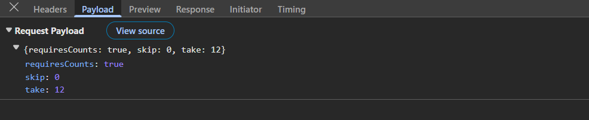
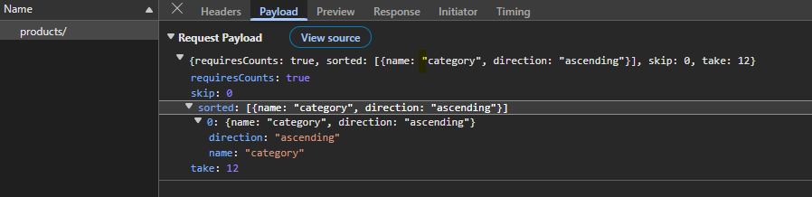
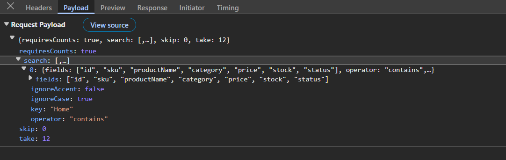
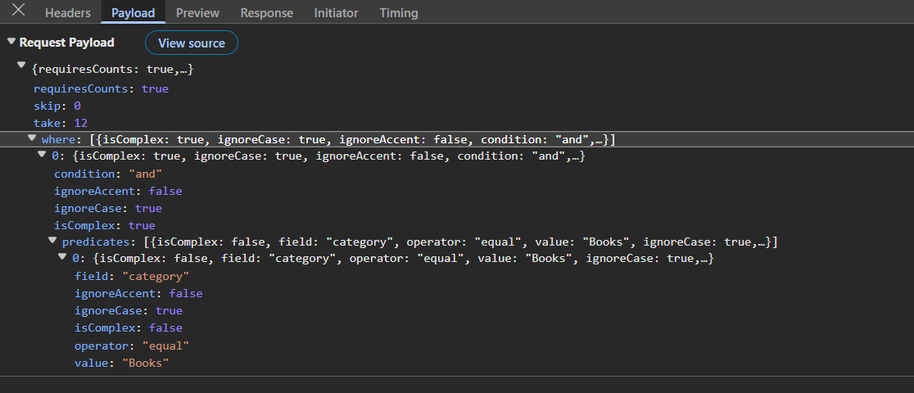
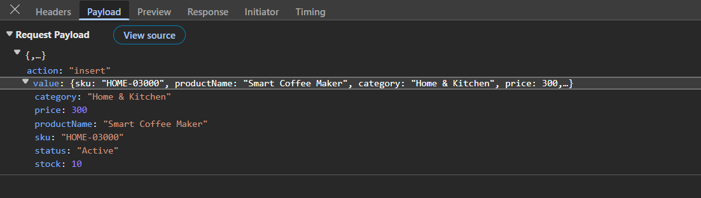
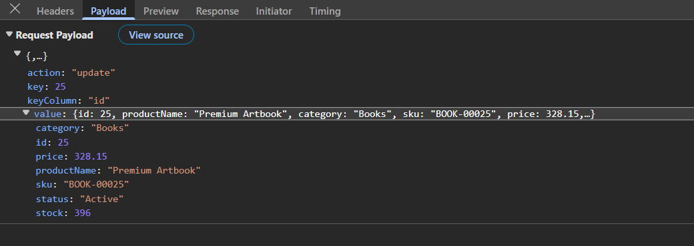
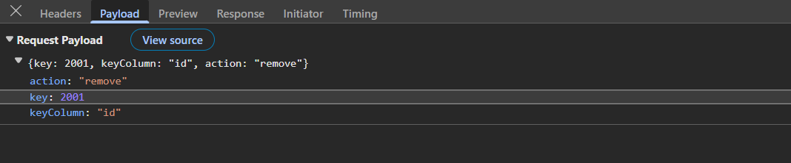

# Connecting the Syncfusion React Grid with FastAPI backend

[FastAPI](https://fastapi.tiangolo.com/) is a modern, high‑performance Python web framework for building RESTful APIs with automatic OpenAPI documentation and robust validation. In a REST architecture, the server exposes resource‑oriented endpoints and relies on standard HTTP verbs while the client exchanges well structured JSON payloads. FastAPI combines asynchronous I/O, type hints, and Pydantic validation to produce low‑latency APIs that React applications can call reliably. This design is particularly effective for the Syncfusion React Grid because every grid action translates to a predictable JSON contract that the backend can process consistently and efficiently.

## Prerequisites

| Software / Package | Recommended version | Purpose |
|--------------------|---------------------|---------|
| Python             | 3.11+               | Backend runtime |
| FastAPI            | Latest               | REST API framework |
| Uvicorn            | Latest               | ASGI server |
| Node.js            | 20.x LTS or later   | React tooling and runtime |
| npm                | 10.x+               | Package manager |

## Key topics

| # | Topics | Link |
|---|---------|-------|
| 1 | Configure a FastAPI REST backend that implements the Syncfusion DataManager POST contract | [View](#setting-up-the-fastapi-backend) |
| 2 | Implement server‑side data operations: paging, sorting, searching, filtering | [View](#perform-server-side-data-operations) |
| 3 | Add full CRUD support with insert, update, and delete operations persisted on the server | [View](#perform-server-side-crud-operations) |
| 4 | Integrate the Syncfusion React Grid with the backend using DataManager and the UrlAdaptor | [View](#integrating-syncfusion-react-grid-with-fastapi) |
| 5 | Run the FastAPI and React applications locally for development | [View](#running-the-application) |
| 6 | Explore a complete working sample available on GitHub | [View](#complete-sample-repository) |

## Setting up the FastAPI backend

The FastAPI backend serves as the central data service for the React Grid. It receives every grid action through a single transport contract, performs validation and server‑side processing, and returns compact JSON responses that the Grid can render immediately.

### Step 1: Create the FastAPI server and install required packages

The first step establishes a dedicated Python workspace and installs the minimal runtime dependencies required to host a FastAPI application during development.

**Instructions:**

1. Create a new server workspace and activate an isolated virtual environment so that the backend dependencies do not interfere with other projects on the machine.

    ```bash
    mkdir server
    cd server
    python -m venv .venv
    # Windows
    .venv\Scripts\activate
    # macOS/Linux
    # source .venv/bin/activate
    ```

2. Install FastAPI and [Uvicorn](https://pypi.org/project/uvicorn/) to provide the project with a high-performance web framework and an ASGI server optimized for local development with hot reload.
    ```bash
    pip install fastapi uvicorn
    ```

**Explanations:**
- This step creates a clean Python environment that keeps backend dependencies isolated from global packages and other projects.  
- FastAPI provides an expressive routing model, automatic documentation, and strong request validation that reduces boilerplate code.  
- Uvicorn supplies an efficient ASGI server that starts quickly and supports code reload for rapid feedback while building the API.  
- Installing these packages up front ensures that later steps can focus entirely on features rather than environment setup.  

The backend workspace has been successfully initialized, and the core runtime is now prepared for subsequent configuration steps.

### Step 2: Create sample datasource 

This step initializes the application with a dataset. Create a new file named **server/products_data.json** and paste the following JSON. This file will be used by the API to load and persist product data:

```json
[
  {
    "id": 1,
    "productName": "Ergonomic Serum",
    "category": "Beauty",
    "sku": "BEAU-00001",
    "price": 4394.23,
    "stock": 78,
    "status": "Active"
  },
  {
    "id": 2,
    "productName": "Portable Shampoo",
    "category": "Beauty",
    "sku": "BEAU-00002",
    "price": 8199.38,
    "stock": 103,
    "status": "Active"
  }
  . . . 
  . . .
  . . .
]
```
**Why this step matters:**
- The JSON file defines a realistic product data model, mirroring common attributes and enabling practical client interactions.
- Local file persistence provides a lightweight alternative to a database, while supporting API contract validation and Grid feature testing.
- Numeric identifiers and typed fields ensure predictable server‑side comparisons and projections.
- The file serves as the single source of truth for the in‑memory store, keeping the example simple, reproducible, and easy to extend.
- The sample dataset is available and the API can load it immediately when the application starts.

### Step 3: Configure application entry

The application entry point configures cross‑origin concerns and registers the products router, ensuring that the API exposes a cohesive surface under a predictable path.

Open the exising **server/main.py** file and add the following code to enable CORS and mount the products routes:

```python
from fastapi import FastAPI
from fastapi.middleware.cors import CORSMiddleware

# Import from routers folder
from routers.products import router as products_router

app = FastAPI(title="Products API")

app.add_middleware(
    CORSMiddleware,
    allow_origins=["*"],
    allow_credentials=True,
    allow_methods=["*"],
    allow_headers=["*"],
)

# Register router
app.include_router(
    products_router,
    prefix="/products",
    tags=["products"]
)
```

> 
- CORS configuration → All origins are permitted during development, ensuring the local React app can communicate without preflight issues.
- Router registration → The "products" router is mounted under the "/products" prefix, ensuring the API endpoints remain organized and easy to navigate.  

The application starts successfully and serves product endpoints under the configured "/products" prefix.

### Step 4: Create the router

The router centralizes data loading, read pipelines for grid operations, and mutation handlers, which results in a single cohesive endpoint that the DataManager can call.

1. Navigate to the project’s "routers/" directory and create a new file named **products.py**. This file is used to centralize product data loading, define API paths, and expose metadata for helper modules and persistence.
2. Inside "server/routers/", create a new folder named "services/data_actions/" to implement data actions. Within this folder, add the following new files:
    - **search.py** - executes search actions.
    - **sort.py** - executes sorting actions.
    - **page.py** - executes paging actions.
    - **filter.py** - executes filtering actions.
    - **select.py** - executes column selection actions.
3. Inside "server/routers/", create a new folder named "services/crud_actions/" to implement data actions. Within this folder, add the following new files:
    - **insert.py** - executes insert actions.
    - **update.py** - executes update actions.
    - **remove.py** - executes remove actions.

4. Add the following code example to configure routing in the **routers/products.py** file. This router centralizes product data loading, defines API paths, and exposes metadata for helper modules and persistence

    ```python
    from fastapi import APIRouter, HTTPException
    from fastapi.responses import JSONResponse
    from typing import Any, Dict, List
    import json
    import os
    from pathlib import Path

    # Import the data action files in feature wise
    from .services.data_actions.search import apply_search
    from .services.data_actions.filter import apply_where
    from .services.data_actions.sort import apply_sorting
    from .services.data_actions.select import apply_select
    from .services.data_actions.page import apply_paging

    from .services.crud_actions.insert import handle_insert
    from .services.crud_actions.update import handle_update
    from .services.crud_actions.remove import handle_remove

    router = APIRouter()

    DATA_FILE = Path(__file__).resolve().parent.parent / 'products_data.json'

    # Define field types
    FIELDS_META = {
        'id': 'int',
        'productName': 'str',
        'category': 'str',
        'sku': 'str',
        'price': 'float',
        'stock': 'int',
        'status': 'str',
    }
    ```

5. Add the "_load_products()" and "save_products()" functions to load products from disk and persist changes, ensuring the API maintains an in‑memory store backed by a durable file.

    ```python
    def _load_products() -> List[Dict[str, Any]]:
        """Load products from disk."""
        if os.path.exists(DATA_FILE):
            try:
                with open(DATA_FILE, 'r', encoding='utf-8') as f:
                    return json.load(f)
            except Exception:
                return []
        return []

    PRODUCTS: List[Dict[str, Any]] = _load_products()

    def save_products() -> None:
        """Persist products to disk."""
        try:
            with open(DATA_FILE, 'w', encoding='utf-8') as f:
                json.dump(PRODUCTS, f, indent=2)
        except Exception:
            pass
    ```

6. Define a helper that detects when the incoming payload is a Syncfusion DataManager READ request. This allows the handler to branch cleanly between read and mutation logic without ambiguity.

    ```python
    DM_READ_KEYS = {'requiresCounts', 'skip', 'take', 'sorted', 'where', 'search', 'select'}

    def is_dm_read(payload: Dict[str, Any]) -> bool:
        """Detect a Syncfusion DataManager READ payload."""
        return any(k in payload for k in DM_READ_KEYS)
    ```

7. Implement a "GET" guard and a unified "POST" handler so that the endpoint accepts only `UrlAdaptor` HTTP POST calls, routing them through the appropriate pipeline for either read or CRUD operations.

    ```python
    @router.get('/')
    def list_products_get():
        """Reject GET to enforce POST-only transport."""
        raise HTTPException(status_code=405, detail='GET not supported; use POST with UrlAdaptor payload to /products/')

    @router.post('/')
    def list_or_crud(payload: Dict[str, Any]):
        """Route DataManager READ or CRUD actions based on the POST body."""
        if is_dm_read(payload):
            skip = int(payload.get('skip', 0) or 0)
            take = int(payload.get('take', 12) or 12)
            requires_counts = bool(payload.get('requiresCounts', False))

            items = PRODUCTS[:]
            
            # Search handler
            items = apply_search(items, payload)

            # Filter handler
            items = apply_where(items, payload.get('where'))

            total_count = len(items)
            # Sort handler
            items = apply_sorting(items, payload.get('sorted'))

            select_fields = payload.get('select')
            if select_fields is not None:
                # Select handler
                data, count = apply_select(items, select_fields, skip, take)
                return JSONResponse({'result': data, 'count': count} if requires_counts else data)

            # Page handler
            data = apply_paging(items, skip, take)
            return JSONResponse({'result': data, 'count': total_count} if requires_counts else data)

        action = payload.get('action')
        if action == 'insert':
            # Insert handler
            return handle_insert(payload, PRODUCTS, save_products, FIELDS_META)
        if action == 'update':
            # Update handler
            return handle_update(payload, PRODUCTS, save_products)
        if action == 'remove':
            # Remove handler
            return handle_remove(payload, PRODUCTS, save_products)

        return JSONResponse(payload)
    ```

**Explanations:**
- The router consolidates read and mutation flows into a single endpoint, which is exactly how the `UrlAdaptor` expects to communicate with a REST backend.  
- The handler executes a clear sequence for reads that applies searching, filtering, sorting, projection, and paging in an intuitive order.  
- The CRUD branch delegates to focused helpers that update the in‑memory list and then persist the change to disk.  
- The design keeps the controller thin while allowing the data operation modules to remain reusable and independently testable.  
- The explicit "GET" guard protects the endpoint from unsupported transports so that all interactions pass through the single "POST" contract.  

The handlers in the "data_actions" and "crud_actions" modules are explained in detail in the integration section below.

**Overview of DataManager parameters utilized in Grid operations:**

| Parameters       | Description |
|------------------|-------------|
| `requiresCounts` | When this value is true the response must include a total count for the current query. |
| `skip`           | This value specifies the number of records that should be skipped from the beginning of the dataset. |
| `take`           | This value instructs the server to return only the specified number of records after the skipped segment. |
| `sorted`         | This array contains one or more sort descriptors that specify field names and directions. |
| `where`          | This structure expresses simple or grouped filter predicates with an optional `condition` value of `and` or `or`. |
| `search`         | This structure carries search terms, fields, and operators for server‑side textual matching. |
| `select`         | This array specifies a projection of fields and enables distinct operations before paging. |
| `action`         | For mutation requests this value indicates `insert`, `update`, or `remove` so the server can route the operation. |

## Perform server-side data operations

At this stage, the server configuration for the dataset, application, and routing has been completed. The following sections explain how to apply server‑side data operations within the application.

As part of the earlier backend configuration, all data action function files were imported into the router and defined in **routers/products.py** file. 

```python
. . .
# Import the data action files by feature
from .services.data_actions.search import apply_search
from .services.data_actions.filter import apply_where
from .services.data_actions.sort import apply_sorting
from .services.data_actions.select import apply_select
from .services.data_actions.page import apply_paging

from .services.crud_actions.insert import handle_insert
from .services.crud_actions.update import handle_update
from .services.crud_actions.remove import handle_remove
. . .
. . .
```

Next, insert the following code into the step-by-step process of creating the existing file feature-wise.

### Step 1: Paging

The paging function slices the dataset based on `skip` and `take` values to return the requested page segment.

Open the file **server/routers/services/data_actions/page.py** and add the following code, which demonstrates how to handle paging actions on the server based on the Grid request.

```python
from typing import Any, Dict, List

def apply_paging(items: List[Dict[str, Any]], skip: int, take: int) -> List[Dict[str, Any]]:
    """Slice items for paging."""
    return items[skip: skip + take]
```

### Step 2: Sorting

The sorting function orders the dataset by the specified `field` and `direction` using sort descriptors.

Open the file **server/routers/services/data_actions/sort.py** and include following code demonstrates handling the sorting action inside the server based on the Grid request.

```python
from typing import Any, Dict, List
from .filter import json_or_value, coerce_value_for_field

def apply_sorting(items: List[Dict[str, Any]], sort_descriptors: Any) -> List[Dict[str, Any]]:
    """Apply DataManager sorting descriptors."""
    sd = json_or_value(sort_descriptors)
    if not isinstance(sd, list) or not sd:
        return items

    out = items[:]
    for desc in reversed(sd):
        if not isinstance(desc, dict):
            continue
        field = desc.get('name') or desc.get('field')
        direction = (desc.get('direction') or 'ascending').strip().lower()
        out.sort(key=lambda x: coerce_value_for_field(field, x.get(field)), reverse=(direction == 'descending'))
    return out
```

### Step 3: Searching

The searching function filters the dataset by applying search blocks across the provided fields with the requested operator.

Open the file **server/routers/services/data_actions/search.py** and include following code demonstrates handling the searching action inside the server based on the Grid request:

```python
from typing import Any, Dict, List
from .filter import json_or_value, normalize_operator, to_bool, compare

def apply_search(items: List[Dict[str, Any]], payload: Dict[str, Any]) -> List[Dict[str, Any]]:
    """Apply DataManager search blocks."""
    search_blocks = payload.get('search')
    if not search_blocks:
        return items

    sb = json_or_value(search_blocks)
    if isinstance(sb, dict):
        sb = [sb]
    if not isinstance(sb, list) or not sb:
        return items

    filtered = items
    for block in sb:
        fields = block.get('fields') or ([] if not block.get('field') else [block.get('field')])
        operator_name = normalize_operator(block.get('operator') or 'contains')
        search_term = block.get('key') or block.get('searchKey')
        ignore_case = to_bool(block.get('ignoreCase'), True)
        if not fields or search_term is None:
            continue

        def block_match(it: Dict[str, Any]) -> bool:
            return any(compare(f, operator_name, it.get(f), search_term, ignore_case) for f in fields)

        filtered = [it for it in filtered if block_match(it)]

    return filtered
```

### Step 4: Filtering

The filtering module interprets DataManager predicates (simple and complex), normalizes operators, coerces field types, and evaluates conditions to return only records that satisfy the specified criteria.

Open the file **server/routers/services/data_actions/filter.py** and include following code demonstrates handling the filtering action inside the server based on the Grid request.

The following code block provides filter helpers and operator normalization.

```python
from typing import Any, Callable, Dict, List, Optional, Tuple
import json

FIELDS_META: Dict[str, str] = {
    'id': 'int', 'productName': 'str', 'category': 'str', 'sku': 'str',
    'price': 'float', 'stock': 'int', 'status': 'str',
}

def to_bool(value: Any, default: bool = False) -> bool:
    if isinstance(value, bool):
        return value
    if isinstance(value, str):
        return value.strip().lower() in ('true', '1', 'yes', 'y')
    if isinstance(value, (int, float)):
        return bool(value)
    return default

def json_or_value(maybe_json: Any) -> Any:
    if isinstance(maybe_json, str):
        try:
            return json.loads(maybe_json)
        except Exception:
            return maybe_json
    return maybe_json

def normalize_operator(raw_operator: Optional[str]) -> str:
    if not raw_operator:
        return ''
    name = raw_operator.strip().lower()
    return {
        'equal': 'equal', '==': 'equal', 'eq': 'equal',
        'notequal': 'notequal', '!=': 'notequal', 'ne': 'notequal',
        'greaterthan': 'gt', 'gt': 'gt', '>': 'gt',
        'greaterthanorequal': 'gte', 'ge': 'gte', '>=': 'gte',
        'lessthan': 'lt', 'lt': 'lt', '<': 'lt',
        'lessthanorequal': 'lte', 'le': 'lte', '<=': 'lte',
        'contains': 'contains', 'startswith': 'startswith', 'endswith': 'endswith', 'like': 'like',
        'doesnotcontain': 'notcontains', 'notcontains': 'notcontains',
        'doesnotstartwith': 'notstartswith', 'doesnotendwith': 'notendswith',
        'in': 'in', 'notin': 'notin', 'between': 'between',
        'isnull': 'isnull', 'isnotnull': 'isnotnull', 'notnull': 'isnotnull',
        'isempty': 'isempty', 'isnotempty': 'isnotempty',
    }.get(name, name)

def coerce_value_for_field(field_name: str, raw_value: Any) -> Any:
    if raw_value is None:
        return None
    t = FIELDS_META.get(field_name)
    try:
        if t == 'int':
            return int(raw_value)
        if t == 'float':
            return float(raw_value)
        if t == 'str' or t is None:
            return str(raw_value)
    except Exception:
        return raw_value
    return raw_value
```

This code block implements all filtering operators, including default ones and special operators such as in, not in, isnull, etc.

```python
from typing import Any, Dict, List, Tuple

def _like_pattern_to_match(op_value: Any) -> Tuple[str, Any]:
    if not isinstance(op_value, str):
        return 'exact', op_value
    raw = op_value
    starts = raw.startswith('%')
    ends = raw.endswith('%')
    inner = raw.strip('%')
    if starts and ends:
        return 'contains', inner
    if ends and not starts:
        return 'startswith', inner
    if starts and not ends:
        return 'endswith', inner
    if '%' in raw:
        return 'contains', raw.replace('%', '')
    return 'exact', raw

def compare(field: str, operator_name: str, left: Any, right: Any, ignore_case: bool) -> bool:
    left_c = coerce_value_for_field(field, left)
    if isinstance(right, (list, tuple)):
        right_c = [coerce_value_for_field(field, v) for v in right]
    else:
        right_c = coerce_value_for_field(field, right)

    if isinstance(left_c, str) and isinstance(right_c, str) and ignore_case:
        left_c = left_c.lower(); right_c = right_c.lower()

    if operator_name == 'equal':   return left_c == right_c
    if operator_name == 'notequal': return left_c != right_c
    if operator_name == 'gt':      return left_c > right_c
    if operator_name == 'gte':     return left_c >= right_c
    if operator_name == 'lt':      return left_c < right_c
    if operator_name == 'lte':     return left_c <= right_c

    if operator_name == 'contains':    return str(right_c) in str(left_c)
    if operator_name == 'startswith':  return str(left_c).startswith(str(right_c))
    if operator_name == 'endswith':    return str(left_c).endswith(str(right_c))
    if operator_name == 'like':
        kind, core = _like_pattern_to_match(right)
        if kind == 'contains':    return str(core).lower() in str(left).lower() if ignore_case else str(core) in str(left)
        if kind == 'startswith':  return str(left).lower().startswith(str(core).lower()) if ignore_case else str(left).startswith(str(core))
        if kind == 'endswith':    return str(left).lower().endswith(str(core).lower()) if ignore_case else str(left).endswith(str(core))
        return str(left).lower() == str(core).lower() if ignore_case else str(left) == str(core)

    if operator_name == 'notcontains':  return str(right_c) not in str(left_c)
    if operator_name == 'notstartswith': return not str(left_c).startswith(str(right_c))
    if operator_name == 'notendswith':   return not str(left_c).endswith(str(right_c))

    if operator_name == 'in':     return left_c in (right_c or [])
    if operator_name == 'notin':  return left_c not in (right_c or [])

    if operator_name == 'between':
        if isinstance(right_c, list) and len(right_c) == 2:
            lo, hi = right_c[0], right_c[1]
            return lo <= left_c <= hi
        return True

    if operator_name == 'isnull':     return left is None
    if operator_name == 'isnotnull':  return left is not None
    if operator_name == 'isempty':    return isinstance(left, str) and left == ''
    if operator_name == 'isnotempty': return isinstance(left, str) and left != ''

    return True

def _eval_leaf(item: Dict[str, Any], predicate: Dict[str, Any]) -> bool:
    field_name = predicate.get('field')
    operator_name = normalize_operator(predicate.get('operator'))
    raw_value = predicate.get('value', None)
    ignore_case = to_bool(predicate.get('ignoreCase'), True)
    if not field_name:
        return True
    return compare(field_name, operator_name, item.get(field_name), raw_value, ignore_case)
```

This code block builds predicates to handle combinations of multiple value filters applied to the same column as well as to other columns.

```python
from typing import Any, Callable, Dict, List

def build_where(where_clause: Any) -> Callable[[Dict[str, Any]], bool]:
    wc = json_or_value(where_clause)
    if wc is None:
        return lambda it: True

    if isinstance(wc, list):
        funcs = [build_where(p) for p in wc]
        return lambda it: all(f(it) for f in funcs)

    if isinstance(wc, dict):
        if wc.get('isComplex'):
            cond = (wc.get('condition') or 'and').strip().lower()
            preds = wc.get('predicates') or []
            funcs = [build_where(p) for p in preds]
            if cond == 'or':
                return lambda it: any(f(it) for f in funcs) if funcs else (lambda it: True)
            return lambda it: all(f(it) for f in funcs)
        return lambda it: _eval_leaf(it, wc)

    return lambda it: True

def apply_where(items: List[Dict[str, Any]], where_clause: Any) -> List[Dict[str, Any]]:
    if where_clause is None:
        return items
    predicate_fn = build_where(where_clause)
    return [it for it in items if predicate_fn(it)]
```

### Step 5: Selecting specific column

The selection routine projects specified fields, applies distinct semantics, and returns the paged subset together with the total distinct count.

Open the file **server/routers/services/data_actions/select.py** and include following code demonstrates handling the selecting action inside the server based on the Grid request.

```python
from typing import Any, Dict, List, Tuple

from .filter import json_or_value

def apply_select(items: List[Dict[str, Any]], select_fields: Any, skip: int, take: int) -> Tuple[List[Dict[str, Any]], int]:
    """Project fields, apply distinct, and page."""
    fields = json_or_value(select_fields)
    if not isinstance(fields, list) or not fields:
        return items[skip: skip + take], len(items)

    proj = [{f: it.get(f) for f in fields} for it in items]

    seen = set()
    distinct_rows: List[Dict[str, Any]] = []
    for row in proj:
        key = tuple(row.get(f) for f in fields)
        if key not in seen:
            seen.add(key)
            distinct_rows.append(row)

    total = len(distinct_rows)
    return distinct_rows[skip: skip + take], total
```

## Perform server-side CRUD operations

This section focuses on the server-side CRUD implementation of create, update and delete actions triggered from the Grid.

### Step 1: Insert

The insert handler creates a new record with a generated key, initializes missing fields, appends the record to the collection, and persists the updated dataset.

Open the file **server/routers/services/crud_actions/insert.py** and include following code demonstrates handling the insert operation inside the server based on the Grid request.

```python
from typing import Any, Callable, Dict, List
from fastapi.responses import JSONResponse

def handle_insert(payload: Dict[str, Any], products: List[Dict[str, Any]], save_products: Callable[[], None], fields_meta: Dict[str, str]) -> JSONResponse:
    """Insert a record and persist it."""
    record = payload.get('value') or payload
    new_id = max([o.get('id', 0) for o in products] or [0]) + 1
    record['id'] = new_id

    for k in fields_meta.keys():
        if k not in record and k != 'id':
            record[k] = None

    products.append(record)
    save_products()
    return JSONResponse(record)
```

### Step 2: Update

The update handler locates the target record by key, merges incoming changes while preserving the key, writes the result back to the collection, and persists the modification.

Open the file **server/routers/services/crud_actions/update.py** and include following code demonstrates handling the update operation inside the server based on the Grid request.

```python
from typing import Any, Callable, Dict, List
from fastapi import HTTPException
from fastapi.responses import JSONResponse

def handle_update(payload: Dict[str, Any], products: List[Dict[str, Any]], save_products: Callable[[], None]) -> JSONResponse:
    """Update a record by key and persist it."""
    key = payload.get('key') or payload.get('id') or (payload.get('value') or {}).get('id')
    record = payload.get('value') or payload

    if key is None:
        raise HTTPException(status_code=400, detail='Missing key for update')

    for i, o in enumerate(products):
        if o.get('id') == key:
            updated = {**o, **record, 'id': key}
            products[i] = updated
            save_products()
            return JSONResponse(updated)

    raise HTTPException(status_code=404, detail=f'Record {key} not found')
```

### Step 2: Delete

The delete handler resolves the key from the payload, removes the matching record from the collection, and persists the dataset after deletion.

Open the file **server/routers/services/crud_actions/remove.py** and include following code demonstrates handling the delete operation inside the server based on the Grid request.

```python
from typing import Any, Callable, Dict, List
from fastapi import HTTPException
from fastapi.responses import JSONResponse

def handle_remove(payload: Dict[str, Any], products: List[Dict[str, Any]], save_products: Callable[[], None]) -> JSONResponse:
    """Remove a record by key and persist it."""
    key = payload.get('key') or payload.get('id') or payload.get('record_id')

    if key is None:
        raise HTTPException(status_code=400, detail='Missing key for delete')

    for i, o in enumerate(products):
        if o.get('id') == key:
            deleted = products.pop(i)
            save_products()
            return JSONResponse(deleted)

    raise HTTPException(status_code=404, detail=f'Record {key} not found')
```

At this point, the server configuration supports all Grid data operations, including paging, sorting, searching, filtering, and CRUD actions such as insert, update, and delete. The next section covers the integration of the Syncfusion React Grid with the configured server.

## Integrating Syncfusion React Grid with FastAPI

This section demonstrates how to bind the Syncfusion React Grid to a FastAPI endpoint using the DataManager and the `UrlAdaptor`. The DataManager standardizes how the Grid serializes its actions into a request body, and the `UrlAdaptor` formats the transport to align with a RESTful endpoint that accepts POST requests for both reads and mutations.

[DataManager](https://ej2.syncfusion.com/react/documentation/data/getting-started) is a data layer that sends all Grid actions (read, sort, filter, search, paging, CRUD) to the backend. It standardizes how components communicate with remote services and handles query serialization.

Before configure the Grid component, confirm that the React application has been created and the required Syncfusion packages are installed.

### Step 1: Create React application and install dependencies

This step creates a modern React and TypeScript application using Vite and adds the Syncfusion packages that provide the Grid component and the data transport layer.


Open the Visual Studio Code terminal or Windows Command Prompt, then run the following commands to scaffold the application and install the required packages. This ensures the project is ready to render the Grid and connect to the backend.

```bash
npm create vite@latest client -- --template react-ts
cd client
npm install
```
After completing the initial setup, install the Syncfusion Grid and DataManager packages using the following command.

```bash
npm install @syncfusion/ej2-react-grids @syncfusion/ej2-data --save
```

The client application is now prepared to reference the Grid component and the data layer.

### Step 2: Include Syncfusion styles

Once the dependencies are installed, the required CSS files are made available in the (**../node_modules/@syncfusion**) package directory, These styles must be referenced globally so the Grid renders with its complete visual system.

Open **client/src/index.css** file and import the "Bootstrap v5.3" theme along with the dependent Syncfusion styles:


```css
@import '../node_modules/@syncfusion/ej2-base/styles/bootstrap5.3.css';  
@import '../node_modules/@syncfusion/ej2-buttons/styles/bootstrap5.3.css';  
@import '../node_modules/@syncfusion/ej2-calendars/styles/bootstrap5.3.css';  
@import '../node_modules/@syncfusion/ej2-dropdowns/styles/bootstrap5.3.css';  
@import '../node_modules/@syncfusion/ej2-inputs/styles/bootstrap5.3.css';  
@import '../node_modules/@syncfusion/ej2-navigations/styles/bootstrap5.3.css';
@import '../node_modules/@syncfusion/ej2-popups/styles/bootstrap5.3.css';
@import '../node_modules/@syncfusion/ej2-splitbuttons/styles/bootstrap5.3.css';
@import '../node_modules/@syncfusion/ej2-notifications/styles/bootstrap5.3.css';
@import '../node_modules/@syncfusion/ej2-react-grids/styles/bootstrap5.3.css';
```

For this project, the "Bootstrap v5.3" theme is used. A different theme can be selected or the existing theme can be customized based on project requirements. Refer to the [Syncfusion React Components Appearance](https://ej2.syncfusion.com/react/documentation/appearance/theme-studio) documentation to learn more about theming and customization options.

### Step 3: Configure the Grid and DataManager

This step renders the Grid and binds it to a DataManager instance. The DataManager uses the `UrlAdaptor` transport to post every Grid action to the FastAPI endpoint.

Open **client/src/App.tsx** file and render the Grid with paging, sorting, searching, editing, and filtering enabled. Configure it with a DataManager that points to the FastAPI products endpoint, ensuring all operations post to a single URL.

```ts
import {
  GridComponent, ColumnsDirective, ColumnDirective, Inject,
  Page, Sort, Filter, Edit, Toolbar, type FilterSettingsModel,
} from '@syncfusion/ej2-react-grids';
import { DataManager, UrlAdaptor } from '@syncfusion/ej2-data';
import './index.css';

const API_BASE = 'http://localhost:8000';

const dataManager = new DataManager({
  url: `${API_BASE}/products/`,
  adaptor: new UrlAdaptor(),
  crossDomain: true,
});

const editSettings = {
  allowAdding: true,
  allowEditing: true,
  allowDeleting: true,
  mode: 'Normal'
};

const toolbar = ['Add', 'Edit', 'Delete', 'Update', 'Cancel', 'Search'];

const pageSettings = { pageSize: 12, pageSizes: [12, 25, 50, 100] };
const filterSettings: FilterSettingsModel = { type: 'Excel' };

export default function App() {
  return (
    <GridComponent
      id="ProductsGrid"
      dataSource={dataManager}
      allowPaging={true}
    >
      <ColumnsDirective>
        <ColumnDirective field="id" headerText="ID" isPrimaryKey={true} textAlign="Right" width={90} visible={false} />
        <ColumnDirective field="sku" headerText="SKU" width={160} />
        <ColumnDirective field="productName" headerText="Product" width={240} />
        <ColumnDirective field="category" headerText="Category" width={170} editType='dropdownedit' />
        <ColumnDirective field="price" headerText="Price" textAlign="Right" width={140} editType="numericedit" format="C2" />
        <ColumnDirective field="stock" headerText="Stock" textAlign="Right" width={120} editType="numericedit" />
        <ColumnDirective field="status" headerText="Status" textAlign="Center" width={150} editType='dropdownedit' />
      </ColumnsDirective>
      <Inject services={[Page, Sort, Filter, Edit, Toolbar]} />
    </GridComponent>
  );
}
```

**Explanations:**
- The DataManager converts Grid actions—such as paging, filtering, sorting, searching, and editing—into a single POST request directed to the "/products" endpoint.
- The injected services enable features like Page, Sort, Filter, Edit, and Toolbar on the client, while the server performs the corresponding operations.
- A primary key is enabled for the "ID" column to support CRUD operations, and this configuration is mandatory.

The Grid client is now ready, and every interaction flows seamlessly to the FastAPI backend. Next, begin writing the server code to handle the data operations.


### Step 4: Enable paging feature

The paging feature allows efficient loading of large data sets through on‑demand loading. Paging in the Grid is enabled by setting the [allowPaging](https://ej2.syncfusion.com/react/documentation/api/grid/index-default#allowpaging) property to `true` and injecting the `Page` module. This sends parameters to fetch only the data required for the current viewport.

```ts
import { ColumnDirective, ColumnsDirective, GridComponent, Inject, Page } from '@syncfusion/ej2-react-grids';

<GridComponent
  dataSource={dataManager}
  allowPaging={true}
  /* other props */
>
    {/* Include columns here */}
    <Inject services={[Page]} />
</GridComponent>
```

**Paging details included in request payload:**

The image illustrates the paging details (`skip` and `take`) included in the server request payload.



### Step 5: Enable sorting feature

The sorting feature in the Grid allows records to be organized in ascending or descending order based on one or more columns. The sorting feature in the Grid is enabled by setting the [allowSorting](https://ej2.syncfusion.com/react/documentation/api/grid/index-default#allowsorting) property to `true` and injecting the `Sort` module.

```ts
import { ColumnDirective, ColumnsDirective, GridComponent, Inject, Sort } from '@syncfusion/ej2-react-grids';

<GridComponent
  dataSource={dataManager}
  allowSorting={true}
  /* other props */
>
    {/* Include columns here */}
    <Inject services={[Sort]} />
</GridComponent>
```

**Sorting details included in request payload:**

The image below shows the values passed to the `sorted` parameter.



### Step 6: Enable searching feature

Enhancing the search functionality involves integrating a search text box directly into the grid's toolbar. This allows entering search criteria conveniently within the grid interface. It scans all visible columns and displays only the matching rows, making it easier to locate specific information within large datasets. The searching feature in the Grid is enabled by adding `Search` to the Grid’s [toolbar](https://ej2.syncfusion.com/react/documentation/api/grid/index-default#toolbar) items and injecting the `Toolbar` module.

```ts
import { ColumnDirective, ColumnsDirective, GridComponent, Inject, Toolbar } from '@syncfusion/ej2-react-grids';

<GridComponent toolbar={["Search"]} >
    {/* Include columns here */}
    <Inject services={[Toolbar]} />
</GridComponent>
```

**Searching details included in request payload:**

The image below displays the `search` parameter values.



### Step 7: Enable filtering feature

The Grid supports filtering through a menu interface that restricts data based on column values. Filtering is enabled by setting the [allowFiltering](https://ej2.syncfusion.com/react/documentation/api/grid/index-default#allowfiltering) property to `true` and injecting the `Filter` module.

```ts
import { ColumnDirective, ColumnsDirective, GridComponent, Inject, Filter } from '@syncfusion/ej2-react-grids';
const filterSettings: FilterSettingsModel = { type: 'Excel' };

<GridComponent
  dataSource={dataManager}
  allowFiltering={true} 
  filterSettings={filterSettings}
  /* other props */
>
    {/* Include columns here */}
    <Inject services={[Filter]} />
</GridComponent>
```

**Filtering details included in request payload:**

The image illustrates the serialized `where` condition passed from the DataManager.



### Step 8: Enable CRUD operations

CRUD operations allow adding new products, modifying existing records, and removing items that are no longer relevant. The DataManager posts a specific action for each operation so that the server can route to the appropriate handler.

Editing operations in the Grid are enabled through configuring the [Edit Settings](https://ej2.syncfusion.com/react/documentation/api/grid#editsettings) properties ([allowEditing](https://ej2.syncfusion.com/react/documentation/api/grid/editsettings#allowediting), [allowAdding](https://ej2.syncfusion.com/react/documentation/api/grid/editsettings#allowadding), and [allowDeleting](https://ej2.syncfusion.com/react/documentation/api/grid/editsettings#allowdeleting)) to `true` and injecting the `Edit` module.

```ts
import { ColumnDirective, ColumnsDirective, GridComponent, Inject, Edit, Toolbar, EditSettingsModel } from '@syncfusion/ej2-react-grids';

const editSettings: EditSettingsModel = { allowEditing: true, allowAdding: true, allowDeleting: true, mode: 'Normal' };

<GridComponent
    dataSource={dataManager}
    editSettings={editSettings}
    toolbar={['Add', 'Edit', 'Delete', 'Update', 'Cancel']}
    /* other props */
>
    {/* Include columns here */}
    <Inject services={[Edit, Toolbar]} />
</GridComponent>
```

**Insert details included in request payload:**

The image illustrates the added record passed from the DataManager.



**Update details included in request payload:**

The image illustrates the edited record passed from the DataManager.



**Remove details included in request payload:**

The image illustrates the deleted record key passed from the DataManager.



## Running the application

Open the terminal in Visual Studio Code or Command Prompt.

Run the following command to start the backend server:

```bash
cd server
uvicorn main:app --reload --port 8000
```

The server is now running at **http://localhost:8000/**.

Execute the below commands to run the client application:

```bash
cd client
npm run dev
```

Open the URL shown in the terminal which is typically **http://localhost:5173/**.

## Complete Sample Repository

For a complete working implementation of this example, refer to the following [GitHub](https://github.com/SyncfusionExamples/syncfusion-react-grid-with-fastapi-server) repository.

The application demonstrates a complete product management workflow with a Syncfusion React Grid connected to a Python FastAPI REST backend through a single, predictable transport.

## See also

  - [Types of Edit](https://ej2.syncfusion.com/react/documentation/grid/editing/edit-types)
  - [Validation Rules](https://ej2.syncfusion.com/react/documentation/grid/editing/validation)
  - [Filter Menu](https://ej2.syncfusion.com/react/documentation/grid/filtering/filter-menu)