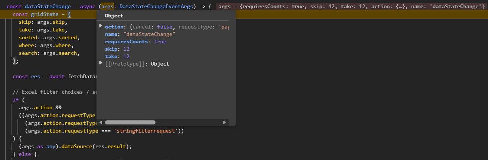
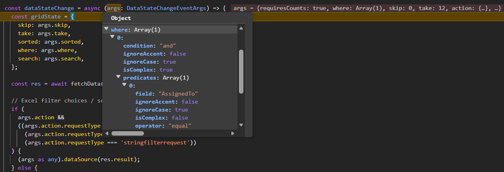
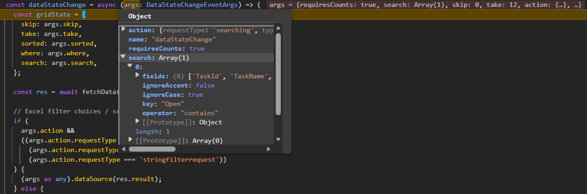
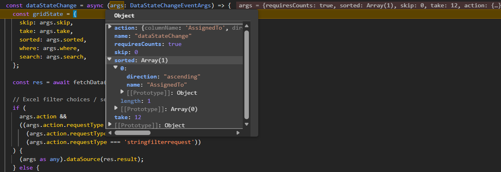
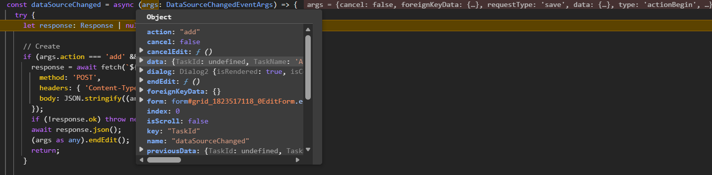
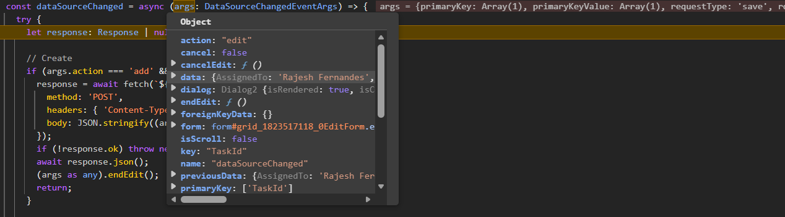

# Connecting the React Grid with Flask API

[Flask](https://flask.palletsprojects.com/en/stable/) is a lightweight and flexible Python web application framework that provides a simple set of features for building REST APIs quickly. Flask follows a traditional REST API approach with multiple endpoints for different data operations.

**Application architecture:**
- **Backend**: Flask server (Python) - Handles REST API endpoints, task data CRUD operations, and business logic.
- **Frontend**: React application - Displays the Syncfusion DataGrid UI with **custom binding** for seamless data binding.
- **Data Model**: Task Management System with comprehensive task information.

## Prerequisites

| Software / Package          | Recommended version          | Purpose                                 |
|-----------------------------|------------------------------|--------------------------------------   |
| Python                      | 3.8 or later                 | Runtime for Flask server                |
| Flask                       | 2.0 or later                 | REST API framework                      |
| Flask-CORS                  | 3.0 or later                 | Enable cross-origin requests            |
| Node.js                     | 20.x LTS or later            | Runtime for React client                |
| npm / yarn / pnpm           | 11.x or later                | Package manager                         |
| TypeScript                  | 5.x or later                 | Client-side type safety                 |
| Vite                        | 7.3.1 or later               | React build tool                        |

## Key topics

| # | Topics | Link |
|---|---------|-------|
| 1 | Setting up and configuring the Flask backend using Python | [View](#setting-up-the-flask-backend-using-python) |
| 2 | Performing data operations in server with filtering, searching, sorting, and paging for efficient data processing | [View](#perform-data-operations-in-server) |
| 3 | Performing CRUD operations in server with REST endpoints | [View](#perform-crud-operations-in-server) |
| 4 | Connecting Syncfusion React Grid with Flask API and configuring Syncfusion Grid with custom binding | [View](#connecting-syncfusion-react-grid-with-flask-api) |
| 5 | Running the application by starting servers locally and accessing the frontend | [View](#run-the-application) |
| 6 | Exploring a complete working sample in the complete sample repository on GitHub | [View](#complete-sample-repository) |

## Setting up the Flask backend using Python

The Flask backend acts as the central REST API service, handling HTTP requests and responses that power the Syncfusion React Grid.

### Step 1: Create the Flask server and install required packages

Before configuring the Flask API, a proper project structure must be created to host the backend server. This folder will contain the server configuration, required dependencies, and sample data used for processing API requests.

For this implementation, a Flask server is created to manage a **Task Management System** with comprehensive task data including task names, assignments, due dates, status, priority, and estimated hours.

**Create project root folder:**

Open a terminal (for example, an integrated terminal in Visual Studio Code, Windows Command Prompt opened with <kbd>Win+R</kbd>, or macOS Terminal launched with <kbd>Cmd+Space</kbd>) and run the following commands.

```bash
mkdir react-grid-flask-api
cd react-grid-flask-api
```

**Create backend server folder:**

Create a new server folder for organizing the Flask application.

```bash
mkdir server
cd server
```

**Create a virtual environment (recommended):**

```bash
python -m venv venv
# On Windows
venv\Scripts\activate
# On macOS/Linux
source venv/bin/activate
```

**Install required packages:**

Run the following commands in the terminal window (ensure it is in the **server** directory) to install the required packages.

```bash
pip install flask flask-cors
```

**Package descriptions:**
- **flask** – Web framework for building REST APIs and defining HTTP routes.
- **flask-cors** – Enables cross-origin requests from the React client to the Flask server.

The **server** folder is now created with all required dependencies installed. The project is ready for setting up API routes and implementing handler logic.

**Current folder structure:**

```
react-grid-flask-api/
├── server/
│   └── venv/
```

### Step 2: Create the Flask application configuration

Create a new Flask application file at **server/app.py** that initializes Flask, sets up middleware, and defines routes.

```python
from flask import Flask, request, jsonify
from flask_cors import CORS
import json, os

app = Flask(__name__)
CORS(app)

# Run Flask development server
if __name__ == "__main__":
    app.run(host="localhost", port=5000, debug=True)
```

The Flask server will start on `http://localhost:5000`.

### Step 3: Create sample data file

Create a new file at **server/task_data.json** with sample task data. This file stores task records in JSON format.

```json
[
  {
    "TaskId": 1,
    "TaskName": "Design Database Schema",
    "AssignedTo": "John Smith",
    "DueDate": "2024-02-15",
    "Status": "In Progress",
    "Priority": "High",
    "EstimatedHours": 8,
    "IsActive": true
  },
  {
    "TaskId": 2,
    "TaskName": "Implement API Endpoints",
    "AssignedTo": "Sarah Johnson",
    "DueDate": "2024-02-20",
    "Status": "Open",
    "Priority": "Critical",
    "EstimatedHours": 16,
    "IsActive": true
  },
  . . . 
  . . .
  . . .
]
```

## Perform data operations in server

The Flask backend handles all data operations such as filtering, searching, sorting, and paging. These operations are applied to the dataset based on the grid state received from the client. Each operation transforms the data progressively to provide the exact result set needed for display in the Grid.

Open the Flask **app.py** file and define helper functions to manage individual data operations. These functions collectively handle Grid requests and return the corresponding data responses

### Filtering

Filtering allows to narrow down the data based on certain conditions. It is done by applying specific rules or criteria to include only the records that match those rules while excluding all others.

The Flask backend evaluates filter predicates received from the Grid. Predicates support comparison operators like equal, notequal, greaterthan, lessthan, startswith, endswith, and contains. Complex filtering allows combining multiple predicates with logical operators (and/or).

**Simple predicate evaluation:**

A simple predicate consists of a single condition that compares a field value against a specified value using an operator:

```python
def eval_simple_predicate(item, predicate):
    field = predicate.get("field")
    op = (predicate.get("operator") or "equal").lower()
    value = predicate.get("value")
    ignore_case = predicate.get("ignoreCase", True)
    ignore_accent = predicate.get("ignoreAccent", False)
    left = item.get(field)
    left_t = coerce_value(field, left)
    right_t = coerce_value(field, value)
    return compare(op, left_t, right_t, ignore_case, ignore_accent)
```

**Complex predicate evaluation:**

Complex predicates contain nested predicates combined with a condition (and/or). They enable sophisticated filtering scenarios:

```python
def eval_complex_predicate(item, predicate):
    condition = (predicate.get("condition") or "and").lower()
    nested_predicates = predicate.get("predicates", [])
    results = []
    for p in nested_predicates:
        if p.get("isComplex"):
            results.append(eval_complex_predicate(item, p))
        else:
            results.append(eval_simple_predicate(item, p))
    return all(results) if condition == "and" else any(results)
```

**Apply filtering to dataset:**

Iterates through all rows and evaluates each predicate (simple or complex) to determine which records match the filter criteria:

```python
def apply_filter(rows, where):
    if not where:
        return rows
    def match(item):
        if len(where) == 1 and where[0].get("isComplex"):
            return eval_complex_predicate(item, where[0])
        checks = []
        for predicate in where:
            if predicate.get("isComplex"):
                checks.append(eval_complex_predicate(item, predicate))
            else:
                checks.append(eval_simple_predicate(item, predicate))
        return all(checks)
    return [r for r in rows if match(r)]
```

### Searching

Searching allows to find records that contain specific keywords. It scans across specified fields and displays only the matching rows, making it easier to locate specific information within large datasets.

```python
def apply_search(rows, search):
    if not search:
        return rows
    result = rows
    for s in search:
        key = str(s.get("key", ""))
        fields = s.get("fields", [])
        operator = (s.get("operator") or "contains").lower()
        ignore_case = s.get("ignoreCase", True)
        ignore_accent = s.get("ignoreAccent", False)

        norm_key = key.lower() if ignore_case else key
        if ignore_accent:
            norm_key = _strip_accents(norm_key)

        filtered = []
        for item in result:
            found = False
            for field in fields:
                val = item.get(field)
                if val is None:
                    continue
                sval = str(val)
                if ignore_case:
                    sval = sval.lower()
                if ignore_accent:
                    sval = _strip_accents(sval)

                if operator == "contains" and norm_key in sval:
                    found = True
                    break
                if operator == "startswith" and sval.startswith(norm_key):
                    found = True
                    break
                if operator == "endswith" and sval.endswith(norm_key):
                    found = True
                    break
                if operator == "equal" and sval == norm_key:
                    found = True
                    break
            if found:
                filtered.append(item)
        result = filtered
    return result
```

### Sorting

Sorting allows to arrange records by one or more columns in ascending or descending order. Multi-column sorting is supported, where records are first sorted by the primary column, then by secondary columns for equal values.

```python
def apply_sort(rows, sorted_rules):
    if not sorted_rules:
        return rows
    result = rows[:]
    for rule in reversed(sorted_rules):
        name = rule.get("name")
        direction = (rule.get("direction") or "ascending").lower()
        reverse = direction == "descending"
        def key_fn(x):
            return coerce_value(name, x.get(name))
        result.sort(key=key_fn, reverse=reverse)
    return result
```

### Paging

Paging divides large datasets into smaller, manageable pages based on offset and page size. This allows to display data efficiently without loading all records at once, significantly improving performance when handling large datasets.

```python
def apply_paging(rows, skip, take):
    skip = int(skip or 0)
    if take in (None, "", 0):
        return rows
    return rows[skip: skip + int(take)]
```

### GET request endpoint

The Flask GET endpoint retrieves task data with applied filtering, searching, sorting, and paging operations. The endpoint accepts a grid state parameter containing all operation details and returns the result in the standardized format.

Ensure the response follows a structured format that includes both the current view dataset and the total data count. This approach supports on-demand data loading and enables the client to handle operations such as paging or filtering effectively when using Syncfusion custom binding.

The required response format includes:

- **result**: The list of data displayed in the current view, supporting on-demand loading for large datasets.
- **count**: The total count of records in the dataset before paging is applied.

```python
@app.get("/tasks")
def list_tasks():
    grid_state_raw = request.args.get("gridState")
    try:
        grid_state = json.loads(grid_state_raw) if grid_state_raw else {}
    except Exception:
        grid_state = {}

    filter_predicates = grid_state.get("where") or []
    search_queries = grid_state.get("search") or []
    sort_descriptors = grid_state.get("sorted") or []
    skip = grid_state.get("skip", 0)
    take = grid_state.get("take", 0)
    requires_counts = bool(grid_state.get("requiresCounts"))

    result = tasks
    result = apply_filter(result, filter_predicates)
    result = apply_search(result, search_queries)
    total_count = len(result)
    result = apply_sort(result, sort_descriptors)
    result = apply_paging(result, skip, take)

    if requires_counts:
        return jsonify({"result": result, "count": total_count})
    return jsonify(result)
```

This endpoint processes all Grid operations in sequence:
1. **Filter**: Apply filter predicates to exclude non-matching records.
2. **Search**: Apply search queries across specified fields.
3. **Count**: Calculate total count before paging (for pagination info).
4. **Sort**: Arrange records by sort descriptors.
5. **Page**: Extract the specific page using skip and take parameters.

## Perform CRUD operations in server

CRUD operations are handled by the controllers and routed through corresponding API endpoints. These operations allow the frontend to manipulate data stored on the server through dedicated REST API endpoints.

### Insert

Insert operation creates a new task record in the dataset. When the `Add` button is clicked and submits the new record, this endpoint receives the data and persists it.

```python
@app.post("/tasks")
def create_task():
    row = request.get_json(silent=True) or {}
    if not row.get(PRIMARY_KEY):
        max_id = max((r.get(PRIMARY_KEY, 0) for r in tasks), default=0)
        row[PRIMARY_KEY] = int(max_id) + 1
    tasks.append(row)
    save_tasks(tasks)
    return jsonify(row), 201
```

The "create_task" function receives the new task data from the client, generates a unique primary key if not provided, appends it to the tasks list, persists the data to the JSON file, and returns the created record with HTTP status 201 (Created).

### Update

Update operation modifies an existing task record in the dataset. When the `Edit` button is clicked , modifies the record, and submits the changes, this endpoint receives the updated data and applies the modifications.

```python
@app.put("/tasks/<int:item_id>")
def update_task(item_id: int):
    row = request.get_json(silent=True) or {}
    for i, current in enumerate(tasks):
        if int(current.get(PRIMARY_KEY)) == int(item_id):
            row[PRIMARY_KEY] = item_id
            tasks[i] = row
            save_tasks(tasks)
            return jsonify(row)
    return jsonify({"message": "not found"}), 404
```

The "update_task" function locates the existing record by its primary key, replaces it with the updated data, persists the changes to the JSON file, and returns the updated record. If the record is not found, it returns a 404 error.

### Delete

Delete operation removes a task record from the dataset. When a record is selected and the `Delete` button is clicked, this endpoint receives the primary key and removes the corresponding record.

```python
@app.delete("/tasks/<int:item_id>")
def delete_task(item_id: int):
    for i, current in enumerate(tasks):
        if int(current.get(PRIMARY_KEY)) == int(item_id):
            deleted = tasks.pop(i)
            save_tasks(tasks)
            return jsonify(deleted)
    return jsonify({"message": "not found"}), 404
```

The "delete_task" function finds the record by its primary key, removes it from the tasks list, persists the changes to the JSON file, and returns the deleted record. If the record is not found, it returns a 404 error.

### Running the Flask server

To run the Flask application, execute the following command in the **server** directory:

```bash
python app.py
```

The server will start on `http://localhost:5000` and the tasks endpoint is `http://localhost:5000/tasks`.

## Connecting Syncfusion React Grid with Flask API

Create a new React application using Vite, which provides a faster development environment and optimized builds.

### Step 1: Create React application

Create a new React application using Vite:

```bash
npm create vite@latest client -- --template react-ts
cd client
npm install
```

### Step 2: Install Syncfusion packages

Install the Syncfusion React Grid and DataManager packages:

```bash
npm install @syncfusion/ej2-react-grids --save
npm install @syncfusion/ej2-data --save
```

### Step 3: Include Syncfusion styles

Include the required CSS files in the **src/index.css** file:

```css
@import '../node_modules/@syncfusion/ej2-base/styles/bootstrap5.3.css';  
@import '../node_modules/@syncfusion/ej2-buttons/styles/bootstrap5.3.css';  
@import '../node_modules/@syncfusion/ej2-calendars/styles/bootstrap5.3.css';  
@import '../node_modules/@syncfusion/ej2-dropdowns/styles/bootstrap5.3.css';  
@import '../node_modules/@syncfusion/ej2-inputs/styles/bootstrap5.3.css';  
@import '../node_modules/@syncfusion/ej2-navigations/styles/bootstrap5.3.css';
@import '../node_modules/@syncfusion/ej2-popups/styles/bootstrap5.3.css';
@import '../node_modules/@syncfusion/ej2-splitbuttons/styles/bootstrap5.3.css';
@import '../node_modules/@syncfusion/ej2-notifications/styles/bootstrap5.3.css';
@import '../node_modules/@syncfusion/ej2-react-grids/styles/bootstrap5.3.css';
```

For this project, the "Bootstrap 5.3" theme is applied. Other themes can be selected, or the existing theme can be customized to meet specific project requirements. For detailed guidance on theming and customization, refer to the [Syncfusion React Components Appearance](https://ej2.syncfusion.com/react/documentation/appearance/theme-studio) documentation.

### Step 4: Create the Grid component

Create a new React component in **client/src/App.tsx** that renders the Syncfusion Grid. This component will serve as the base for integrating custom binding and data operations.

```ts
import { useEffect, useRef } from 'react';
import { GridComponent, ColumnsDirective, ColumnDirective } from '@syncfusion/ej2-react-grids';

export default function App() {
  const gridRef = useRef<GridComponent | null>(null);

  return (
    <GridComponent ref={gridRef} dataSource= {[]}>
      <ColumnsDirective>
        <ColumnDirective field="TaskId" headerText="ID" isPrimaryKey={true} visible={false} />
        <ColumnDirective field="TaskName" headerText="Task" width="200" />
        <ColumnDirective field="AssignedTo" headerText="Assigned To" width="160" />
        <ColumnDirective field="DueDate" headerText="Due Date" type="date" format="yMd" width="130" />
        <ColumnDirective field="Status" headerText="Status" width="140" />
        <ColumnDirective field="Priority" headerText="Priority" width="80" />
        <ColumnDirective field="EstimatedHours" headerText="Est. Hours" textAlign="Right" width="80" />
        <ColumnDirective field="IsActive" headerText="Active" textAlign="Center" type="boolean" width="100" />
      </ColumnsDirective>
    </GridComponent>
  );
}
```

### Step 5: Integrate Syncfusion React Grid with custom binding

The Syncfusion React Grid custom databinding feature seamlessly integrates with external API services. When Grid actions such as paging, sorting, filtering, or CRUD operations are performed, requests are sent to the API. The API processes these operations and returns the results in the required format, giving complete control over application-specific workflows and enabling efficient handling of large datasets. The custom databinding feature interacts with backend APIs through two key events.

- **[dataStateChange](https://ej2.syncfusion.com/react/documentation/api/grid/index-default#datastatechange)**: Triggered when the Grid performs actions such as paging, sorting, or filtering. It provides the current state details (skip, take, sorted, where, search), which are sent to the API so the request can be processed and data returned in the required `{ result:[], count:100 }` format.

- **[dataSourceChanged](https://ej2.syncfusion.com/react/documentation/api/grid/index-default#datasourcechanged)**: Triggered during CRUD operations (Create, Update, Delete). It provides the affected record along with the action type, which is sent to the API to execute the corresponding insert, update, or delete operation.

Since the `dataStateChange` event does not fire on the first render, use the React `useEffect` hook to load the initial dataset when the component mounts. In the Grid component, define a "fetchData" function to send the grid state to the Flask API and bind the returned data.

Here's a example of implementing the initial data load with `useEffect`:

```ts
import { useEffect, useRef } from 'react';
import { GridComponent, ColumnsDirective, ColumnDirective } from '@syncfusion/ej2-react-grids';

export default function App() {
  const gridRef = useRef<GridComponent | null>(null);
  const API_BASE = 'http://localhost:5000';

  // Initial load
  useEffect(() => {
    const initialState = { skip: 0, take: 12, sorted: [], where: [], search: [] };
    fetchData(initialState)
      .then((res) => {
        if (gridRef.current) {
          gridRef.current.dataSource = res.result; // { result, count }
        }
      })
      .catch((e) => console.error(e));
  }, []);

  const fetchData = async (gridState: any) => {
    const stateWithCount = { requiresCounts: true, ...gridState };
    const url = `${API_BASE}/tasks?gridState=${encodeURIComponent(JSON.stringify(stateWithCount))}`;

    const response = await fetch(url, { 
      method: 'GET', 
      headers: { 'Content-Type': 'application/json' } 
    });

    if (!response.ok) {
      const text = await response.text();
      throw new Error(`HTTP ${response.status}: ${text}`);
    }

    return (await response.json()) as { result: any[]; count: number };
  };

  return (
    <div>
      <GridComponent
        ref={gridRef}
      >
        <ColumnsDirective>
          {/* Columns will be added here */}
        </ColumnsDirective>
      </GridComponent>
    </div>
  );
}
```

This component includes the `useEffect` hook that loads the initial data when the component mounts. The "initialState" object defines the starting grid state with default values for skip (0), take (12), and empty arrays for sorting, filtering, and searching. The "fetchData" function sends the grid state to the Flask API via a GET request and retrieves the data in the required format.

**API response format:**
The Grid custom binding feature expects the following response from the backend:

```typescript
{ "result": [ /* records to display */ ], "count": 100 }
```

This format has already been implemented in the Flask server during the backend setup.

### Step 6: Configure data operations with custom binding

The `dataStateChange` event is the primary mechanism for handling Grid state changes like paging, sorting, filtering, and searching. This event is triggered whenever the Grid state changes and provides the current state details that need to be sent to the server.

The event handler is responsible for:
1. Collecting the current grid state (skip, take, sorted, where, search).
2. Sending this state to the Flask API via a GET request.
3. Processing the response and binding data to the Grid.
4. Handling special cases like filter dropdown requests.

Configure the Grid to use the `dataStateChange` event handler by adding it as a property:

```ts
import { GridComponent, ColumnsDirective, ColumnDirective } from '@syncfusion/ej2-react-grids';
import type { DataStateChangeEventArgs } from '@syncfusion/ej2-react-grids';

export default function App() {
  const gridRef = useRef<GridComponent | null>(null);
  const API_BASE = 'http://localhost:5000';

  const dataStateChange = async (args: DataStateChangeEventArgs) => {
    const gridState = {
      skip: args.skip,
      take: args.take,
      sorted: args.sorted,
      where: args.where,
      search: args.search,
    };

    const res = await fetchData(gridState);

    // Excel filter choices / search in popup
    if (
      args.action &&
      ((args.action.requestType === 'filterchoicerequest') ||
        (args.action.requestType === 'filterSearchBegin') ||
        (args.action.requestType === 'stringfilterrequest'))
    ) {
      (args as any).dataSource(res.result);
    } else {
      // Bind main grid data: expects { result, count }
      if (gridRef.current) {
        gridRef.current.dataSource = res.result;
      }
    }
  };

  return (
    <div>
      <GridComponent
        ref={gridRef}
        dataStateChange={dataStateChange}
      >
        <ColumnsDirective>
          {/* Columns will be added here */}
        </ColumnsDirective>
      </GridComponent>
    </div>
  );
}
```

The `dataStateChange` event handler collects the current grid state parameters (skip, take, sorted, where, search) from the event arguments and passes them to the "fetchData" function. The response is then bound to the Grid's dataSource. The handler also checks if the request is for filter dropdown choices or search popup data and handles those cases separately by calling the dataSource callback.

### Step 7: Configure CRUD operations with custom binding

The `dataSourceChanged` event is triggered during CRUD operations. This event provides the affected record along with the action type, which is sent to the Flask API to execute the corresponding operation.

The event handler is responsible for:
1. Identifying the type of operation (add, edit, or delete).
2. Extracting the record data from the event arguments.
3. Sending the appropriate HTTP request (POST for insert, PUT for update, DELETE for delete).
4. Calling `endEdit()` to notify the Grid that the operation is complete.

Configure the Grid to use the `dataSourceChanged` event handler by adding it as a property:

```ts
import { GridComponent, ColumnsDirective, ColumnDirective } from '@syncfusion/ej2-react-grids';
import type { DataSourceChangedEventArgs } from '@syncfusion/ej2-react-grids';

export default function App() {
  const gridRef = useRef<GridComponent | null>(null);
  const API_BASE = 'http://localhost:5000';

  const dataSourceChanged = async (args: DataSourceChangedEventArgs) => {
    try {
      let response: Response | null = null;

      // Create
      if (args.action === 'add' && args.requestType === 'save') {
        response = await fetch(`${API_BASE}/tasks`, {
          method: 'POST',
          headers: { 'Content-Type': 'application/json' },
          body: JSON.stringify((args as any).data),
        });
        if (!response.ok) throw new Error('Create failed');
        await response.json();
        (args as any).endEdit();
        return;
      }

      // Update
      if (args.action === 'edit' && args.requestType === 'save') {
        const data: any = (args as any).data;
        const id = data?.TaskId;
        response = await fetch(`${API_BASE}/tasks/${id}`, {
          method: 'PUT',
          headers: { 'Content-Type': 'application/json' },
          body: JSON.stringify(data),
        });
        if (!response.ok) throw new Error('Update failed');
        await response.json();
        (args as any).endEdit();
        return;
      }

      // Delete
      if (args.requestType === 'delete') {
        const payload: any = (args as any).data;
        const id = Array.isArray(payload) ? payload[0]?.TaskId : payload?.TaskId;
        response = await fetch(`${API_BASE}/tasks/${id}`, { method: 'DELETE' });
        if (!response.ok) throw new Error('Delete failed');
        await response.json();
        (args as any).endEdit();
        return;
      }
    } catch (err) {
      console.error(err);
    }
  };

  return (
    <div>
      <GridComponent
        ref={gridRef}
        dataSourceChanged={dataSourceChanged}
      >
        <ColumnsDirective>
          {/* Columns will be added here */}
        </ColumnsDirective>
      </GridComponent>
    </div>
  );
}
```

The `dataSourceChanged` event handler checks the action type from the event arguments to determine whether a create, update, or delete operation is being performed. For insert operations, a POST request is sent to the "/tasks" endpoint with the new record data. For update operations, a PUT request is sent to "/tasks/{id}" with the modified data. For delete operations, a DELETE request is sent to "/tasks/{id}" to remove the record. After each operation completes successfully, the `endEdit()` method is called to notify the Grid that the operation is complete.

### Step 8: Enable Paging

The paging feature divides Grid records into multiple pages, improving performance and usability when handling large datasets. Enable paging by setting the [allowPaging](https://ej2.syncfusion.com/react/documentation/api/grid#allowpaging) property to `true` and injecting the `Page` module. Customize pager behavior using the [pageSettings](https://ej2.syncfusion.com/react/documentation/api/grid#pagesettings) property.

```ts
import { GridComponent, Page, Inject } from '@syncfusion/ej2-react-grids';

export default function App() {
  const pageSettings: PageSettingsModel = { 
    pageSize: 12, 
    pageSizes: [12, 25, 50, 100] 
  };

  return (
    <GridComponent
      ref={gridRef}
      allowPaging={true}
      pageSettings={pageSettings}
      dataStateChange={dataStateChange}
    >
      <Inject services={[Page]} />
    </GridComponent>
  );
}
```

The image illustrates how the page state is passed to the `skip` and `take` property of the `dataStateChange` event arguments.



### Step 9: Enable Filtering

The filtering feature enables searching and refining Grid records based on column values. Enable filtering by setting the [allowFiltering](https://ej2.syncfusion.com/react/documentation/api/grid#allowfiltering) property to `true` and injecting the `Filter` module. Customize filtering options using the [filterSettings](https://ej2.syncfusion.com/react/documentation/api/grid#filtersettings) property.

```ts
import { GridComponent, Filter, Inject, type FilterSettingsModel } from '@syncfusion/ej2-react-grids';

export default function App() {
  const filterSettings: FilterSettingsModel = { type: 'Excel' };

  return (
    <GridComponent
      ref={gridRef}
      allowFiltering={true}
      filterSettings={filterSettings}
      dataStateChange={dataStateChange}
    >
      <Inject services={[Filter]} />
    </GridComponent>
  );
}
```

The image below illustrates how the filter state is passed to the `where` property of the `dataStateChange` event arguments.



### Step 10: Enable Searching

The search feature in the Grid allows records to be located and filtered using keywords. Enable searching by adding `Search` to the Grid's [toolbar](https://ej2.syncfusion.com/react/documentation/api/grid#toolbar) items and injecting the `Toolbar` module.

```ts
import { GridComponent, Toolbar, Inject, type ToolbarItems } from '@syncfusion/ej2-react-grids';

export default function App() {
  const toolbar: ToolbarItems[] = ['Search'];

  return (
    <GridComponent
      ref={gridRef}
      toolbar={toolbar}
      dataStateChange={dataStateChange}
    >
      <Inject services={[Toolbar]} />
    </GridComponent>
  );
}
```

The image illustrates how the search state is passed to the `search` property of the `dataStateChange` event arguments.



### Step 11: Enable Sorting

The sorting feature allows ordering Grid records by clicking column headers. Enable sorting by setting the [allowSorting](https://ej2.syncfusion.com/react/documentation/api/grid#allowsorting) property to `true` and injecting the `Sort` module.

```ts
import { GridComponent, Sort, Inject } from '@syncfusion/ej2-react-grids';

export default function App() {
  return (
    <GridComponent
      ref={gridRef}
      allowSorting={true}
      dataStateChange={dataStateChange}
    >
      <Inject services={[Sort]} />
    </GridComponent>
  );
}
```

The image illustrates how the sort state is passed to the `sorted` property of the `dataStateChange` event arguments.



### Step 12: Enable CRUD actions

To enable editing functionality directly within the grid, configure the [allowEditing](https://ej2.syncfusion.com/react/documentation/api/grid/editSettingsModel#allowediting), [allowAdding](https://ej2.syncfusion.com/react/documentation/api/grid/editSettingsModel#allowadding), and [allowDeleting](https://ej2.syncfusion.com/react/documentation/api/grid/editSettingsModel#allowdeleting) properties within the [editSettings](https://ej2.syncfusion.com/react/documentation/api/grid#editsettings). Define a primary key column using [isPrimaryKey](https://ej2.syncfusion.com/react/documentation/api/grid/column#isprimarykey), and enable edit actions in the [toolbar](https://ej2.syncfusion.com/react/documentation/api/grid#toolbar).

```ts
import { GridComponent, ColumnsDirective, ColumnDirective, Edit, Toolbar, Inject, type ToolbarItems, type EditSettingsModel } from '@syncfusion/ej2-react-grids';

export default function App() {
  const toolbar: ToolbarItems[] = ['Add', 'Edit', 'Delete', 'Update', 'Cancel', 'Search'];
  
  const editSettings: EditSettingsModel = { 
    allowAdding: true, 
    allowEditing: true, 
    allowDeleting: true, 
    mode: 'Dialog' 
  };

  return (
    <GridComponent
      ref={gridRef}
      toolbar={toolbar}
      editSettings={editSettings}
      dataSourceChanged={dataSourceChanged}
    >
      <ColumnsDirective>
        <ColumnDirective field="TaskId" headerText="ID" isPrimaryKey={true} visible={false} />
        {/* Other columns */}
      </ColumnsDirective>
      <Inject services={[Edit, Toolbar]} />
    </GridComponent>
  );
}
```

Inserted data passed to the server through the `dataSourceChanged` event arguments in the Grid:



Updated data passed to the server through the `dataSourceChanged` event arguments in the Grid:



Deleted data passed to the server through the `dataSourceChanged` event arguments in the Grid:


## Run the application

Both the backend Flask server and the frontend React application need to run simultaneously for the Grid to function properly.

### Prerequisites for running

Before starting the servers, the following must be available:
- Two terminal windows or tabs open (one for backend, one for frontend).
- Both server and client directories created and configured.
- All pip packages installed in the server directory.
- All npm packages installed in the client directory.

### Step 1: Start the Flask backend server

Open the first terminal and navigate to the **server** folder from the project root:

```bash
cd react-grid-flask-api/server
python app.py
```

The server will start on `http://localhost:5000` and the tasks endpoint is `http://localhost:5000/tasks`.

### Step 2: Start the React frontend application

Open a **new terminal** and navigate to the **client** folder from the project root:

```bash
cd react-grid-flask-api/client
npm run dev
```

The React application will start on `http://localhost:5173`.

The complete folder structure look like below.

```
react-grid-flask-api/
├── server/
│   ├── venv/
│   ├── app.py
│   ├── task_data.json
│   └── requirements.txt
│
└── client/
    ├── src/
    │   ├── App.tsx
    │   ├── App.css
    │   ├── index.css
    │   ├── main.tsx
    │   └── assets/
    ├── node_modules/
    ├── package.json
    ├── vite.config.ts
    ├── tsconfig.json
    ├── tsconfig.app.json
    ├── tsconfig.node.json
    ├── eslint.config.js
    ├── index.html
    └── README.md
```

## Complete sample repository

For a complete working implementation, refer to the [GitHub](https://github.com/SyncfusionExamples/syncfusion-react-grid-with-flaskapi-server) repository.

The repository contains the complete Flask backend implementation with all API endpoints, business logic, data models, and a ready-to-run React frontend application.

The application now provides a complete solution for integrating the Syncfusion React Grid with Flask API backend, enabling seamless data operations with a modern, user-friendly interface.

## See also

  - [Types of Edit](https://ej2.syncfusion.com/react/documentation/grid/editing/edit-types)
  - [Validation Rules](https://ej2.syncfusion.com/react/documentation/grid/editing/validation)
  - [Filter Menu](https://ej2.syncfusion.com/react/documentation/grid/filtering/filter-menu)