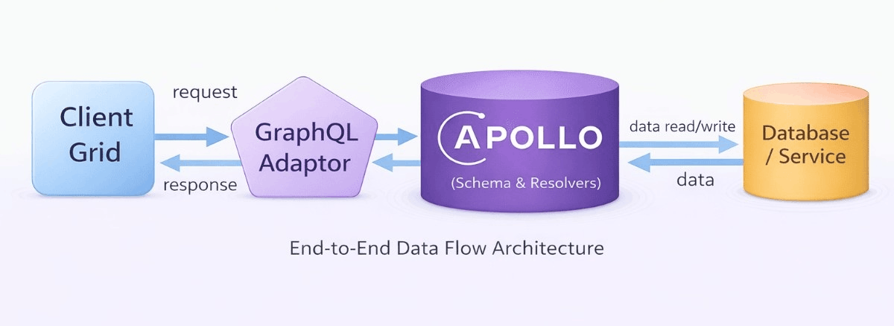
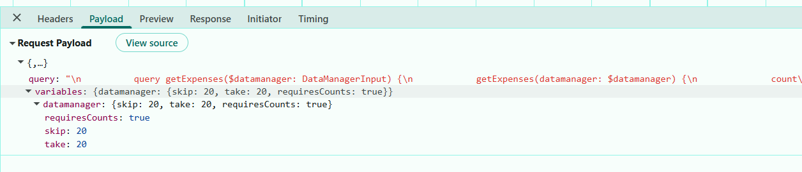
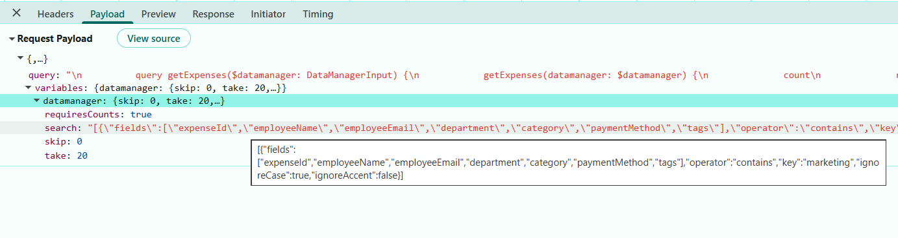
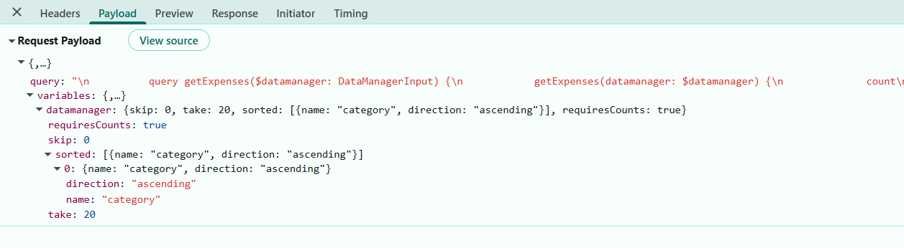
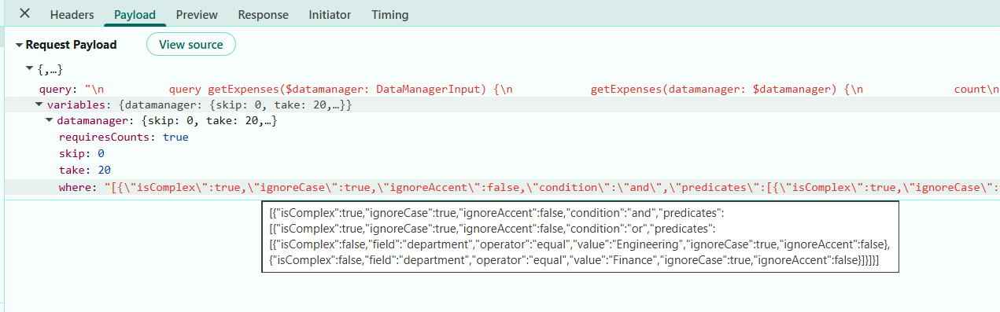
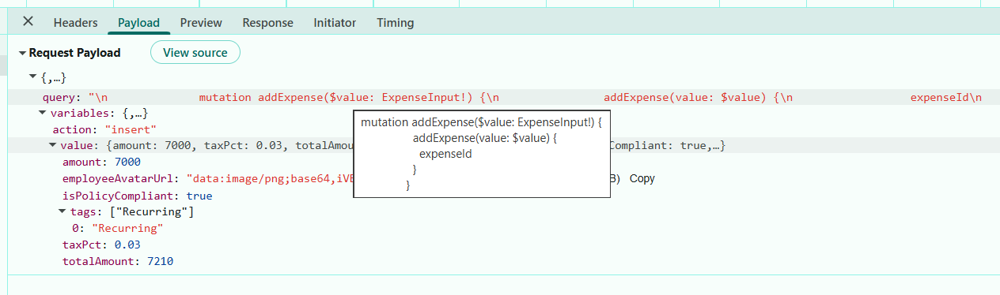
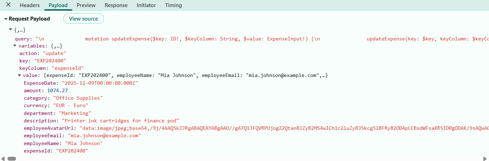
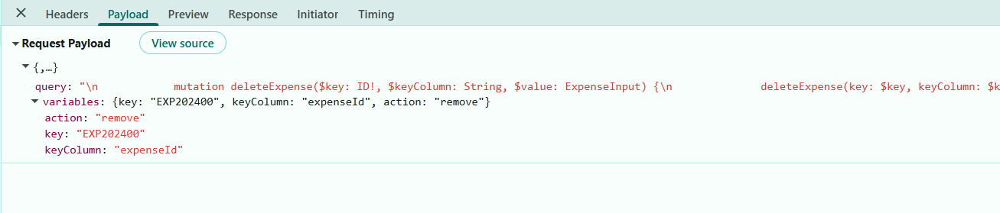

# Connecting the Syncfusion React Grid with GraphQL Backend using Apollo

[GraphQL](https://graphql.org/learn/) is a query language that allows applications to request exactly the data needed, nothing more and nothing less. Unlike traditional REST APIs that return fixed data structures, GraphQL enables the client to specify the shape and content of the response.

**Traditional REST APIs** and **GraphQL** differ mainly in the way data is requested and returned: **REST APIs expose** multiple endpoints that return fixed data structures, often including unnecessary fields and requiring several requests to fetch related data, while **GraphQL** uses a single endpoint where queries define the exact fields needed, enabling precise responses and allowing related data to be retrieved efficiently in one request. This makes **GraphQL** especially useful for **React Grid integration**, the **reason** is data‑centric UI components require well‑structured and selective datasets to support efficient filtering, reduce network calls, and improve overall performance.

**Key GraphQL concepts:**

- **Queries**: A query is a request to read data. Queries do not modify data; they only retrieve it.
- **Mutations**: A mutation is a request to modify data. Mutations create, update, or delete records.
- **Resolvers**: Each query or mutation is handled by a resolver, which is a function responsible for fetching data or executing an operation. **Query resolvers** handle **read operations**, while **mutation resolvers** handle **write operations**.
- **Schema**: Defines the structure of the API. The schema describes available data types, the fields within those types, and the operations that can be executed. Query definitions specify the way data can be retrieved, and mutation definitions specify the way data can be modified. 

**What is Apollo?**

[Apollo](https://www.apollographql.com/docs/) Server is a widely used GraphQL server that simplifies creating efficient and scalable APIs. It offers a clear structure for defining schemas, handling queries, and connecting data sources, making it a strong choice for building modern GraphQL backend.

## Prerequisites

| Software / Package          | Recommended version          | Purpose                                 |
|-----------------------------|------------------------------|--------------------------------------   |
| Node.js                     | 20.x LTS or later            | Runtime                                 |
| npm / yarn / pnpm           | 11.x or later                | Package manager                         | 
| Vite                        | 7.3.1                        | Use this to create the React application |
| TypeScript                  | 5.x or later                 | Server‑side and client‑side type safety |

## Key topics

| # | Topics | Link |
|---|---------|-------|
| 1 | Setting up and configuring the GraphQL backend using Apollo | [View](#setting-up-the-graphql-backend-using-apollo) |
| 2 | Set up the Apollo Server | [View](#step-6-setting-up-the-apollo-server) |
| 3 | Integrating Syncfusion React Grid with Apollo GraphQL | [View](#integrating-syncfusion-react-grid-with-apollo-graphql) |
| 4 | Perform data operations including filtering, sorting, searching, and paging | [View](#step-4-add-toolbar-with-crud-and-search-options) |
| 5 | Perform CRUD operations | [View](#perform-crud-operations) |
| 6 | Run the GraphQL application | [View](#running-the-application) |
| 7 | Explore a complete working sample on GitHub | [View](#complete-sample-repository) |

## Setting up the GraphQL backend using Apollo

The Apollo GraphQL backend acts as the primary data layer, handling all queries and mutations required by the Syncfusion React Grid.

### Step 1: Create the GraphQL server and Install required packages

Before configuring the GraphQL API, a new folder must be created to host the GraphQL server. This folder will contain the server configuration, required dependencies, and sample data used for processing GraphQL queries.

For this guide, a GraphQL server named **GridServer** is created using Node.js and TypeScript.

**Create project folder:**

Open a terminal ( for example, an integrated terminal in Visual Studio Code or Windows Command Prompt opened with <kbd>Win+R</kbd>, or macOS terminal launched with <kbd>Cmd+Space</kbd> ) and run the following command to create and navigate into the project folder:

```bash
mkdir GridServer
cd GridServer
```

**GridServer folder structure:**

The following structure represents the backend GraphQL server implementation. Further details about each file will be explained later.

```
├── GridServer
│   ├── src
│   │   ├── data.ts
│   │   ├── resolvers.ts
│   │   ├── schema.graphql
│   │   ├── server.ts
│   │   └── types.ts
│   │
│   ├── package.json
│   └── tsconfig.json
```

**Configure TypeScript:**

TypeScript configuration tells the compiler to convert TypeScript to JavaScript and sets up the project structure.

Create a new **tsconfig.json** file in the **GridServer** folder using the below command:

```bash
npx tsc --init
```

Replace (**GridServer/tsconfig.json**) file content with the following configuration:

```json
{
  "compilerOptions": {
    "target": "ES2020",
    "module": "NodeNext",
    "moduleResolution": "NodeNext",
    "lib": ["ES2020"],
    "resolveJsonModule": true,
    "esModuleInterop": true,
    "forceConsistentCasingInFileNames": true,
    "skipLibCheck": true,
    "strict": true,
    "rootDir": "src",
    "outDir": "dist"
  },
  "include": ["src"]
}
```

**Install required packages:**

The GraphQL server is set up using `Apollo`, Server packages, along with **TypeScript** development tools, using the following commands.

Run the following commands to install the required packages:

```bash
npm install graphql @apollo/server @graphql-tools/schema graphql-type-json
npm install -D typescript ts-node @types/node
npm install @syncfusion/ej2-data --save
```
- `graphql` – Core GraphQL library used for defining schemas, types, and executing GraphQL operations.
- `@apollo/server` – The official `Apollo` Server package used to create and run a standalone GraphQL server.
- `@graphql-tools/schema` – Helps build executable GraphQL schemas by combining type definitions and resolvers.
- `graphql-type-json` - Adds support for JSON scalar types in GraphQL schemas, enabling structured JSON fields.
- `typescript, ts-node, @types/node` - Enables TypeScript development, type checking, and running TypeScript files.
- `@syncfusion/ej2-data` - Provides data utilities for advanced data operations.

**Create sample datasource:**

After installing the required packages, create a new file named **data.ts** inside the **src** folder. This file serves as an in‑memory data source for the GraphQL server.

```ts
[src/data.ts]

export const expenses= [
  {
    "expenseId": "EXP202401",
    "employeeName": "John Doe",
    "employeeEmail": "john.doe@example.com",
    "employeeAvatarUrl": "https://randomuser.me/api/portraits/men/12.jpg",
    "department": "Finance",
    "category": "Travel",
    "description": "Client meeting travel expenses",
    "amount": 320.50,
    "taxPct": 0.18,
    "totalAmount": 378.19,
    "expenseDate": "2024-05-14T09:22:00Z",
    "paymentMethod": "Credit Card",
    "currency": "USD",
    "reimbursementStatus": "Approved",
    "isPolicyCompliant": true,
    "tags": ["travel", "client", "priority"]
  }
  . . . .
  . . . .
  . . . .
]
```
The **GridServer** folder is now created, required packages are installed, and a sample data source is configured. The project is ready for defining the GraphQL schema, resolvers, and server configuration.


### Step 2: Configuring schema in GraphQL

The GraphQL schema defines the structure of the "expense" data model and the server‑side operations available for performing CRUD actions.

**Instructions:**

1. Create a new schema file (**src/schema.graphql**) in the **GridServer** folder.
2. Add type definition for "Expense" type:

    ```
    #--- Expense type definition ---
    type Expense {
      expenseId: ID!
      employeeName: String!
      #include additional fields
    }
    ```
3. Add type definition for "ReturnType" type:

    ```
    # --- Return type for Grid paging ---
    type ReturnType {
      result: [Expense!]!
      count: Int!
    }
    ```
4. Add type definition for "SortInput":

    ```
    input SortInput {
      name: String!
      direction: String!
    }
    ```
5. Add type definition for "ExpenseInput":

    ```
    input ExpenseInput {
      expenseId: ID
      employeeName: String
      #include additional fields
    }
    ```
6. Add type definition for "FilterInput":

    ```
    input FilterInput {
      field: String!
      operator: String!
      value: String
      predicate: String
      matchCase: Boolean
    }
    ```
7. Add type definition for "DataManagerInput":

    ```
    # Add additional parameters (e.g., group, aggregates) here if needed
    input DataManagerInput {
      skip: Int
      take: Int
      requiresCounts: Boolean
      sorted: [SortInput!]
      filtered: [FilterInput!]
      where: JSON
      search: String
      params: JSON
    }
    ```
    > For detailed information about **DataManagerInput** type refer to [Configuring Syncfusion DataManagerInput schema](#step-3-configuring-syncfusion-datamanagerinput-schema)

8. Define the `Query` type to expose the "getExpenses" operation that returns the list of "expenses":

    ```
    type Query {
      getExpenses(datamanager: DataManagerInput): ReturnType!
    }
    ```
9. Define Mutation types for CRUD operations:

    ```
    type Mutation {
      addExpense(value: ExpenseInput!): Expense!
      updateExpense(key: ID!, keyColumn: String, value: ExpenseInput!): Expense!
      deleteExpense(key: String!, keyColumn: String): Expense!
    }
    ```
    **Key Parameters Definitions:**
    - **key**: The unique identifier (primary key) of the expense to be updated.
    - **keyColumn**: The name of the column containing the unique identifier.
    - **value**: An object containing the created or updated expense details.

### Step 3: Configuring Syncfusion DataManagerInput schema

Syncfusion Grid sends all operation details paging, sorting, filtering, and searching as a single request object. GraphQL requires a clear, typed structure to understand these values. 

Syncfusion's [DataManager](https://ej2.syncfusion.com/react/documentation/data/getting-started) follows a fixed schema when sending operation details from the client. To ensure seamless integration, the GraphQL backend defines a corresponding input type that mirrors this structure.

**DataManagerInput** serves as the input type that matches the structure of the `DataManager` request, ensuring that all operation details are correctly received by the GraphQL API.

**Purpose:** The **DataManagerInput** schema provides a standard format for delivering Grid operation parameters to the GraphQL server.This structure allows the backend to return only the required records, improving performance, reducing payload size, and enabling efficient data handling.

Here are the details of **DataManagerInput** parameter type.

| Parameters       | Description                                                                     |
| ---------------- | ------------------------------------------------------------------------------- |
| `requiresCounts` | If it is `true` then the total count of records will be included in response. |
| `skip`           | Holds the number of records to skip.                                            |
| `take`           | Holds the number of records to take.                                            |
| `sorted`         | Contains details about current sorted column and its direction.                 |
| `where`          | Contains details about current filter column name and its constraints.          |
| `group`          | Contains details about current Grouped column names.                            |
| `search`         | Contains details about current search data.                                     |
| `aggregates`     | Contains details about aggregate data.                                          |

Use this **DataManagerInput** in the "getExpenses" query to access the parameters sent from the client, allowing the GraphQL server to handle these operations in a consistent and unified way.

### Step 4: GraphQL - Query resolvers

A resolver in GraphQL is a function responsible for fetching the data for a specific field in a GraphQL schema.

When a client sends a GraphQL query, resolvers run behind the scenes to retrieve the requested information from a database, API, or any data source and return it in the format defined by the schema. 

**Instructions:**

1. Create a new resolver file (**src/resolvers.ts**) inside the **GridServer** folder.
2. Import the required data source (**e.g., expenses**) from the data file.
3. Implement the "getExpenses" resolver to handle the logic for the "getExpenses" query defined in the schema.
4. Ensure the resolver returns the processed list of "expenses" in the structure specified by the schema.

```ts
import { expenses } from './data';
import { DataManager, Query } from '@syncfusion/ej2-data';
import { ExpenseRecord } from './types';
import GraphQLJSON from 'graphql-type-json';

export const resolvers = {
  JSON: GraphQLJSON,
  Query: {
    getExpenses: (_: unknown, { datamanager }: GetExpensesArgs) => {
          let data: ExpenseRecord[] = [...expenses];
          const query = new Query();     
          // Apply search, filter, sort, and paging operations as provided by the Grid.
          // Operations are applied sequentially: search → filter → sort → paging.
          let result = data
          let count = data.length
          return {
            result, count
          };
        },
  }
}
```

### Step 5: GraphQL - Mutation resolvers

Mutations in GraphQL are used to modify data on the server, such as creating, updating, or deleting records.

Previously, the CRUD mutation types were defined in the **schema.graphql** file. The next step is to implement these mutation actions inside the **resolver.ts** file.

**Instructions:**

1. Open the (**src/resolvers.ts**) file.
2. Implement the "addExpense" mutation.

    ```ts
    import { ExpenseRecord } from './types';
    import GraphQLJSON from 'graphql-type-json';

    export const resolvers = {
      JSON: GraphQLJSON,
      Query: {
        .  .  .
        .  .  .
        .  .  .
      },
      Mutation: {
            /**
             * Create a new expense.
            * @param _ - Unused, kept for GraphQL resolver signature consistency.
            * @returns The newly created expense object.
            */
            addExpense: (_: unknown, { value }: { value: ExpenseInput }): ExpenseRecord => { 
              expenses.push(value as ExpenseRecord);
              return value as ExpenseRecord;
            },
        }
      }
    }
    ```

    **"addExpense" - code breakdown:**

    | Step | Purpose | Implementation |
    |------|---------|-----------------|
    | **1. Receive Input** | Accept "expense" details from the client. | Resolver gets `value` in "addExpense(_: unknown, { value })". |
    | **2. Insert Expense** | Add the incoming "expense" to the existing list. | Calls "expenses.push(value)". |
    | **3. Return Added Expense** | Provide the newly added "expense" back to the client. | Returns the same value object. |

3. Implement the "updateExpense" mutation.

    ```ts
    Mutation: {
        /**
         * Update an existing expense by a dynamic key column.
        *
        * @param _parent - Unused, kept for GraphQL resolver signature consistency.
        * @param key - The lookup key value (e.g., an expenseId or other field).
        * @param keyColumn - The field name to match against (defaults to "expenseId").
        * @param value - Partial fields to merge into the existing expense.
      */
        updateExpense: (_parent: unknown,{ key, keyColumn = "expenseId", value }: ExpenseArgs): ExpenseRecord => {
          const expense = expenses.find(
            (e: ExpenseRecord | any) => String(e[keyColumn]) === String(key)
          );
          if (!expense) throw new Error("Expense not found");
          Object.assign(expense, value);
          return expense;
        },

      }
    ```

    **"updateExpense" - code breakdown:**

    | Step | Purpose | Implementation |
    |------|---------|-----------------|
    | **1. Receive Input** | Accept the key, keyColumn, and fields to update. | Resolver parameters: `key`, `keyColumn`, and `value`. |
    | **2. Locate Record** | Find the "expense" that matches the provided key. | `find((e: ExpenseRecord \| any) => String(e[keyColumn]) === String(key))` |
    | **3. Validate Match** | Ensure the target "expense" exists. | `if (!expense) throw new Error("Expense not found");` |
    | **4. Apply Updates** | Merge new field values into the located "expense". | `Object.assign(expense, value)` performs in‑place update. |
    | **5. Return Updated** | Send back the modified "expense" to the client. | return `expense` object with all updates applied. |

4. Implement the "deleteExpense" mutation.

    ```ts
        /**
         * Delete an existing expense by a dynamic key column.
        *
        * @param _parent - Unused, kept for GraphQL resolver signature consistency.
        * @param key - The lookup key value (e.g., an expenseId or other field).
        * @param keyColumn - The field name to match against (defaults to "expenseId").
        * @returns The deleted expense object.
      */
        deleteExpense: (_parent: unknown, { key, keyColumn = 'expenseId' }: ExpenseArgs) => {
          const index = expenses.findIndex((e: ExpenseRecord | any) => String(e[keyColumn]) === String(key));
          if (index === -1) throw new Error('Expense not found');
          const [removed] = expenses.splice(index, 1);
          /* Return the Expense directly to match `Expense!` */
          return removed;
        }
    ```
    **"deleteExpense" - code breakdown:**

    | Step | Purpose | Implementation |
    |------|---------|-----------------|
    | **1. Receive Key** | Backend receives only the primary key value from client. | Resolver parameters: `key`, `keyColumn` = '`expenseId` |
    | **2. Locate Index** | Identify the array index of the target record using the dynamic key column. | `findIndex((e: ExpenseRecord) => String(e[keyColumn]) === String(key))` |
    | **3. Validate Existence** | Ensure a matching record exists before deletion | `if(index === -1) throw new Error('Expense not found')` check |
    | **4. Remove Record** | Delete the record from the data source at the located index | `const [removed] = expenses.splice(index, 1);` |
    | **5.  Return Deleted** | Provide the removed record back to the client | return `removed` |


### Step 6: Setting up the Apollo server

**Instructions:**

1. Create a new (**src/server.ts**) file. This file serves as the main entry point for the GraphQL backend when using `Apollo` Server.
    - It initializes and configures the GraphQL backend by loading the schema and resolvers, combining them into an executable schema, and starting the `Apollo` Server. 
    - This file acts as the central entry point that sets up the entire GraphQL application. It ensures the server runs, listens on a port, and exposes the GraphQL API endpoint.

2. Follow the steps below to implement the server:

    - **Load the GraphQL schema:** Import the **schema.graphql** schema file and load its type definitions.
    - **Load the resolvers:** Bring in the resolver functions that implement the behavior for each field in the schema.
    - **Create an executable GraphQL schema**: Combine the schema and resolvers using the predefined makeExecutableSchema function from GraphQL Tools.
    - **Start the Apollo GraphQL server:** Initialize `Apollo` Server, configure it, start it on a port, and expose the GraphQL endpoint URL.

      ```ts
      [src/server.ts]

      import { ApolloServer } from '@apollo/server';
      import { startStandaloneServer } from '@apollo/server/standalone';
      import { makeExecutableSchema } from '@graphql-tools/schema';
      import { readFileSync } from 'fs';
      import { join } from 'path';
      import { resolvers } from './resolvers';

      // Load the GraphQL schema from the schema.graphql file.
      const typeDefs = readFileSync(join(__dirname, 'schema.graphql'), 'utf8');

      // Create an executable GraphQL schema using typeDefs + resolvers.
      const schema = makeExecutableSchema({
        typeDefs,
        resolvers,
      });

      async function start() {
      // Initialize a new Apollo Server instance using the executable schema.
        const server = new ApolloServer({
          schema,
          csrfPrevention: true, // Enable CSRF protection.
          cache: 'bounded',     // Use optimized bounded cache strategy.
        });

      // Define the port on which the server will run (default: 4000).
      const port = Number(process.env.PORT) || 4000;

      // Start the standalone Apollo server and listen on the specified port.
        const { url } = await startStandaloneServer(server, {
          listen: { port },
        });
      }

      // Start the server.
      start().catch((err) => {
        process.exit(1);
      });
      ```

3. Update (**package.json**) Scripts:

    ```JSON
    {
      "scripts": {
        "start": "ts-node src/server.ts"
      }
    }
    ```
    > **server.ts** is added to the start script so the command launches the GraphQL server entry point. This triggers schema loading, resolver binding, and Apollo Server startup.


Now all required GraphQL types, queries, mutations and `Apollo` Server configuration is now fully implemented.


## Integrating Syncfusion React Grid with Apollo GraphQL

Create a new React application using `create vite@latest`, which provides a faster development environment, smaller bundle sizes, and optimized builds.

Open the Visual Studio Code terminal or Command prompt and run the below command.

```bash
npm create vite@latest GridClient
cd GridClient
```
This command creates a React application named **GridClient** with the essential folder structure and files required to begin development immediately.

The integration process begins by installing the required Syncfusion React Grid packages before establishing the GraphQL connection.

### Step 1: Adding Syncfusion packages

Install the necessary Syncfusion packages using the below command.

```bash
npm install @syncfusion/ej2-react-grids --save
npm install @syncfusion/ej2-data --save
```
- `@syncfusion/ej2-react-grids` – required to use the Syncfusion React Grid component.
- `@syncfusion/ej2-data` – Provides data utilities for binding and manipulating Grid data.

### Step 2: Including required Syncfusion stylesheets

Once the dependencies are installed, the required CSS files are made available in the (**../node_modules/@syncfusion**) package directory, and the corresponding CSS references are included in the **index.css** file.

```css
[src/index.css]

@import '@syncfusion/ej2-base/styles/material3.css';  
@import '@syncfusion/ej2-buttons/styles/material3.css';  
@import '@syncfusion/ej2-calendars/styles/material3.css';  
@import '@syncfusion/ej2-dropdowns/styles/material3.css';  
@import '@syncfusion/ej2-inputs/styles/material3.css';  
@import '@syncfusion/ej2-navigations/styles/material3.css';
@import '@syncfusion/ej2-popups/styles/material3.css';
@import '@syncfusion/ej2-splitbuttons/styles/material3.css';
@import '@syncfusion/ej2-notifications/styles/material3.css';
@import '@syncfusion/ej2-react-grids/styles/material3.css';
```

For this project, the "Material3" theme is used. A different theme can be selected or the existing theme can be customized based on project requirements. Refer to the [Syncfusion React Components Appearance](https://ej2.syncfusion.com/react/documentation/appearance/theme) documentation to learn more about theming and customization options.

### Step 3: Configure GraphQLAdaptor

Integrate the Grid component with the GraphQL server, `DataManager` provides a built‑in [GraphQLAdaptor](https://ej2.syncfusion.com/react/documentation/data/adaptors#graphql-adaptor) that translates the user interaction into GraphQL requests, enabling efficient communication with GraphQL servers.

**What is a GraphQLAdaptor?**

An adaptor is a translator between two different systems. The `GraphQLAdaptor` specifically:

- Receives interaction events from the Grid (user clicks Add, Edit, Delete, sorts, filters, etc.).
- Converts these actions into GraphQL query or mutation syntax.
- Sends the GraphQL request to the backend GraphQL endpoint.
- Receives the response data from the backend.
- Formats the response back into a structure the Grid understands.
- Updates the grid display with the new data.

The adaptor enables bi-directional communication between the frontend Grid and backend `Apollo` GraphQL server.



When using the `GraphQLAdaptor`, the client expects the response from the server in a specific structure so that the Grid can process and render the results correctly.

The required response format includes:
  - **result**: The list of data to be displayed in the current Grid view.
  - **count**: The total number of records available in the dataset.

The `GraphQLAdaptor` needs to be configured to the Syncfusion `DataManager` to convert the user interaction into GraphQL‑compatible requests. To enable this setup, configure the `DataManager` with the `GraphQLAdaptor`, specify the GraphQL server’s response format, and define the query. Finally, assign this `DataManager` instance to the Grid component.

**Instructions:**

1. Create a new (**src/ExpenseGrid.tsx**) in the GridClient folder.
2. Configure `DataManager` with `GraphQLAdaptor` and map the response (result, count).
3. Ensure the GraphQL schema exposes "getExpenses(datamanager: DataManagerInput)" and `returns { count, result }`.
4. Render GridComponent with dataSource and define columns matching the fields returned by the query.

```ts
[ExpenseGrid.tsx]

const expensesService = useMemo(() => {
    return new DataManager({
        url: "http://localhost:xxxx/", // xxxx represents the port number
        adaptor: new GraphQLAdaptor({
        response: { result: "getExpenses.result", count: "getExpenses.count" },
        query: `
            query getExpenses($datamanager: DataManagerInput) {
            getExpenses(datamanager: $datamanager) {
                count
                result {
                expenseId, employeeName         # add additional fields to fetch initially, e.g.,employeeEmail, department
                }
            }
            }
        `,
        }),
    });
  }, []);

 <GridComponent
    ref={gridRef}
    dataSource={expensesService}>  
      <ColumnsDirective>
         <ColumnDirective
            field="expenseId"
            headerText="Expense ID"
            width={130}
            textAlign="Center"
            isPrimaryKey/>
         {/* Include additional columns here */}
      </ColumnsDirective>
  </GridComponent> 
```

**GraphQL Query Structure Explained in Detail**

The Query property is critical for understanding the data flows. Let's break down each component:

```
query getExpenses($datamanager: DataManagerInput) {}
```

  **Line breakdown:**
  - `query` - GraphQL keyword indicating a read operation.
  - `getExpenses` - Name of the query (must match resolver name with camelCase).
  - `($datamanager: DataManagerInput)` - Parameter declaration.
    - `$datamanager` - Variable name (referenced as $datamanager throughout the query).
    - `: DataManagerInput` - Type specification.

```
getExpenses(datamanager: $datamanager) {}
```

  **Line breakdown:**
  - `getExpenses(...)` - Calls the resolver method in backend.
  - `dataManager: $datamanager` - Passes the $datamanager variable to the resolver.
  - The resolver receives this object and uses it to apply filters, sorts, searches, and pagination.

```
count
  result {
    expenseId, employeeName
  }
```

  **Line breakdown:**
  - `count` - Returns total number of records (used for pagination).
    - Example: If "150" total "expense" records exist, "count = 150".
    - Grid uses this to calculate the number of pages that exist.
  - `result` - Contains the array of "expense" records.
    - `{ ... }` - List of fields to return for each record.
    - Only requested fields are returned (no over-fetching).

**Response structure example**

When the backend executes the query, it returns a JSON response in this exact structure:

```json
  {
    "data": {
        "getExpenses": {
            "count": 1500,
            "result": [
                {
                    "expenseId": "EXP202400",
                    "employeeName": "Mia Johnson",
                    "employeeEmail": "mia.johnson@example.com",
                    "employeeAvatarUrl": "data:image/jpeg;base64,/9j/4AAQSkZJRgABAQEAYABgAAD//gA7Q1JFQVRPUjogZ2QtanBlZyB2MS4wICh1c2luZyBJSkcgSlBFRyB2ODApLCBxdWFsaXR5ID0gODAK/",
                    "department": "Marketing",
                    "category": "Office Supplies",
                    "description": "Printer ink cartridges for finance pod",
                    "receiptUrl": null,
                    "amount": 1074.27,
                    "taxPct": 0.0973,
                    "totalAmount": 1178.8,
                    "expenseDate": "2025-12-09T00:00:00.000Z",
                    "paymentMethod": "Corporate Card",
                    "currency": "EUR - Euro",
                    "reimbursementStatus": "Approved",
                    "isPolicyCompliant": true,
                    "tags": []
                },]}
        }}
```

**Response structure explanation:**

| Part | Purpose | Example |
|------|---------|---------|
| `data` | Root object returned for every successful GraphQL query. | Always present in successful response. |
| `getExpenses` | Matches the GraphQL query name; contains paginated "expense" data. | Contains count and result. |
| `count` | Total number of records available. | "1" (in this example) |
| `result` | Array of "expenses" objects. | [ {...}, {...} ] |
| Each field in result | Matches GraphQL query field names. | Field values from database. |


### Step 4: Add toolbar with CRUD and search options

The [toolbar](https://ej2.syncfusion.com/react/documentation/api/grid/index-default#toolbar) provides buttons for adding, editing, deleting records, and searching the data.

**Instructions:**

1. Open the **ExpenseGrid.tsx** file.
2. Update the `Grid` component to include the `toolbar` property with CRUD and search options.

    ```ts
    const toolbar = ["Add", "Edit", "Delete", "Search"];
    <GridComponent
        ref={gridRef}
        dataSource={expensesService}
        toolbar={toolbar} >    
      <ColumnsDirective>
        <ColumnDirective
            field="expenseId"
            headerText="Expense ID"
            width={130}
            textAlign="Center"
            isPrimaryKey={true}/>
        {/* Include additional columns here */}
        <Inject services={[Toolbar, Edit]} />
      </GridComponent>
    ```

### Step 5: Implement paging feature

Paging divides large datasets into smaller pages to improve performance and usability.

During pagination, the `GraphQLAdaptor` sends the paging details though `skip` and `take` parameters of the **DataManagerInput**. These details are converted to the [paging query](https://ej2.syncfusion.com/react/documentation/data/querying#paging) and passed to the `DataManager` ensuring that data is returned in paged segments and allowing smooth navigation through large datasets.

**Instructions:**

1. Set the [allowPaging](https://ej2.syncfusion.com/react/documentation/api/grid/index-default#allowpaging) property `true` to enable paging in the Grid.

2. The page size is configured with [pageSettings](https://ej2.syncfusion.com/react/documentation/api/grid/index-default#pagesettings).

    ```ts
    <GridComponent
      ref={gridRef}
      dataSource={expensesService}
      height={520}
      allowPaging={true}
      pageSettings={pageSettings}
    >    
    <ColumnsDirective>
        <ColumnDirective
          field="expenseId"
          headerText="Expense ID"
          width={150}
          isPrimaryKey={true}/>
        {/* Include additional columns here */}
        <Inject services={[Page]} />
      </GridComponent>
    ```
2. Implement the page logic within the "getExpenses" resolver function located in the **resolver.ts** file.

    ```ts
    import { expenses} from './data';
    import { DataManager, Query } from '@syncfusion/ej2-data';
    import { ExpenseRecord, GetExpensesArgs, DataManagerInput } from './types';

    export const resolvers = {
      Query: {
        getExpenses: (_: unknown, { datamanager }: GetExpensesArgs) => {
          let data: ExpenseRecord[] = [...expenses];
          const query = new Query();

          function performPaging( data: ExpenseRecord[], datamanager?: DataManagerInput): ExpenseRecord[] {
              if (
                typeof datamanager?.skip === 'number' &&
                typeof datamanager?.take === 'number'
              ) {
                const pageQuery = new Query().page(
                  datamanager.skip / datamanager.take + 1,
                  datamanager.take
                );
                return new DataManager(data).executeLocal(pageQuery) as ExpenseRecord[];
              }

              if (typeof datamanager?.take === 'number') {
                const pageQuery = new Query().page(1, datamanager.take);
                return new DataManager(data).executeLocal(pageQuery) as ExpenseRecord[];
              }

              return data;
          }
          
          let result = new DataManager(data).executeLocal(query) as ExpenseRecord[];
          const count = data.length;

          result = performPaging(data, datamanager);

          return { result, count };
        },
      },
    };
    ```

    **Page logic breakdown:**

    | Part                | Purpose |
    |---------------------|---------|
    | `datamanager.skip`    | Number of records to `skip` before fetching data. |
    | `datamanager.take`    | Number of records to return (page size). |
    | `performPaging(data, datamanager)` | Applies paging to the Syncfusion query instance. |
    | `executeLocal(query)` | Executes the query on the in‑memory dataset and returns paged results. |

**Paging details included in request payloads:**

The image illustrates the paging details (`skip` and `take`) included in the server request payload.



The resolver processes the Grid’s `skip` and `take` parameters and returns the total count along with the paged result. Paging feature is now active with "20" records per page.

> To use [Row Virtualization](https://ej2.syncfusion.com/react/documentation/grid/scrolling/virtual-scrolling), inject the `VirtualScroll` service and set [enableVirtualization](https://ej2.syncfusion.com/react/documentation/grid/scrolling/virtual-scrolling) property to `true`. When virtualization is enabled, the grid automatically sends the correct `skip` and `take` values to the server.The resolver does not require any additional modifications. The Grid inherently handles all virtual block requests, ensuring the expected behavior without additional configuration.

### Step 6: Implement searching feature

Searching provides the capability to find specific records by entering keywords into the search box.

When a search action is performed in the Grid, the `GraphQLAdaptor` sends the search key and the target fields through the "search" parameter of the **DataManagerInput**. These values are converted as the [search query](https://ej2.syncfusion.com/react/documentation/data/querying#searching) and processed through the `DataManager`.

**Instructions:**

1. Ensure the toolbar includes the "Search" item.

    ```ts
    const toolbar = ['Search'];
        <GridComponent
            ref={gridRef}
            dataSource={expensesService}
            toolbar={toolbar} >    
          <ColumnsDirective>
            <ColumnDirective
              field="expenseId"
              headerText="Expense ID"
              textAlign="Right"
              width={150}
              isPrimaryKey={true}/>
          {/* Include additional columns here */}
            <Inject services={[Toolbar]} />
          </GridComponent>
    ```
2. Implement the search logic within the "getExpenses" resolver function located in the **resolver.ts** file.

    ```ts
    import { expenses } from './data';
    import { DataManager, Query } from '@syncfusion/ej2-data';
    import GraphQLJSON from 'graphql-type-json';
    import { ExpenseRecord, GetExpensesArgs, DataManagerInput } from './types';

    export const resolvers = {
      JSON: GraphQLJSON,
      Query: {
        getExpenses: (_: unknown, { datamanager }: GetExpensesArgs) => {
            let data: ExpenseRecord[] = [...expenses];

            // Create Syncfusion Query instance
            const query = new Query();
        
            /**
            * --------------------------------------------------------------------
            * performSearching()
            * --------------------------------------------------------------------
            * custom function to reads `datamanager.search`,
            * parses it using parseArgs(),
            */
            function performSearching(query: Query, datamanager: DataManagerInput) {
            const searchArg = parseArgs<any[]>(datamanager?.search);
                if (Array.isArray(searchArg) && searchArg.length) {
                    const { fields, key, operator, ignoreCase } = searchArg[0];
                    if (key && Array.isArray(fields) && fields.length) {
                        query.search(key, fields, operator, ignoreCase);
                    }
                }
            }

            performSearching(query, datamanager);

            let result = new DataManager(data).executeLocal(query) as ExpenseRecord[];
            const count = data.length;

            return { result, count };
        },
      }, 
    };
    ```

    **Search logic breakdown:**

    | Part | Purpose |
    |------|---------|
    | `datamanager.search` | JSON‑serialized array of `search` instructions sent by the Grid via `GraphQLAdaptor`. |
    | `performSearching(searchParam)` | Parses the JSON and applies the `search` to the Query.|
    | `query.search(key, fields)` | Applies Syncfusion’s contains search across the specified fields. |
    | `executeLocal(query)`| Runs the search against the in‑memory "expenses" collection.|
 
**Searching details included in request payloads:**

The image below displays the "search" parameter values.



The resolver applies the "search" query parameters received from the Grid and returns the search filtered result along with the total count. Searching feature is now active.

### Step 7: Implement sorting feature

Sorting allows the user to organize records by clicking on column headers to arrange data in ascending or descending order.

The `GraphQLAdaptor` automatically passes the sorting details to the server through the "sorted" parameter of the **DataManagerInput** and the details are converted to the [sorting query](https://ej2.syncfusion.com/react/documentation/data/querying#sorting) and executed through the `DataManager` to get the sorted data.

**Instructions:**

1. Set the [allowSorting](https://ej2.syncfusion.com/react/documentation/api/grid/index-default#allowsorting) property to "true".

    ```ts
    <GridComponent
      ref={gridRef}
      dataSource={expensesService}
      allowSorting={true}>  
      <ColumnsDirective>
        <ColumnDirective
            field="expenseId"
            headerText="Expense ID"
            width={130}
            textAlign="Center"
            isPrimaryKey={true}
            />
        {/* Include additional columns here */}
        <Inject services={[Sort]} />
      </GridComponent>
    ```

2. Implement the sort logic within the "getExpenses" resolver function located in the **resolver.ts** file.

    ```ts
    import { expenses} from './data';
    import { DataManager, Query } from '@syncfusion/ej2-data';
    import GraphQLJSON from 'graphql-type-json';
    import { ExpenseRecord, GetExpensesArgs, DataManagerInput } from './types';

    export const resolvers = {
      JSON: GraphQLJSON,
      Query: {
        getExpenses: (_: unknown, { datamanager }: GetExpensesArgs) => {
          let data: ExpenseRecord[] = [...expenses];
          const query = new Query();

          function performSorting(query: Query, datamanager: DataManagerInput) {
            const sortedArg = datamanager?.sorted;
            if (Array.isArray(sortedArg)) {
                sortedArg.forEach(({ name, direction }) => {
                query.sortBy(name, direction);
                });
            }
        }

          performSorting(query, datamanager);

          let result = new DataManager(data).executeLocal(query) as ExpenseRecord[];
          const count = data.length;

          return { result, count };
        },
      },
    };
    ```

    **Sorting logic breakdown:**

    | Part | Purpose |
    |------|---------|
    | `datamanager.sorted` | Array of `sort` instructions sent by the Grid via `GraphQLAdaptor`. |
    | `performSorting(sorted)` | Iterates the `sort` array and appends sort clauses to the Query.|
    | `query.sortBy(name, direction)` | Field/column name to sort by (e.g., "employeeName", "category"). | 

**Sorting details included in request payloads:**

The image below shows the values passed to the "sorted" parameter.



> Multiple sorting conditions can be applied sequentially by holding the <kbd>Ctrl</kbd> key and selecting additional column headers.

The resolver processes the sorting parameters and returns the result in the requested sorted order. Sorting functionality is now active.

### Step 8: Implement filtering feature

Filtering allows the user to narrow down records by specifying conditions on column values. Users can filter by selecting checkbox filters or using comparison operators like equals, greater than, less than, etc.

The `GraphQLAdaptor` automatically passes the filter conditions to the server through the "where" parameter of the **DataManagerInput**. In the server, the filter parameters are converted to the Syncfusion [filter query](https://ej2.syncfusion.com/react/documentation/data/querying#filtering) and executed through the `DataManager` to get the filtered data.

 **Instructions:**

1. Set the [allowFiltering](https://ej2.syncfusion.com/react/documentation/api/grid/index-default#allowfiltering) property to `true`.

    ```ts
    <GridComponent
      ref={gridRef}
      dataSource={expensesService}
      allowFiltering={true}
      filterSettings={filterSettings}>    
      <ColumnsDirective>
        <ColumnDirective
            field="expenseId"
            headerText="Expense ID"
            width={130}
            textAlign="Center"
            isPrimaryKey={true}
            />
          {/* Include additional columns here */}
        <Inject services={[Filter]} />
    </GridComponent>
    ```
2. Implement the filter processing logic within the "getExpenses" resolver function located in the **resolver.ts** file.

    ```ts
    import { DataManager, Query, Predicate } from '@syncfusion/ej2-data';
    import { expenses } from './data';
    import GraphQLJSON from 'graphql-type-json';
    import { ExpenseRecord, GetExpensesArgs, ExpenseInput,ExpenseArgs, DataManagerInput, FilterBlock } from './types';

    export const resolvers = {
        JSON: GraphQLJSON,
        Query: {
          getExpenses: (_: unknown, { datamanager }: GetExpensesArgs) => {
          let data: ExpenseRecord[] = [...expenses];
          const query = new Query();

          performFiltering(query, datamanager);

          let result = new DataManager(data).executeLocal(query) as ExpenseRecord[];
          const count = data.length;

          return { result, count };
        },
        
        },
    },   
    ```
    The "parseArgs" safely converts a JSON string into an object, returning the original value when it is already an object.

    ```ts
      /**
        * -------------------------------------------------------------
        * parseArgs()
        * -------------------------------------------------------------
        * Safely parses a JSON string into an object.
        * If args is already an object, returns as-is.
      */
        function parseArgs<T = any>(args?: string | T): T | undefined {
            if (args === undefined || args === null) return undefined;
            if (typeof args === 'string') {
                try {
                return JSON.parse(args);
                } catch {
                return undefined;
            }
        }
        return args;
        }
    ```
    The "performFiltering" function processes the filtering rules received from the client and return the filter query.

    ```ts
      /* -------------------------------------------------------------
        * performFiltering()
        * -------------------------------------------------------------
        * Reads the "where" filter argument (string or object),
        * parses it, builds Syncfusion Predicate objects, and applies
        */
        function performFiltering(query: Query, datamanager: DataManagerInput) {
            const whereArgs = parseArgs<any[]>(datamanager?.where);
            
            // If valid where conditions exist, build predicates
            if (Array.isArray(whereArgs) && whereArgs.length) {
                const rootPredicate = buildPredicate(whereArgs[0]);

                // Apply predicate to query
                if (rootPredicate) {
                query.where(rootPredicate);
                }
            }
        }
    ```
    The "buildPredicate" function handles complex filtering scenarios containing nested structures.

    ```ts
      /**
        * -------------------------------------------------------------
        * buildPredicate()
        * -------------------------------------------------------------
        * Recursively converts complex filter structures into Syncfusion Predicate objects.
      */
      function buildPredicate(predicate: FilterBlock): Predicate | null {
        if (!predicate) return null;
          if (predicate.isComplex && Array.isArray(predicate.predicates)) {
            const children = predicate.predicates
              .map((child: any) => buildPredicate(child))
              .filter(Boolean) as Predicate[];

            if (!children.length) return null;

            return children.reduce((acc, curr, idx) => {
              if (idx === 0) return curr;
              return predicate.condition?.toLowerCase() === 'or' ? acc.or(curr) : acc.and(curr);
            });
          }
          if (predicate.field) {
            return new Predicate(predicate.field, predicate.operator, predicate.value, predicate.ignoreCase, predicate.ignoreAccent);
          }
        return null;
      }
    ```

    **Filter logic breakdown:**

    | Part | Purpose |
    |------|---------|
    | `dataManager.Where` | List of filter conditions from the Grid. |
    | `parseArgs(datamanager?.where)` | Safely parses **where** into an object/array; returns it as‑is if already an object; returns undefined on invalid JSON.|
    | `whereArgs` | The parsed value from "parseArgs"; expected to be an array of filter blocks. |
    | `buildPredicate(predicate)` | Recursively converts the filter block/tree into a Syncfusion Predicate. |
    | `predicate.isComplex` | Indicates a predicate that contains nested predicates which must be processed recursively. |
    | `predicate.predicates[]` | Children of a complex predicate; each element is either another group (complex) or a simple predicate. |
    | `predicate.conditions` | Logical combiner for children: **AND** or **OR**. |
    | `predicate.field` | Column/field name to filter (e.g., "employeeName", "category", "employeeEmail"). |
    | `predicate.operator`| Operator string (equal, contains, greaterthan, etc.) passed into new Predicate(...). |
    | `performFiltering(filterString)`| Parses the where string, builds a combined Predicate chain (AND/OR), and applies it to query via query.where(combinedPredicate).|
    |`query.where(rootPredicate)`| Applies the final (combined) Predicate to the Syncfusion Query when a root predicate exists.|


 **Supported filter operators:**

| Operator | Purpose | Example |
|----------|---------|---------|
| `equal` | Exact match | Amount equals "500". |
| `notequal` | Not equal to value | Status not equal to "Rejected". |
| `contains` | Contains substring (case-insensitive) | Description contains "travel". |
| `startswith` | Starts with value | EmployeeName starts with "John". |
| `endswith` | Ends with value | Category ends with "Supplies". |
| `greaterthan` | Greater than numeric value | Amount > 1000 |
| `lessthan` | Less than numeric value | TaxPct < 0.15 |
| `greaterthanequal` | Greater than or equal | Amount >= 500 |
| `lessthanequal` | Less than or equal | TaxPct <= 0.10 |

**Filtering details included in request payloads:**

The image illustrates the serialized "where" condition passed from the DataManager.



**Filter Logic with Multiple Checkbox Selections:**

When a user selects multiple checkbox values for the same column (e.g., (category = "Training & Education" OR category = "Office Supplies")), the Grid sends a nested predicate block where all selected values are combined using OR logic.

- Top‑level predicates across different fields are combined using **AND** logic.
- Nested predicates within the same field are combined using **OR** logic.
- This enables expressions such as:(category = "Training & Education" OR category = "Office Supplies") (department = "Marketing" OR department = "Sales").

The resolver handles the filter conditions passed from the Grid and returns the filtered data along with the updated count. Filtering is now enabled.

### Perform CRUD operations

CRUD operations (Create, Read, Update, Delete) allow users to manage data through the Grid. The Grid provides built-in dialogs and buttons to perform these operations, while the backend resolvers handle the actual data modifications.

Enable editing operations in the Grid by configuring `editSettings` and setting `allowEditing`, `allowAdding`, and `allowDeleting` to `true`.

```ts
[ExpenseGrid.tsx]

 const editSettings = {
    allowEditing: true,
    allowAdding: true,
    allowDeleting: true,
    mode: "Dialog"
  };

  const toolbar: string[] = ["Add", "Edit", "Delete", "Search"];

 <GridComponent
      ref={gridRef}
      dataSource={expensesService}
      toolbar={toolbar}
      editSettings={editSettings}>  
        <ColumnsDirective>
          <ColumnDirective
              field="expenseId"
              headerText="Expense ID"
              width={130}
              textAlign="Center"
              isPrimaryKey/>
          {/* Include additional columns here */}
        </ColumnsDirective>
         <Inject services={[Toolbar, Edit]} />
    </GridComponent> 
      
```
The `getMutation` function in the `GraphQLAdaptor` handles the Grid CRUD actions by sending the appropriate mutation for each action (insert, update, or delete) to the GraphQL server.

> Previously, the required mutation definitions and schema for CRUD operations were created in the **resolver.ts** and **schema.graphql** files. The next step is to enable CRUD actions in the client Data Grid by using the `GraphQLAdaptor`.

**Insert:**

The Insert operation enables adding new "expense" records to the existing list. When the Add button in the `toolbar` is selected, the Grid opens a dialog that displays input fields for entering "expense" details. 

After the required data is submitted, the GraphQL mutation sends the new "expense" record to the backend for processing and storage.

Open the **ExpenseGrid.tsx** and Configure the `getMutation` function in the `GraphQLAdaptor` to return the GraphQL mutation for the insert action.

  ```ts
  [ExpenseGrid.tsx]

  // mutation to perform insert
   const expensesService = useMemo(() => {
    return new DataManager({
      url: "http://localhost:xxxx/", // xxxx represents the port number
      adaptor: new GraphQLAdaptor({
        response: { result: "getExpenses.result", count: "getExpenses.count" },
        query: `
          query getExpenses($datamanager: DataManagerInput) {
            getExpenses(datamanager: $datamanager) {
              count
              result {
                expenseId,employeeName            # add additional fields, e.g.,employeeEmail, department
              }
            }
          }
        `,
        getMutation: (action: string) => {
          if (action === "insert") {
            return `
              mutation addExpense($value: ExpenseInput!) {
                addExpense(value: $value) {
                  expenseId, employeeName         # add additional fields, e.g.,employeeEmail, department
                }
              }
            `;
          }    
        },
      }),
    });
  }, []);
  ```

**Insert mutation request parameters:**

When the `Add` button is clicked, the dialog is filled, and the data is submitted, the `GraphQLAdaptor` constructs the mutation using these parameters:



**Update:**

The Update operation enables editing of existing "expense" records. When the Edit option in the toolbar is selected and a row is chosen, the Grid opens a dialog displaying the current values of the selected record. 

After the required modifications are submitted, a GraphQL mutation sends the updated record to the backend for processing.

Open the **ExpenseGrid.tsx** and Configure the `getMutation` function in the `GraphQLAdaptor` to return the appropriate GraphQL mutation based on the update action, which reference the "updateExpense" mutation defined in the schema.

```ts
  [ExpenseGrid.tsx]

  // mutation to perform update
   const expensesService = useMemo(() => {
    return new DataManager({
      url: "http://localhost:xxxx/", // xxxx represents the port number
      adaptor: new GraphQLAdaptor({
        response: { result: "getExpenses.result", count: "getExpenses.count" },
        query: `
          query getExpenses($datamanager: DataManagerInput) {
            getExpenses(datamanager: $datamanager) {
              count
              result {
                expenseId,employeeName        # add additional fields, e.g.,employeeEmail, department
              }
            }
          }
        `,
        getMutation: (action: string) => {
          if (action === "update") {
            return `
              mutation updateExpense($key: ID!, $keyColumn: String, $value: ExpenseInput!) {
                updateExpense(key: $key, keyColumn: $keyColumn, value: $value) {
                  expenseId
                }
              }
            `;
          }
        },
      }),
    });
  }, []);
  ```
**Update mutation request parameters:**

When the user clicks the Edit button, modifies the dialog, and submits, the `GraphQLAdaptor` constructs the mutation with these parameters:




**Delete:**

The Delete operation enables removal of "expense" records from the application. When the `Delete` option in the `toolbar` is selected and a row is marked for removal, a confirmation prompt appears. After confirmation, a GraphQL mutation sends a delete request to the backend containing only the primary key value.

Open the **ExpenseGrid.tsx** and Configure the `getMutation` function in the `GraphQLAdaptor` to return the delete mutation that matches the "deleteExpense" mutation defined in the schema.

  ```ts
  [ExpenseGrid.tsx]
  // mutation to perform delete
   const expensesService = useMemo(() => {
    return new DataManager({
      url: "http://localhost:xxxx/", // xxxx represents the port number
      adaptor: new GraphQLAdaptor({
        response: { result: "getExpenses.result", count: "getExpenses.count" },
        query: `
          query getExpenses($datamanager: DataManagerInput) {
            getExpenses(datamanager: $datamanager) {
              count
              result {
                expenseId,employeeName      # add additional fields, e.g.,employeeEmail, department
              }
            }
          }
        `,
        getMutation: (action: string) => {
          if (action === "remove") {
            return `
               mutation deleteExpense($key: ID!, $keyColumn: String, $value: ExpenseInput) {
              deleteExpense(key: $key, keyColumn: $keyColumn){
              expenseId,employeeName        # add additional fields, e.g.,employeeEmail, department
              }
            }
          `;
          }
        },
      }),
    });
  }, []);
  ```
**Delete mutation request parameters:**

When the user clicks the Delete button, selects a row to delete, and confirms the deletion, the `GraphQLAdaptor` constructs the mutation with minimal parameters:



> Normal/Inline editing is the default edit [mode](https://ej2.syncfusion.com/react/documentation/api/grid/editSettings#mode) for the Grid component. To enable CRUD operations, ensure that the [isPrimaryKey](https://ej2.syncfusion.com/react/documentation/api/grid/column#isprimarykey) property is set to `true` for a specific Grid Column, ensuring that its value is unique.

 
## Running the application

Open a terminal or Command Prompt. Run the server application first then start the client application.

### Run the GraphQL server

- Run the following command to start the server.

```bash
    cd GridServer
    npm run dev
```
- The server is now running at **http://localhost:4000/**.

### Run the client

- Execute the below commands run the client application.

```bash
    cd GridClient
    npm start
```
- Open **http://localhost:5173/** in a browser.
 
**The complete folder structure look like below.**

```
syncfusion-react-grid-with-apollo-server
│
├── GridClient
│   ├── public
│   │
│   ├── src
│   │   ├── components
│   │   │   ├── DialogTemplate.tsx
│   │   │   └── ExpenseGrid.tsx
│   │   │
│   │   ├── constants
│   │   │   └── expense-constants.ts
│   │   │
│   │   ├── models
│   │   │   └── transaction-record.ts
│   │   │
│   │   ├── styles
│   │   │   └── index.css
│   │   │
│   │   └── main.tsx
│   │
│   ├── eslint.config.js
│   ├── index.html
│   ├── package.json
│   └── tsconfig.json
│
├── GridServer
│   ├── src
│   │   ├── data.ts
│   │   ├── resolvers.ts
│   │   ├── schema.graphql
│   │   ├── server.ts
│   │   └── types.ts
│   │
│   ├── package.json
│   └── tsconfig.json
│
└── README.md
```
## Complete Sample Repository

For a complete working implementation of this example, refer to the following [GitHub](https://github.com/SyncfusionExamples/syncfusion-react-grid-with-apollo-server) repository.

This guide provides a modern, high‑performance architecture in which the Syncfusion React Grid integrates seamlessly with an Apollo‑powered GraphQL backend.

## See also

- [Types of Edit](https://ej2.syncfusion.com/react/documentation/grid/editing/edit-types)
- [Customizable Grid cells with text, images, icons, and UI templates.](https://ej2.syncfusion.com/react/documentation/grid/columns/column-template)
- [Boosts speed by rendering visible rows and columns](https://ej2.syncfusion.com/react/documentation/grid/scrolling/virtual-scrolling)
