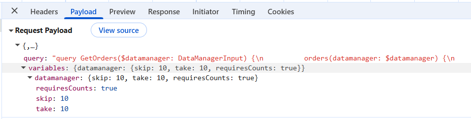
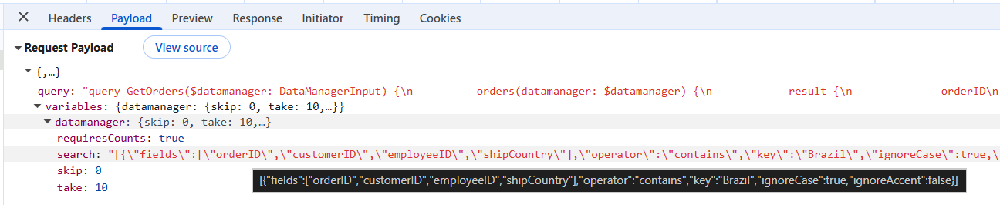
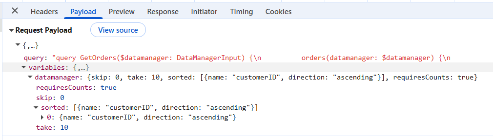
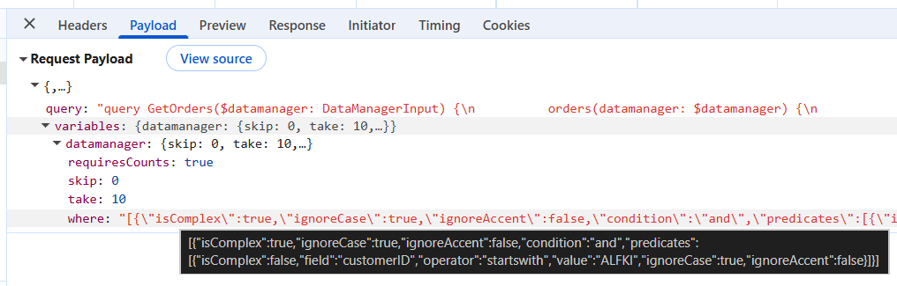
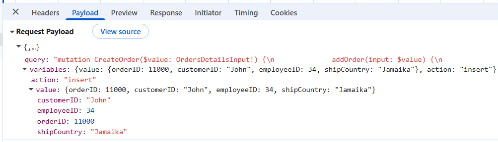
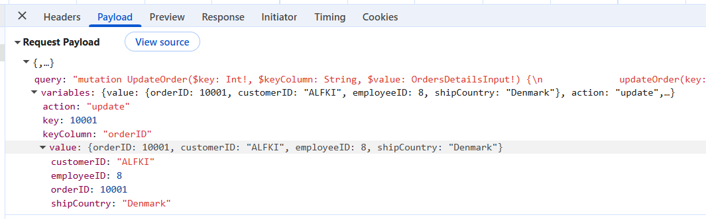
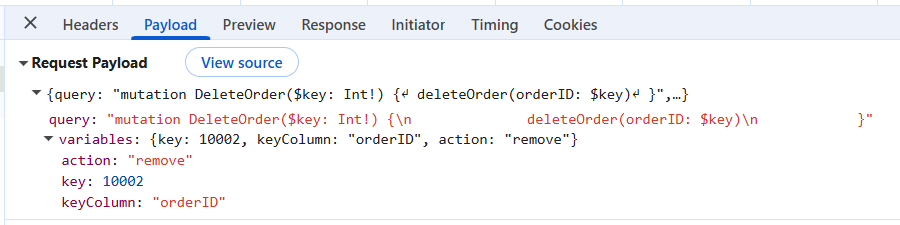

# Syncfusion React Grid with HotChocolate GraphQL Backend

[GraphQL](https://graphql.org/learn/introduction/) is a query language that allows applications to request exactly the data needed, nothing more and nothing less. Unlike traditional REST APIs that return fixed data structures, GraphQL enables the client to specify the shape and content of the response.

**Traditional REST APIs** and **GraphQL** differ mainly in the way data is requested and returned: **REST APIs expose** multiple endpoints that return fixed data structures, often including unnecessary fields and requiring several requests to fetch related data, while **GraphQL** uses a single endpoint where queries define the exact fields needed, enabling precise responses and allowing related data to be retrieved efficiently in one request. This makes **GraphQL** especially useful for **React Grid integration**, the **reason** is data‑centric UI components require well‑structured and selective datasets to support efficient filtering, reduce network calls, and improve overall performance.

**Key GraphQL concepts:**

- **Queries**: A query is a request to read data. Queries do not modify data; they only retrieve it.
- **Mutations**: A mutation is a request to modify data. Mutations create, update, or delete records.
- **Resolvers**: Each query or mutation is handled by a resolver, which is a function responsible for fetching data or executing an operation. **Query resolvers** handle **read operations**, while **mutation resolvers** handle **write operations**.
- **Schema**: Defines the structure of the API. The schema describes available data types, the fields within those types, and the operations that can be executed. Query definitions specify the way data can be retrieved, and mutation definitions specify the way data can be modified.

[HotChocolate](https://chillicream.com/docs/hotchocolate/v13) is a popular open-source GraphQL server for ASP.NET Core that provides a modern, code-first approach to building GraphQL APIs. It seamlessly integrates with .NET's dependency injection, middleware pipeline, and type system, enabling developers to create efficient and type-safe GraphQL services with minimal boilerplate code.

[ASP.NET Core](https://learn.microsoft.com/en-us/aspnet/core/introduction-to-aspnet-core) is a cross-platform, high-performance framework for building modern, cloud-enabled, and internet-connected applications. It provides the foundation for creating web APIs, web applications, and micro services using C# and the .NET platform.

## Prerequisites

| Software / Package          | Recommended version          | Purpose                                 |
|-----------------------------|------------------------------|--------------------------------------   |
| .NET SDK                    | 8.0 or later                 | Runtime for ASP.NET Core                |
| HotChocolate.AspNetCore     | 13.0 or later                | GraphQL server implementation           |
| HotChocolate.Data           | 13.0 or later                | GraphQL data filtering and sorting      |
| Node.js                     | 20.x LTS or later            | Runtime for React client                |
| npm / yarn / pnpm           | 11.x or later                | Package manager                         |
| Vite                        | 7.3.1 or later               | React build tool                        |

## Key topics

| # | Topics | Link |
|---|---------|-------|
| 1 | Set up and configure the HotChocolate GraphQL backend using ASP.NET Core | [View](#setting-up-the-hotchocolate-graphql-backend-using-aspnet-core) |
| 2 | Integrate the Syncfusion React Grid with HotChocolate GraphQL API | [View](#integrating-syncfusion-react-grid-with-hotchocolate-graphql) |
| 3 | Implement data operations including filtering, searching, sorting, and paging | [View](#perform-data-operations-in-server) |
| 4 | Perform CRUD operations | [View](#perform-crud-operations-in-server) |
| 5 | Run the HotChocolate GraphQL application | [View](#running-the-application) |
| 6 | Explore a complete working sample available on GitHub | [View](#complete-sample-repository) |

## Setting up the HotChocolate GraphQL backend using ASP.NET Core

The HotChocolate GraphQL backend acts as the central data service, handling queries and mutations that power the Syncfusion React Grid.

### Step 1: Create the ASP.NET Core project with React template

ASP.NET Core provides a built-in template for creating React applications with a .NET backend. This template creates a solution with two projects: a React frontend and an ASP.NET Core backend.

**Create project using Visual Studio:**

1. Open Visual Studio and select **Create a new project**.
2. Search for **React and ASP.NET Core** template.
3. Select the template and click **Next**.
4. Enter the project name (e.g., **ReactApp1**) and location.
5. Configure the framework version (.NET 8.0 or later).
6. Click **Create**.

**Create project using .NET CLI:**

Open a terminal and run the following commands:

```bash
dotnet new react -n ReactApp1
cd ReactApp1
```

This creates a solution with the following structure:

```
ReactApp1/
├── ReactApp1.sln
├── reactapp1.client/          # React frontend
└── ReactApp1.Server/          # ASP.NET Core backend
```

### Step 2: Install HotChocolate packages

HotChocolate is installed via NuGet packages. Two key packages are required:

- **HotChocolate.AspNetCore**: Core GraphQL server implementation for ASP.NET Core.
- **HotChocolate.Data**: Provides filtering, sorting, and projection capabilities for GraphQL queries.

**Install using Package Manager Console:**

Open the Package Manager Console in Visual Studio and run:

```bash
Install-Package HotChocolate.AspNetCore -Version 13.0.0
Install-Package HotChocolate.Data -Version 13.0.0
```

**Install using .NET CLI:**

Navigate to the **ReactApp1.Server** folder in the terminal and run:

```bash
cd ReactApp1.Server
dotnet add package HotChocolate.AspNetCore --version 13.0.0
dotnet add package HotChocolate.Data --version 13.0.0
```

**Verify installation:**

Open the **ReactApp1.Server.csproj** file and verify the package references:

```xml
<ItemGroup>
  <PackageReference Include="HotChocolate.AspNetCore" Version="13.0.0" />
  <PackageReference Include="HotChocolate.Data" Version="13.0.0" />
</ItemGroup>
```

### Step 3: Create the data model

The data model represents the structure of the data that will be served by the GraphQL API. For this guide, an **Orders Management System** is created with order details including OrderID, CustomerID, EmployeeID, and ShipCountry.

**Create Models folder:**

Create a new folder named **Models** in the **ReactApp1.Server** project.

**Create OrdersDetails model:**

Create a new file **Models/OrdersDetails.cs** with the following content:

```csharp
using System.ComponentModel.DataAnnotations;
using System.Collections.Generic;
using System.Linq;

namespace ReactApp1.Server.Models
{
    public class OrdersDetails
    {
        public static List<OrdersDetails> order = new List<OrdersDetails>();
        
        public OrdersDetails()
        {
        }
        
        public OrdersDetails(int OrderID, string CustomerId, int EmployeeId, string ShipCountry)
        {
            this.OrderID = OrderID;
            this.CustomerID = CustomerId;
            this.EmployeeID = EmployeeId;
            this.ShipCountry = ShipCountry;
        }

        public static List<OrdersDetails> GetAllRecords()
        {
            if (order.Count() == 0)
            {
                int code = 10000;
                for (int i = 1; i < 10; i++)
                {
                    order.Add(new OrdersDetails(code + 1, "ALFKI", i + 0, "Denmark"));
                    order.Add(new OrdersDetails(code + 2, "ANATR", i + 2, "Brazil"));
                    order.Add(new OrdersDetails(code + 3, "ANTON", i + 1, "Germany"));
                    order.Add(new OrdersDetails(code + 4, "BLONP", i + 3, "Austria"));
                    order.Add(new OrdersDetails(code + 5, "BOLID", i + 4, "Switzerland"));
                    code += 5;
                }
            }
            return order;
        }
        
        [Key]
        public int? OrderID { get; set; }
        public string? CustomerID { get; set; }
        public int? EmployeeID { get; set; }
        public string? ShipCountry { get; set; }
    }
}
```

**Purpose**: This model class defines the structure of order records and provides an in-memory data source through the `GetAllRecords()` method. This eliminates the need for a database during development and testing.

### Step 4: Configure HotChocolate GraphQL in Program.cs

The **Program.cs** file is the entry point of the ASP.NET Core application. This is where HotChocolate GraphQL server is registered and configured.

**Update Program.cs:**

Open the **Program.cs** file and add the following configuration:

```csharp
using HotChocolate;
using HotChocolate.AspNetCore;

var builder = WebApplication.CreateBuilder(args);

// Add services to the container
builder.Services.AddControllers();
builder.Services.AddEndpointsApiExplorer();
builder.Services.AddSwaggerGen();

// Add CORS for Vite dev server
builder.Services.AddCors(options =>
{
    options.AddPolicy("AllowVite", policy =>
    {
        policy.WithOrigins("http://localhost:****", "https://localhost:****")
              .AllowAnyHeader()
              .AllowAnyMethod()
              .AllowCredentials();
    });
});

// Register HotChocolate GraphQL server
builder.Services
    .AddGraphQLServer()
    .AddQueryType<ReactApp1.Server.GraphQL.Query>()
    .AddMutationType<ReactApp1.Server.GraphQL.Mutation>()
    .AddFiltering()
    .AddSorting()
    .AddProjections();

var app = builder.Build();

app.UseDefaultFiles();
app.UseStaticFiles();

// Configure the HTTP request pipeline
if (app.Environment.IsDevelopment())
{
    app.UseSwagger();
    app.UseSwaggerUI();
}

app.UseHttpsRedirection();

// Enable CORS
app.UseCors("AllowVite");

app.UseAuthorization();

app.MapControllers();

// Map GraphQL endpoint
app.MapGraphQL("/graphql");

app.MapFallbackToFile("/index.html");

app.Run();
```

**Configuration details:**

- **AddGraphQLServer()**: Registers the HotChocolate GraphQL server with dependency injection.
- **AddQueryType<Query>()**: Registers the Query type that handles all read operations.
- **AddMutationType<Mutation>()**: Registers the Mutation type that handles all write operations (create, update, delete).
- **AddFiltering()**, **AddSorting()**, **AddProjections()**: Adds support for filtering, sorting, and field selection capabilities.
- **MapGraphQL("/graphql")**: Maps the GraphQL endpoint to `/graphql`.
- **AddCors**: Enables cross-origin requests from the React client running on Vite dev server.

### Step 5: Configure Syncfusion DataManagerInput types

Syncfusion Data Grid sends all operation details (paging, sorting, filtering, and searching) as a single request object. HotChocolate GraphQL requires a clear, typed structure to understand these values.

**Create GraphQL folder:**

Create a new folder named **GraphQL** in the **ReactApp1.Server** project.

**Create DataManagerInput.cs:**

Create a new file **GraphQL/DataManagerInput.cs** with the following content:

```csharp
using System.Collections.Generic;

namespace ReactApp1.Server.GraphQL
{
    // Input types for Syncfusion DataManager GraphQL queries
    public class DataManagerInput
    {
        public int? Skip { get; set; }
        public int? Take { get; set; }
        public List<SortInput>? Sorted { get; set; }
        public string? Table { get; set; }
        public List<string>? Select { get; set; }
        public string? Where { get; set; }
        public string? Search { get; set; }
        public bool? RequiresCounts { get; set; }
        public string? Params { get; set; }
    }

    public class SortInput
    {
        public string? Name { get; set; }
        public string? Direction { get; set; }
    }
}
```

**Purpose:**

The **DataManagerInput** class provides a standard format for delivering Grid operation parameters to the GraphQL server. This structure allows the backend to return only the required records, improving performance, reducing payload size, and enabling efficient data handling.

Here are the details of DataManagerInput parameter type:

| Parameters       | Description                                                                     |
| ---------------- | ------------------------------------------------------------------------------- |
| `RequiresCounts` | If it is `true` then the total count of records will be included in response.  |
| `Skip`           | Holds the number of records to skip.                                            |
| `Take`           | Holds the number of records to take.                                            |
| `Sorted`         | Contains details about current sorted column and its direction.                 |
| `Where`          | Contains details about current filter column name and its constraints.          |
| `Search`         | Contains details about current search data.                                     |

### Step 6: Create the return type for GraphQL queries

Syncfusion Grid expects the server response to follow a specific structure that includes both the data array and the total count of records. This structure is essential for enabling features like paging, filtering, and data binding.

**Create OrdersReturnType.cs:**

Create a new file **GraphQL/OrdersReturnType.cs** with the following content:

```csharp
using System.Collections.Generic;
using ReactApp1.Server.Models;

namespace ReactApp1.Server.GraphQL
{
    // Return type for Syncfusion GraphQLAdaptor
    // Must have 'result' and 'count' properties
    public class OrdersReturnType
    {
        public List<OrdersDetails> Result { get; set; } = new List<OrdersDetails>();
        public int Count { get; set; }
    }
}
```

**Required response format:**

The response must follow this structure to work with Syncfusion Grid:

- **Result**: The list of data displayed in the current view, supporting on-demand loading for large datasets.
- **Count**: The total count of records in the dataset before paging is applied.

This format ensures the Grid can properly handle paging, display total record counts, and manage data operations efficiently.

## Perform data operations in server

The HotChocolate GraphQL backend handles all data operations such as filtering, searching, sorting, and paging. These operations are applied to the dataset based on the grid state received from the client through the `DataManagerInput` parameter.

### Step 7: Create GraphQL Query resolver

A query resolver in HotChocolate is a method that handles data retrieval requests. The query resolver receives the `DataManagerInput` parameter, applies the requested operations, and returns data in the format expected by Syncfusion Grid.

**Create Query.cs:**

Create a new file **GraphQL/Query.cs** with the following basic structure:

```csharp
using System.Linq;
using System.Collections.Generic;
using System.Text.Json;
using ReactApp1.Server.Models;

namespace ReactApp1.Server.GraphQL
{
    public class Query
    {
        public OrdersReturnType GetOrders(DataManagerInput? datamanager)
        {
            var allOrders = OrdersDetails.GetAllRecords();
            var query = allOrders.AsQueryable();

            // Apply filtering if provided
            if (!string.IsNullOrEmpty(datamanager?.Where))
            {
                query = ApplyFiltering(query, datamanager.Where);
            }

            // Apply searching if provided
            if (!string.IsNullOrEmpty(datamanager?.Search))
            {
                query = ApplySearching(query, datamanager.Search);
            }

            // Get total count after filtering but before paging
            var totalCount = query.Count();

            // Apply sorting if provided
            if (datamanager?.Sorted != null && datamanager.Sorted.Count > 0)
            {
                query = ApplySorting(query, datamanager.Sorted);
            }

            // Apply paging if provided
            if (datamanager?.Skip.HasValue == true)
            {
                query = query.Skip(datamanager.Skip.Value);
            }

            if (datamanager?.Take.HasValue == true)
            {
                query = query.Take(datamanager.Take.Value);
            }

            return new OrdersReturnType
            {
                Result = query.ToList(),
                Count = totalCount
            };
        }
    }
}
```

**Query execution flow:**

1. **Load data**: Retrieve all records from the data source.
2. **Apply filtering**: Filter records based on where clause predicates.
3. **Apply searching**: Search across multiple fields using search keywords.
4. **Count records**: Calculate total count after filtering but before paging.
5. **Apply sorting**: Sort records by specified columns and directions.
6. **Apply paging**: Extract specific page using skip and take parameters.
7. **Return result**: Return data with total count in the required format.

The following sections provide detailed implementations of each operation.

### Filtering

Filtering allows to narrow down the data based on certain conditions. It is done by applying specific rules or criteria to include only the records that match those rules while excluding all others.

The HotChocolate backend evaluates filter predicates received from the Grid. Predicates support comparison operators like equal, notequal, greaterthan, lessthan, startswith, endswith, and contains.

**Add filtering methods to Query.cs:**

```csharp
// Helper method to apply filtering
private IQueryable<OrdersDetails> ApplyFiltering(IQueryable<OrdersDetails> query, string whereClause)
{
    try
    {
        // Parse the where clause JSON with case-insensitive property matching
        var options = new JsonSerializerOptions
        {
            PropertyNameCaseInsensitive = true
        };
        var filters = JsonSerializer.Deserialize<List<FilterCondition>>(whereClause, options);
        if (filters == null || filters.Count == 0) return query;

        foreach (var filter in filters)
        {
            // Handle predicates (nested filters)
            if (filter.Predicates != null && filter.Predicates.Count > 0)
            {
                // Apply all predicates
                foreach (var predicate in filter.Predicates)
                {
                    query = ApplyFilterCondition(query, predicate);
                }
            }
            else
            {
                query = ApplyFilterCondition(query, filter);
            }
        }
    }
    catch (Exception ex)
    {
        // Log exception if needed - for now, just return original query
        System.Diagnostics.Debug.WriteLine($"Filter error: {ex.Message}");
    }

    return query;
}

// Helper method to apply individual filter condition
private IQueryable<OrdersDetails> ApplyFilterCondition(IQueryable<OrdersDetails> query, FilterCondition condition)
{
    var field = condition.Field?.ToLower();
    var op = condition.Operator?.ToLower();
    var value = condition.Value?.ToString() ?? "";

    if (string.IsNullOrEmpty(field) || string.IsNullOrEmpty(op) || string.IsNullOrEmpty(value)) 
        return query;

    switch (field)
    {
        case "orderid":
            if (int.TryParse(value, out int orderId))
            {
                query = op switch
                {
                    "equal" => query.Where(o => o.OrderID == orderId),
                    "notequal" => query.Where(o => o.OrderID != orderId),
                    "greaterthan" => query.Where(o => o.OrderID > orderId),
                    "lessthan" => query.Where(o => o.OrderID < orderId),
                    "greaterthanorequal" => query.Where(o => o.OrderID >= orderId),
                    "lessthanorequal" => query.Where(o => o.OrderID <= orderId),
                    _ => query
                };
            }
            break;

        case "customerid":
            query = op switch
            {
                "equal" => query.Where(o => o.CustomerID == value),
                "notequal" => query.Where(o => o.CustomerID != value),
                "startswith" => query.Where(o => o.CustomerID != null && o.CustomerID.StartsWith(value)),
                "endswith" => query.Where(o => o.CustomerID != null && o.CustomerID.EndsWith(value)),
                "contains" => query.Where(o => o.CustomerID != null && o.CustomerID.Contains(value)),
                _ => query
            };
            break;

        case "employeeid":
            if (int.TryParse(value, out int empId))
            {
                query = op switch
                {
                    "equal" => query.Where(o => o.EmployeeID == empId),
                    "notequal" => query.Where(o => o.EmployeeID != empId),
                    "greaterthan" => query.Where(o => o.EmployeeID > empId),
                    "lessthan" => query.Where(o => o.EmployeeID < empId),
                    "greaterthanorequal" => query.Where(o => o.EmployeeID >= empId),
                    "lessthanorequal" => query.Where(o => o.EmployeeID <= empId),
                    _ => query
                };
            }
            break;

        case "shipcountry":
            query = op switch
            {
                "equal" => query.Where(o => o.ShipCountry == value),
                "notequal" => query.Where(o => o.ShipCountry != value),
                "startswith" => query.Where(o => o.ShipCountry != null && o.ShipCountry.StartsWith(value)),
                "endswith" => query.Where(o => o.ShipCountry != null && o.ShipCountry.EndsWith(value)),
                "contains" => query.Where(o => o.ShipCountry != null && o.ShipCountry.Contains(value)),
                _ => query
            };
            break;
    }

    return query;
}
```

**Add filter helper classes at the end of Query.cs:**

```csharp
// Helper classes for parsing filter conditions
public class FilterCondition
{
    public string? Field { get; set; }
    public string? Operator { get; set; }
    public object? Value { get; set; }
    public List<FilterCondition>? Predicates { get; set; }
}
```

### Searching

Searching allows to find records that contain specific keywords. It scans across specified fields and displays only the matching rows, making it easier to locate specific information within large datasets.

**Add searching method to Query.cs:**

```csharp
// Helper method to apply searching
private IQueryable<OrdersDetails> ApplySearching(IQueryable<OrdersDetails> query, string searchClause)
{
    try
    {
        var options = new JsonSerializerOptions
        {
            PropertyNameCaseInsensitive = true
        };
        var searches = JsonSerializer.Deserialize<List<SearchCondition>>(searchClause, options);
        if (searches == null || searches.Count == 0) return query;

        var search = searches[0];
        var key = search.Key?.ToLower();

        if (!string.IsNullOrEmpty(key))
        {
            query = query.Where(o =>
                (o.OrderID.HasValue && o.OrderID.Value.ToString().Contains(key)) ||
                (o.CustomerID != null && o.CustomerID.ToLower().Contains(key)) ||
                (o.EmployeeID.HasValue && o.EmployeeID.Value.ToString().Contains(key)) ||
                (o.ShipCountry != null && o.ShipCountry.ToLower().Contains(key))
            );
        }
    }
    catch
    {
        // If parsing fails, return original query
    }

    return query;
}
```

**Add search helper class at the end of Query.cs:**

```csharp
public class SearchCondition
{
    public List<string>? Fields { get; set; }
    public string? Key { get; set; }
    public string? Operator { get; set; }
}
```

### Sorting

Sorting allows to arrange records by one or more columns in ascending or descending order. Multi-column sorting is supported, where records are first sorted by the primary column, then by secondary columns for equal values.

**Add sorting method to Query.cs:**

```csharp
// Helper method to apply sorting
private IQueryable<OrdersDetails> ApplySorting(IQueryable<OrdersDetails> query, List<SortInput> sortList)
{
    IOrderedQueryable<OrdersDetails>? orderedQuery = null;

    foreach (var (sort, index) in sortList.Select((s, i) => (s, i)))
    {
        var fieldName = sort.Name?.ToLower();
        var isDesc = sort.Direction?.ToLower() == "descending";
        if (string.IsNullOrEmpty(fieldName)) continue;

        var sortFunc = (fieldName, isDesc) switch
        {
            ("orderid", false) => index == 0 
                ? query.OrderBy(o => o.OrderID) 
                : orderedQuery?.ThenBy(o => o.OrderID),
            ("orderid", true) => index == 0 
                ? query.OrderByDescending(o => o.OrderID) 
                : orderedQuery?.ThenByDescending(o => o.OrderID),
            ("customerid", false) => index == 0 
                ? query.OrderBy(o => o.CustomerID) 
                : orderedQuery?.ThenBy(o => o.CustomerID),
            ("customerid", true) => index == 0 
                ? query.OrderByDescending(o => o.CustomerID) 
                : orderedQuery?.ThenByDescending(o => o.CustomerID),
            ("employeeid", false) => index == 0 
                ? query.OrderBy(o => o.EmployeeID) 
                : orderedQuery?.ThenBy(o => o.EmployeeID),
            ("employeeid", true) => index == 0 
                ? query.OrderByDescending(o => o.EmployeeID) 
                : orderedQuery?.ThenByDescending(o => o.EmployeeID),
            ("shipcountry", false) => index == 0 
                ? query.OrderBy(o => o.ShipCountry) 
                : orderedQuery?.ThenBy(o => o.ShipCountry),
            ("shipcountry", true) => index == 0 
                ? query.OrderByDescending(o => o.ShipCountry) 
                : orderedQuery?.ThenByDescending(o => o.ShipCountry),
            _ => index == 0 ? query.OrderBy(o => o.OrderID) : orderedQuery
        };

        orderedQuery = sortFunc;
    }

    return orderedQuery ?? query;
}
```

> To apply multiple sorting conditions in sequence, press and hold the <kbd>Ctrl</kbd> key while clicking on the desired column headers.

### Paging

Paging divides large datasets into smaller, manageable pages based on offset and page size. This allows to display data efficiently without loading all records at once, significantly improving performance when handling large datasets.

Paging is already implemented in the main `GetOrders` query method:

```csharp
// Apply paging if provided
if (datamanager?.Skip.HasValue == true)
{
    query = query.Skip(datamanager.Skip.Value);
}

if (datamanager?.Take.HasValue == true)
{
    query = query.Take(datamanager.Take.Value);
}
```

**Paging parameters:**

- **Skip**: Number of records to skip from the beginning.
- **Take**: Number of records to retrieve after skipping.

## Perform CRUD operations in server

CRUD operations are handled by GraphQL mutations. Mutations are special GraphQL operations that modify data on the server, such as creating, updating, or deleting records.

### Step 8: Create GraphQL Mutation resolver

A mutation resolver in HotChocolate is a method that handles data modification requests. Each CRUD operation (Create, Update, Delete) is implemented as a separate mutation method.

**Create Mutation.cs:**

Create a new file **GraphQL/Mutation.cs** with the following content:

```csharp
using System.Linq;
using ReactApp1.Server.Models;

namespace ReactApp1.Server.GraphQL
{
    public class OrdersDetailsInput
    {
        public int? OrderID { get; set; }
        public string? CustomerID { get; set; }
        public int? EmployeeID { get; set; }
        public string? ShipCountry { get; set; }
    }

    public class Mutation
    {
        public OrdersDetails AddOrder(OrdersDetailsInput input)
        {
            var newOrder = new OrdersDetails
            {
                OrderID = input.OrderID,
                CustomerID = input.CustomerID,
                EmployeeID = input.EmployeeID,
                ShipCountry = input.ShipCountry
            };
            OrdersDetails.GetAllRecords().Insert(0, newOrder);
            return newOrder;
        }

        public OrdersDetails? UpdateOrder(int key, string? keyColumn, OrdersDetailsInput input)
        {
            // Find the order by the key (OrderID)
            var existing = OrdersDetails.GetAllRecords().FirstOrDefault(o => o.OrderID == key);
            if (existing == null) return null;
            
            // Update only the fields that are provided
            if (input.CustomerID != null)
                existing.CustomerID = input.CustomerID;
            if (input.EmployeeID.HasValue)
                existing.EmployeeID = input.EmployeeID;
            if (input.ShipCountry != null)
                existing.ShipCountry = input.ShipCountry;
            
            return existing;
        }

        public bool DeleteOrder(int orderID)
        {
            var existing = OrdersDetails.GetAllRecords().FirstOrDefault(o => o.OrderID == orderID);
            if (existing == null) return false;
            OrdersDetails.GetAllRecords().Remove(existing);
            return true;
        }
    }
}
```

### Insert

Insert operation creates a new order record in the dataset. When the `Add` button is clicked and submits the new record, this mutation receives the data and persists it.

The `AddOrder` mutation method:

1. Receives the new order data through the `OrdersDetailsInput` parameter.
2. Creates a new `OrdersDetails` instance with the provided values.
3. Inserts the new record at the beginning of the list.
4. Returns the created order back to the client.

```csharp
public OrdersDetails AddOrder(OrdersDetailsInput input)
{
    var newOrder = new OrdersDetails
    {
        OrderID = input.OrderID,
        CustomerID = input.CustomerID,
        EmployeeID = input.EmployeeID,
        ShipCountry = input.ShipCountry
    };
    OrdersDetails.GetAllRecords().Insert(0, newOrder);
    return newOrder;
}
```

### Update

Update operation modifies an existing order record. When a row is edited and changes are saved, this mutation receives the modified data and updates the record.

The `UpdateOrder` mutation method:

1. Receives the primary key (`key`), key column name, and updated values (`input`).
2. Finds the existing record using the primary key.
3. Updates only the fields that are provided in the input.
4. Returns the updated order back to the client.

```csharp
public OrdersDetails? UpdateOrder(int key, string? keyColumn, OrdersDetailsInput input)
{
    var existing = OrdersDetails.GetAllRecords().FirstOrDefault(o => o.OrderID == key);
    if (existing == null) return null;
    
    if (input.CustomerID != null)
        existing.CustomerID = input.CustomerID;
    if (input.EmployeeID.HasValue)
        existing.EmployeeID = input.EmployeeID;
    if (input.ShipCountry != null)
        existing.ShipCountry = input.ShipCountry;
    
    return existing;
}
```

### Delete

Delete operation removes an order record from the dataset. When the delete button is clicked and confirmed, this mutation removes the record from the data source.

The `DeleteOrder` mutation method:

1. Receives the primary key (`orderID`) of the record to delete.
2. Finds the existing record using the primary key.
3. Removes the record from the list.
4. Returns `true` if successful, `false` if the record was not found.

```csharp
public bool DeleteOrder(int orderID)
{
    var existing = OrdersDetails.GetAllRecords().FirstOrDefault(o => o.OrderID == orderID);
    if (existing == null) return false;
    OrdersDetails.GetAllRecords().Remove(existing);
    return true;
}
```

The backend configuration is now complete. The next step is to create the React frontend and integrate it with the HotChocolate GraphQL API.

## Integrating Syncfusion React Grid with HotChocolate GraphQL

After configuring the HotChocolate GraphQL backend, the next step is to set up the React frontend and integrate it with the Syncfusion Grid component using the **GraphQLAdaptor**.

### Step 1: Install Syncfusion packages in React project

Navigate to the React client project and install the required Syncfusion packages.

**Navigate to client folder:**

```bash
cd reactapp1.client
```

**Install Syncfusion packages:**

```bash
npm install @syncfusion/ej2-react-grids @syncfusion/ej2-data --save
```

**Package descriptions:**

- **@syncfusion/ej2-react-grids**: Provides the Grid component with all features including editing, filtering, sorting, and paging.
- **@syncfusion/ej2-data**: Provides data management utilities and adaptors including GraphQLAdaptor.

### Step 2: Add Syncfusion CSS references

Syncfusion components require specific CSS files to render properly. Add the CSS references to the main entry file.

**Update main.jsx:**

Open **src/main.jsx** and add the following CSS imports at the top:

```jsx
import { StrictMode } from 'react'
import { createRoot } from 'react-dom/client'
import './index.css'
import App from './App.jsx'

// Add Syncfusion CSS
import '@syncfusion/ej2-base/styles/tailwind3.css';
import '@syncfusion/ej2-buttons/styles/tailwind3.css';
import '@syncfusion/ej2-calendars/styles/tailwind3.css';
import '@syncfusion/ej2-dropdowns/styles/tailwind3.css';
import '@syncfusion/ej2-inputs/styles/tailwind3.css';
import '@syncfusion/ej2-navigations/styles/tailwind3.css';
import '@syncfusion/ej2-popups/styles/tailwind3.css';
import '@syncfusion/ej2-splitbuttons/styles/tailwind3.css';
import '@syncfusion/ej2-grids/styles/tailwind3.css';

createRoot(document.getElementById('root')).render(
  <StrictMode>
    <App />
  </StrictMode>,
)
```

For this project, the "tailwind3" theme is used. A different theme can be selected or the existing theme can be customized based on project requirements. Refer to the [Syncfusion React Components Appearance](https://ej2.syncfusion.com/react/documentation/appearance/theme-studio) documentation to learn more about theming and customization options.

### Step 3: Configure GraphQLAdaptor with DataManager

The **GraphQLAdaptor** is a built-in Syncfusion adaptor specifically designed for GraphQL APIs. It handles data operations by generating appropriate GraphQL queries and mutations based on Grid actions.

**Update App.jsx:**

Replace the content of **src/App.jsx** with the following code:

```jsx
import { DataManager, GraphQLAdaptor } from '@syncfusion/ej2-data';
import { 
    ColumnDirective, 
    ColumnsDirective, 
    GridComponent, 
    Sort, 
    Toolbar, 
    Inject, 
    Filter, 
    Page, 
    Edit 
} from '@syncfusion/ej2-react-grids';
import './App.css';

function App() {
    // Create DataManager with Syncfusion's built-in GraphQLAdaptor
    const data = new DataManager({ 
      url: '/graphql',
      adaptor: new GraphQLAdaptor({
        response: {
          result: 'orders.result',  // Path to the result data
          count: 'orders.count'     // Path to the count
        },
        query: `query GetOrders($datamanager: DataManagerInput) {
          orders(datamanager: $datamanager) {
            result {
              orderID
              customerID
              employeeID
              shipCountry
            }
            count
          }
        }`,
        getMutation: function (action) {
          if (action === 'insert') {
            return `mutation CreateOrder($value: OrdersDetailsInput!) {
              addOrder(input: $value) {
                orderID
                customerID
                employeeID
                shipCountry
              }
            }`;
          }
          if (action === 'update') {
            return `mutation UpdateOrder($key: Int!, $keyColumn: String, $value: OrdersDetailsInput!) {
              updateOrder(key: $key, keyColumn: $keyColumn, input: $value) {
                orderID
                customerID
                employeeID
                shipCountry
              }
            }`;
          }
          if (action === 'remove') {
            return `mutation DeleteOrder($key: Int!) {
              deleteOrder(orderID: $key)
            }`;
          }
          return '';
        }
      }),
      crossDomain: true
    });
    
    const pageSettings = { pageSize: 10, pageSizes: true };
    
    // Configure editing options
    const editSettings = { 
      allowEditing: true,
      allowAdding: true,
      allowDeleting: true,
      mode: 'Normal',
      showDeleteConfirmDialog: true
    };
    
    // Configure toolbar buttons
    const toolbar = ['Add', 'Edit', 'Delete', 'Update', 'Cancel', 'Search'];
    
    // Validation rules
    const orderIDRules = { required: true };
    const customerIDRules = { required: true, minLength: 3 };

    return (
      <div style={{ margin: '20px' }}>
        <h2>Orders Grid (GraphQL + HotChocolate)</h2>
        <GridComponent 
          dataSource={data} 
          editSettings={editSettings} 
          allowFiltering={true} 
          toolbar={toolbar} 
          allowSorting={true} 
          allowPaging={true} 
          pageSettings={pageSettings}
        >
          <ColumnsDirective>
            <ColumnDirective 
              field='orderID' 
              headerText='Order ID' 
              isPrimaryKey={true} 
              width='150' 
              textAlign='Right' 
              validationRules={orderIDRules} 
            />
            <ColumnDirective 
              field='customerID' 
              headerText='Customer ID' 
              width='150' 
              validationRules={customerIDRules} 
            />
            <ColumnDirective 
              field='employeeID' 
              headerText='Employee ID' 
              width='150' 
            />
            <ColumnDirective 
              field='shipCountry' 
              headerText='Ship Country' 
              width='150' 
            />
          </ColumnsDirective>
          <Inject services={[Toolbar, Sort, Filter, Page, Edit]} />
        </GridComponent>
      </div>
    );
}

export default App;
```

### Step 4: Understanding GraphQLAdaptor configuration

The `GraphQLAdaptor` configuration consists of three main parts:

**1. Response mapping:**

Specifies the way to extract data from the GraphQL response:

```javascript
response: {
  result: 'orders.result',  // Path to the data array
  count: 'orders.count'     // Path to the total count
}
```

This tells the adaptor where to find the result data and count in the GraphQL response structure.

**2. Query definition:**

Defines the GraphQL query for fetching data with all data operations:

```graphql
query GetOrders($datamanager: DataManagerInput) {
  orders(datamanager: $datamanager) {
    result {
      orderID
      customerID
      employeeID
      shipCountry
    }
    count
  }
}
```

The `$datamanager` variable contains all operation details (paging, sorting, filtering, searching) sent by the Grid.

**3. Mutation definitions:**

Defines GraphQL mutations for CRUD operations using the `getMutation` function:

- **Insert mutation**: Creates new records
- **Update mutation**: Modifies existing records
- **Delete mutation**: Removes records

Each mutation is returned based on the action type (`insert`, `update`, `remove`).

### Step 5: Configure Grid features

The Grid component is configured with various features to enable data operations:

**Editing configuration:**

```javascript
const editSettings = { 
  allowEditing: true,
  allowAdding: true,
  allowDeleting: true,
  mode: 'Normal',
  showDeleteConfirmDialog: true
};
```

**Toolbar buttons:**

```javascript
const toolbar = ['Add', 'Edit', 'Delete', 'Update', 'Cancel', 'Search'];
```

**Column configuration:**

```jsx
<ColumnDirective 
  field='orderID' 
  headerText='Order ID' 
  isPrimaryKey={true} 
  width='150' 
  textAlign='Right' 
  validationRules={orderIDRules} 
/>
```

**Inject services:**

```jsx
<Inject services={[Toolbar, Sort, Filter, Page, Edit]} />
```

This injects the required services for toolbar, sorting, filtering, paging, and editing functionality.

### Step 6: Enable paging feature

Paging divides large datasets into smaller, manageable pages based on offset and page size. When paging is performed in the Grid, the `skip` and `take` values are sent to the server through the `DataManagerInput` parameter.

**Enable paging in the Grid:**

Set the [allowPaging](https://ej2.syncfusion.com/react/documentation/api/grid/index-default#allowpaging) property to `true` and configure page size using [pageSettings](https://ej2.syncfusion.com/react/documentation/api/grid/index-default#pagesettings).

```jsx
import { DataManager, GraphQLAdaptor } from '@syncfusion/ej2-data';
import { 
    ColumnDirective, 
    ColumnsDirective, 
    GridComponent, 
    Page,
    Inject 
} from '@syncfusion/ej2-react-grids';

function App() {
    const data = new DataManager({ 
        url: '/graphql',
        adaptor: new GraphQLAdaptor({
            // adaptor configuration
        }),
        crossDomain: true
    });
    
    const pageSettings = { pageSize: 10, pageSizes: true };

    return (
        <GridComponent 
            dataSource={data} 
            allowPaging={true}
            pageSettings={pageSettings}>
            <ColumnsDirective>
                <ColumnDirective 
                    field='orderID' 
                    headerText='Order ID' 
                    width='150' 
                    textAlign='Right' 
                    isPrimaryKey={true}/>
                {/* Include additional columns here */}
            </ColumnsDirective>
            <Inject services={[Page]} />
        </GridComponent>
    );
}
```

**Paging details included in request payload:**

The image illustrates the paging details (`skip` and `take`) included in the server request payload.



### Step 7: Enable searching feature

Searching provides the capability to find specific records by entering keywords into the search box. When a search action is performed in the Grid, the `GraphQLAdaptor` sends the search key and the target fields through the "search" parameter of the "DataManagerInput".

**Enable searching in the Grid:**

Add the `Search` item to the [toolbar](https://ej2.syncfusion.com/react/documentation/api/grid/index-default#toolbar) property and inject the `Toolbar` service.

```jsx
import { DataManager, GraphQLAdaptor } from '@syncfusion/ej2-data';
import { 
    ColumnDirective, 
    ColumnsDirective, 
    GridComponent, 
    Toolbar, 
    Inject 
} from '@syncfusion/ej2-react-grids';

function App() {
    const data = new DataManager({ 
        url: '/graphql',
        adaptor: new GraphQLAdaptor({
            // adaptor configuration
        }),
        crossDomain: true
    });

    return (
        <GridComponent 
            dataSource={data} 
            toolbar={['Search']}>
            <ColumnsDirective>
                <ColumnDirective 
                    field='orderID' 
                    headerText='Order ID' 
                    width='150' 
                    textAlign='Right' 
                    isPrimaryKey={true}/>
                {/* Include additional columns here */}
            </ColumnsDirective>
            <Inject services={[Toolbar]} />
        </GridComponent>
    );
}
```

**Searching details included in request payload:**

The image below displays the "search" parameter values.



### Step 8: Enable sorting feature

The sorting feature in the Grid allows records to be organized in ascending or descending order based on one or more columns. The `GraphQLAdaptor` automatically passes the sorting details to the server through the "sorted" parameter of the "DataManagerInput".

**Enable sorting in the Grid:**

Set the [allowSorting](https://ej2.syncfusion.com/react/documentation/api/grid/index-default#allowsorting) property to `true`.

```jsx
import { DataManager, GraphQLAdaptor } from '@syncfusion/ej2-data';
import { 
    ColumnDirective, 
    ColumnsDirective, 
    GridComponent, 
    Sort, 
    Inject 
} from '@syncfusion/ej2-react-grids';

function App() {
    const data = new DataManager({ 
        url: '/graphql',
        adaptor: new GraphQLAdaptor({
            // adaptor configuration
        }),
        crossDomain: true
    });

    return (
        <GridComponent 
            dataSource={data} 
            allowSorting={true}>
            <ColumnsDirective>
                <ColumnDirective 
                    field='orderID' 
                    headerText='Order ID' 
                    width='150' 
                    textAlign='Right' 
                    isPrimaryKey={true}/>
                {/* Include additional columns here */}
            </ColumnsDirective>
            <Inject services={[Sort]} />
        </GridComponent>
    );
}
```

> To apply multiple sorting conditions in sequence, press and hold the <kbd>Ctrl</kbd> key while clicking on the desired column headers.

**Sorting details included in request payload:**

The image below shows the values passed to the "sorted" parameter.



### Step 9: Enable filtering feature

Filtering narrows down records by specifying conditions on column values. Records can be filtered by selecting checkbox filters or using comparison operators such as equals, greater than, or less than. The `GraphQLAdaptor` automatically passes the filter conditions to the server through the "where" parameter of the "DataManagerInput".

**Enable filtering in the Grid:**

Set the [allowFiltering](https://ej2.syncfusion.com/react/documentation/api/grid/index-default#allowfiltering) property to `true`. Optionally configure the filter type using [filterSettings](https://ej2.syncfusion.com/react/documentation/api/grid/index-default#filtersettings).

```jsx
import { DataManager, GraphQLAdaptor } from '@syncfusion/ej2-data';
import { 
    ColumnDirective, 
    ColumnsDirective, 
    GridComponent, 
    Filter, 
    Inject 
} from '@syncfusion/ej2-react-grids';

function App() {
    const data = new DataManager({ 
        url: '/graphql',
        adaptor: new GraphQLAdaptor({
            // adaptor configuration
        }),
        crossDomain: true
    });
    
    const filterSettings = { type: 'Excel' };

    return (
        <GridComponent 
            dataSource={data} 
            allowFiltering={true}
            filterSettings={filterSettings}>
            <ColumnsDirective>
                <ColumnDirective 
                    field='orderID' 
                    headerText='Order ID' 
                    width='150' 
                    textAlign='Right' 
                    isPrimaryKey={true}/>
                {/* Include additional columns here */}
            </ColumnsDirective>
            <Inject services={[Filter]} />
        </GridComponent>
    );
}
```

**Filtering details included in request payload:**

The image illustrates the serialized "where" condition passed from the DataManager.



### Step 10: Enable CRUD operations with getMutation

CRUD operations (Create, Read, Update, Delete) are supported in the Grid for managing data. The `getMutation` function in the `GraphQLAdaptor` handles the Grid CRUD actions by sending the appropriate mutation for each action (insert, update, or delete) to the GraphQL server.

**Enable insert operation:**

Configure the [editSettings](https://ej2.syncfusion.com/react/documentation/api/grid/index-default#editsettings) with `allowAdding: true`. Add the `Add` button to the toolbar and configure the GraphQL insert mutation using `getMutation`.

```jsx
import { DataManager, GraphQLAdaptor } from '@syncfusion/ej2-data';
import { 
    ColumnDirective, 
    ColumnsDirective, 
    GridComponent, 
    Edit, 
    Toolbar, 
    Inject 
} from '@syncfusion/ej2-react-grids';

function App() {
    const data = new DataManager({ 
        url: '/graphql',
        adaptor: new GraphQLAdaptor({
            response: {
                result: 'orders.result',
                count: 'orders.count'
            },
            query: `query GetOrders($datamanager: DataManagerInput) {
                orders(datamanager: $datamanager) {
                    result {
                        orderID
                        customerID
                        employeeID
                        shipCountry
                    }
                    count
                }
            }`,
            getMutation: function (action) {
                if (action === 'insert') {
                    return `mutation CreateOrder($value: OrdersDetailsInput!) {
                        addOrder(input: $value) {
                            orderID
                            customerID
                            employeeID
                            shipCountry
                        }
                    }`;
                }
                return '';
            }
        }),
        crossDomain: true
    });
    
    const editSettings = { 
        allowAdding: true,
        mode: 'Normal'
    };

    return (
        <GridComponent 
            dataSource={data} 
            editSettings={editSettings}
            toolbar={['Add']}>
            <ColumnsDirective>
                <ColumnDirective 
                    field='orderID' 
                    headerText='Order ID' 
                    width='150' 
                    textAlign='Right' 
                    isPrimaryKey={true}/>
                {/* Include additional columns here */}
            </ColumnsDirective>
            <Inject services={[Edit, Toolbar]} />
        </GridComponent>
    );
}
```

**Insert details included in request payload:**

The image illustrates the added record passed from the DataManager.



**Enable update operation:**

Configure the [editSettings](https://ej2.syncfusion.com/react/documentation/api/grid/index-default#editsettings) with `allowEditing: true`. Add the `Edit`, `Update`, and `Cancel` buttons to the toolbar and configure the GraphQL update mutation.

```jsx
const data = new DataManager({ 
    url: '/graphql',
    adaptor: new GraphQLAdaptor({
        response: {
            result: 'orders.result',
            count: 'orders.count'
        },
        query: `query GetOrders($datamanager: DataManagerInput) {
            orders(datamanager: $datamanager) {
                result {
                    orderID
                    customerID
                    employeeID
                    shipCountry
                }
                count
            }
        }`,
        getMutation: function (action) {
            if (action === 'update') {
                return `mutation UpdateOrder($key: Int!, $keyColumn: String, $value: OrdersDetailsInput!) {
                    updateOrder(key: $key, keyColumn: $keyColumn, input: $value) {
                        orderID
                        customerID
                        employeeID
                        shipCountry
                    }
                }`;
            }
            return '';
        }
    }),
    crossDomain: true
});

const editSettings = { 
    allowEditing: true,
    mode: 'Normal'
};

return (
    <GridComponent 
        dataSource={data} 
        editSettings={editSettings}
        toolbar={['Edit', 'Update', 'Cancel']}>
        <ColumnsDirective>
            <ColumnDirective 
                field='orderID' 
                headerText='Order ID' 
                width='150' 
                textAlign='Right' 
                isPrimaryKey={true}/>
            {/* Include additional columns here */}
        </ColumnsDirective>
        <Inject services={[Edit, Toolbar]} />
    </GridComponent>
);
```

**Update details included in request payload:**

The image illustrates the edited record passed from the DataManager.



**Enable delete operation:**

Configure the [editSettings](https://ej2.syncfusion.com/react/documentation/api/grid/index-default#editsettings) with `allowDeleting: true`. Add the `Delete` button to the toolbar and configure the GraphQL delete mutation.

```jsx
const data = new DataManager({ 
    url: '/graphql',
    adaptor: new GraphQLAdaptor({
        // response and query configuration
        getMutation: function (action) {
            if (action === 'remove') {
                return `mutation DeleteOrder($key: Int!) {
                    deleteOrder(orderID: $key)
                }`;
            }
            return '';
        }
    }),
    crossDomain: true
});

const editSettings = { 
    allowDeleting: true,
    showDeleteConfirmDialog: true
};

const toolbar = ['Delete'];

return (
    <GridComponent 
        dataSource={data} 
        editSettings={editSettings}
        toolbar={toolbar}>
        <ColumnsDirective>
            <ColumnDirective 
                field='orderID' 
                headerText='Order ID' 
                width='150' 
                textAlign='Right' 
                isPrimaryKey={true}/>
            {/* Include additional columns here */}
        </ColumnsDirective>
        <Inject services={[Toolbar, Edit]} />
    </GridComponent>
);
```

**Delete details included in request payload:**

The image illustrates the deleted record key passed from the DataManager.



> **Note:** Ensure that the [isPrimaryKey](https://ej2.syncfusion.com/react/documentation/api/grid/column#isprimarykey) property is set to `true` for a specific Grid column which has unique values. This is required for update and delete operations to identify the correct record.

## Running the application

After completing the backend and frontend configuration, the application is ready to run.

### Step 1: Build and run the ASP.NET Core backend

**Using Visual Studio:**

1. Open the **ReactApp1.sln** solution file in Visual Studio.
2. Press **F5** or click the **Run** button to start the application.
3. Visual Studio will automatically build and launch both the backend server and frontend client.

**Using .NET CLI:**

Navigate to the solution folder and run:

```bash
cd ReactApp1
dotnet run --project ReactApp1.Server
```

The backend server will start on `https://localhost:****` (or the port specified in **launchSettings.json**).

### Step 2: Access the application

Once the application starts:

1. The browser will automatically open at `https://localhost:****` (Vite dev server).
2. The React application will load with the Syncfusion Grid component.
3. The Grid will automatically fetch data from the HotChocolate GraphQL API.

### Step 3: Test GraphQL endpoint

The HotChocolate GraphQL server includes a built-in GraphQL IDE called **Banana Cake Pop**.

**Access Banana Cake Pop:**

Navigate to `https://localhost:****/graphql` in your browser.

**Test queries:**

Try executing the following query in the GraphQL IDE:

```graphql
query GetOrders {
  orders(datamanager: { skip: 0, take: 10 }) {
    result {
      orderID
      customerID
      employeeID
      shipCountry
    }
    count
  }
}
```

**Test mutations:**

Try creating a new order:

```graphql
mutation CreateOrder {
  addOrder(input: {
    orderID: 10999
    customerID: "TESTC"
    employeeID: 5
    shipCountry: "USA"
  }) {
    orderID
    customerID
    employeeID
    shipCountry
  }
}
```

### Step 4: Verify Grid operations

Test the following Grid operations in the React application:

**Paging:**

- Click on page numbers or use page size dropdown
- Verify that data loads correctly for each page

**Sorting:**

- Click on column headers to sort
- Verify ascending and descending sort orders

**Filtering:**

- Click the filter icon in any column header
- Apply filter conditions and verify results

**Searching:**

- Use the search box in the toolbar
- Verify that search works across all columns

**CRUD operations:**

- Click **Add** to create new records
- Click **Edit** to modify existing records
- Click **Delete** to remove records
- Verify that changes are reflected immediately

## Complete sample repository

A complete working sample of the React Grid with HotChocolate GraphQL backend is available on GitHub for reference and experimentation.

**GitHub repository:**

[Syncfusion React Grid with HotChocolate GraphQL Sample](https://github.com/SyncfusionExamples/syncfusion-react-grid-component-with-hotchocolate-graphql-server)

**Repository contents:**

- Complete ASP.NET Core backend with HotChocolate GraphQL configuration
- React frontend with Syncfusion Grid and GraphQLAdaptor setup
- Sample data models and in-memory data source
- GraphQL queries and mutations for all CRUD operations
- Data operation implementations (filtering, sorting, paging, searching)
- Ready-to-run Visual Studio solution

**Clone and run:**

```bash
git clone https://github.com/SyncfusionExamples/syncfusion-react-grid-component-with-hotchocolate-graphql-server.git
cd syncfusion-react-grid-component-with-hotchocolate-graphql-server
dotnet run --project ReactApp1.Server
```

## See also

* [Getting Started with Syncfusion React Grid](../getting-started)
* [HotChocolate Documentation](https://chillicream.com/docs/hotchocolate/v13)
* [GraphQL Official Documentation](https://graphql.org/learn/)
* [Syncfusion GraphQLAdaptor Documentation](https://ej2.syncfusion.com/react/documentation/data/adaptors#graphql-adaptor)
* [ASP.NET Core Documentation](https://learn.microsoft.com/en-us/aspnet/core/?view=aspnetcore-10.0)
