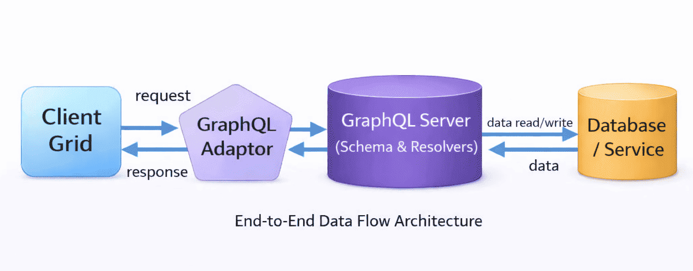
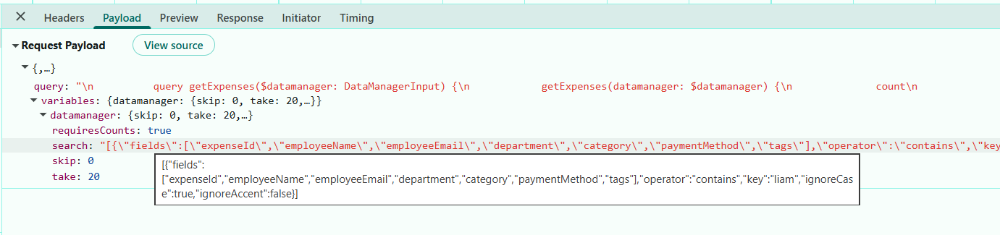
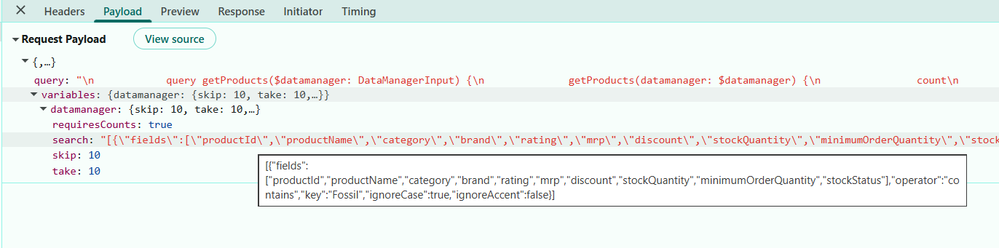
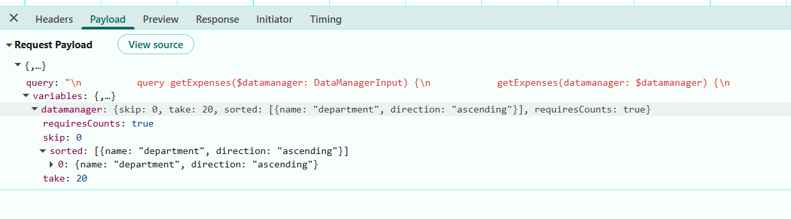
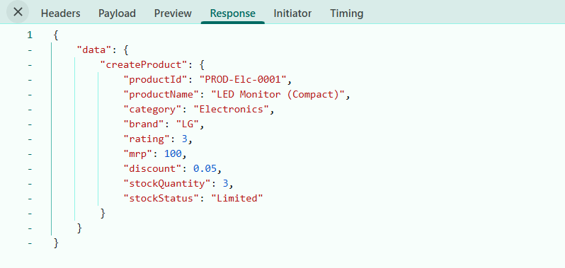
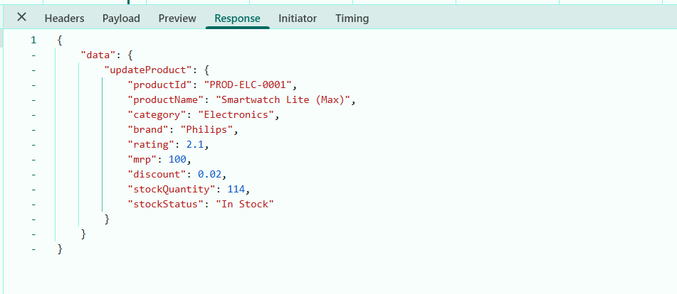

# Connecting the Syncfusion React Grid with GraphQL backend in Node.js

[GraphQL](https://graphql.org/learn/introduction/) is a query language that allows applications to request exactly the data needed, nothing more and nothing less. Unlike traditional REST APIs that return fixed data structures, GraphQL enables the client to specify the shape and content of the response.

**Traditional REST APIs** and **GraphQL** differ mainly in the way data is requested and returned: **REST APIs expose** multiple endpoints that return fixed data structures, often including unnecessary fields and requiring several requests to fetch related data, while **GraphQL** uses a single endpoint where queries define the exact fields needed, enabling precise responses and allowing related data to be retrieved efficiently in one request. This makes **GraphQL** especially useful for **React Grid integration**, the **reason** is data‑centric UI components require well‑structured and selective datasets to support efficient filtering, reduce network calls, and improve overall performance.

**Key GraphQL concepts:**

- **Queries**: A query is a request to read data. Queries do not modify data; they only retrieve it.
- **Mutations**: A mutation is a request to modify data. Mutations create, update, or delete records.
- **Resolvers**: Each query or mutation is handled by a resolver, which is a function responsible for fetching data or executing an operation. **Query resolvers** handle **read operations**, while **mutation resolvers** handle **write operations**.
- **Schema**: Defines the structure of the API. The schema describes available data types, the fields within those types, and the operations that can be executed. Query definitions specify the way data can be retrieved, and mutation definitions specify the way data can be modified. 

[Node.js](https://nodejs.org/en/learn/getting-started/introduction-to-nodejs) is a fast and efficient JavaScript runtime built on Google’s V8 engine. It enables JavaScript to run on the server, making it a popular platform for building web APIs, real‑time applications, and modern backend services. Node.js offers a non‑blocking, event‑driven architecture that supports high performance and scalability.

## Prerequisites

| Software / Package          | Recommended version          | Purpose                                 |
|-----------------------------|------------------------------|--------------------------------------   |
| Node.js                     | 20.x LTS or later            | Runtime                                 |
| npm / yarn / pnpm           | 11.x or later                | Package manager                         | 
| Vite                        | 7.3.1                        | Use this to create the React application |
| TypeScript                  | 5.x or later                 | Server‑side and client‑side type safety |

## Setting up the GraphQL backend using Node.js

The GraphQL backend acts as the central data service, handling queries and mutations that power the Syncfusion React Grid.

### Step 1: Create the GraphQL server and Install required packages

Before configuring the GraphQL API, a new folder must be created to host the GraphQL server. This folder will contain the server configuration, required dependencies, and sample data used for processing GraphQL queries.

For this guide, a GraphQL server named **GraphQLServer** is created using Node.js and TypeScript.

**Create project folder:**

Open a terminal ( for example, an integrated terminal in Visual Studio Code or Windows Command prompt opened with  <kbd>Win+R</kbd>, or macOS Terminal launched with <kbd>Cmd+Space</kbd> ) and run the following command to create and navigate to the project folder:

```bash
mkdir GraphQLServer
cd GraphQLServer
mkdir src
cd src
```
**Configure TypeScript:**

TypeScript configuration tells the compiler to convert TypeScript to JavaScript and sets up the project structure.

Create a new **tsconfig.json** file in the **GraphQLServer** folder using the below command:

```bash
npx tsc --init
```

Replace (**GraphQLServer/tsconfig.json**) file content with the following configuration:

```json
{
  "compilerOptions": {
    "target": "ES2020",
    "module": "NodeNext",
    "moduleResolution": "NodeNext",
    "lib": ["ES2020"],
    "resolveJsonModule": true,
    "esModuleInterop": true,
    "forceConsistentCasingInFileNames": true,
    "skipLibCheck": true,
    "strict": true,
    "rootDir": "src",
    "outDir": "dist"
  },
  "include": ["src"]
}
```

**Install required packages:**

The GraphQL server is set up using graphpack, a lightweight GraphQL development tool. TypeScript support is added to enable strongly typed development, and the Syncfusion `ej2-data` package is installed to handle data operations such as filtering, sorting, and paging.

Run the following commands in the terminal window to install the required packages:

```bash
npm i graphpack
npm install -D typescript ts-node @types/node
npm install @syncfusion/ej2-data --save
```
- **graphpack** – Lightweight GraphQL server and development environment.
- **typescript, ts-node** – Enables TypeScript-based development.
- **@syncfusion/ej2-data** – Provides data utilities for advanced data operations.

**Create sample datasource:**

After installing the required packages, create a new file named **data.ts** inside the **src** folder. This file acts as an in‑memory datasource for the GraphQL server.

```ts
[data.ts]

export const productDetails: object[] = [
  {
    "productId": "PROD-ELC-0001",
    "productImage": "assets/productImages/watch2.png",
    "productName": "Smartwatch Lite (Max)",
    "category": "Electronics",
    "brand": "Philips",
    "sellingPrice": 98.0,
    "mrp": 100.0,
    "discount": 0.02,
    "stockQuantity": 114,
    "stockStatus": "In Stock",
    "rating": 2.1,
    "description": "Smartwatch Lite with modern features and energy-efficient design. Suitable for everyday use at home or office.",
    "minimumOrderQuantity": 1,
    "manufacturer": "South Korea",
    "tags": "Clearance",
    "warrantyPeriod": 3,
    "returnPolicy": "15-day return"
  },
  . . . .
  . . . .
]
```
The **GraphQLServer** folder is now created, required packages are installed, and a sample data source is configured. The project is ready for defining the GraphQL schema, resolvers, and server configuration.

### Step 2: Configuring schema in GraphQL

The GraphQL schema defines the structure of the "product" data model and the server‑side operations available for performing CRUD actions.

**Instructions:**
1. Create a new schema file (**src/schema.graphql**) in the **GraphQLServer** folder.
2. Add type definition for **Product**:

    ```
    #--- Product type definition ---
    type Product {
      productId: String!
      productImage: String
      #include additional fields--
    }
    ```
3. Add type definition for **ReturnType**:

    ```
    # --- Return type for Grid paging ---
    type ReturnType {
      result: [Product!]!
      count: Int!
    }
    ```
4. Add type definition for **Sort**:

    ```
    # --- Sorting input ---
    input Sort {
      name: String
      direction: String
    } 
    ```
5. Add type definition for **ProductInput**:

    ```
    # --- Product input for mutation operations ---
    input ProductInput {
      productId: String!
      productName: String
      #include additional fields--
    }
    ```
6. Add type definition for **DataManagerInput**:

    ```
    # --- Syncfusion DataManager payload ---
    input DataManagerInput {
      skip: Int
      take: Int
      sorted: [Sort]
      group: [String!]
      table: String
      select: [String!]
      where: String   
      search: String  
      requiresCounts: Boolean
      params: String
    }
    ```
    > For detailed information about **DataManagerInput** type refer to [Configuring Syncfusion DataManagerInput schema](#step-3-configuring-syncfusion-datamanagerinput-schema)

7. Define the Query type to expose the "getProducts" operation that returns the list of "products".

    ```
    type Query {
      getProducts(datamanager: DataManagerInput): ReturnType!
    }
    ```
8. Define Mutation types for CRUD operations.

    ```
    type Mutation {
      createProduct(value: ProductInput!): Product!
      updateProduct(key: String!, keyColumn: String, value: ProductInput!): Product
      deleteProduct(key: String!, keyColumn: String): Product!
    }
    ```
    **Key Parameters Definitions:**
    - **key**: The unique identifier (primary key) of the product to be updated.
    - **keyColumn**: The name of the column containing the unique identifier.
    - **value**: An object containing the created or updated product details.

### Step 3: Configuring Syncfusion DataManagerInput schema

Syncfusion Data Grid sends all operation details paging, sorting, filtering, and searching as a single request object. GraphQL requires a clear, typed structure to understand these values. 

 Syncfusion’s [DataManager](https://ej2.syncfusion.com/react/documentation/data/getting-started) follows a fixed schema when sending operation details from the client. To ensure seamless integration, the GraphQL backend defines a corresponding input type that mirrors this structure.
 
 **DataManagerInput** serves as the input type that matches the structure of the `DataManager` request, ensuring that all operation details are correctly received by the GraphQL API.

**Purpose:**
The **DataManagerInput** schema provides a standard format for delivering Grid operation parameters to the GraphQL server.This structure allows the backend to return only the required records, improving performance, reducing payload size, and enabling efficient data handling.

Here are the details of **DataManagerInput** parameter type.

| Parameters       | Description                                                                     |
| ---------------- | ------------------------------------------------------------------------------- |
| `requiresCounts` | If it is `true` then the total count of records will be included in response. |
| `skip`           | Holds the number of records to skip.                                            |
| `take`           | Holds the number of records to take.                                            |
| `sorted`         | Contains details about current sorted column and its direction.                 |
| `where`          | Contains details about current filter column name and its constraints.          |
| `group`          | Contains details about current Grouped column names.                            |
| `search`         | Contains details about current search data.                                     |
| `aggregates`     | Contains details about aggregate data.                                          |

Use this **DataManagerInput** in the "getProducts" query to access the parameters sent from the client, allowing the GraphQL server to handle these operations in a consistent and unified way.


### Step 4: GraphQL - Query resolvers

A resolver in GraphQL is a function responsible for fetching the data for a specific field in a GraphQL schema.

When a client sends a GraphQL query, resolvers run behind the scenes to retrieve the requested information from a database, API, or any data source and return it in the format defined by the schema. 

**Instructions:**
1. Create a new resolver file (**src/resolvers.ts**) inside the **GraphQLServer** folder.
2. Import the required data source (**e.g., productDetails**) from the data file.
3. Implement the "getProducts" resolver to handle the logic for the "getProducts" query defined in the schema.
4. Ensure the resolver returns the processed list of "products" in the structure specified by the schema.

```ts
 getProducts: (_parent: unknown, { datamanager }: GetProductsArgs) => {
      let products = [...productDetails];
      const query = new Query();
        
      // Apply search, filter, sort, and paging operations as provided by the Grid.
      // Operations are applied sequentially: search → filter → sort → paging.
      let result = products
      let count = products.length
      return {
        result,
        count
      };
    },
```

### Step 5: GraphQL - Mutation resolvers

Mutations in GraphQL are used to modify data on the server, such as creating, updating, or deleting records.

Previously, the CRUD mutation types were defined in the **schema.graphql** file. The next step is to implement these mutation actions inside the **resolver.ts** file.

**Instructions:**
1. Open the (**src/resolvers.ts**) file.
2. Implement the "createProduct" mutation.

    ```ts
    Mutation: {
        createProduct: (_parent: unknown, { value }: CreateProductArgs) => {
          const newProduct = value;
          productDetails.push(newProduct);
          return newProduct;
        },
    }
    ```
    **"createProduct" - code breakdown:**

    | Step | Purpose | Implementation |
    |------|---------|-----------------|
    | **1. Receive Input** | Read incoming product details sent from the client. | `value` parameter inside "createProduct" contains all submitted fields. |
    | **2. Prepare Record** | Store the incoming values as a new product object. | `const newProduct = value` |
    | **3. Insert Record** | Add the "product" to the existing data collection. | use `productDetails.push(newProduct)` to add record. |
    | **4. Return Created** | Send the inserted record back to the client. | return `newProduct` - returns the newly added "product" so the client can update the Grid instantly. |

3. Implement the "updateProduct" mutation:

    ```ts
    Mutation: {
        updateProduct: (_parent: unknown, { key, keyColumn = "productId", value }: UpdateProductArgs):ProductDetails => {
          const product = productDetails.find((p:ProductDetails) => String(p[keyColumn]) === String(key));
          if (!product) throw new Error("Product not found");
          // Merge the incoming partial fields into the existing product.
          Object.assign(product, value);
          return product;
        },

      }
    ```
    **"updateProduct" - code breakdown:**

    | Step | Purpose | Implementation |
    |------|---------|-----------------|
    | **1. Receive Input** | Accept the `key`, `keyColumn`, and updated field values. | Resolver parameters: `key`, `keyColumn`, and `value`. |
    | **2. Locate Record** | Find the matching "product" using a dynamic key. | `find((p:ProductDetails) => String(p[keyColumn]) === String(key))` |
    | **3. Verification** | Fail fast if no matching product exists. | `if (!product) throw new Error("Product not found")` |
    | **4. Apply Updates** | Merge incoming fields into the located product. | `Object.assign(product, value)` |
    | **5. Preserve Key** | Keep the original key field unchanged. | The code does not overwrite the key unless `value[keyColumn]` is provided.|
    | **6. Return Updated** | Send back the modified "product" to the client. | return `product` object with all updates applied. |

4. Implement the "deleteProduct" mutation.

    ```ts
    Mutation: {
        deleteProduct: (_parent: unknown, { key, keyColumn = 'productId' }:DeleteProductArgs) => {
          const idx = productDetails.findIndex((p:ProductDetails) => String(p[keyColumn]) === String(key));
          if (idx === -1) throw new Error('Product not found');
          const [deleted] = productDetails.splice(idx, 1);
          return deleted;
        }

      }
      ```
    **"deleteProduct" - code breakdown:**

    | Step | Purpose | Implementation |
    |------|---------|-----------------|
    | **1. Receive Key** | Backend receives only the primary key value from client. | Resolver parameters: `key`, `keyColumn` = '`productId` |
    | **2. Locate Index** | Identify the array index of the target record using the dynamic key column. | `findIndex((p) => String(p[keyColumn]) === String(key))` |
    | **3. Validate Existence** | Ensure a matching record exists before deletion. | `if (idx === -1) throw new Error('Product not found')` check. |
    | **4. Remove Record** | Delete the record from the data source at the located index. | `const [deleted] = productDetails.splice(idx, 1)` |
    | **5.  Return Deleted** | Provide the removed record back to the client. | return `deleted` |

Now all required `GraphQL` types, queries, and mutations have now been fully added.


## Integrating Syncfusion React Grid with GraphQL

Create a new React application using `create vite@latest`, which provides a faster development environment, smaller bundle sizes, and optimized builds.

Open a Visual Studio Code terminal or Command prompt and run the below command:

```bash
npm create vite@latest GridClient
cd GridClient
```
This command creates a React application named **GridClient** with the essential folder structure and files required to begin development immediately.

The integration process begins by installing the required Syncfusion React Grid packages before establishing the GraphQL connection.

### Step 1: Adding Syncfusion packages

Install the necessary Syncfusion packages using the below command in Visual Studio Code terminal or Command prompt:

```bash
npm install @syncfusion/ej2-react-grids --save
npm install @syncfusion/ej2-data --save
```
- **@syncfusion/ej2-react-grids** –  required to use the Syncfusion React Grid component.
- **@syncfusion/ej2-data** – Provides data utilities for binding and manipulating Grid data.

### Step 2: Including required Syncfusion stylesheets

Once the dependencies are installed, the required CSS files are made available in the (**../node_modules/@syncfusion**) package directory, and the corresponding CSS references are included in the **index.css** file.

```css
[index.css]

@import '@syncfusion/ej2-base/styles/tailwind3.css';  
@import '@syncfusion/ej2-buttons/styles/tailwind3.css';  
@import '@syncfusion/ej2-calendars/styles/tailwind3.css';  
@import '@syncfusion/ej2-dropdowns/styles/tailwind3.css';  
@import '@syncfusion/ej2-inputs/styles/tailwind3.css';  
@import '@syncfusion/ej2-navigations/styles/tailwind3.css';
@import '@syncfusion/ej2-popups/styles/tailwind3.css';
@import '@syncfusion/ej2-splitbuttons/styles/tailwind3.css';
@import '@syncfusion/ej2-notifications/styles/tailwind3.css';
@import '@syncfusion/ej2-react-grids/styles/tailwind3.css';
```

For this project, the `Tailwind3` theme is used. A different theme can be selected or the existing theme can be customized based on project requirements. Refer to the [Syncfusion React Components Appearance](https://ej2.syncfusion.com/react/documentation/appearance/theme) documentation to learn more about theming and customization options.

### Step 3: Configure GraphQL Adaptor

To integrate the Grid component with the GraphQL server, datamanager provides a built‑in [GraphQLAdaptor](https://ej2.syncfusion.com/react/documentation/data/adaptors#graphql-adaptor) that translates the user interaction into GraphQL requests, enabling efficient communication with GraphQL servers.

**What is a GraphQL Adaptor?**

An adaptor is a translator between two different systems. The `GraphQLAdaptor` specifically:

- Receives interaction events from the Grid (user clicks Add, Edit, Delete, sorts, filters, etc).
- Converts these actions into GraphQL query or mutation syntax.
- Sends the GraphQL request to the backend GraphQL endpoint.
- Receives the response data from the backend.
- Formats the response back into a structure the Grid understands.
- Updates the grid display with the new data.

The adaptor enables bi-directional communication between the frontend (Grid) and backend (GraphQL server).



When using the `GraphQLAdaptor`, the client expects the response from the server in a specific structure so that the Grid can process and render the results correctly.

The required response format includes:
  - **result**: The list of data to be displayed in the current Grid view.
  - **count**: The total number of records available in the dataset.

The `GraphQLAdaptor` needs to be configured to the Syncfusion `DataManager` to convert the user interaction into GraphQL‑compatible requests. To enable this setup, configure the `DataManager` with the `GraphQLAdaptor`, specify the GraphQL server’s response format, and define the query. Finally, assign this `DataManager` instance to the Grid component.

**Instructions:**
1. Create a new (**src/ProductGrid.tsx**) in the ReactClient folder.
2. Configure `DataManager` with `GraphQLAdaptor` and map the response (result, count).
3. Ensure the GraphQL schema exposes "getProducts(datamanager: DataManagerInput)" and `returns { count, result }`.
4. Render GridComponent with dataSource and define columns matching the fields returned by the query.

    ```ts
    [ProductGrid.tsx]

    const productDetails : DataManager = React.useMemo(() => {
        return new DataManager({
          url: 'http://localhost:xxxx/', // xxxx represents the port number
            adaptor: new GraphQLAdaptor({
              response: {
                result: 'getProducts.result',
                count: 'getProducts.count'
              },
              query: `
                query getProducts($datamanager: DataManagerInput) {
                  getProducts(datamanager: $datamanager) {
                    count
                    result {
                      productId, productName      # add additional fields to fetch initially, e.g.:category
                    }
                  }
                }
              `,
            }),
        });
      }, []);
    <GridComponent
        ref={gridRef}
        dataSource={productDetails}>  
          <ColumnsDirective>
            <ColumnDirective
              field="productId"
              headerText="Product ID"
              textAlign="Right"
              width={150}
              isPrimaryKey={true}/>
            {/* Include additional columns here */}
          </ColumnsDirective>
      </GridComponent> 
    ```

    **GraphQL Query structure explained in detail**

    The Query property is critical for understanding the data flows. Let's break down each component:

    ```
    query getProducts($datamanager: DataManagerInput) {}
    ```

      **Line breakdown:**
      - `query` - GraphQL keyword indicating a read operation.
      - `getProducts` - Name of the query (must match resolver name with camelCase).
      - `($dataManager: DataManagerInput!)` - Parameter declaration.
        - `$dataManager` - Variable name (referenced as $dataManager throughout the query).
        - `: DataManagerInput` - Type specification.


    ```
    getProducts(datamanager: $datamanager) {}
    ```

      **Line breakdown:**
      - `getProducts(...)` - Calls the resolver method in backend.
      - `dataManager: $dataManager` - Passes the "$dataManager" variable to the resolver.
      - The resolver receives this object and uses it to apply filters, sorts, searches, and pagination.


    ```
    count
      result {
        productId, productImage 
      }
    ```

      **Line breakdown:**
      - `count` - Returns total number of records (used for pagination).
        - Example: If "150" total "product" records exist, count = 150.
        - Grid uses this to calculate the number of pages that exist.
      - `result` - Contains the array of "product" records.
        - `{ ... }` - List of fields to return for each record.
        - Only requested fields are returned (no over-fetching).

**Response structure example**

When the backend executes the query, it returns a JSON response in this exact structure:

```json
{
  "data": {
      "getProducts": {
          "count": 1500,
          "result": [
              {
                "productId": "PROD-ELC-0001",
                "productImage": "assets/productImages/watch2.png",
                "productName": "Smartwatch Lite (Max)",
                "category": "Electronics",
                "brand": "Philips",
                "rating": 2.1,
                "mrp": 100,
                "discount": 0.02,
                "stockQuantity": 114,
                "stockStatus": "In Stock"
              },
          ]
  }
}
}
```

**Response structure explanation:**

| Part | Purpose | Example |
|------|---------|---------|
| `data` | Root object returned for every successful GraphQL query. | Always present in successful response. |
| `getProducts` | Matches the GraphQL query name; contains paginated product data | Contains **count** and **result**. |
| `count` | Total number of records available. | 1 (in this example). |
| `result` | Array of "products" objects. | [ {...}, {...} ] |
| Each `field` in result | Matches GraphQL query field names. | Field values from database. |


### Step 4: Add toolbar with CRUD and search options

The toolbar provides buttons for adding, editing, deleting records, and searching the data.

**Instructions:**
1. Open the **ProductGrid.tsx** file.
2. Update the `Grid` component to include the [Toolbar]((https://ej2.syncfusion.com/react/documentation/api/grid/index-default#toolbar)) property with CRUD and search options.

  ```ts
  const toolbar = ["Add", "Edit", "Delete", "Search"];
  <GridComponent
      ref={gridRef}
      dataSource={productDetails}
      toolbar={toolbar} >    
    <ColumnsDirective>
      <ColumnDirective
        field="productId"
        headerText="Product ID"
        textAlign="Right"
        width={150}
        isPrimaryKey={true}/>
      {/* Include additional columns here */}
      <Inject services={[Toolbar, Edit ]} />
    </GridComponent>
  ```
### Step 5: Implement paging feature

Paging divides large datasets into smaller pages to improve performance and usability.

During pagination, the `GraphQLAdaptor` sends the paging details though "skip" and "take" parameters of the "DataManagerInput". These details are converted to the [paging query](https://ej2.syncfusion.com/react/documentation/data/querying#paging) and passed to the `DataManager` ensuring that data is returned in paged segments and allowing smooth navigation through large datasets.

**Instructions:**
1. Set the [allowPaging](https://ej2.syncfusion.com/react/documentation/api/grid/index-default#allowpaging) property `true` to enable paging in the Grid.

2. The page size is configured with [pageSettings](https://ej2.syncfusion.com/react/documentation/api/grid/index-default#pagesettings) property.

    ```ts
    const pageSettings = { pageSize: 10, pageSizes: true };

    <GridComponent
      ref={gridRef}
      dataSource={productDetails}
      pageSettings={pageSettings}
      allowPaging={true}>    
      <ColumnsDirective>
        <ColumnDirective
          field="productId"
          headerText="Product ID"
          textAlign="Right"
          width={150}
          isPrimaryKey={true}/>
          {/* Include additional columns here */}
          <Inject services={[Page]} />
    </GridComponent>
    ```

2. Implement the page logic within the "getProducts" resolver function located in the **resolver.ts** file.

    ```ts
    import { productDetails } from "./data";
    import { Query, DataManager, Predicate } from "@syncfusion/ej2-data";

    const resolvers = {
      Query: {
        getProducts: (_parent: unknown, { datamanager }: GetProductsArgs) => {
          let products = [...productDetails];
          const query = new Query();

          if (datamanager.take !== undefined) {
            const skip = datamanager.skip || 0;
            const take = datamanager.take;

            query.page(skip / take + 1, take);
          }
          let result = new DataManager(products).executeLocal(query);
          let count = products.length
          return {
            result,
            count
          };
        },
      },
    };

    export default resolvers;
    ```

    **Page logic breakdown:**

    | Part                | Purpose |
    |---------------------|---------|
    | ``datamanager.skip``    | Number of records to `skip` before fetching data (e.g., `(pageIndex - 1) * pageSize`). |
    | ``datamanager.take``    | Number of records to return (page size). |
    | ``query.page(...)``     | Applies paging to the Syncfusion query instance. |
    | ``executeLocal(query)`` | Executes the query on the in‑memory dataset and returns paged results. |

**Paging details included in request payloads:**

The image illustrates the paging details (`skip` and `take`) included in the server request payload.


 
The resolver processes the Grid’s `skip` and `take` parameters and returns the total count along with the paged result. Paging feature is now active with "10" records per page.

> To use [Row Virtualization](https://ej2.syncfusion.com/react/documentation/grid/scrolling/virtual-scrolling), inject the `VirtualScroll` service and set [enableVirtualization](https://ej2.syncfusion.com/react/documentation/grid/scrolling/virtual-scrolling) property to `true`. When virtualization is enabled, the grid automatically sends the correct "skip" and "take" values to the server.The resolver does not require any additional modifications. The Grid inherently handles all virtual block requests, ensuring the expected behavior without additional configuration.

### Step 6: Implement searching feature

Searching provides the capability to find specific records by entering keywords into the search box.

When a search action is performed in the Grid, the `GraphQLAdaptor` sends the search key and the target fields through the "search" parameter of the "DataManagerInput". These values are converted as the [search query](https://ej2.syncfusion.com/react/documentation/data/querying#searching) and processed through the `DataManager`.

**Instructions**
1. Ensure the toolbar includes the "Search" item.

    ```ts
      const toolbar = ['Search'];
        <GridComponent
            ref={gridRef}
            dataSource={productDetails}
            toolbar={toolbar} >    
          <ColumnsDirective>
            <ColumnDirective
              field="productId"
              headerText="Product ID"
              textAlign="Right"
              width={150}
              isPrimaryKey={true}/>
          {/* Include additional columns here */}
            <Inject services={[Toolbar]} />
          </GridComponent>
    ```
2. Implement the search logic within the "getProducts" resolver function located in the **resolver.ts** file.

    ```ts
    import { productDetails } from "./data";
    import { Query, DataManager, Predicate } from "@syncfusion/ej2-data";

    const resolvers = {
      Query: {
        getProducts: (_parent: unknown, { datamanager }: GetProductsArgs) => {
            let products = [...productDetails];
            const query = new Query();

            /** Custom function to handle the search operation.**/
            const performSearching = (searchParam : string) => {
              const { fields, key } = JSON.parse(searchParam)[0];
              query.search(key, fields);
            }
          
            if (datamanager.search) {
              performSearching(datamanager.search);
            }
          
            /** Execute the composed Query.
              * result: data to render.
              * count: total number of mathched records.
            */
            let result = new DataManager(products).executeLocal(query);
            let count = result.length
            return {
              result,
              count
            };
        },
      },
    }
    ```

    **Search logic breakdown:**

    | Part | Purpose |
    |------|---------|
    | ``datamanager.search`` | JSON‑stringified array of search instructions sent by the Grid via `GraphQLAdaptor`. |
    | ``performSearching(searchParam)`` | Parses the JSON and applies the search to the query.|
    | ``query.search(key, fields)`` | Applies Syncfusion’s contains search across the specified fields. |
    | ``executeLocal(query)``| Runs the composed search query on the dataset.|
 
**Searching details included in request payloads:**

The image below displays the "search" parameter values.



The resolver applies the search query parameters received from the Grid and returns the search filtered result along with the total count. Searching feature is now active.

### Step 7: Implement sorting feature

Sorting allows the user to organize records by clicking on column headers to arrange data in ascending or descending order.

The `GraphQLAdaptor` automatically passes the sorting details to the server through the "sorted" parameter of the "DataManagerInput" and the details are converted to the [sorting query](https://ej2.syncfusion.com/react/documentation/data/querying#sorting) and executed through the `DataManager` to get the sorted data.

**Instructions:**
1. Set the [allowSorting](https://ej2.syncfusion.com/react/documentation/api/grid/index-default#allowsorting) property to `true`.

    ```ts
    <GridComponent
      ref={gridRef}
      dataSource={productDetails}
      allowSorting={true}>  
      <ColumnsDirective>
        <ColumnDirective
          field="productId"
          headerText="Product ID"
          textAlign="Right"
          width={150}
          isPrimaryKey={true}
        />
        {/* Include additional columns here */}
        <Inject services={[Sort]} />
      </GridComponent>
    ```

2. Implement the sort logic within the "getProducts" resolver function located in the **resolver.ts** file.

    ```ts
    import { productDetails } from "./data";
    import { Query, DataManager, Predicate } from "@syncfusion/ej2-data";

    const resolvers = {
      Query: {
        getProducts: (_parent: unknown, { datamanager }: GetProductsArgs) => {
          let products = [...productDetails];
          const query = new Query();  
          
          /**Custom function to apply sorting**/
          const performSorting = (sorted:SortParam[]|string) => {
              for (let i = 0; i < sorted.length; i++) {
                const { name, direction } = sorted[i];
                
                /** Append sorting to the Query for the specified field and direction**/
                query.sortBy(name, direction);
              }
            }

          if (datamanager.sorted) {
            performSorting(datamanager.sorted);
          }

          /** Execute the composed Query
            * result: data to render
            * count: total number of records
          */
          let result = new DataManager(products).executeLocal(query);
          let count = products.length;

          return {
            result,
            count
          };
        },
      },
    };

    export default resolvers;
    ```

    **Sorting logic breakdown:**

    | Part | Purpose |
    |------|---------|
    | ``datamanager.sorted`` | Array of sort instructions sent by the Grid via `GraphQLAdaptor`. |
    | ``performSorting(sorted)`` | Iterates the sort array and appends sort clauses to the Query.|
    | ``query.sortBy(name, direction)`` | Field/column name to sort by (e.g., "productName", "category"). | 

**Sorting details included in request payloads:**

The image below shows the values passed to the "sorted" parameter.



> To apply multiple sorting conditions in sequence, press and hold the <kbd>Ctrl</kbd> key while clicking on the desired column headers.

The resolver processes the sorting parameters and returns the result in the requested sorted order. Sorting functionality is now active.

### Step 8: Implement filtering feature

Filtering allows the user to narrow down records by specifying conditions on column values. Users can filter by selecting checkbox filters or using comparison operators like equals, greater than, less than, etc.

The `GraphQLAdaptor` automatically passes the filter conditions to the server through the "where" parameter of the "DataManagerInput". In the server, the filter parameters are converted to the Syncfusion [filter query](https://ej2.syncfusion.com/react/documentation/data/querying#filtering) and executed through the `DataManager` to get the filtered data.

 **Instructions:**
1. Set the [allowFiltering](https://ej2.syncfusion.com/react/documentation/api/grid/index-default#allowfiltering) property to `true`.

    ```ts
    const filterSettings: FilterSettingsModel = { type: 'Excel' };
    <GridComponent
      ref={gridRef}
      dataSource={productDetails}
      allowFiltering={true}
      filterSettings={filterSettings}>    
      <ColumnsDirective>
        <ColumnDirective
          field="productId"
          headerText="Product ID"
          textAlign="Right"
          width={150}
          isPrimaryKey={true}/>
          {/* Include additional columns here */}
        <Inject services={[Filter]} />
    </GridComponent>
    ```
2. Implement the filter processing logic within the "getProducts" resolver function located in the **resolver.ts** file.

    ```ts
      const resolvers = {
        Query: {
          getProducts: (_parent: unknown, { datamanager }: GetProductsArgs) => {
              let products = [...productDetails];
              const query = new Query();

              if (datamanager.where) {
                performFiltering(datamanager.where);
              }       
              
            // Execute filtering using Syncfusion DataManager.
            const result = new DataManager(products).executeLocal(query);      
            // Total count after filtering.
            const count = result.length;
            
            return {
              result,
              count
            };
          },
        },
      };
    ```
    The "performFiltering" function processes the filtering rules received from the client and return the filter query.

    ```ts
      const query = new Query();

      const performFiltering = (filterString:string) => {
        const parsed = JSON.parse(filterString);
        //The parsed filter can be an array or a single object.
        
        const predicateCollection = Array.isArray(parsed) ? parsed[0] : parsed;

        // If no valid predicate structure exists, return the original query unchanged.
        if (!predicateCollection || !Array.isArray(predicateCollection.predicates) || predicateCollection.predicates.length === 0) {
          return query;
        }
        
        // Determines whether multiple predicates should be combined using AND / OR.
        const condition = (predicateCollection.condition || 'and').toLowerCase();
        const ignoreCase = predicateCollection.ignoreCase !== undefined ? !!predicateCollection.ignoreCase : true;

        //This variable will accumulate the full predicate chain.
        let combinedPredicate: Predicate | null = null;
        
        //Loop through each predicate and convert it into Syncfusion Predicate objects.
        predicateCollection.predicates.forEach((p:any) => {
          if (p.isComplex && Array.isArray(p.predicates)) {
            // Handle nested predicates via recursive helper.
            const nested = buildNestedPredicate(p, ignoreCase);
            if (nested) {
              combinedPredicate = combinedPredicate
                ? (condition === 'or' ? combinedPredicate.or(nested) : combinedPredicate.and(nested))
                : nested;
            }
            return;
          }

          // Create a simple (single field) predicate.
          const singlePredicate = new Predicate(p.field, p.operator, p.value, ignoreCase);

          // Merge predicate into the chain using AND/OR.
          combinedPredicate = combinedPredicate
            ? (condition === 'or' ? combinedPredicate.or(singlePredicate) : combinedPredicate.and(singlePredicate))
            : singlePredicate;
        });

        // Apply the final combined predicate to the Syncfusion Query object.
        if (combinedPredicate) {
          query.where(combinedPredicate);
        }
        return query;
      };
    ```
    The "buildNestedPredicate" function handles complex filtering scenarios containing nested structures.

    ```ts
        /**
        * This function is called recursively to handle multi-level filter logic.
        * @param block - A complex filter object containing nested predicates.
        * @param ignoreCase - Whether string comparisons should ignore case.
        * @returns A merged Predicate representing the entire nested filter block.
        */

        function buildNestedPredicate(block : FilterBlock, ignoreCase :boolean) {
          /** Determine whether this block uses "and" or "or" to merge its child predicates.**/
          const condition = (block.condition || 'and').toLowerCase();
            
          /** Will store the final combined Predicate after processing all nested items.**/
          let mergedPredicate : Predicate | null = null;
          
          
          /**Loop through each predicate entry within the current block.**/
          block.predicates.forEach((p:any) => {
            let node;
            if (p.isComplex && Array.isArray(p.predicates)) {
              node = buildNestedPredicate(p, ignoreCase);
            } else {
              node = new Predicate(p.field, p.operator, p.value, ignoreCase);
            }
            if (node) {
              mergedPredicate  = mergedPredicate 
                ? (condition === 'or' ? mergedPredicate .or(node) : mergedPredicate .and(node))
                : node;
            }
          });

          return mergedPredicate ;
        }
    ```

    **Filter logic breakdown:**

    | Part | Purpose |
    |------|---------|
    | ``dataManager.Where`` | List of filter conditions from the Grid. |
    | ``predicateCollection`` | The normalized top-level filter group object containing condition, ignoreCase, and predicates.|
    | ``predicateCollection.condition`` | Logical operator to combine child predicates at the current level: "and" or "or" (defaults to "and"). |
    | ``predicate.Value`` | The value to compare against. |
    | ``predicateCollection.ignoreCase`` | Whether string comparisons ignore case (defaults to `true` if not present). |
    | ``predicateCollection.predicates[]`` | Array of predicate entries; each entry can be a simple predicate or a complex (nested) group. |
    | ``p.isComplex`` | Flag indicating a nested group that contains its own predicates (processed recursively). |
    | ``p.field`` | Column/field name to filter (e.g., "productName", "category"). |
    | ``p.operator``| Operator string (equal, contains, greaterthan, etc.) passed into new Predicate(...). |
    | ``performFiltering(filterString)``| Parses the where string, builds a combined Predicate chain (AND/OR), and applies it to query via query.where(combinedPredicate).|
    |``buildNestedPredicate(block, ignoreCase)`` | Recursively constructs a Predicate tree for nested groups using the group’s condition and child predicates.|
    |``query.where(combinedPredicate)``| Applies the final merged Predicate to the Syncfusion Query.|

**Supported Filter Operators:**

| Operator | Purpose | Example |
|----------|---------|---------|
| ``equal`` | Exact match | "productId" equals PROD-ELC-0001 |
| ``notequal`` | Not equal to value | "stockStatus" not equal to "Out of Stock" |
| ``contains`` | Contains substring (case-insensitive) | "description" contains "Book" |
| ``startswith`` | Starts with value | "productName" starts with "Smart" |
| ``endswith`` | Ends with value | "category" ends with "Accessories" |
| ``greaterthan`` | Greater than numeric value | "stockQuantity" > 5 |
| ``lessthan`` | Less than numeric value | "discount" < 0.15 |
| ``greaterthanequal`` | Greater than or equal | "stockQuantity" >= 20 |
| ``lessthanequal`` | Less than or equal | "discount" <= 0.10 |

**Filtering details included in request payloads:**

The image illustrates the serialized "where" condition passed from the DataManager.


**Filter logic with multiple checkbox selections:**

When a user selects multiple checkbox values for the same column (e.g., (category = "Electronics" OR category = "Accessories")), the Grid sends a nested predicate block where all selected values are combined using OR logic.

- Top‑level predicates across different fields are combined using **AND** logic.
- Nested predicates within the same field are combined using **OR** logic.
- This enables expressions such as:(category = "Electronics" OR category = "Accessories") (stockStatus = "In Stock" OR stockStatus = "Limited").

The resolver handles the filter conditions passed from the Grid and returns the filtered data along with the updated count. Filtering is now enabled.

### Step 9: Perform CRUD operations

CRUD operations (Create, Read, Update, Delete) allow users to manage data through the Grid. The Grid provides built-in dialogs and buttons to perform these operations, while the backend resolvers handle the actual data modifications.

Enable editing operations in the Grid by configuring `editSettings` and setting `allowEditing`, `allowAdding`, and `allowDeleting` to `true`.

The `getMutation` function in the `GraphQLAdaptor` handles the Grid CRUD actions by sending the appropriate mutation for each action (insert, update, or delete) to the GraphQL server.

> Previously, the required mutation definitions and schema for CRUD operations were created in the **resolver.ts** and **schema.graphql** files. The next step is to enable CRUD actions in the client Data Grid by using the GraphQL adaptor.

**Insert:**

The Insert operation enables adding new "product" records to the product list. When the Add button in the toolbar is selected, the Grid opens a dialog that displays input fields for entering product details. 

After the required data is submitted, the GraphQL mutation sends the new "product" record to the backend for processing and storage.

Open the **ProductGrid.tsx** and Configure the `getMutation` function in the `GraphQLAdaptor` to return the GraphQL mutation for the insert action.

  ```ts
  [ProductGrid.tsx]

  // mutation for perform insert.
  const productDetails : DataManager = React.useMemo(() => {
    return new DataManager({
      url: 'http://localhost:xxxx/',  // xxxx represents the port number.
        adaptor: new GraphQLAdaptor({
          response: {
            result: 'getProducts.result',
            count: 'getProducts.count'
          },
          query: `
            query getProducts($datamanager: DataManagerInput) {
              getProducts(datamanager: $datamanager) {
                count
                result {
                  productId, productImage, productName      # add additional fields to fetch initially, e.g.:category
                }
              }
            }
          `,
          getMutation: function (action: any): string {       
          if (action === 'insert') {
              return `mutation CreateProductMutation($value: ProductInput!) {
                createProduct(value: $value) {
                  productId, productName                    # add additional fields e.g.:category
                }
              }`;
            }    
            }
        }),
    });
  }, []);
  ```

**Insert mutation request parameters:**

When the `Add` button is clicked, the dialog is filled, and the data is submitted, the GraphQL adaptor constructs the mutation using these parameters:



**Update:**

The Update operation enables editing of existing product records. When the Edit option in the toolbar is selected and a row is chosen, the Grid opens a dialog displaying the current values of the selected record. 

After the required modifications are submitted, a GraphQL mutation sends the updated record to the backend for processing.

Open the **ProductGrid.tsx** and Configure the `getMutation` function in the `GraphQLAdaptor` to return the appropriate GraphQL mutation based on the update action which reference the "updateProduct" mutation defined in the schema.

  ```ts
  [ProductGrid.tsx]

  // mutation for perform update.
  const productDetails : DataManager = React.useMemo(() => {
    return new DataManager({
      url: 'http://localhost:xxxx/',  // xxxx represents the port number.
        adaptor: new GraphQLAdaptor({
          response: {
            result: 'getProducts.result',
            count: 'getProducts.count'
          },
          query: `
            query getProducts($datamanager: DataManagerInput) {
              getProducts(datamanager: $datamanager) {
                count
                result {
                  productId, productImage, productName           # add additional fields to fetch initially, e.g.:category
                }
              }
            }
          `,
           getMutation: function (action: any): string {
            if (action === 'update') {
                      return `mutation UpdateProductMutation($key: String!, $keyColumn: String, $value: ProductInput!) {
                        updateProduct(key: $key, keyColumn: $keyColumn, value: $value) {
                          productId, productName                # add additional fields as needed, e.g.:price, category
                        }
                }`;
              }
          }
        }),
    });
  }, []);
  ```

**Update mutation request parameters:**

When the `Update` button is clicked, the dialog is modified, and the changes are submitted, the GraphQL adaptor constructs the mutation using these parameters:



**Delete:**

The Delete operation enables removal of product records from the application. When the `Delete` option in the `toolbar` is selected and a row is marked for removal, a confirmation prompt appears. After confirmation, a GraphQL mutation sends a delete request to the backend containing only the primary key value.

Open the **ProductGrid.tsx** and Configure the `getMutation` function in the `GraphQLAdaptor` to return the delete mutation that matches the "deleteProduct" mutation defined in the schema.

```ts
  [ProductGrid.tsx]
  // mutation for perform delete.
  const productDetails : DataManager = React.useMemo(() => {
    return new DataManager({
      url: 'http://localhost:xxxx/',  // xxxx represents the port number.
        adaptor: new GraphQLAdaptor({
          response: {
            result: 'getProducts.result',
            count: 'getProducts.count'
          },
          query: `
            query getProducts($datamanager: DataManagerInput) {
              getProducts(datamanager: $datamanager) {
                count
                result {
                  productId, productImage, productName          # add additional fields to fetch initially, e.g.:category
                }
              }
            }
          `,
            // mutation for performing CRUD
          getMutation: function (action: any): string {
            if (action === 'remove') {
              return `mutation RemoveProductMutation($key: String!, $keyColumn: String) {
                  deleteProduct(key: $key, keyColumn: $keyColumn) {
                    productId, productName                    # add additional fields as needed, e.g.:price, category
                  }
                }`
            }
          }
        }),
    });
  }, []);
```

**Delete mutation request parameters:**

When the `Delete` button is clicked, a row is selected for deletion, and the action is confirmed, the GraphQL adaptor constructs the mutation using minimal parameters:


> Normal/Inline editing is the default edit [mode](https://ej2.syncfusion.com/react/documentation/api/grid/editSettings#mode) for the Grid component. To enable CRUD operations, ensure that the [isPrimaryKey](https://ej2.syncfusion.com/react/documentation/api/grid/column#isprimarykey) property is set to `true` for a specific Grid Column which has unique values.

## Running the application

Open a terminal or Command Prompt. Run the server application first, then start the client application.

### Run the GraphQL server
- Run the following commands to start the server:

```bash
  cd GraphQLServer
  npm start
```
- The server is now running at http://localhost:4205/.

 ### Run the client
 - Execute the below commands to run the client application:

```bash
    cd GridClient
    npm run dev
```
- Open http://localhost:4200/ in the browser.

## Complete Sample Repository

For a complete working implementation of this example, refer to the following GitHub repository:
 
[Syncfusion Grid with GraphQL Sample](https://github.com/SyncfusionExamples/Performing-data-and-CRUD-operations-in-ej2-react-grid-using-GraphQLAdaptor)

## Summary

This guide demonstrates:

1. Setting up and Configuring the GraphQL backend using Node.js. [🔗](#setting-up-the-graphql-backend-using-nodejs)
2. Integrating the Syncfusion React Grid with the GraphQL API. [🔗](#integrating-syncfusion-react-grid-with-graphql)
3. Implementing data operations including filtering, searching, sorting and paging. [🔗](#step-4-add-toolbar-with-crud-and-search-options)
4. Perform CRUD operations. [🔗](#perform-crud-operations)

The application now provides a fully integrated "product" management workflow using the Syncfusion React Grid connected to a Node.js GraphQL backend.

## See also

- [Graphql Adaptor Overview](https://ej2.syncfusion.com/react/documentation/grid/connecting-to-adaptors/graphql-adaptor)
- [Types of Editing](https://ej2.syncfusion.com/react/documentation/grid/editing/edit-types)
- [Excel Export](https://ej2.syncfusion.com/react/documentation/grid/excel-export/excel-exporting)
- [Integration with Filter UIs](https://ej2.syncfusion.com/react/documentation/grid/filtering/filter-menu#custom-component-in-filter-menu)
