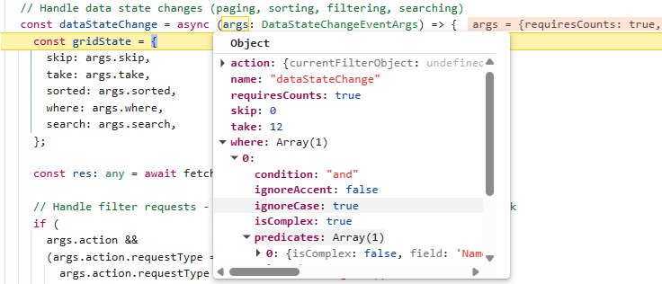
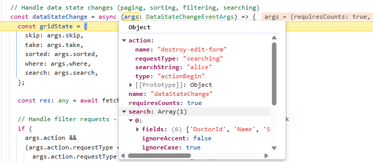
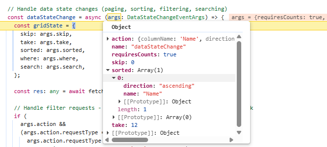
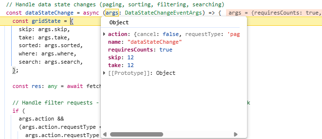
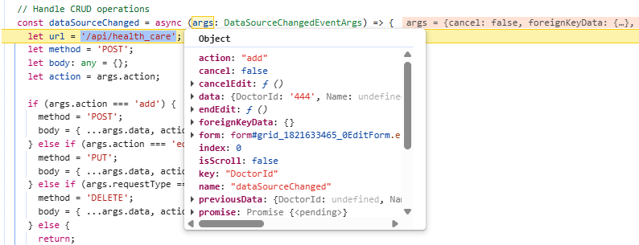
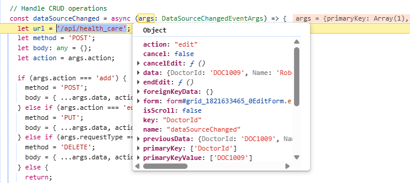
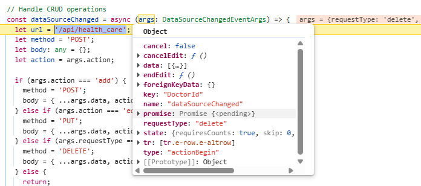

# Building a Next.js Application with Syncfusion React Grid and Routing

[Next.js](https://nextjs.org/) is a powerful React framework designed for building full-stack web applications. It includes built‑in features such as server‑side rendering, automatic code splitting, intuitive routing, and API routes, providing a solid foundation for developing modern, high‑performance applications.

## Prerequisites

  - Node.js: LTS version (e.g., v20.x or later).

  - npm/yarn: For package management.

## Building the Next.js application

Open a terminal (for example, an integrated terminal in Visual Studio Code or Windows Command prompt opened with <kbd>Win+R</kbd>, or macOS terminal launched with <kbd>Cmd+Space</kbd>) and run the following command to create and navigate to the project folder:

```bash
npm create next-app@latest nextjs_grid
cd nextjs_grid
```
Start the development server by running the below command:

```bash 
npm run dev
```
Now the project has been successfully launched, and the application is available at **http://localhost:3000**.

## Configuring Next.js server

Next.js Route handlers provide a modern way to create server-side endpoints within the App router, utilizing the Web-standard request and response APIs. They enable the execution of backend operations such as data processing, CRUD actions, and custom API creation without requiring an additional server layer.

Route handlers are defined in the **route.ts** file within the **app** directory, enabling custom request handlers for specific routes. The following steps outline the process for populating health care data entries:

**Step 1:** Create a new route file (**api/health_care/route.ts**) to implement the server-side data logic.

**Step 2:** Create a new database file (**data/health_care_Entities.ts**) to store the relevant data.

**Step 3:** Inside the **route.ts** file, add a "GET" method to return the data to the client when a request is sent. Ensure the response follows a structured format that includes both the current view dataset and the total data count. This approach supports on‑demand data loading and enables the client to handle operations such as paging or filtering effectively when using Syncfusion data binding approaches.

The required response format includes:
  - **result**: The list of data displayed in the current view, supporting on‑demand loading for large datasets.
  - **count**: The total count of records in the dataset.

```typescript
  import { NextResponse, NextRequest } from "next/server";
  import { doctorDetails } from '../../data/health_care_Entities';

  // GET - Retrieve all data
  export async function GET(request: NextRequest) {

      const count = doctorDetails.length;
      const result = doctorDetails;

      return NextResponse.json({ result, count });
  }
```

## Integrating Syncfusion React Grid with Next.js

The Syncfusion React Grid is a robust, high‑performance component built to efficiently display, manage, and manipulate large datasets. It provides advanced features such as sorting, filtering, and paging. Follow these steps to render the grid and integrate it with a Next.js application.

### Step 1: Adding Syncfusion packages

Install the necessary Syncfusion packages using the below command in Visual Studio Code terminal or Command prompt.

```bash
npm install @syncfusion/ej2-react-grids --save
npm install @syncfusion/ej2-data --save
```

After installation, the necessary CSS files are available in the (**../node_modules/@syncfusion**) directory. Add the required CSS references to the **global.css** file to ensure proper styling of the Grid component.

```css
  [global.css]

  @import '../node_modules/@syncfusion/ej2-base/styles/material3.css';
  @import '../node_modules/@syncfusion/ej2-buttons/styles/material3.css';  
  @import '../node_modules/@syncfusion/ej2-calendars/styles/material3.css';  
  @import '../node_modules/@syncfusion/ej2-dropdowns/styles/material3.css';  
  @import '../node_modules/@syncfusion/ej2-inputs/styles/material3.css';  
  @import '../node_modules/@syncfusion/ej2-navigations/styles/material3.css';
  @import '../node_modules/@syncfusion/ej2-popups/styles/material3.css';
  @import '../node_modules/@syncfusion/ej2-splitbuttons/styles/material3.css';
  @import "../node_modules/@syncfusion/ej2-react-grids/styles/material3.css";
  @import "../node_modules/@syncfusion/ej2-icons/styles/material3.css";
```

For this project, the "Material 3" theme is applied. Other themes can be selected, or the existing theme can be customized to meet specific project requirements. For detailed guidance on theming and customization, refer to the [Syncfusion React Components Appearance](https://ej2.syncfusion.com/react/documentation/appearance/theme) documentation.


### Step 2: Add Syncfusion React Grid component with Next.js

The Syncfusion React Grid provides [custom data binding](https://ej2.syncfusion.com/react/documentation/grid/data-binding/remote-data#custom-binding), which enables seamless integration with external API services. With this feature, the grid can fetch data from a Next.js server and efficiently display health care details. It supports search, filter, sort, and pagination capabilities, making it easy to navigate and manage large datasets.

```ts
  [app/page.tsx]

  'use client';
  import { useEffect } from 'react';
  import { GridComponent } from '@syncfusion/ej2-react-grids';

  export default function HealthCareGrid() {
    let gridInstance: GridComponent;
    const doctorIdRules: Object = { required: true };
    // Fetch data from server with current state
    const fetchData = async (gridState: any) => {
      const response = await fetch(`/api/health_care?gridState=${encodeURIComponent(JSON.stringify(gridState))}`, {
        method: 'GET',
        headers: { 'Content-Type': 'application/json' },
      });
      const res: any = await response.json();
      return res;
    };

    // Load initial data when component mounts
    useEffect(() => {
      if (gridInstance) {
        const initialState = {
          skip: 0,
          take: 12, // Default page size
          sorted: [],
          where: [],
          search: [],
        };
        fetchData(initialState).then((res) => {
          if (gridInstance) {
            gridInstance.dataSource = res;
          }
        });
      }
    }, []);

    return (
      <GridComponent
        ref={(g: GridComponent) => { gridInstance = g }}
        dataSource= {[]}
      >
        <ColumnsDirective>
          <ColumnDirective field='DoctorId' headerText='Doctor ID' width='120' isPrimaryKey={true} validationRules={doctorIdRules} />
          {/* Include additional columns here */}
        </ColumnsDirective>
      </GridComponent>
    );
  }
```

**custom data binding workflow**:

The Syncfusion Angular Grid supports custom data binding, enabling seamless integration with external API services. When Grid actions such as paging, sorting, filtering, or CRUD operations are performed, requests are sent to the API. The API processes these operations and returns the results in the required format, giving complete control over application‑specific workflows and enabling efficient handling of large datasets. The custom data binding feature can interact with backend APIs through two key events.

  - [dataStateChange](https://ej2.syncfusion.com/react/documentation/api/grid/index-default#datastatechange): Triggered when the Grid performs actions such as paging, sorting, or filtering. It provides the current state details, which are sent to the API so the request can be processed and data returned in the required "{ result:[], count:100 }" format.

 - [dataSourceChanged](https://ej2.syncfusion.com/react/documentation/api/grid/index-default#datasourcechanged): Triggered when users perform CRUD operations (Create, Update, Delete). It provides the affected record along with the action type, which is sent to the API to execute the corresponding insert, update, or delete operation.

Since the `dataStateChange` event does not fire on the first render, use the React `useEffect` hook to load the initial dataset when the component mounts. In **page.tsx**, define a "fetchData" function to send the grid state to the Next.js API and bind the returned data.

**API response format:**

  The Grid custom data binding feature expects the following response from the backend:

```ts
  { "result": [ /* records to display */ ], "count": 100 }
```

This format has already been implemented in the **route.ts** file during the Next.js server setup. 

> Include the line `use client` at the very beginning of the **page.tsx** file to ensure that the Grid runs as a client‑side component. The Grid depends on browser features such as event handling and dynamic rendering, which require client‑side execution in Next.js.

### Step 3: Implement data operations on server-side

In a Next.js server environment, the Syncfusion [DataManager](https://ej2.syncfusion.com/react/documentation/data/getting-started) efficiently handles data operations such as filtering, sorting, searching, paging. It processes the Syncfusion DataManager [Query](https://ej2.syncfusion.com/react/documentation/data/querying), which specifies all operation details, and executes them directly against the data source. By streamlining these tasks, DataManager ensures consistent, accurate results and significantly reduces development effort and time.

Inside the (**api/health_care/route.ts**) file, import the `DataManager` and `Query` from the `@syncfusion/ej2-data` package to implement the data operations using the Syncfusion DataManager.

```typescript
//[route.ts]
  import { NextResponse, NextRequest } from "next/server";
  import { DataManager, Query } from '@syncfusion/ej2-data';
  import { doctorDetails } from '../../data/health_care_Entities';

  // GET - Retrieve the resultant data
  export async function GET(request: NextRequest) {

    const gridStateParam: string = new URL(request.url).searchParams.get('gridState') as string;
    const gridState = JSON.parse(decodeURIComponent(gridStateParam));
    const query = new Query();

    // Execute query on data
    let result: object[] = new DataManager(doctorDetails).executeLocal(query);
    let count: number = result.length;

    return NextResponse.json({ result, count });
  }
```
In this application, the Grid communicates with the Next.js  server through the `dataStateChange` event. The complete code example below shows how to manage filtering, searching, sorting, and paging using this event.

```ts
  [app/page.tsx]

  export default function HealthCareGrid() {
    const doctorIdRules: Object = { required: true };
    // Handle data state changes (paging, sorting, filtering, searching)
    const dataStateChange = async (args: DataStateChangeEventArgs) => {
      const gridState = {
        skip: args.skip,
        take: args.take,
        sorted: args.sorted,
        where: args.where,
        search: args.search,
      };

      const res: any = await fetchData(gridState);

      // Handle filter requests - apply query filter and use dataSource callback
      if (
        args.action &&
        (args.action.requestType === 'filterchoicerequest' ||
          args.action.requestType === 'filterSearchBegin' ||
          args.action.requestType === 'stringfilterrequest')
      ) {
        args.dataSource(res.result); // For binding data to the Excel filter popup
      } else {
        // For other Grid actions like paging, sorting, bind directly to grid instance
        gridInstance.dataSource = res;
      }
    };

    return (
      <GridComponent
        ref={(g: GridComponent) => { gridInstance = g }
        dataSource={[]}
        dataStateChange={dataStateChange}
      >
        <ColumnsDirective>
          <ColumnDirective field='DoctorId' headerText='Doctor ID' width='120' isPrimaryKey={true} validationRules={doctorIdRules} />
          {/* Include additional columns here */}
        </ColumnsDirective>
      </GridComponent>
    );
  }
```

### Step 4: Implement filtering feature

The Grid supports filtering through a menu interface that restricts data based on column values. Filtering is enabled by setting the [allowFiltering](https://ej2.syncfusion.com/react/documentation/api/grid/index-default#allowfiltering) property to "true" and injecting the `Filter` module.  

```ts
  [app/page.tsx]

  import { ColumnDirective, ColumnsDirective, GridComponent, Inject, Filter, FilterSettingsModel  } from '@syncfusion/ej2-react-grids';

  export default function HealthCareGrid() {
    const doctorIdRules: Object = { required: true };
    const filterSettings: FilterSettingsModel = { type: 'Excel' };
    return (
      <GridComponent
        ref={(g: any) => { gridInstance = g }}
        dataSource={[]}
        allowFiltering={true}
        filterSettings={filterSettings}
        dataStateChange={dataStateChange}
      >
        <ColumnsDirective>
          <ColumnDirective field='DoctorId' headerText='Doctor ID' width='120' isPrimaryKey={true} validationRules={doctorIdRules} />
          {/* Include additional columns here */}
        </ColumnsDirective>
        <Inject services={[Filter]} />
      </GridComponent>
    );
  }
```

The [Implement data operations](#step-3-implement-data-operations-on-server-side) section already includes a code example that sends filter parameters from the Grid to the Next.js server using the `dataStateChange` event handler. When filtering is applied in the Grid, the `dataStateChange` event provides the current filter details through its `where` parameter. The image below illustrates how the filter state is passed to the `where` property of the `dataStateChange` event arguments.



The following code example demonstrates handling the filter action in the server file **route.ts** based on the Grid request.

```typescript
  import { Predicate } from '@syncfusion/ej2-data';
  import { NextResponse, NextRequest } from "next/server";
  import { DataManager, Query } from '@syncfusion/ej2-data';
  import { doctorDetails } from '../../data/health_care_Entities';

  // GET - Retrieve the resultant data
  export async function GET(request: NextRequest) {

    const gridStateParam: string = new URL(request.url).searchParams.get('gridState') as string;
    const gridState = JSON.parse(decodeURIComponent(gridStateParam));
    const query = new Query();

    // Filtering
    if (gridState.where && Array.isArray(gridState.where) && gridState.where.length > 0) {
      performFiltering(gridState.where, query);
    }

    // Execute query on data
    let result: object[] = new DataManager(doctorDetails).executeLocal(query);
    let count: number = result.length;

    return NextResponse.json({ result, count });
  }
```

Complex filter conditions, where multiple predicates are combined with logical operators such as **and** or **or**, can be handled using the following helper functions in the server file **route.ts**:


```typescript
  // Normalize condition string (default to 'and')
  const normalize = (condition?: string) => (condition || 'and').toLowerCase();

  // Recursively build predicate tree
  const buildPredicate = (node: any, ignoreCase: boolean): any =>
      node?.isComplex && node.predicates?.length
          ? node.predicates
              .map((p: Predicate) => buildPredicate(p, ignoreCase))
              .filter(Boolean)
              .reduce((acc: any, cur: any) =>
                  acc ? (normalize(node.condition) === 'or' ? acc.or(cur) : acc.and(cur)) : cur, null)
          : (node?.field && node?.operator ? new Predicate(node.field, node.operator, node.value, ignoreCase) : null);

  // Apply filtering based on predicates
  const performFiltering = (input: any, query: Query) => {
      const filter = Array.isArray(input) ? input[0] : input;
      if (!filter?.predicates?.length) return;
      const ignoreCase = filter.ignoreCase !== undefined ? !!filter.ignoreCase : true;
      const condition = normalize(filter.condition);
      const combined = filter.predicates
          .map((p: Predicate) => buildPredicate(p, ignoreCase))
          .filter(Boolean)
          .reduce((acc: any, cur: any) => acc ? (condition === 'or' ? acc.or(cur) : acc.and(cur)) : cur, null);
      if (combined) query.where(combined);
  };
```

  
### Step 5: Implement searching feature 

The search feature in the Grid allows users to quickly find and filter records by entering keywords. It scans all visible columns and displays only the matching rows, making it easier to locate specific information within large datasets. The searching feature in the Grid is enabled by adding `Search` to the Grid’s [toolbar](https://ej2.syncfusion.com/react/documentation/api/grid/index-default#toolbar) items and injecting the `Toolbar` module.

```ts
  [app/page.tsx]

  import { ColumnDirective, ColumnsDirective, GridComponent, Inject, Toolbar } from '@syncfusion/ej2-react-grids';

  export default function HealthCareGrid() {
    const doctorIdRules: Object = { required: true };
    return (
      <GridComponent
        ref={(g: GridComponent) => { gridInstance = g }}
        dataSource={[]}
        toolbar={['Search']}
        dataStateChange={dataStateChange}
      >
        <ColumnsDirective>
          <ColumnDirective field='DoctorId' headerText='Doctor ID' width='120' isPrimaryKey={true} validationRules={doctorIdRules}/>
          {/* Include additional columns here */}
        </ColumnsDirective>
        <Inject services={[Toolbar]} />
      </GridComponent>
    );
  }
```

The [Implement data operations](#step-3-implement-data-operations-on-server-side) section already includes a code example that sends search parameters from the Grid to the Next.js server using the `dataStateChange` event handler. When searching is applied in the Grid, the `dataStateChange` event provides the current search details through its `search` parameter. The image illustrates how the search state is passed to the `search` property of the `dataStateChange` event arguments.



The following code example demonstrates handling the search action inside the server **route.ts** file based on the Grid request:
  
```typescript
  import { Predicate } from '@syncfusion/ej2-data';
  import { NextResponse, NextRequest } from "next/server";
  import { DataManager, Query } from '@syncfusion/ej2-data';
  import { doctorDetails } from '../../data/health_care_Entities';

  // Helper function: Apply search functionality
  const performSearching = (searchParam: any, query: Query) => {
    const { fields, key, operator, ignoreCase } = searchParam[0];
    query.search(key, fields, operator, ignoreCase);
  };

  // GET - Retrieve the resultant data
  export async function GET(request: NextRequest) {

    const gridStateParam: string = new URL(request.url).searchParams.get('gridState') as string;
    const gridState = JSON.parse(decodeURIComponent(gridStateParam));
    const query = new Query();

    // Searching
    if (gridState.search && Array.isArray(gridState.search) && gridState.search.length > 0) {
      performSearching(gridState.search, query);
    }

    // Execute query on data
    let result: object[] = new DataManager(doctorDetails).executeLocal(query);
    let count: number = result.length;

    return NextResponse.json({ result, count });
  }
```

### Step 6: Implement sorting feature

The sorting feature in the Grid allows users to organize records in ascending or descending order based on one or more columns. The sorting feature in the Grid is enabled by setting the [allowSorting](https://ej2.syncfusion.com/react/documentation/api/grid/index-default#allowsorting) property to "true" and injecting the `Sort` module.

```ts
  [app/page.tsx]

  import { ColumnDirective, ColumnsDirective, GridComponent, Inject, Sort } from '@syncfusion/ej2-react-grids';

  export default function HealthCareGrid() {
    const doctorIdRules: Object = { required: true };
    return (
      <GridComponent
        ref={(g: GridComponent) => { gridInstance = g }}
        dataSource={[]}
        allowSorting={true}
        dataStateChange={dataStateChange}
      >
        <ColumnsDirective>
          <ColumnDirective field='DoctorId' headerText='Doctor ID' width='120' isPrimaryKey={true} validationRules={doctorIdRules}/>
          {/* Include additional columns here */}
        </ColumnsDirective>
        <Inject services={[Sort]} />
      </GridComponent>
    );
  }
```
The [Implement data operations](#step-3-implement-data-operations-on-server-side) section already includes a code example that sends sort parameters from the Grid to the Next.js server using the `dataStateChange` event handler. When sorting is applied in the Grid, the `dataStateChange` event provides the current sort details through its `sorted` parameter. The image illustrates how the sort state is passed to the `sorted` property of the `dataStateChange` event arguments.



The following code example demonstrates handling the sort action inside the server **route.ts** file based on the Grid request:

```typescript
  import { Predicate } from '@syncfusion/ej2-data';
  import { NextResponse, NextRequest } from "next/server";
  import { DataManager, Query } from '@syncfusion/ej2-data';
  import { doctorDetails } from '../../data/health_care_Entities';

  // Helper function: Apply sorting
  const performSorting = (sortArray: any[], query: Query) => {
    for (let i = 0; i < sortArray.length; i++) {
      const { name, direction } = sortArray[i];
      query.sortBy(name, direction);
    }
  };

  // GET - Retrieve the resultant data
  export async function GET(request: NextRequest) {

    const gridStateParam: string = new URL(request.url).searchParams.get('gridState') as string;
    const gridState = JSON.parse(decodeURIComponent(gridStateParam));
    const query = new Query();

    // Sorting
    if (gridState.sorted && Array.isArray(gridState.sorted) && gridState.sorted.length > 0) {
      performSorting(gridState.sorted, query);
    }

    // Execute query on data
    let result: object[] = new DataManager(doctorDetails).executeLocal(query);
    let count: number = result.length;

    return NextResponse.json({ result, count });
  }
```
  
### Step 7: Implement paging feature

The paging feature allows efficient loading of large data sets through on‑demand loading. Paging in the Grid is enabled by setting the [allowPaging](https://ej2.syncfusion.com/react/documentation/api/grid/index-default#allowpaging) property to "true" and injecting the `Page` module. This sends parameters to fetch only the data required for the current viewport.
```ts
  [app/page.tsx]

  import { ColumnDirective, ColumnsDirective, GridComponent, Inject, Page } from '@syncfusion/ej2-react-grids';

  export default function HealthCareGrid() {
    const doctorIdRules: Object = { required: true };
    return (
      <GridComponent
        ref={(g: GridComponent) => { gridInstance = g }}
        dataSource={[]}
        allowPaging={true}
        dataStateChange={dataStateChange}
      >
        <ColumnsDirective>
          <ColumnDirective field='DoctorId' headerText='Doctor ID' width='120' isPrimaryKey={true} validationRules={doctorIdRules}/>
          {/* Include additional columns here */}
        </ColumnsDirective>
        <Inject services={[Page]} />
      </GridComponent>
    );
  }
```

The [Implement data operations](#step-3-implement-data-operations-on-server-side) section already includes a code example that sends page parameters from the Grid to the Next.js server using the `dataStateChange` event handler. When paging is applied in the Grid, the `dataStateChange` event provides the current page details through its `skip` and `take` parameter. The image illustrates how the page state is passed to the `skip` and `take` property of the `dataStateChange` event arguments.



The following code example demonstrates handling the paging action inside the server **route.ts** file based on the Grid request:

```typescript
  import { Predicate } from '@syncfusion/ej2-data';
  import { NextResponse, NextRequest } from "next/server";
  import { DataManager, Query } from '@syncfusion/ej2-data';
  import { doctorDetails } from '../../data/health_care_Entities';

  // GET - Retrieve the resultant data
  export async function GET(request: NextRequest) {

    const gridStateParam: string = new URL(request.url).searchParams.get('gridState') as string;
    const gridState = JSON.parse(decodeURIComponent(gridStateParam));
    const query = new Query();

    // Execute query on data
    let result: object[] = new DataManager(doctorDetails).executeLocal(query);
    let count: number = result.length;

    // Paging
    if (gridState.take && gridState.take > 0) {
      const skip = gridState.skip || 0;
      const take = gridState.take;
      query.page(skip / take + 1, take);
      result = new DataManager(result).executeLocal(query);
    }

    return NextResponse.json({ result, count });
  }
```
  
### Step 8: Implement CRUD operations

Editing operations in the Grid are enabled through custom data binding by configuring the editSettings properties(`allowEditing`, `allowAdding`, and `allowDeleting`) to "true" and injecting the `Edit` module. The `dataSourceChanged` event must be included in the Grid component to send CRUD requests to the Next.js server. During a CRUD operation, this event is triggered and provides the necessary parameters to the server for processing create, update, or delete actions.

Grid data requires a primary key to modify row data based on the database’s unique values. To enable this, configure a primary key by setting the [isPrimaryKey](https://ej2.syncfusion.com/react/documentation/api/grid/column#isprimarykey) property must be set to "true" on the column that contains unique values.

```ts
  [app/page.tsx]

  import { ColumnDirective, ColumnsDirective, GridComponent, Inject, Edit, Toolbar, EditSettingsModel } from '@syncfusion/ej2-react-grids';

  export default function HealthCareGrid() {
    const dataSourceChanged = (args: DataSourceChangedEventArgs) => {
      // Handle CRUD operations here 
    };
    const editSettings: EditSettingsModel = { allowEditing: true, allowAdding: true, allowDeleting: true, mode: 'Normal' };
    const doctorIdRules: Object = { required: true };
    return (
      <GridComponent
        ref={(g: GridComponent) => { gridInstance = g }
        dataSource={[]}
        editSettings={editSettings}
        toolbar={['Add', 'Edit', 'Delete', 'Update', 'Cancel', 'Search']}
        dataStateChange={dataStateChange}
        dataSourceChanged={dataSourceChanged}
      >
        <ColumnsDirective>
          <ColumnDirective field='DoctorId' headerText='Doctor ID' width='120' isPrimaryKey={true} validationRules={doctorIdRules} />
          {/* Include the additional columns here */}
        </ColumnsDirective>
        <Inject
          services={[Edit, Toolbar]}
        />
      </GridComponent>
    );
  }
```
 
**Server‑side insert operation handling**:

In the **route.ts** file, define the "POST" method to manage the creation of new records. This method accepts the new data provided by the Grid and performs the insertion into the database.

```ts
  // POST - Create a new data
  export async function POST(request: NextRequest) {
    const body = await request.json();
    if (body.action === 'add') {
      const newDoctor: any = {
        DoctorId: body.DoctorId,
        Name: body.Name,
        Specialty: body.Specialty,
        Experience: body.Experience,
        Availability: body.Availability,
        Email: body.Email,
        Contact: body.Contact
      };
      doctorDetails.push(newDoctor);
      return NextResponse.json(newDoctor, { status: 201 });
    }
  }
```

The `dataSourceChanged` event handler in the **page.tsx** file is responsible for sending an asynchronous request to the server based on the Grid’s add record details provided in the event arguments. Once the server ("POST") method response is received, the `endEdit` method is invoked within the `dataSourceChanged` event to complete the Grid operation.

The image illustrates the newly inserted data passed to the server through the `dataSourceChanged` event arguments in the Grid:



```ts
  // Handle CRUD operations
  const dataSourceChanged = async (args: DataSourceChangedEventArgs) => {
    const response = await fetch('/api/health_care', {
      method: 'POST',
      headers: { 'Content-Type': 'application/json' },
      body: JSON.stringify({ ...args.data, action: 'add' }),
    });

    if (response.ok) {
      const result = await response.json();
      args.endEdit();
    }
  };
```
**Server‑side update operation handling**:

In the **route.ts** file, define the "PUT" method to manage updates for an existing record. This method accepts the updated data from the Grid and applies the changes to the database.

```ts
  // PUT - Update an existing data
  export async function PUT(request: NextRequest) {
    const body = await request.json();
    if (body.action === 'edit') {
      const doctorIndex = doctorDetails.findIndex(u => u.DoctorId === body.DoctorId);
      doctorDetails[doctorIndex] = {
        ...doctorDetails[doctorIndex],
        Name: body.Name || doctorDetails[doctorIndex].Name,
        Specialty: body.Specialty || doctorDetails[doctorIndex].Specialty,
        Experience: body.Experience || doctorDetails[doctorIndex].Experience,
        Availability: body.Availability || doctorDetails[doctorIndex].Availability,
        Email: body.Email || doctorDetails[doctorIndex].Email,
        Contact: body.Contact || doctorDetails[doctorIndex].Contact
      };
      return NextResponse.json(doctorDetails[doctorIndex]);
    }
  }
```

The `dataSourceChanged` event handler in the **page.tsx** file is responsible for sending an asynchronous request to the server based on the Grid’s update record details provided in the event arguments. Once the server ("PUT") method response is received, the `endEdit` method is invoked within the `dataSourceChanged` event to complete the Grid operation.

The image illustrates the updated data passed to the server through the `dataSourceChanged` event arguments in the Grid:




```ts
  // Handle CRUD operations
  const dataSourceChanged = async (args: DataSourceChangedEventArgs) => {
    const response = await fetch('/api/health_care', {
      method: 'PUT',
      headers: { 'Content-Type': 'application/json' },
      body: JSON.stringify({ ...args.data, action: 'edit' }),
    });

    if (response.ok) {
      const result = await response.json();
      args.endEdit();
    }
  };
```

**Server‑side delete operation handling**:

In the **route.ts** file, define the "DELETE" method to handle the removal of existing records. This method receives the primary key value from the client and deletes the corresponding record from the database.

```ts
  // DELETE - Delete a data
  export async function DELETE(request: NextRequest) {
    const body = await request.json();
    if (body.action === 'delete') {
      const doctorID = body[0].DoctorId;
      const doctorIndex = doctorDetails.findIndex(u => u.DoctorId === doctorID);
      const deletedDoctor = doctorDetails[doctorIndex];
      doctorDetails.splice(doctorIndex, 1);
      return NextResponse.json({ message: "Doctor deleted successfully" });
    }
  }
```

The `dataSourceChanged` event handler in the **page.tsx** file is responsible for sending an asynchronous request to the server based on the Grid’s delete record details provided in the event arguments. Once the server ("DELETE") method response is received, the `endEdit` method is invoked within the `dataSourceChanged` event to complete the Grid operation.

The image illustrates the deleted data passed to the server through the `dataSourceChanged` event arguments in the Grid:



```ts
  // Handle CRUD operations
  const dataSourceChanged = async (args: DataSourceChangedEventArgs) => {
    const response = await fetch('/api/health_care', {
      method: 'DELETE',
      headers: { 'Content-Type': 'application/json' },
      body: JSON.stringify({ ...args.data, action: 'delete' }),
    });

    if (response.ok) {
      const result = await response.json();
      args.endEdit();
    }
  };
```

## Routing

Next.js uses a file‑system‑based router to manage navigation, primarily through the modern **App Router**.

In this application, routing is used to display the appointment details of doctors. When the "View Appointment Details" button in the Doctors portal is clicked, the selected "DoctorId" is passed as a router parameter. The patients assigned to that doctor are then displayed on a separate page.

**Step 1:** Create a dynamic route folder (**app/patients/[doctorID]**).

**Step 2:** Create a (**page.tsx**) file inside this folder (**app/patients/[doctorID]/page.tsx**).

**Step 3:** Install the Syncfusion React Button component to the render routing button.

```bash
npm install @syncfusion/ej2-react-buttons --save
```

**Step 4:** Configure the Doctors portal page with a template column. Enable routing to the appointment details page when the button inside the template column is clicked, and pass "DoctorID" as the router parameter.

```ts
  import { useRouter } from 'next/navigation';
  import { ButtonComponent } from '@syncfusion/ej2-react-buttons';

  export default function HealthCareGrid() {
    const router = useRouter();
    let gridInstance: GridComponent;

    // Handle appointment button click - navigate to patient page
    function btnClick(props: any) {
      let rowData = (gridInstance as GridComponent).getRowInfo(props.target).rowData;
      let doctorID = (rowData as any).DoctorId;
      router.push(`/patients/${doctorID}`);
    }

    // Template function: Render appointment button
    function appointmentTemplate(props: any) {
      return (<ButtonComponent onClick={btnClick}>View Appointments</ButtonComponent>);
    }

    return (
      <div>
        <h1>Doctors Portal</h1>
        <GridComponent
          ref={(g: any) => { gridInstance = g }}
          height={400}
          >
          <ColumnsDirective>
            {/* Include columns here */}
            <ColumnDirective headerText='Appointments' width='150' template={appointmentTemplate} allowEditing={false} />
          </ColumnsDirective>
        </GridComponent>
      </div>
    );
  }

```
**Step 5:** Add the code for the Grid containing appointment details inside the dynamic route file (**app/Patients/DoctorID/page.tsx**). Retrieve the router parameters and pass the "DoctorId" to the query property of the Grid. This ensures that only the patients associated with the current doctor are fetched and displayed.

```ts
  'use client';

  import { ColumnDirective, ColumnsDirective, GridComponent } from '@syncfusion/ej2-react-grids';
  import { ButtonComponent } from '@syncfusion/ej2-react-buttons';
  import { patientData } from '../../data/health_care_Entities';
  import { use } from 'react';
  import { Query } from '@syncfusion/ej2-data';
  import { useRouter } from 'next/navigation';

  export default function Patient({ params }: { params: Promise<{ DoctorID: string }> }) {
    const router = useRouter();
    // Retrieve the route params
    const routeParams: any = use(params);

    // Create query to filter appointments for the specific doctor
    const query: any = new Query();
    query.where('DoctorAssigned', 'equal', routeParams.doctorID, true);

    // Handler for navigation back to home page
    function btnClick() {
      router.push(`/`);
    }

    return (
      <>
        <h2>Appointment Details</h2>
        <GridComponent
          dataSource={patientData}
          query={query}
        >
          <ColumnsDirective>
            {/* Include columns here */}
          </ColumnsDirective>
        </GridComponent>
        <div className='backbtn'>
          {/* Button to return back to Home page */}
          <ButtonComponent onClick={btnClick}>Home Page</ButtonComponent>
        </div>
      </>
    )
  }
```

## Running the application

Use the below command to run the application.
  
```bash
npm run dev
```
Open http://localhost:3000 in the browser.
  
## Complete sample repository

A complete, working sample implementation is available in the [GitHub repository](https://github.com/SyncfusionExamples/syncfusion-react-grid-component-in-nextjs/tree/master)
  
## Summary
  
This guide demonstrates how to:
1. Create a Next.js project and install the required packages. [🔗](#building-the-nextjs-application)
2. Configure Next.js route handlers to create server-side API endpoints. [🔗](#configuring-nextjs-server)
3. Integrate Syncfusion React Grid with the Next.js server using the custom data binding feature. [🔗](#integrating-syncfusion-react-grid-with-nextjs)
4. Handle data operations like filtering, searching, sorting, and paging in the Grid. [🔗](#step-3-implement-data-operations-on-server-side)
5. Implement CRUD operations (Create, Read, Update, Delete) using POST, GET, PUT, and DELETE methods. [🔗](#step-8-implement-crud-operations)
6. Set up navigation to other pages using the Next.js routing feature. [🔗](#routing)
7. Deploy and run the application to manage and display data efficiently in the Grid. [🔗](#running-the-application)
  
The application now provides a complete solution for integrating the Syncfusion React Grid with Next.js server, enabling seamless data operations with a modern, user-friendly interface.

## See also

  - [Types of Edit](https://ej2.syncfusion.com/react/documentation/grid/editing/edit-types)
  - [Validation Rules](https://ej2.syncfusion.com/react/documentation/grid/editing/validation)
  - [Filter Menu](https://ej2.syncfusion.com/react/documentation/grid/filtering/filter-menu)
