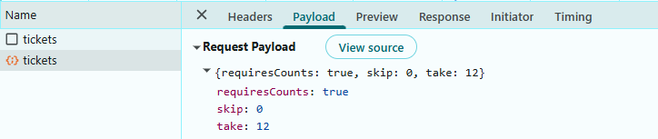
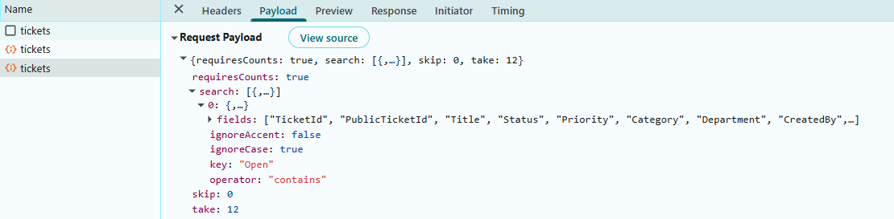
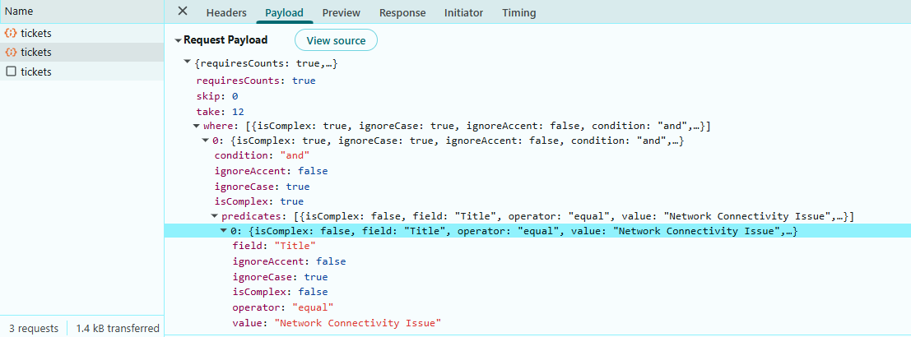
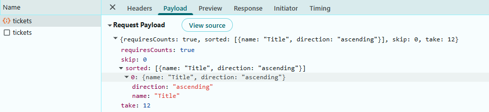
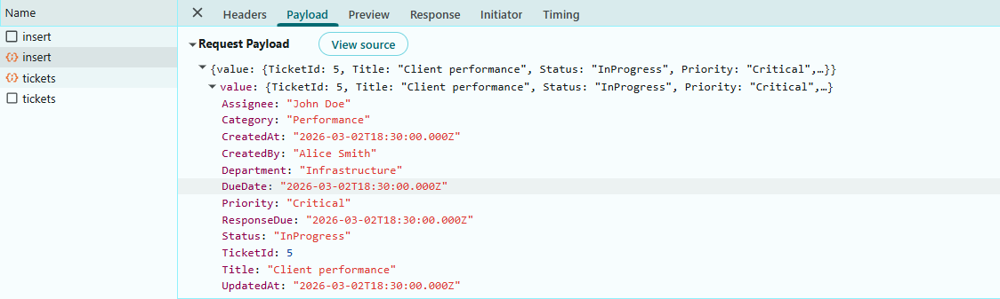
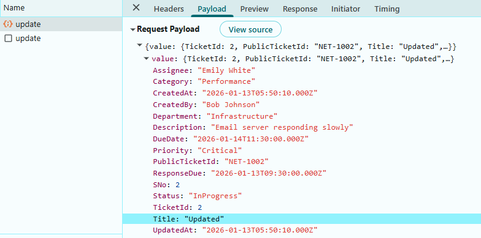
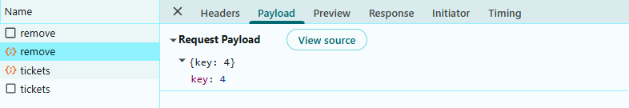

# Connecting SQL Server to React Grid Using ASP.NET Core Web API

The Syncfusion<sup style="font-size:70%">&reg;</sup> React Grid supports binding data from a Microsoft SQL Server database through an ASP.NET Core Web API using ADO.NET SqlClient. This modern architecture provides a secure and scalable alternative to accessing the database directly from the client, while enabling efficient server‑side processing for paging, sorting, and filtering. By leveraging React for the UI and ASP.NET Core with SqlClient for data access, applications maintain a clear separation between presentation and data layers and retain full control over SQL Server interactions.

**What is Microsoft SqlClient?**

[Microsoft.Data.SqlClient](https://www.nuget.org/packages/Microsoft.Data.SqlClient) is the official .NET data provider used to connect ASP.NET Core applications to Microsoft SQL Server. It enables applications to execute SQL queries, call stored procedures, and read or write data securely using strongly supported APIs from Microsoft. SqlClient is commonly used in Web APIs where precise control over database access, performance, and security is required.

**Key benefits of SqlClient:**

- **Secure by Design**: Supports parameterized queries to help prevent SQL injection attacks.
- **High Performance**: Provides efficient, low‑level access to SQL Server with minimal overhead.
- **Asynchronous Support**: Supports async database operations for better scalability in web APIs.
- **Full SQL Control**: Allows precise control over SQL queries, stored procedures, and transactions.
- **Official Microsoft Provider**: Maintained and supported by Microsoft for long‑term compatibility with SQL Server.

## Prerequisites

Ensure the following software and packages are installed before proceeding:

| Software/Package | Version | Purpose |
| ------------------ | -------- | --------- |
| Node.js | 18.x or later | React development runtime |
| React | 18.x or later | Create and run React apps |
| .NET SDK | 8.0 or later | Build and run ASP.NET Core Web API |
| SQL Server | 2019 or later | Database server |
| @syncfusion/ej2-react-grids | Latest | React Grid component |
| @syncfusion/ej2-data | Latest | DataManager and adaptors |
| Microsoft.Data.SqlClient (NuGet) | Latest | SQL Server connectivity |
| Syncfusion.EJ2 (NuGet) | Latest | Server helpers (DataManagerRequest, DataOperations) |


## Key topics

| # | Topics | Link |
|---|---------|-------|
| 1 | Setting up and configuring a Microsoft SQL Server–backed ASP.NET Core Web API using ADO.NET SqlClient | [View](#setting-up-the-sql-server-environment-for-sqlclient) |
| 2 | Integrating the Syncfusion<sup style="font-size:70%">&reg;</sup> React Grid with the ASP.NET Core Web API using DataManager and CustomAdaptor | [View](#integrating-syncfusion-react-grid) |
| 3 | Implementing server‑side data operations including paging, searching, filtering, and sorting | [View](#step-6-implement-paging-feature) |
| 4 | Performing full CRUD and batch operations from the React Grid against the SQL Server database | [View](#step-10-perform-crud-operations) |


## Setting up the SQL server environment for SqlClient

First, the **SQL Server database** structure must be created to store ticket records.

**Instructions:**

1. Open SQL Server Management Studio (SSMS) or any SQL Server client.
2. Create a new database named "NetworkSupportDB".
3. Define a "Tickets" table with the specified schema.
4. Insert sample data for testing.

Run the following SQL script:

```sql
-- Create Database
IF NOT EXISTS (SELECT * FROM sys.databases WHERE name = 'NetworkSupportDB')
BEGIN
    CREATE DATABASE NetworkSupportDB;
END
GO

USE NetworkSupportDB;
GO

-- Create Tickets Table
IF NOT EXISTS (SELECT * FROM sys.tables WHERE name = 'Tickets')
BEGIN
    CREATE TABLE dbo.Tickets (
        TicketId INT PRIMARY KEY IDENTITY(1,1),
        PublicTicketId VARCHAR(50) NOT NULL UNIQUE,
        Title VARCHAR(200) NULL,
        Description TEXT NULL,
        Category VARCHAR(100) NULL,
        Department VARCHAR(100) NULL,
        Assignee VARCHAR(100) NULL,
        CreatedBy VARCHAR(100) NULL,
        Status VARCHAR(50) NOT NULL DEFAULT 'Open',
        Priority VARCHAR(50) NOT NULL DEFAULT 'Medium',
        ResponseDue DATETIME2 NULL,
        DueDate DATETIME2 NULL,
        CreatedAt DATETIME2 NOT NULL DEFAULT GETDATE(),
        UpdatedAt DATETIME2 NOT NULL DEFAULT GETDATE()
    );
END
GO

-- Insert Sample Data (Optional)
INSERT INTO dbo.Tickets (PublicTicketId, Title, Description, Category, Department, Assignee, CreatedBy, Status, Priority, ResponseDue, DueDate, CreatedAt, UpdatedAt)
VALUES
('NET-1001', 'Network Connectivity Issue', 'Users unable to connect to the VPN', 'Network Issue', 'Network Ops', 'John Doe', 'Alice Smith', 'Open', 'High', '2026-01-14 10:00:00', '2026-01-15 17:00:00', '2026-01-13 10:15:30', '2026-01-13 10:15:30'),
('NET-1002', 'Server Performance Degradation', 'Email server responding slowly', 'Performance', 'Infrastructure', 'Emily White', 'Bob Johnson', 'InProgress', 'Critical', '2026-01-13 15:00:00', '2026-01-14 17:00:00', '2026-01-13 11:20:10', '2026-01-13 11:20:10');
GO
```

After executing this script, the ticket records are stored in the "Tickets" table within the "NetworkSupportDB" database. The database is now ready for integration with the application.

## Step 1: Create the ASP.NET Core web api project

To connect the Syncfusion<sup style="font-size:70%">&reg;</sup>  React Grid to Microsoft SQL Server, the **ASP.NET Core Web API server** must be configured with the required NuGet packages. The server application is responsible for handling HTTP requests from the Grid and accessing data from SQL Server.

An ASP.NET Core Web API project includes essential files such as **Program.cs**, **appsettings.json**, and a **Controllers** folder. These components manage application startup, configuration, and API endpoints.

In this guide, an ASP.NET Core Web API project named **Grid_MSSQL.Server** is used. After the server project is available, install the required NuGet packages to enable SQL Server connectivity and server‑side grid operations.

To create a new ASP.NET Core Web API project using the .NET CLI, execute the below command in terminal.

```bash
dotnet new webapi -n Grid_MSSQL.Server
cd Grid_MSSQL.Server
```

Add the SQL Server client library and Syncfusion<sup style="font-size:70%">&reg;</sup> server‑side helper packages.

```bash
dotnet add package Microsoft.Data.SqlClient
dotnet add package Syncfusion.EJ2
```

The Web API exposes HTTP endpoints that are used by the Grid to perform read and data modification operations. The Syncfusion<sup style="font-size:70%">&reg;</sup> server helper package provides the required types for processing grid requests and applying data operations on the server.

### Step 2: Create the Data Model

A data model is a C# class that represents the structure of a database table. This model defines the properties that correspond to the columns in the "Tickets" table.

**Instructions:**

1. Create a new folder named **Data** in the application project.
2. Inside the **Data** folder, create a new file named **Tickets.cs**.
3. Define the **Tickets** class with the following code:

```csharp
using System.ComponentModel.DataAnnotations;

namespace Grid_MSSQL.Server.Data
{
    /// <summary>
    /// Represents a ticket record mapped to the 'Tickets' table in the database.
    /// This model defines the structure of ticket-related data used throughout the application.
    /// </summary>
    public class Tickets
    {
        /// <summary>
        /// Gets or sets the unique identifier for the ticket record.
        /// </summary>
        [Key]
        public int TicketId { get; set; }

        /// <summary>
        /// Gets or sets the public-facing ticket identifier (e.g., NET-1001).
        /// </summary>
        public string? PublicTicketId { get; set; }

        /// <summary>
        /// Gets or sets the ticket title or subject.
        /// </summary>
        public string? Title { get; set; }

        /// <summary>
        /// Gets or sets a detailed description of the ticket.
        /// </summary>
        public string? Description { get; set; }

        /// <summary>
        /// Gets or sets the category of the issue (e.g., Network, Hardware, Software).
        /// </summary>
        public string? Category { get; set; }

        /// <summary>
        /// Gets or sets the department responsible for handling the ticket.
        /// </summary>
        public string? Department { get; set; }

        /// <summary>
        /// Gets or sets the name of the agent assigned to the ticket.
        /// </summary>
        public string? Assignee { get; set; }

        /// <summary>
        /// Gets or sets the name of the person who created the ticket.
        /// </summary>
        public string? CreatedBy { get; set; }

        /// <summary>
        /// Gets or sets the current status of the ticket (e.g., Open, In Progress, Resolved, Closed).
        /// </summary>
        public string? Status { get; set; }

        /// <summary>
        /// Gets or sets the priority level of the ticket (e.g., Critical, High, Medium, Low).
        /// </summary>
        public string? Priority { get; set; }

        /// <summary>
        /// Gets or sets the deadline for responding to the ticket.
        /// </summary>
        public DateTime? ResponseDue { get; set; }

        /// <summary>
        /// Gets or sets the deadline for resolving the ticket.
        /// </summary>
        public DateTime? DueDate { get; set; }

        /// <summary>
        /// Gets or sets the timestamp indicating when the ticket was created.
        /// </summary>
        public DateTime? CreatedAt { get; set; }

        /// <summary>
        /// Gets or sets the timestamp indicating when the ticket was last updated.
        /// </summary>
        public DateTime? UpdatedAt { get; set; }
    }
}
```

**Explanation:**

- The "[Key]" attribute marks the "TicketId" property as the primary key (a unique identifier for each record).
- Each property represents a column in the database table.
- The "?" symbol indicates that a property is nullable (can be empty).
- The model includes comprehensive XML documentation for each property.

The data model has been successfully created.

### Step 3: Create the Repository class

A repository class is an intermediary layer that handles all database operations. This class uses SqlClient to communicate with the database.

**Instructions:**

1. Inside the **Data** folder, create a new file named **TicketRepository.cs**.
2. Define the **TicketRepository** class with the following code:

```csharp
using Microsoft.Data.SqlClient;

namespace Grid_MSSQL.Server.Data
{
    public class TicketRepository
    {
        private readonly string _connectionString;

        // Public Ticket ID Configuration
        private const string PublicTicketIdPrefix = "NET";
        private const string PublicTicketIdSeparator = "-";
        private const int PublicTicketIdStartNumber = 1001;

        /// <summary>
        /// Initializes the repository with a connection string from configuration.
        /// </summary>
        public TicketRepository(IConfiguration configuration)
        {
            _connectionString = configuration.GetConnectionString("TicketDb")!;
        }

        /// <summary>
        /// Creates a new SQL connection using the configured connection string.
        /// </summary>
        private SqlConnection GetConnection() => new SqlConnection(_connectionString);

        /// <summary>
        /// Returns all tickets ordered by TicketId.
        /// </summary>
        public async Task<List<Tickets>> GetTicketsAsync()
        {
            var list = new List<Tickets>();
            const string sql =
                @"SELECT TicketId, PublicTicketId, Title, Description, Category, Department, Assignee, 
                                        CreatedBy, Status, Priority, ResponseDue, DueDate, CreatedAt, UpdatedAt
                                 FROM dbo.Tickets ORDER BY TicketId";

            await using var conn = GetConnection();
            await conn.OpenAsync();
            await using var cmd = new SqlCommand(sql, conn);
            await using var reader = await cmd.ExecuteReaderAsync();

            while (await reader.ReadAsync())
            {
                list.Add(
                    new Tickets
                    {
                        TicketId = reader.GetInt32(reader.GetOrdinal("TicketId")),
                        PublicTicketId = reader["PublicTicketId"] as string,
                        Title = reader["Title"] as string,
                        Description = reader["Description"] as string,
                        Category = reader["Category"] as string,
                        Department = reader["Department"] as string,
                        Assignee = reader["Assignee"] as string,
                        CreatedBy = reader["CreatedBy"] as string,
                        Status = reader["Status"] as string,
                        Priority = reader["Priority"] as string,
                        ResponseDue =
                            reader["ResponseDue"] == DBNull.Value
                                ? null
                                : Convert.ToDateTime(reader["ResponseDue"]),
                        DueDate =
                            reader["DueDate"] == DBNull.Value
                                ? null
                                : Convert.ToDateTime(reader["DueDate"]),
                        CreatedAt =
                            reader["CreatedAt"] == DBNull.Value
                                ? null
                                : Convert.ToDateTime(reader["CreatedAt"]),
                        UpdatedAt =
                            reader["UpdatedAt"] == DBNull.Value
                                ? null
                                : Convert.ToDateTime(reader["UpdatedAt"]),
                    }
                );
            }
            return list;
        }

        /// <summary>
        /// Generates the next public ticket ID (e.g., NET-1002) by reading the current max numeric suffix.
        /// </summary>
        private async Task<string> GeneratePublicTicketIdAsync()
        {
            // Efficiently get max numeric suffix with SQL
            string like = $"{PublicTicketIdPrefix}{PublicTicketIdSeparator}%";
            const string sql =
                @"
                SELECT MAX(TRY_CAST(SUBSTRING(PublicTicketId, LEN(@prefix) + LEN(@sep) + 1, 50) AS INT))
                FROM dbo.Tickets
                WHERE PublicTicketId LIKE @like";
            int? maxNumber = null;

            await using var conn = GetConnection();
            await conn.OpenAsync();
            await using var cmd = new SqlCommand(sql, conn);
            cmd.Parameters.AddWithValue("@prefix", PublicTicketIdPrefix);
            cmd.Parameters.AddWithValue("@sep", PublicTicketIdSeparator);
            cmd.Parameters.AddWithValue("@like", like);

            var result = await cmd.ExecuteScalarAsync();
            if (result != DBNull.Value && result != null)
            {
                maxNumber = Convert.ToInt32(result);
            }

            int next = (maxNumber ?? (PublicTicketIdStartNumber - 1)) + 1;
            return $"{PublicTicketIdPrefix}{PublicTicketIdSeparator}{next}";
        }

        /// <summary>
        /// Inserts a new ticket and returns the created entity with its TicketId.
        /// </summary>
        public async Task<Tickets> InsertAsync(Tickets value)
        {
            // Auto-generate PublicTicketId if empty
            if (string.IsNullOrWhiteSpace(value.PublicTicketId))
            {
                value.PublicTicketId = await GeneratePublicTicketIdAsync();
            }

            // Default timestamps
            value.CreatedAt ??= DateTime.UtcNow;
            value.UpdatedAt ??= DateTime.UtcNow;

            const string sql =
                @"
                INSERT INTO dbo.Tickets
                (PublicTicketId, Title, Description, Category, Department, Assignee, CreatedBy, Status, Priority, ResponseDue, DueDate, CreatedAt, UpdatedAt)
                OUTPUT INSERTED.TicketId
                VALUES
                (@PublicTicketId, @Title, @Description, @Category, @Department, @Assignee, @CreatedBy, @Status, @Priority, @ResponseDue, @DueDate, @CreatedAt, @UpdatedAt);";

            await using var conn = GetConnection();
            await conn.OpenAsync();
            await using var cmd = new SqlCommand(sql, conn);
            cmd.Parameters.AddWithValue(
                "@PublicTicketId",
                (object?)value.PublicTicketId ?? DBNull.Value
            );
            cmd.Parameters.AddWithValue("@Title", (object?)value.Title ?? DBNull.Value);
            cmd.Parameters.AddWithValue("@Description", (object?)value.Description ?? DBNull.Value);
            cmd.Parameters.AddWithValue("@Category", (object?)value.Category ?? DBNull.Value);
            cmd.Parameters.AddWithValue("@Department", (object?)value.Department ?? DBNull.Value);
            cmd.Parameters.AddWithValue("@Assignee", (object?)value.Assignee ?? DBNull.Value);
            cmd.Parameters.AddWithValue("@CreatedBy", (object?)value.CreatedBy ?? DBNull.Value);
            cmd.Parameters.AddWithValue("@Status", (object?)value.Status ?? DBNull.Value);
            cmd.Parameters.AddWithValue("@Priority", (object?)value.Priority ?? DBNull.Value);
            cmd.Parameters.AddWithValue("@ResponseDue", (object?)value.ResponseDue ?? DBNull.Value);
            cmd.Parameters.AddWithValue("@DueDate", (object?)value.DueDate ?? DBNull.Value);
            cmd.Parameters.AddWithValue("@CreatedAt", (object?)value.CreatedAt ?? DBNull.Value);
            cmd.Parameters.AddWithValue("@UpdatedAt", (object?)value.UpdatedAt ?? DBNull.Value);

            value.TicketId = Convert.ToInt32(await cmd.ExecuteScalarAsync());
            return value;
        }

        /// <summary>
        /// Updates an existing ticket by TicketId and returns the updated entity.
        /// </summary>
        public async Task<Tickets> UpdateAsync(Tickets value)
        {
            value.UpdatedAt ??= DateTime.UtcNow;

            const string sql =
                @"
                UPDATE dbo.Tickets
                   SET PublicTicketId = @PublicTicketId,
                       Title         = @Title,
                       Description   = @Description,
                       Category      = @Category,
                       Department    = @Department,
                       Assignee      = @Assignee,
                       CreatedBy     = @CreatedBy,
                       Status        = @Status,
                       Priority      = @Priority,
                       ResponseDue   = @ResponseDue,
                       DueDate       = @DueDate,
                       UpdatedAt     = @UpdatedAt
                 WHERE TicketId     = @TicketId;";

            await using var conn = GetConnection();
            await conn.OpenAsync();
            await using var cmd = new SqlCommand(sql, conn);
            cmd.Parameters.AddWithValue("@TicketId", value.TicketId);
            cmd.Parameters.AddWithValue(
                "@PublicTicketId",
                (object?)value.PublicTicketId ?? DBNull.Value
            );
            cmd.Parameters.AddWithValue("@Title", (object?)value.Title ?? DBNull.Value);
            cmd.Parameters.AddWithValue("@Description", (object?)value.Description ?? DBNull.Value);
            cmd.Parameters.AddWithValue("@Category", (object?)value.Category ?? DBNull.Value);
            cmd.Parameters.AddWithValue("@Department", (object?)value.Department ?? DBNull.Value);
            cmd.Parameters.AddWithValue("@Assignee", (object?)value.Assignee ?? DBNull.Value);
            cmd.Parameters.AddWithValue("@CreatedBy", (object?)value.CreatedBy ?? DBNull.Value);
            cmd.Parameters.AddWithValue("@Status", (object?)value.Status ?? DBNull.Value);
            cmd.Parameters.AddWithValue("@Priority", (object?)value.Priority ?? DBNull.Value);
            cmd.Parameters.AddWithValue("@ResponseDue", (object?)value.ResponseDue ?? DBNull.Value);
            cmd.Parameters.AddWithValue("@DueDate", (object?)value.DueDate ?? DBNull.Value);
            cmd.Parameters.AddWithValue("@UpdatedAt", (object?)value.UpdatedAt ?? DBNull.Value);

            await cmd.ExecuteNonQueryAsync();
            return value;
        }

        /// <summary>
        /// Deletes a ticket by TicketId. Returns affected rows (0 or 1).
        /// </summary>
        public async Task<int> DeleteAsync(int ticketId)
        {
            const string sql = @"DELETE FROM dbo.Tickets WHERE TicketId = @TicketId;";
            await using var conn = GetConnection();
            await conn.OpenAsync();
            await using var cmd = new SqlCommand(sql, conn);
            cmd.Parameters.AddWithValue("@TicketId", ticketId);
            return await cmd.ExecuteNonQueryAsync();
        }
    }
}
```

**Explanation:**

- **TicketRepository**: Reads the "TicketDb" connection string from configuration and stores it for later use.

- **GetConnection**: Creates a new "SqlConnection" using the stored connection string.

- **GetTicketsAsync**: Executes a SELECT on "Tickets", maps rows to "Tickets" objects (handling NULLs), and returns the full list ordered by "TicketId".

- **GeneratePublicTicketIdAsync**: Finds the current max numeric suffix in "PublicTicketId" (format "NET-####") and returns the next ID; starts at "NET-1001" if none exist.

- **InsertAsync**: Ensures "PublicTicketId" exists (auto-generates if blank), sets default timestamps, inserts the ticket, and returns the entity with the generated "TicketId".

- **UpdateAsync**: Updates all mutable fields for an existing ticket by "TicketId", refreshes "UpdatedAt", and returns the updated entity.

- **DeleteAsync**: Deletes the ticket matching "TicketId" and returns the number of affected rows (0 or 1).

The repository class has been created.

### Step 4: Configure the connection string

A connection string contains the information needed to connect the application to the SQL Server database, including the server address, database name, and authentication credentials.

**Instructions:**

1. Open the **appsettings.json** file in the project root.
2. Add or update the `ConnectionStrings` section with the SQL Server connection details:

```json
{
  "ConnectionStrings": {
    "TicketDb": "Data Source=localhost;Initial Catalog=NetworkSupportDB;Integrated Security=True;Connect Timeout=30;Encrypt=False;Trust Server Certificate=False;Application Intent=ReadWrite;Multi Subnet Failover=False"
  },
  "Logging": {
    "LogLevel": {
      "Default": "Information",
      "Microsoft.AspNetCore": "Warning"
    }
  },
  "AllowedHosts": "*"
}
```

**Connection string components:**

| Component | Description |
| ----------- | ------------- |
| Data Source | The address of the SQL Server instance (server name, IP address, or localhost) |
| Initial Catalog | The database name (in this case, "NetworkSupportDB") |
| Integrated Security | Set to "True" for Windows Authentication; use "False" with Username/Password for SQL Authentication |
| Connect Timeout | Connection timeout in seconds (default is 15) |
| Encrypt | Enables encryption for the connection (set to "True" for production environments) |
| Trust Server Certificate | Whether to trust the server certificate (set to "False" for security) |
| Application Intent | Set to "ReadWrite" for normal operations or "ReadOnly" for read-only scenarios |
| Multi Subnet Failover | Used in failover clustering scenarios (typically "False") |

The database connection string has been configured successfully.

### Step 5: Register services

The **Program.cs** file is where application services are registered and configured. This file must be updated to register services and the repository for dependency injection.

**Instructions:**

1. Open the **Program.cs** file at the project root.
2. Replace the existing content with the following configuration:

```csharp
using Grid_MSSQL.Server.Data;

var builder = WebApplication.CreateBuilder(args);

// Add controllers and keep JSON property names as-is (PascalCase)
builder
    .Services.AddControllers()
    .AddJsonOptions(options =>
    {
        options.JsonSerializerOptions.PropertyNamingPolicy = null;
        options.JsonSerializerOptions.DictionaryKeyPolicy = null;
        options.JsonSerializerOptions.ReferenceHandler = null;
    });

// (Optional) Swagger for API exploration in Development
builder.Services.AddEndpointsApiExplorer();
builder.Services.AddSwaggerGen();

// CORS: allow all (simple for local dev / separate frontend)
builder.Services.AddCors(options =>
{
    options.AddDefaultPolicy(policy => policy.AllowAnyOrigin().AllowAnyHeader().AllowAnyMethod());
});

// Register repository for DI
builder.Services.AddScoped<TicketRepository>();

var app = builder.Build();

// Swagger only in Development
if (app.Environment.IsDevelopment())
{
    app.UseSwagger();
    app.UseSwaggerUI();
}

// Enable CORS and map controllers
app.UseCors();
app.MapControllers();

app.Run();
```

**Explanation:**

- **Create the app builder**: Initializes the ASP.NET Core application and prepares services and configuration.

- **Add Controllers**: Enables API controllers so the app can handle HTTP requests.

- **JSON Options**: Preserves JSON property names exactly as defined in C# models (PascalCase).

- **Swagger**: Adds Swagger support for testing APIs during development.

- **CORS**: Allows requests from any frontend (useful when frontend and backend are on different ports/domains).

- **Register TicketRepository**: Registers the repository with Dependency Injection so controllers can use it.

- **Build the app**: Finalizes all configurations and services.

- **Enable Swagger (Dev only)**: Shows Swagger UI only when running in development mode.

- **Use CORS**: Applies the CORS rules to incoming requests.

- **Map Controllers**: Connects controller routes (e.g., api/tickets) to the app.

- **Run the app**: Starts the web server and listens for requests.

This setup registers controllers, enables a permissive CORS policy for development, exposes Swagger UI, and wires the "TicketRepository" for dependency injection.

## Integrating Syncfusion React Grid

The Syncfusion<sup style="font-size:70%">&reg;</sup> React Grid is a robust, high‑performance component built to efficiently display, manage, and manipulate large datasets. It provides advanced features such as sorting, filtering, and paging. Follow these steps to render the grid and integrate it with the SQL Server database.

### Step 1: Creating the React client application

Open a Visual Studio Code terminal or Command prompt and run the below command to create a React application:

```bash
npm create vite@latest grid_mssql.client
cd grid_mssql.client
```

### Step 2: Adding Syncfusion packages

Install the necessary Syncfusion<sup style="font-size:70%">&reg;</sup> packages using the below command in Visual Studio Code terminal or Command prompt.

```bash
npm install @syncfusion/ej2-react-grids --save
npm install @syncfusion/ej2-data --save
```

After installation, the necessary CSS files are available in the (**../node_modules/@syncfusion**) directory. Add the required CSS references to the (**src/index.css**) file to ensure proper styling of the Grid component.

```css
@import '../node_modules/@syncfusion/ej2-base/styles/bootstrap5.3.css';  
@import '../node_modules/@syncfusion/ej2-buttons/styles/bootstrap5.3.css';  
@import '../node_modules/@syncfusion/ej2-calendars/styles/bootstrap5.3.css';  
@import '../node_modules/@syncfusion/ej2-dropdowns/styles/bootstrap5.3.css';  
@import '../node_modules/@syncfusion/ej2-inputs/styles/bootstrap5.3.css';  
@import '../node_modules/@syncfusion/ej2-navigations/styles/bootstrap5.3.css';
@import '../node_modules/@syncfusion/ej2-popups/styles/bootstrap5.3.css';
@import '../node_modules/@syncfusion/ej2-splitbuttons/styles/bootstrap5.3.css';
@import '../node_modules/@syncfusion/ej2-notifications/styles/bootstrap5.3.css';
@import '../node_modules/@syncfusion/ej2-react-grids/styles/bootstrap5.3.css';
```

For this project, the "Bootstrap 5" theme is applied. Other themes can be selected, or the existing theme can be customized to meet specific project requirements. For detailed guidance on theming and customization, refer to the [Syncfusion React Components Appearance](https://ej2.syncfusion.com/react/documentation/appearance/theme-studio) documentation.

### Step 3: Add Syncfusion React Grid

The React Grid component can be added to the application by following these steps. To get started, add the Grid component to the (**src/App.tsx**) file using the following code.

```ts
import React from 'react';
import { GridComponent, ColumnsDirective, ColumnDirective } from '@syncfusion/ej2-react-grids';
import { DataManager } from '@syncfusion/ej2-data';
import './app.css';
import { CustomAdaptor } from './CustomAdaptor';

const BASE_URL = 'https://localhost:7000/api/tickets';

const dataManager = new DataManager({
  url: `${BASE_URL}`,
  adaptor: new CustomAdaptor()
});

const App: React.FC = () => {
  return (
    <div className="host">
      <GridComponent
        id="grid"
        width="100%"
        height={400}
        dataSource={dataManager}
      >
        <ColumnsDirective>
          <ColumnDirective field="TicketId" isPrimaryKey={true} width={130} />
          <ColumnDirective field="PublicTicketId" headerText="Ticket ID" width={130} textAlign="Right" allowEditing={false} />
          {/* Add more columns below as needed */}
        </ColumnsDirective>
      </GridComponent>
    </div>
  );
};

export default App;
```

This completes the React UI setup required to display and manage ticket data using the Syncfusion<sup style="font-size:70%">&reg;</sup> React Grid.

### Step 4: Implement the CustomAdaptor

The Syncfusion React Grid can bind data from a **SQL Server** database using [DataManager](https://ej2.syncfusion.com/react/documentation/data/getting-started) and set the `adaptor` property to `CustomAdaptor` for scenarios that require full control over data operations.

The `CustomAdaptor` (client-side) is a bridge between the React Grid and the ASP.NET Core backend. It extends the `UrlAdaptor` and handles all data operation requests by constructing HTTP POST calls to corresponding server endpoints. When the Grid performs operations like reading, searching, filtering, sorting, paging, and CRUD operations, the CustomAdaptor intercepts these actions and formats them into HTTP requests. These requests are sent to the ASP.NET Core Web API controller on the server, which processes the `DataManagerRequest` using ADO.NET SqlClient to query the SQL Server database and return the results.

**Instructions:**

1. Create a new **CustomAdaptor.ts** file in the (**src**) folder.
2. Add the following code inside this file:

```ts
import { type BatchChanges } from "@syncfusion/ej2-react-grids";
import { DataManager, UrlAdaptor, type ReturnOption, type DataResult } from "@syncfusion/ej2-data";

export class CustomAdaptor extends UrlAdaptor {
  public override processResponse(data: DataResult): ReturnOption {
    const original = data as any;
    if (original && original.result) {
      let i = 0;
      original.result.forEach((item: any) => (item.SNo = ++i));
    }
    return original;
  }

  public override beforeSend(
    dm: DataManager,
    request: Request,
    settings?: any,
  ): void {
    super.beforeSend(dm, request, settings);
  }

  public override insert(dm: DataManager, data: DataResult) {
    return {
      url: `${dm.dataSource["insertUrl"]}`,
      type: "POST",
      contentType: "application/json; charset=utf-8",
      data: JSON.stringify({ value: data }),
    };
  }

  public override update(dm: DataManager, _keyField: string, value: any) {
    return {
      url: `${dm.dataSource["updateUrl"]}`,
      type: "POST",
      contentType: "application/json; charset=utf-8",
      data: JSON.stringify({ value }),
    };
  }

  public override remove(dm: DataManager, keyField: string, value: any) {
    const keyValue =
      value && typeof value === "object" ? value[keyField] : value;
    return {
      url: `${dm.dataSource["removeUrl"]}`,
      type: "POST",
      contentType: "application/json; charset=utf-8",
      data: JSON.stringify({ key: keyValue }),
    };
  }

  public override batchRequest(dm: DataManager, changes: BatchChanges) {
    return {
      url: `${dm.dataSource["batchUrl"]}`,
      type: "POST",
      contentType: "application/json; charset=utf-8",
      data: JSON.stringify({
        added: changes.addedRecords,
        changed: changes.changedRecords,
        deleted: changes.deletedRecords,
      }),
    };
  }
}
```

The `CustomAdaptor` class has been successfully implemented with all data operations.

### Step 5: Add toolbar with CRUD and search options

The toolbar provides buttons for adding, editing, deleting records, and searching the data.

**Instructions:**

1. Open the (**src/App.tsx**) file.
2. Inject the `Toolbar` modules in the Grid component.
3. Update the Grid component to include the [toolbar](https://ej2.syncfusion.com/react/documentation/api/grid/index-default#toolbar) property with CRUD and search options:

```ts
import React from 'react';
import { GridComponent, Inject, Page, Toolbar } from '@syncfusion/ej2-react-grids';
import { DataManager } from '@syncfusion/ej2-data';
import { CustomAdaptor } from './CustomAdaptor';

const BASE_URL = 'https://localhost:7000/api/tickets';

const dataManager = new DataManager({
  url: `${BASE_URL}`,
  insertUrl: `${BASE_URL}/insert`,
  updateUrl: `${BASE_URL}/update`,
  removeUrl: `${BASE_URL}/remove`,
  batchUrl: `${BASE_URL}/batch`,
  adaptor: new CustomAdaptor()
});

const toolbar: string[] = ['Add', 'Edit', 'Delete', 'Update', 'Cancel', 'Search'];

const App: React.FC = () => {
  return (
    <GridComponent dataSource={dataManager} toolbar={toolbar}>
      <Inject services={[Page, Toolbar]} />
      {/* Grid columns configuration */}
    </GridComponent>
  );
};

export default App;
```

**Toolbar items explanation:**

| Item | Function |
| ------ | ---------- |
| `Add` | Opens a form row to add a new ticket. |
| `Edit` | Enables editing of the selected ticket. |
| `Delete` | Deletes the selected ticket. |
| `Update` | Saves changes made to the selected row. |
| `Cancel` | Cancels the current edit or add action. |
| `Search` | Displays a search box to find records. |

The toolbar has been successfully added.

### Step 6: Implement paging feature

Paging divides large datasets into smaller pages to improve performance and usability.

**Instructions:**

1. Set the [allowPaging](https://ej2.syncfusion.com/react/documentation/api/grid/index-default#allowpaging) property to `true` and inject the `Page` module to enable paging in the Grid.

    ```ts
    import React from 'react';
    import { GridComponent, ColumnsDirective, ColumnDirective, Inject, Toolbar, Page } from '@syncfusion/ej2-react-grids';
    import { DataManager } from '@syncfusion/ej2-data';
    import './app.css';
    import { CustomAdaptor } from './CustomAdaptor';

    const BASE_URL = 'https://localhost:7000/api/tickets';

    const dataManager = new DataManager({
      url: `${BASE_URL}`,
      adaptor: new CustomAdaptor()
    });

    const toolbar = ['Add', 'Edit', 'Delete', 'Update', 'Cancel', 'Search'];

    const pageSettings = { pageSize: 12 };

    const App: React.FC = () => {
      return (
        <div className="host">
          <GridComponent
            id="grid"
            width="100%"
            height={400}
            dataSource={dataManager}
            toolbar={toolbar}
            allowPaging={true}
            pageSettings={pageSettings}
          >
            <ColumnsDirective>
              <ColumnDirective field="TicketId" isPrimaryKey={true} headerText="ID" width={90} textAlign="Right" isIdentity={true} />
              {/* Additional columns */}
            </ColumnsDirective>
            <Inject services={[Toolbar, Page]} />
          </GridComponent>
        </div>
      );
    };

    export default App;
    ```

2. On the API controller create a file **TicketsController.cs** and add the "Task" method provided below and handle paging using `DataOperations.PerformSkip` and `DataOperations.PerformTake`.

    ```csharp
    using Microsoft.AspNetCore.Mvc;
    using Syncfusion.EJ2.Base;
    using Grid_MSSQL.Server.Data;

    namespace Grid_MSSQL.Server.Controllers
    {
        [ApiController]
        [Route("api/[controller]")]
        public class TicketsController : ControllerBase
        {
            private readonly TicketRepository _repo;
            private readonly DataOperations _dataOps = new DataOperations();

            // POST: api/tickets
            [HttpPost]
            public async Task<IActionResult> List([FromBody] DataManagerRequest dm)
            {
                IEnumerable<Tickets> data = await _repo.GetTicketsAsync();

                // Count BEFORE paging
                int count = data.Count();

                // Paging
                if (dm.Skip != 0) data = _dataOps.PerformSkip(data, dm.Skip);
                if (dm.Take != 0) data = _dataOps.PerformTake(data, dm.Take);

                return Ok(dm.RequiresCounts ? new { result = data, count } : data);
            }
        }
    }
    ```

**Paging details**

- The Grid sends `skip` and `take` values to the server through the `CustomAdaptor`.
- The controller receives a `DataManagerRequest` and applies `PerformSkip` and `PerformTake`.
- `count` is calculated before paging, and `{ result, count }` is returned when `RequiresCounts = true`.
- The Grid renders the requested page and navigation controls based on the returned shape.

When paging is performed in the Grid, a request is sent to the server with the following payload.



### Step 7: Implement searching feature

Searching allows finding records by entering keywords in the search box.

**Instructions:**

1. Include the `Search` item in the toolbar and inject the `Toolbar` service.

    ```ts
    import { GridComponent, ColumnsDirective, ColumnDirective, Inject, Page, Toolbar } from '@syncfusion/ej2-react-grids';

    const toolbar = ['Add', 'Edit', 'Delete', 'Update', 'Cancel', 'Search'];
    const pageSettings = { pageSize: 12 };

    const App: React.FC = () => {
      return (
        <div className="host">
          <GridComponent
            id="grid"
            width="100%"
            height={400}
            dataSource={dataManager}
            allowPaging={true}
            pageSettings={pageSettings}
            toolbar={toolbar}
          >
            <ColumnsDirective>
              <ColumnDirective field="TicketId" isPrimaryKey={true} headerText="ID" width={90} textAlign="Right" isIdentity={true} />
              {/* Additional columns */}
            </ColumnsDirective>
            <Inject services={[Page, Toolbar]} />
          </GridComponent>
        </div>
      );
    };

    export default App;
    ```

2. Apply `PerformSearching` in the server action using the `DataManagerRequest.Search` method.

    ```csharp
    using Microsoft.AspNetCore.Mvc;
    using Syncfusion.EJ2.Base;
    using Grid_MSSQL.Server.Data;

    namespace Grid_MSSQL.Server.Controllers
    {
        [ApiController]
        [Route("api/[controller]")]
        public class TicketsController : ControllerBase
        {
            private readonly TicketRepository _repo;
            private readonly DataOperations _dataOps = new DataOperations();

            // POST: api/tickets
            [HttpPost]
            public async Task<IActionResult> List([FromBody] DataManagerRequest dm)
            {
                IEnumerable<Tickets> data = await _repo.GetTicketsAsync();

                // Searching
                if (dm.Search != null && dm.Search.Count > 0)
                    data = _dataOps.PerformSearching(data, dm.Search);

                // Count and paging operations...
                int count = data.Count();
                if (dm.Skip != 0) data = _dataOps.PerformSkip(data, dm.Skip);
                if (dm.Take != 0) data = _dataOps.PerformTake(data, dm.Take);

                return Ok(dm.RequiresCounts ? new { result = data, count } : data);
            }
        }
    }
    ```

**Searching details**

- Entering a term and pressing <kbd>Enter</kbd> sends search descriptors in the `Search` property.
- `DataOperations.PerformSearching()` applies the search term across all searchable fields.
- Filtered data is counted and then paged; the shaped response is returned to the client.

When searching is performed in the Grid, a request is sent to the server with the following payload.



### Step 8: Implement filtering feature

Filtering allows restricting data based on column values using the Excel filter UI.

**Instructions:**

1. Enable filtering by setting [allowFiltering](https://ej2.syncfusion.com/react/documentation/api/grid#allowfiltering) and injecting `Filter` module.
2. Configure [filterSettings](https://ej2.syncfusion.com/react/documentation/api/grid/filtersettingsmodel) for customizing filter type.

    ```ts
    import { GridComponent, ColumnsDirective, ColumnDirective, Inject, Page, Toolbar, Filter, type FilterSettingsModel  } from '@syncfusion/ej2-react-grids';

    const filterSettings = { type: 'Excel' };
    const pageSettings = { pageSize: 12 };
    const toolbar = ['Add', 'Edit', 'Delete', 'Update', 'Cancel', 'Search'];

    const App: React.FC = () => {
      return (
        <div className="host">
          <GridComponent
            id="grid"
            width="100%"
            height={400}
            dataSource={dataManager}
            allowPaging={true}
            pageSettings={pageSettings}
            toolbar={toolbar}
            allowFiltering={true}
            filterSettings={filterSettings}
          >
            <ColumnsDirective>
              <ColumnDirective field="TicketId" isPrimaryKey={true} headerText="ID" width={90} textAlign="Right" isIdentity={true} allowFiltering={false} />
              {/* Additional columns */}
            </ColumnsDirective>
            <Inject services={[Page, Filter, Toolbar]} />
          </GridComponent>
        </div>
      );
    };

    export default App;
    ```

3. Apply `PerformFiltering` using the `Where` property in the controller.

    ```csharp
    using Microsoft.AspNetCore.Mvc;
    using Syncfusion.EJ2.Base;
    using Grid_MSSQL.Server.Data;

    namespace Grid_MSSQL.Server.Controllers
    {
        [ApiController]
        [Route("api/[controller]")]
        public class TicketsController : ControllerBase
        {
            private readonly TicketRepository _repo;
            private readonly DataOperations _dataOps = new DataOperations();

            // POST: api/tickets
            [HttpPost]
            public async Task<IActionResult> List([FromBody] DataManagerRequest dm)
            {
                IEnumerable<Tickets> data = await _repo.GetTicketsAsync();

                // Filtering
                if (dm.Where != null && dm.Where.Count > 0)
                    data = _dataOps.PerformFiltering(data, dm.Where, dm.Where[0].Operator);

                // Other operations (search, sort, paging)...
                int count = data.Count();
                if (dm.Skip != 0) data = _dataOps.PerformSkip(data, dm.Skip);
                if (dm.Take != 0) data = _dataOps.PerformTake(data, dm.Take);

                return Ok(dm.RequiresCounts ? new { result = data, count } : data);
            }
        }
    }
    ```

**Filtering details**

- The Excel filter UI builds filter predicates on the client and sends them in the `Where` property.
- `DataOperations.PerformFiltering()` applies predicates against the in-memory data set.
- Filtering executes before count and paging to ensure accurate total counts.

When filtering is performed in the Grid, a request is sent to the server with the following payload.



### Step 9: Implement sorting feature

Sorting enables arranging records in ascending or descending order based on column values.

**Instructions:**

1. Enable sorting with [allowSorting](https://ej2.syncfusion.com/react/documentation/api/grid#allowsorting) set to `true` and inject the `Sort` module.

    ```ts
    import { GridComponent, ColumnsDirective, ColumnDirective, Inject, Page, Toolbar, Filter, Sort, type FilterSettingsModel  } from '@syncfusion/ej2-react-grids';

    const pageSettings = { pageSize: 12 };
    const filterSettings = { type: 'Excel' };
    const toolbar = ['Add', 'Edit', 'Delete', 'Update', 'Cancel', 'Search'];

    const App: React.FC = () => {
      return (
        <div className="host">
          <GridComponent
            id="grid"
            width="100%"
            height={400}
            dataSource={dataManager}
            allowPaging={true}
            pageSettings={pageSettings}
            toolbar={toolbar}
            allowFiltering={true}
            filterSettings={filterSettings}
            allowSorting={true}
          >
            <ColumnsDirective>
              <ColumnDirective field="TicketId" isPrimaryKey={true} headerText="ID" width={90} textAlign="Right" isIdentity={true} allowSorting={false} allowFiltering={false} />
              {/* Additional columns */}
            </ColumnsDirective>
            <Inject services={[Page, Filter, Sort, Toolbar]} />
          </GridComponent>
        </div>
      );
    };

    export default App;
    ```

2. Apply `PerformSorting` using the `Sorted` property on the server.

    ```csharp
    using Microsoft.AspNetCore.Mvc;
    using Syncfusion.EJ2.Base;
    using Grid_MSSQL.Server.Data;

    namespace Grid_MSSQL.Server.Controllers
    {
        [ApiController]
        [Route("api/[controller]")]
        public class TicketsController : ControllerBase
        {
            private readonly TicketRepository _repo;
            private readonly DataOperations _dataOps = new DataOperations();

            // POST: api/tickets
            [HttpPost]
            public async Task<IActionResult> List([FromBody] DataManagerRequest dm)
            {
                IEnumerable<Tickets> data = await _repo.GetTicketsAsync();

                // Sorting
                if (dm.Sorted != null && dm.Sorted.Count > 0)
                    data = _dataOps.PerformSorting(data, dm.Sorted);

                // Other operations (search, filter, paging)...
                int count = data.Count();
                if (dm.Skip != 0) data = _dataOps.PerformSkip(data, dm.Skip);
                if (dm.Take != 0) data = _dataOps.PerformTake(data, dm.Take);

                return Ok(dm.RequiresCounts ? new { result = data, count } : data);
            }
        }
    }
    ```

**Sorting details:**

- Clicking a column header creates sort descriptors that arrive in the `Sorted` property.
- `DataOperations.PerformSorting()` orders the sequence based on field name and sort direction.
- Sorting executes before count and paging to return correct page slices.

When sorting is performed in the Grid, a request is sent to the server with the following payload.



### Step 10: Perform CRUD operations

CRUD operations enable creating, reading, updating, and deleting tickets directly through the Grid component. The `CustomAdaptor` routes these actions to ASP.NET Core API endpoints, which then call ADO.NET repository methods in **TicketRepository.cs**.

```ts
import { GridComponent, ColumnsDirective, ColumnDirective, Inject, Page, Toolbar, Filter, Sort, Edit, type FilterSettingsModel  } from '@syncfusion/ej2-react-grids';

const dataManager = new DataManager({
  url: `${BASE_URL}`,
  insertUrl: `${BASE_URL}/insert`,
  updateUrl: `${BASE_URL}/update`,
  removeUrl: `${BASE_URL}/remove`,
  batchUrl: `${BASE_URL}/batch`,
  adaptor: new CustomAdaptor()
});

const toolbar = ['Add', 'Edit', 'Delete', 'Update', 'Cancel', 'Search'];
const pageSettings = { pageSize: 12 };
const filterSettings = { type: 'Excel' };
const editSettings = {
  allowEditing: true,
  allowAdding: true,
  allowDeleting: true,
  mode: 'Normal'
};

const App: React.FC = () => {
  return (
    <div className="host">
      <GridComponent
        id="grid"
        width="100%"
        height={400}
        dataSource={dataManager}
        allowPaging={true}
        pageSettings={pageSettings}
        toolbar={toolbar}
        allowFiltering={true}
        filterSettings={filterSettings}
        allowSorting={true}
        editSettings={editSettings}
      >
        <ColumnsDirective>
          <ColumnDirective field="TicketId" isPrimaryKey={true} headerText="ID" width={90} textAlign="Right" isIdentity={true} allowSorting={false} allowFiltering={false} />
          {/* Additional columns */}
        </ColumnsDirective>
        <Inject services={[Page, Filter, Sort, Edit, Toolbar]} />
      </GridComponent>
    </div>
  );
};

export default App;
```

**Insert:**

Record insertion allows new tickets to be added directly through the Grid component. The server generates defaults (public ticket ID and timestamps) and persists the record using ADO.NET.

```csharp
// TicketsController.cs
[HttpPost("insert")]
public async Task<IActionResult> Insert([FromBody] CRUDModel<Tickets> args)
{
    if (args?.Value == null)
        return BadRequest("Invalid payload.");
    var created = await _repo.InsertAsync(args.Value);
    return Ok(created);
}
```

**Insert action details:**

1. The Grid collects row values and posts a `CRUDModel<Tickets>` payload to `/insert`.
2. The controller validates the payload and calls `InsertAsync`.
3. The repository generates `PublicTicketId` when missing and sets timestamps.
4. ADO.NET executes the `INSERT` statement and returns the new "TicketId".
5. The API returns the created record; the Grid refreshes and displays the new row.

When a new record added in the Grid, a request is sent to the server with the following payload.



**Update:**

Record modification allows ticket details to be updated directly within the Grid. The server validates the ID and applies changes using ADO.NET.

```csharp
// TicketsController.cs
[HttpPost("update")]
public async Task<IActionResult> Update([FromBody] CRUDModel<Tickets> args)
{
    if (args?.Value == null)
        return BadRequest("Invalid payload.");
    if (args.Value.TicketId <= 0)
        return BadRequest("TicketId is required for update.");
    var updated = await _repo.UpdateAsync(args.Value);
    return Ok(updated);
}
```

**Update action details:**

1. The Grid posts the updated row via `CRUDModel<Tickets>` to `/update`.
2. The controller validates the payload and "TicketId".
3. The repository updates fields and sets "UpdatedAt".
4. ADO.NET executes the `UPDATE` statement.
5. The API returns the updated entity; the Grid reflects the modification.

When a record updated in the Grid, a request is sent to the server with the following payload.



**Delete:**

Record deletion allows tickets to be removed directly from the Grid. The server accepts a key value and deletes the record by ID.

```csharp
// TicketsController.cs
[HttpPost("remove")]
public async Task<IActionResult> Remove([FromBody] CRUDModel<Tickets> args)
{
    if (args == null || args.Key == null)
        return BadRequest("Key is required.");
    if (!int.TryParse(args.Key.ToString(), out var id))
        return BadRequest("Invalid key format.");

    await _repo.DeleteAsync(id);
    return Ok(new { TicketId = id });
}
```

**Delete action details:**

1. A record is selected and the `Delete` button is clicked
2. The Grid posts the key to `/remove` using `CRUDModel`.
3. The controller parses the key and calls `DeleteAsync`.
4. ADO.NET executes the `DELETE` statement.
5. The API returns acknowledgment; the Grid removes the row.

When a record deleted in the Grid, a request is sent to the server with the following payload.



**Batch update:**

Batch operations combine multiple insert, update, and delete actions into a single request, minimizing network overhead and ensuring transactional consistency by applying all changes atomically to the SQL Server database.

```csharp
// TicketsController.cs
[HttpPost("batch")]
public async Task<IActionResult> Batch([FromBody] CRUDModel<Tickets> args)
{
    if (args == null)
        return BadRequest("Invalid payload.");

    if (args.Changed != null)
    {
        foreach (var t in args.Changed)
            await _repo.UpdateAsync(t);
    }

    if (args.Added != null)
    {
        for (int i = 0; i < args.Added.Count; i++)
            args.Added[i] = await _repo.InsertAsync(args.Added[i]);
    }

    if (args.Deleted != null)
    {
        foreach (var t in args.Deleted)
            await _repo.DeleteAsync(t.TicketId);
    }

    return Ok(new { status = "ok" });
}
```

**Batch update details:**

- The Grid collects pending changes and posts the combined payload.
- The server iterates and applies ADO.NET operations in sequence.
- The Grid refreshes to reflect bulk modifications.

> This method is triggered when the Grid is operating in [Batch](https://ej2.syncfusion.com/react/documentation/grid/editing/batch-editing) Edit mode.

When a batch update is performed in the Grid, a request is sent to the server with the following payload.


### Step 11: Complete code

The following snippets assemble the final React Grid configuration used in the sample project.

**App component (App.tsx):**

```ts
import React from 'react';
import {
  GridComponent,
  ColumnsDirective,
  ColumnDirective,
  Inject,
  Page,
  Sort,
  Filter,
  Edit,
  Toolbar,
  type FilterSettingsModel
} from '@syncfusion/ej2-react-grids';
import { DataManager } from '@syncfusion/ej2-data';
import './app.css';
import { CustomAdaptor } from './CustomAdaptor';

const BASE_URL = 'https://localhost:7000/api/tickets';

const dataManager = new DataManager({
  url: `${BASE_URL}`,
  insertUrl: `${BASE_URL}/insert`,
  updateUrl: `${BASE_URL}/update`,
  removeUrl: `${BASE_URL}/remove`,
  batchUrl: `${BASE_URL}/batch`,
  adaptor: new CustomAdaptor()
});

const toolbar: string[] = ['Add', 'Edit', 'Delete', 'Update', 'Cancel', 'Search'];
const editSettings = { allowEditing: true, allowAdding: true, allowDeleting: true };
const filterSettings: FilterSettingsModel = { type: 'Excel' };

const validationRules = {
  ticketId: { required: true },
  title: { required: true, min: 3 },
  status: { required: true },
  priority: { required: true },
  category: { required: true },
  department: { required: true },
  createdBy: { required: true },
  assignee: { required: true },
  dueDate: { required: true },
  responseDue: { required: true }
};

const formatDateTime = (value?: string | Date | null) => {
  if (!value) return '';
  const d = value instanceof Date ? value : new Date(value);
  return new Intl.DateTimeFormat('en-US', {
    month: 'short',
    day: 'numeric',
    year: 'numeric',
    hour: 'numeric',
    minute: '2-digit',
    hour12: true
  }).format(d);
};

const getStatusClass = (row: TicketRow): string => {
  const map: Record<string, string> = { Open: 'status-open', Closed: 'status-closed', Pending: 'status-pending' };
  return map[row.Status] ?? '';
};

const getStatusDescription = (row: TicketRow): string => `Status: ${row.Status}`;

const getPriorityClass = (row: TicketRow): string => {
  const map: Record<string, string> = { High: 'priority-high', Medium: 'priority-medium', Low: 'priority-low' };
  return map[row.Priority] ?? '';
};

const getPriorityDescription = (row: TicketRow): string => `Priority: ${row.Priority}`;

const getCategoryClass = (row: TicketRow): string => {
  const map: Record<string, string> = { Bug: 'chip-bug', Feature: 'chip-feature', Task: 'chip-task' };
  return map[row.Category] ?? '';
};

const publicTicketIdTemplate = (data: TicketRow) => (
  <a className="status-text status-ticket-id">{data.PublicTicketId}</a>
);

const statusTemplate = (data: TicketRow) => (
  <span className={`status-text ${getStatusClass(data)}`} title={getStatusDescription(data)}>
    {data.Status}
  </span>
);

const priorityTemplate = (data: TicketRow) => (
  <span className={`priority-pill ${getPriorityClass(data)}`} title={getPriorityDescription(data)}>
    <span className="priority-icon" aria-hidden="true" />
    {data.Priority}
  </span>
);

const categoryTemplate = (data: TicketRow) => (
  <span className={`chip ${getCategoryClass(data)}`}>{data.Category}</span>
);

const responseDueTemplate = (data: TicketRow) => (
  <span className="response-due">{data.ResponseDue ? formatDateTime(data.ResponseDue) : ''}</span>
);

const App: React.FC = () => {
  return (
    <div className="host">
      <GridComponent id="grid" width="100%" height={400} dataSource={dataManager}
        allowSorting allowFiltering allowPaging toolbar={toolbar}
        editSettings={editSettings} filterSettings={filterSettings}>
        <ColumnsDirective>
          <ColumnDirective field="TicketId" headerText="ID" isPrimaryKey
            width={80} textAlign='Right' showInColumnChooser={false}
            showColumnMenu={false} visible validationRules={validationRules.ticketId} />
          <ColumnDirective field="PublicTicketId" headerText="Ticket ID" width={130}
            textAlign="Right" allowEditing={false} template={publicTicketIdTemplate} />
          <ColumnDirective field="Title" headerText="Subject" width={280}
            clipMode="EllipsisWithTooltip" validationRules={validationRules.title} />
          <ColumnDirective field="Status" headerText="Status" width={180}
            editType="dropdownedit" template={statusTemplate}
            validationRules={validationRules.status} />
          <ColumnDirective field="Priority" headerText="Priority" width={160}
            editType="dropdownedit" template={priorityTemplate}
            validationRules={validationRules.priority} />
          <ColumnDirective field="Category" headerText="Category" width={180}
            editType="dropdownedit" template={categoryTemplate}
            validationRules={validationRules.category} />
          <ColumnDirective field="Department" headerText="Department" width={170}
            editType="dropdownedit" validationRules={validationRules.department} />
          <ColumnDirective field="CreatedBy" headerText="Requested By" width={180}
            editType="dropdownedit" validationRules={validationRules.createdBy} />
          <ColumnDirective field="Assignee" headerText="Agent" width={160}
            editType="dropdownedit" validationRules={validationRules.assignee} />
          <ColumnDirective field="DueDate" headerText="Resolution Due" width={200}
            type="dateTime" format="MMM d, yyyy, h:mm a"
            editType="datetimepickeredit" validationRules={validationRules.dueDate} />
          <ColumnDirective field="ResponseDue" headerText="Response Due" width={200}
            format="MMM d, yyyy, h:mm a" editType="datetimepickeredit" template={responseDueTemplate}
            validationRules={validationRules.responseDue} />
          <ColumnDirective field="UpdatedAt" headerText="Last Modified" width={200}
            type="dateTime" format="MMM d, yyyy, h:mm a" editType="datetimepickeredit" />
          <ColumnDirective field="CreatedAt" headerText="Created On" width={200}
            type="dateTime" format="MMM d, yyyy, h:mm a" editType="datetimepickeredit" />
        </ColumnsDirective>
        <Inject services={[Page, Filter, Sort, Edit, Toolbar]} />
      </GridComponent>
    </div>
  );
};

export default App;

export interface TicketRow {
  TicketId: number | string;
  PublicTicketId: string;
  Title: string;
  Status: string;
  Priority: string;
  Category: string;
  Department: string;
  CreatedBy: string;
  Assignee: string;
  DueDate?: string | Date | null;
  ResponseDue?: string | Date | null;
  UpdatedAt?: string | Date | null;
  CreatedAt?: string | Date | null;
}
```

> - Set [isPrimaryKey](https://ej2.syncfusion.com/react/documentation/api/grid/column#isprimarykey) to `true` for a column that contains unique values.
> - Set [IsIdentity](https://ej2.syncfusion.com/react/documentation/api/grid/column#isidentity) to `true` for auto-generated columns to disable editing during add or update operations.
> - The [EditType](https://ej2.syncfusion.com/react/documentation/api/grid/column#edittype) property can be used to specify the desired editor for each column. (https://ej2.syncfusion.com/react/documentation/grid/editing/edit-types)
> - The behavior of default editors can be customized using the [edit.params](https://ej2.syncfusion.com/react/documentation/api/grid/column#edit) property of the Grid column.(https://ej2.syncfusion.com/react/documentation/grid/editing/edit-types#customizing-the-textbox-component-for-stringedit-type)
> - [Type](https://ej2.syncfusion.com/react/documentation/api/grid/column#type) property specifies the data type of a Grid column.
> - The [Template](https://ej2.syncfusion.com/react/documentation/api/grid/column#template) property that allows rendering custom elements in a column instead of the default field value.(https://ej2.syncfusion.com/react/documentation/grid/columns/column-template)

Here is the complete Controller **TicketsController.cs** file:

```csharp
using Grid_MSSQL.Server.Data;
using Microsoft.AspNetCore.Mvc;
using Syncfusion.EJ2.Base;

namespace Grid_MSSQL.Server.Controllers
{
    [ApiController]
    [Route("api/[controller]")]
    public class TicketsController : ControllerBase
    {
        private readonly TicketRepository _repo;
        private readonly DataOperations _dataOps = new DataOperations();

        public TicketsController(TicketRepository repo)
        {
            _repo = repo;
        }

        // READ (DataManager + UrlAdaptor expects POST)
        // POST api/tickets
        [HttpPost]
        public async Task<IActionResult> List([FromBody] DataManagerRequest dm)
        {
            IEnumerable<Tickets> data = await _repo.GetTicketsAsync();

            // Searching
            if (dm.Search != null && dm.Search.Count > 0)
            {
                data = _dataOps.PerformSearching(data, dm.Search);
            }

            // Filtering
            if (dm.Where != null && dm.Where.Count > 0)
            {
                data = _dataOps.PerformFiltering(data, dm.Where, dm.Where[0].Operator);
            }

            // Sorting
            if (dm.Sorted != null && dm.Sorted.Count > 0)
            {
                data = _dataOps.PerformSorting(data, dm.Sorted);
            }

            // Count BEFORE paging
            int count = data.Count();

            // Paging
            if (dm.Skip != 0)
                data = _dataOps.PerformSkip(data, dm.Skip);
            if (dm.Take != 0)
                data = _dataOps.PerformTake(data, dm.Take);

            // Final shape required by UrlAdaptor
            return Ok(dm.RequiresCounts ? new { result = data, count } : data);
        }

        // INSERT
        // POST api/tickets/insert
        [HttpPost("insert")]
        public async Task<IActionResult> Insert([FromBody] CRUDModel<Tickets> args)
        {
            if (args?.Value == null)
                return BadRequest("Invalid payload.");
            var created = await _repo.InsertAsync(args.Value);
            return Ok(created);
        }

        // UPDATE
        // POST api/tickets/update
        [HttpPost("update")]
        public async Task<IActionResult> Update([FromBody] CRUDModel<Tickets> args)
        {
            if (args?.Value == null)
                return BadRequest("Invalid payload.");
            if (args.Value.TicketId <= 0)
                return BadRequest("TicketId is required for update.");
            var updated = await _repo.UpdateAsync(args.Value);
            return Ok(updated);
        }

        // REMOVE
        // POST api/tickets/remove
        // UrlAdaptor sends { key: <id>, keyColumn: "TicketId", action: "remove" }
        [HttpPost("remove")]
        public async Task<IActionResult> Remove([FromBody] CRUDModel<Tickets> args)
        {
            if (args == null || args.Key == null)
                return BadRequest("Key is required.");
            if (!int.TryParse(args.Key.ToString(), out var id))
                return BadRequest("Invalid key format.");

            await _repo.DeleteAsync(id);
            return Ok(new { TicketId = id });
        }

        // BATCH
        // POST api/tickets/batch
        [HttpPost("batch")]
        public async Task<IActionResult> Batch([FromBody] CRUDModel<Tickets> args)
        {
            if (args == null)
                return BadRequest("Invalid payload.");

            if (args.Changed != null)
            {
                foreach (var t in args.Changed)
                    await _repo.UpdateAsync(t);
            }

            if (args.Added != null)
            {
                for (int i = 0; i < args.Added.Count; i++)
                    args.Added[i] = await _repo.InsertAsync(args.Added[i]);
            }

            if (args.Deleted != null)
            {
                foreach (var t in args.Deleted)
                    await _repo.DeleteAsync(t.TicketId);
            }

            return Ok(new { status = "ok" });
        }
    }
}
```

## Running the application

**Step 1: Build and run the ASP.NET Core server:**

1. Configure the "TicketDb" connection string in **appsettings.json**.
2. From the server project folder, run the following command in a terminal:

```bash
dotnet build
dotnet run
```

**Explanation:**

- The API exposes endpoints at a base similar to **https://localhost:7000/api/tickets** (adjust ports as necessary).
- This endpoint is configured in the DataManager `url` property.

**Step 2: Run the React client:**

1. From the client folder, install dependencies and start the React dev server:

```bash
npm install
npm run dev
```

**Step 3: Access the application:**

1. Open a web browser.
2. Navigate to the URL shown in the terminal (typically **http://localhost:5173**).
3. The Network Support Ticket System is now running and ready to use.

**Available features:**

- **View Data**: All tickets from the SQL Server database are displayed in the Grid.
- **Search**: Use the search box to find tickets by any field.
- **Filter**: Click on column headers to apply filters.
- **Sort**: Click on column headers to sort data in ascending or descending order.
- **Pagination**: Navigate through records using page numbers.
- **Add**: Click the "Add" button to create a new ticket.
- **Edit**: Click the "Edit" button to modify existing tickets.
- **Delete**: Click the "Delete" button to remove tickets.

## Complete sample repository

A complete, working sample implementation is available in the [GitHub repository](https://github.com/SyncfusionExamples/ej2-react-grid-samples/tree/master/connecting-to-database/syncfusion-react-grid-MSSQL).

The application now provides a complete end‑to‑end ticket management workflow using the Syncfusion<sup style="font-size:70%">&reg;</sup> React Grid with server‑side processing and direct integration with Microsoft SQL Server.