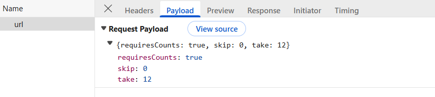
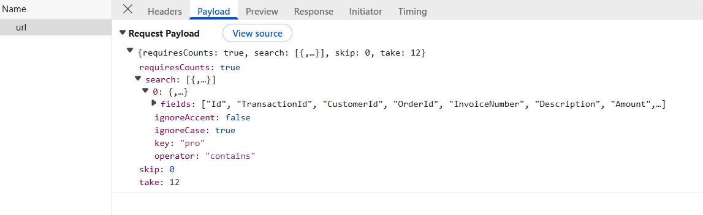
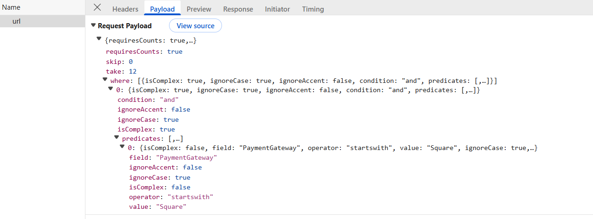
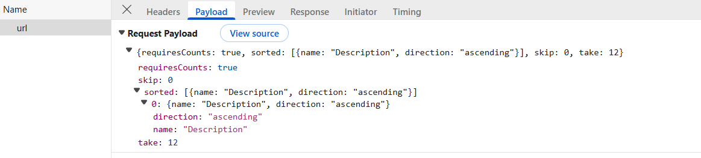
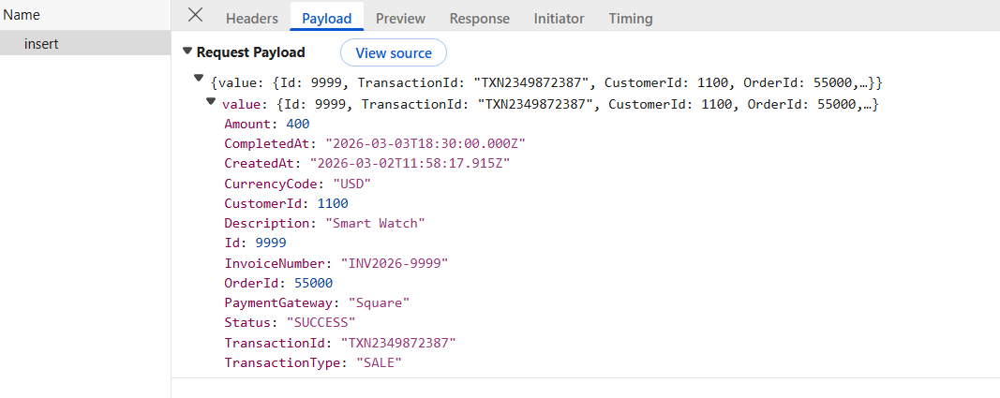
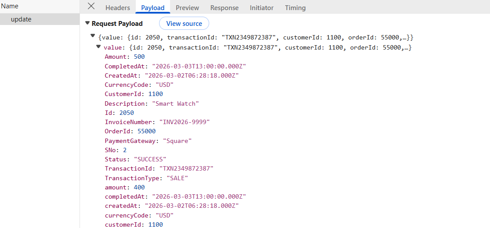
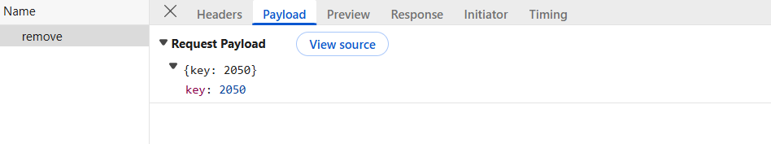
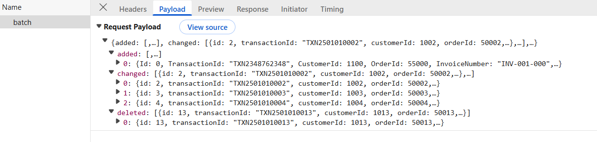

# Connecting MySQL server to Syncfusion React Grid Using LINQ2DB

The [Syncfusion React Grid](https://ej2.syncfusion.com/react/documentation/grid/getting-started) supports binding data from a MySQL database. This documentation demonstrates integrating MySQL with Syncfusion React Grid using LINQ2DB (Light-weight ORM) for data operations with the use of `CustomAdaptor` to build a Transaction Management Application.

**What is LINQ2DB?**

[LINQ2DB](https://linq2db.github.io/) is a lightweight Object-Relational Mapping (ORM) library for .NET that simplifies database operations. It provides a bridge between C# code and databases like MySQL, enabling type-safe queries without the overhead of heavier frameworks.

**Key benefits of LINQ2DB for MySQL and Syncfusion React Grid integration:**

- **Lightweight Performance**: Minimal overhead compared to Entity Framework, ideal for web applications requiring fast database access.
- **LINQ Support**: Use familiar LINQ syntax for database queries instead of raw SQL strings.
- **Type Safety**: Strong typing reduces runtime errors and provides IntelliSense support.
- **Built-in Security**: Automatic parameterization prevents SQL injection attacks.
- **MySQL-Specific**: Full support for MySQL 5.7+ and MySQL 8.0+ with proper collation and character encoding handling.
- **Minimal Configuration**: Simple setup with straightforward connection string management.
- **Compatibility with Syncfusion DataManager**: Works seamlessly with Syncfusion Grid's built-in data operations (filtering, sorting, paging, searching).

## Prerequisites

Ensure the following software and packages are installed before proceeding:

| Software/Package | Version | Purpose |
| ----------------- | --------- | --------- |
| Visual Studio 2022 | 17.0 or later | Development IDE with ASP.NET Core workload |
| .NET SDK | net8.0 or compatible | Runtime and build tools |
| MySQL Server | 8.0.41 or later | Database server |
| linq2db | 6.1.0 or later | Light-weight ORM for database operations |
| linq2db.MySql | 6.1.0 or later | MySQL provider for LINQ2DB |
| MySqlConnector | 2.5.0 or later | Modern MySQL connector for .NET (recommended over MySql.Data) |
| Node.js | v20.x or later | JavaScript runtime for server-side and build tooling |
| npm/yarn | Latest stable | For package management. |

## Key topics

| # | Topic | Link |
|---|--------|-------|
| 1 | Create a MySQL database with transaction records | [View](#step-1-create-the-database-and-table-in-mysql) |
| 2 | Install necessary NuGet packages for ASP.NET Core and Syncfusion | [View](#step-3-install-required-nuget-packages) |
| 3 | Create data models and DataConnection for database communication | [View](#step-4-create-the-data-model) |
| 4 | Configure connection strings and register services | [View](#step-5-configure-the-dataconnection) |
| 5 | Create a Grid component that supports searching, filtering, sorting, paging, and CRUD operations | [View](#integrating-syncfusion-react-grid) |
| 6 | Handle bulk operations and batch updates | [View](#step-10-perform-crud-operations) |

## Setting up the MySQL environment

### Step 1: Create the Database and Table in MySQL

First, the **MySQL database** structure must be created to store transaction records.

**Instructions:**

1. Open MySQL Workbench, MySQL Command Line Client, or any MySQL client.
2. Create a new database.
3. Define a "transactions" table with the specified schema.
4. Insert sample data for testing.

Run the following SQL script:

```sql
-- Create database + select it
CREATE DATABASE IF NOT EXISTS transactiondb
  CHARACTER SET utf8mb4
  COLLATE utf8mb4_general_ci;
USE transactiondb;

-- Create table
CREATE TABLE IF NOT EXISTS transactions (
  Id               INT NOT NULL AUTO_INCREMENT PRIMARY KEY,
  TransactionId    VARCHAR(50) NOT NULL UNIQUE,
  CustomerId       INT NOT NULL,
  OrderId          INT NULL,
  InvoiceNumber    VARCHAR(50) NULL,
  Description      VARCHAR(500) NULL,
  Amount           DECIMAL(15,2) NOT NULL,
  CurrencyCode     VARCHAR(10) NULL,
  TransactionType  VARCHAR(50) NULL,
  PaymentGateway   VARCHAR(100) NULL,
  CreatedAt        DATETIME NOT NULL DEFAULT CURRENT_TIMESTAMP,
  CompletedAt      DATETIME NULL,
  Status           VARCHAR(50) NULL
) ENGINE=InnoDB DEFAULT CHARSET=utf8mb4 COLLATE=utf8mb4_general_ci;

-- Seed data
INSERT INTO transactions
  (TransactionId, CustomerId, OrderId, InvoiceNumber, Description, Amount, CurrencyCode,
   TransactionType, PaymentGateway, CreatedAt, CompletedAt, Status)
VALUES
('TXN260113001', 1001, 50001, 'INV-2026-001', 'Samsung S25 Ultra', 153399.00, 'INR',
 'SALE', 'Razorpay', '2026-01-13 10:15:30', '2026-01-13 10:16:55', 'SUCCESS'),
('TXN260113002', 1002, 50002, 'INV-2026-002', 'MacBook Pro M4', 224199.00, 'INR',
 'SALE', 'Stripe', '2026-01-13 11:20:10', '2026-01-13 11:21:40', 'SUCCESS');
```

After executing this script, the transaction records are stored in the "transactions" table within the database. The database is now ready for integration with the ASP.NET Core application.

### Step 2: Create a new ASP.NET Core project

Before installing NuGet packages, a new ASP.NET Core Web Application must be created.

**Instructions:**

1. Open **Visual Studio 2022**.
2. Click **Create a new project**.
3. Search for **ASP.NET Core Web API**.
4. Select the template and click **Next**.
5. Configure the project:
   - **Project name**: **Grid_MySQL.Server** (or a preferred name)
   - **Location**: Choose the desired folder
   - **Framework**: Select .NET 8.0 (or latest available)
6. Click **Create**.

Visual Studio will create the project with the default structure, including folders like **Controllers**, **Models** and **configuration** files. The ASP.NET Core project is now ready for integration with LINQ2DB and Syncfusion components.

### Step 3: Install required NuGet packages

NuGet packages are software libraries that add functionality to the application. These packages enable LINQ2DB, MySQL connectivity, and Syncfusion Grid integration.

**Method 1: Using Package Manager Console:**

1. Open Visual Studio 2022.
2. Navigate to **Tools → NuGet Package Manager → Package Manager Console**.
3. Run the following commands in sequence:

```bash
Install-Package linq2db -Version 6.1.0
Install-Package linq2db.MySql -Version 6.1.0
Install-Package MySqlConnector -Version 2.5.0
dotnet add package Microsoft.AspNetCore.Mvc.NewtonsoftJson --version 9.0.0
dotnet add package Syncfusion.EJ2.Base --version 32.2.3
```

**Method 2: Using NuGet Package Manager UI:**

1. Open **Visual Studio 2022 → Tools → NuGet Package Manager → Manage NuGet Packages for Solution**.
2. Search for and install each package individually:
   - **linq2db** (version 6.1.0)
   - **linq2db.MySql** (version 6.1.0)
   - **MySqlConnector** (version 2.5.0)
   - **Microsoft.AspNetCore.Mvc.NewtonsoftJson** (version 9.0.0)
   - **Syncfusion.EJ2.Base** (version 32.2.3)

All required packages are now installed.

### Step 4: Create the data model

A data model is a C# class that represents the structure of a database table. This model defines the properties that correspond to the columns in the "transactions" table.

**Instructions:**

1. In the **Solution Explorer**, right-click on the **Models** folder.
2. Select **Add → New Item**.
3. Choose **Class** and name it **Transaction.cs**.
4. Define the **Transaction** class with the following code:

```csharp
using LinqToDB.Mapping;

namespace Grid_MySQL.Server.Models
{
    [Table("transactions")]
    public class Transaction
    {
        [PrimaryKey, Identity]
        public int? Id { get; set; }

        [Column, NotNull]   
        public string TransactionId { get; set; }

        [Column, NotNull]
        public int CustomerId { get; set; }

        [Column]
        public int? OrderId { get; set; }

        [Column]
        public string InvoiceNumber { get; set; }

        [Column]
        public string Description { get; set; }

        [Column, NotNull]
        public decimal Amount { get; set; }

        [Column]
        public string CurrencyCode { get; set; }

        [Column]
        public string TransactionType { get; set; }

        [Column]
        public string PaymentGateway { get; set; }

        [Column, NotNull]
        public DateTime CreatedAt { get; set; }

        [Column]
        public DateTime? CompletedAt { get; set; }

        [Column]
        public string Status { get; set; }
    }
}
```

**Explanation:**

- **[Table("transactions")]**: Maps the class to the "transactions" table in the MySQL database.
- **[PrimaryKey, Identity]**: Marks "Id" as the primary key (a unique identifier for each record).
- **[Column]**: Maps each property to a database column.
- **[NotNull]**: Indicates that the column does not allow NULL values.
- **? Symbol**: Indicates nullable properties (can be empty).

The data model has been successfully created.

### Step 5: Configure the data connection

In LINQ2DB, `DataConnection` is the primary class that represents a connection to a database. It manages all direct communication with the MySQL database.

**Instructions:**

1. Create a new folder named **Data** in the application project.
2. Inside the **Data** folder, create a new file named **AppDataConnection.cs**.
3. Define the **AppDataConnection** class with the following code:

```csharp
using Grid_MySQL.Server.Models;
using LinqToDB;
using LinqToDB.Data;
using LinqToDB.DataProvider.MySql;

namespace Grid_MySQL.Server.Data
{
    public sealed class AppDataConnection : DataConnection
    {
        public AppDataConnection(IConfiguration config)
            : base(
                new DataOptions().UseMySql(
                    config.GetConnectionString("MySqlConn"),
                    MySqlVersion.MySql80,
                    MySqlProvider.MySqlConnector
                )
            )
        {
            InlineParameters = true;
        }

        public ITable<Transaction> Transactions => this.GetTable<Transaction>();
    }
}
```

**Explanation:**

- **AppDataConnection Class**: Inherits from **LinqToDB.Data.DataConnection**, which manages the MySQL connection lifecycle.
- **UseMySql(...)**: Configures LINQ2DB for MySQL with version 8.0 and MySqlConnector provider.
- **MySqlVersion.MySql80**: Specifies MySQL 8.0+ compatibility. Use **MySql57** for MySQL 5.7.
- **MySqlProvider.MySqlConnector**: Uses the modern MySqlConnector library instead of the legacy MySql.Data.
- **InlineParameters**: When set to `true`, enables inline parameter logging, making SQL debugging easier.
- **Transactions Property**: Returns an `ITable<Transactions>` interface that allows LINQ queries against the transactions table.
- **Connection String**: Retrieved from the **MySqlConn** entry in **appsettings.json** configured in Step 6.

The AppDataConnection class is now ready for use in controllers.

### Step 6: Configure the connection string

A connection string contains the information needed to connect the application to the MySQL database, including the server address, port, database name, and credentials.

**Instructions:**

1. Open the **appsettings.json** file in the project root.
2. Add or update the **ConnectionStrings** section with the MySQL connection details:

```json
{
  "ConnectionStrings": {
    "MySqlConn": "Server=localhost;Port=3306;Database=transactiondb;User Id=admin;Password=12345678;"
  },
  "Logging": {
    "LogLevel": {
      "Default": "Information",
      "Microsoft.AspNetCore": "Warning"
    }
  },
  "AllowedHosts": "*"
}
```

**Connection String Components:**

| Component | Description |
| ----------- | ------------- |
| **Server** | The address of the MySQL server (use "localhost" for local development) |
| **Port** | The MySQL port number (default is 3306) |
| **Database** | The database name |
| **User Id** | The MySQL username (default is "root") |
| **Password** | The MySQL password |

The connection string has been successfully configured.

### Step 7: Register services

The **Program.cs** file is the entry point for configuring and bootstrapping the ASP.NET Core application. This is where all required services and middleware are registered, including CORS (Cross-Origin Resource Sharing), LINQ2DB, and the **AppDataConnection**.

**Instructions:**

1. Open the **Program.cs** file in the project root.
2. Replace the existing content with the following configuration:

```csharp
using Grid_MySQL.Server.Data;
using LinqToDB;
using LinqToDB.AspNet;
using LinqToDB.DataProvider.MySql;

var builder = WebApplication.CreateBuilder(args);

builder.Services.AddControllers().AddNewtonsoftJson();

// CORS (dev)
builder.Services.AddCors(options =>
{
    options.AddPolicy("cors", p => p.AllowAnyOrigin().AllowAnyHeader().AllowAnyMethod());
});

// 1) Register LinqToDB engine (connection factory) with MySQL provider
builder.Services.AddLinqToDB(
    (sp, options) =>
        options.UseMySql(
            builder.Configuration.GetConnectionString("MySqlConn"),
            MySqlVersion.MySql80,
            MySqlProvider.MySqlConnector
        )
);

// 2) Register your typed DataConnection so controllers can inject it
builder.Services.AddScoped<AppDataConnection>();

var app = builder.Build();

app.UseCors("cors");
app.MapControllers();

app.Run();
```

**Explanation:**

- `AddControllers().AddNewtonsoftJson()`: Registers MVC controllers for handling HTTP requests and enables JSON serialization using Newtonsoft.Json.
- `AddCors("cors")`: Configures CORS policy with `AllowAnyOrigin()`, `AllowAnyHeader()`, and `AllowAnyMethod()` to permit requests from any domain (suitable for development).
- `AddLinqToDB()`: Registers the LINQ2DB engine configured with MySQL provider, connection string from **appsettings.json**, and MySqlConnector.
- `AddScoped<AppDataConnection>()`: Registers `AppDataConnection` as a scoped service for dependency injection, creating a new instance per HTTP request.
- `app.UseCors("cors")`: Applies the registered CORS policy to the middleware pipeline.
- `app.MapControllers()`: Maps controller action methods to HTTP endpoints.
- `app.Run()`: Starts the Kestrel web server and listens for incoming requests.

The services are now successfully registered and the application is ready to handle requests.

## Integrating Syncfusion React Grid

The Syncfusion React Grid is a robust, high‑performance component built to efficiently display, manage, and manipulate large datasets. It provides advanced features such as sorting, filtering, and paging. Follow these steps to render the grid and integrate it with MySQL database.

### Step 1: Creating the React client application

Open a Visual Studio Code terminal or Command prompt and run the below command to create a React application:

```bash
npm create vite@latest grid_mysql.client
cd grid_mysql.client
```

### Step 2: Adding Syncfusion packages

Install the necessary Syncfusion packages using the below command in Visual Studio Code terminal or Command prompt.

```bash
npm install @syncfusion/ej2-react-grids --save
npm install @syncfusion/ej2-data --save
```

After installation, the necessary CSS files are available in the (**../node_modules/@syncfusion**) directory. Add the required CSS references to the (**src/index.css**) file to ensure proper styling of the Grid component.

```css
@import '../node_modules/@syncfusion/ej2-base/styles/bootstrap5.3.css';  
@import '../node_modules/@syncfusion/ej2-buttons/styles/bootstrap5.3.css';  
@import '../node_modules/@syncfusion/ej2-calendars/styles/bootstrap5.3.css';  
@import '../node_modules/@syncfusion/ej2-dropdowns/styles/bootstrap5.3.css';  
@import '../node_modules/@syncfusion/ej2-inputs/styles/bootstrap5.3.css';  
@import '../node_modules/@syncfusion/ej2-navigations/styles/bootstrap5.3.css';
@import '../node_modules/@syncfusion/ej2-popups/styles/bootstrap5.3.css';
@import '../node_modules/@syncfusion/ej2-splitbuttons/styles/bootstrap5.3.css';
@import '../node_modules/@syncfusion/ej2-notifications/styles/bootstrap5.3.css';
@import '../node_modules/@syncfusion/ej2-react-grids/styles/bootstrap5.3.css';

```

For this project, the "Bootstrap 5" theme is applied. Other themes can be selected, or the existing theme can be customized to meet specific project requirements. For detailed guidance on theming and customization, refer to the [Syncfusion React Components Appearance](https://ej2.syncfusion.com/react/documentation/appearance/theme-studio) documentation.

### Step 3: Add Syncfusion React Grid

The React Grid component can be added to the application by following these steps. To get started, add the Grid component to the (**src/App.tsx**) file using the following code.

```ts
import React from 'react';
import {GridComponent, ColumnsDirective, ColumnDirective, Inject} from '@syncfusion/ej2-react-grids';
import { DataManager } from '@syncfusion/ej2-data';
import { CustomAdaptor } from './CustomAdaptor';

const App: React.FC = () => {
  const dataManager = new DataManager({
    url: `http://localhost:5283/api/grid/url`,
    adaptor: new CustomAdaptor()
  });

  return (
    <div>
      <GridComponent
        id="transactionsGrid"
        dataSource={dataManager}
      >
        <ColumnsDirective>
          <ColumnDirective field="Id" headerText="ID" width="80" isPrimaryKey={true} textAlign="Right" />
          {/* Include additional columns here */}
        </ColumnsDirective>
      </GridComponent>
    </div>
  );
};

export default App;
```

### Step 4: Implement the CustomAdaptor

The Syncfusion React Grid can bind data from a **MySQL Server** database using [DataManager](https://ej2.syncfusion.com/react/documentation/data/getting-started) and set the `adaptor` property to `CustomAdaptor` for scenarios that require full control over data operations.

The `CustomAdaptor` (client-side) is a bridge between the React Grid and the ASP.NET Core backend. It extends the `UrlAdaptor` and handles all data operation requests by constructing HTTP POST calls to corresponding server endpoints. When the Grid performs operations like reading, searching, filtering, sorting, paging, and CRUD operations, the CustomAdaptor intercepts these actions and formats them into HTTP requests. These requests are sent to the ASP.NET Core Web API controller on the server, which processes the `DataManagerRequest` using LINQ2DB to query the MySQL database and return the results.

**Instructions:**

1. Create a new **CustomAdaptor.ts** file in the **src** folder.
2. Add the following code inside this file:

```ts
import { type BatchChanges } from "@syncfusion/ej2-react-grids";
import { DataManager, UrlAdaptor, type ReturnOption, type DataResult } from "@syncfusion/ej2-data";

export class CustomAdaptor extends UrlAdaptor {
  public override processResponse(data: DataResult): ReturnOption {
    const original = data as any;
    if (original && original.result) {
      let i = 0;
      original.result.forEach((item: any) => (item.SNo = ++i));
    }
    return original;
  }

  public override beforeSend(
    dm: DataManager,
    request: Request,
    settings?: any,
  ): void {
    super.beforeSend(dm, request, settings);
  }

  public override insert(dm: DataManager, data: DataResult) {
    return {
      url: `${dm.dataSource["insertUrl"]}`,
      type: "POST",
      contentType: "application/json; charset=utf-8",
      data: JSON.stringify({ value: data }),
    };
  }

  public override update(dm: DataManager, _keyField: string, value: any) {
    return {
      url: `${dm.dataSource["updateUrl"]}`,
      type: "POST",
      contentType: "application/json; charset=utf-8",
      data: JSON.stringify({ value }),
    };
  }

  public override remove(dm: DataManager, keyField: string, value: any) {
    const keyValue =
      value && typeof value === "object" ? value[keyField] : value;
    return {
      url: `${dm.dataSource["removeUrl"]}`,
      type: "POST",
      contentType: "application/json; charset=utf-8",
      data: JSON.stringify({ key: keyValue }),
    };
  }

  public override batchRequest(dm: DataManager, changes: BatchChanges) {
    return {
      url: `${dm.dataSource["batchUrl"]}`,
      type: "POST",
      contentType: "application/json; charset=utf-8",
      data: JSON.stringify({
        added: changes.addedRecords,
        changed: changes.changedRecords,
        deleted: changes.deletedRecords,
      }),
    };
  }
}
```

The `CustomAdaptor` class has been successfully implemented with all data operations.

### Step 5: Add Toolbar with CRUD and search options

The toolbar provides buttons for adding, editing, deleting records, and searching the data.

**Instructions:**

1. Open the (**src/App.tsx**) file.
2. Inject the `Toolbar` modules in the Grid component.
3. Update the Grid component to include the [toolbar](https://ej2.syncfusion.com/react/documentation/api/grid/index-default#toolbar) property with CRUD and search options:

```ts
import React from 'react';
import { GridComponent, ColumnsDirective, ColumnDirective, Inject, Toolbar } from '@syncfusion/ej2-react-grids';
import { DataManager } from '@syncfusion/ej2-data';
import { CustomAdaptor } from './CustomAdaptor';

const App: React.FC = () => {
  const dateDefault = new Date();
    const dataManager = new DataManager({
    url: 'http://localhost:5283/api/grid/url',
    adaptor: new CustomAdaptor(),
  });
  const toolbarOptions = ['Add', 'Edit', 'Delete', 'Update', 'Cancel', 'Search'];
  return (
    <div>
      <GridComponent
        id="transactionsGrid"
         dataSource={dataManager}
        toolbar={toolbarOptions}
      >
        <ColumnsDirective>
          <ColumnDirective field="Id" headerText="ID" width="80" isPrimaryKey={true} textAlign="Right" />
          {/* Include additional columns here */}
        </ColumnsDirective>
        <Inject services={[Toolbar]} />
      </GridComponent>
    </div>
  );
};

export default App;
```

**Toolbar items explanation:**

| Item | Function |
| ------ | ---------- |
| `Add` | Opens a form to add a new transaction record. |
| `Edit` | Enables editing of the selected record. |
| `Delete` | Deletes the selected record from the database. |
| `Update` | Saves changes made to the selected record. |
| `Cancel` | Cancels the current edit or add operation. |
| `Search` | Displays a search box to find records. |

The toolbar has been successfully added.

### Step 6: Implement paging feature

The paging feature allows efficient loading of large data sets through on‑demand loading.

**Instructions:**

1. Paging in the Grid is enabled by setting the [allowPaging](https://ej2.syncfusion.com/react/documentation/api/grid/index-default#allowpaging) property to `true`.
2. And injecting the `Page` module in the Grid component.

```ts
import React from 'react';
import { GridComponent, ColumnsDirective, ColumnDirective, Inject, Page } from '@syncfusion/ej2-react-grids';
import { DataManager } from '@syncfusion/ej2-data';
import { CustomAdaptor } from './CustomAdaptor';

const App: React.FC = () => {
  const dataManager = new DataManager({
    url: 'http://localhost:5283/api/grid/url',
    adaptor: new CustomAdaptor(),
  });

  return (
    <div>
      <GridComponent
        id="transactionsGrid"
        dataSource={dataManager}
        allowPaging={true}
      >
        <ColumnsDirective>
          <ColumnDirective field="Id" headerText="ID" width="80" isPrimaryKey={true} allowEditing={false} textAlign="Right" />
          {/* Include additional columns here */}
        </ColumnsDirective>
        <Inject services={[Page]} />
      </GridComponent>
    </div>
  );
};

export default App;
```

On the server side create a file **GridController.cs** and add the "UrlDatasource" method provided below:

```csharp
    public class GridController(AppDataConnection db) : ControllerBase
    {
        private readonly AppDataConnection _db = db;

        // POST: /api/grid/url
        // Accepts Syncfusion DataManagerRequest and returns data with optional counts.
        [HttpPost("url")]
        public async Task<IActionResult> UrlDatasource([FromBody] DataManagerRequest dm)
        {
            try
            {
                // Get IQueryable<Transaction> using LinqToDB raw SQL (to match your original pattern)
                IQueryable<Transaction> query = _db.FromSql<Transaction>(
                    "SELECT * FROM transactiondb.transactions"
                );

                var operation = new QueryableOperation();

                // Total count before paging
                int count = await query.CountAsync();

                // Paging
                if (dm.Skip != 0)
                    query = operation.PerformSkip(query, dm.Skip);
                if (dm.Take != 0)
                    query = operation.PerformTake(query, dm.Take);

                var rows = await query.ToListAsync();

                if (dm.RequiresCounts)
                    return Ok(new { result = rows, count });

                return Ok(rows);
            }
            catch (Exception ex)
            {
                return Problem(title: "UrlDatasource error", detail: ex.ToString());
            }
        }
    }
```

**Paging details:**

- The Grid sends page size `Take` and skip count `Skip` parameters to the server.
- The `operation.PerformSkip()` method skips the specified number of records.
- The `operation.PerformTake()` method retrieves only the required number of records for the current page.
- The total count is calculated before paging to display the total number of records.
- Results are returned and displayed in the Grid with pagination controls.

When paging is performed in the Grid, a request is sent to the server with the following payload.



### Step 7: Implement searching feature

Searching allows finding records by entering keywords in the search box.

**Instructions:**

1. Ensure the toolbar includes the `Search` item.
2. Inject the `Search` modules in the Grid component.

```ts
import React from 'react';
import { GridComponent, ColumnsDirective, ColumnDirective, Inject, Toolbar, Search } from '@syncfusion/ej2-react-grids';
import { DataManager } from '@syncfusion/ej2-data';
import { CustomAdaptor } from './CustomAdaptor';

const App: React.FC = () => {
  const dataManager = new DataManager({
    url: 'http://localhost:5283/api/grid/url',
    adaptor: new CustomAdaptor(),
  });

  const toolbarOptions = ['Add', 'Edit', 'Delete', 'Update', 'Cancel', 'Search'];

  return (
    <div>
      <GridComponent
        id="transactionsGrid"
        dataSource={dataManager}
        toolbar={toolbarOptions}
      >
        <ColumnsDirective>
          <ColumnDirective field="Id" headerText="ID" width="80" isPrimaryKey={true} allowEditing={false} textAlign="Right" />
          {/* Include additional columns here */}
        </ColumnsDirective>
        <Inject services={[Toolbar, Search]} />
      </GridComponent>
    </div>
  );
};

export default App;
```

Update the "UrlDatasource" method in the **GridController.cs** file to handle searching:

```csharp
    public class GridController(AppDataConnection db) : ControllerBase
    {
        private readonly AppDataConnection _db = db;

        // POST: /api/grid/url
        // Accepts Syncfusion DataManagerRequest and returns data with optional counts.
        [HttpPost("url")]
        public async Task<IActionResult> UrlDatasource([FromBody] DataManagerRequest dm)
        {
            try
            {
                // Get IQueryable<Transaction> using LinqToDB raw SQL (to match your original pattern)
                IQueryable<Transaction> query = _db.FromSql<Transaction>(
                    "SELECT * FROM transactiondb.transactions"
                );

                var operation = new QueryableOperation();

                // Searching
                if (dm.Search != null && dm.Search.Count > 0)
                    query = operation.PerformSearching(query, dm.Search);

                // Other action code goes here

                // Total count before paging
                int count = await query.CountAsync();

                var rows = await query.ToListAsync();

                if (dm.RequiresCounts)
                    return Ok(new { result = rows, count });

                return Ok(rows);
            }
            catch (Exception ex)
            {
                return Problem(title: "UrlDatasource error", detail: ex.ToString());
            }
        }

    }
```

**Searching details:**

- When text is entered in the search box and <kbd>Enter</kbd> is pressed, the Grid sends a search request to the server.
- The "UrlDatasource" method receives the search criteria in `Search` parameter.
- The `operation.PerformSearching()` method filters the data based on the search term.
- Results are returned and displayed in the Grid.

When searching is performed in the Grid, a request is sent to the server with the following payload.



### Step 8: Implement filtering feature

Filtering allows restricting data based on column values using a menu interface.

**Instructions:**

1. Filtering is enabled by setting the [allowFiltering](https://ej2.syncfusion.com/react/documentation/api/grid/index-default#allowfiltering) property to `true`.
2. Inject the `Filter` module in the Grid component.

```ts
import React from 'react';
import { GridComponent, ColumnsDirective, ColumnDirective, Inject, Filter } from '@syncfusion/ej2-react-grids';
import { DataManager } from '@syncfusion/ej2-data';
import { CustomAdaptor } from './CustomAdaptor';

const App: React.FC = () => {
  const dataManager = new DataManager({
    url: 'http://localhost:5283/api/grid/url',
    adaptor: new CustomAdaptor(),
  });

  return (
    <div>
      <GridComponent
        id="transactionsGrid"
        dataSource={dataManager}
        allowFiltering={true}
      >
        <ColumnsDirective>
          <ColumnDirective field="Id" headerText="ID" width="80" isPrimaryKey={true} allowEditing={false} textAlign="Right" />
          {/* Include additional columns here */}
        </ColumnsDirective>
        <Inject services={[Filter]} />
      </GridComponent>
    </div>
  );
};

export default App;
```

Update the "UrlDatasource" method in the **GridController.cs** file to handle filtering:

```csharp
    public class GridController(AppDataConnection db) : ControllerBase
    {
        private readonly AppDataConnection _db = db;

        // POST: /api/grid/url
        // Accepts Syncfusion DataManagerRequest and returns data with optional counts.
        [HttpPost("url")]
        public async Task<IActionResult> UrlDatasource([FromBody] DataManagerRequest dm)
        {
            try
            {
                // Get IQueryable<Transaction> using LinqToDB raw SQL (to match your original pattern)
                IQueryable<Transaction> query = _db.FromSql<Transaction>(
                    "SELECT * FROM transactiondb.transactions"
                );

                var operation = new QueryableOperation();

                // Filtering
                if (dm.Where != null && dm.Where.Count > 0)
                    query = operation.PerformFiltering(query, dm.Where, dm.Where[0].Operator);

                // Other action code goes here

                int count = await query.CountAsync();

                var rows = await query.ToListAsync();

                if (dm.RequiresCounts)
                    return Ok(new { result = rows, count });

                return Ok(rows);
            }
            catch (Exception ex)
            {
                return Problem(title: "UrlDatasource error", detail: ex.ToString());
            }
        }

    }
```

**Filtering details:**

- Open the filter menu from any of the column header.
- Select filtering criteria (equals, contains, greater than, less than, etc.).
- Click the "Filter" button to apply the filter.
- The "UrlDatasource" method receives the filter criteria in `Where` property.
- Results are filtered accordingly and displayed in the Grid.

When filtering is performed in the Grid, a request is sent to the server with the following payload.



### Step 9: Implement sorting feature

Sorting enables arranging records in ascending or descending order based on column values.

**Instructions:**

1. Sorting can be enabled by setting the [allowSorting](https://ej2.syncfusion.com/react/documentation/api/grid/index-default#allowsorting) property to `true`.
2. Inject the `Sort` module in the Grid component.

```ts
import React from 'react';
import { GridComponent, ColumnsDirective, ColumnDirective, Inject, Sort } from '@syncfusion/ej2-react-grids';
import { DataManager } from '@syncfusion/ej2-data';
import { CustomAdaptor } from './CustomAdaptor';

const App: React.FC = () => {
  const dataManager = new DataManager({
    url: 'http://localhost:5283/api/grid/url',
    adaptor: new CustomAdaptor(),
  });

  return (
    <div>
      <GridComponent
        id="transactionsGrid"
        dataSource={dataManager}
        allowSorting={true}
      >
        <ColumnsDirective>
          <ColumnDirective field="Id" headerText="ID" width="80" isPrimaryKey={true} allowEditing={false} textAlign="Right" />
          {/* Include additional columns here */}
        </ColumnsDirective>
        <Inject services={[Sort]} />
      </GridComponent>
    </div>
  );
};

export default App;
```

Update the "UrlDatasource" method in the **GridController.cs** file to handle sorting:

```csharp
    public class GridController(AppDataConnection db) : ControllerBase
    {
        private readonly AppDataConnection _db = db;

        // POST: /api/grid/url
        // Accepts Syncfusion DataManagerRequest and returns data with optional counts.
        [HttpPost("url")]
        public async Task<IActionResult> UrlDatasource([FromBody] DataManagerRequest dm)
        {
            try
            {
                // Get IQueryable<Transaction> using LinqToDB raw SQL (to match your original pattern)
                IQueryable<Transaction> query = _db.FromSql<Transaction>(
                    "SELECT * FROM transactiondb.transactions"
                );

                var operation = new QueryableOperation();

                // Sorting
                if (dm.Sorted != null && dm.Sorted.Count > 0)
                    query = operation.PerformSorting(query, dm.Sorted);

                // Other action code goes here

                // Total count before paging
                int count = await query.CountAsync();

                var rows = await query.ToListAsync();

                if (dm.RequiresCounts)
                    return Ok(new { result = rows, count });

                return Ok(rows);
            }
            catch (Exception ex)
            {
                return Problem(title: "UrlDatasource error", detail: ex.ToString());
            }
        }

    }
```

**Sorting details:**

- Click on the column header to sort in ascending order.
- Click again to sort in descending order.
- The "UrlDatasource" method receives the sort criteria in `Sorted`.
- Records are sorted accordingly and displayed in the Grid.

When sorting is performed in the Grid, a request is sent to the server with the following payload.



### Step 10: Perform CRUD operations

CRUD operations allow adding new records, modifying existing records, and removing items that are no longer relevant. The `DataManager` posts a specific action for each operation so that the server can route to the appropriate handler.

Editing operations in the Grid are enabled through configuring the [Edit Settings](https://ej2.syncfusion.com/react/documentation/api/grid/index-default#editsettings) properties ([allowEditing](https://ej2.syncfusion.com/react/documentation/api/grid/gridModel#allowediting), [allowAdding](https://ej2.syncfusion.com/react/documentation/api/grid/editSettingsModel#allowadding), and [allowDeleting](https://ej2.syncfusion.com/react/documentation/api/grid/editSettingsModel#allowdeleting)) to `true`. Inject the `Edit` and `Toolbar` modules in the Grid component.

```ts
import React from 'react';
import { GridComponent, ColumnsDirective, ColumnDirective, Inject, Edit, Toolbar } from '@syncfusion/ej2-react-grids';
import { DataManager } from '@syncfusion/ej2-data';
import { CustomAdaptor } from './CustomAdaptor';

const App: React.FC = () => {
  const dateDefault = new Date();
  
  const dataManager = new DataManager({
    url: 'http://localhost:5283/api/grid/url',
    insertUrl: 'http://localhost:5283/api/grid/insert',
    updateUrl: 'http://localhost:5283/api/grid/update',
    removeUrl: 'http://localhost:5283/api/grid/remove',
    batchUrl: 'http://localhost:5283/api/grid/batch',
    adaptor: new CustomAdaptor(),
  });

  const editSettings = {
    allowAdding: true,
    allowEditing: true,
    allowDeleting: true,
  };

  const toolbarOptions = ['Add', 'Edit', 'Delete', 'Update', 'Cancel', 'Search'];

  return (
    <div>
      <GridComponent
        id="transactionsGrid"
        dataSource={dataManager}
        allowSorting={true}
        allowFiltering={true}
        allowPaging={true}
        editSettings={editSettings}
        toolbar={toolbarOptions}
      >
        <ColumnsDirective>
          <ColumnDirective field="Id" headerText="ID" width="80" isPrimaryKey={true} allowEditing={false} textAlign="Right" />
          {/* Include additional columns here */}
        </ColumnsDirective>
        <Inject services={[Edit, Toolbar]} />
      </GridComponent>
    </div>
  );
};

export default App;
```

**Insert:**

Record insertion allows new transactions to be added directly through the Grid component. The adaptor processes the insertion request, performs any required business‑logic validation, and saves the newly created record to the MySQL database.

Implement the "insert" method in (**src/CustomAdaptor.ts**) to handle record insertion within the `CustomAdaptor` class:

```ts
  public override insert(dm: DataManager, data: DataResult) {
    return {
      url: `${dm.dataSource['insertUrl']}`,
      type: 'POST',
      contentType: 'application/json; charset=utf-8',
      data: JSON.stringify({ value: data }),
    };
  }
```

In **GridController.cs**, implement the "Insert" method:

```csharp
        // POST: /api/grid/insert
        // Inserts a new Transaction and returns the created entity (with generated Id).
        [HttpPost("insert")]
        public async Task<IActionResult> Insert([FromBody] CRUDModel<Transaction> model)
        {
            if (model?.Value == null)
                return BadRequest();

            var value = model.Value;

            var id = await _db.InsertWithInt32IdentityAsync(value);
            value.Id = id;

            return Ok(value);
        }
```

**What happens behind the scenes:**

1. The form data is collected and validated in the CustomAdaptor's "insert" method.
2. The "Insert" method in **GridController.cs** file is called.
3. The new record is added to the "Transactions" collection.
4. The Grid automatically refreshes to display the new record.

When a new record added in the Grid, a request is sent to the server with the following payload.



**Update:**

Record modification allows transaction details to be updated directly within the Grid. The adaptor processes the edited row, validates the updated values, and applies the changes to the **MySQL database** while ensuring data integrity is preserved.

Implement the "update" method in (**src/CustomAdaptor.ts**) to handle record update within the `CustomAdaptor` class:

```ts
  public override update(dm: DataManager, _keyField: string, value: any) {
    return {
      url: `${dm.dataSource['updateUrl']}`,
      type: 'POST',
      contentType: 'application/json; charset=utf-8',
      data: JSON.stringify({ value }),
    };
  }
```

In **GridController.cs**, implement the update method:

```csharp
        // POST: /api/grid/update
        // Updates an existing Transaction by Id. The posted body must include the primary key.
        [HttpPost("update")]
        public async Task<IActionResult> Update([FromBody] CRUDModel<Transaction> model)
        {
            if (model?.Value == null)
                return BadRequest();

            var value = model.Value;

            // optional existence check (safe and simple)
            if (!_db.Transactions.Any(t => t.Id == value.Id))
                return NotFound();

            await _db.UpdateAsync(value);
            return Ok(value);
        }
```

**What happens behind the scenes:**

1. The modified data is collected and validated in the CustomAdaptor's "update" method.
2. The "Update" method in **GridController.cs** file is called.
3. The existing record is retrieved from the database by ID.
4. All properties are updated with the new values.
5. The Grid refreshes to display the updated record.

When a record updated is in the Grid, a request is sent to the server with the following payload.



**Delete:**

Record deletion allows transactions to be removed directly from the Grid. The adaptor captures the delete request, executes the corresponding **MySQL DELETE** operation, and updates both the database and the grid to reflect the removal.

Implement the "remove" method in (**src/CustomAdaptor.ts**) to handle record deletion within the `CustomAdaptor` class:

```ts
  public override remove(dm: DataManager, keyField: string, value: any) {
    const keyValue =
      value && typeof value === 'object' ? value[keyField] : value;
    return {
      url: `${dm.dataSource['removeUrl']}`,
      type: 'POST',
      contentType: 'application/json; charset=utf-8',
      data: JSON.stringify({ key: keyValue }),
    };
  }
```

In **GridController.cs**, implement the delete method:

```csharp
        // POST: /api/grid/remove
        // Removes a Transaction by key (Syncfusion UrlAdaptor default posts { key: ... }).
        [HttpPost("remove")]
        public async Task<IActionResult> Remove([FromBody] CRUDModel<Transaction> model)
        {
            var key = Convert.ToInt32(model.Key);
            var rows = await _db.Transactions.DeleteAsync(t => t.Id == key);
            if (rows == 0)
                return NotFound("Record not found");

            return Ok(new { key });
        }
```

**What happens behind the scenes:**

1. A record is selected and the `Delete` button is clicked.
2. The CustomAdaptor's "remove" method is called.
3. The "Remove" method in **GridController.cs** file is called.
4. The record is located in the database by its ID.
5. The record is removed from the "_db.Transactions" collection.
6. The Grid refreshes to remove the deleted record from the UI.

When a record is deleted in the Grid, a request is sent to the server with the following payload.



**Batch update:**

Batch operations combine multiple insert, update, and delete actions into a single request, minimizing network overhead and ensuring transactional consistency by applying all changes atomically to the MySQL database.

Implement the `batchRequest` method in (**src/CustomAdaptor.ts**) to handle multiple record updates in a single request within the `CustomAdaptor` class:

```ts
  public override batchRequest(dm: DataManager, changes: BatchChanges) {
    return {
      url: `${dm.dataSource['batchUrl']}`,
      type: 'POST',
      contentType: 'application/json; charset=utf-8',
      data: JSON.stringify({
        added: changes.addedRecords,
        changed: changes.changedRecords,
        deleted: changes.deletedRecords,
      }),
    };
  }
```

> This method is triggered when the Grid is operating in [Batch](https://ej2.syncfusion.com/react/documentation/grid/editing/batch-editing) edit mode.

**What happens behind the scenes:**

- The Grid collects all added, edited, and deleted records in Batch Edit mode.
- The combined batch request is passed to the CustomAdaptor’s `batchRequest` method.
- Each modified record, added and deleted records are processed using `BatchUpdate` method in **GridController.cs** file.
- All repository operations persist changes to the MySQL database.
- The Grid refreshes to display the updated, added, and removed records in a single response.

When a batch update is performed in the Grid, a request is sent to the server with the following payload.



Now the adaptor supports bulk modifications with atomic database synchronization. All CRUD operations are now fully implemented, enabling comprehensive data management capabilities within the Grid.

### Step 11: Complete code

Here is the complete and final (**src/App.tsx**) component with all features integrated:

```ts
import React from 'react';
import {
  GridComponent,
  ColumnsDirective,
  ColumnDirective,
  Inject,
  Edit,
  Toolbar,
  Page,
  Sort,
  Filter,
  Search,
} from '@syncfusion/ej2-react-grids';
import { DataManager } from '@syncfusion/ej2-data';
import { CustomAdaptor } from './CustomAdaptor';

const App: React.FC = () => {
  const dateDefault = new Date();
  
  const transactionIdRules = { required: true, maxLength: 50 };
  const customerIdRules = { required: true, number: true };
  const orderIdRules = { number: true };
  const invoiceNumberRules = { maxLength: 50 };
  const descriptionRules = { maxLength: 500 };
  const amountRules = { required: true, number: true };
  const currencyCodeRules = { maxLength: 10 };
  const transactionTypeRules = { maxLength: 50 };
  const paymentGatewayRules = { maxLength: 100 };
  const statusRules = { maxLength: 50 };

  const dataManager = new DataManager({
    url: 'http://localhost:5283/api/grid/url',
    insertUrl: 'http://localhost:5283/api/grid/insert',
    updateUrl: 'http://localhost:5283/api/grid/update',
    removeUrl: 'http://localhost:5283/api/grid/remove',
    batchUrl: 'http://localhost:5283/api/grid/batch',
    adaptor: new CustomAdaptor(),
  });

  const editSettings = { allowAdding: true, allowEditing: true, allowDeleting: true };
  const toolbar = ['Add', 'Edit', 'Delete', 'Update', 'Cancel', 'Search'];

  return (
    <div>
      <GridComponent id="transactionsGrid" dataSource={dataManager} allowSorting={true} allowFiltering={true} allowPaging={true} editSettings={editSettings} toolbar={toolbar}>
        <ColumnsDirective>
          <ColumnDirective field="Id" headerText="ID" width="80" isPrimaryKey={true} allowEditing={false} textAlign="Right" />
          <ColumnDirective field="TransactionId" headerText="Transaction ID" width="160" validationRules={transactionIdRules} />
          <ColumnDirective field="CustomerId" headerText="Customer ID" width="130" textAlign="Right" editType="numericedit" validationRules={customerIdRules} />
          <ColumnDirective field="OrderId" headerText="Order ID" width="120" textAlign="Right" editType="numericedit" validationRules={orderIdRules} />
          <ColumnDirective field="InvoiceNumber" headerText="Invoice #" width="150" validationRules={invoiceNumberRules} />
          <ColumnDirective field="Description" headerText="Description" width="220" validationRules={descriptionRules} />
          <ColumnDirective field="Amount" headerText="Amount" width="130" textAlign="Right" editType="numericedit" format="N2" validationRules={amountRules} />
          <ColumnDirective field="CurrencyCode" headerText="Currency" width="110" validationRules={currencyCodeRules} />
          <ColumnDirective field="TransactionType" headerText="Type" width="120" validationRules={transactionTypeRules} />
          <ColumnDirective field="PaymentGateway" headerText="Gateway" width="140" validationRules={paymentGatewayRules} />
          <ColumnDirective field="CreatedAt" headerText="Created At" type="datetime" format="dd/MM/yyyy HH:mm:ss a" width="190" editType="datetimepickeredit" defaultValue={dateDefault} />
          <ColumnDirective field="CompletedAt" headerText="Completed At" type="datetime" format="dd/MM/yyyy HH:mm:ss a" width="190" editType="datetimepickeredit" />
          <ColumnDirective field="Status" headerText="Status" width="130" validationRules={statusRules} defaultValue="SUCCESS" />
        </ColumnsDirective>
        <Inject services={[Edit, Toolbar, Page, Sort, Filter, Search]} />
      </GridComponent>
    </div>
  );
};

export default App;
```

> - Set [isPrimaryKey](https://ej2.syncfusion.com/react/documentation/api/grid/column#isprimarykey) to `true` for a column that contains unique values.
> - The [editType](https://ej2.syncfusion.com/react/documentation/api/grid/column#edittype) property can be used to specify the desired editor for each column.(https://ej2.syncfusion.com/react/documentation/grid/editing/edit-types)
> - [type](https://ej2.syncfusion.com/react/documentation/api/grid/columnmodel#type) property of the Grid columns specifies the data type of a grid column.

Here is the complete Controller **GridController.cs** file:

```csharp
using Grid_MySQL.Server.Data;
using Grid_MySQL.Server.Models;
using LinqToDB;
using LinqToDB.Async;
using Microsoft.AspNetCore.Mvc;
using Syncfusion.EJ2.Base;

namespace Grid_MySQL.Server.Controllers
{
    [ApiController]
    [Route("api/[controller]")]
    public class GridController(AppDataConnection db) : ControllerBase
    {
        private readonly AppDataConnection _db = db;

        // POST: /api/grid/url
        // Accepts Syncfusion DataManagerRequest and returns data with optional counts.
        [HttpPost("url")]
        public async Task<IActionResult> UrlDatasource([FromBody] DataManagerRequest dm)
        {
            try
            {
                // Get IQueryable<Transaction> using LinqToDB raw SQL (to match your original pattern)
                IQueryable<Transaction> query = _db.FromSql<Transaction>(
                    "SELECT * FROM transactiondb.transactions"
                );

                var operation = new QueryableOperation();

                // Searching
                if (dm.Search != null && dm.Search.Count > 0)
                    query = operation.PerformSearching(query, dm.Search);

                // Filtering
                if (dm.Where != null && dm.Where.Count > 0)
                    query = operation.PerformFiltering(query, dm.Where, dm.Where[0].Operator);

                // Sorting
                if (dm.Sorted != null && dm.Sorted.Count > 0)
                    query = operation.PerformSorting(query, dm.Sorted);

                // Total count before paging
                int count = await query.CountAsync();

                // Paging
                if (dm.Skip != 0)
                    query = operation.PerformSkip(query, dm.Skip);
                if (dm.Take != 0)
                    query = operation.PerformTake(query, dm.Take);

                var rows = await query.ToListAsync();

                if (dm.RequiresCounts)
                    return Ok(new { result = rows, count });

                return Ok(rows);
            }
            catch (Exception ex)
            {
                return Problem(title: "UrlDatasource error", detail: ex.ToString());
            }
        }

        // POST: /api/grid/insert
        // Inserts a new Transaction and returns the created entity (with generated Id).
        [HttpPost("insert")]
        public async Task<IActionResult> Insert([FromBody] CRUDModel<Transaction> model)
        {
            if (model?.Value == null)
                return BadRequest();

            var value = model.Value;

            var id = await _db.InsertWithInt32IdentityAsync(value);
            value.Id = id;

            return Ok(value);
        }

        // POST: /api/grid/update
        // Updates an existing Transaction by Id. The posted body must include the primary key.
        [HttpPost("update")]
        public async Task<IActionResult> Update([FromBody] CRUDModel<Transaction> model)
        {
            if (model?.Value == null)
                return BadRequest();

            var value = model.Value;

            // optional existence check (safe and simple)
            if (!_db.Transactions.Any(t => t.Id == value.Id))
                return NotFound();

            await _db.UpdateAsync(value);
            return Ok(value);
        }

        // POST: /api/grid/remove
        // Removes a Transaction by key (Syncfusion UrlAdaptor default posts { key: ... }).
        [HttpPost("remove")]
        public async Task<IActionResult> Remove([FromBody] CRUDModel<Transaction> model)
        {
            var key = Convert.ToInt32(model.Key);
            var rows = await _db.Transactions.DeleteAsync(t => t.Id == key);
            if (rows == 0)
                return NotFound("Record not found");

            return Ok(new { key });
        }

        // POST: /api/grid/batch
        // Handles batch add, update, and delete in a single transaction.
        [HttpPost("batch")]
        public async Task<IActionResult> BatchUpdate([FromBody] CRUDModel<Transaction> payload)
        {
            using var tr = await _db.BeginTransactionAsync();

            // INSERT many
            if (payload.Added != null && payload.Added.Count > 0)
            {
                foreach (var r in payload.Added)
                {
                    if (r.CreatedAt == default)
                        r.CreatedAt = DateTime.UtcNow;

                    var newId = await _db.InsertWithInt32IdentityAsync(r);
                    r.Id = newId; // return generated key to client
                }
            }

            // UPDATE many
            if (payload.Changed != null && payload.Changed.Count > 0)
            {
                foreach (var r in payload.Changed)
                {
                    await _db
                        .Transactions.Where(t => t.Id == r.Id)
                        .Set(t => t.TransactionId, r.TransactionId)
                        .Set(t => t.CustomerId, r.CustomerId)
                        .Set(t => t.OrderId, r.OrderId)
                        .Set(t => t.InvoiceNumber, r.InvoiceNumber)
                        .Set(t => t.Description, r.Description)
                        .Set(t => t.Amount, r.Amount)
                        .Set(t => t.CurrencyCode, r.CurrencyCode)
                        .Set(t => t.TransactionType, r.TransactionType)
                        .Set(t => t.PaymentGateway, r.PaymentGateway)
                        .Set(t => t.CreatedAt, r.CreatedAt) // keep if you intentionally allow updating CreatedAt
                        .Set(t => t.CompletedAt, r.CompletedAt)
                        .Set(t => t.Status, r.Status)
                        .UpdateAsync();
                }
            }

            // DELETE many
            if (payload.Deleted != null && payload.Deleted.Count > 0)
            {
                var keys = payload.Deleted.Select(d => d.Id).ToArray();
                await _db.Transactions.Where(t => keys.Contains(t.Id)).DeleteAsync();
            }

            await tr.CommitAsync();
            return Ok(payload);
        }
    }
}
```

## Running the application

### Running the ASP.NET Core backend server

**Step 1: Build the backend:**

1. Open the terminal or Package Manager Console.
2. Navigate to the **Grid_MySQL.Server** project directory.
3. Run the following command:

```powershell
dotnet build
```

**Step 2: Run the backend server:**

Execute the following command:

```powershell
dotnet run
```

**Step 3: Verify backend is running:**

- The backend server should start and listen on **https://localhost:5283** (or the port shown in the terminal).
- You can test the API endpoint: **https://localhost:5283/api/grid/url**.

### Running the React frontend client

**Step 1: Install frontend dependencies:**

1. Open a new terminal.
2. Navigate to the **grid_mysql.client** (or your React client folder) directory.
3. Run the following command:

```bash
npm install
```

**Step 2: Start the React Development server:**

Execute the following command:

```bash
npm run dev
```

**Step 3: Access the application:**

1. Open a web browser.
2. Navigate to **http://localhost:5173** (Vite default) or the port shown in the terminal.
3. The application will automatically connect to the backend API at **http://localhost:5283/api/grid**.
4. The transaction management application is now running and ready to use.

**Available features:**

- **View Data**: All transactions from the MySQL database are displayed in the Grid.
- **Search**: Use the search box to find transactions by any field.
- **Filter**: Click on column headers to apply filters.
- **Sort**: Click on column headers to sort data in ascending or descending order.
- **Pagination**: Navigate through records using page numbers.
- **Add**: Click the `Add` button to create a new transaction.
- **Edit**: Click the `Edit` button to modify existing transactions.
- **Delete**: Click the `Delete` button to remove transactions.

## Complete sample repository

A complete, working sample implementation is available in the [GitHub repository](https://github.com/SyncfusionExamples/ej2-react-grid-samples/tree/master/connecting-to-database/syncfusion-react-grid-MySQL).


The application now provides a complete solution for managing transaction data with a modern, user-friendly interface.