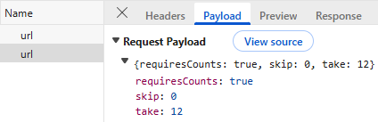
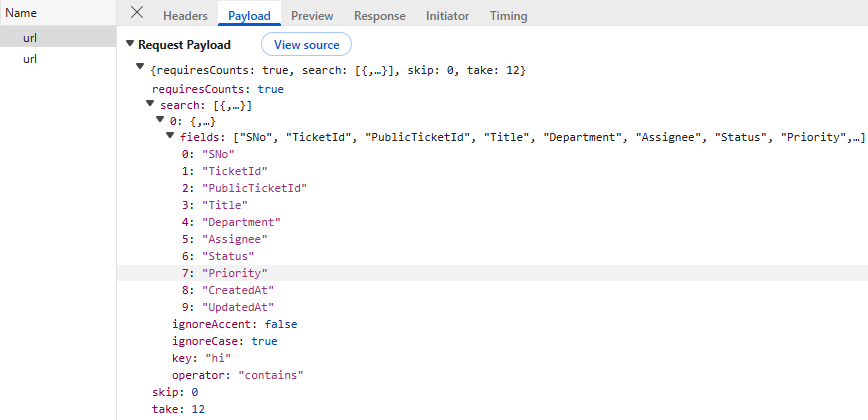
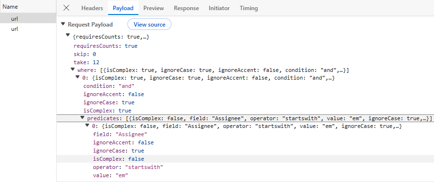
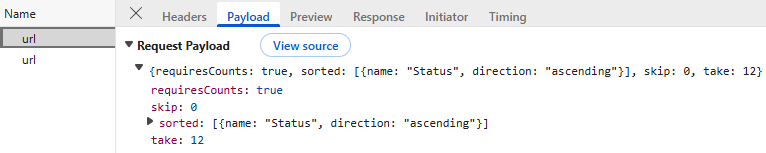
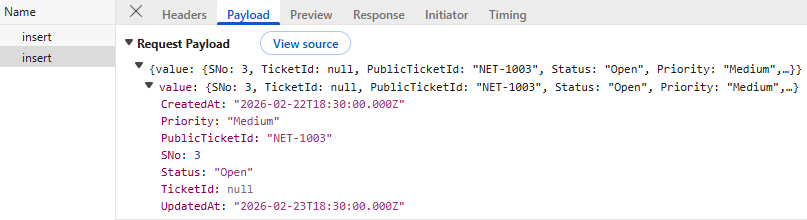
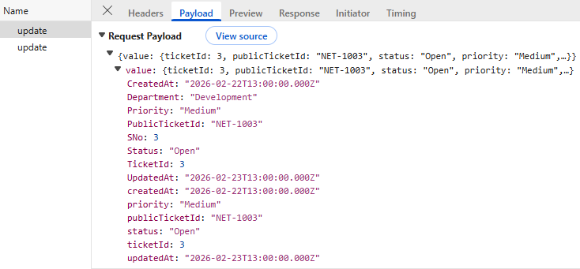
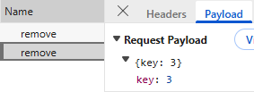
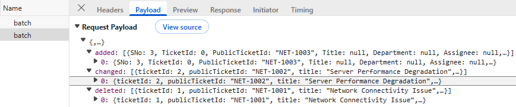

# Connecting SQL Server to Syncfusion React Grid Using Entity Framework

The Syncfusion<sup style="font-size:70%">&reg;</sup> React Grid supports binding data from a SQL Server database. This documentation demonstrates integrating SQL Server with Syncfusion<sup style="font-size:70%">&reg;</sup> React Grid using **Entity Framework Core (EF Core)** for data operations with both `UrlAdaptor` and `CustomAdaptor` approaches.

**What is Entity Framework Core?**

Entity Framework Core (EF Core) is a lightweight, extensible, open-source, and cross-platform object-relational mapper (ORM) for .NET. It serves as a bridge between C# code and SQL Server, eliminating the need for raw SQL queries and providing a modern, code-first approach to database management.

**Key Benefits of Entity Framework Core**

- **Change Tracking**: Automatically detects and tracks changes to entities for persistence, simplifying CRUD operations.
- **LINQ Support**: Use familiar LINQ syntax for type-safe database queries.
- **Built-in Security**: Automatic parameterization prevents SQL injection attacks.
- **Database Migrations**: Manage schema changes version-by-version without manual SQL scripts.
- **Lazy Loading & Eager Loading**: Control entity relationship loading for optimized performance.
- **Fluent Configuration**: Fine-grained entity mapping configuration in code.
- **Compatibility with Syncfusion DataManager**: Works seamlessly with Syncfusion EJ2 Grid's `DataOperations` for filtering, sorting, paging, and searching.

**Entity Framework Core vs LINQ2DB**

| Aspect | Entity Framework Core | LINQ2DB |
|--------|---|---|
| **Learning Curve** | Moderate (more complex abstractions) | Lower (closer to LINQ) |
| **Performance** | Excellent (significantly improved in EF Core 6+) | Very fast (minimal overhead) |
| **Features** | Comprehensive (migrations, lazy loading, change tracking, tracking vs no-tracking queries) | Basic (simple CRUD, data operations) |
| **Configuration** | Moderate (DbContext, OnModelCreating, migrations, dependency injection) | Simple (connection string only) |
| **Async/Await Support** | Native async throughout (async by default) | Full async support |
| **Database Migrations** | Built-in with EF Core Migrations | Manual SQL scripts required |
| **Cross-Platform** | Yes (runs on Windows, Linux, macOS) | Yes (cross-platform) |
| **Use Case** | Complex business logic, enterprise apps, long-term projects, microservices | Simple CRUD, web grids, lightweight scenarios |
| **Syncfusion Integration** | Excellent (modern, optimized for .NET Core/5+) | Excellent (lightweight alternative) |

**Recommendation:**

- **Use Entity Framework Core**: If the application requires complex business logic, multiple related entities, database migrations, dependency injection, and long-term maintainability.
- **Use LINQ2DB**: If the project requires lightweight, fast performance for simple CRUD operations with minimal configuration overhead.

## Prerequisites

Ensure the following software and packages are installed before proceeding:

| Software/Package | Version | Purpose |
|-----------------|---------|---------|
| Visual Studio 2022 | 17.0 or later | Development IDE with ASP.NET Core workload |
| .NET SDK | 8.0 or later | Runtime and SDK for ASP.NET Core applications |
| Node.js | 18.0 or later | JavaScript runtime for React development |
| npm | 9.0 or later | Package manager for JavaScript (included with Node.js) |
| SQL Server | 2019 or later | Database server (Express edition acceptable) |
| Microsoft.EntityFrameworkCore | 9.0.0 or later | Modern Object-Relational Mapper for .NET Core |
| Microsoft.EntityFrameworkCore.SqlServer | 9.0.0 or later | SQL Server provider for Entity Framework Core |
| Microsoft.AspNetCore.Mvc.NewtonsoftJson | 9.0.0 or later | JSON serialization library for proper null handling with Syncfusion Grid |
| Syncfusion.EJ2.Base | 32.2.3 or later | Syncfusion DataManager and Grid operations |

## Key topics

| # | Topics | Link |
|---|---------|-------|
| 1 | Create a SQL database with ticket records | [View](#step-1-create-the-database-and-table-in-sql-server) |
| 2 | Install necessary NuGet packages for ASP.NET Core and Syncfusion | [View](#step-3-install-required-nuget-packages) |
| 3 | Create data models and DbContext for database communication | [View](#step-4-create-the-data-model) |
| 4 | Configure connection strings and register services | [View](#step-6-configure-connection-string-in-appsettingsjson) |
| 5 | Create a Grid component that supports searching, filtering, sorting, paging, and CRUD operations | [View](#integrating-syncfusion-react-grid) |
| 6 | Handle bulk operations and batch updates | [View](#step-10-perform-crud-operations) |


## Setting Up the SQL Server Environment for Entity Framework Core

Ensure the SQL Server is running. Use SSMS or another client to run the script below to create the "TicketsDb" database and the "Tickets" table.

### Step 1: Create the Database and Table in SQL Server

First, the **SQL Server database** structure must be created to store ticket records.

**Instructions:**
1. Open SQL Server Management Studio (SSMS) or any SQL Server client.
2. Create a new database named "TicketsDb".
3. Define a "Tickets" table with the specified schema.
4. Insert sample data for testing.

Run the following SQL script:

```sql
-- Create Database
IF NOT EXISTS (SELECT * FROM sys.databases WHERE name = 'TicketsDb')
BEGIN
    CREATE DATABASE TicketsDb;
END
GO

USE TicketsDb;
GO

-- Create Tickets Table
IF NOT EXISTS (SELECT * FROM sys.tables WHERE name = 'Tickets')
BEGIN
    CREATE TABLE dbo.Tickets (
        TicketId INT PRIMARY KEY IDENTITY(1,1),
        PublicTicketId VARCHAR(50) NOT NULL UNIQUE,
        Title VARCHAR(200) NULL,
        Description TEXT NULL,
        Category VARCHAR(100) NULL,
        Department VARCHAR(100) NULL,
        Assignee VARCHAR(100) NULL,
        CreatedBy VARCHAR(100) NULL,
        Status VARCHAR(50) NOT NULL DEFAULT 'Open',
        Priority VARCHAR(50) NOT NULL DEFAULT 'Medium',
        ResponseDue DATETIME2 NULL,
        DueDate DATETIME2 NULL,
        CreatedAt DATETIME2 NOT NULL DEFAULT GETDATE(),
        UpdatedAt DATETIME2 NOT NULL DEFAULT GETDATE()
    );
END
GO

-- Insert Sample Data (Optional)
INSERT INTO dbo.Tickets (PublicTicketId, Title, Description, Category, Department, Assignee, CreatedBy, Status, Priority, ResponseDue, DueDate, CreatedAt, UpdatedAt)
VALUES
('NET-1001', 'Network Connectivity Issue', 'Users unable to connect to the VPN', 'Network Issue', 'Network Ops', 'John Doe', 'Alice Smith', 'Open', 'High', '2026-01-14 10:00:00', '2026-01-15 17:00:00', '2026-01-13 10:15:30', '2026-01-13 10:15:30'),
('NET-1002', 'Server Performance Degradation', 'Email server responding slowly', 'Performance', 'Infrastructure', 'Emily White', 'Bob Johnson', 'InProgress', 'Critical', '2026-01-13 15:00:00', '2026-01-14 17:00:00', '2026-01-13 11:20:10', '2026-01-13 11:20:10');
GO
```

After executing this script, the ticket records are stored in the "Tickets" table within the "TicketsDb" database. The database is now ready for integration with the ASP.NET Core Web application.


### Step 2: Create a New ASP.NET Core project

Before installing NuGet packages, a new ASP.NET Core Web Application must be created.

**Instructions:**

1. Open **Visual Studio 2022**.
2. Click **Create a new project**.
3. Search for **ASP.NET Core Web API**.
4. Select the template and click **Next**.
5. Configure the project:
  - **Project name**: **Grid_EntityFramework.Server** (or a preferred name)
  - **Location**: Choose the desired folder
   - **Framework**: Select .NET 8.0 (or latest available)
6. Click **Create**.

Visual Studio will create the project with the default structure, including folders like **Controllers**, **Models** and **configuration** files.

### Step 3: Install required NuGet packages

NuGet packages are software libraries that add functionality to the application. These packages enable Entity Framework Core, SQL Server connectivity, and Syncfusion Grid integration.

**Method 1: Using .NET CLI (Recommended)**

1. Open a terminal in Visual Studio 2022 (View → Terminal).
2. Navigate to your project directory.
3. Run the following commands in sequence:

```bash
dotnet add package Microsoft.EntityFrameworkCore --version 9.0.0
dotnet add package Microsoft.EntityFrameworkCore.SqlServer --version 9.0.0
dotnet add package Microsoft.EntityFrameworkCore.Tools --version 9.0.0
dotnet add package Microsoft.AspNetCore.Mvc.NewtonsoftJson --version 9.0.0
dotnet add package Syncfusion.EJ2.Base --version 32.2.3
```

**Method 2: Using Package Manager Console**

1. Open Visual Studio 2022.
2. Navigate to **Tools → NuGet Package Manager → Package Manager Console**.
3. Run the following commands:

```powershell
Install-Package Microsoft.EntityFrameworkCore -Version 9.0.0
Install-Package Microsoft.EntityFrameworkCore.SqlServer -Version 9.0.0
Install-Package Microsoft.EntityFrameworkCore.Tools -Version 9.0.0
Install-Package Microsoft.AspNetCore.Mvc.NewtonsoftJson -Version 9.0.0
Install-Package Syncfusion.EJ2.Base -Version 32.2.3
```

**Method 3: Using NuGet Package Manager UI**

1. Open **Visual Studio 2022 → Tools → NuGet Package Manager → Manage NuGet Packages for Solution**.
2. Search for and install each package individually:
   - **Microsoft.EntityFrameworkCore** (version 9.0.0)
   - **Microsoft.EntityFrameworkCore.SqlServer** (version 9.0.0)
   - **Microsoft.EntityFrameworkCore.Tools** (version 9.0.0)
   - **Microsoft.AspNetCore.Mvc.NewtonsoftJson** (version 9.0.0)
   - **Syncfusion.EJ2.Base** (version 32.2.3)

All required packages are now installed. Verify the installation by checking the project's **.csproj** file or using `dotnet list package` command.


### Step 4: Create the data model

A data model is a C# class that represents the structure of a database table. This model defines the properties that correspond to the columns in the "Tickets" table.

**Instructions:**

1. In the **Solution Explorer**, right-click on the **Models** folder.
2. Select **Add → New Item**.
3. Choose **Class** and name it **Ticket.cs**.
4. Replace the default code with the following:

```csharp
// File: Models/Ticket.cs
using System;
using System.ComponentModel.DataAnnotations;
using System.ComponentModel.DataAnnotations.Schema;

namespace Grid_EntityFramework.Server.Models
{
    [Table("Tickets", Schema = "dbo")]
    public class Ticket
    {
        [Key]
        [DatabaseGenerated(DatabaseGeneratedOption.Identity)]
        public int TicketId { get; set; }

        [Required, MaxLength(50)]
        public string PublicTicketId { get; set; }

        [MaxLength(200)]
        public string Title { get; set; }

        // EF Core: prefer NVARCHAR(MAX) instead of deprecated TEXT.
        // We'll keep column type from your EF6 note if you must match legacy schema:
        [Column(TypeName = "text")] // Consider changing to nvarchar(max) for modern SQL Server
        public string Description { get; set; }

        [MaxLength(100)]
        public string Category { get; set; }

        [MaxLength(100)]
        public string Department { get; set; }

        [MaxLength(100)]
        public string Assignee { get; set; }

        [MaxLength(100)]
        public string CreatedBy { get; set; }

        [Required, MaxLength(50)]
        public string Status { get; set; } = "Open";

        [Required, MaxLength(50)]
        public string Priority { get; set; } = "Medium";

        [Column(TypeName = "datetime2")]
        public DateTime? ResponseDue { get; set; }

        [Column(TypeName = "datetime2")]
        public DateTime? DueDate { get; set; }

        [Required, Column(TypeName = "datetime2")]
        public DateTime CreatedAt { get; set; } = DateTime.UtcNow;

        [Required, Column(TypeName = "datetime2")]
        public DateTime UpdatedAt { get; set; } = DateTime.UtcNow;
    }
}
```
**Explanation:**

- **`[Table("Tickets", Schema = "dbo")]`**: Maps the class to the `dbo.Tickets` table in the database.
- **`[Key]`**: Marks `TicketId` as the primary key.
- **`[DatabaseGenerated(DatabaseGeneratedOption.Identity)]`**: Indicates auto-increment behavior via IDENTITY(1,1).
- **`[Required]`**: Indicates that a column does not allow NULL values.
- **`[MaxLength(n)]`**: Specifies the maximum length of a VARCHAR column.
- **`[Column(TypeName = "text")]`**: Explicitly specifies the SQL Server column type as TEXT.
-  In EF Core, unique indexes are typically created using Fluent API in `OnModelCreating` rather than attributes.

The data model has been successfully created.

### Step 5: Create the DbContext class

The `DbContext` is a special class that manages the connection between the application and the SQL Server database. It handles all database operations such as saving, updating, deleting, and retrieving data.

**Instructions:**

1. In the **Solution Explorer**, right-click on the **Models** folder.
2. Select **Add → New Item**.
3. Choose **Class** and name it **TicketsDbContext.cs**.
4. Replace the default code with the following:

```csharp
// File: Data/TicketsDbContext.cs
using Grid_EntityFramework.Server.Models;
using Microsoft.EntityFrameworkCore;

namespace Grid_EntityFramework.Server.Data
{
    public class TicketsDbContext(DbContextOptions<TicketsDbContext> options) : DbContext(options)
    {
        public DbSet<Ticket> Tickets => Set<Ticket>();

        protected override void OnModelCreating(ModelBuilder modelBuilder)
        {
            var entity = modelBuilder.Entity<Ticket>();

            // Table and Schema
            entity.ToTable("Tickets", "dbo");

            // PK
            entity.HasKey(e => e.TicketId);

            // Identity (handled by [DatabaseGenerated] attribute, but we can be explicit)
            entity.Property(e => e.TicketId).ValueGeneratedOnAdd();

            // Column configs (equivalent to your EF6 constraints)
            entity.Property(e => e.PublicTicketId).HasMaxLength(50).IsRequired();
            entity.HasIndex(e => e.PublicTicketId).IsUnique(); // matches your EF6 unique index

            entity.Property(e => e.Title).HasMaxLength(200);
            entity.Property(e => e.Description).HasColumnType("text"); // or nvarchar(max)
            entity.Property(e => e.Category).HasMaxLength(100);
            entity.Property(e => e.Department).HasMaxLength(100);
            entity.Property(e => e.Assignee).HasMaxLength(100);
            entity.Property(e => e.CreatedBy).HasMaxLength(100);
            entity.Property(e => e.Status).HasMaxLength(50).IsRequired();
            entity.Property(e => e.Priority).HasMaxLength(50).IsRequired();

            entity.Property(e => e.ResponseDue).HasColumnType("datetime2");
            entity.Property(e => e.DueDate).HasColumnType("datetime2");
            entity.Property(e => e.CreatedAt).HasColumnType("datetime2").IsRequired();
            entity.Property(e => e.UpdatedAt).HasColumnType("datetime2").IsRequired();

            base.OnModelCreating(modelBuilder);
        }
    }
}

```

**Explanation:**

- **`DbContext` Class**: Inherits from Entity Framework Core's `DbContext` base class, managing the database connection and entity tracking.
- **Primary Constructor**: EF Core uses primary constructors (C# 12+) with `DbContextOptions<TicketsDbContext>` for dependency injection configuration.
- **`DbSet<Ticket>` Property**: Provides access to Ticket records for querying and persistence operations.
- **`OnModelCreating`**: Configures entity mappings using Fluent API, such as primary keys, maximum lengths, required fields, unique indexes, and data types.
- **Fluent API Configuration**: EF Core prefers Fluent API in `OnModelCreating` over data annotations for complex configurations like unique indexes.

The **TicketsDbContext** class is essential because:

- It **connects** the application to the SQL Server database through dependency injection.
- It **manages** the entity lifecycle (Add, Update, Delete, SaveChanges, SaveChangesAsync).
- It **maps** C# models to actual database tables and columns.
- It **configures** the expected shape of data inside the database using Fluent API.
- It **enables** SQL Server-specific features like identity columns, datetime2 types, and unique constraints.
- It **supports** both tracking and no-tracking queries for optimal performance.

Without this class, Entity Framework Core cannot manage database operations. The DbContext has been successfully configured.

### Step 6: Configure connection string in appsettings.json

A connection string contains the information needed to connect the application to the SQL database, including the server address, database name, authentication method, and additional parameters.

**Instructions:**

1. Open the **appsettings.json** file in the project root.
2. Add or update the **ConnectionStrings** section with the SQL connection details:

```json
{
  "ConnectionStrings": {
    "TicketsDb": "Server=localhost;Database=TicketsDb;Trusted_Connection=True;TrustServerCertificate=True;"
  },
  "Logging": {
    "LogLevel": {
      "Default": "Information",
      "Microsoft.AspNetCore": "Warning"
    }
  },
  "AllowedHosts": "*"
}
```

**Connection String Components:**

| Component | Description |
| ----------- | ------------- |
| **Server** | The address of the SQL Server (use "localhost" for local development) |
| **Port** | The SQL Server port number (default is 1433) |
| **Database** | The database name |
| **User Id** | The SQL Server username |
| **Password** | The SQL Server password |

The connection string has been successfully configured.


### Step 7: Register services in Program.cs file

The **Program.cs** file is the entry point for configuring and bootstrapping the ASP.NET Core application. This is where all required services and middleware are registered, including CORS (Cross-Origin Resource Sharing), Entity Framework Core DbContext, JSON serialization, and controllers.

**Instructions:**

1. Open the **Program.cs** file in the project root.
2. Replace the existing content with the following configuration:

```csharp
// File: Program.cs
using Grid_EntityFramework.Server.Data;
using Microsoft.EntityFrameworkCore;
using Newtonsoft.Json;

var builder = WebApplication.CreateBuilder(args);

builder
    .Services.AddControllers()
    .AddNewtonsoftJson(o =>
    {
        // Key setting: do not try to set null into value types (int)
        o.SerializerSettings.NullValueHandling = NullValueHandling.Ignore;
        // Optional hardening:
        // o.SerializerSettings.MissingMemberHandling = MissingMemberHandling.Ignore;
    });

// EF Core SQL Server
builder.Services.AddDbContext<TicketsDbContext>(options =>
    options.UseSqlServer(builder.Configuration.GetConnectionString("TicketsDb"))
);

// CORS if you call from React dev server
builder.Services.AddCors(opts =>
{
    opts.AddPolicy("dev", p => p.AllowAnyOrigin().AllowAnyHeader().AllowAnyMethod());
});

var app = builder.Build();
app.UseCors("dev");
app.MapControllers();
app.Run();

```

**Explanation:**

- `AddControllers().AddNewtonsoftJson()`: Registers MVC controllers with Newtonsoft.Json serialization support instead of System.Text.Json. This is important for Syncfusion Grid compatibility.
- `NullValueHandling.Ignore`: Critical setting that prevents null values from being serialized to value types (like `int`), avoiding deserialization errors. This prevents issues when the Grid sends partial data updates.
- `AddDbContext<TicketsDbContext>()`: Registers the Entity Framework Core DbContext with dependency injection, making it available for controllers via constructor injection.
- `UseSqlServer()`: Specifies SQL Server as the database provider and retrieves the connection string from **appsettings.json**.
- `AddCors("dev")`: Configures CORS policy with `AllowAnyOrigin()`, `AllowAnyHeader()`, and `AllowAnyMethod()` for development purposes. This allows the React app to make HTTP requests to the API from any port.
- `UseCors("dev")`: Applies the CORS policy to the middleware pipeline. **Must be called before MapControllers()**.
- `MapControllers()`: Maps controller action methods to HTTP endpoints.
- `app.Run()`: Starts the Kestrel web server and listens for incoming HTTP requests.

The Program.cs configuration is now complete and Entity Framework Core is properly registered.

## Integrating Syncfusion React Grid

The Syncfusion React Grid is a robust, high‑performance component built to efficiently display, manage, and manipulate large datasets. It provides advanced features such as sorting, filtering, and paging. Follow these steps to render the grid and integrate it with a SQL Server database.

### Step 1: Creating the React client application

Open a Visual Studio Code terminal or Command prompt and run the below command to create a React application:

```bash
npm create vite@latest grid_entityframework.client
cd grid_entityframework.client
```

### Step 2: Adding Syncfusion packages

Install the necessary Syncfusion packages using the below command in Visual Studio Code terminal or Command prompt.

```bash
npm install @syncfusion/ej2-react-grids --save
npm install @syncfusion/ej2-data --save
```

After installation, the necessary CSS files are available in the (**../node_modules/@syncfusion**) directory. Add the required CSS references to the (**src/index.css**) file to ensure proper styling of the Grid component.

```css
@import '../node_modules/@syncfusion/ej2-base/styles/bootstrap5.3.css';  
@import '../node_modules/@syncfusion/ej2-buttons/styles/bootstrap5.3.css';  
@import '../node_modules/@syncfusion/ej2-calendars/styles/bootstrap5.3.css';  
@import '../node_modules/@syncfusion/ej2-dropdowns/styles/bootstrap5.3.css';  
@import '../node_modules/@syncfusion/ej2-inputs/styles/bootstrap5.3.css';  
@import '../node_modules/@syncfusion/ej2-navigations/styles/bootstrap5.3.css';
@import '../node_modules/@syncfusion/ej2-popups/styles/bootstrap5.3.css';
@import '../node_modules/@syncfusion/ej2-splitbuttons/styles/bootstrap5.3.css';
@import '../node_modules/@syncfusion/ej2-notifications/styles/bootstrap5.3.css';
@import '../node_modules/@syncfusion/ej2-react-grids/styles/bootstrap5.3.css';

```

For this project, the "Bootstrap 5" theme is applied. Other themes can be selected, or the existing theme can be customized to meet specific project requirements. For detailed guidance on theming and customization, refer to the [Syncfusion React Components Appearance](https://ej2.syncfusion.com/react/documentation/appearance/theme-studio) documentation.

### Step 3: Add Syncfusion React Grid

The React Grid component can be added to the application by following these steps. To get started, add the Grid component to the (**src/App.tsx**) file using the following code.

```ts
import React, { useMemo } from 'react';
import {GridComponent, ColumnsDirective, ColumnDirective, Inject} from '@syncfusion/ej2-react-grids';
import { DataManager } from '@syncfusion/ej2-data';
import { CustomAdaptor } from './CustomAdaptor';

const App: React.FC = () => {
  const dataManager = useMemo(() => new DataManager({
    url: 'http://localhost:5018/api/tickets/url',
    insertUrl: 'http://localhost:5018/api/tickets/insert',
    updateUrl: 'http://localhost:5018/api/tickets/update',
    removeUrl: 'http://localhost:5018/api/tickets/remove',
    batchUrl: 'http://localhost:5018/api/tickets/batch',
    adaptor: new CustomAdaptor(),
  }), []);

  return (
    <div>
      <GridComponent
        dataSource={dataManager}
      >
        <ColumnsDirective>
          <ColumnDirective field="SNo" headerText="S.No" width={70} textAlign="Right" />
          {/* Include additional columns here */}
        </ColumnsDirective>
      </GridComponent>
    </div>
  );
};

export default App;
```

### Step 4: Implement the CustomAdaptor

The Syncfusion React Grid can bind data from a **SQL Server** database using [DataManager](https://ej2.syncfusion.com/react/documentation/data/getting-started) and set the `adaptor` property to `CustomAdaptor` for scenarios that require full control over data operations.

The `CustomAdaptor` (client-side) is a bridge between the React Grid and the ASP.NET Core backend. It extends the `UrlAdaptor` and handles all data operation requests by constructing HTTP POST calls to corresponding server endpoints. When the Grid performs operations like reading, searching, filtering, sorting, paging, and CRUD operations, the CustomAdaptor intercepts these actions and formats them into HTTP requests. These requests are sent to the ASP.NET Core Web API controller on the server, which processes the `DataManagerRequest` using Entity Framework Core to query the SQL Server database and return the results.

**Instructions:**

1. Create a new **CustomAdaptor.ts** file in the (**src**) folder.
2. Add the following code inside this file:

```ts
// File: src/CustomAdaptor.ts
import { type BatchChanges } from "@syncfusion/ej2-react-grids";
import {
  DataManager,
  UrlAdaptor,
  type ReturnOption,
  type DataResult,
} from "@syncfusion/ej2-data";

export class CustomAdaptor extends UrlAdaptor {
  public override processResponse(data: DataResult): ReturnOption {
    const original = data as any;
    if (original && original.result) {
      let i = 0;
      original.result.forEach((item: any) => (item.SNo = ++i));
    }
    return original;
  }

  public override beforeSend(
    dm: DataManager,
    request: Request,
    settings?: any,
  ): void {
    super.beforeSend(dm, request, settings);
  }

  public override insert(dm: DataManager, data: DataResult) {
    return {
      url: `${dm.dataSource["insertUrl"]}`,
      type: "POST",
      contentType: "application/json; charset=utf-8",
      data: JSON.stringify({ value: data }),
    };
  }

  public override update(dm: DataManager, _keyField: string, value: any) {
    return {
      url: `${dm.dataSource["updateUrl"]}`,
      type: "POST",
      contentType: "application/json; charset=utf-8",
      data: JSON.stringify({ value }),
    };
  }

  public override remove(dm: DataManager, keyField: string, value: any) {
    const keyValue =
      value && typeof value === "object" ? value[keyField] : value;
    return {
      url: `${dm.dataSource["removeUrl"]}`,
      type: "POST",
      contentType: "application/json; charset=utf-8",
      data: JSON.stringify({ key: keyValue }),
    };
  }

  public override batchRequest(dm: DataManager, changes: BatchChanges) {
    return {
      url: `${dm.dataSource["batchUrl"]}`,
      type: "POST",
      contentType: "application/json; charset=utf-8",
      data: JSON.stringify({
        added: changes.addedRecords,
        changed: changes.changedRecords,
        deleted: changes.deletedRecords,
      }),
    };
  }
}
```

The `CustomAdaptor` class has been successfully implemented with all data operations.

### Step 5: Add Toolbar with CRUD and search options

The toolbar provides buttons for adding, editing, deleting records, and searching the data.

**Instructions:**

1. Open the (**src/App.tsx**) file.
2. Inject the `Toolbar` modules in the Grid component.
3. Update the Grid component to include the [toolbar](https://ej2.syncfusion.com/react/documentation/api/grid/index-default#toolbar) property with CRUD and search options:

```ts
import React, { useMemo } from 'react';
import { GridComponent, ColumnsDirective, ColumnDirective, Inject, Toolbar } from '@syncfusion/ej2-react-grids';
import { DataManager } from '@syncfusion/ej2-data';
import { CustomAdaptor } from './CustomAdaptor';

const App: React.FC = () => {
  const dataManager = useMemo(() => new DataManager({
    url: 'http://localhost:5018/api/tickets/url',
    adaptor: new CustomAdaptor(),
  }), []);

  const toolbar = ['Add', 'Edit', 'Delete', 'Update', 'Cancel', 'Search'];

  return (
    <GridComponent
      dataSource={dataManager}
      toolbar={toolbar}
    >
      <ColumnsDirective>
        <ColumnDirective field="SNo" headerText="S.No" width={70} textAlign="Right" />
        {/* Include additional columns here */}
      </ColumnsDirective>
      <Inject services={[Toolbar]} />
    </GridComponent>
  );
};

export default App;
```

**Toolbar items explanation:**

| Item | Function |
| ------ | ---------- |
| `Add` | Opens a form to add a new ticket record. |
| `Edit` | Enables editing of the selected record. |
| `Delete` | Deletes the selected record from the database. |
| `Update` | Saves changes made to the selected record. |
| `Cancel` | Cancels the current edit or add operation. |
| `Search` | Displays a search box to find records. |

The toolbar has been successfully added.

### Step 6: Implement paging feature

The paging feature allows efficient loading of large data sets through on‑demand loading.

**Instructions:**

1. Paging in the Grid is enabled by setting the [allowPaging](https://ej2.syncfusion.com/react/documentation/api/grid/index-default#allowpaging) property to `true`.
2. And injecting the `Page` module in the Grid component.

```ts
import React, { useMemo } from 'react';
import { GridComponent, ColumnsDirective, ColumnDirective, Inject, Page } from '@syncfusion/ej2-react-grids';
import { DataManager } from '@syncfusion/ej2-data';
import { CustomAdaptor } from './CustomAdaptor';

const App: React.FC = () => {
  const dataManager = useMemo(() => new DataManager({
    url: 'http://localhost:5018/api/tickets/url',
    adaptor: new CustomAdaptor(),
  }), []);

  return (
    <GridComponent
        dataSource={dataManager}
        allowPaging={true}
    >
      <ColumnsDirective>
        <ColumnDirective field="SNo" headerText="S.No" width={70} textAlign="Right" />
        {/* Include additional columns here */}
      </ColumnsDirective>
      <Inject services={[Page]} />
    </GridComponent>
  );
};

export default App;
```

On the server side create a file **TicketsController.cs** and add the "UrlDataSource" method provided below:

```csharp
using Grid_EntityFramework.Server.Data;
using Grid_EntityFramework.Server.Models;
using Microsoft.AspNetCore.Mvc;
using Microsoft.EntityFrameworkCore;
using Syncfusion.EJ2.Base;

namespace Grid_EntityFramework.Server.Controllers
{
    [Route("api/[controller]")]
    public class TicketsController : ControllerBase
    {
        private readonly TicketsDbContext _db;

        public TicketsController(TicketsDbContext db)
        {
            _db = db;
        }

        // READ
        [HttpPost("url")]
        public IActionResult UrlDataSource([FromBody] DataManagerRequest dm)
        {
            IQueryable<Ticket> query = _db.Tickets.AsNoTracking();
            var op = new DataOperations();

            var count = query.Count();

            if (dm.Skip > 0)
                query = query.Skip(dm.Skip);

            if (dm.Take > 0)
                query = query.Take(dm.Take);

            return dm.RequiresCounts
                ? Ok(new { result = query.ToList(), count })
                : Ok(query.ToList());
        }
    }
}

```

**Paging details:**

- The Grid sends page size `Take` and skip count `Skip` parameters to the server.
- The `operation.PerformSkip()` method skips the specified number of records.
- The `operation.PerformTake()` method retrieves only the required number of records for the current page.
- The total count is calculated before paging to display the total number of records.
- Results are returned and displayed in the Grid with pagination controls.

When paging is performed in the Grid, a request is sent to the server with the following payload.



### Step 7: Implement searching feature

Searching allows finding records by entering keywords in the search box.

**Instructions:**

1. Ensure the toolbar includes the `Search` item.
2. Inject the `Toolbar` module in the Grid component.

```ts
import React, { useMemo } from 'react';
import { GridComponent, ColumnsDirective, ColumnDirective, Inject, Toolbar } from '@syncfusion/ej2-react-grids';
import { DataManager } from '@syncfusion/ej2-data';
import { CustomAdaptor } from './CustomAdaptor';

const App: React.FC = () => {
  const dataManager = useMemo(() => new DataManager({
    url: 'http://localhost:5018/api/tickets/url',
    adaptor: new CustomAdaptor(),
  }), []);
  const toolbar = ['Search'];
  return (
    <GridComponent
        dataSource={dataManager}
        toolbar={toolbar}
    >
      <ColumnsDirective>
        <ColumnDirective field="SNo" headerText="S.No" width={70} textAlign="Right" />
        {/* Include additional columns here */}
      </ColumnsDirective>
      <Inject services={[Toolbar]} />
    </GridComponent>
  );
};

export default App;
```

Update the "UrlDataSource" method in the **TicketsController.cs** file to handle searching:

```csharp
  using Grid_EntityFramework.Server.Data;
using Grid_EntityFramework.Server.Models;
using Microsoft.AspNetCore.Mvc;
using Microsoft.EntityFrameworkCore;
using Syncfusion.EJ2.Base;

namespace Grid_EntityFramework.Server.Controllers
{
    [Route("api/[controller]")]
    public class TicketsController : ControllerBase
    {
        private readonly TicketsDbContext _db;

        public TicketsController(TicketsDbContext db)
        {
            _db = db;
        }

        // READ
        [HttpPost("url")]
        public IActionResult UrlDataSource([FromBody] DataManagerRequest dm)
        {
            IQueryable<Ticket> query = _db.Tickets.AsNoTracking();
            var op = new DataOperations();

            if (dm.Search?.Count > 0)
                query = op.PerformSearching(query, dm.Search).Cast<Ticket>().AsQueryable();

            // Other action code goes here

            var count = query.Count();

            return dm.RequiresCounts
                ? Ok(new { result = query.ToList(), count })
                : Ok(query.ToList());
        }
    }
}

```

**Searching details:**

- When text is entered in the search box and Enter is pressed, the Grid sends a search request to the server.
- The "UrlDataSource" method receives the search criteria in `Search` parameter.
- The `operation.PerformSearching()` method filters the data based on the search term.
- Results are returned and displayed in the Grid.

When searching is performed in the Grid, a request is sent to the server with the following payload.



### Step 8: Implement filtering feature

Filtering allows restricting data based on column values using a menu interface.

**Instructions:**

1. Filtering is enabled by setting the [allowFiltering](https://ej2.syncfusion.com/react/documentation/api/grid/index-default#allowfiltering) property to `true`.
2. Inject the `Filter` module in the Grid component.

```ts

import React, { useMemo } from 'react';
import { GridComponent, ColumnsDirective, ColumnDirective, Inject, Filter } from '@syncfusion/ej2-react-grids';
import { DataManager } from '@syncfusion/ej2-data';
import { CustomAdaptor } from './CustomAdaptor';

const App: React.FC = () => {
  return (
    <GridComponent
        dataSource={dataManager}
        allowFiltering={true}
    >
      <ColumnsDirective>
        <ColumnDirective field="SNo" headerText="S.No" width={70} textAlign="Right" />
        {/* Include additional columns here */}
      </ColumnsDirective>
        <Inject services={[Filter]} />
    </GridComponent>
  );
};

export default App;

```

Update the "UrlDataSource" method in the **TicketsController.cs** file to handle filtering:

```csharp
using Grid_EntityFramework.Server.Data;
using Grid_EntityFramework.Server.Models;
using Microsoft.AspNetCore.Mvc;
using Microsoft.EntityFrameworkCore;
using Syncfusion.EJ2.Base;

namespace Grid_EntityFramework.Server.Controllers
{
    [Route("api/[controller]")]
    public class TicketsController : ControllerBase
    {
        private readonly TicketsDbContext _db;

        public TicketsController(TicketsDbContext db)
        {
            _db = db;
        }

        // READ
        [HttpPost("url")]
        public IActionResult UrlDataSource([FromBody] DataManagerRequest dm)
        {
            IQueryable<Ticket> query = _db.Tickets.AsNoTracking();
            var op = new DataOperations();

            if (dm.Where?.Count > 0)
                query = op.PerformFiltering(query, dm.Where, dm.Where[0].Operator)
                    .Cast<Ticket>()
                    .AsQueryable();

         // Other action code goes here
            var count = query.Count();

            return dm.RequiresCounts
                ? Ok(new { result = query.ToList(), count })
                : Ok(query.ToList());
        }
    }
}
```

**Filtering details:**

- Open the filter menu from any of the column header.
- Select filtering criteria (equals, contains, greater than, less than, etc.).
- Click the "Filter" button to apply the filter.
- The "UrlDataSource" method receives the filter criteria in `Where` property.
- Results are filtered accordingly and displayed in the DataGrid.

When filtering is performed in the Grid, a request is sent to the server with the following payload.



### Step 9: Implement sorting feature

Sorting enables arranging records in ascending or descending order based on column values.

**Instructions:**

1. Sorting can be enabled by setting the [allowSorting](https://ej2.syncfusion.com/react/documentation/api/grid/index-default#allowsorting) property to `true`.
2. Inject the `Sort` module in the Grid component.

```ts
import React, { useMemo } from 'react';
import { GridComponent, ColumnsDirective, ColumnDirective, Inject, Sort } from '@syncfusion/ej2-react-grids';
import { DataManager } from '@syncfusion/ej2-data';
import { CustomAdaptor } from './CustomAdaptor';

const App: React.FC = () => {
  return (
    <GridComponent
        dataSource={dataManager}
        allowSorting={true}
    >
      <ColumnsDirective>
        <ColumnDirective field="SNo" headerText="S.No" width={70} textAlign="Right" />
        {/* Include additional columns here */}
      </ColumnsDirective>
        <Inject services={[Sort]} />
    </GridComponent>
  );
};

export default App;
```

Update the "UrlDataSource" method in the **TicketsController.cs** file to handle sorting:

```csharp
using Grid_EntityFramework.Server.Data;
using Grid_EntityFramework.Server.Models;
using Microsoft.AspNetCore.Mvc;
using Microsoft.EntityFrameworkCore;
using Syncfusion.EJ2.Base;

namespace Grid_EntityFramework.Server.Controllers
{
    [Route("api/[controller]")]
    public class TicketsController : ControllerBase
    {
        private readonly TicketsDbContext _db;

        public TicketsController(TicketsDbContext db)
        {
            _db = db;
        }

        // READ
        [HttpPost("url")]
        public IActionResult UrlDataSource([FromBody] DataManagerRequest dm)
        {
            IQueryable<Ticket> query = _db.Tickets.AsNoTracking();
            var op = new DataOperations();

            if (dm.Sorted?.Count > 0)
                query = op.PerformSorting(query, dm.Sorted).Cast<Ticket>().AsQueryable();
            else
                query = query.OrderBy(t => t.TicketId);

                // Other action code goes here

            var count = query.Count();

            return dm.RequiresCounts
                ? Ok(new { result = query.ToList(), count })
                : Ok(query.ToList());
        }
    }
}

```

**Sorting details:**

- Click on the column header to sort in ascending order.
- Click again to sort in descending order.
- The "UrlDataSource" method receives the sort criteria in `Sorted`.
- Records are sorted accordingly and displayed in the DataGrid.

When sorting is performed in the Grid, a request is sent to the server with the following payload.



### Step 10: Perform CRUD operations

CRUD operations allow adding new records, modifying existing records, and removing items that are no longer relevant. The `DataManager` posts a specific action for each operation so that the server can route to the appropriate handler.

Editing operations in the Grid are enabled through configuring the [editSettings](https://ej2.syncfusion.com/react/documentation/api/grid/index-default#editsettings) properties ([allowEditing](https://ej2.syncfusion.com/react/documentation/api/grid/gridModel#allowediting), [allowAdding](https://ej2.syncfusion.com/react/documentation/api/grid/editSettingsModel#allowadding), and [allowDeleting](https://ej2.syncfusion.com/react/documentation/api/grid/editSettingsModel#allowdeleting)) to `true`. Inject the `Edit` and `Toolbar` modules in the Grid component.

```ts
import React, { useMemo } from 'react';
import { GridComponent, ColumnsDirective, ColumnDirective, Inject, Toolbar, Edit, Sort, Filter, Page, type EditSettingsModel } from '@syncfusion/ej2-react-grids';
import { DataManager } from '@syncfusion/ej2-data';
import { CustomAdaptor } from './CustomAdaptor';

const App: React.FC = () => {
  const dataManager = useMemo(() => new DataManager({
    url: 'http://localhost:5018/api/tickets/url',
    insertUrl: 'http://localhost:5018/api/tickets/insert',
    updateUrl: 'http://localhost:5018/api/tickets/update',
    removeUrl: 'http://localhost:5018/api/tickets/remove',
    adaptor: new CustomAdaptor(),
  }), []);

  const editSettings = { allowAdding: true, allowEditing: true, allowDeleting: true };

  const toolbar = ['Add', 'Edit', 'Delete', 'Update', 'Cancel', 'Search'];

  return (
    <GridComponent
      dataSource={dataManager}
      editSettings={editSettings}
      toolbar={toolbar}
    >
      <ColumnsDirective>
        <ColumnDirective field="SNo" headerText="S.No" width={70} textAlign="Right" />
        {/* Include additional columns here */}
      </ColumnsDirective>
      <Inject services={[Toolbar, Edit, Sort, Filter, Page]} />
    </GridComponent>
  );
};

export default App;
```

**Insert:**

Record insertion allows new tickets to be added directly through the Grid component. The adaptor processes the insertion request, performs any required business‑logic validation, and saves the newly created record to the SQL database.

Implement the `insert` method in (**src/CustomAdaptor.ts**) to handle record insertion within the `CustomAdaptor` class:

```ts
  public override insert(dm: DataManager, data: DataResult) {
    return {
      url: `${dm.dataSource["insertUrl"]}`,
      type: "POST",
      contentType: "application/json; charset=utf-8",
      data: JSON.stringify({ value: data }),
    };
  }
```

In **TicketsController.cs**, implement the "Insert" method:

```csharp
        // CREATE
        [HttpPost("insert")]
        public IActionResult Insert([FromBody] CRUDModel<Ticket> value)
        {
            var ticket = value.Value;

            ticket.TicketId = 0;

            _db.Tickets.Add(ticket);
            _db.SaveChanges();

            return Ok(ticket);
        }
```

**What happens behind the scenes:**

1. The form data is collected and validated in the CustomAdaptor's `insert` method.
2. The `Insert` method in **TicketsController.cs** file is called.
3. The new record is added to the "Ticket" collection.
4. The DataGrid automatically refreshes to display the new record.

When a new record added in the Grid, a request is sent to the server with the following payload.



**Update:**

Record modification allows ticket details to be updated directly within the Grid. The adaptor processes the edited row, validates the updated values, and applies the changes to the SQL database while ensuring data integrity is preserved.

Implement the `update` method in (**src/CustomAdaptor.ts**) to handle record update within the `CustomAdaptor` class:

```ts
  public override update(dm: DataManager, _keyField: string, value: any) {
    return {
      url: `${dm.dataSource["updateUrl"]}`,
      type: "POST",
      contentType: "application/json; charset=utf-8",
      data: JSON.stringify({ value }),
    };
  }
```

In **TicketsController.cs**, implement the update method:

```csharp
        // UPDATE
        [HttpPost("update")]
        public IActionResult Update([FromBody] CRUDModel<Ticket> value)
        {
            var ticket = value.Value;

            _db.Entry(ticket).State = EntityState.Modified;
            _db.SaveChanges();

            return Ok(ticket);
        }
```

**What happens behind the scenes:**

1. The modified data is collected and validated in the CustomAdaptor's `update` method.
2. The `Update` method in **TicketsController.cs** file is called.
3. The existing record is retrieved from the database by "ID".
4. All properties are updated with the new values.
5. The DataGrid refreshes to display the updated record.

When a record updated is in the Grid, a request is sent to the server with the following payload.



**Delete:**

Record deletion allows tickets to be removed directly from the DataGrid. The adaptor captures the delete request, executes the corresponding SQL DELETE operation, and updates both the database and the grid to reflect the removal.

Implement the `remove` method in (**src/CustomAdaptor.ts**) to handle record deletion within the `CustomAdaptor` class:

```ts
  public override remove(dm: DataManager, keyField: string, value: any) {
    const keyValue =
      value && typeof value === "object" ? value[keyField] : value;
    return {
      url: `${dm.dataSource["removeUrl"]}`,
      type: "POST",
      contentType: "application/json; charset=utf-8",
      data: JSON.stringify({ key: keyValue }),
    };
  }
```

In **TicketsController.cs**, implement the delete method:

```csharp
        [HttpPost("remove")]
        public IActionResult Remove([FromBody] CRUDModel<Ticket> value)
        {
            var key = Convert.ToInt32(value.Key);
            var ticket = _db.Tickets.First(t => t.TicketId == key);

            _db.Tickets.Remove(ticket);
            _db.SaveChanges();

            return Ok(value);
        }
```

**What happens behind the scenes:**

1. A record is selected and `Delete` button is clicked.
2. The CustomAdaptor's `remove` method is called.
3. The `Remove` method in **GridController.cs** file is called.
4. The record is located in the database by its ID.
5. The record is removed from the `_db.Tickets` collection.
6. The Grid refreshes to remove the deleted record from the UI.

When a record is deleted in the Grid, a request is sent to the server with the following payload.



**Batch update:**

Batch operations combine multiple insert, update, and delete actions into a single request, minimizing network overhead by applying all changes atomically to the SQL database.

Implement the `batchRequest` method in (**src/CustomAdaptor.ts**) to handle multiple record updates in a single request within the `CustomAdaptor` class:

```ts
  public override batchRequest(dm: DataManager, changes: BatchChanges) {
    return {
      url: `${dm.dataSource["batchUrl"]}`,
      type: "POST",
      contentType: "application/json; charset=utf-8",
      data: JSON.stringify({
        added: changes.addedRecords,
        changed: changes.changedRecords,
        deleted: changes.deletedRecords,
      }),
    };
  }
```

In **TicketsController.cs**, implement the batch method:

```csharp
 // BATCH
        [HttpPost("batch")]
        public IActionResult Batch([FromBody] CRUDModel<Ticket> value)
        {
            if (value.Changed != null)
            {
                foreach (var ticket in value.Changed)
                {
                    _db.Tickets.Attach(ticket);
                    _db.Entry(ticket).State = EntityState.Modified;
                }
            }

            if (value.Added != null)
            {
                foreach (var ticket in value.Added)
                {
                    ticket.TicketId = 0;
                    _db.Tickets.Add(ticket);
                }
            }

            if (value.Deleted != null)
            {
                foreach (var ticket in value.Deleted)
                {
                    var existing = _db.Tickets.Find(ticket.TicketId);
                    if (existing != null)
                        _db.Tickets.Remove(existing);
                }
            }

            _db.SaveChanges();
            return Ok(value);
        }
```

> This method is triggered when the Grid is operating in [Batch](https://ej2.syncfusion.com/react/documentation/grid/editing/batch-editing) Edit mode.

**What happens behind the scenes:**

- The Grid collects all added, edited, and deleted records in Batch Edit mode.
- The combined batch request is passed to the CustomAdaptor’s `batchRequest` method.
- Each modified record, added and deleted records are processed using `BatchUpdate` method in **TicketsController.cs** file.
- All repository operations persist changes to the SQL database.
- The DataGrid refreshes to display the updated, added, and removed records in a single response.

When a batch update is performed in the Grid, a request is sent to the server with the following payload.



Now the adaptor supports bulk modifications with atomic database synchronization. All CRUD operations are now fully implemented, enabling comprehensive data management capabilities within the Blazor DataGrid.

### Step 11: Complete code

Here is the complete and final (**src/App.tsx**) component with all features integrated:

```ts
// File: src/App.tsx
import React, { useMemo } from 'react';
import { GridComponent, ColumnsDirective, ColumnDirective, Inject, Toolbar, Edit, Sort, Filter, Page, type EditSettingsModel } from '@syncfusion/ej2-react-grids';
import { DataManager } from '@syncfusion/ej2-data';
import { CustomAdaptor } from './CustomAdaptor';

const App: React.FC = () => {
  const dataManager = useMemo(() => new DataManager({
    url: 'http://localhost:5018/api/tickets/url',
    insertUrl: 'http://localhost:5018/api/tickets/insert',
    updateUrl: 'http://localhost:5018/api/tickets/update',
    removeUrl: 'http://localhost:5018/api/tickets/remove',
    batchUrl: 'http://localhost:5018/api/tickets/batch',
    adaptor: new CustomAdaptor(),
  }), []);
  const toolbar: string[] = ['Add', 'Edit', 'Delete', 'Update', 'Cancel', 'Search'];
  const editSettings: EditSettingsModel = {
    allowAdding: true,
    allowEditing: true,
    allowDeleting: true,
  };
  return (
    <GridComponent
      dataSource={dataManager}
      allowSorting={true}
      allowFiltering={true}
      allowPaging={true}
      editSettings={editSettings}
      toolbar={toolbar}
      height={400}
    >
      <ColumnsDirective>
        <ColumnDirective field="SNo" headerText="S.No" width={70} textAlign="Right" />
        <ColumnDirective field="TicketId" headerText="ID" width={50} isPrimaryKey={true} isIdentity={true} />
        <ColumnDirective field="PublicTicketId" headerText="Ticket ID" width={120} textAlign="Right" validationRules={{ required: true }} />
        <ColumnDirective field="Title" headerText="Title" width={150} />
        <ColumnDirective field="Department" headerText="Department" width={110} />
        <ColumnDirective field="Assignee" headerText="Assignee" width={150} />
        <ColumnDirective field="Status" headerText="Status" width={120} defaultValue={'Open'} validationRules={{ required: true }} />
        <ColumnDirective field="Priority" headerText="Priority" width={120} defaultValue={'Medium'} validationRules={{ required: true }} />
        <ColumnDirective field="CreatedAt" headerText="Created At" editType="datetimepickeredit" type="datetime" width={180} format="dd/MM/yyyy hh:mm:ss a" validationRules={{ required: true }} />
        <ColumnDirective field="UpdatedAt" headerText="Updated At" editType="datetimepickeredit" type="datetime" width={180} format="dd/MM/yyyy hh:mm:ss a" validationRules={{ required: true }} />
      </ColumnsDirective>
      <Inject services={[Toolbar, Edit, Sort, Filter, Page]} />
    </GridComponent>
  );
};
export default App;
```

> - Set [isPrimaryKey](https://ej2.syncfusion.com/react/documentation/api/grid/column#isprimarykey) to `true` for a column that contains unique values.
> - The [editType](https://ej2.syncfusion.com/react/documentation/api/grid/column#edittype) property can be used to specify the desired editor for each column.(https://ej2.syncfusion.com/react/documentation/grid/editing/edit-types)
> - [type](https://ej2.syncfusion.com/react/documentation/api/grid/columnmodel#type) property of the Grid columns specifies the data type of a grid column.

Here is the complete Controller **TicketsController.cs** file:

```csharp
using Grid_EntityFramework.Server.Data;
using Grid_EntityFramework.Server.Models;
using Microsoft.AspNetCore.Mvc;
using Microsoft.EntityFrameworkCore;
using Syncfusion.EJ2.Base;

namespace Grid_EntityFramework.Server.Controllers
{
    [Route("api/[controller]")]
    public class TicketsController : ControllerBase
    {
        private readonly TicketsDbContext _db;

        public TicketsController(TicketsDbContext db)
        {
            _db = db;
        }

        // READ
        [HttpPost("url")]
        public IActionResult UrlDataSource([FromBody] DataManagerRequest dm)
        {
            IQueryable<Ticket> query = _db.Tickets.AsNoTracking();
            var op = new DataOperations();

            if (dm.Search?.Count > 0)
                query = op.PerformSearching(query, dm.Search).Cast<Ticket>().AsQueryable();

            if (dm.Where?.Count > 0)
                query = op.PerformFiltering(query, dm.Where, dm.Where[0].Operator)
                    .Cast<Ticket>()
                    .AsQueryable();

            if (dm.Sorted?.Count > 0)
                query = op.PerformSorting(query, dm.Sorted).Cast<Ticket>().AsQueryable();
            else
                query = query.OrderBy(t => t.TicketId);

            var count = query.Count();

            if (dm.Skip > 0)
                query = query.Skip(dm.Skip);

            if (dm.Take > 0)
                query = query.Take(dm.Take);

            return dm.RequiresCounts
                ? Ok(new { result = query.ToList(), count })
                : Ok(query.ToList());
        }

        // CREATE
        [HttpPost("insert")]
        public IActionResult Insert([FromBody] CRUDModel<Ticket> value)
        {
            var ticket = value.Value;

            ticket.TicketId = 0;

            _db.Tickets.Add(ticket);
            _db.SaveChanges();

            return Ok(ticket);
        }

        // UPDATE
        [HttpPost("update")]
        public IActionResult Update([FromBody] CRUDModel<Ticket> value)
        {
            var ticket = value.Value;

            _db.Entry(ticket).State = EntityState.Modified;
            _db.SaveChanges();

            return Ok(ticket);
        }

        // DELETE
        [HttpPost("remove")]
        public IActionResult Remove([FromBody] CRUDModel<Ticket> value)
        {
            var key = Convert.ToInt32(value.Key);
            var ticket = _db.Tickets.First(t => t.TicketId == key);

            _db.Tickets.Remove(ticket);
            _db.SaveChanges();

            return Ok(value);
        }

        // BATCH
        [HttpPost("batch")]
        public IActionResult Batch([FromBody] CRUDModel<Ticket> value)
        {
            if (value.Changed != null)
            {
                foreach (var ticket in value.Changed)
                {
                    _db.Tickets.Attach(ticket);
                    _db.Entry(ticket).State = EntityState.Modified;
                }
            }

            if (value.Added != null)
            {
                foreach (var ticket in value.Added)
                {
                    ticket.TicketId = 0;
                    _db.Tickets.Add(ticket);
                }
            }

            if (value.Deleted != null)
            {
                foreach (var ticket in value.Deleted)
                {
                    var existing = _db.Tickets.Find(ticket.TicketId);
                    if (existing != null)
                        _db.Tickets.Remove(existing);
                }
            }

            _db.SaveChanges();
            return Ok(value);
        }
    }
}

```

## Running the application

Follow the steps below to set up and run both the backend server and the React frontend client.

### Running the ASP.NET Core backend server

**Step 1: Build the backend:**

1. Open the terminal or Package Manager Console.
2. Navigate to the **Grid_EntityFramework.Server** project directory.
3. Run the following command:

```powershell
dotnet build
```

**Step 2: Run the backend server:**

Execute the following command:

```powershell
dotnet run
```

**Step 3: Verify backend is Running:**

- The backend server should start and listen on **http://localhost:5018** (or the port shown in the terminal).
- Test the API endpoint: **http://localhost:5018/api/tickets/url**

### Running the React frontend client

1. Open a new terminal.
2. Navigate to the **grid_EntityFramework.client** directory.
3. Run the following command:


```bash
npm run dev
```

**Step 3: Access the Application:**

1. Open a web browser.
2. Navigate to **http://localhost:5173** (Vite default) or the port shown in the terminal.
3. The application will automatically connect to the backend API at **http://localhost:5018/api/tickets/url**.
4. The ticket management application is now running and ready to use.

**Available Features:**

- **View Data**: All tickets from the SQL database are displayed in the Grid.
- **Search**: Use the search box to find tickets by any field.
- **Filter**: Click on column headers to apply filters.
- **Sort**: Click on column headers to sort data in ascending or descending order.
- **Pagination**: Navigate through records using page numbers.
- **Add**: Click the "Add" button to create a new ticket.
- **Edit**: Click the "Edit" button to modify existing tickets.
- **Delete**: Click the "Delete" button to remove tickets.

## Complete Sample Repository

A complete, working sample implementation is available in the [GitHub repository](https://github.com/SyncfusionExamples/ej2-react-grid-samples/tree/master/connecting-to-database/syncfusion-react-grid-EntityFrameWork).