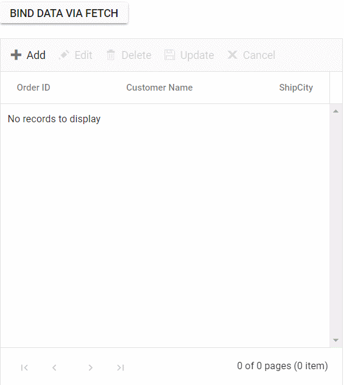
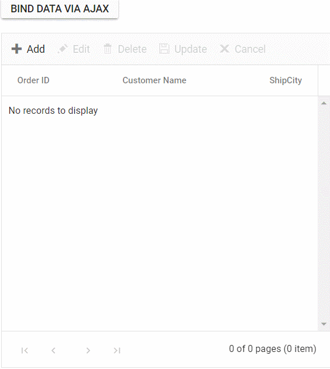

# Local data in React Grid component

The Syncfusion Grid offers a straightforward way to bind local data, such as arrays or JSON objects, to the grid component. This feature allows you to display and manipulate data within the grid without the need for external server calls, making it particularly useful for scenarios where you're working with static or locally stored data.

To achieve this, you can assign a JavaScript object array to the [dataSource](https://ej2.syncfusion.com/react/documentation/api/grid/#datasource) property. Additionally, you have an option to provide the local data source using an instance of the **DataManager**.

The following example demonstrates how to utilize the local data binding feature in the React Grid component:
















 

## Binding data from excel file

The Syncfusion Grid component allows you to import data from Excel files into your web application for display and manipulation within the grid. This feature streamlines the process of transferring Excel data to a web-based environment. This can be achieved by using [Uploader](https://ej2.syncfusion.com/react/documentation/uploader/getting-started) component [change](https://ej2.syncfusion.com/react/documentation/api/uploader#change) event.

To import excel data in to grid, you can follow these steps:

1. Import excel file using Uploader component. 
2. Parse the excel file data using **XLSX** library.
3. Bind the JSON to the grid component. 

The following example demonstrates how to import Excel data into the grid by utilizing the [Uploader](https://ej2.syncfusion.com/react/documentation/uploader/getting-started) component's `change` event along with the **XLSX** library:
















 

## Binding data and performing CRUD actions via Fetch request

The Syncfusion Grid provides a seamless way to bind data from external sources using Fetch requests, facilitating CRUD (Create, Read, Update, Delete) operations with data retrieved from a server. This feature is particularly valuable for sending data to a server for database updates and asynchronously retrieving data without refreshing the entire web page.

To achieve data binding and perform CRUD actions using Ajax requests in the Syncfusion Grid, follow these steps:

**Step 1:** Include the Syncfusion Grid in your HTML with necessary configurations:

```ts
    <div>
        <ButtonComponent onClick={onClick}>Bind data via Fetch</ButtonComponent>
        <GridComponent ref={g => grid = g} allowPaging={true} allowFiltering={true} editSettings={editSettings} toolbar={toolbar} actionBegin={actionBegin} actionComplete={actionComplete}>
        <ColumnsDirective>
            <ColumnDirective field='OrderID' headerText='Order ID' textAlign="Right" width='120' isPrimaryKey={true} />
            <ColumnDirective field='CustomerID' headerText='CustomerID' width='160' />
            <ColumnDirective field='ShipCity' headerText='ShipCity' textAlign="Right" width='120' />
        </ColumnsDirective>
        <Inject services={[Page, Filter, Edit, Toolbar]} />
        </GridComponent>
    </div>
```

**Step 2:** To bind data from an external Fetch request, utilize the [dataSource](https://ej2.syncfusion.com/react/documentation/api/grid/#datasource) property of the Grid. Fetch data from the server and provide it to the `dataSource` property using the `onSuccess` event of the Fetch request.

```ts

   const click = () => {
      const fetch= new Fetch("https://localhost:****/Home/Getdata", 'POST');//Use remote server host number instead ****
      fetch.send();
      fetch.onSuccess = (data: string) => {
        grid.dataSource = JSON.parse(data);
    };
    }

```

On the server side, there is a method named **GetData** within the HomeController that contains the grid's data source. When the button is clicked, an Fetch request is sent to fetch the data from the server and bind it to the Grid component.

```cs

public class HomeController : Controller
    {        
    public ActionResult Getdata()
        {
            IEnumerable DataSource = OrdersDetails.GetAllRecords();
            return Json(DataSource);
        } 

    //create model class define the properties
    public class OrdersDetails
       {
        public OrdersDetails()
           {

           }
        public OrdersDetails(int OrderID, string CustomerId, int EmployeeId, double Freight, bool Verified, DateTime OrderDate, string ShipCity, string ShipName, string ShipCountry, DateTime ShippedDate, string ShipAddress)
        {
            this.OrderID = OrderID;
            this.CustomerID = CustomerId;
            this.EmployeeID = EmployeeId;
            this.Freight = Freight;
            this.ShipCity = ShipCity;
            this.Verified = Verified;
            this.OrderDate = OrderDate;
            this.ShipName = ShipName;
            this.ShipCountry = ShipCountry;
            this.ShippedDate = ShippedDate;
            this.ShipAddress = ShipAddress;
        }
        //Render data in this method
        public static List<OrdersDetails> GetAllRecords()
        {
            List<OrdersDetails> order = new List<OrdersDetails>();
            int code = 10000;
            for (int i = 1; i < 10; i++)
            {
                order.Add(new OrdersDetails(code + 1, "ALFKI", i + 0, 2.3 * i, false, new DateTime(1991, 05, 15), "Berlin", "Simons bistro", "Denmark", new DateTime(1996, 7, 16), "Kirchgasse 6"));
                order.Add(new OrdersDetails(code + 2, "ANATR", i + 2, 3.3 * i, true, new DateTime(1990, 04, 04), "Madrid", "Queen Cozinha", "Brazil", new DateTime(1996, 9, 11), "Avda. Azteca 123"));
                order.Add(new OrdersDetails(code + 3, "ANTON", i + 1, 4.3 * i, true, new DateTime(1957, 11, 30), "Cholchester", "Frankenversand", "Germany", new DateTime(1996, 10, 7), "Carrera 52 con Ave. Bolívar #65-98 Llano Largo"));
                order.Add(new OrdersDetails(code + 4, "BLONP", i + 3, 5.3 * i, false, new DateTime(1930, 10, 22), "Marseille", "Ernst Handel", "Austria", new DateTime(1996, 12, 30), "Magazinweg 7"));
                order.Add(new OrdersDetails(code + 5, "BOLID", i + 4, 6.3 * i, true, new DateTime(1953, 02, 18), "Tsawassen", "Hanari Carnes", "Switzerland", new DateTime(1997, 12, 3), "1029 - 12th Ave. S."));
                code += 5;
            }
            return order;
        }

        public int? OrderID { get; set; }
        public string CustomerID { get; set; }
        public int? EmployeeID { get; set; }
        public double? Freight { get; set; }
        public string ShipCity { get; set; }
        public bool Verified { get; set; }
        public DateTime OrderDate { get; set; }
        public string ShipName { get; set; }
        public string ShipCountry { get; set; }
        public DateTime ShippedDate { get; set; }
        public string ShipAddress { get; set; }
    }    
}

```

**Step 3:** To perform CRUD actions, leverage the [actionBegin](https://ej2.syncfusion.com/react/documentation/api/grid/#actionbegin) event. You can cancel the default CRUD operations by utilizing the **cancel** argument provided by this event. This allows you to dynamically call your server-side method using Fetch, along with the relevant data received from the `actionBegin` event, to update your server data accordingly.

A. To add a new record using Fetch requests, follow these steps:

```ts
       let flag = false;

        const actionBegin = (e: EditEventArgs) => {
            // Initially flag needs to be false in order to enter this condition
            if (!flag) {
                // Add and edit operations
                if (e.requestType == 'save' && ((e as any).action == 'add')) {
                    var editedData = (e as any).data;
                    // The default edit operation is cancelled
                    e.cancel = true;
                    // Here you can send the updated data to your server using fetch call
                    var fetch = new Fetch({
                        url: 'https://localhost:****/Home/Insert',
                        type: 'POST',
                        contentType: 'application/json; charset=utf-8',
                        data: JSON.stringify({ value: editedData })
                    }); //Use remote server host number instead ****
                    fetch.onSuccess = () => {
                        // flag is enabled to skip this execution when grid ends add/edit
                        flag = true;
                        // The added/edited data will be saved in the Grid
                        grid.endEdit();
                    }
                    fetch.onFailure = () => {
                        // Add/edit failed
                        // The flag is disabled if operation is failed so that it can enter the condition on next execution
                        flag = false;
                    }
                    fetch.send();
                }
        }
```

```ts
//insert the record
    public ActionResult Insert(OrdersDetails value)
        {
            OrdersDetails.GetAllRecords().Insert(0, value);
            return Json(value);
        }

```

B. To edit and save a record using an Fetch request, follow these steps:

```ts

        let flag = false;

        const actionBegin = (e: EditEventArgs) => {
            // Initially flag needs to be false in order to enter this condition
            if (!flag) {
                if (e.requestType == 'save' && ((e as any).action == "edit")) {
                    var editedData = (e as any).data;
                    // The default edit operation is cancelled
                    e.cancel = true;
                    // Here you can send the updated data to your server using fetch call
                    var fetch= new Fetch({
                        url: 'https://localhost:****/Home/Update',
                        type: 'POST',
                        contentType: 'application/json; charset=utf-8',
                        data: JSON.stringify({ value: editedData })
                    });//Use remote server host number instead ****
                    fetch.onSuccess = () => {
                        // flag is enabled to skip this execution when grid ends add/edit
                        flag = true;
                        // The added/edited data will be saved in the Grid
                        grid.endEdit();
                    }
                    fetch.onFailure = () => {
                        // Add/edit failed
                        // The flag is disabled if operation is failed so that it can enter the condition on next execution
                        flag = false;
                    }
                    fetch.send();
                }        
            }
        }

```

```cs
//update the record
public ActionResult Update(OrdersDetails value)
        {
            var ord = value;
            OrdersDetails val = OrdersDetails.GetAllRecords().Where(or => or.OrderID == ord.OrderID).FirstOrDefault();
            val.OrderID = ord.OrderID;
            val.EmployeeID = ord.EmployeeID;
            val.CustomerID = ord.CustomerID;
            return Json(value);
        }

```

C. To delete a record using an Fetch request, follow these steps:

```ts
        let flag = false;

        const actionBegin = (e: EditEventArgs) => {
            // Initially flag needs to be false in order to enter this condition
            if (!flag) {
                if (e.requestType == 'delete') {
                    var editedData = (e as any).data;
                    // The default delete operation is cancelled
                    e.cancel = true;
                    // Here you can send the deleted data to your server using fetch call
                    var fetch = new Fetch({
                        url: 'https://localhost:****/Home/Delete',
                        type: 'POST',
                        contentType: 'application/json; charset=utf-8',
                        data: JSON.stringify({ key: editedData[0][grid.getPrimaryKeyFieldNames()[0]] })
                    }) //Use remote server host number instead ****
                    fetch.onSuccess = () => {
                        // flag is enabled to skip this execution when grid deletes record
                        flag = true;
                        // The deleted data will be removed in the Grid
                        grid.deleteRecord();
                    }
                    fetch.onFailure = () => {
                        // Delete failed
                        // The flag is disabled if operation is failed so that it can enter the condition on next execution
                        flag = false;
                    }
                    fetch.send();
                }
            }
    }

```

```cs
//Delete the record
  public ActionResult Delete(int key)
        {
            OrdersDetails.GetAllRecords().Remove(OrdersDetails.GetAllRecords().Where(or => or.OrderID == key).FirstOrDefault());
            var data = OrdersDetails.GetAllRecords();
            return Json(data);
        }

```

**Step 4:**  In the Fetch success event, you have the flexibility to utilize the Grid's [endEdit](https://ej2.syncfusion.com/react/documentation/api/grid/#endedit) and [deleteRecord](https://ej2.syncfusion.com/react/documentation/api/grid/#deleterecord) methods to handle the addition, editing, and deletion of corresponding data in the Grid. However, invoking these methods triggers the `actionBegin` event once again to save the changes in the Grid. To prevent this behavior and maintain control over the execution flow, you can employ a flag variable and manage it within the actionComplete and Fetch failure events: The following code snippet demonstrates this approach:

```ts
        const actionComplete = (e: EditEventArgs) => {
            if (e.requestType === 'save' || e.requestType === 'delete') {
                // The flag is disabled after operation is successfully performed so that it can enter the condition on next execution
                flag = false;
            }
        }

```

The following screenshot represents loading data when the button is clicked and CRUD operations are performed:



### Display the loading indicator with local data. 

The Syncfusion Grid allows you to display a loading indicator while loading local data. This feature is useful when there is a delay in loading data from a local source, and you want to inform the you that the data is being fetched.

To display the loading indicator with local data, you need to set the [showSpinner](https://ej2.syncfusion.com/react/documentation/api/grid#showspinner) property to **true**. This property controls the visibility of the loading indicator.

The following example demonstrates how to display the loading indicator in the Syncfusion Grid using the [load](https://ej2.syncfusion.com/react/documentation/api/grid#load) and [created](https://ej2.syncfusion.com/react/documentation/api/grid/#created) events:

```typescript

import { ColumnDirective, ColumnsDirective, GridComponent } from '@syncfusion/ej2-react-grids';
import * as React from 'react';
import { lazyLoadData } from './datasource';

function App() {
  let grid: GridComponent | null;
  const load = () => {
    setTimeout(() => {
      (grid as GridComponent).showSpinner();
    }, 200)
    setTimeout(() => {
      (grid as GridComponent).dataSource = lazyLoadData as Object[];
    }, 5000)
  }
  return (<div>
    <GridComponent ref={g => grid = g} height={315} load={load}>
      <ColumnsDirective>
        <ColumnDirective field='OrderID' headerText='OrderID' width='120' textAlign="Right" />
        <ColumnDirective field='CustomerID' headerText='CustomerID' width='150' />
        <ColumnDirective field='Quantity' headerText='Quantity' width='150' />
        <ColumnDirective field='CustomerAddress' headerText='CustomerAddress' width='150' />
      </ColumnsDirective>
    </GridComponent></div>)
};
export default App;

```
## Binding data and performing CRUD actions via AJAX request

The Syncfusion Grid provides a seamless way to bind data from external sources using AJAX requests, facilitating CRUD (Create, Read, Update, Delete) operations with data retrieved from a server. This feature is particularly valuable for sending data to a server for database updates and asynchronously retrieving data without refreshing the entire web page

To achieve data binding and perform CRUD actions using Ajax requests in the Syncfusion Grid, follow these steps:

**Step 1:** Include the Syncfusion Grid in your HTML with necessary configurations:

```ts
    <div>
        <ButtonComponent onClick={onClick}>Bind data via AJAX</ButtonComponent>
        <GridComponent ref={g => grid = g} allowPaging={true} allowFiltering={true} editSettings={editSettings} toolbar={toolbar} actionBegin={actionBegin} actionComplete={actionComplete}>
            <ColumnsDirective>
                <ColumnDirective field='OrderID' headerText='Order ID' textAlign="Right" width='120' isPrimaryKey={true} />
                <ColumnDirective field='CustomerID' headerText='CustomerID' width='160' />
                <ColumnDirective field='ShipCity' headerText='ShipCity' textAlign="Right" width='120' />
            </ColumnsDirective>
            <Inject services={[Page, Filter, Edit, Toolbar]} />
        </GridComponent>
    </div>
```

**Step 2:** To bind data from an external AJAX request, utilize the [dataSource](https://ej2.syncfusion.com/react/documentation/api/grid/#datasource) property of the Grid. Fetch data from the server and provide it to the `dataSource` property using the `onSuccess` event of the AJAX request.

```ts
   const click = () => {
        const ajax = new Ajax("https://localhost:****/Home/Getdata", 'POST'); //Use remote server host number instead ****
        ajax.send();
        ajax.onSuccess = (data: string) => {
            grid.dataSource = JSON.parse(data);
        };
    }  

```
On the server side, there is a method named **GetData** within the HomeController that contains the grid's data source. When the button is clicked, an AJAX request is sent to fetch the data from the server and bind it to the Grid component.

```cs

public class HomeController : Controller
    {        
        public ActionResult Getdata()
        {
            var DataSource = OrdersDetails.GetAllRecords();
            return Json(DataSource);
        } 

        //create model class define the properties
        public class OrdersDetails
           {
             public OrdersDetails()
             {

             }
        public OrdersDetails(int OrderID, string CustomerId, int EmployeeId, double Freight, bool Verified, DateTime OrderDate, string ShipCity, string ShipName, string ShipCountry, DateTime ShippedDate, string ShipAddress)
        {
            this.OrderID = OrderID;
            this.CustomerID = CustomerId;
            this.EmployeeID = EmployeeId;
            this.Freight = Freight;
            this.ShipCity = ShipCity;
            this.Verified = Verified;
            this.OrderDate = OrderDate;
            this.ShipName = ShipName;
            this.ShipCountry = ShipCountry;
            this.ShippedDate = ShippedDate;
            this.ShipAddress = ShipAddress;
        }
        //Render data in this method
        public static List<OrdersDetails> GetAllRecords()
        {
            List<OrdersDetails> order = new List<OrdersDetails>();
            int code = 10000;
            for (int i = 1; i < 10; i++)
            {
                order.Add(new OrdersDetails(code + 1, "ALFKI", i + 0, 2.3 * i, false, new DateTime(1991, 05, 15), "Berlin", "Simons bistro", "Denmark", new DateTime(1996, 7, 16), "Kirchgasse 6"));
                order.Add(new OrdersDetails(code + 2, "ANATR", i + 2, 3.3 * i, true, new DateTime(1990, 04, 04), "Madrid", "Queen Cozinha", "Brazil", new DateTime(1996, 9, 11), "Avda. Azteca 123"));
                order.Add(new OrdersDetails(code + 3, "ANTON", i + 1, 4.3 * i, true, new DateTime(1957, 11, 30), "Cholchester", "Frankenversand", "Germany", new DateTime(1996, 10, 7), "Carrera 52 con Ave. Bolívar #65-98 Llano Largo"));
                order.Add(new OrdersDetails(code + 4, "BLONP", i + 3, 5.3 * i, false, new DateTime(1930, 10, 22), "Marseille", "Ernst Handel", "Austria", new DateTime(1996, 12, 30), "Magazinweg 7"));
                order.Add(new OrdersDetails(code + 5, "BOLID", i + 4, 6.3 * i, true, new DateTime(1953, 02, 18), "Tsawassen", "Hanari Carnes", "Switzerland", new DateTime(1997, 12, 3), "1029 - 12th Ave. S."));
                code += 5;
            }
            return order;
        }

        public int? OrderID { get; set; }
        public string CustomerID { get; set; }
        public int? EmployeeID { get; set; }
        public double? Freight { get; set; }
        public string ShipCity { get; set; }
        public bool Verified { get; set; }
        public DateTime OrderDate { get; set; }
        public string ShipName { get; set; }
        public string ShipCountry { get; set; }
        public DateTime ShippedDate { get; set; }
        public string ShipAddress { get; set; }
    }    
}

```

**Step 3:** To perform CRUD actions, leverage the [actionBegin](https://ej2.syncfusion.com/react/documentation/api/grid/#actionbegin) event. You can cancel the default CRUD operations by utilizing the **cancel** argument provided by this event. This allows you to dynamically call your server-side method using AJAX, along with the relevant data received from the `actionBegin` event, to update your server data accordingly.

A. To add a new record using AJAX requests, follow these steps:


```typescript
       let flag = false;

        const actionBegin = (e: EditEventArgs) => {
            // Initially flag needs to be false in order to enter this condition
            if (!flag) {
                // Add and edit operations
                if (e.requestType == 'save' && ((e as any).action == 'add')) {
                    var editedData = (e as any).data;
                    // The default edit operation is cancelled
                    e.cancel = true;
                    // Here you can send the updated data to your server using AJAX call
                    var ajax = new Ajax({
                        url: 'https://localhost:****/Home/Insert',
                        type: 'POST',
                        contentType: 'application/json; charset=utf-8',
                        data: JSON.stringify({ value: editedData })
                    });  //Use remote server host number instead ****
                    ajax.onSuccess = () => {
                        // flag is enabled to skip this execution when grid ends add/edit
                        flag = true;
                        // The added/edited data will be saved in the Grid
                        grid.endEdit();
                    }
                    ajax.onFailure = () => {
                        // Add/edit failed
                        // The flag is disabled if operation is failed so that it can enter the condition on next execution
                        flag = false;
                    }
                    ajax.send();
                }
        }

```

```cs
//insert the record
       public ActionResult Insert([FromBody] CRUDModel<OrdersDetails> value)
       {

           OrdersDetails.GetAllRecords().Insert(0, value.value);
           return Json(value.value);
       }

```

B. To edit and save a record using an AJAX request, follow these steps:

```cs
        let flag = false;

        const actionBegin = (e: EditEventArgs) => {
            // Initially flag needs to be false in order to enter this condition
            if (!flag) {
                if (e.requestType == 'save' && ((e as any).action == "edit")) {
                    var editedData = (e as any).data;
                    // The default edit operation is cancelled
                    e.cancel = true;
                    // Here you can send the updated data to your server using ajax call
                    var ajax = new Ajax({
                        url: 'https://localhost:****/Home/Update',
                        type: 'POST',
                        contentType: 'application/json; charset=utf-8',
                        data: JSON.stringify({ value: editedData })
                    }); //Use remote server host number instead ****
                    ajax.onSuccess = () => {
                        // flag is enabled to skip this execution when grid ends add/edit
                        flag = true;
                        // The added/edited data will be saved in the Grid
                        grid.endEdit();
                    }
                    ajax.onFailure = () => {
                        // Add/edit failed
                        // The flag is disabled if operation is failed so that it can enter the condition on next execution
                        flag = false;
                    }
                    ajax.send();
                }
        
            }
        }

```

```cs
//update the record
   public ActionResult Update([FromBody] CRUDModel<OrdersDetails> value)
    {
        var ord = value.value;
        OrdersDetails val = OrdersDetails.GetAllRecords().Where(or => or.OrderID == ord.OrderID).FirstOrDefault();
        val.OrderID = ord.OrderID;
        val.EmployeeID = ord.EmployeeID;
        val.CustomerID = ord.CustomerID;
        val.Freight = ord.Freight;
        val.OrderDate = ord.OrderDate;
        val.ShipCity = ord.ShipCity;
        val.ShipCountry = ord.ShipCountry;
        return Json(value.value);
    }
 
```

C. To delete a record using an AJAX request, follow these steps:

```typescript
        let flag = false;

        const actionBegin = (e: EditEventArgs) => {
            // Initially flag needs to be false in order to enter this condition
            if (!flag) {
                if (e.requestType == 'delete') {
                    var editedData = (e as any).data;
                    // The default delete operation is cancelled
                    e.cancel = true;
                    // Here you can send the deleted data to your server using ajax call
                    var ajax = new Ajax({
                        url: 'https://localhost:****/Home/Delete',
                        type: 'POST',
                        contentType: 'application/json; charset=utf-8',
                        data: JSON.stringify({ key: editedData[0][grid.getPrimaryKeyFieldNames()[0]] })
                    }) //Use remote server host number instead ****
                    ajax.onSuccess = () => {
                        // flag is enabled to skip this execution when grid deletes record
                        flag = true;
                        // The deleted data will be removed in the Grid
                        grid.deleteRecord();
                    }
                    ajax.onFailure = () => {
                        // Delete failed
                        // The flag is disabled if operation is failed so that it can enter the condition on next execution
                        flag = false;
                    }
                    ajax.send();
                }
            }
    }

```

```cs
//Delete the record
  public ActionResult Delete(int key)
        {
            OrdersDetails.GetAllRecords().Remove(OrdersDetails.GetAllRecords().Where(or => or.OrderID == key).FirstOrDefault());
            var data = OrdersDetails.GetAllRecords();
            return Json(data);
        }

```

**Step 4:**  In the AJAX success event, you have the flexibility to utilize the Grid's [endEdit](https://ej2.syncfusion.com/react/documentation/api/grid/#endedit) and [deleteRecord](https://ej2.syncfusion.com/react/documentation/api/grid/#deleterecord) methods to handle the addition, editing, and deletion of corresponding data in the Grid. However, invoking these methods triggers the `actionBegin` event once again to save the changes in the Grid. To prevent this behavior and maintain control over the execution flow, you can employ a flag variable and manage it within the actionComplete and AJAX failure events: The following code snippet demonstrates this approach:

```typescript
        const actionComplete = (e: EditEventArgs) => {
            if (e.requestType === 'save' || e.requestType === 'delete') {
                // The flag is disabled after operation is successfully performed so that it can enter the condition on next execution
                flag = false;
            }
        }

```

The following screenshot represents loading data when the button is clicked and CRUD operations are performed:



### Display the loading indicator using AJAX. 

The Syncfusion Grid allows you to display a loading indicator while loading data using AJAX. This feature is useful when there is a delay in loading data from data , and you want to inform the you that the data is being fetched. This is particularly beneficial when working with large datasets or under conditions of slower internet connections.

To display the loading indicator with local data, you need to set the [showSpinner](https://ej2.syncfusion.com/react/documentation/api/grid#showspinner) property to **true**. This property controls the visibility of the loading indicator.

The following example demonstrates how to display the loading indicator in the Syncfusion Grid using the [load](https://ej2.syncfusion.com/react/documentation/api/grid#load) and [created](https://ej2.syncfusion.com/react/documentation/api/grid/#created) events:

```typescript

import { ColumnDirective, ColumnsDirective, GridComponent, Page } from '@syncfusion/ej2-react-grids';
import * as React from 'react';
import { lazyLoadData } from './datasource';

function App() {
  let grid: GridComponent | null;
  let isDataLoading = true;
  const pageSettings: object = { pageSize: 5, pageCount: 3 }
  const load = () => {
    if (isDataLoading) {
        (grid as GridComponent).showSpinner();
        isDataLoading = false;
    }
  }
  const created = () => {
    isDataLoading = true;
    const grid = grid;  // Grid instance
    const ajax = new Ajax('https://ej2services.syncfusion.com/production/web-services/api/Orders','GET');
    ajax.send();
    ajax.onSuccess = (data: string) => {
        (grid as GridComponent).dataSource = JSON.parse(data);
    };
}
  return (<div>
    <GridComponent ref={g => grid = g} height={315} allowPaging={true} pageSettings={pageSettings} load={load} created={created}>
      <ColumnsDirective>
        <ColumnDirective field='OrderID' headerText='OrderID' width='120' textAlign="Right" />
        <ColumnDirective field='CustomerID' headerText='CustomerID' width='150' />
        <ColumnDirective field='EmployeeID' headerText='EmployeeID' width='150' />
        <ColumnDirective field='ShipCountry' headerText='ShipCountry' width='150' />
      </ColumnsDirective>
      <Inject services={[Page]]} />
    </GridComponent></div>)
};
export default App;
```

## Immutable mode  

Immutable mode in the Syncfusion Grid is designed to optimize re-rendering performance by utilizing the object reference and [deep compare](https://dmitripavlutin.com/how-to-compare-objects-in-javascript/#4-deep-equality) concept. This mode ensures that when performing Grid actions, only the modified or newly added rows are re-rendered, preventing unnecessary re-rendering of unchanged rows. 

To enable this feature, you need to set the [enableImmutableMode](https://ej2.syncfusion.com/react/documentation/api/grid/#enableImmutableMode) property as **true**.

If immutable mode is enabled, when the datasource changes, only newly added rows are regenerated or reused. Consequently, the grid's [queryCellInfo](https://ej2.syncfusion.com/react/documentation/api/grid/#querycellinfo) and [rowDataBound](https://ej2.syncfusion.com/react/documentation/api/grid/#rowdatabound) events trigger only for newly generated rows, not for existing rows. 

If immutable mode is not enabled, both newly added rows and existing rows are regenerated or reused when the datasource changes. As a result, the `rowDataBound` and `queryCellInfo` events trigger for both newly added and existing rows. 

> This feature uses the primary key value for data comparison. So, you need to provide the [isPrimaryKey](https://ej2.syncfusion.com/react/documentation/api/grid/column/#isprimarykey) column.

The following example demonstrates how to enable immutable mode in an React component. When add, delete, or update actions are performed, existing rows are not regenerated or reused, ensuring efficient rendering of only the modified or newly added rows:
















 

### Limitations

The following features are not supported in the immutable mode:

* Frozen rows and columns
* Grouping
* Row Template 
* Detail Template
* Hierarchy Grid
* Scrolling 
* Virtual scroll
* Infinite scroll
* Column reorder
* Rows, column spanning
* Pdf export, Excel export, Print
* Column Resize
* Drag and drop
* Coulumn template
* Column chooser
* Clipboard
* AutoFit
* Flitering