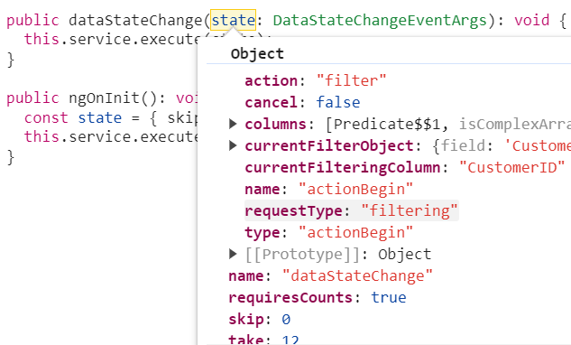
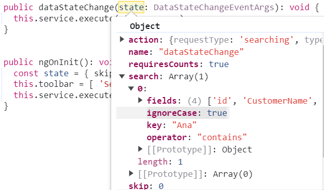
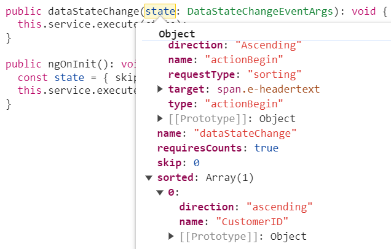
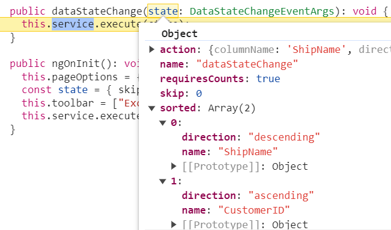
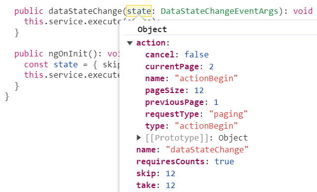
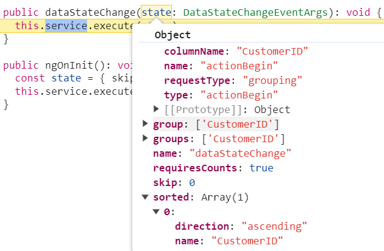
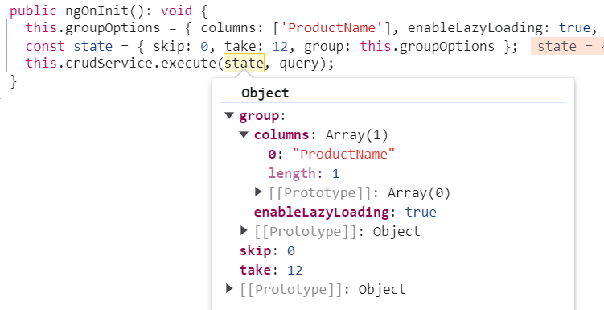
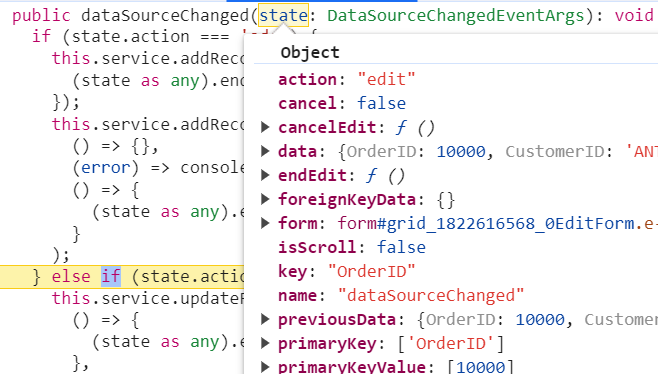
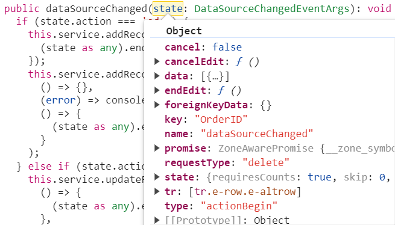
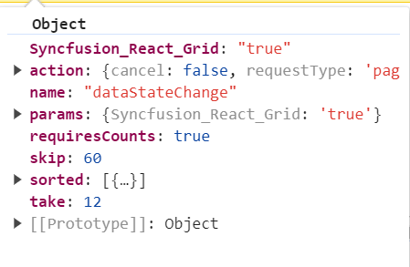

# Remote Data in React Grid component

In React Grid component, binding remote data is a fundamental aspect that enhances the efficiency of data interaction. This process involves assigning the service data, represented as an instance of `DataManager`, to the `dataSource` property of the React Grid component. By doing so, seamless interaction with a remote data source is enabled, achieved by specifying the endpoint URL where the data is hosted.

Additionally, leverage the power for data retrieval and operations, enhancing event handling, asynchronous programming, and concurrent value management in React applications.

## Custom binding

The custom binding feature in the React Grid enables managing a custom API for handling data processing externally and then binding the resulting data to the Grid.This allows implementing custom data logic tailored to the application's requirements. When using custom binding, the Grid expects the result of the custom logic to be an object with properties `result` and `count`.

- `result` -  This property should contain the array of records that will be displayed in the Grid. 
- `count` - This property should indicate the total number of records available in the entire dataset.

To utilize custom binding, the application can handle the [DataManager](https://ej2.syncfusion.com/react/documentation/data/getting-started). The DataManager integrates seamlessly with the React Grid to manage custom data processing and binding. 

The Syncfusion<sup style="font-size:70%">&reg;</sup> React Grid component offers a range of powerful features for handling grid actions such as **paging**, **grouping**, **sorting** and **filtering**. These actions trigger the [dataStateChange](https://ej2.syncfusion.com/react/documentation/api/grid/index-default#datastatechange) event. The feature for CRUD action such as **Create**, **Read**, **Update**, **Delete** operations. This action trigger the [dataSourceChanged](https://ej2.syncfusion.com/react/documentation/api/grid/index-default#datasourcechanged) event. This event provides the opportunity to manage and manipulate data according to the individual's interactions.

**Using the dataStateChange event**

The `dataStateChange` event is triggered whenever actions that modify the grid's data state are performed, such as paging, sorting, or grouping. This event provides detailed information about the action performed and the current state of the grid, including parameters like page number, sorting details, and filtering criteria.

To implement the `dataStateChange` event, follow these steps:

1. **Subscribe to the event:** In the component code, subscribe to the `dataStateChange` event using the appropriate event handler function. This function is executed whenever the grid is interacted with.

2. **Handle data state:** Inside the event handler function, the event arguments can be accessed to determine the specific actions and intentions. The action property of the event arguments indicates the type of action performed (e.g., paging, sorting, grouping).

> The `dataStateChange` event will not be triggered during the initial rendering.

### Handling filtering operation

When filtering operation is performed in the grid, the `dataStateChange` event is triggered, providing access to the following referenced arguments within the event.



The filter action's updated data state can be applied as shown below:

```typescript
const applyFiltering = (query: Query, filter: any) => {
    if (filter.columns && filter.columns.length) {
      for (let i = 0; i < filter.columns.length; i++) {
        const field = filter.columns[i].field;
        const operator = filter.columns[i].operator;
        const value = filter.columns[i].value;
        query.where(field, operator, value);
      }
    }
    else {
      for (let i = 0; i < filter.length; i++) {
        const { fn, e } = filter[i];
        if (fn === 'onWhere') {
          query.where(e as string);
        }
      }
    }
  }
/** GET all data from the server */
const reducer = (state = initialState, action) => {
  createLazyLoadData();
  const dataSource = [...initialState.data];
  const query = new Query();
  switch (action.type) {
    case Grid_FetchData: {
      if (action.payload.where) {
        applyFiltering(query, action.gridQuery.queries);
        // To get the count of the data
        query.isCountRequired = true;
        // Execute local data operations using the provided query
        const currentResult = new DataManager(dataSource).executeLocal(query);
        // Return the result along with the count of total records
        return ({
            data: {
                result: currentResult.result, // Result of the data
                count: currentResult.count // Total record count
            } 
        })
      }
    }
  }
}
```


When filtering multiple values, the predicates are provided as arguments in the `dataStateChange` event. Custom predicate execution can then be implemented based on the predicate values.

### Handling searching operation

When performing a search operation in the grid, the `dataStateChange` event is triggered, allowing access to the following referenced arguments within the event



The grid's data state during a search action can be updated using the following approach:

```typescript
const applySearching = (query: Query, search: any) => {
  // Check if a search operation is requested
  if (search && search.length > 0) {
    // Extract the search key and fields from the search array
    const { fields, key } = search[0];
    // perform search operation using the field and key on the query
    query.search(key, fields);
  }
}
/** GET all data from the server */
const reducer = (state = initialState, action: any) => {
  createLazyLoadData();
  const dataSource = [...initialState.data];
  const query = new Query();
  switch (action.type) {
    case Grid_FetchData: {
      if (!isNullOrUndefined(action.payload.search)) {
        applySearching(query, action.payload.search);
      }
      // To get the count of the data
      query.isCountRequired = true;
      // Execute local data operations using the provided query
      const currentResult = new DataManager(dataSource).executeLocal(query);
      // Return the result along with the count of total records
      return ({
          data: {
              result: currentResult.result, // Result of the data
              count: currentResult.count // Total record count
          } 
      })
    }
  }
}
```

### Handling sorting operation

When a sorting operation is performed in the grid, the `dataStateChange` event is triggered. Within this event, the following referenced arguments can be accessed.



When performing multi‑column sorting, the following referenced arguments are available in the `dataStateChange` event



The grid's data state during a sort action can be updated using the following approach:

```typescript
const applySorting = (query: Query, sorted: sortInfo[]) => {
  if (sorted && sorted.length > 0) {
    sorted.forEach(sort => {
      const sortField = sort.name || sort.field;
      query.sortBy(sortField as string, sort.direction);
    });
  }
}
/** GET all data from the server */
const reducer = (state = initialState, action) => {
    createLazyLoadData();
    const dataSource = [...initialState.data];
    const query = new Query();
    switch (action.type) {
      case Grid_FetchData: {
        if (!isNullOrUndefined(action.payload.sorted)) {
            applySorting(query, action.payload.sorted);
        }
        // To get the count of the data
        query.isCountRequired = true;
        // Execute local data operations using the provided query
        const currentResult = new DataManager(dataSource).executeLocal(query);
        // Return the result along with the count of total records
        return ({
            data: {
                result: currentResult.result, // Result of the data
                count: currentResult.count // Total record count
            } 
        })
      }
    }
}
```

### Handling paging operation

When a paging operation is performed in the grid, the `dataStateChange` event is triggered, and the following referenced arguments become available within this event.



The grid's data state for a paging action can then be updated using the following approach:

```typescript
const applyPaging = (query, page) => {
  // Check if both 'take' and 'skip' values are available
  if (page.take && page.skip) {
    // Calculate pageSkip and pageTake values to get pageIndex and pageSize
    const pageSkip = page.skip / page.take + 1;
    const pageTake = page.take;
    query.page(pageSkip, pageTake);
  }
  // If if only 'take' is available and 'skip' is 0, apply paging for the first page.
  else if (page.skip === 0 && page.take) {
    query.page(1, page.take);
  }
}
/** GET all data from the server */
const reducer = (state = initialState, action) => {
  createLazyLoadData();
  const dataSource = [...initialState.data];
  const query = new Query();
  switch (action.type) {
    case Grid_FetchData: {
      applyPaging(query, action.payload);
      // To get the count of the data
      query.isCountRequired = true;
      // Execute local data operations using the provided query
      const currentResult = new DataManager(dataSource).executeLocal(query);
      // Return the result along with the count of total records
      return ({
          data: {
              result: currentResult.result, // Result of the data
              count: currentResult.count // Total record count
          } 
      })
    }
  }
}
```

### Handling grouping operation

When grouping operation is performed in the grid, the `dataStateChange` event is triggered, providing access to the following referenced arguments within the event.



The grid's data state during a group action can be updated using the following approach:

```typescript
const applyGrouping = (query: Query, group: Object[]) => {
  // Check if grouping data is available
  if (group && group.length > 0) {
    for (let i = 0; i < group.length; i++) {
      // perform group operation using the column on the query
      query.group(group[i] as string);
    }
  }
}
/** GET all data from the server */
const reducer = (state = initialState, action) => {
  createLazyLoadData();
  const dataSource = [...initialState.data];
  const query = new Query();
  switch (action.type) {
    case Grid_FetchData: {
      if (!isNullOrUndefined(action.payload.group)) {
        applyGrouping(query, action.payload.group);
      }
      // To get the count of the data
      query.isCountRequired = true;
      // Execute local data operations using the provided query
      const currentResult = new DataManager(dataSource).executeLocal(query);
      // Return the result along with the count of total records
      return ({
          data: {
              result: currentResult.result, // Result of the data
              count: currentResult.count // Total record count
          } 
      })
    }
  }
}
```

> To utilize group actions, it is necessary to manage the sorting query within the service.

**Lazy load grouping**

In React, lazy loading refers to the technique of loading data dynamically when they are needed, instead of loading everything upfront. Lazy load grouping enables efficient loading and display of grouped data by fetching only the required data on demand.

To enable this feature, the [groupSettings.enableLazyLoading](https://ej2.syncfusion.com/react/documentation/api/grid/groupsettings#enableLazyLoading) property must be set to `true`. In addition, the state must be managed based on the initial grid action as follows.

```typescript
const groupOptions = { columns: ['ProductName'], enableLazyLoading: true };
const state = { skip:0, take: 12, group: groupOptions};
```

Based on the initial state, the relevant arguments can be accessed as illustrated below:



The grid's state can be modified using the following approach:

```typescript
const applyGrouping = (query: Query, group: Object[]) => {
  // Check if grouping data is available
  if (group && group.length > 0) {
    for (let i = 0; i < group.length; i++) {
      // perform group operation using the column on the query
      query.group(group[i] as string);
    }
  }
}
const applyLazyLoad = (query: Query, payload: payloadInfo) => {
  // Configure lazy loading for the main data
  if (payload.isLazyLoad) {
    query.lazyLoad.push({ key: 'isLazyLoad', value: true });
    // If on-demand group loading is enabled, configure lazy loading for grouped data
    if (payload.onDemandGroupInfo) {
      query.lazyLoad.push({
          key: 'onDemandGroupInfo',
          value: payload.action.lazyLoadQuery,
      });
    }
  }
}
/** GET all data from the server */
const reducer = (state = initialState, action) => {
  createLazyLoadData();
  const dataSource = [...initialState.data];
  const query = new Query();
  switch (action.type) {
    case Grid_FetchData: {
      // grouping
      if (!isNullOrUndefined(action.payload.group)) {
          applyGrouping(query, action.payload.group);
      }
      // lazy load goruping
      applyLazyLoad(query, action.payload);
      // To get the count of the data
      query.isCountRequired = true;
      // Execute local data operations using the provided query
      const currentResult = new DataManager(dataSource).executeLocal(query);
      // Return the result along with the count of total records
      return ({
        data: {
          result: currentResult.result, // Result of the data
          count: currentResult.count // Total record count
        } 
      })
    }
  }
}
```

> Further information can be accessed in the respective documentation for [lazy load grouping](https://ej2.syncfusion.com/react/documentation/grid/grouping/lazy-load-grouping).

The complete example is available in the [handling CRUD operations topic](#perform-crud-operations).

### Handling CRUD operations

The Grid component provides powerful options for dynamically inserting, deleting, and updating records, enabling data to be modified directly within the grid. This feature is useful for performing CRUD (**Create**, **Read**, **Update**, **Delete**) operations seamlessly.

**Integrating CRUD Operations**

To implement CRUD operations using Syncfusion<sup style="font-size:70%">&reg;</sup> React Grid, follow these steps:

1. **Configure grid settings:** Set up the grid to allow editing, adding, and deleting operations, and specify the `toolbar` options that will provide access to these features.

2. **Handle data state changes:** Utilize the [dataStateChange](https://ej2.syncfusion.com/react/documentation/api/grid/index-default#datastatechange) event to respond to changes in the grid's data state. This event is triggered whenever the grid is interacted with, such as during paging or sorting.

3. **Execute CRUD operations:** Within the event handler for [dataSourceChanged](https://ej2.syncfusion.com/react/documentation/api/grid/index-default#datasourcechanged), implement logic to handle various CRUD actions based on the action or requestType property of the event arguments.

4. **Call endEdit method:** After performing CRUD operations (adding, editing, or deleting), call the [endEdit](https://ej2.syncfusion.com/react/documentation/api/grid/index-default#endedit) method to signal the completion of the operation and update the grid accordingly.

**Insert operation**

When an insert operation is performed in the grid, the `dataSourceChanged` event will be triggered, allowing access to the following referenced arguments within the event.


```typescript
const reducer = (state = initialState, action) => {
  createLazyLoadData();
  const dataSource = [...initialState.data];
  const query = new Query();
  switch (action.type) {
    case Grid_Add: {
      // Perform add operation
      gridData.insert(action.payload.data, '', undefined, 0);
      const addedData = gridData.executeLocal(new Query());
      initialState.data = [...addedData];
      const count = addedData.length;
      const result = new DataManager(addedData).executeLocal(action.gridQuery);
      const currentPageData = new DataManager(result).executeLocal(new Query().skip(action.payload.state.skip).take(action.payload.state.take));
      return ({
          data: { result: currentPageData, count: filter.length ? result.length : count },
      })
    }
  }
}
```

**Edit operation**

When an edit operation is performed in the grid, the `dataSourceChanged` event will be triggered, providing access to the following referenced arguments within the event.



```typescript
const reducer = (state = initialState, action) => {
  createLazyLoadData();
  const dataSource = [...initialState.data];
  const query = new Query();
  switch (action.type) {
    case Grid_Editing: {
      // Perform edit operation
      gridData.update('OrderID', action.payload.data);
      const updatedData = gridData.executeLocal(new Query());
      initialState.data = [...updatedData];
      const count = updatedData.length;
      const result = new DataManager(updatedData).executeLocal(action.gridQuery);
      const currentPageData = new DataManager(result).executeLocal(new Query().skip(action.payload.state.skip).take(action.payload.state.take));
      return ({
          data: { result: currentPageData, count: filter.length ? result.length : count }
      })
    }
  }
}
```

**Delete operation**

When a delete operation is performed in the grid, the `dataSourceChanged` event will be triggered, allowing access to the following referenced arguments within the event.



```typescript
const reducer = (state = initialState, action) => {
  createLazyLoadData();
  const dataSource = [...initialState.data];
  const query = new Query();
  switch (action.type) {
    case Grid_Delete: {
      // Perform delete operation
      gridData.remove('OrderID', { OrderID: action.payload.data[0]['OrderID'] });
      const updatedData = gridData.executeLocal(new Query());
      initialState.data = [...updatedData];
      const count = updatedData.length;
      const result = new DataManager(updatedData).executeLocal(action.gridQuery);
      const currentPageData = new DataManager(result).executeLocal(new Query().skip(action.payload.state.skip).take(action.payload.state.take));
      return ({
          data: { result: currentPageData, count: filter.length ? result.length : count }
      })
    }
  }
}
```

## The steps below to create a Redux service.

**Step 1 : Install Dependencies**

In the terminal, navigate to the project directory and run the following command to install the required packages:

```bash
npm install --save redux react-redux
```
The above command install the redux package, which is the core Redux library, and the react-redux package, which provides integration between Redux and React.

**Step 2 : Set Up Redux Store**

Once the dependencies are installed, a Redux [store](https://redux.js.org/api/store) must be set up in the application. Add the following code to the **store.tsx** file.

1. Create a new file called `store.tsx` in the project's directory.

2. In the **store.tsx** file, import the necessary Redux functions and create the store:

    ```ts
    import { createStore } from 'redux';
    import reducer from "../reducer";
    const store = createStore(reducer);
    export default store;
    ```
    In this code, the `createStore` function is imported from the redux package along with the `reducer` from the appropriate file. The Redux `store` is then created using the `createStore` function, with the `reducer` passed as an argument.

3. The Redux store is now set up. It can be further customized by adding middleware, enhancers, or other configurations as needed.

**Step 3 : Connect Redux Provider**

To make the Redux `store` available to the React components, the application must be wrapped with the Redux [Provider](https://react-redux.js.org/api/provider) component. This component receives the Redux `store` as a prop and connects all components within its hierarchy. Follow the steps below to connect the Redux Provider:

1. Open the root component file (usually **index.ts**).

2. Import the necessary dependencies:

    ```ts
    import React from 'react';
    import ReactDOM from 'react-dom/client';
    import { Provider } from 'react-redux';
    import store from './store';
    ```
3. Wrap the application component with the `Provider` component and pass the Redux `store` as a prop:

    ```ts
    ReactDOM.render(
      <Provider store={store}>
        <App />
      </Provider>,
    document.getElementById('root'));
    ```

**Step 4: Create a Actions**

According to Redux documentation, the Redux [actions](https://redux.js.org/tutorials/fundamentals/part-3-state-actions-reducers#designing-actions) are plain JavaScript objects that describe changes to be made to the application's state. These actions are dispatched to the Redux `store`, and `reducers` handle them to update the state accordingly.

The action type defines the name of the action that will be performed from the application. Each action type is a string that describes the specific operation being executed.

The following example demonstrates a Redux action definition for a sort operation. This code can be added to the **action.tsx** file:

```ts
export const Grid_FetchData = "Grid_FetchData";

export const fetchData = (state: any, query: Query) => ({
    type: "Grid_FetchData",
    payload: state,
    gridQuery: query
});
```

**Step 5: Create a Reducer**

According to the Redux documentation, the Redux [reducers](https://redux.js.org/tutorials/fundamentals/part-3-state-actions-reducers#writing-reducers) are functions responsible for handling actions and updating the state of the application. Reducers specify the way the state should change in response to different actions dispatched to the Redux store.

Here is an example of a Redux reducer definition for sorting operations. The reducer code can be added to the **reducer.tsx** file.

```ts
const initialState = {
    data: lazyLoadData,
    error: false,
    result: [],
    count: 0,
    allowPaging: true
}

const applyPaging = (query, page) => {
  if (page.take && page.skip) {
    const pageSkip = page.skip / page.take + 1;
    const pageTake = page.take;
    query.page(pageSkip, pageTake);
  }
  else if (page.skip === 0 && page.take) {
    query.page(1, page.take);
  }
}

const reducer = (state = initialState, action) => {
    createLazyLoadData();
    const dataSource = [...initialState.data];
    const query = new Query();
    switch (action.type) {
        case Grid_FetchData: {
            applyPaging(query, action.payload);
            if (action.payload.requiresCounts) {
                query.isCountRequired = true;
            }
            const currentResult = new DataManager(dataSource).executeLocal(query);
            return ({
                data: { result: currentResult.result, count: currentResult.count }
            })
        }
        default: {
            const currentResult = new DataManager(dataSource).executeLocal(query);
            return ({
                data: { result: currentResult.result , count: currentResult.count}
            })
        }
    }
}
export default reducer;
```

> The grid expects an object as result and count format.

**Step 6: Create a Dispatch**

According the Redux documentation, the [dispatch](https://redux.js.org/api/store#dispatchaction) function is a method provided by the Redux `store`. It is used to send actions to the `store`, triggering the state update process. Dispatching an action is the primary way to update the state in a Redux application.

When performing actions such as adding, updating, or deleting a row in the grid, it dispatches the corresponding actions to modify the data in the store and trigger updates to the grid component.

When the `dataSourceChanged` and `dataStateChange` event occur, the dispatch method is called according to their grid actions.

Add the following code to the **App.tsx** file.

```ts
  const dataStateChange = (args: DataStateChangeEventArgs) => {
    const query = (gridInstance as GridComponent).getDataModule().generateQuery();
    dispatch(fetchData(args, query));
  }

  const dataSourceChanged = (args: DataSourceChangedEventArgs) => {
    const query = (gridInstance as GridComponent).getDataModule().generateQuery();
    if (state.requestType === 'delete') {
      dispatch(deleteRow(state, query));
    }
  }
```

**Step 7: Fetching Grid Data using useEffect**

To fetch grid data and populate the [dataSource](https://ej2.syncfusion.com/react/documentation/api/grid/index-default#datasource) property of the grid, the [useEffect](https://react.dev/reference/react/useEffect) hook can be used in React. The `useEffect` hook enables performing side effects such as fetching data after the component has rendered. The following example demonstrates fetching grid data using `useEffect`:

Add the following code to the **App.tsx** file.

```ts
  useEffect(() => {
    if (gridInstance) {
      gridInstance.dataSource = state.data
    }
  },[state.data]) 
```

The following example demonstrates the process of binding custom data to handle grid actions and CRUD operations. 




























> * While working with grid edit operation, defining the `isPrimaryKey` property of column is a mandatory step. In case the primary key column is not defined, the edit or delete action will take place on the first row of the grid.
> * Need to maintain the same instance for all grid actions.

## Export all records in client side

Export all records is especially beneficial when dealing with large datasets that need to be exported for offline analysis or sharing.

By default, the Syncfusion React Grid component exports only the records available on the current page. However, the Grid component also supports exporting all records—including those spanning multiple pages—by configuring the [pdfExportProperties](https://ej2.syncfusion.com/react/documentation/api/grid/pdfExportProperties) and [excelExportProperties](https://ej2.syncfusion.com/react/documentation/api/grid/excelExportProperties).

To export all records, including those from multiple pages, configure the [pdfExportProperties.dataSource](https://ej2.syncfusion.com/react/documentation/api/grid/pdfexportproperties#datasource) for PDF exporting and [excelExportProperties.dataSource](https://ej2.syncfusion.com/react/documentation/api/grid/excelexportproperties#datasource) for Excel exporting within the [toolbarClick](https://ej2.syncfusion.com/react/documentation/api/grid#toolbarclick) event handler. Inside this event, set the `dataSource` property of `pdfExportProperties` and `excelExportProperties` for PDF and Excel exporting to include all records.

**Excel Exporting**

To export the complete Grid data to Excel document, utilize the `excelExportProperties.dataSource` when initiating the Excel export. Use the following code snippet to export all records within the Grid:




 const toolbarClick = async (args: ClickEventArgs) => {
    const exportState = { skip: 0, take: gridInstance.current.pageSettings.totalRecordsCount};
    await dispatch(fetchData(exportState));
    const updatedState = store.getState();
    const exportData = updatedState.data.result; 
    if (args.item.text === "Excel Export") {
      const excelExportProps: ExcelExportProperties = {
        dataSource: exportData, 
      };
      gridInstance.current.excelExport(excelExportProps);
    }
  };




 const toolbarClick = async (args) => {
    const exportState = { skip: 0, take: gridInstance.current.pageSettings.totalRecordsCount};
    await dispatch(fetchData(exportState));
    const updatedState = store.getState();
    const exportData = updatedState.data.result; 
    if (args.item.text === "Excel Export") {
      const excelExportProps = {
        dataSource: exportData, 
      };
      gridInstance.current.excelExport(excelExportProps);
    }
  };




**PDF Exporting**

To export the complete Grid data to PDF document, utilize the `pdfExportProperties.dataSource` when initiating the PDF export. Use the following code snippet to export all records within the Grid:

```ts

  const toolbarClick = async (args: ClickEventArgs) => {
    const exportState = { skip: 0, take: gridInstance.current.pageSettings.totalRecordsCount};
    await dispatch(fetchData(exportState));
    const updatedState = store.getState();
    const exportData = updatedState.data.result; 
    if (args.item.text === "PDF Export") {
      const pdfExportProps: PdfExportProperties = {
        dataSource: exportData, 
      };
      gridInstance.current.pdfExport(pdfExportProps); 
    }
  };


```

> For further customization on Grid export, refer to the respective documentation for [PDF exporting](https://ej2.syncfusion.com/react/documentation/grid/pdf-export/pdf-export-options) and [Excel exporting](https://ej2.syncfusion.com/react/documentation/grid/excel-export/excel-export-options)

The following code example shows the process of exporting all records on the client side:




























## Sending additional parameters to the server

The Syncfusion<sup style="font-size:70%">&reg;</sup> React Grid component allows custom parameters to be included in data requests. This feature is particularly useful when additional information must be provided to the server for enhanced processing.

By using the [query](https://ej2.syncfusion.com/react/documentation/api/grid/index-default#query) property of the Grid together with the `addParams` method of the Query class, custom parameters can be seamlessly incorporated into data requests for every grid action.

To enable custom parameters in data requests for the grid component, follow these steps:

**1. Bind the Query Object to the Grid**: Assign the initialized query object to the query property of the Syncfusion<sup style="font-size:70%">&reg;</sup> React Grid component.

**2. Initialize the Query Object:** Create a new instance of the Query class and use the addParams method to add the custom parameters.

**3. Handle Data State Changes:** To dynamically update data based on interactions, implement the `dataStateChange` event handler to execute the query with the updated state.

**4. Execute Data Request:** In the service, execute the data request by combining the custom parameters with other query parameters such as paging and sorting.

The following example demonstrates the process of sending additional parameters to the server.






























## Offline mode

On remote data binding, all grid actions such as paging, sorting, editing, grouping, filtering, etc, will be processed on server-side. To avoid post back for every action, set the grid to load all data on initialization and make the actions process in client-side. To enable this behavior, use the `offline` property of `DataManager`.

```typescript

import { ColumnDirective, ColumnsDirective, GridComponent, PageSettingsModel, Page, Group, Sort } from '@syncfusion/ej2-react-grids';
import { DataManager, ODataAdaptor } from '@syncfusion/ej2-data';
import * as React from 'react';

function App() {
    const pageSettings: PageSettingsModel = { pageSize: 7 };
    const data: DataManager = new DataManager({
      url: 'https://js.syncfusion.com/demos/ejServices/Wcf/Northwind.svc/Orders?$top=7',
      adaptor: new ODataAdaptor(),
      offline: true
    });
    return <div>
        <GridComponent dataSource={data} height={315} allowPaging={true} pageSettings={pageSettings} allowSorting={true} allowGrouping={true}>
            <ColumnsDirective>
                <ColumnDirective field='OrderID' headerText='Order ID' width='120' textAlign="Right" />
                <ColumnDirective field='CustomerID' headerText='Customer ID' width='150' />
                <ColumnDirective field='ShipCity' headerText='Ship City' width='150' />
                <ColumnDirective field='ShipName' headerText='Ship Name' width='150' />
            </ColumnsDirective>
            <Inject Services={[Page, Sort, Group]}/>
        </GridComponent>
    </div>
};
export default App;
```

## Fetch result from the DataManager query using external button 

By default, the Syncfusion React Grid automatically binds a remote data source using the [DataManager](https://ej2.syncfusion.com/react/documentation/data/getting-started). However, in certain scenarios, data may need to be fetched dynamically from the server using a query triggered by an external button. This approach provides greater control over when data is loaded into the Grid.

To achieve this, the `executeQuery` method of `DataManager` can be used along with a query object. This method enables running a custom query and retrieving results dynamically.

The following example demonstrates the process of fetching data from the server when an external button is clicked and displaying a status message indicating the data fetch status.










