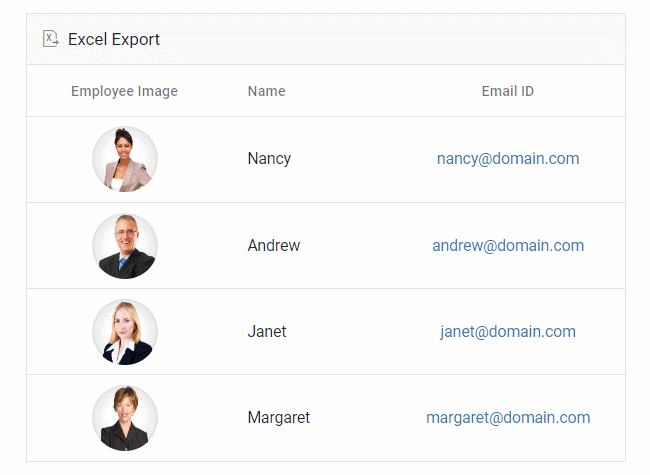
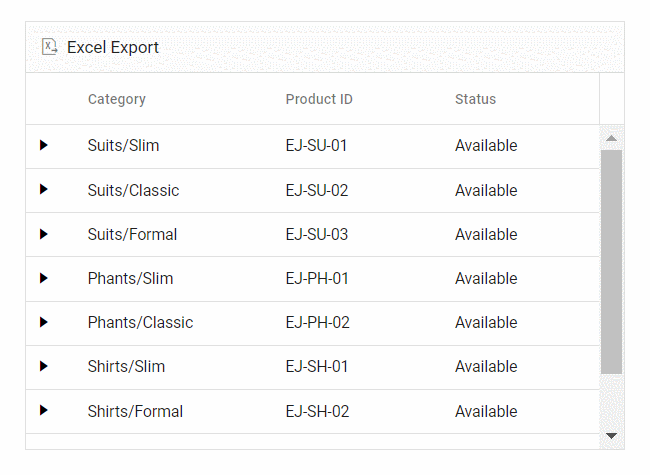
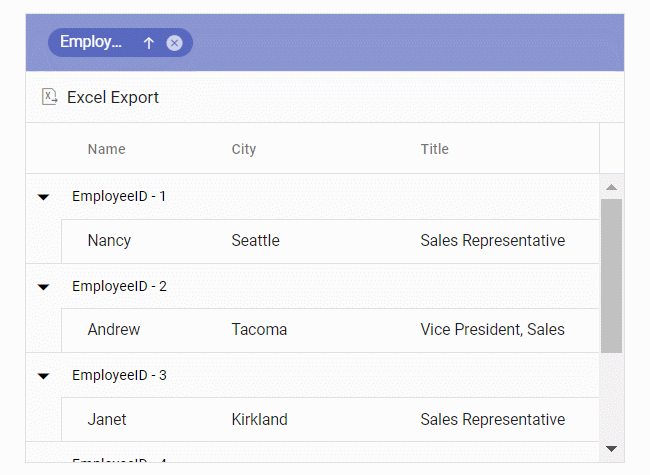

# Exporting with Templates

The Grid offers powerful export capabilities that preserve column, detail, and caption templates in Excel documents. Templates enable rich content rendering including images, hyperlinks, and customized text. Column templates customize individual cell content, detail templates display nested hierarchical data, and caption templates customize group headers for enhanced presentation.

## Exporting with column template

Column template export enables Grid columns with complex content including images, hyperlinks, and custom text to be seamlessly exported to Excel documents. This feature is ideal when visual elements or interactive content need to be preserved in exported files.

In the following sample, the hyperlinks and images are exported to Excel using [hyperlink](https://ej2.syncfusion.com/react/documentation/api/grid/excelQueryCellInfoEventArgs#hyperlink) and [image](https://ej2.syncfusion.com/react/documentation/api/grid/excelQueryCellInfoEventArgs#image) properties in the [excelQueryCellInfo](https://ej2.syncfusion.com/react/documentation/api/grid#excelquerycellinfo) event.

> Excel Export supports base64 string to export the images.


















## Exporting with detail template

Detail template export configuration allows control over hierarchical data rendering in Excel documents. By default, the grid exports the parent grid with expanded detail rows alone. Change the exporting behavior by using the `ExcelExportProperties.hierarchyExportMode` property. This feature is particularly useful for master-detail scenarios where controlling the level of exported detail enhances document clarity.

The available export modes are:

| Mode     | Behavior    |
|----------|-------------|
| `Expanded` | Exports the parent grid with expanded detail rows. |
| `All`      | Exports the parent grid with all the detail rows. |
| `None`     | Exports the parent grid alone. |

The detail rows in the exported Excel can be customized or formatted using the [exportDetailTemplate](https://ej2.syncfusion.com/react/documentation/api/grid#exportdetailtemplate) event. In this event, the detail rows of the Excel document are formatted in accordance with their parent row details.

In the following sample, the detail row content is formatted by specifying the [columnHeader](https://ej2.syncfusion.com/react/documentation/api/grid/detailTemplateProperties#columnheader) (defines the header structure for detail rows) and [rows](https://ej2.syncfusion.com/react/documentation/api/grid/detailTemplateProperties#rows) properties using its [parentRow](https://ej2.syncfusion.com/react/documentation/api/grid/exportDetailTemplateEventArgs#parentrow) details. This allows for the creation of detail rows in the Excel document. Additionally, custom styles can be applied to specific cells using the [style](https://ej2.syncfusion.com/react/documentation/api/grid/detailTemplateCell#style) property.

> When using [rowSpan](https://ej2.syncfusion.com/react/documentation/api/grid/detailTemplateCell#rowspan) (merges multiple rows vertically), it is Essential&reg; to provide the cell's [index](https://ej2.syncfusion.com/react/documentation/api/grid/detailTemplateCell#index) for proper functionality.




import { ColumnDirective, ColumnsDirective, GridComponent, DetailRow, Inject,
  ExcelExport, Toolbar } from '@syncfusion/ej2-react-grids';
import * as React from 'react';
import { employeeData } from './datasource';

function App() {
  let grid;
  const toolbar = ['ExcelExport'];
  const gridTemplate = (props) => {
    return (
      <table className="detailtable" width="100%">
        <colgroup>
          <col style={{ width: '40%' }} />
          <col style={{ width: '60%' }} />
        </colgroup>
        <thead>
          <tr>
            <th
              colSpan={2}
              style={{
                fontWeight: 500,
                textAlign: 'center',
                backgroundColor: '#ADD8E6',
              }}
            >
              Product Details
            </th>
          </tr>
        </thead>
        <tbody>
          <tr>
            <td rowSpan={4} className="photo" style={{ textAlign: 'center' }}>
              
            </td>
            <td>
              
                Offers: {props.Offers}
              
            </td>
          </tr>
          <tr>
            <td>
              Available: {props.Available} 
            </td>
          </tr>
          <tr>
            <td>
              
                Contact: <a href={'mailto:' + props.Contact}>{props.Contact}</a>
              
            </td>
          </tr>
          <tr>
            <td>
              
                Ratings: {props.Ratings}
              
            </td>
          </tr>
          <tr>
            <td style={{ textAlign: 'center' }}>
               {props.productDesc}
            </td>
            <td>
              {props.ReturnPolicy}
            </td>
          </tr>
          <tr>
            <td style={{ textAlign: 'center' }}>
               {props.Cost}
            </td>
            <td>
              {props.Cancellation}
            </td>
          </tr>
          <tr>
            <td style={{ textAlign: 'center' }}>
              
                {' '}
                {props.Status}
              
            </td>
            <td>
              
                {props.Delivery}
              
            </td>
          </tr>
        </tbody>
      </table>
    );
  };

  const toolbarClick = (args) => {
    if (grid && args['item'].id === 'DetailTemplateGrid_excelexport') {
      grid.excelExport({
        hierarchyExportMode: 'Expanded',
      });
    }
  };
  const exportDetailTemplate = (args) => {
    args.value = {
      columnHeader: [
        {
          cells: [
            {
              index: 0,
              colSpan: 2,
              value: 'Product Details',
              style: {
                backColor: '#ADD8E6',
                excelHAlign: 'Center',
                bold: true,
              },
            },
          ],
        },
      ],
      rows: [
        {
          cells: [
            {
              index: 0,
              rowSpan: 4,
              image: {
                base64: args.parentRow.data['ProductImg'],
                height: 80,
                width: 100,
              },
            },
            {
              index: 1,
              value: 'Offers: ' + args.parentRow.data['Offers'],
              style: { bold: true, fontColor: '#0a76ff' },
            },
          ],
        },
        {
          cells: [
            {
              index: 1,
              value: 'Available: ' + args.parentRow.data['Available'],
            },
          ],
        },
        {
          cells: [
            {
              index: 1,
              value: 'Contact: ',
              hyperLink: {
                target: 'mailto:' + args.parentRow.data['Contact'],
                displayText: args.parentRow.data['Contact'],
              },
            },
          ],
        },
        {
          cells: [
            {
              index: 1,
              value: 'Ratings: ' + args.parentRow.data['Ratings'],
              style: { bold: true, fontColor: '#0a76ff' },
            },
          ],
        },
        {
          cells: [
            {
              index: 0,
              value: args.parentRow.data['productDesc'],
              style: { excelHAlign: 'Center' },
            },
            { index: 1, value: args.parentRow.data['ReturnPolicy'] },
          ],
        },
        {
          cells: [
            {
              index: 0,
              value: args.parentRow.data['Cost'],
              style: { excelHAlign: 'Center', bold: true },
            },
            { index: 1, value: args.parentRow.data['Cancellation'] },
          ],
        },
        {
          cells: [
            {
              index: 0,
              value: args.parentRow.data['Status'],
              style: {
                bold: true,
                fontColor: args.parentRow.data['Status'] === 'Available' ? '#00FF00' : '#FF0000',
                excelHAlign: 'Center',
              },
            },
            {
              index: 1,
              value: args.parentRow.data['Delivery'],
              style: { bold: true, fontColor: '#0a76ff' },
            },
          ],
        },
      ],
    };
  };
  
  return (
    

      <GridComponent id="DetailTemplateGrid" ref={(g) => (grid = g)} dataSource={employeeData}
        detailTemplate={gridTemplate} toolbar={toolbar} allowExcelExport={true}
        toolbarClick={toolbarClick} exportDetailTemplate={exportDetailTemplate} height="315">
        <ColumnsDirective>
          <ColumnDirective field="Category" headerText="Category" width="140" />
          <ColumnDirective field="ProductID" headerText="Product ID" width="120" />
          <ColumnDirective headerText="Status" field="Status" width="200" />
        </ColumnsDirective>
        <Inject services={[DetailRow, Toolbar, ExcelExport]} />
      </GridComponent>
    

  );
}
export default App;




import { ColumnDirective, ColumnsDirective, GridComponent, DetailRow, Inject,
  ExcelExport, Toolbar, Grid, ToolbarItems, ExportDetailTemplateEventArgs } from '@syncfusion/ej2-react-grids';
import { ClickEventArgs } from '@syncfusion/ej2-navigations';
import * as React from 'react';
import { employeeData } from './datasource';

function App() {
  let grid: Grid | null;
  const toolbar: ToolbarItems[] = ['ExcelExport'];
  const gridTemplate = (props: any) => {
    return (
      <table className="detailtable" width="100%">
        <colgroup>
          <col style={{ width: '40%' }} />
          <col style={{ width: '60%' }} />
        </colgroup>
        <thead>
          <tr>
            <th
              colSpan={2}
              style={{
                fontWeight: 500,
                textAlign: 'center',
                backgroundColor: '#ADD8E6',
              }}
            >
              Product Details
            </th>
          </tr>
        </thead>
        <tbody>
          <tr>
            <td rowSpan={4} className="photo" style={{ textAlign: 'center' }}>
              
            </td>
            <td>
              
                Offers: {props.Offers}
              
            </td>
          </tr>
          <tr>
            <td>
              Available: {props.Available} 
            </td>
          </tr>
          <tr>
            <td>
              
                Contact: <a href={'mailto:' + props.Contact}>{props.Contact}</a>
              
            </td>
          </tr>
          <tr>
            <td>
              
                Ratings: {props.Ratings}
              
            </td>
          </tr>
          <tr>
            <td style={{ textAlign: 'center' }}>
               {props.productDesc}
            </td>
            <td>
              {props.ReturnPolicy}
            </td>
          </tr>
          <tr>
            <td style={{ textAlign: 'center' }}>
               {props.Cost}
            </td>
            <td>
              {props.Cancellation}
            </td>
          </tr>
          <tr>
            <td style={{ textAlign: 'center' }}>
              
                {' '}
                {props.Status}
              
            </td>
            <td>
              
                {props.Delivery}
              
            </td>
          </tr>
        </tbody>
      </table>
    );
  };

  const toolbarClick = (args: ClickEventArgs) => {
    if (grid && args['item'].id === 'DetailTemplateGrid_excelexport') {
      grid.excelExport({
        hierarchyExportMode: 'Expanded',
      });
    }
  };
  const exportDetailTemplate = (args: ExportDetailTemplateEventArgs) => {
    args.value = {
      columnHeader: [
        {
          cells: [
            {
              index: 0,
              colSpan: 2,
              value: 'Product Details',
              style: {
                backColor: '#ADD8E6',
                excelHAlign: 'Center',
                bold: true,
              },
            },
          ],
        },
      ],
      rows: [
        {
          cells: [
            {
              index: 0,
              rowSpan: 4,
              image: {
                base64: args.parentRow.data['ProductImg'],
                height: 80,
                width: 100,
              },
            },
            {
              index: 1,
              value: 'Offers: ' + args.parentRow.data['Offers'],
              style: { bold: true, fontColor: '#0a76ff' },
            },
          ],
        },
        {
          cells: [
            {
              index: 1,
              value: 'Available: ' + args.parentRow.data['Available'],
            },
          ],
        },
        {
          cells: [
            {
              index: 1,
              value: 'Contact: ',
              hyperLink: {
                target: 'mailto:' + args.parentRow.data['Contact'],
                displayText: args.parentRow.data['Contact'],
              },
            },
          ],
        },
        {
          cells: [
            {
              index: 1,
              value: 'Ratings: ' + args.parentRow.data['Ratings'],
              style: { bold: true, fontColor: '#0a76ff' },
            },
          ],
        },
        {
          cells: [
            {
              index: 0,
              value: args.parentRow.data['productDesc'],
              style: { excelHAlign: 'Center' },
            },
            { index: 1, value: args.parentRow.data['ReturnPolicy'] },
          ],
        },
        {
          cells: [
            {
              index: 0,
              value: args.parentRow.data['Cost'],
              style: { excelHAlign: 'Center', bold: true },
            },
            { index: 1, value: args.parentRow.data['Cancellation'] },
          ],
        },
        {
          cells: [
            {
              index: 0,
              value: args.parentRow.data['Status'],
              style: {
                bold: true,
                fontColor: args.parentRow.data['Status'] === 'Available' ? '#00FF00' : '#FF0000',
                excelHAlign: 'Center',
              },
            },
            {
              index: 1,
              value: args.parentRow.data['Delivery'],
              style: { bold: true, fontColor: '#0a76ff' },
            },
          ],
        },
      ],
    };
  };
  
  return (
    

      <GridComponent id="DetailTemplateGrid" ref={(g) => (grid = g)} dataSource={employeeData}
        detailTemplate={gridTemplate} toolbar={toolbar} allowExcelExport={true}
        toolbarClick={toolbarClick} exportDetailTemplate={exportDetailTemplate} height="315">
        <ColumnsDirective>
          <ColumnDirective field="Category" headerText="Category" width="140" />
          <ColumnDirective field="ProductID" headerText="Product ID" width="120"/>
          <ColumnDirective headerText="Status" field="Status" width="200" />
        </ColumnsDirective>
        <Inject services={[DetailRow, Toolbar, ExcelExport]} />
      </GridComponent>
    

  );
}
export default App;












## Exporting with caption template

Caption template export provides customization of group headers in Excel documents. The Grid exports customized caption templates to Excel, enabling enhanced header presentation for grouped data that improves document readability.

In the following sample, the customized caption text is exported to Excel using [captionText](https://ej2.syncfusion.com/react/documentation/api/grid/exportGroupCaptionEventArgs#captiontext) property in the [exportGroupCaption](https://ej2.syncfusion.com/react/documentation/api/grid#exportgroupcaption) event.


















