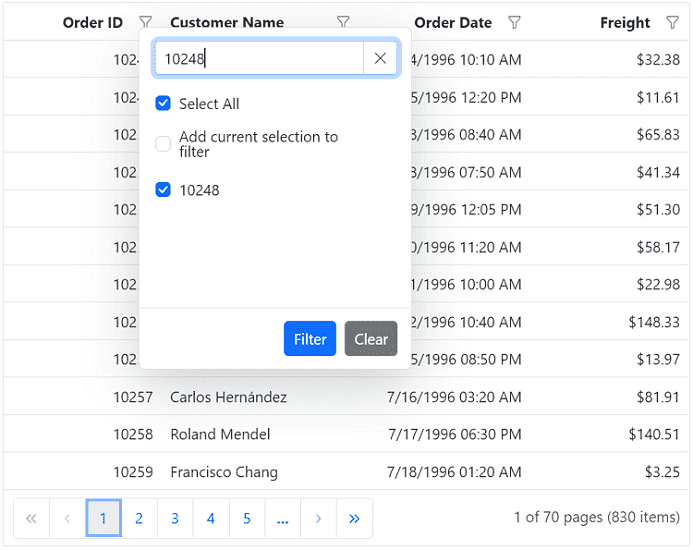

# Excel like filter in React Grid component

The Syncfusion Grid component offers an Excel-like filter feature, providing a familiar and user-friendly interface for filtering data within the grid. This feature simplifies complex filtering operations on specific columns, allowing for quick data location and manipulation, similar to Microsoft Excel. Excel like filtering is especially useful when dealing with large datasets and complex filtering requirements.

Here is an example that showcasing how to render the excel like filter within the Syncfusion React Grid:
















 

>* The Excel-like filter feature supports various filter conditions, including text-based, number-based, date-based, and boolean-based filters.
>* The filter dialog provides additional options, such as sorting filter values, searching for specific values, and clearing applied filters.

## Checkbox filtering

The checkbox filtering feature in Syncfusion React Grid enables you to filter data based on checkbox selections within a column. This powerful filtering option simplifies the process of narrowing down data, providing a more efficient and user-friendly experience. The check box filter feature is particularly useful when dealing with columns containing categorical data.

Here is an example that showcasing how to render the check box filter within the Syncfusion React Grid:
















 

## Customize the filter choice count

By default, the filter choice count is set to 1000, which means that the filter dialog will display a maximum of 1000 distinct values for each column as a checkbox list data. This default value ensures that the filter operation remains efficient, even with large datasets. Additionally, the filter dialog retrieves and displays distinct data from the first 1000 records bind to the Grid to optimize performance, while the remaining records are returned as a result of the search option within the filter dialog.

The Grid component allows you to customize the number of distinct data displayed in the checkbox list of the excel/checkbox type filter dialog. This can be useful when you want to customize the default filter choice count values while using large datasets.

However, you have the flexibility to increase or decrease the filter choice count based on your specific requirements. This can be achieved by adjusting the [filterChoiceCount](https://ej2.syncfusion.com/react/documentation/api/grid/filterSearchBeginEventArgs/#filterchoicecount) value.

The following example demonstrates how to customize the filter choice count in the checkbox list of the filter dialog. In the [actionBegin](https://ej2.syncfusion.com/react/documentation/api/grid/#actionbegin) event, you need to check if the [requestType](https://ej2.syncfusion.com/react/documentation/api/grid/filterEventArgs/#requesttype) is either `filterChoiceRequest` or `filterSearchBegin`, and then you can set the `filterChoiceCount` property to the desired value.
















 

> The specified filter choice count value determines the display of unique items as a checkbox list in the Excel/checkbox type filter dialog. This can result in a delay in rendering these checkbox items when opening the filter dialog. Therefore, it is advisable to set a restricted filter choice count value.

## Add current selection to filter Checkbox/Excel

By default, the CheckBox/Excel filter can only filter the selected items. If filtering is done multiple times on the same column, the previously filtered values in the column will be cleared. Now, it is possible to retain those previous values by using the `Add current selection to filter` CheckBox/Excel filter. This CheckBox/Excel is displayed when data is searched in the search bar of the CheckBox/Excel filter.

The following image describes the above mentioned behavior.



## Show customized text in checkbox list data

The Syncfusion React Grid component provides you with the flexibility to customize the text displayed in the Excel/Checkbox filtering options. This allows you to modify the default text and provide more meaningful and contextual labels for the filtering.

To customize the text in the Excel/Checkbox filter, you can define a `filterItemTemplate` and bind it to the desired column. The `filterItemTemplate` property allows you to create custom templates for filter items. You can use any logic and HTML elements within this template to display the desired text or content.

In the example below, you can see how you can customize the text displayed in the filter checkbox list for the **Delivered** column. This is achieved by defining a `filterItemTemplate` within the **ColumnDirective** element for that specific column. Inside the template, you can use React's template syntax to conditionally display **Delivered** if the data value is true and **Not delivered** if the value is false.
















 

## Show template in checkbox list data

The `filterItemTemplate` property in the Syncfusion React Grid allows you to customize the appearance of filter items in the grid's filter checkbox list for a specific column. This property is useful when you want to provide a custom UI or additional information within the filter checkbox list, such as icons, text, or any HTML elements, alongside the default filter items.

In this example, you can see how to use the `filterItemTemplate` to render icons along with the category names in the filter checkbox list for the **Category Name** column.
















 

## Customize the excel filter dialog using CSS

In the Syncfusion React Grid, you have the flexibility to enhance the visual presentation of the excel filter dialog. This can be achieved by utilizing CSS styles to modify the dialog's appearance according to the specific needs and aesthetics of your application.

**Removing context menu option**

The excel filter dialog includes several features such as **context menu**, **search box**, and **checkbox list** that may not be required in some scenarios. You can remove these options using the **className** attribute in the grid component.

```css
.e-grid .e-excelfilter .e-contextmenu-wrapper 
{
    display: none;
}
```

The following example demonstrates how to remove the context menu option in the excel filter dialog using above mentioned CSS
















 

## Bind custom remote datasource for excel/checkbox filtering

The Syncfusion Grid allows you to dynamically change the filter data source for the Excel or checkbox filter module using custom remote data as well. This can be done by either assigning a custom remote `DataManager` as the `dataSource` or by fetching the data initially and storing it in a global variable. This data can then be bound directly to the filter module's `dataSource` in the [actionBegin](https://ej2.syncfusion.com/react/documentation/api/grid/#actionbegin) event for the `filterBeforeOpen` [requestType](https://ej2.syncfusion.com/react/documentation/api/grid/filterEventArgs/#requesttype), as detailed in our [knowledge base](https://support.syncfusion.com/kb/article/10065/how-to-change-the-data-source-for-checkbox-filter-popup-in-grid).

The following example demonstrates how to dynamically change the remote custom data source for all columns in the Excel or checkbox filter dialog using a `DataManager` with `WebApiAdaptor`.
















 

## Hide sorting option in filter dialog

The Excel-like filter dialog in the Syncfusion React Grid includes built-in sorting options (ascending and descending) by default. To hide these options, set the **display** property of the following CSS classes to **none**, which will prevent the sorting options from appearing in the filter dialog:

```
.e-excel-ascending,
.e-excel-descending,
.e-separator.e-excel-separator {
 display: none;
}
```

Here is a simple example demonstrating how to hide the sorting options in the Excel filter dialog:
















 
 
## Render checkbox list data in on-demand for excel/checkbox filtering

The Excel/Checkbox filter type of Grid has a restriction where only the first 1000 unique sorted items are accessible to view in the filter dialog checkbox list content by scrolling. This limitation is in place to avoid any rendering delays when opening the filter dialog. However, the searching and filtering processes consider all unique items in that particular column.

The Excel/Checkbox filter in the Grid provides an option to load large data sets on-demand during scrolling to improve scrolling limitation functionality. This is achieved by setting the [filterSettings.enableInfiniteScrolling](https://ej2.syncfusion.com/react/documentation/api/grid/filterSettings/#enableinfinitescrolling) property to **true**. This feature proves especially beneficial for managing extensive datasets, enhancing data loading performance in the checkbox list, and allowing interactive checkbox selection with persistence for the selection based on filtering criteria.

The Excel/Checkbox filter retrieves distinct data in ascending order, governed by its [filterSettings.itemsCount](https://ej2.syncfusion.com/react/documentation/api/grid/filterSettings/#itemscount) property, with a default value of **50**. As the checkbox list data scroller reaches its end, the next dataset is fetched and displayed, with the notable advantage that this process only requests new checkbox list data without redundantly fetching the existing loaded dataset.

### Customize the items count for initial rendering

Based on the items count value, the Excel/Checkbox filter gets unique data and displayed in Excel/Checkbox filter content dialog. You can customize the count of on-demand data rendering for Excel/Checkbox filter by adjusting the [filterSettings.itemsCount](https://ej2.syncfusion.com/react/documentation/api/grid/filterSettings/#itemscount) property. The default value is `50`

```ts
grid.filterSettings = { enableInfiniteScrolling = true, itemsCount = 40 };
```

> It is recommended to keep the itemsCount below **300**. Higher values will result in unwanted whitespace because of DOM maintenance performance degradation.

### Customize the loading animation effect

A loading effect is presented to signify that loading is in progress when the checkbox list data scroller reaches the end, and there is a delay in receiving the data response from the server. The loading effect during on-demand data retrieval for Excel/Checkbox filter can be customized using the [filterSettings.loadingIndicator](https://ej2.syncfusion.com/react/documentation/api/grid/filterSettings/#loadingindicator) property. The default value is `Shimmer`.

```ts
grid.filterSettings = { enableInfiniteScrolling = true, loadingIndicator = 'Spinner' };
```

In the provided example, On-Demand Excel filter has been enabled for the React Grid




import { ColumnDirective, ColumnsDirective } from '@syncfusion/ej2-react-grids';
import { Filter, GridComponent, Inject } from '@syncfusion/ej2-react-grids';
import * as React from 'react';
import { Query, DataManager, UrlAdaptor } from '@syncfusion/ej2-data';
function App() {
    const hostUrl = 'https://services.syncfusion.com/react/production/';
    const data = new DataManager({ url: hostUrl + 'api/UrlDataSource', adaptor: new UrlAdaptor });
    const query = new Query().addParams('dataCount', '10000');
    let gridInstance;
    const filterSettings = {
        type: 'Excel', enableInfiniteScrolling: true
    };
    return <GridComponent dataSource={data} query={query} allowSorting={true} allowPaging={true} ref={grid => gridInstance = grid} pageSettings={{ pageSize: 10, pageCount: 5 }} allowFiltering={true} filterSettings={filterSettings}>
    <ColumnsDirective>
        <ColumnDirective field='EmployeeID' headerText='Employee ID' width='120' textAlign='Right'></ColumnDirective>
        <ColumnDirective field='Employees' headerText='Employee Name' width='150'></ColumnDirective>
        <ColumnDirective field='Designation' headerText='Designation' width='130' textAlign='Right'/>
        <ColumnDirective field='CurrentSalary' headerText='CurrentSalary' width='120' format='C2' textAlign='Right'/>
    </ColumnsDirective>
    <Inject services={[Filter, Page, Sort]}/>
</GridComponent>;
}
;
export default App;




import { ColumnDirective, ColumnsDirective, FilterSettingsModel } from '@syncfusion/ej2-react-grids';
import { Filter, GridComponent, Inject, Sort, Page } from '@syncfusion/ej2-react-grids'
import * as React from 'react';
import { Query, DataManager, UrlAdaptor } from '@syncfusion/ej2-data';

function App() {
  const hostUrl: string = 'https://services.syncfusion.com/react/production/';
  const data: DataManager = new DataManager({ url: hostUrl + 'api/UrlDataSource', adaptor: new UrlAdaptor  });
  const query: Query = new Query().addParams('dataCount', '10000');
  let gridInstance: GridComponent;
  const filterSettings: FilterSettingsModel = {
    type: 'Excel', enableInfiniteScrolling: true
  };
  return <GridComponent dataSource={data} query={query} allowSorting={true} allowPaging={true} ref={grid => gridInstance = grid} pageSettings={{ pageSize: 10, pageCount: 5 }} allowFiltering={true} filterSettings={filterSettings}>
    <ColumnsDirective>
      <ColumnDirective field='EmployeeID' headerText='Employee ID' width='120' textAlign='Right'></ColumnDirective>
      <ColumnDirective field='Employees' headerText='Employee Name' width='150'></ColumnDirective>
      <ColumnDirective field='Designation' headerText='Designation' width='130' textAlign='Right' />
      <ColumnDirective field='CurrentSalary' headerText='CurrentSalary' width='120' format='C2' textAlign='Right' />
    </ColumnsDirective>
    <Inject services={[Filter, Page, Sort]} />
  </GridComponent>;
};
export default App;




 

## See also

* [How to perform filter by using Wildcard and LIKE operator filter](./filtering#wildcard-and-like-operator-filter)
* [How to change loading indicator in React Grid](../data-binding/data-binding#loading-animation)