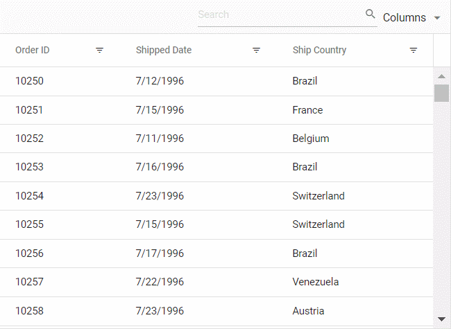

# Filtering in React Grid component

Filtering is a powerful feature in the Syncfusion<sup style="font-size:70%">&reg;</sup> Grid component that enables selective viewing of data based on specific criteria. It allows narrowing down large datasets to focus on relevant information, thereby enhancing data analysis and decision-making.

## Set up filtering

Before using filtering in the grid, understand that the component needs the `Filter module` to unlock all filtering features. 

Inject the [Filter](https://ej2.syncfusion.com/react/documentation/api/grid/filter) module into the Grid component's `Inject` services array to enable filtering.

```jsx
import { Inject, Filter } from '@syncfusion/ej2-react-grids';

<GridComponent>
  <Inject services={[Filter]} />
</GridComponent>
```

## Enable filtering

To enable the filtering functionality in the Grid, set [allowFiltering](https://ej2.syncfusion.com/react/documentation/api/grid#allowfiltering) property to `true`. The [filterSettings](https://ej2.syncfusion.com/react/documentation/api/grid/filterSettings) property configures filtering behavior and criteria.

Here is an example demonstrating the default filtering feature:
















 

> * Apply and clear filtering programmatically using [filterByColumn](https://ej2.syncfusion.com/react/documentation/api/grid/filter#filterbycolumn) and [clearFiltering](https://ej2.syncfusion.com/react/documentation/api/grid/filter#clearfiltering) methods.
> * Disable filtering for a particular column by setting its [allowFiltering](https://ej2.syncfusion.com/react/documentation/api/grid/column#allowfiltering) property to `false`.

## Initial filter

Apply filters automatically when the Grid loads by specifying filter criteria using a predicate object. A predicate object defines the filter condition with three key properties:

* `field`: The column name to filter.
* `operator`: The comparison type (equal, startswith, greaterthan, etc.).
* `value`: The filter criterion to match.

Configure initial filters in [filterSettings.columns](https://ej2.syncfusion.com/react/documentation/api/grid/filterSettingsModel#columns).
















 

### Initial filter with multiple values for same column

Initial filtering with multiple values allows to preset filter conditions for a specific column using multiple criteria. This displays only records matching any of the specified values when the grid first renders.

Set multiple [predicate](https://ej2.syncfusion.com/react/documentation/api/grid/predicate) objects in [filterSettings.columns](https://ej2.syncfusion.com/react/documentation/api/grid/filterSettingsModel#columns) for the same field.

The following example filters the "Customer ID" column to show only specific customer records.
















 

### Initial filter with multiple values for different columns 

Initial filter configuration with multiple values across different columns sets predefined filter criteria for each column. This configuration displays filtered records immediately when the grid loads.

The following example filters both "Order ID" and "Customer ID" columns simultaneously.
















 

## Filter operators

The Grid provides various filter operators to define filter conditions for columns. Define the filter operator using the [operator](https://ej2.syncfusion.com/react/documentation/api/grid/predicateModel#operator) property in [filterSettings.columns](https://ej2.syncfusion.com/react/documentation/api/grid/filterSettings#columns).

The available operators and their supported data types are:

Operator |Description |Supported Types
-----|-----|-----
startsWith |Checks whether a value begins with the specified value. |String
endsWith |Checks whether a value ends with specified value. |String
contains |Checks whether a value contains the specified value. |String
doesnotstartwith |Checks whether the value does not begin with the specified value. |String
doesnotendwith |Checks whether the value does not end with the specified value. |String
doesnotcontain |Checks whether the value does not contain the specified value. |String
equal |Checks whether a value equals the specified value. |String &#124; Number &#124; Boolean &#124; Date
notEqual |Checks whether a value does not equal the specified value. |String &#124; Number &#124; Boolean &#124; Date
greaterThan |Checks whether a value is greater than the specified value. |Number &#124; Date
greaterThanOrEqual|Checks whether a value is greater than or equal to the specified value. |Number &#124; Date
lessThan |Checks whether a value is less than the specified value. |Number &#124; Date
lessThanOrEqual |Checks whether a value is less than or equal to the specified value. |Number &#124; Date
isnull |Returns values that are null. |String &#124; Number &#124; Date
isnotnull |Returns values that are not null. |String &#124; Number &#124; Date
isempty |Returns values that are empty. |String
isnotempty |Returns values that are not empty. |String
between|Filters values within a range between the start and end specified values. |Number &#124; Date
in |Filters multiple records in the same column that exactly match any of the selected values. |String &#124; Number &#124; Date
notin |Filters multiple records in the same column that do not match any of the selected values. |String &#124; Number &#124; Date

> By default, the Grid uses different filter operators for different column types. The default filter operator for string columns is "startswith", for numeric columns is "equal", and for boolean columns is "equal".

## Wildcard and like operator filter

"Wildcard" and "like" operators filter values based on string patterns and apply to string-type columns. They work slightly differently in pattern matching.

### Wildcard filtering

The "Wildcard" filter processes one or more search patterns using the "*" symbol, retrieving values matching the specified patterns. Wildcard characters match any sequence of characters in a search pattern.

**For example:**

Operator |Description
-----|-----
a*b |Everything that starts with "a" and ends with "b".
a* |Everything that starts with "a".
*b |Everything that ends with "b".
*a* |Everything that has an "a" in it.
*a*b* |Everything that has an "a" in it, followed by anything, followed by a "b", followed by anything.



### Like filtering

The "like" filter processes search patterns using the "%" symbol, retrieving values matching the specified patterns. The following Grid features support like filtering on string-type columns:

* Filter Menu
* Filter Bar with the [filterSettings.showFilterBarOperator](https://ej2.syncfusion.com/react/documentation/api/grid/filter#showFilterBarOperator) property enabled
* Custom Filter of Excel filter type

**For example:**

Operator |Description
-----|-----
%ab% |Returns all values containing the "ab" character sequence.
ab% |Returns all values ending with the "ab" character sequence.
%ab |Returns all values starting with the "ab" character sequence.


## Diacritics filter

The diacritics filter feature handles text data that includes accented characters. Diacritics are accent marks added to letters (examples: é, ñ, ü, ç). By default, the grid ignores these characters during filtering.

This feature is essential for international data where names like "José" and "Jose" should be treated differently (or the same, depending on requirements).

Enable diacritic character consideration by setting [filterSettings.ignoreAccent](https://ej2.syncfusion.com/react/documentation/api/grid/filter#filterbycolumn) to `true`.

The following example includes diacritic characters in the filtering process:
















 

## Perform ENUM column filtering

The Grid allows filtering enum-type data using the [filterTemplate](https://ej2.syncfusion.com/react/documentation/api/grid/column#filtertemplate) feature. Enumerated values (enum) are predefined fixed options, such as status categories (Active, Inactive, Pending) or priority levels (High, Medium, Low). This is particularly useful for filtering columns with dropdown-based data.

To filter columns containing enum values, follow the steps below:

1. Render [DropDownList](https://ej2.syncfusion.com/react/documentation/drop-down-list/getting-started) in the `filterTemplate` for the enum-type column.

2. Bind the enumerated list data to the column.

3. Use the [template](https://ej2.syncfusion.com/react/documentation/api/grid/column#template) property in the "Type" column to display enum values in a readable format.

4. In the [change](https://ej2.syncfusion.com/react/documentation/api/drop-down-list#change) event of the `DropDownList`, dynamically filter the column using the [filterByColumn](https://ej2.syncfusion.com/react/documentation/api/grid#filterbycolumn) method.


















## Filtering with case sensitivity

The Grid provides the flexibility to enable or disable case sensitivity during filtering. Control whether filtering operations consider the case of characters using the [enableCaseSensitivity](https://ej2.syncfusion.com/react/documentation/api/grid/filterSettings#enablecasesensitivity) property within [filterSettings](https://ej2.syncfusion.com/react/documentation/api/grid/filterSettings).

Below is an example demonstrating how to toggle case sensitivity.




import { ChangeEventArgs, SwitchComponent } from '@syncfusion/ej2-react-buttons';
import { ColumnDirective, ColumnsDirective, FilterSettingsModel } from '@syncfusion/ej2-react-grids';
import { Filter, GridComponent, Inject } from '@syncfusion/ej2-react-grids'
import * as React from 'react';
import { data } from './datasource';

function App() {
  let grid;
  const filterSettings = { enableCaseSensitivity: false };
  const onToggleCaseSensitive = (args) => {
    if (args.checked) {
      grid.filterSettings.enableCaseSensitivity = true;
    }
    else {
    grid.filterSettings.enableCaseSensitivity = false;
    }
  }
  return (<div>
    <label style={{marginTop:'20px'}}> Enable Case Sensitivity </label>
    <SwitchComponent change={onToggleCaseSensitive}></SwitchComponent>
    <GridComponent ref={g => grid = g} dataSource={data} allowFiltering={true} filterSettings={filterSettings} >
      <ColumnsDirective>
        <ColumnDirective field='OrderID' headerText='Order ID' width='100' textAlign="Right" />
        <ColumnDirective field='CustomerID' headerText='Customer ID' width='100' />
        <ColumnDirective field='ShipCountry' headerText='Ship Country' width='100' />
        <ColumnDirective field='ShipCity' headerText='Ship City' width='100' textAlign="Right" />
        <ColumnDirective field='ShipRegion' headerText='Ship Region' width='100' textAlign="Right" />
      </ColumnsDirective>
      <Inject services={[Filter]} />
    </GridComponent></div>)
};
export default App;




import { ChangeEventArgs, SwitchComponent } from '@syncfusion/ej2-react-buttons';
import { ColumnDirective, ColumnsDirective, FilterSettingsModel } from '@syncfusion/ej2-react-grids';
import { Filter, GridComponent, Inject } from '@syncfusion/ej2-react-grids'
import * as React from 'react';
import { data } from './datasource';

function App() {
  let grid: GridComponent | null;
  const filterSettings: FilterSettingsModel = { enableCaseSensitivity: false };
  const onToggleCaseSensitive = (args: ChangeEventArgs) => {
    if (args.checked) {
      (grid as GridComponent).filterSettings.enableCaseSensitivity = true;
    }
    else {
      (grid as GridComponent).filterSettings.enableCaseSensitivity = false;
    }
  }
  return (<div>
    <label style={{marginTop:'20px'}}> Enable Case Sensitivity </label>
    <SwitchComponent change={onToggleCaseSensitive}></SwitchComponent>
    <GridComponent ref={g => grid = g} dataSource={data} allowFiltering={true} filterSettings={filterSettings} >
      <ColumnsDirective>
        <ColumnDirective field='OrderID' headerText='Order ID' width='100' textAlign="Right" />
        <ColumnDirective field='CustomerID' headerText='Customer ID' width='100' />
        <ColumnDirective field='ShipCountry' headerText='Ship Country' width='100' />
        <ColumnDirective field='ShipCity' headerText='Ship City' width='100' textAlign="Right" />
        <ColumnDirective field='ShipRegion' headerText='Ship Region' width='100' textAlign="Right" />
      </ColumnsDirective>
      <Inject services={[Filter]} />
    </GridComponent></div>)
};
export default App;










 

## Enable different filter for a column

The Grid offers flexibility to customize filtering behavior for different columns by enabling various filter types such as `Menu`, `Excel`, or `CheckBox`. This allows tailoring the filtering experience to suit specific column needs. For example, use a menu-based filter for a category column, an Excel-like filter for a date column, and a checkbox filter for a status column.

Adjust the [filter.type](https://ej2.syncfusion.com/react/documentation/api/grid/column#filter) property based on requirements.

Here's an example where the menu filter is enabled by default, but filter types can be dynamically modified through a dropdown.
















 

## Change default filter operator for particular column

The Grid provides flexibility to change the default filter operator for a particular column. By default, the filter operator for string columns is `startswith`, for numeric columns is `equal`, and for boolean columns is `equal`. Customize the filter operator to better match the nature of the data using the "operator" property within [filterSettings](https://ej2.syncfusion.com/react/documentation/api/grid#filtersettings).
















 

## Programmatic filtering

Programmatic filtering allows applying filters to specific columns without relying on user interface interactions. This is achieved using the [filterByColumn](https://ej2.syncfusion.com/react/documentation/api/grid#filterbycolumn) method.

The following example demonstrates programmatic filtering using single and multiple values for the "Order ID" and "Customer ID" columns. The `filterByColumn` method is called within an external button click function.
















 

## How to get filtered records

Retrieving filtered records is essential when working with data matching currently applied filters. Achieve this using available methods and properties in the Grid component.

**1. Using the getFilteredRecords() method**

The [getFilteredRecords](https://ej2.syncfusion.com/react/documentation/api/grid#getfilteredrecords) method retrieves an array of records matching currently applied filters.





import { ButtonComponent } from '@syncfusion/ej2-react-buttons';
import { ColumnDirective, ColumnsDirective } from '@syncfusion/ej2-react-grids';
import { Filter, GridComponent, Inject, Page, PageSettingsModel } from '@syncfusion/ej2-react-grids'
import { MessageComponent } from '@syncfusion/ej2-react-notifications';
import React, { useState } from 'react';
import { data } from './datasource';
function App() {
  let grid;
  let filteredGrid;
  const pageSettings = { pageSize: 10, pageCount: 5 };
  let filteredData;
  let showRecords;
  let showWarning;
  const [isFilteredGridVisible, setIsFilteredGridVisible] = useState(false);
  const [isMsgWarningVisible, setIsMsgWarningVisible] = useState(false);
  const getFilter = () => {
    filteredData = grid.getFilteredRecords();
    showRecords = filteredData.length > 0 ? true : false;
    showWarning = !showRecords;
    if (showRecords) {
      filteredGrid.dataSource = filteredData;
    }
    setIsMsgWarningVisible(showWarning);
    setIsFilteredGridVisible(showRecords);
  }
  const clear = () => {
    grid.clearFiltering();
    showRecords = false;
    showWarning = false;
    setIsMsgWarningVisible(false);
    setIsFilteredGridVisible(false);
  }
  return (<div><div id='msgWarning' style={{ display: isMsgWarningVisible ? 'block' : 'none' }}>
    <MessageComponent content="No Records" cssClass="e-content-center" severity="Warning"></MessageComponent></div>
    <ButtonComponent cssClass="e-success" onClick={getFilter}>Get Filtered Data</ButtonComponent>
    <ButtonComponent cssClass='e-danger' onClick={clear}>Clear</ButtonComponent>
    <GridComponent ref={g => grid = g} dataSource={data} allowFiltering={true} pageSettings={pageSettings} allowPaging={true}>
      <ColumnsDirective>
        <ColumnDirective field='OrderID' headerText='Order ID' width='100' textAlign="Right" />
        <ColumnDirective field='CustomerID' headerText='Customer ID' width='100' />
        <ColumnDirective field='Freight' headerText='Freight' format='C' width='100' textAlign="Right" />
        <ColumnDirective field='ShipCountry' headerText='Ship Country' width='100' />
        <ColumnDirective field='ShipCity' headerText='Ship City' width='100' textAlign="Right" />
      </ColumnsDirective>
      <Inject services={[Filter, Page]} />
    </GridComponent>
    <div id='filteredGrid' style={{ display: isFilteredGridVisible ? 'block' : 'none' }}>
      <h3>Filtered Records</h3>
      <GridComponent ref={fg => filteredGrid = fg} allowPaging={true}>
        <ColumnsDirective>
          <ColumnDirective field='OrderID' headerText='Order ID' width='100' textAlign="Right" />
          <ColumnDirective field='CustomerID' headerText='Customer ID' width='100' />
          <ColumnDirective field='Freight' headerText='Freight' format='C' width='100' textAlign="Right" />
          <ColumnDirective field='ShipCountry' headerText='Ship Country' width='100' />
          <ColumnDirective field='ShipCity' headerText='Ship City' width='100' textAlign="Right" />
        </ColumnsDirective>
        <Inject services={[Page]} />
      </GridComponent>
    </div></div>)
}
export default App;





import { ButtonComponent } from '@syncfusion/ej2-react-buttons';
import { ColumnDirective, ColumnsDirective } from '@syncfusion/ej2-react-grids';
import { Filter, GridComponent, Inject, Page, PageSettingsModel } from '@syncfusion/ej2-react-grids'
import { MessageComponent } from '@syncfusion/ej2-react-notifications';
import React, { useState } from 'react';
import { data } from './datasource';
function App() {
  let grid: GridComponent | null;
  let filteredGrid: GridComponent | null;
  const pageSettings: PageSettingsModel = { pageSize: 10, pageCount: 5 };
  let filteredData;
  let showRecords;
  let showWarning;
  const [isFilteredGridVisible, setIsFilteredGridVisible] = useState(false);
  const [isMsgWarningVisible, setIsMsgWarningVisible] = useState(false);
  const getFilter = () => {
    filteredData = (grid as GridComponent).getFilteredRecords();
    showRecords = filteredData.length > 0 ? true : false;
    showWarning = !showRecords;
    if (showRecords) {
      (filteredGrid as GridComponent).dataSource = filteredData;
    }
    setIsMsgWarningVisible(showWarning);
    setIsFilteredGridVisible(showRecords);
  }
  const clear = () => {
    (grid as GridComponent).clearFiltering();
    showRecords = false;
    showWarning = false;
    setIsMsgWarningVisible(false);
    setIsFilteredGridVisible(false);
  }
  return (<div><div id='msgWarning' style={{ display: isMsgWarningVisible ? 'block' : 'none' }}>
    <MessageComponent content="No Records" cssClass="e-content-center" severity="Warning"></MessageComponent></div>
    <ButtonComponent cssClass="e-success" onClick={getFilter}>Get Filtered Data</ButtonComponent>
    <ButtonComponent cssClass='e-danger' onClick={clear}>Clear</ButtonComponent>
    <GridComponent ref={g => grid = g} dataSource={data} allowFiltering={true} pageSettings={pageSettings} allowPaging={true}>
      <ColumnsDirective>
        <ColumnDirective field='OrderID' headerText='Order ID' width='100' textAlign="Right" />
        <ColumnDirective field='CustomerID' headerText='Customer ID' width='100' />
        <ColumnDirective field='Freight' headerText='Freight' format='C' width='100' textAlign="Right" />
        <ColumnDirective field='ShipCountry' headerText='Ship Country' width='100' />
        <ColumnDirective field='ShipCity' headerText='Ship City' width='100' textAlign="Right" />
      </ColumnsDirective>
      <Inject services={[Filter, Page]} />
    </GridComponent>
    <div id='filteredGrid' style={{ display: isFilteredGridVisible ? 'block' : 'none' }}>
      <h3>Filtered Records</h3>
      <GridComponent ref={fg => filteredGrid = fg} allowPaging={true}>
        <ColumnsDirective>
          <ColumnDirective field='OrderID' headerText='Order ID' width='100' textAlign="Right" />
          <ColumnDirective field='CustomerID' headerText='Customer ID' width='100' />
          <ColumnDirective field='Freight' headerText='Freight' format='C' width='100' textAlign="Right" />
          <ColumnDirective field='ShipCountry' headerText='Ship Country' width='100' />
          <ColumnDirective field='ShipCity' headerText='Ship City' width='100' textAlign="Right" />
        </ColumnsDirective>
        <Inject services={[Page]} />
      </GridComponent>
    </div></div>)
}
export default App;










 

**2. Using the properties in the FilterEventArgs object**

Alternatively, use properties available in the [FilterEventArgs](https://ej2.syncfusion.com/react/documentation/api/grid/filterEventArgs) object to obtain filter record details.

* [columns](https://ej2.syncfusion.com/react/documentation/api/grid/filterEventArgs#columns): Returns the collection of filtered columns.

* [currentFilterObject](https://ej2.syncfusion.com/react/documentation/api/grid/filterEventArgs#currentfilterobject): Returns the object currently filtered.

* [currentFilteringColumn](https://ej2.syncfusion.com/react/documentation/api/grid/filterEventArgs#currentfilteringcolumn): Returns the column name currently filtered.

Access these properties using the [actionComplete](https://ej2.syncfusion.com/react/documentation/api/grid#actioncomplete) event handler:

```typescript
actionComplete(args: FilterEventArgs) {
    let column = args.columns;
    let object = args.currentFilterObject;
    let name = args.currentFilteringColumn;
}
```

## Clear filtering using methods

The Grid provides a [clearFiltering](https://ej2.syncfusion.com/react/documentation/api/grid#clearfiltering) method to clear applied filtering. This method removes filter conditions and resets the grid to its original state.
















 

## Filtering events

Filtering events allow customizing the behavior of the grid when filtering is applied. Prevent filtering for specific columns, show messages, or perform other actions to suit application needs.

Implement filtering events using available events such as [actionBegin](https://ej2.syncfusion.com/react/documentation/api/grid#actionbegin) and [actionComplete](https://ej2.syncfusion.com/react/documentation/api/grid#actioncomplete). These events allow intervention in the filtering process and customization as needed.

In the given example, filtering is prevented for the "Ship City" column during the `actionBegin` event.
















 

## See also

* [Hide sorting options on Excel filter dialog](./excel-like-filter#hide-sorting-option-in-filter-dialog)
* [How to change loading indicator in React Grid](../data-binding/data-binding#loading-animation)
