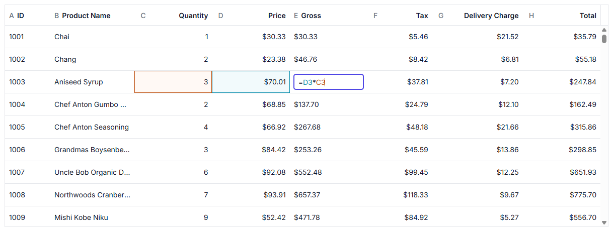
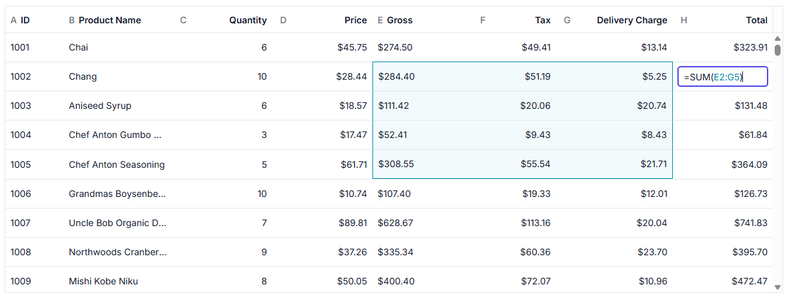

# Formula Cells in React Data Grid

Formula cells in the Syncfusion React Data Grid enable spreadsheet-like calculations directly within grid cells. Configure formulas to automatically compute values based on data from other cells and update results as underlying data changes.

## Enable formula

Formula support is enabled by setting the [allowFormula](https://ej2.syncfusion.com/react/documentation/api/grid/column#allowFormula) property at the column level. When `allowFormula` is enabled, the data source must include the formula definition for the corresponding column. The Data Grid evaluates the formula and automatically updates the calculated value when dependent data changes.

To use formula functionality, inject the [Formula](https://ej2.syncfusion.com/react/documentation/api/grid/formula) module into the **Grid**.

**For example:**

```ts
let productData: Object[] = [
  { 
    Id: 1, Product: "Chai", Category: "Beverages", Price: 45.25, Quantity: 4,
    GrossAmount: '=REF(COLUMN("Price"),ROW(1))*REF(COLUMN("Quantity"),ROW(1))',
    TaxAmount: '=REF(COLUMN("GrossAmount"),ROW(1))*0.7',
    TotalAmount: '=REF(COLUMN("GrossAmount"),ROW(1))+REF(COLUMN("TaxAmount"),ROW(1))' 
  },
  {
    Id: 2, Product: "Chang", Category: "Beverages", Price: 22.75, Quantity: 6, 
    GrossAmount: '=REF(COLUMN("Price"),ROW(2))*REF(COLUMN("Quantity"),ROW(2))',
    TaxAmount: '=REF(COLUMN("GrossAmount"),ROW(2))*0.7',
    TotalAmount: '=REF(COLUMN("GrossAmount"),ROW(2))+REF(COLUMN("TaxAmount"),ROW(2))'
  }
];
```

In this demo, formulas are applied to the "GrossAmount", "TaxAmount", and "TotalAmount" columns, allowing values to be computed and updated automatically based on the defined expressions in the datasource.
















 

### Formula settings

The `formulaSettings` configuration includes the following options:

- `allowBuiltInFunctions`: Controls whether built-in spreadsheet functions are available for formula evaluation. Set this to `true` to enable functions like `SUM`, `AVERAGE`, `MIN`, `MAX`, `IF`, `CONCAT`, and `LEN`. Set it to `false` to disable the built-in function library and allow only formula operators, references, and custom functions that are registered in the Grid.
- `calculationMode`: Accepts `Automatic` or `Manual`.
- `customFunctions`: Registers custom formula functions for business-specific logic.

When `calculationMode` is set to `Automatic`, the Grid recalculates dependent formula cells as soon as a referenced value changes. When it is set to `Manual`, call `refreshFormulas()` after updating the data.

## Formula syntax

Formulas are text values that begin with `=` and can include references, functions, operators, and constants. This follows spreadsheet-style rules and is evaluated by the Grid formula engine.

- The `=` sign tells the Grid that the cell contains a formula.
- Constants can be numbers such as `3.14` and `-7`, text such as `"High"`, or logical values such as `TRUE` and `FALSE`.
- Standard operator rules are used. You can add parentheses to control the order of calculation when needed.

### Cell references

Formula expressions use spreadsheet-style cell references to access values from other cells. Each reference combines a column label and row number, such as "A1", "A3", "B1", "C3", "AA10", and "AB20".

Relative references change when the Grid data changes, while absolute references stay fixed by using `$`.

- `=$A$1` locks both the column and the row.
- `=A$1` locks the row only.
- `=$A1` locks the column only.

```ts
=B2+C2
=C2*D2
=IF(C2>100, "High", "Low")
```

The Grid also supports absolute references when you want a formula to stay attached to a specific cell or row.

```ts
=$B$2+$C$2
=$A$1*10
```



### Cell ranges

Cell ranges represent a contiguous block of cells and are specified using the top-left and bottom-right cell references separated by a colon (:). For example, "A1:B2" refers to all cells within the range from "A1" to "B2", including both boundary cells.

```ts
=SUM(B2:B10)
=AVERAGE(C2:C10)
=MAX(D2:D25)
```



### Built-in functions

Formulas support built-in functions for performing calculations and data operations. Common functions include `SUM`, `PRODUCT`, `AVERAGE`, `MIN`, `MAX`, `COUNT`, and `CONCAT`. Functions can accept individual cell references, ranges, or constant values as arguments to generate calculated results.

The following example shows a formula-enabled column that calculates the product of the price and quantity using the built-in `PRODUCT` function. This formula multiplies the values in the selected cells and updates the result automatically whenever either referenced value changes.
















 

## See also

- [Formula reference](./formula-reference)
- [Formula Editor](./formula-editor)
- [Custom formula functions](./custom-formula)
- [Editing](../editing/cell-editing)
