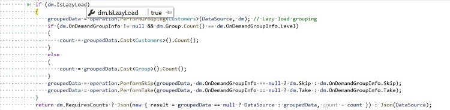
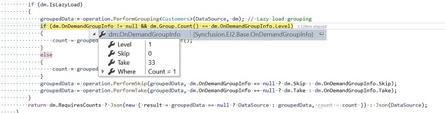

# Lazy Load Grouping in React Grid Component

Lazy loading in React refers to dynamically loading data as needed, rather than all at once, to enhance application performance by minimizing initial load time.

The Syncfusion<sup style="font-size:70%">&reg;</sup> React Grid supports lazy load grouping, which optimizes the rendering of large datasets by loading only the required grouped data on demand. Initially, only the top-level group caption rows are rendered in a collapsed state. Child rows are fetched and displayed dynamically when a group is expanded.

To enable this feature, set the [groupSettings.enableLazyLoading](https://ej2.syncfusion.com/react/documentation/api/grid/groupSettings#enableLazyLoading) property to `true`. The following example demonstrates how to configure lazy load grouping using the `groupSettings.enableLazyLoading` property.


















## Handling the lazy load grouping at server-side

When using the lazy load grouping feature of the Grid, the [UrlAdaptor](https://ej2.syncfusion.com/react/documentation/data/adaptors#url-adaptor) of `DataManager` is used to handle server-side operations, including lazy load grouping. Along with the default server request, this feature will additionally send the following details to handle the lazy load grouping:

Property Name |Description
-----|-----
`isLazyLoad` |Differentiates between default grouping and lazy load grouping. This property is enabled when performing lazy load.
`onDemandGroupInfo` |Contains the details of expanded caption row grouping `level`, `skip`, `take` and `filter` query of the child records

On the server side, these parameters can be accessed through the `DataManagerRequest` model to handle data retrieval based on the expanded group context.  Refer to the screenshots below for illustration.





The following code example demonstrates how to handle lazy load grouping on the server along with other grid actions.

```typescript
public IActionResult UrlDatasource([FromBody] DataManagerRequest dm)
{
    IEnumerable groupedData = null;
    IEnumerable<Customers> DataSource = customers;
    DataOperations operation = new DataOperations();

    if (dm.Search != null && dm.Search.Count > 0)
    {
        DataSource = operation.PerformSearching(DataSource, dm.Search);  // Handling search operation.
    }
    if (dm.Where != null && dm.Where.Count > 0) // Handling filtering operation.
    {
        DataSource = operation.PerformFiltering(DataSource, dm.Where, dm.Where[0].Operator);
    }
    int count = DataSource.Cast<Customers>().Count();
    if (dm.IsLazyLoad == false && dm.Sorted != null && dm.Sorted.Count > 0) // Handling sorting opertaion for grouping.
    {
        DataSource = operation.PerformSorting(DataSource, dm.Sorted);
    }   
    if (dm.IsLazyLoad == false && dm.Skip != 0)
    {
        DataSource = operation.PerformSkip(DataSource, dm.Skip); // Handling paging operation.
    }
    if (dm.IsLazyLoad == false && dm.Take != 0)
    {
        DataSource = operation.PerformTake(DataSource, dm.Take);
    }
    if (dm.IsLazyLoad)
    {
        groupedData = operation.PerformGrouping<Customers>(DataSource, dm); // Lazy load grouping.
        groupedData = operation.PerformSorting(groupedData, dm); // Sorting with lazy load grouping.
        if (dm.OnDemandGroupInfo != null && dm.Group.Count() == dm.OnDemandGroupInfo.Level)
        {
            count = groupedData.Cast<Customers>().Count();
        }
        else
        {
            count = groupedData.Cast<Group>().Count();
        }
        groupedData = operation.PerformSkip(groupedData, dm.OnDemandGroupInfo == null ? dm.Skip : dm.OnDemandGroupInfo.Skip);
        groupedData = operation.PerformTake(groupedData, dm.OnDemandGroupInfo == null ? dm.Take : dm.OnDemandGroupInfo.Take);
    }
    return dm.RequiresCounts ? Json(new { 
        result = groupedData == null ? DataSource : groupedData, 
        count = count 
    }) : Json(DataSource);
}
```

> For optimal performance, especially when dealing with lazy loading grouping, it is recommended to perform sorting after the grouping action.

## Lazy load grouping with infinite scrolling

Lazy load grouping with infinite scrolling is especially useful when presenting grouped data from large datasets. It allows data to be loaded on demand as users interact with the interface, ensuring efficient handling of records. This approach improves performance, maintains responsiveness, and provides a seamless experience while managing and displaying extensive grouped data.

**How it works**

1. Initially, only top-level group caption rows are rendered in a collapsed state.

2. Child rows are fetched and displayed dynamically when a group caption is expanded.

3. Infinite scrolling loads additional data as the scrollbar reaches the end, maintaining seamless navigation.

To enable this feature, set both [groupSettings.enableLazyLoading](https://ej2.syncfusion.com/react/documentation/api/grid/groupSettings#enableLazyLoading) and [enableInfiniteScrolling](https://ej2.syncfusion.com/react/documentation/api/grid#enableinfinitescrolling) properties to `true`. The following example demonstrates how to configure lazy load grouping with infinite scrolling using these properties.


















> * The [enableInfiniteScrolling](https://ej2.syncfusion.com/react/documentation/api/grid#enableinfinitescrolling) property is optional and can be set to `true` or `false` based on the requirement.
> * When enabling the `enableInfiniteScrolling` feature, it is necessary to define the [height](https://ej2.syncfusion.com/react/documentation/api/grid#height) property.

## Lazy load grouping with virtual scrolling

The Grid supports lazy load grouping with virtual scrolling to efficiently manage and display large grouped datasets. This feature improves performance, reduces initial load time, and ensures a responsive data presentation experience.

**How it works**

1. Initially, only top-level group caption rows are rendered in a collapsed state.

2. Child rows are loaded and displayed dynamically when a group is expanded.

3. Virtual scrolling loads a buffered subset of records as needed, optimizing data rendering and memory usage.

To enable this feature, set both [groupSettings.enableLazyLoading](https://ej2.syncfusion.com/react/documentation/api/grid/groupSettings#enableLazyLoading) and [enableVirtualization](https://ej2.syncfusion.com/react/documentation/api/grid#enablevirtualization) properties to `true`. The following example demonstrates how to configure lazy load grouping with virtual scrolling using these properties.


















> When using the `enableVirtualization` feature, it is necessary to define the [height](https://ej2.syncfusion.com/react/documentation/api/grid#height) property.

## Limitations for lazy load grouping

* Due to the element height limitation in browsers, the maximum number of records loaded by the grid is limited due to the browser capability.
* Lazy load grouping is supported only with the [UrlAdaptor](https://ej2.syncfusion.com/react/documentation/data/adaptors#url-adaptor) and [JsonAdaptor](https://ej2.syncfusion.com/react/documentation/data/adaptors#json-adaptor) adaptors.
* Lazy load grouping is not compatible with the following features
    * Batch editing
    * Row template
    * Print
    * Row drag and drop in collapsed group
    * ExpandAll method   
    * Column virtualization
    * Hierarchical Grid
    * Detail Template
    * Row and Cell Spanning  
* Programmatic selection is not supported in lazy load grouping.
* Drag selection, cell selection (box and flow), and row Selection is not working in collapsed state.
* Clipboard is not supported when groups are in collapsed state.