# Hierarchy Grid in React Grid Component

The Hierarchy Grid in the Syncfusion<sup style="font-size:70%">&reg;</sup> React Grid is designed to display hierarchical or nested data structures within a tabular layout. It enables the representation of parent-child relationships by allowing rows to be expanded or collapsed, revealing related child records beneath their corresponding parent rows.

This structure enhances data readability and navigation, especially when working with datasets that include multiple levels of related information. Each parent row can be expanded to display its associated child grid, which can itself be configured with columns, templates, and features similar to the main grid.

To enable the Hierarchy Grid feature:

1. The Hierarchy Grid feature is enabled by importing the `DetailRow` module from `@syncfusion/ej2-react-grids` and injecting the `DetailRow` service into the grid.

    ```js
    import { GridComponent, Inject, DetailRow } from '@syncfusion/ej2-react-grids';

    <GridComponent>
    <Inject services={[DetailRow]} />
    </GridComponent>
    ```

2. Define the [childGrid](https://ej2.syncfusion.com/react/documentation/api/grid#childgrid) property in the Grid configuration. This property contains the settings for the child Grid, such as its columns and data source.

3. Set the [childGrid.queryString](https://ej2.syncfusion.com/react/documentation/api/grid#querystring) property to link the parent and child records using a common field. This defines how child data is retrieved based on the parent row.

The following example demonstrates how to enable the hierarchy feature in grid, which is useful for displaying structured data in a clean and interactive way, allowing better organization and navigation.


















> * The Grid supports n level of child grids.
> * Hierarchical binding is not supported when [DetailTemplate](https://ej2.syncfusion.com/react/documentation/api/grid#detailtemplate) is enabled.

## Mapping Parent-Child Grids with different field names
By default, the Grid uses the same field name in both the parent and child grids to establish a hierarchical relationship through the [queryString](https://ej2.syncfusion.com/react/documentation/api/grid#querystring) property. However, it also supports scenarios where the parent and child data sources use different key fields.

When the parent and child data sources use different key fields, this relationship can still be configured by handling the child grid's [load](https://ej2.syncfusion.com/react/documentation/api/grid#load) event. In this event, the required value (e.g., Employee ID) can be retrieved from `parentDetails.parentRowData` and dynamically assigned to the appropriate field in the child grid's query. This approach enables flexible hierarchical binding even when the key fields differ between parent and child grids.

In the following example, the `load` event is used to customize the mapping value for the child grid. The `parentDetails` property provides access to the parent row's data, including the `parentKeyFieldValue`, which can be used to set the appropriate mapping field. By referencing the "Employee ID" field from the `parentRowData`, the corresponding value is extracted and applied to construct the query for the child grid.


















> Make sure to adjust the field name according to the specific scenario.

## Render aggregates in child grid

The Grid supports displaying aggregate values such as sum, count, and maximum in the footer, group footer, and group caption of child grids. This functionality is especially useful in hierarchical grids where each child grid presents detailed data that benefits from summarized insights.

The Aggregates feature enables calculations on specific columns and displays the results directly within the child grid. Rendering aggregates in this context involves showing summary data such as totals or maximum values at the footer or group caption level, enhancing the clarity and usefulness of nested data.

In the example below, the child grid is configured to display the sum and maximum values of the "Freight" column using the `aggregates` property:


















## Expand child grid initially

Child rows in a hierarchical grid can be expanded automatically during the initial load by calling the [expand](https://ej2.syncfusion.com/react/documentation/api/grid/detailRow#expand) method within the grid's [dataBound](https://ej2.syncfusion.com/react/documentation/api/grid#databound) event. This ensures that nested data becomes visible when the grid is rendered, without requiring manual interaction.

In the following example, the third record is expanded on load by using the `expand` method inside the `dataBound` event.


















> Index values begin with "0", allowing provision of the desired target index to expand a specific child grid initially.

## Dynamically load child grid data

Dynamically loading child grid data improves performance, optimizes data transmission, and enhances the experience by providing on-demand access to relevant information. Additionally, it offers flexibility in data presentation, improving overall application efficiency.

To achieve this, use the [load](https://ej2.syncfusion.com/react/documentation/api/grid#load) event of the parent grid. This event allows assigning the `dataSource` for the child grid dynamically based on the parent row's data. The following example demonstrates how to dynamically load child grid data using the `load` event.


















## Dynamic data binding in Child Grids using parent row values

A child grid can be bound dynamically to display data that corresponds to its parent row. Instead of relying on the `queryString` property, this can be handled through the  [detailDataBound](https://ej2.syncfusion.com/react/documentation/api/grid#detaildatabound) event, which is triggered whenever a child grid expands.

Within the `detailDataBound` event, the child grid’s [dataSource](https://ej2.syncfusion.com/react/documentation/api/grid/index-default#datasource) is filtered based on the parent row’s "Employee ID". The `DataManager` is used to apply the filter, and the filtered result is then assigned to the child grid’s `dataSource`. This ensures that each child grid shows only the records related to its parent, creating a contextual and flexible hierarchical display.


















## Adding record in child grid

Adding a record to a child grid allows additional data to be maintained for the corresponding parent row. To preserve the parent–child relationship, the appropriate `queryString` value must be included in the new record.

This is accomplished through the grid's [actionBegin](https://ej2.syncfusion.com/react/documentation/api/grid#actionbegin) event. In the example, the parent and child grids are related by "Employee ID", so the child record's "Employee ID" is assigned the parent row's `queryString` value using the `actionBegin` event to ensure relational consistency.


















## Template column in child grid

A template column in a child grid allows customization of cell content, enabling the display of interactive elements, formatted values, or complex layouts within specific columns.

This is achieved using the [template](https://ej2.syncfusion.com/react/documentation/api/grid/column#template) property of the column. In the example below, a custom image is rendered in the "Employee Image" column of the child grid using the `template` property.


















## Getting parent details in the child grid

Accessing parent row details within a child grid enables contextual data presentation and supports scenarios where parent information is required for calculations or conditional rendering.

This can be accomplished through the grid's [created](https://ej2.syncfusion.com/react/documentation/api/grid#created) event, which is triggered when the child grid is initialized. Within this event, parent row data can be obtained using `this.parentDetails.parentRowData`. The example below demonstrates how parent details can be accessed and utilized in the child grid.




import { ColumnDirective, ColumnsDirective, GridComponent } from '@syncfusion/ej2-react-grids';
import { DetailRow, Edit, Inject, Toolbar } from '@syncfusion/ej2-react-grids';
import * as React from 'react';
import { data, employeeData } from './datasource';


function App() {
    let childGridOptions = {
        created() {
            var parentRowData = this.parentDetails.parentRowData;
            document.getElementById('message').innerHTML = `EmployeeID: ${parentRowData.EmployeeID}, FirstName: ${parentRowData.FirstName}, Title: ${parentRowData.Title}`;
        },
        columns: [
            { field: 'OrderID', headerText: 'Order ID', isPrimaryKey: true, textAlign: 'Right', width: 120 },
            { field: 'EmployeeID', headerText: 'Employee ID', textAlign: 'Right', allowEditing: false, width: 120 },
            { field: 'ShipCity', headerText: 'Ship City', width: 150 },
            { field: 'ShipName', headerText: 'Ship Name', width: 150 }
        ],
        dataSource: data,
        queryString: 'EmployeeID',
    };
    return (<div>
        <div style={{ marginLeft: "100px" }}>
        <p style={{ color: "black", fontSize: "large" }} id="message"></p>
        </div>
        <GridComponent dataSource={employeeData} childGrid={childGridOptions} height={315}>
            <ColumnsDirective>
                <ColumnDirective field='EmployeeID' headerText='Employee ID' width='120' textAlign="Right" />
                <ColumnDirective field='FirstName' headerText='First Name' width='150' />
                <ColumnDirective field='City' headerText='City' width='150' />
                <ColumnDirective field='Country' headerText='Country' width='150' />
            </ColumnsDirective>
            <Inject services={[DetailRow, Edit, Toolbar]} />
        </GridComponent ></div>
    )
};
export default App;




import { ColumnDirective, ColumnsDirective, GridComponent, ParentDetails } from '@syncfusion/ej2-react-grids';
import { DetailRow, Edit, GridModel, Inject, Toolbar } from '@syncfusion/ej2-react-grids';
import * as React from 'react';
import { data, employeeData, ParentDetailsDataType } from './datasource';

function App() {
    let childGridOptions: GridModel = {
        created() {
            var parentRowData = (this.parentDetails as ParentDetails).parentRowData;
            (document.getElementById('message') as HTMLElement).innerHTML = `EmployeeID: ${(parentRowData as ParentDetailsDataType).EmployeeID}, FirstName: ${(parentRowData as ParentDetailsDataType).FirstName}, Title: ${(parentRowData as ParentDetailsDataType).Title}`;
        },
        columns: [
            { field: 'OrderID', headerText: 'Order ID', isPrimaryKey: true, textAlign: 'Right', width: 120 },
            { field: 'EmployeeID', headerText: 'Employee ID', textAlign: 'Right', allowEditing: false, width: 120 },
            { field: 'ShipCity', headerText: 'Ship City', width: 150 },
            { field: 'ShipName', headerText: 'Ship Name', width: 150 }
        ],
        dataSource: data,
        queryString: 'EmployeeID',
    };
    return (<div>
        <div style={{ marginLeft: "100px" }}>
        <p style={{ color: "black", fontSize: "large" }} id="message"></p>
        </div>
        <GridComponent dataSource={employeeData} childGrid={childGridOptions} height={315}>
            <ColumnsDirective>
                <ColumnDirective field='EmployeeID' headerText='Employee ID' width='120' textAlign="Right" />
                <ColumnDirective field='FirstName' headerText='First Name' width='150' />
                <ColumnDirective field='City' headerText='City' width='150' />
                <ColumnDirective field='Country' headerText='Country' width='150' />
            </ColumnsDirective>
            <Inject services={[DetailRow, Edit, Toolbar]} />
        </GridComponent ></div>
    )
};
export default App;












## Expand and collapse all child grids dynamically

The Hierarchy Grid in the Data Grid component supports expanding all child grid rows through an external button, providing a comprehensive view of hierarchical data without requiring manual interaction.

By default, all child grids are rendered in a collapsed state. To programmatically expand or collapse all child rows, use the [expandAll](https://ej2.syncfusion.com/react/documentation/api/grid/detailRow#expandall) and [collapseAll](https://ej2.syncfusion.com/react/documentation/api/grid/detailRow#collapseall) methods provided by the `DetailRow` module. The following example demonstrates how these methods can be triggered via external button clicks.


















> The `expandAll` and `collapseAll` methods are not recommended for large datasets due to the considerable time it takes to update the changes in the UI.

## Hide the expand/collapse icon in parent row when no record in child grid

The Data Grid supports hiding the expand/collapse icon in parent rows when there are no child records, providing a cleaner and more intuitive interface.

To achieve this, the [rowDataBound](https://ej2.syncfusion.com/react/documentation/api/grid#rowdatabound) event can be utilized to hide the icon when there are no records in the child grid.

To hide the expand/collapse icon in parent row when no records in child grid, follow the given steps:

1. Create a CSS class with custom style: Define a CSS class to override the default appearance of the expand/collapse cell. This style is used to adjust the look of the parent row when selected or hovered.

```css
    .e-row[aria-selected="true"] .e-customizedexpandcell {
        background-color: #e0e0e0;
    }

    .e-grid.e-gridhover tr[role='row']:hover {
        background-color: #eee;
    }
```

2. Implement the `rowDataBound` event handler: The `rowDataBound` event is triggered for each row as data is bound. In this event, verify whether the parent row has any corresponding child records. If no child records are found, clear the cell containing the expand/collapse icon and apply the custom CSS class.

```typescript
    const rowDataBound = (args: RowDataBoundEventArgs) => {
        const parentData: number = (args.data as Employee)['EmployeeID'];
        const childrecord: object[] = new DataManager(childData as JSON[]).
            executeLocal(new Query().where('EmployeeID', 'equal', parentData, true));
        if (childrecord.length === 0) {
            // Here hide icon of parent row which has no child records.
            const rowElement = args.row as HTMLTableRowElement;
            const cellElement= rowElement.querySelector('td') as HTMLTableCellElement
            cellElement.innerHTML = ' '; 
            cellElement.className = 'e-customizedexpandcell';
        }
    }
```

The following example demonstrates how to hide the expand/collapse icon in the row with "Employee ID" as "1", which does not have record in child grid.


















## Change hierarchy grid icon in Grid

The default expand/collapse icons in the Hierarchy Grid can be customized by applying custom CSS to the expand and collapse icon classes. Add the following styles to the **index.css** file to replace the default icons with custom ones.

```
    .e-grid .e-icon-grightarrow::before,
    .e-grid-menu .e-icon-grightarrow::before {
        content: '\e7f9';
    }
    .e-grid .e-icon-gdownarrow::before,
    .e-grid-menu .e-icon-gdownarrow::before {
        content: '\e7d8';
    }

```

In the demo below, the expand/collapse icons have been changed to arrow-down and arrow-right icons.


















## Child Grid expand and collapse events

The Syncfusion<sup style="font-size:70%">&reg;</sup> React Grid component provides [detailExpand](https://ej2.syncfusion.com/react/documentation/api/grid#detailexpand) and [detailCollapse](https://ej2.syncfusion.com/react/documentation/api/grid#detailcollapse) events, triggered before a detail row(parent row) is expanded or collapsed. These events provide control over the expand/collapse behavior by allowing conditional logic through event arguments.

In the example below, expansion is prevented for the "Nancy" row, and collapse is prevented for the "Andrew" row.


















## Customize the child grid

The child grid’s appearance within the parent grid can be customized using CSS. The `.e-detailcell` selector targets the child grid container and enables modification of properties such as background color, borders, and font styles.

### Header

The appearance of the header elements in the child grid can be customized using CSS. Here are examples of how to customize the child grid header, header cell, and header cell div element.

**Customizing the child grid header**

To modify the header of the child grid, use the following CSS. The `.e-detailcell` class targets the child grid, and `.e-headercontent` targets the header container. Updating the `border` property customizes the line between the header and content.

```css
.e-detailcell .e-grid .e-headercontent{
    border: 2px solid green;
}
```

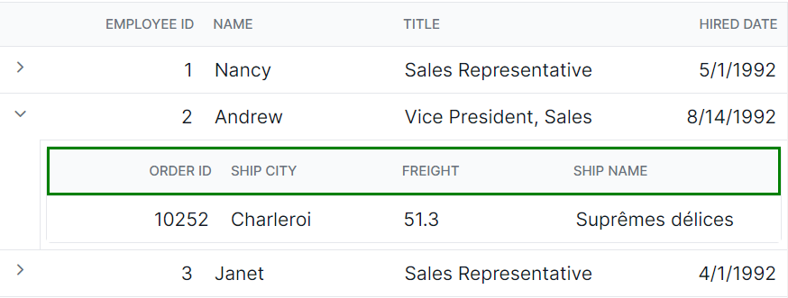

**Customizing the child grid header cell**

To style the child grid's header cells, use the following CSS. The `.e-headercell` selector targets the header cell, allows to change the text `color` and `background`.

```css
.e-detailcell .e-grid .e-headercontent .e-headercell{
    color: #ffffff;
    background-color: #1ea8bd;
}
```

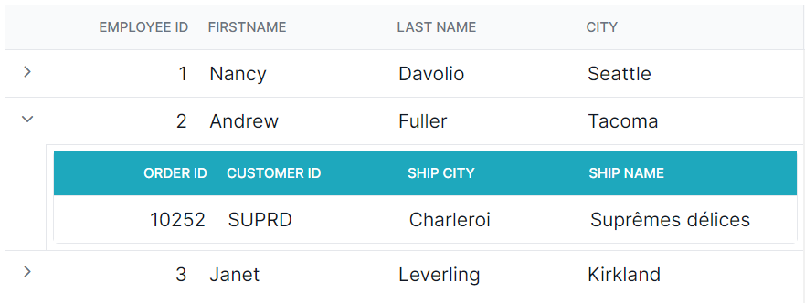

**Customizing the child grid header cell div element**

To style the inner `div` of the child grid's header cells, use the following CSS. The `.e-headercelldiv` selector targets the header cell content and allows customization of `font size`, `weight`, and `color`.

```css
.e-detailcell .e-grid .e-headercelldiv {
    font-size: 15px;
    font-weight: bold;
    color: darkblue;
}
```

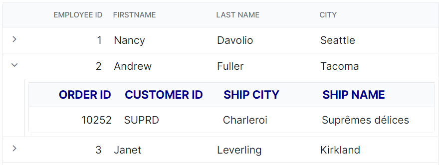

### Paging

The paging elements of the child grid can be customized using CSS. The following examples show how to style the pager root, pager container, navigation elements, numeric links, and the current page indicator.

**Customizing the child grid pager root element**

To style the child grid's pager root, use the following CSS. The `.e-detailcell` class targets the child grid, and `.e-gridpager` selects the pager container. The `font-family` and `background-color` properties define the font and background styling.

```css
.e-detailcell .e-grid  .e-gridpager {
    font-family: cursive;
    background-color: #deecf9;
}
```

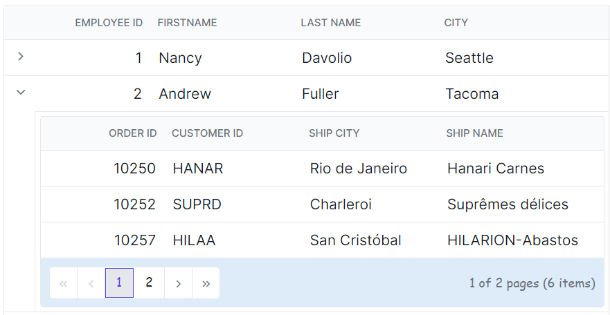

**Customizing the child grid pager container element**

To style the child grid's pager container, apply the following CSS. The `.e-pagercontainer` selector modifies the border and font of the pager section.

```css
.e-detailcell .e-grid .e-pagercontainer {
    border: 2px solid #00b5ff;
    font-family: cursive;
}
```

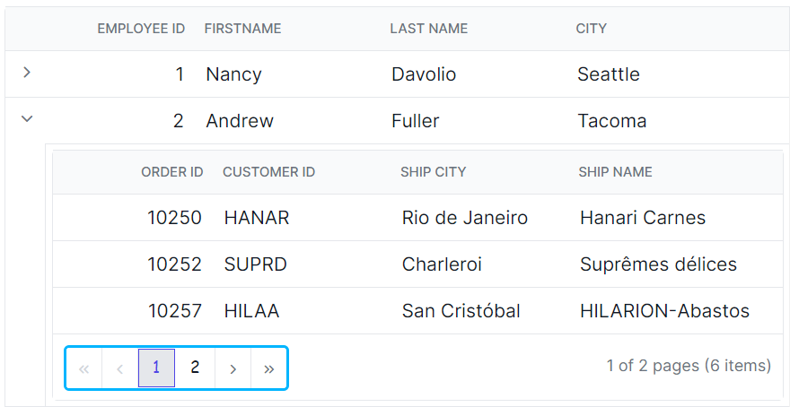

**Customizing the child grid pager navigation elements**

To style the child grid's pager navigation buttons, apply the following CSS. These selectors target all navigation states, allowing customization of their `background color`.

```css
.e-detailcell .e-grid .e-gridpager .e-prevpagedisabled,
.e-detailcell .e-grid .e-gridpager .e-prevpage,
.e-detailcell .e-grid .e-gridpager .e-nextpage,
.e-detailcell .e-grid .e-gridpager .e-nextpagedisabled,
.e-detailcell .e-grid .e-gridpager .e-lastpagedisabled,
.e-detailcell .e-grid .e-gridpager .e-lastpage,
.e-detailcell .e-grid .e-gridpager .e-firstpage,
.e-detailcell .e-grid .e-gridpager .e-firstpagedisabled {
    background-color: #deecf9;
}
```

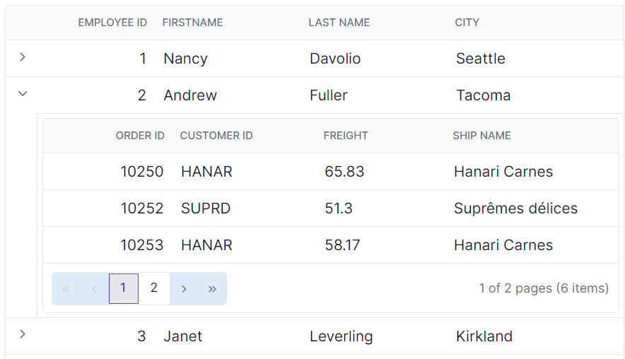

**Customizing the child grid pager page numeric link elements**

To style the child grid's pager numeric link elements, use the following CSS. The `.e-numericitem` selector targets each page number, allowing customization of `background-color`, `color`, and hover effects.

To customize the appearance of the child grid pager page numeric link elements, the following CSS code can be used:

```css
.e-detailcell .e-grid .e-gridpager .e-numericitem {
    background-color: #5290cb;
    color: #ffffff;
    cursor: pointer;
}

.e-detailcell .e-grid .e-gridpager .e-numericitem:hover {
    background-color: white;
    color: #007bff;
}
```

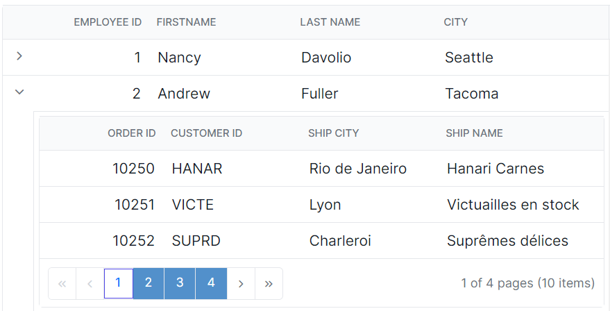

**Customizing the child grid pager current page numeric element**

To style the current page number in the child grid pager, use the following CSS. The `.e-currentitem` selector targets the active numeric item and allows customization of its `background-color` and `color`.

To customize the appearance of the child grid pager current page numeric element, the following CSS code can be used:

```css
.e-detailcell .e-grid .e-gridpager .e-currentitem {
    background-color: #0078d7;
    color: #fff;
}
```

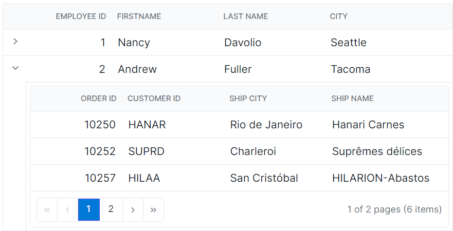

### Sorting

The appearance of sorting icons in the child grid can be customized using CSS. Syncfusion<sup style="font-size:70%">&reg;</sup> provides a set of built-in [icons](https://ej2.syncfusion.com/react/documentation/appearance/icons#tailwind-34) that can be used based on the theme.

**Customizing the child grid sorting icon**

To change the sorting icons in the child grid header, apply the following CSS. The `.e-icon-ascending::before` and `.e-icon-descending::before` selectors target the icons for ascending and descending sort states, allowing custom icon codes.

```css
.e-detailcell .e-grid .e-icon-ascending::before {
    content: '\e7a3';
    /* Icon code for ascending order. */
}

.e-detailcell .e-grid .e-icon-descending::before {
    content: '\e7b6';
    /* Icon code for descending order. */
}
```

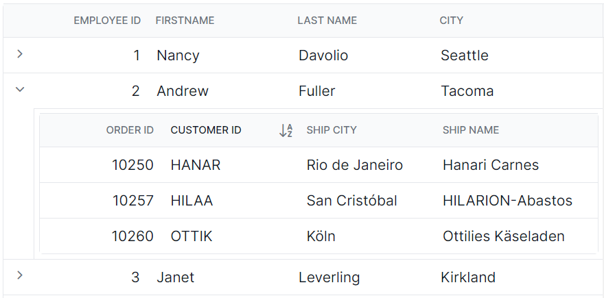

**Customizing the child grid multi sorting icon**

To style the multi sorting icon in the child grid header, apply the following CSS. The `.e-sortnumber` selector targets the icon, allowing customization of its `background-color` and font style.

```css
.e-detailcell .e-grid .e-sortnumber {
    background-color: #deecf9;
    font-family: cursive;
}
```

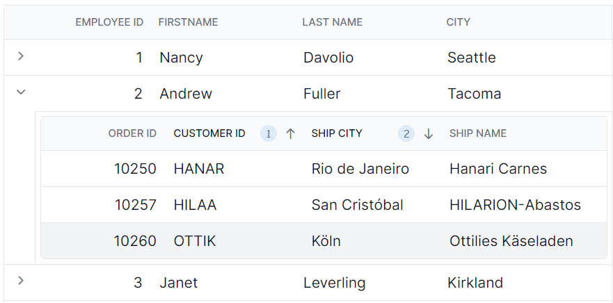

### Filtering

The appearance of filtering elements in the child grid can be customized using CSS. The following examples demonstrate how to style key filtering components, including filter bar cells, filter inputs, focus states, clear icons, filter icons, filter dialog content and footer, dialog input elements, dialog buttons, and excel filter number options.

**Customizing the child grid filter bar cell element**

To style the filter bar cell in the child grid header, apply the following CSS. The `.e-filterbarcell` selector targets the cell, allowing customization of its `background-color`.

```css
.e-detailcell .e-grid .e-filterbar .e-filterbarcell {
  background-color: #045fb4;
}

```

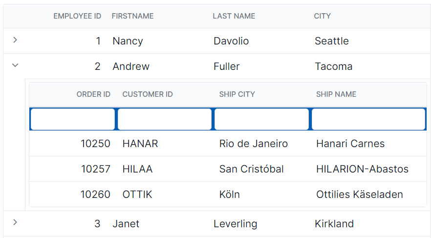

**Customizing the child grid filter bar input element**

To style the input field within the child grid's filter bar, use the following CSS. The `.e-input` selector targets the input element, allowing customization of its font.

```css
.e-detailcell .e-grid .e-filterbarcell .e-input-group input.e-input{
    font-family: cursive;
}
```

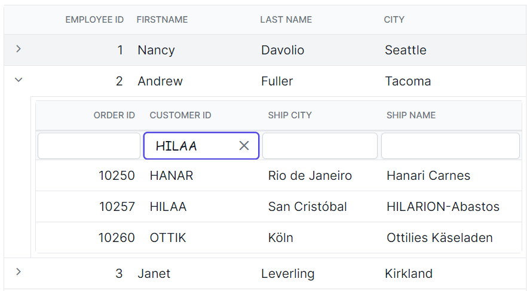

**Customizing the child grid filter bar input focus**

To style the focus highlight of the filter bar input in the child grid, use the following CSS. The `.e-input-focus` selector targets the input when it's active, allowing customization of its `background-color`.

```css
.e-detailcell .e-grid .e-filterbarcell .e-input-group.e-input-focus{
    background-color: #deecf9;
}
```

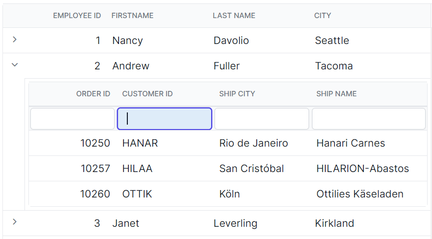

**Customizing the child grid filter bar input clear icon**

To modify the clear icon in the child grid's filter bar input, apply the following CSS. The `.e-clear-icon::before` selector allows changing the icon using a custom Unicode value.

```css
.e-detailcell .e-grid .e-filterbarcell .e-input-group .e-clear-icon::before {
    content: '\e72c';
}
```

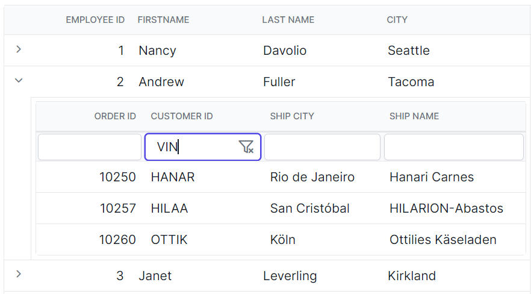

**Customizing the child grid child grid filtering icon**

To style the filtering icon in the child grid header, use the `.e-icon-filter::before` selector. The `content` property defines the icon and can be updated to display a different symbol.

```css
.e-detailcell .e-grid .e-icon-filter::before{
    content: '\e81e';
}
```

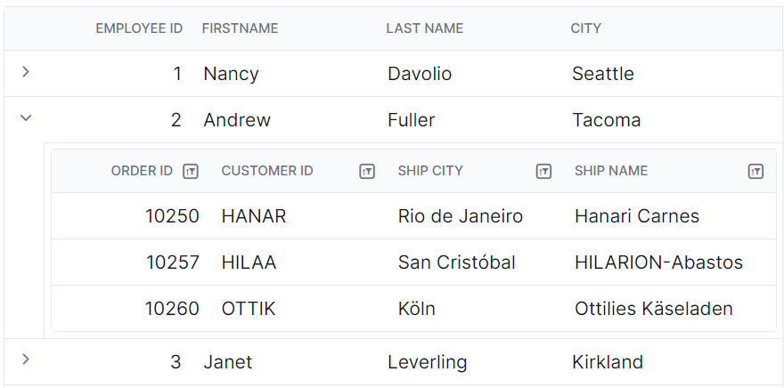

**Customizing the child grid filter dialog content**

To style the content area of the child grid's filter dialog, use the `.e-filter-popup .e-dlg-content` selector with the `background-color` property.

```css
.e-detailcell .e-grid .e-filter-popup .e-dlg-content {
    background-color: #deecf9;
}
```

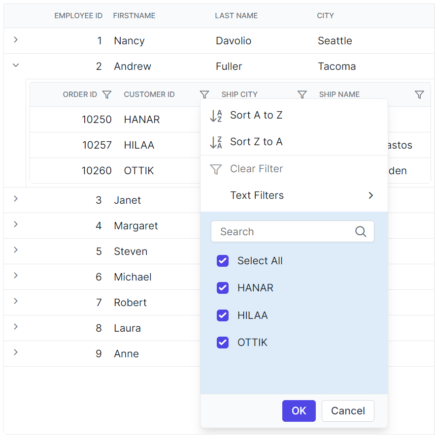

**Customizing the child grid filter dialog footer**

To customize the footer of the child grid's filter dialog, apply the `background-color` property to the .`e-filter-popup .e-footer-content` element using the following CSS.

```css
.e-detailcell .e-grid .e-filter-popup .e-footer-content {
    background-color: #deecf9;
}
```

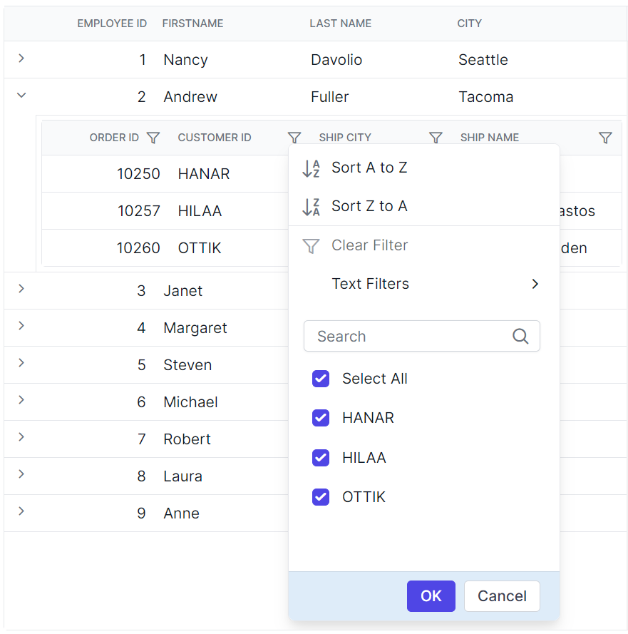

**Customizing the child grid filter dialog input element**

To customize the input elements in the child grid's filter dialog, apply the `font-family` property to the `.e-filter-popup .e-input` selector using the following CSS.

```css
.e-detailcell .e-grid .e-filter-popup .e-input-group input.e-input{
    font-family: cursive;
}
```

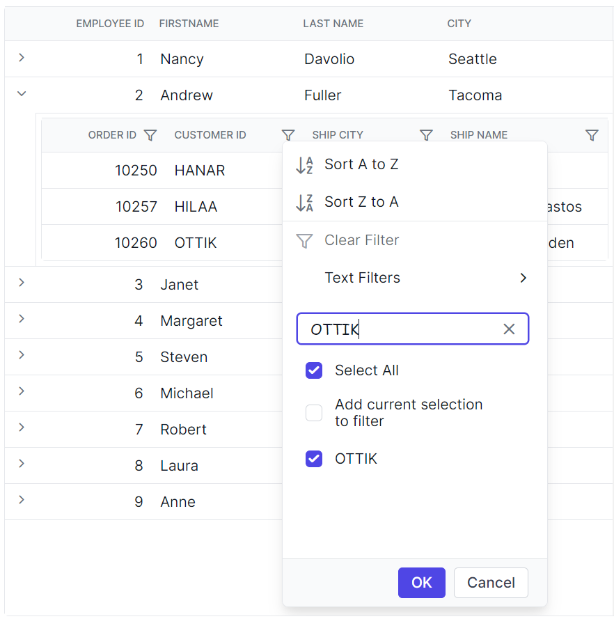

**Customizing the child grid filter dialog button element**

The filter dialog's buttons can be styled by targeting `.e-filter-popup` and `.e-btn`, applying a `font-family` to change their font.

```css
.e-detailcell .e-grid .e-filter-popup .e-btn{
    font-family: cursive;
}
```

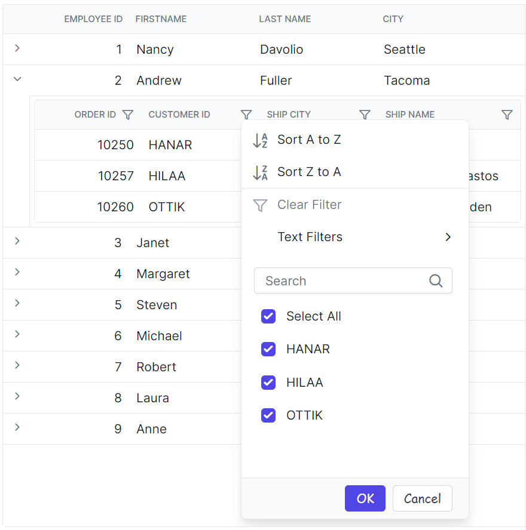

**Customizing the child grid excel filter dialog number filters element**

The number filter options in the child grid's excel filter dialog can be styled by applying a `background-color` to the `.e-filter-popup .e-contextmenu-wrapper ul` element as below:

```css
.e-detailcell .e-grid .e-filter-popup .e-contextmenu-wrapper ul{
    background-color: #deecf9;
}
```

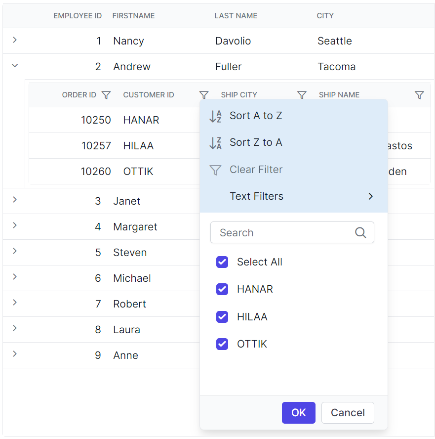

### Grouping

The grouping-related elements in the child grid can be styled through CSS. This includes the group header, expand/collapse icons, group caption row, and indent cells:

**Customizing the child grid group header**

To customize the appearance of the child grid's group header, target the `.e-groupdroparea` element and apply the desired background-color:

```css
.e-detailcell .e-grid .e-groupdroparea {
    background-color: #132f49;
}
```

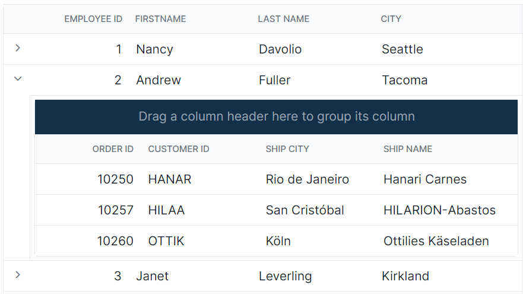

**Customizing the child grid group expand or collapse icons**

To change the expand and collapse icons in the child grid's group header, use the `content` property on `.e-icon-gdownarrow::before` and `.e-icon-grightarrow::before`:


```css
.e-detailcell .e-grid .e-icon-gdownarrow::before{
    content:'\e7c9'
}
.e-detailcell .e-grid .e-icon-grightarrow::before{
    content:'\e80f'
}
```

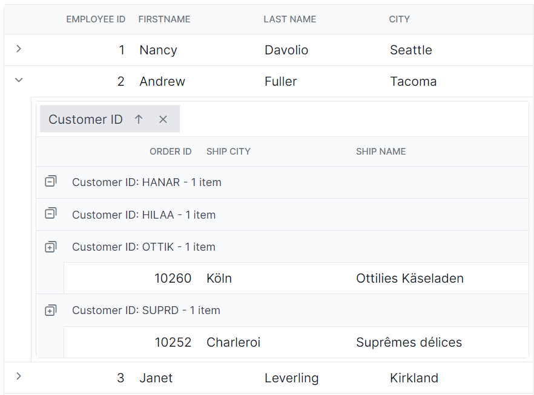

**Customizing the child grid group caption row**

To style the child grid's group caption row and its expand/collapse icons, use the `background-color` property on the following elements:

```css
.e-detailcell .e-grid .e-groupcaption {
    background-color: #deecf9;
}

.e-detailcell .e-grid .e-recordplusexpand,
.e-detailcell .e-grid .e-recordpluscollapse {
    background-color: #deecf9;
}
```

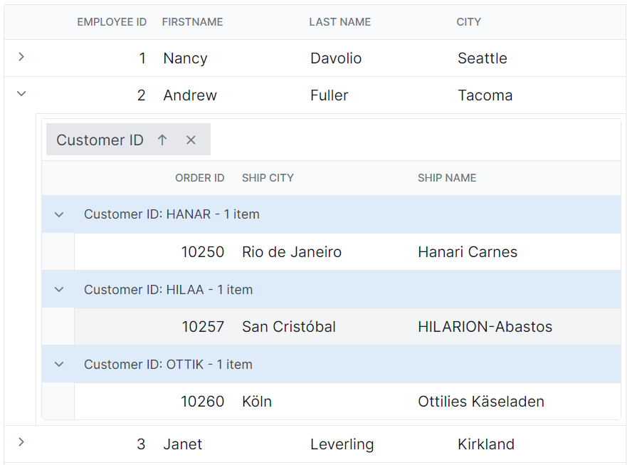

**Customizing the child grid grouping indent cell**

To style the child grid's grouping indent cell, target the `.e-indentcell` element and apply the desired `background-color`:

```css
.e-detailcell .e-grid .e-indentcell {
    background-color: #deecf9;
}
```

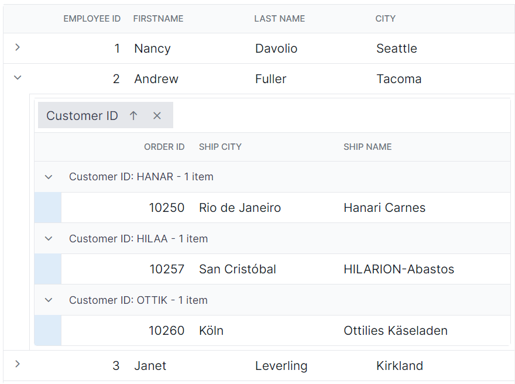

### Toolbar

The toolbar in the child grid can be styled through CSS. The following examples demonstrate customization of the toolbar's root element and its button elements.

**Customizing the child grid toolbar root element**

The toolbar's root element in the child grid can be styled by applying a `background-color` to the `.e-toolbar-items` selector.

```css
.e-detailcell .e-grid .e-toolbar-items {
    background-color: #deecf9;
}
```

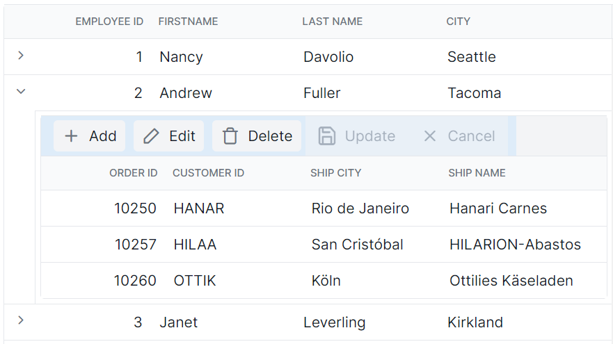

**Customizing the child grid toolbar button element**

The toolbar buttons in the child grid can be styled by applying a `background-color` to the `.e-toolbar .e-btn` selector.

```css
.e-detailcell .e-grid .e-toolbar .e-btn {
    background-color: #deecf9;
}
```

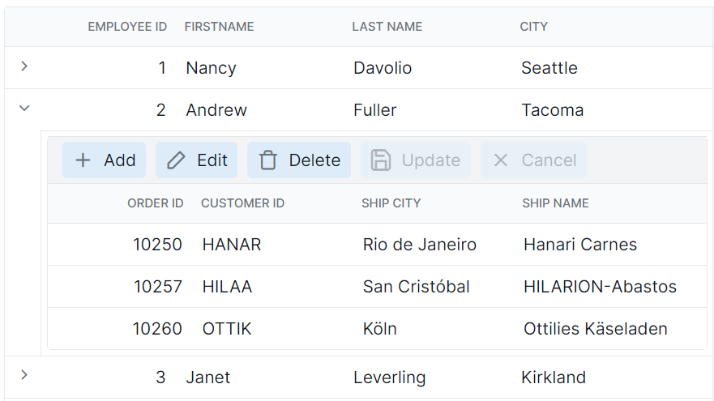

### Editing

The appearance of editing-related elements in the child grid can be customized using CSS. This includes input fields, dialog components, and action buttons.

**Customizing the child grid edited and added row element**

The edited and added rows in the child grid can be styled by applying a `background-color` to the `.e-editedrow table` and `.e-addedrow table` selectors.

```css
.e-detailcell .e-grid .e-editedrow table, 
.e-detailcell .e-grid .e-addedrow table {
	background-color: #62b2eb;
}
```

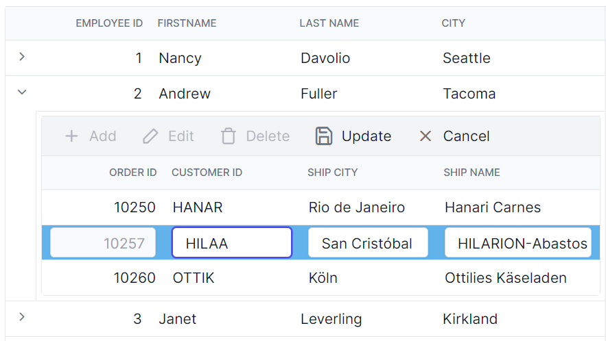
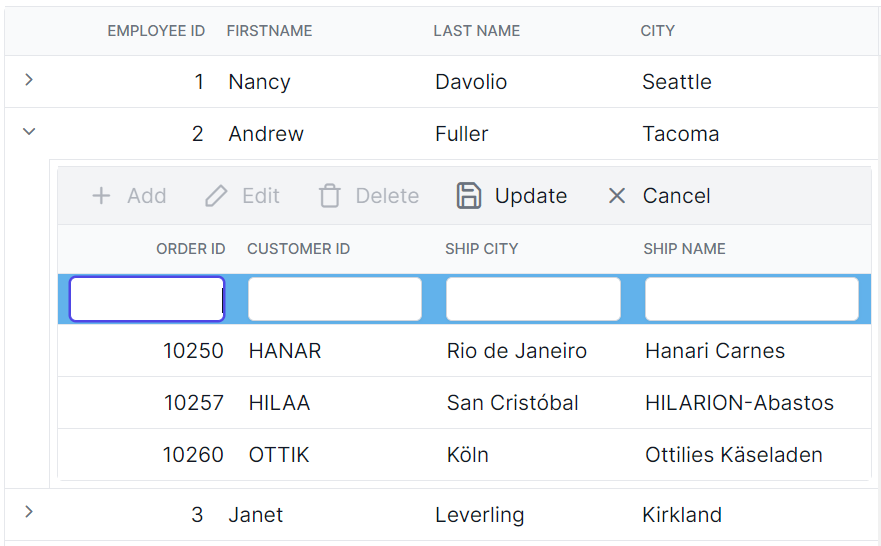

**Customizing the child grid edited row input element**

To style input fields within edited rows in the child grid, target the `.e-input` elements inside `.e-editedrow` and apply properties like `font-family` and `color`:

```css
.e-detailcell .e-grid .e-editedrow .e-input-group input.e-input{
  font-family: cursive;
  color:rgb(214, 33, 123)
}
```

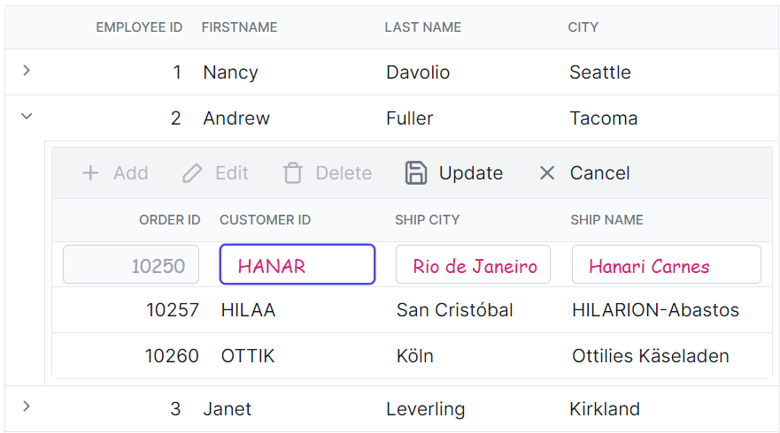

**Customizing the child grid edit dialog header element**

The edit dialog's header in the child grid can be styled by applying a `background-color` to the `.e-edit-dialog .e-dlg-header-content` selector.

```css
.e-edit-dialog .e-dlg-header-content {
    background-color: #deecf9;
}
```

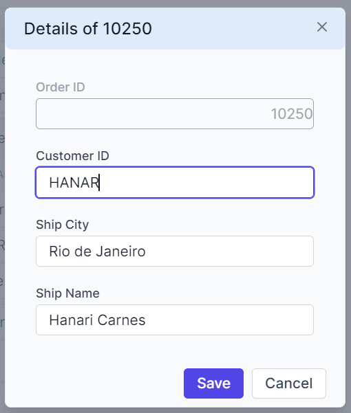

**Customizing the child grid edited row input element in dialog edit mode**

The input fields in dialog edit mode can be styled by applying a `font-family` to the `.e-gridform .e-float-input .e-field` selector.

```css
.e-grid .e-gridform .e-rowcell .e-float-input .e-field {
    font-family: cursive;
}
```

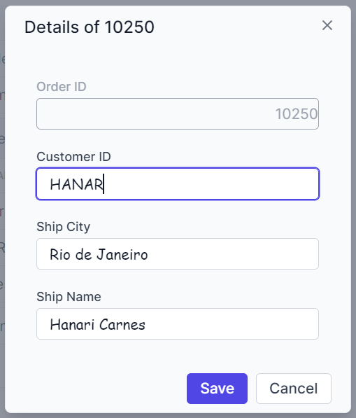

**Customizing the child grid command column buttons**

To style the command column buttons (edit, delete, update, and cancel) in the child grid, target their respective classes and apply the desired `color`:

```css
.e-detailcell .e-grid .e-delete::before ,.e-grid .e-cancel-icon::before{
    color: #f51717;
}
.e-detailcell .e-grid .e-edit::before, .e-grid .e-update::before {
    color: #077005;
}
```

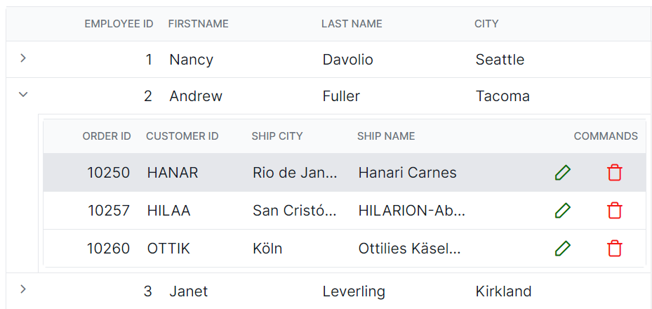
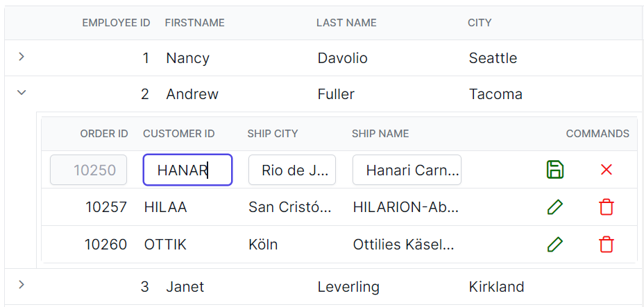

### Aggregate

Aggregate elements in the child grid can be styled through CSS. The following examples demonstrate customization options for both the aggregate root element and individual aggregate cells.

**Customizing the child grid aggregate root element**

Styling the child grid's aggregate root element can be achieved by applying CSS properties such as `font-family` to the `.e-gridfooter` selector.

```css
.e-detailcell .e-grid .e-gridfooter {
    font-family: cursive;
}
```

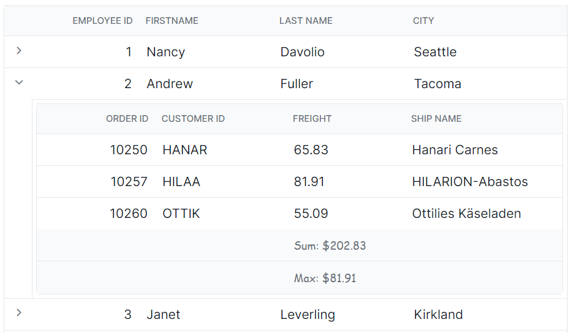

**Customizing the child grid aggregate cell elements**

The `.e-summarycell` class within the `.e-summaryrow` of the child grid can be styled using properties like `background-color` to modify the appearance of individual aggregate cells:

```css
.e-detailcell .e-grid .e-summaryrow .e-summarycell {
    background-color: #deecf9;
}
```

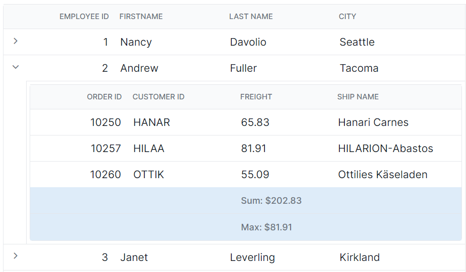

### Selection

The appearance of selection within the child grid can be customized by applying CSS properties to modify the background of selected rows, cells, or columns.

**Customizing the child grid row selection background**

The `.e-selectionbackground` class within the child grid can be styled using `background-color` property to modify the appearance of selected rows:

```css
.e-detailcell .e-grid td.e-selectionbackground {
    background-color: #00b7ea;
}
```

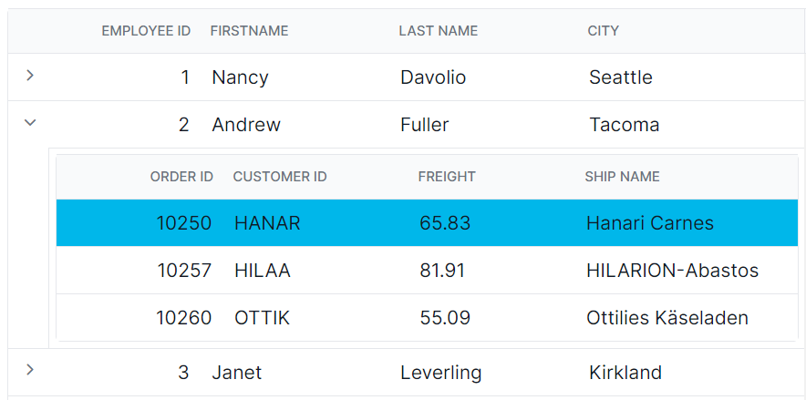

**Customizing the child grid cell selection background**

The cell selection background in the child grid can be customized by applying the `background-color` property to the `td.e-cellselectionbackground` selector.

```css
.e-detailcell .e-grid td.e-cellselectionbackground {
    background-color: #00b7ea;
}
```

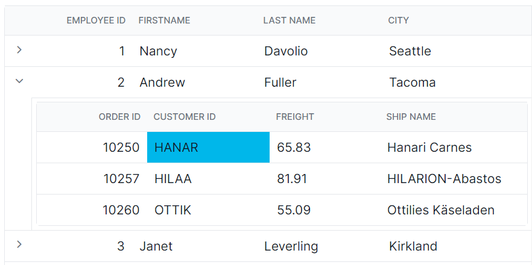

**Customizing the child grid column selection background**

The column selection background in the child grid can be customized by applying the `background-color` property to the `.e-columnselection` selector.

```css
.e-detailcell .e-grid .e-columnselection {
    background-color: #aec2ec;
}
```

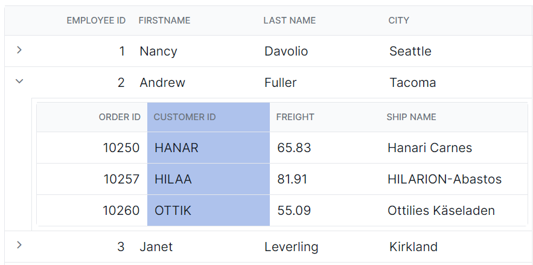