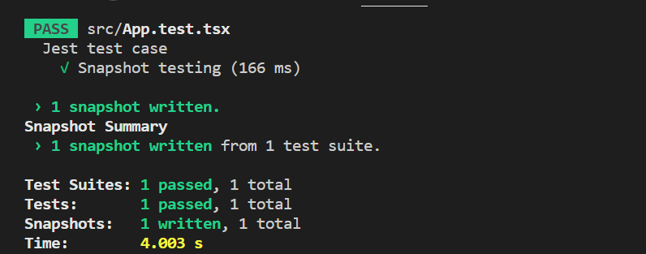

# React Grid - Jest Unit Testing

[Jest](https://jestjs.io/docs/tutorial-react) is a widely used testing framework for React applications, enabling the creation and execution of unit tests for components, functions, and methods. Unit testing helps validate individual parts of a React application, detect issues early, and maintain overall reliability. The following steps explain how to create Jest test cases for the Syncfusion<sup style="font-size:70%">&reg;</sup> React Grid.

Step 1: Set up the Jest testing environment

1. Check and install the node version:

Ensure that node version 14 or higher is installed. If not, install a supported version from the official [Node.js website](https://nodejs.org/en/download).

2. Create a React application and install the Grid package:

Follow the [Syncfusion<sup style="font-size:70%">&reg;</sup> React Grid Getting Started](https://ej2.syncfusion.com/react/documentation/grid/getting-started) guide to create a React app and install the required Syncfusion<sup style="font-size:70%">&reg;</sup> React Grid package.

3. Install Jest:

Jest is typically included by default in React apps created with Create React App. If not present in `package.json`, install it using npm:

```
npm install --save-dev jest
```

4. Install the testing library package:

Run the following command to install the DOM testing utilities provided by testing library:

```
npm install --save-dev @testing-library/jest-dom
```

Step 2: Adding a Grid component

Refer to the [documentation](https://ej2.syncfusion.com/react/documentation/grid/getting-started#adding-css-reference) to include necessary styles. Below is a sample implementation of the Grid component:

**App.tsx:**

```typescript
import * as React from 'react';
import { ColumnDirective, ColumnsDirective, GridComponent } from '@syncfusion/ej2-react-grids';
// Import your datasource instead of this.
import { customerData} from './dataSource';
import './App.css';

function App() {
    return (<div>
        <GridComponent dataSource={customerData.slice(0,5)} height={315}>
            <ColumnsDirective>
                <ColumnDirective field='CustomerID' headerText='Customer ID' width='100'/>
                <ColumnDirective field='ContactName' headerText='Customer Name' width='100' textAlign="Right"/>
                <ColumnDirective field='Address' headerText='Address' width='80' textAlign="Right"/>
                <ColumnDirective field='Country' headerText='Country' width='100'/>
            </ColumnsDirective>
        </GridComponent>
    </div>)
};
export default App;
```

Step 3: Jest test case implementation

Create a test file with a **.test.tsx** extension (e.g., **App.test.tsx**). Import the necessary modules:

```typescript
import { render } from '@testing-library/react';
import App from './App';
```

1. Define test suite:

The `describe` block groups related test cases. If a component relies on browser APIs like `window.crypto` or `window.crypto.getRandomValues`, mock them in a `beforeEach` block:

```typescript
window.crypto = jest.fn() as any;
window.crypto.getRandomValues = jest.fn();
```

2. Types of testing:

Test case types are added in an `it` block.

1. Snapshot testing:

Snapshot testing captures the rendered output of a component and compares it to a saved version to detect unexpected changes. If the current output matches the stored snapshot, the test case will be passed successfully.

**Example:**

In the below example, the `it` block is utilized to define a test case for **Snapshot testing**. Within the test case, the `<App/>` component is rendered within the container object. After, the `expect` statement verifies that the container matches the stored snapshot, utilizing the `toMatchSnapshot` matcher provided by Jest.

```typescript
it('Snapshot testing', () => {
    const { container } = render(<App />);
    expect(container).toMatchSnapshot();
});
```


2. DOM testing:

The **DOM** testing involves testing the behavior and interactions of React components. The goal is to ensure that components function correctly and produce the expected output when interacting with the DOM. Libraries such as **react-testing-library**, `Enzyme`, or **React's TestUtils** manipulate the rendered component in DOM testing.

DOM testing verifies the rendered structure and behavior of the component.

**Example:** 

In the below example, the `it` block is used to define a test case for the "Length of the record". Within the test case, the `<App/>` component is rendered in the container object. After creating a Grid component instance, the appropriate number of data records in the `e-grid` CSS class is verified. The [dataSource](https://ej2.syncfusion.com/react/documentation/api/grid#datasource) property is employed to retrieve the record of the data. Using this property, the accurate population of data length in the grid component is verified.

```typescript
it('Length of the record', () => {
    const { container } = render(<App />);
    // eslint-disable-next-line testing-library/no-container, testing-library/no-node-access
    const gridElement = container.getElementsByClassName('e-grid');
    const gridInstance = (gridElement as any)[0].ej2_instances[0];
    expect(gridInstance.dataSource).toHaveLength(5);
});
```

The following example illustrates how to create the grid sample and how to write the Jest test case.




























Step 4: Run the Jest test case:

The Jest test case is executed using the following command:

```
npm test
```

> * This is only for local data. Use the [currentViewData](https://ej2.syncfusion.com/react/documentation/api/grid#currentviewdata) property when rendering remote data.
> * Find the sample of the Unit Jest testing in DataGrid [here](https://github.com/SyncfusionExamples/DataGrid-react-test-case)
