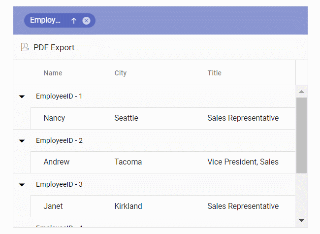

# Exporting with Templates in React Grid Component

The React Grid component allows exporting column, detail, and caption templates to PDF documents. Exported templates can include images, hyperlinks, and customized text formatting.

## Exporting with column template

The PDF export functionality allows exporting Grid columns that include images, hyperlinks, and custom text to a PDF document. The [pdfQueryCellInfo](https://ej2.syncfusion.com/react/documentation/api/grid#pdfquerycellinfo) event enables customization of cell content during export.

The following sample demonstrates exporting hyperlinks and images to PDF using the [hyperlink](https://ej2.syncfusion.com/react/documentation/api/grid/pdfQueryCellInfoEventArgs#hyperlink) and [image](https://ej2.syncfusion.com/react/documentation/api/grid/pdfQueryCellInfoEventArgs#image) properties in the `pdfQueryCellInfo` event.

> The PDF export supports base64 strings for images.


















## Exporting with detail template

By default, the Grid exports the parent grid with expanded detail rows. Control this behavior by setting the `PdfExportProperties.hierarchyExportMode` property. The available options are:

| Mode     | Behavior    |
|----------|-------------|
| `Expanded` | Exports the parent grid with expanded detail rows. |
| `All`      | Exports the parent grid with all detail rows. |
| `None`     | Exports the parent grid alone. |

The detail rows in the exported PDF can be customized and formatted using the [exportDetailTemplate](https://ej2.syncfusion.com/react/documentation/api/grid#exportdetailtemplate) event. This event formats detail rows based on parent row data.

The following sample configures detail row formatting using the [columnCount](https://ej2.syncfusion.com/react/documentation/api/grid/detailTemplateProperties#columncount), [columnHeader](https://ej2.syncfusion.com/react/documentation/api/grid/detailTemplateProperties#columnheader), and [rows](https://ej2.syncfusion.com/react/documentation/api/grid/detailTemplateProperties#rows) properties using its [parentRow](https://ej2.syncfusion.com/react/documentation/api/grid/exportDetailTemplateEventArgs#parentrow) details. This allows for the creation of detail rows in the PDF document. Custom cell styling is applied using the [style](https://ej2.syncfusion.com/react/documentation/api/grid/detailTemplateCell#style) property.

> If `columnCount` is not provided, the columns in the detail row of the PDF grid will be generated based on the count of the `columnHeader`/`rows` first row's [cells](https://ej2.syncfusion.com/react/documentation/api/grid/detailTemplateRow#cells).
> When using [rowSpan](https://ej2.syncfusion.com/react/documentation/api/grid/detailTemplateCell#rowspan), it is Essential&reg; to provide the cell's [index](https://ej2.syncfusion.com/react/documentation/api/grid/detailTemplateCell#index) for proper functionality.




import { ColumnDirective, ColumnsDirective, GridComponent, DetailRow, Inject,
  PdfExport, Toolbar } from '@syncfusion/ej2-react-grids';
import * as React from 'react';
import { employeeData } from './datasource';

function App() {
  let grid;
  const toolbar = ['PdfExport'];
  const gridTemplate = (props) => {
    return (
      <table className="detailtable" width="100%">
        <colgroup>
          <col style={{ width: '40%' }} />
          <col style={{ width: '60%' }} />
        </colgroup>
        <thead>
          <tr>
            <th
              colSpan={2} style={{
                fontWeight: 500,
                textAlign: 'center',
                backgroundColor: '#ADD8E6',
              }}
            >
              Product Details
            </th>
          </tr>
        </thead>
        <tbody>
          <tr>
            <td rowSpan={4} className="photo" style={{ textAlign: 'center' }}>
              
            </td>
            <td>
              
                Offers: {props.Offers}
              
            </td>
          </tr>
          <tr>
            <td>
              Available: {props.Available} 
            </td>
          </tr>
          <tr>
            <td>
              
                Contact: <a href={'mailto:' + props.Contact}>{props.Contact}</a>
              
            </td>
          </tr>
          <tr>
            <td>
              
                Ratings: {props.Ratings}
              
            </td>
          </tr>
          <tr>
            <td style={{ textAlign: 'center' }}>
               {props.productDesc}
            </td>
            <td>
              {props.ReturnPolicy}
            </td>
          </tr>
          <tr>
            <td style={{ textAlign: 'center' }}>
               {props.Cost}
            </td>
            <td>
              {props.Cancellation}
            </td>
          </tr>
          <tr>
            <td style={{ textAlign: 'center' }}>
              
                {' '}
                {props.Status}
              
            </td>
            <td>
              
                {props.Delivery}
              
            </td>
          </tr>
        </tbody>
      </table>
    );
  };

  const toolbarClick = (args) => {
    if (grid && args['item'].id === 'DetailTemplateGrid_pdfexport') {
      grid.pdfExport({
        hierarchyExportMode: 'Expanded',
      });
    }
  };
  const exportDetailTemplate = (args) => {
    args.value = {
      columnCount: 2,
      columnHeader: [
        {
          cells: [
            {
              index: 0,
              colSpan: 2,
              value: 'Product Details',
              style: {
                backColor: '#ADD8E6',
                pdfTextAlignment: 'Center',
                bold: true,
              },
            },
          ],
        },
      ],
      rows: [
        {
          cells: [
            {
              index: 0,
              rowSpan: 4,
              image: { base64: args.parentRow.data['ProductImg'], width: 80 },
            },
            {
              index: 1,
              value: 'Offers: ' + args.parentRow.data['Offers'],
              style: { fontColor: '#0A76FF', fontSize: 15 },
            },
          ],
        },
        {
          cells: [
            {
              index: 1,
              value: 'Available: ' + args.parentRow.data['Available'],
            },
          ],
        },
        {
          cells: [
            {
              index: 1,
              value: 'Contact: ',
              hyperLink: {
                target: 'mailto:' + args.parentRow.data['Contact'],
                displayText: args.parentRow.data['Contact'],
              },
            },
          ],
        },
        {
          cells: [
            {
              index: 1,
              value: 'Ratings: ' + args.parentRow.data['Ratings'],
              style: { fontColor: '#0A76FF', fontSize: 15 },
            },
          ],
        },
        {
          cells: [
            {
              index: 0,
              value: args.parentRow.data['productDesc'],
              style: { pdfTextAlignment: 'Center' },
            },
            { index: 1, value: args.parentRow.data['ReturnPolicy'] },
          ],
        },
        {
          cells: [
            {
              index: 0,
              value: args.parentRow.data['Cost'],
              style: { bold: true, pdfTextAlignment: 'Center' },
            },
            { index: 1, value: args.parentRow.data['Cancellation'] },
          ],
        },
        {
          cells: [
            {
              index: 0,
              value: args.parentRow.data['Status'],
              style: {
                fontColor: args.parentRow.data['Status'] === 'Available' ? '#00FF00' : '#FF0000',
                pdfTextAlignment: 'Center',
                fontSize: 15,
              },
            },
            {
              index: 1,
              value: args.parentRow.data['Delivery'],
              style: { fontColor: '#0A76FF', fontSize: 15 },
            },
          ],
        },
      ],
    };
  };
  
  return (
    

      <GridComponent id="DetailTemplateGrid" ref={(g) => (grid = g)} dataSource={employeeData} detailTemplate={gridTemplate}
        dataSource={employeeData} toolbar={toolbar} allowPdfExport={true} toolbarClick={toolbarClick}
        exportDetailTemplate={exportDetailTemplate} height="315">
        <ColumnsDirective>
          <ColumnDirective field="Category" headerText="Category" width="140" />
          <ColumnDirective field="ProductID" headerText="Product ID" width="120" />
          <ColumnDirective headerText="Status" field="Status" width="120" />
        </ColumnsDirective>
        <Inject services={[DetailRow, Toolbar, PdfExport]} />
      </GridComponent>
    

  );
}
export default App;




import { ColumnDirective, ColumnsDirective, GridComponent, DetailRow, Inject, PdfExport,
  Toolbar, Grid, ToolbarItems, ExportDetailTemplateEventArgs } from '@syncfusion/ej2-react-grids';
import { ClickEventArgs } from '@syncfusion/ej2-navigations';
import * as React from 'react';
import { employeeData } from './datasource';

function App() {
  let grid: Grid | null;
  const toolbar: ToolbarItems[] = ['PdfExport'];
  const gridTemplate = (props: any) => {
    return (
      <table className="detailtable" width="100%">
        <colgroup>
          <col style={{ width: '40%' }} />
          <col style={{ width: '60%' }} />
        </colgroup>
        <thead>
          <tr>
            <th
              colSpan={2}
              style={{
                fontWeight: 500,
                textAlign: 'center',
                backgroundColor: '#ADD8E6',
              }}
            >
              Product Details
            </th>
          </tr>
        </thead>
        <tbody>
          <tr>
            <td rowSpan={4} className="photo" style={{ textAlign: 'center' }}>
              
            </td>
            <td>
              
                Offers: {props.Offers}
              
            </td>
          </tr>
          <tr>
            <td>
              Available: {props.Available} 
            </td>
          </tr>
          <tr>
            <td>
              
                Contact: <a href={'mailto:' + props.Contact}>{props.Contact}</a>
              
            </td>
          </tr>
          <tr>
            <td>
              
                Ratings: {props.Ratings}
              
            </td>
          </tr>
          <tr>
            <td style={{ textAlign: 'center' }}>
               {props.productDesc}
            </td>
            <td>
              {props.ReturnPolicy}
            </td>
          </tr>
          <tr>
            <td style={{ textAlign: 'center' }}>
               {props.Cost}
            </td>
            <td>
              {props.Cancellation}
            </td>
          </tr>
          <tr>
            <td style={{ textAlign: 'center' }}>
              
                {' '}
                {props.Status}
              
            </td>
            <td>
              
                {props.Delivery}
              
            </td>
          </tr>
        </tbody>
      </table>
    );
  };

  const toolbarClick = (args: ClickEventArgs) => {
    if (grid && args['item'].id === 'DetailTemplateGrid_pdfexport') {
      grid.pdfExport({
        hierarchyExportMode: 'Expanded',
      });
    }
  };
  const exportDetailTemplate = (args: ExportDetailTemplateEventArgs) => {
    args.value = {
      columnCount: 2,
      columnHeader: [
        {
          cells: [
            {
              index: 0,
              colSpan: 2,
              value: 'Product Details',
              style: {
                backColor: '#ADD8E6',
                pdfTextAlignment: 'Center',
                bold: true,
              },
            },
          ],
        },
      ],
      rows: [
        {
          cells: [
            {
              index: 0,
              rowSpan: 4,
              image: { base64: args.parentRow.data['ProductImg'], width: 80 },
            },
            {
              index: 1,
              value: 'Offers: ' + args.parentRow.data['Offers'],
              style: { fontColor: '#0A76FF', fontSize: 15 },
            },
          ],
        },
        {
          cells: [
            {
              index: 1,
              value: 'Available: ' + args.parentRow.data['Available'],
            },
          ],
        },
        {
          cells: [
            {
              index: 1,
              value: 'Contact: ',
              hyperLink: {
                target: 'mailto:' + args.parentRow.data['Contact'],
                displayText: args.parentRow.data['Contact'],
              },
            },
          ],
        },
        {
          cells: [
            {
              index: 1,
              value: 'Ratings: ' + args.parentRow.data['Ratings'],
              style: { fontColor: '#0A76FF', fontSize: 15 },
            },
          ],
        },
        {
          cells: [
            {
              index: 0,
              value: args.parentRow.data['productDesc'],
              style: { pdfTextAlignment: 'Center' },
            },
            { index: 1, value: args.parentRow.data['ReturnPolicy'] },
          ],
        },
        {
          cells: [
            {
              index: 0,
              value: args.parentRow.data['Cost'],
              style: { bold: true, pdfTextAlignment: 'Center' },
            },
            { index: 1, value: args.parentRow.data['Cancellation'] },
          ],
        },
        {
          cells: [
            {
              index: 0,
              value: args.parentRow.data['Status'],
              style: {
                fontColor: args.parentRow.data['Status'] === 'Available' ? '#00FF00' : '#FF0000',
                pdfTextAlignment: 'Center',
                fontSize: 15,
              },
            },
            {
              index: 1,
              value: args.parentRow.data['Delivery'],
              style: { fontColor: '#0A76FF', fontSize: 15 },
            },
          ],
        },
      ],
    };
  };
  
  return (
    

      <GridComponent id="DetailTemplateGrid" ref={(g) => (grid = g)} dataSource={employeeData}
        detailTemplate={gridTemplate} toolbar={toolbar} allowPdfExport={true} toolbarClick={toolbarClick}
        exportDetailTemplate={exportDetailTemplate} height="315">
        <ColumnsDirective>
          <ColumnDirective field="Category" headerText="Category" width="140" />
          <ColumnDirective
            field="ProductID"
            headerText="Product ID"
            width="120"
          />
          <ColumnDirective headerText="Status" field="Status" width="120" />
        </ColumnsDirective>
        <Inject services={[DetailRow, Toolbar, PdfExport]} />
      </GridComponent>
    

  );
}
export default App;












## Exporting with caption template

The PDF export feature enables exporting Grid with caption templates to PDF documents. The [exportGroupCaption](https://ej2.syncfusion.com/react/documentation/api/grid#exportgroupcaption) event allows customization of caption text during export.

The following sample demonstrates exporting customized caption text using the [captionText](https://ej2.syncfusion.com/react/documentation/api/grid/exportGroupCaptionEventArgs#captiontext) property in the `exportGroupCaption` event.


















