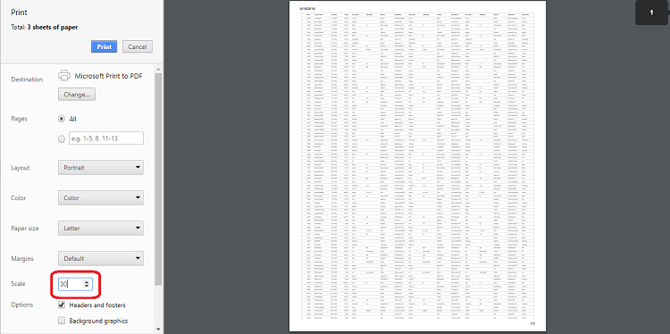

# Print in React Grid component

The printing feature in Syncfusion&reg; Grid allows you to easily generate and print a representation of the grid's content for better offline accessibility and documentation. You can enable this feature using either the grid's toolbar or the programmatically available `print` method.

To add the printing option to the grid's toolbar, simply include the [toolbar](https://ej2.syncfusion.com/react/documentation/api/grid/#toolbar) property in your grid configuration and add the **Print** as toolbar item. This will allow you to directly initiate the printing process while click on the Print item from the toolbar.
















 

## Page setup

When printing a webpage, some print options, such as layout, paper size, and margin settings, cannot be configured through JavaScript code. Instead, you need to customize these settings using the browser's page setup dialog. Below are links to the page setup guides for popular web browsers:

* [Chrome](https://support.google.com/chrome/answer/1069693?hl=en&visit_id=1-636335333734668335-3165046395&rd=1)
* [Firefox](https://support.mozilla.org/en-US/kb/how-print-web-pages-firefox)
* [Safari](http://www.mintprintables.com/print-tips/adjust-margins-osx/)
* [IE](http://www.helpteaching.com/help/print/index.htm)

## Print by external button

You can print the grid's content using an external button by utilizing the [print](https://ej2.syncfusion.com/react/documentation/api/grid/#print) method. This method allows you to trigger the printing process programmatically.
















 

## Print visible Page

By default, the Syncfusion&reg; React Grid prints all the pages of the grid. The [printMode](https://ej2.syncfusion.com/react/documentation/api/grid/#printmode) property within the grid grants you control over the printing process. However, if you want to print only the current visible page, you can achieve this by setting the [printMode](https://ej2.syncfusion.com/react/documentation/api/grid/#printmode) property to **CurrentPage**.




import { DropDownListComponent } from '@syncfusion/ej2-react-dropdowns';
import { ColumnDirective, ColumnsDirective, GridComponent } from '@syncfusion/ej2-react-grids';
import { Inject, Page, Toolbar } from '@syncfusion/ej2-react-grids';
import React, { useState } from 'react';
import { data } from './datasource';

function App() {
  const pageOptions = { pageSize: 6 };
  const [printMode, setPrintMode] = useState();
  const dropdownlist = ['AllPages', 'CurrentPage'];
  const onChange = (args) => {
    setPrintMode(args.value);
  }
  return ((

    <label style={{ padding: "10px 10px 26px 0" }}><b>Select Print Mode </b></label>
    <DropDownListComponent index={0} width={200} dataSource={dropdownlist} change={onChange}></DropDownListComponent>
    <GridComponent dataSource={data} printMode={printMode} toolbar={['Print']} allowPaging={true} pageSettings={pageOptions}>
      <ColumnsDirective>
        <ColumnDirective field='OrderID' headerText='Order ID' width='120' textAlign="Right" />
        <ColumnDirective field='CustomerID' headerText='Customer ID' width='150' />
        <ColumnDirective field='ShipCity' headerText='Ship City' width='150' />
        <ColumnDirective field='ShipName' headerText='Ship Name' width='150' />
      </ColumnsDirective>
      <Inject services={[Toolbar, Page]} />
    </GridComponent >
))
};
export default App;




import { ChangeEventArgs, DropDownListComponent } from '@syncfusion/ej2-react-dropdowns';
import { ColumnDirective, ColumnsDirective, GridComponent, PageSettingsModel, PrintMode } from '@syncfusion/ej2-react-grids';
import { Inject, Page, Toolbar } from '@syncfusion/ej2-react-grids';
import React, { useState } from 'react';
import { data } from './datasource';

function App() {
  const pageOptions: PageSettingsModel = { pageSize: 6 };
  const [printMode, setPrintMode] = useState<PrintMode>();
  const dropdownlist: string[] = ['AllPages', 'CurrentPage'];
  const onChange = (args: ChangeEventArgs) => {
    setPrintMode(args.value);
  }
  return ((

    <label style={{ padding: "10px 10px 26px 0" }}><b>Select Print Mode </b></label>
    <DropDownListComponent index={0} width={200} dataSource={dropdownlist} change={onChange}></DropDownListComponent>
    <GridComponent dataSource={data} printMode={printMode} toolbar={['Print']} allowPaging={true} pageSettings={pageOptions}>
      <ColumnsDirective>
        <ColumnDirective field='OrderID' headerText='Order ID' width='120' textAlign="Right" />
        <ColumnDirective field='CustomerID' headerText='Customer ID' width='150' />
        <ColumnDirective field='ShipCity' headerText='Ship City' width='150' />
        <ColumnDirective field='ShipName' headerText='Ship Name' width='150' />
      </ColumnsDirective>
      <Inject services={[Toolbar, Page]} />
    </GridComponent >
))
};
export default App;










 

## Print only selected records

By default, the Syncfusion&reg; React Grid prints all the data bound to its dataSource. However, there might be cases where you want to print only the selected records from the grid. The React Grid provides an option to achieve this by binding to the [beforePrint](https://ej2.syncfusion.com/react/documentation/api/grid/#beforeprint) event, where you can replace the rows of the printing grid with the selected rows.

Below is an example code that demonstrates how to print only the selected records from the React Grid:
















 

## Print the hierarchy grid

The Syncfusion&reg; React Grid allows you to print hierarchy grids, which consist of a parent grid and its child grids. By default, when you print a hierarchy grid, it includes the parent grid and expanded child grids only. However, you can customize the print behavior using the [hierarchyPrintMode](https://ej2.syncfusion.com/react/documentation/api/grid/#hierarchyprintmode) property.

The `hierarchyPrintMode` property in the React Grid lets you control the printing behavior for hierarchy grids. You can choose from three options:

| Mode     | Behavior                                                                         |
| -------- | -------------------------------------------------------------------------------  |
| Expanded | Prints the parent grid with expanded child grids.                                |
| All      | Prints the parent grid with all the child grids, whether expanded or collapsed.  |
| None     | Prints the parent grid alone.                                                    |




import { ChangeEventArgs, DropDownListComponent } from '@syncfusion/ej2-react-dropdowns';
import { ColumnDirective, ColumnsDirective, GridComponent, HierarchyGridPrintMode } from '@syncfusion/ej2-react-grids';
import { DetailRow, GridModel, Inject, Toolbar, ToolbarItems } from '@syncfusion/ej2-react-grids';
import React, { useState } from 'react';
import { data, employeeData } from './datasource';

function App() {
  const dropdownData = ['All', 'Expanded', 'None'];
  const [hierarchyPrintMode, setHierarchyPrintMode] = useState('All');
  const onModeChange = (args) => {
    setHierarchyPrintMode(args.value);
  }
  const childGridOptions = {
    columns: [
      { field: 'OrderID', headerText: 'Order ID', textAlign: 'Right', width: 120 },
      { field: 'CustomerID', headerText: 'Customer ID', width: 150 },
      { field: 'ShipCity', headerText: 'Ship City', width: 150 },
      { field: 'ShipName', headerText: 'Ship Name', width: 150 }
    ],
    dataSource: data,
    queryString: 'EmployeeID'
  };
  const toolbaroptions = ['Print'];
  return (

    <label style={{ padding: "10px 10px 26px 0" }}><b>Select Mode </b></label>
    <DropDownListComponent index={0} width={200} dataSource={dropdownData} change={onModeChange}></DropDownListComponent>
    <GridComponent toolbar={toolbaroptions} hierarchyPrintMode={hierarchyPrintMode} dataSource={employeeData}
      childGrid={childGridOptions}>
      <ColumnsDirective>
        <ColumnDirective field='EmployeeID' headerText='Employee ID' width='120' textAlign="Right" />
        <ColumnDirective field='FirstName' headerText='First Name' width='150' />
        <ColumnDirective field='City' headerText='City' width='150' />
        <ColumnDirective field='Country' headerText='Country' width='150' />
      </ColumnsDirective>
      <Inject services={[DetailRow, Toolbar]} />
    </GridComponent >
)
};
export default App;




import { ChangeEventArgs, DropDownListComponent } from '@syncfusion/ej2-react-dropdowns';
import { ColumnDirective, ColumnsDirective, GridComponent, HierarchyGridPrintMode } from '@syncfusion/ej2-react-grids';
import { DetailRow, GridModel, Inject, Toolbar, ToolbarItems } from '@syncfusion/ej2-react-grids';
import React, { useState } from 'react';
import { data, employeeData } from './datasource';

function App() {
  const dropdownData: string[] = ['All', 'Expanded', 'None'];
  const [hierarchyPrintMode, setHierarchyPrintMode] = useState<HierarchyGridPrintMode>('All');
  const onModeChange = (args: ChangeEventArgs) => {
    setHierarchyPrintMode(args.value);
  }
  const childGridOptions: GridModel = {
    columns: [
      { field: 'OrderID', headerText: 'Order ID', textAlign: 'Right', width: 120 },
      { field: 'CustomerID', headerText: 'Customer ID', width: 150 },
      { field: 'ShipCity', headerText: 'Ship City', width: 150 },
      { field: 'ShipName', headerText: 'Ship Name', width: 150 }
    ],
    dataSource: data,
    queryString: 'EmployeeID'
  };
  const toolbaroptions: ToolbarItems[] = ['Print'];
  return (

    <label style={{ padding: "10px 10px 26px 0" }}><b>Select Mode </b></label>
    <DropDownListComponent index={0} width={200} dataSource={dropdownData} change={onModeChange}></DropDownListComponent>
    <GridComponent toolbar={toolbaroptions} hierarchyPrintMode={hierarchyPrintMode} dataSource={employeeData}
      childGrid={childGridOptions}>
      <ColumnsDirective>
        <ColumnDirective field='EmployeeID' headerText='Employee ID' width='120' textAlign="Right" />
        <ColumnDirective field='FirstName' headerText='First Name' width='150' />
        <ColumnDirective field='City' headerText='City' width='150' />
        <ColumnDirective field='Country' headerText='Country' width='150' />
      </ColumnsDirective>
      <Inject services={[DetailRow, Toolbar]} />
    </GridComponent >
)
};
export default App;










 

## Print the master detail grid

The Syncfusion&reg; React Grid provides the option to visualize details of a record in another grid in a master-detail manner. By default, when you print a master-detail grid, only the master grid is included in the print output. However, you can customize the print behavior to include both the master and detail grids using the `beforePrint` event of the grid.

The [beforePrint](https://ej2.syncfusion.com/react/documentation/api/grid/#beforeprint) event in the React Grid is triggered before the actual printing process begins. You can handle this event to customize the print output. By adding the detail grid to the `element` argument of the `beforePrint` event, you can ensure that both the master and detail grids are printed on the page.
















 

## Print large number of columns

When printing a grid with a large number of columns, the browser's default page size (usually A4) might not be sufficient to display all the columns properly. As a result, the browser's print preview may automatically hide the overflowed content, leading to a cut-off appearance.

To show a large number of columns when printing, you can adjust the scale option from the print option panel based on your content size. This will allow you to fit the entire grid content within the printable area.

## Show or hide columns while printing

In the Syncfusion&reg; React Grid, you have the flexibility to control the visibility of columns during the printing process. You can dynamically show or hide specific columns using the [toolbarClick](https://ej2.syncfusion.com/react/documentation/api/grid#toolbarclick) and [printComplete](https://ej2.syncfusion.com/react/documentation/api/grid#printcomplete) events while printing. This capability enhances your control over which columns are included in the printed output, allowing you to tailor the printed grid to your specific needs.

In the [toolbarClick](https://ej2.syncfusion.com/react/documentation/api/grid#toolbarclick) event, you can show or hide columns by setting [visible](https://ej2.syncfusion.com/react/documentation/api/grid/column/#visible) property to **true** or **false** respectively.

In the `printComplete` event, the column visibility state is reset back to its original configuration.

Here's a code example that demonstrates how to show a hidden column (CustomerID) and hide a visible column (ShipCity) during printing and then reset their visibility after printing:
















 

## Add a title when using Grid print function

You can add a title to the header when printing the Syncfusion&reg; Grid by utilizing the [beforePrint](https://ej2.syncfusion.com/react/documentation/api/grid/#beforeprint) event. This event allows you to customize the print layout, including the addition of a title element, ensuring that the printed document is informative and visually appealing.

Here’s an example of how to add a title to your Grid when using the print function:
















 

## Limitations of printing large data

Printing a large volume of data all at once in the grid can have certain limitations due to potential browser performance issues. Rendering numerous DOM elements on a single page can lead to browser slowdowns or even hang the browser. The grid offers a solution to manage extensive datasets through virtualization. However, it's important to note that virtualization for both rows and columns is not feasible during the printing process.

If printing all the data remains a requirement, an alternative approach is recommended. Exporting the grid data to formats like [Excel](https://ej2.syncfusion.com/react/documentation/grid/excel-exporting/) or [CSV](https://ej2.syncfusion.com/react/documentation/grid/excel-exporting/) or [Pdf](https://ej2.syncfusion.com/react/documentation/grid/pdf-export/) is advised. This exported data can then be printed using non-web-based applications, mitigating the potential performance challenges associated with printing large datasets directly from the browser.

## Retain grid styles while printing

The Syncfusion&reg; React Grid provides a [beforePrint](https://ej2.syncfusion.com/react/documentation/api/grid/#beforeprint) event that allows you to customize the appearance and styles of the grid before it is sent to the printer. By handling this event, you can ensure that the grid retains its styles and appearance while printing.
















 

## Print grid along with other components

To print the Syncfusion&reg; React Grid along with another component, such as a chart, you can use the [beforePrint](https://ej2.syncfusion.com/react/documentation/api/grid/#beforeprint) event of the grid. In this event, you can clone the content of the other component and append it to the print document.

Here is an example of how to print grid along with chart component:




import { ButtonComponent } from '@syncfusion/ej2-react-buttons';
import { ChartComponent, SeriesDirective, SeriesCollectionDirective, Inject as ChartInject, LineSeries, Legend, DateTime, Tooltip } from '@syncfusion/ej2-react-charts';
import { ActionEventArgs, ColumnDirective, ColumnsDirective, GridComponent } from '@syncfusion/ej2-react-grids';
import { Inject, Page, PageSettingsModel, Toolbar } from '@syncfusion/ej2-react-grids';
import * as React from 'react';
import { data } from './datasource';
function App() {
    let grid;
    let chart;
    let chartContainer;
    const pageOptions = { pageSize: 6 };
    const dataBound = () => {
        if (chart) {

            chart.series[0].marker = { visible: true };
            chart.series[0].xName = 'OrderDate';
            chart.series[0].yName = 'Freight';
            chart.series[0].dataSource = grid.getCurrentViewRecords();
            chart.refresh();
        }
    }
    const printClick = () => {
        grid.print();
    }
    const beforePrint = (args) => {
        if (chartContainer) {
            const clonedChartContainer = chartContainer.cloneNode(true);
            args.element.appendChild(clonedChartContainer);
        }
    }
    const actionComplete = (args) => {
        if (chart) {
            if (args.requestType === 'paging') {
                chart.series[0].dataSource = grid.getCurrentViewRecords();
                chart.refresh();
            }
        }
    }
    return (

        <ButtonComponent className='printbtn' cssClass='e-danger' onClick={printClick}>Print</ButtonComponent>
        <GridComponent ref={g => grid = g} dataSource={data.slice(0, 20)}
            allowPaging={true} pageSettings={pageOptions} dataBound={dataBound} beforePrint={beforePrint} actionComplete={actionComplete} >
            <ColumnsDirective>
                <ColumnDirective field='OrderID' headerText='Order ID' width='120' textAlign="Right" />
                <ColumnDirective field='CustomerID' headerText='Customer ID' width='150' />
                <ColumnDirective field='OrderDate' headerText='OrderDate' format='yMd' width='150' />
                <ColumnDirective field='Freight' headerText='Freight' format='C' width='150' />
                <ColumnDirective field='ShipCity' headerText='Ship City' width='150' />
                <ColumnDirective field='ShipName' headerText='Ship Name' width='150' />
            </ColumnsDirective>
            <Inject services={[Toolbar, Page]} />
        </GridComponent >
        <h4>Chart</h4>
        
 chartContainer = cc}>
            <ChartComponent ref={c => chart = c} width='60%' title='Chart Title' primaryXAxis={{ valueType: 'DateTime', labelFormat: 'MMM d' }}>
                <SeriesCollectionDirective>
                    <SeriesDirective type="Line" width={1} columnWidth={0.4}></SeriesDirective>
                </SeriesCollectionDirective>
                <ChartInject services={[LineSeries, Tooltip, Legend, DateTime]} />
            </ChartComponent>
        

    
)
};
export default App;




import { ButtonComponent } from '@syncfusion/ej2-react-buttons';
import { ChartComponent, SeriesDirective, SeriesCollectionDirective, Inject as ChartInject, LineSeries, Legend, DateTime, Tooltip, PrintEventArgs } from '@syncfusion/ej2-react-charts';
import { ActionEventArgs, ColumnDirective, ColumnsDirective, GridComponent } from '@syncfusion/ej2-react-grids';
import { Inject, Page, PageSettingsModel, Toolbar } from '@syncfusion/ej2-react-grids';
import * as React from 'react';
import { data } from './datasource';
function App() {
    let grid: GridComponent | null;
    let chart: ChartComponent | null;
    let chartContainer;
    const pageOptions: PageSettingsModel = { pageSize: 6 };
    const dataBound = () => {
        if (chart) {

            (chart as ChartComponent).series[0].marker = { visible: true };
            (chart as ChartComponent).series[0].xName = 'OrderDate';
            (chart as ChartComponent).series[0].yName = 'Freight';
            (chart as ChartComponent).series[0].dataSource = (grid as GridComponent).getCurrentViewRecords();
            (chart as ChartComponent).refresh();
        }
    }
    const printClick = () => {
        (grid as GridComponent).print();
    }
    const beforePrint = (args: PrintEventArgs) => {
        if (chartContainer) {
            const clonedChartContainer = chartContainer.cloneNode(true);
            args.element.appendChild(clonedChartContainer);
        }
    }
    const actionComplete = (args: ActionEventArgs) => {
        if (chart) {
            if (args.requestType === 'paging') {
                (chart as ChartComponent).series[0].dataSource = (grid as GridComponent).getCurrentViewRecords();
                (chart as ChartComponent).refresh();
            }
        }
    }
    return (

        <ButtonComponent className='printbtn' cssClass='e-danger' onClick={printClick}>Print</ButtonComponent>
        <GridComponent ref={g => grid = g} dataSource={data.slice(0, 20)}
            allowPaging={true} pageSettings={pageOptions} dataBound={dataBound} beforePrint={beforePrint} actionComplete={actionComplete} >
            <ColumnsDirective>
                <ColumnDirective field='OrderID' headerText='Order ID' width='120' textAlign="Right" />
                <ColumnDirective field='CustomerID' headerText='Customer ID' width='150' />
                <ColumnDirective field='OrderDate' headerText='OrderDate' format='yMd' width='150' />
                <ColumnDirective field='Freight' headerText='Freight' format='C' width='150' />
                <ColumnDirective field='ShipCity' headerText='Ship City' width='150' />
                <ColumnDirective field='ShipName' headerText='Ship Name' width='150' />
            </ColumnsDirective>
            <Inject services={[Toolbar, Page]} />
        </GridComponent >
        <h4>Chart</h4>
        
 chartContainer = cc}>
            <ChartComponent ref={c => chart = c} width='60%' title='Chart Title' primaryXAxis={{ valueType: 'DateTime', labelFormat: 'MMM d' }}>
                <SeriesCollectionDirective>
                    <SeriesDirective type="Line" width={1} columnWidth={0.4}></SeriesDirective>
                </SeriesCollectionDirective>
                <ChartInject services={[LineSeries, Tooltip, Legend, DateTime]} />
            </ChartComponent>
        

    
)
};
export default App;










 