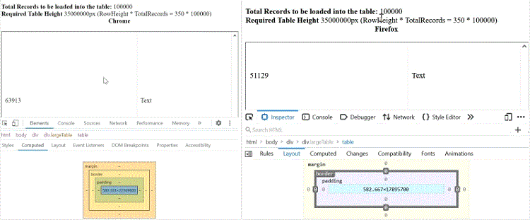
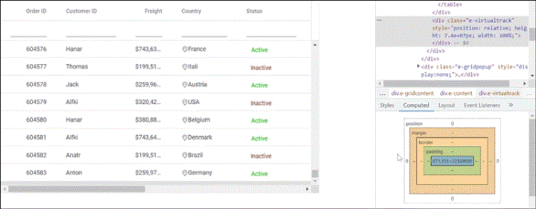
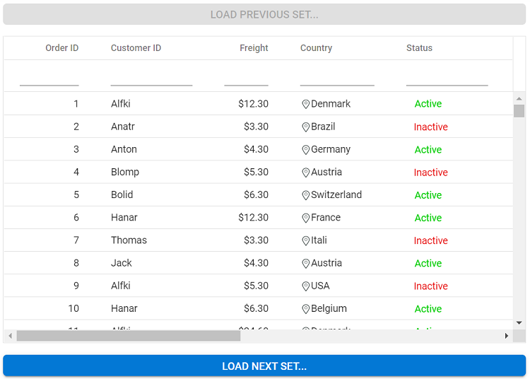
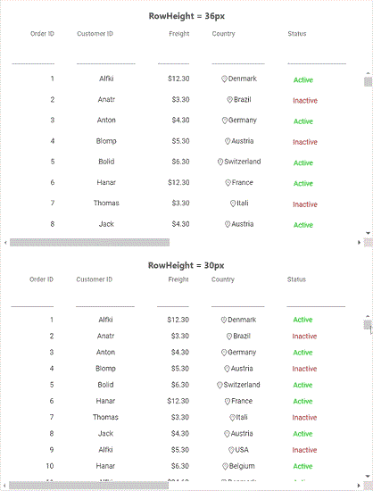

# Virtual Scrolling in React Grid Component

The virtual scrolling feature in the Syncfusion<sup style="font-size:70%">&reg;</sup> Grid seamlessly handles and displays large amounts of data without performance degradation. It improves the rendering process by loading only the visible rows in the grid viewport, rather than rendering the entire dataset at once. This powerful capability is essential when dealing with datasets that contain thousands of records.

To use the virtual scrolling feature, inject the `VirtualScroll` module into the Grid component's `Inject` services array as shown below:

```tsx
import { Inject, VirtualScroll } from '@syncfusion/ej2-react-grids';

<GridComponent>
  <Inject services={[VirtualScroll]} />
</GridComponent>
```

## Row virtualization

Row virtualization loads and renders rows only in the content viewport. It provides an effective alternative to traditional paging where data is loaded dynamically while scrolling vertically, rather than loading all the data at once. This approach significantly improves performance and reduces the initial load time when dealing with large datasets.

Row virtualization setup requires defining the [enableVirtualization](https://ej2.syncfusion.com/react/documentation/api/grid#enablevirtualization) property to `true` and specifying content height using the [height](https://ej2.syncfusion.com/react/documentation/api/grid#height) property in the grid configuration.

The grid displays records based on the content area height. The [pageSettings.pageSize](https://ej2.syncfusion.com/react/documentation/api/grid/pageSettingsModel#pagesize) property explicitly defines the visible number of records. The loaded data is cached and reused when needed in the future.
















 

### Limitations 

* Row virtual scrolling is not compatible with the following features:
    1. Batch editing
    2. Detail template
    3. Row template
    4. Rowspan
    5. Autofill
    6. Hierarchy grid
* When row virtual scrolling is activated, copy-paste and drag-and-drop operations are limited to data items visible in the current viewport.
* Cell-based selection is not supported for row virtual scrolling.
* Using different row heights with a template column (when template height differs per row) is not supported.
* Group expand and collapse state is not persisted for remote data.
* The maximum number of records loaded by the grid is limited by the browser's height capability.
* Grid content height is calculated using row height and total record count; features that change row height (such as text wrapping) are not supported.
* To accommodate content with increased row height, specify the row height as shown below to ensure all table rows maintain the same height:

    ```css
    .e-grid .e-row {
        height: 2em;
    }
    ```
* Since data is virtualized in the grid, aggregated information and total group items display based on current view items. To retrieve this information regardless of view items, refer to the [Group with paging](https://ej2.syncfusion.com/react/documentation/grid/grouping/grouping#group-with-paging) topic. 
* It is necessary to set a static height for the component or its parent container when using row virtualization. The 100% height will work only if the component height is set to 100%, and its parent container has a static height.

## Column virtualization

Column virtualization feature in the grid optimizes the rendering of columns by displaying only the columns that are currently within the viewport. It enables seamless horizontal scrolling to view additional columns. This powerful feature significantly improves performance and reduces the initial loading time when dealing with grids that have a large number of columns.

Column virtualization configuration requires setting the [enableColumnVirtualization](https://ej2.syncfusion.com/react/documentation/api/grid#enablecolumnvirtualization) property of the grid to `true`. This configuration instructs the grid to render only the columns currently visible in the viewport.

The following example demonstrates toggling column virtualization using the `enableColumnVirtualization` property based on a [Switch](https://ej2.syncfusion.com/react/documentation/switch/getting-started) component [change](https://ej2.syncfusion.com/react/documentation/api/switch#change) event:




import { ColumnDirective, ColumnsDirective, GridComponent } from '@syncfusion/ej2-react-grids';
import { Inject, VirtualScroll, Edit, Toolbar } from '@syncfusion/ej2-react-grids';
import * as React from 'react';
import { dataSource } from './virtualData';
function App() {
    const data = dataSource();
    const editOptions = { allowEditing: true, allowAdding: true, allowDeleting: true };
    const toolbarOptions = ['Add', 'Edit', 'Delete', 'Update', 'Cancel'];
    const rules = { required: true };
    return (<GridComponent dataSource={data} height={300} enableVirtualization={true} enableColumnVirtualization={true} pageSettings={{ pageSize: 50 }} editSettings={editOptions} toolbar={toolbarOptions}>
            <Inject services={[VirtualScroll, Edit, Toolbar]}/>
            <ColumnsDirective>
                <ColumnDirective field='SNo' headerText='S.No' width='120' isPrimaryKey={true} validationRules={rules}/>
                <ColumnDirective field='FIELD1' headerText='Player Name' width='140' editType='dropdownedit' validationRules={rules}/>
                <ColumnDirective field='FIELD2' headerText='Year' width='120' textAlign='Right'/>
                <ColumnDirective field='FIELD3' headerText='Stint' width='120' textAlign='Right'/>
                <ColumnDirective field='FIELD4' headerText='TMID' width='120' textAlign='Right'/>
                <ColumnDirective field='FIELD5' headerText='LGID' width='120' textAlign='Right'/>
                <ColumnDirective field='FIELD6' headerText='GP' width='120' textAlign='Right'/>
                <ColumnDirective field='FIELD7' headerText='GS' width='120' textAlign='Right'/>
                <ColumnDirective field='FIELD8' headerText='Minutes' width='120' textAlign='Right'/>
                <ColumnDirective field='FIELD9' headerText='Points' width='120' textAlign='Right'/>
                <ColumnDirective field='FIELD10' headerText='oRebounds' width='130' textAlign='Right'/>
                <ColumnDirective field='FIELD11' headerText='dRebounds' width='130' textAlign='Right'/>
                <ColumnDirective field='FIELD12' headerText='Rebounds' width='120' textAlign='Right'/>
                <ColumnDirective field='FIELD13' headerText='Assists' width='120' textAlign='Right'/>
                <ColumnDirective field='FIELD14' headerText='Steals' width='120' textAlign='Right'/>
                <ColumnDirective field='FIELD15' headerText='Blocks' width='120' textAlign='Right'/>
                <ColumnDirective field='FIELD16' headerText='Turnovers' width='130' textAlign='Right'/>
                <ColumnDirective field='FIELD17' headerText='PF' width='130' textAlign='Right'/>
                <ColumnDirective field='FIELD18' headerText='fgAttempted' width='150' textAlign='Right'/>
                <ColumnDirective field='FIELD19' headerText='fgMade' width='120' textAlign='Right'/>
                <ColumnDirective field='FIELD20' headerText='ftAttempted' width='150' textAlign='Right'/>
                <ColumnDirective field='FIELD21' headerText='ftMade' width='120' textAlign='Right'/>
                <ColumnDirective field='FIELD22' headerText='ThreeAttempted' width='150' textAlign='Right'/>
                <ColumnDirective field='FIELD23' headerText='ThreeMade' width='130' textAlign='Right'/>
                <ColumnDirective field='FIELD24' headerText='PostGP' width='120' textAlign='Right'/>
                <ColumnDirective field='FIELD25' headerText='PostGS' width='120' textAlign='Right'/>
                <ColumnDirective field='FIELD26' headerText='PostMinutes' width='120' textAlign='Right'/>
                <ColumnDirective field='FIELD27' headerText='PostPoints' width='130' textAlign='Right'/>
                <ColumnDirective field='FIELD28' headerText='PostoRebounds' width='130' textAlign='Right'/>
                <ColumnDirective field='FIELD29' headerText='PostdRebounds' width='130' textAlign='Right'/>
                <ColumnDirective field='FIELD30' headerText='PostRebounds' width='130' textAlign='Right' editType='numericedit' validationRules={rules}/>
            </ColumnsDirective>
            </GridComponent>);
}
;
export default App;






import { ColumnDirective, ColumnsDirective, GridComponent } from '@syncfusion/ej2-react-grids';
import { Inject, VirtualScroll, Edit, Toolbar, EditSettingsModel, ToolbarItems } from '@syncfusion/ej2-react-grids';
import * as React from 'react';
import { dataSource } from './virtualData';

function App() {  
  const data: object[] = dataSource();
  const editOptions: EditSettingsModel = { allowEditing: true, allowAdding: true, allowDeleting: true };
  const toolbarOptions: ToolbarItems[] = ['Add', 'Edit', 'Delete', 'Update', 'Cancel'];
  const rules: object = { required: true };
    return (<GridComponent dataSource={data} height={300} enableVirtualization={true}
            enableColumnVirtualization={true} pageSettings={{ pageSize: 50 }} editSettings={editOptions} toolbar={toolbarOptions}>
            <Inject services={[VirtualScroll, Edit, Toolbar]} />
            <ColumnsDirective>
                <ColumnDirective field='SNo' headerText='S.No' width='120' isPrimaryKey={true} validationRules={rules}/>
                <ColumnDirective field='FIELD1' headerText='Player Name' width='140' editType='dropdownedit' validationRules={rules}/>
                <ColumnDirective field='FIELD2' headerText='Year' width='120' textAlign='Right'/>
                <ColumnDirective field='FIELD3' headerText='Stint' width='120' textAlign='Right'/>
                <ColumnDirective field='FIELD4' headerText='TMID' width='120' textAlign='Right'/>
                <ColumnDirective field='FIELD5' headerText='LGID' width='120' textAlign='Right'/>
                <ColumnDirective field='FIELD6' headerText='GP' width='120' textAlign='Right'/>
                <ColumnDirective field='FIELD7' headerText='GS' width='120' textAlign='Right'/>
                <ColumnDirective field='FIELD8' headerText='Minutes' width='120' textAlign='Right'/>
                <ColumnDirective field='FIELD9' headerText='Points' width='120' textAlign='Right'/>
                <ColumnDirective field='FIELD10' headerText='oRebounds' width='130' textAlign='Right'/>
                <ColumnDirective field='FIELD11' headerText='dRebounds' width='130' textAlign='Right'/>
                <ColumnDirective field='FIELD12' headerText='Rebounds' width='120' textAlign='Right'/>
                <ColumnDirective field='FIELD13' headerText='Assists' width='120' textAlign='Right'/>
                <ColumnDirective field='FIELD14' headerText='Steals' width='120' textAlign='Right'/>
                <ColumnDirective field='FIELD15' headerText='Blocks' width='120' textAlign='Right'/>
                <ColumnDirective field='FIELD16' headerText='Turnovers' width='130' textAlign='Right'/>
                <ColumnDirective field='FIELD17' headerText='PF' width='130' textAlign='Right'/>
                <ColumnDirective field='FIELD18' headerText='fgAttempted' width='150' textAlign='Right'/>
                <ColumnDirective field='FIELD19' headerText='fgMade' width='120' textAlign='Right'/>
                <ColumnDirective field='FIELD20' headerText='ftAttempted' width='150' textAlign='Right'/>
                <ColumnDirective field='FIELD21' headerText='ftMade' width='120' textAlign='Right'/>
                <ColumnDirective field='FIELD22' headerText='ThreeAttempted' width='150' textAlign='Right'/>
                <ColumnDirective field='FIELD23' headerText='ThreeMade' width='130' textAlign='Right'/>
                <ColumnDirective field='FIELD24' headerText='PostGP' width='120' textAlign='Right'/>
                <ColumnDirective field='FIELD25' headerText='PostGS' width='120' textAlign='Right'/>
                <ColumnDirective field='FIELD26' headerText='PostMinutes' width='120' textAlign='Right'/>
                <ColumnDirective field='FIELD27' headerText='PostPoints' width='130' textAlign='Right'/>
                <ColumnDirective field='FIELD28' headerText='PostoRebounds' width='130' textAlign='Right'/>
                <ColumnDirective field='FIELD29' headerText='PostdRebounds' width='130' textAlign='Right'/>
                <ColumnDirective field='FIELD30' headerText='PostRebounds' width='130' textAlign='Right' editType='numericedit' validationRules={rules}/>
            </ColumnsDirective>
            </GridComponent>)
};
export default App;







 

> Column's [width](https://ej2.syncfusion.com/react/documentation/api/grid/column#width) is required for column virtualization. If column's width is not defined then grid will consider its value as "200px".

### Limitations 

* Column width must be specified in pixels; percentage values are not accepted.
* Column selection is retained only within the viewport. When new columns load, previously visible column selections are lost.
* Fixed positioning applies only to viewport columns. When scrolling to new columns, fixed positioning is removed.
* Cell selection is not supported for column virtual scrolling.
* <kbd>Ctrl + Home</kbd> and <kbd>Ctrl + End</kbd> keyboard shortcuts are not supported with column virtual scrolling.

**Compatible features** (work within viewport):
* Column resizing
* Column reordering
* Auto-fit
* Print
* Clipboard operations
* Column menu with AutofitAll and Grouping options

**Incompatible features**:
* Grouping
* Column spanning
* Batch editing
* Stacked header
* Row template
* Detail template
* Hierarchy grid
* Autofill
        
## Browser height limitation in virtual scrolling and solutions

Virtual scrolling enables loading millions of records efficiently by rendering rows on-demand while scrolling vertically. The grid lightens the browser's load by minimizing DOM elements and rendering only visible elements in the viewport. Grid height is calculated using: Total records count × [Row Height](https://ej2.syncfusion.com/react/documentation/api/grid#rowheight).

Browsers enforce maximum pixel height limitations on scroll bar elements. When element height exceeds the browser's maximum limit, content above that threshold cannot be scrolled. This limitation directly affects virtual scrolling: when large datasets bind to the grid, it displays only records until reaching the browser's height limit, preventing users from scrolling to view remaining records.

**Example:** With row height set to 30px and 1,000,000 total records, the grid element height would be 30,000,000 pixels. However, most browsers have a maximum height limit of approximately 22,369,600 pixels (this varies by browser). Records above this limit cannot be accessed, preventing access to remaining records.

**Note:** This limitation is built into browser rendering, not grid-specific. The same constraint applies to standard HTML tables.

The following image illustrates the height limitation issue of a normal HTML table in different browsers (Chrome and Firefox).



Grid component also faced the same issue as mentioned in the below image.



The grid has an option to overcome this limitation of the browser in the following ways.

### Solution 1: Loading data in segments with external buttons

Data segmentation approach prevents browser height limitations by loading records in manageable chunks. Navigation between segments uses **Load Next Set** and **Load Previous Set** buttons, enabling access to millions of records while staying within browser height limits.

**Example:** Display 2 million records in four 0.5-million-record segments. The grid scrolls 0.5 million records at a time. Clicking **Load Next Set** loads the next segment, and clicking **Load Previous Set** loads the previous segment.

**Custom adaptor implementation:**

Create a custom adaptor to handle data segments:

- **Extend** `UrlAdaptor` class
- **Override** the `processQuery` method to handle Skip queries based on current page set  
- **Ensure** all data operations use the complete 2-million-record dataset on the server

```typescript
export class CustomUrlAdaptor extends UrlAdaptor {
    processQuery(args) {
        if (arguments[1].queries) {
            for (var i = 0; i < arguments[1].queries.length; i++) {
                if (arguments[1].queries[i].fn === 'onPage') {
                    // pageSet: number of segments dividing 2 million records (values: 1, 2, 3, 4)
                    // maxRecordsPerPageSet: 0.5 million records per segment
                    // gridPageSize: pageSize defined in Grid pageSettings
                    // Customize pageIndex including previous pageSet data
                    arguments[1].queries[i].e.pageIndex = (((pageSet - 1) * maxRecordsPerPageSet) / gridPageSize) + arguments[1].queries[i].e.pageIndex;
                }
            }
        }
        let original = super.processQuery.apply(this, arguments);
        return original;
    }
}
this.dataManager = new DataManager({
    adaptor: new CustomUrlAdaptor(),
    url: "Home/UrlDatasource"
});
```

**Grid configuration with DataManager:**

The grid renders with virtualization enabled and the custom DataManager:

```typescript
<GridComponent 
    id='grid' 
    ref={g => this.grid = g} 
    dataSource={this.dataManager} 
    enableVirtualization={true} 
    pageSettings={this.pageSettings} 
    height={360} 
    beforeDataBound={this.beforeDataBound}
>
    <ColumnsDirective>
        <ColumnDirective field='OrderID' headerText='Order ID' width='100' textAlign="Right"/>
        {/* Additional columns... */}
    </ColumnsDirective>
</GridComponent>
```

**beforeDataBound event handler configuration:**

The `beforeDataBound` event handler sets the `args.count` property to 0.5 million, enabling scrolling within the current segment. All data operations continue using the full dataset through the custom adaptor:

```typescript
beforeDataBound(args) {
    // Store total records count (2 million)
    totalRecords = args.count;

    // Adjust count for current segment (maxRecordsPerPageSet = 500000)
    args.count = args.count - ((pageSet - 1) * maxRecordsPerPageSet) > maxRecordsPerPageSet 
        ? maxRecordsPerPageSet 
        : args.count - ((pageSet - 1) * maxRecordsPerPageSet);
}
```

**Navigation button implementation:**

The **Load Previous Set** button renders above the grid and the **Load Next Set** button renders below it:

```typescript
<ButtonComponent 
    cssClass='e-info prevbtn' 
    onClick={this.prevBtnClick} 
    style={{ width: '100%' }}
>
    Load Previous Set...
</ButtonComponent>

<GridComponent 
    id='grid' 
    ref={g => this.grid = g} 
    dataSource={this.dataManager} 
    enableVirtualization={true} 
    pageSettings={this.pageSettings} 
    height={360} 
    beforeDataBound={this.beforeDataBound}
>
    <ColumnsDirective>
        <ColumnDirective field='OrderID' headerText='Order ID' width='100' textAlign="Right"/>
        {/* Additional columns... */}
    </ColumnsDirective>
</GridComponent>

<ButtonComponent 
    cssClass='e-info nxtbtn' 
    onClick={this.nxtBtnClick} 
    style={{ width: '100%' }}
>
    Load Next Set...
</ButtonComponent>
```

**Button click event handlers:**

The button click handlers increment or decrement the `pageSet` value and re-render the grid:

```typescript
// Triggered when clicking the Previous/Next button
prevNxtBtnClick(args) {
    if (this.grid.element.querySelector('.e-content') && 
        this.grid.element.querySelector('.e-content').getAttribute('aria-busy') === 'false') {
        // Increase/decrease pageSet based on button clicked
        pageSet = args.target.classList.contains('prevbtn') ? --pageSet : ++pageSet;
        this.rerenderGrid(); // Re-render the Grid component
    }
}
```

> Data operations such as filtering and sorting performed after scrolling through segments operate on the entire 2-million-record dataset, not just the current 0.5-million-record segment. This approach ensures data accuracy across all operations.

The hosted link for this sample is available [here](https://ej2.syncfusion.com/aspnetcore/Load_millions_of_records).



### Solution 2: Reducing row height

Row height reduction accommodates more records within browser height limits. Use the [rowHeight](https://ej2.syncfusion.com/react/documentation/api/grid#rowheight) property to decrease row height, which reduces the grid's total height and allows scrolling through more records.

> Browser height limits may still apply after reducing row height. In such cases, refer to Solution 1 (data segmentation) or Solution 3 (paging) instead.

The following image demonstrates how many records are scrollable when setting rowHeight to "36px" and "30px".



### Solution 3: Paging as alternative approach

Paging provides an alternative approach to virtual scrolling for displaying large datasets. Like virtual scrolling, paging loads data on-demand but divides the dataset into fixed-size pages. Paging is compatible with all grid features including Grouping, Editing, and more, making it ideal for avoiding browser height limitations while maintaining full feature support.
