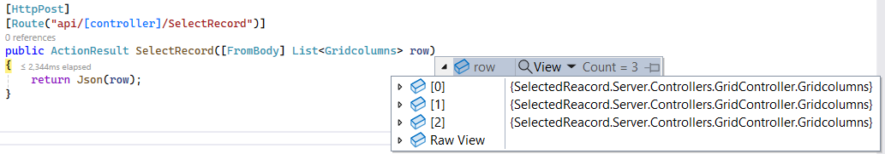

# Row Selection in React Grid Component

Row selection in the Grid component provides interactive selection of specific rows or ranges of rows within the grid. Row selection can be performed effortlessly through mouse clicks or arrow keys (up, down, left, and right). This feature is useful when highlighting, manipulating, or performing actions on specific rows within the grid.

> To enable row selection, set the [selectionSettings.mode](https://ej2.syncfusion.com/react/documentation/api/grid/selectionSettings#mode) property to either `Row` or `Both`. This property determines the selection mode of the grid.

## Single row selection 

Single row selection provides selecting a single row at a time within the grid. This feature is useful when focusing on specific rows or performing actions on the data within a particular row.

To configure single row selection, set the [selectionSettings.mode](https://ej2.syncfusion.com/react/documentation/api/grid/selectionSettings#mode) property to `Row` and the [selectionSettings.type](https://ej2.syncfusion.com/react/documentation/api/grid/selectionSettings#type) property to `Single`. This configuration allows selecting only one row at a time within the grid.

The following example demonstrates single row selection in Grid component:
















 

## Multiple row selection 

Multiple row selection provides option to select multiple rows within the grid. This feature is useful when performing actions on several rows simultaneously or focusing on specific data areas.

To configure multiple row selection, set the [selectionSettings.mode](https://ej2.syncfusion.com/react/documentation/api/grid/selectionSettings#mode) property to `Row` and the [selectionSettings.type](https://ej2.syncfusion.com/react/documentation/api/grid/selectionSettings#type) property to `Multiple`. This configuration allows selecting multiple rows at a time within the grid.

The following example demonstrates multiple rows selection in Grid component:
















 

## Select row at initial rendering 

A specific row can be selected during the initial rendering of the Grid component. This feature is particularly useful when highlighting or pre-selecting a specific row in the grid. To achieve this, utilize the [selectedRowIndex](https://ej2.syncfusion.com/react/documentation/api/grid#selectedrowindex) property provided by the Grid component.

The following example demonstrates selecting a row at initial rendering:
















 

## Select rows in any page based on index value 

The Grid allows selecting rows in any page based on their index value. This feature is useful when performing specific actions on rows, such as highlighting, applying styles, or executing operations, regardless of their location across multiple pages within the grid.

To achieve this, utilize the [selectRow](https://ej2.syncfusion.com/react/documentation/api/grid#selectrow) method and the [goToPage](https://ej2.syncfusion.com/react/documentation/api/grid#gotopage) method of the grid control. By handling the [change](https://ej2.syncfusion.com/react/documentation/api/drop-down-list#change) event of the `DropDownList` component, implement the logic to navigate to the desired page and select the row based on the index value. 

Additionally, by handling the [actionComplete](https://ej2.syncfusion.com/react/documentation/api/grid#actioncomplete) event of the grid, maintain the selection of the desired row after completing the paging action.

The following example demonstrates how to select rows in any page based on index value using `actionComplete` and `change` event:




import { ChangeEventArgs, DropDownListComponent } from '@syncfusion/ej2-react-dropdowns'
import { ColumnDirective, ColumnsDirective, GridComponent, Page, PageSettingsModel, Inject, PageEventArgs } from '@syncfusion/ej2-react-grids';
import * as React from 'react';
import { data } from './datasource';

function App() {
  let grid;
  const pageSettings = { pageSize: 10 }
  let mod;
  let value;
  const ddlData = [
    { text: 'Select row index' },
    { text: '1', value: '1' },
    { text: '2', value: '2' },
    { text: '30', value: '30' },
    { text: '80', value: '80' },
    { text: '110', value: '110' },
    { text: '120', value: '120' },
    { text: '210', value: '210' },
    { text: '310', value: '310' },
    { text: '410', value: '410' },
    { text: '230', value: '230' }
  ]
  const actionComplete = (args) => {
    if (args.requestType === "paging") {
      grid.selectRow(mod);
    }
  }
  const valueChange = (args) => {
    value = +args.value;
    mod = (value - 1) % 10;
    const page = Math.ceil(value / 10);

    if (page === 1) {
      if (grid.pagerModule.pagerObj.currentPage !== 1) {
        grid.pagerModule.goToPage(1);
      }
      grid.selectRow(mod);
    }
    else {
      grid.pagerModule.goToPage(page);
      if (grid.pagerModule.pagerObj.currentPage === page) {
        grid.selectRow(mod);
      }
    }
  }

  return (<div>
    <label style={{ padding: "30px 20px 0 0" }} > Select Row :</label>
    <DropDownListComponent index={0} width={150} dataSource={ddlData} change={valueChange}></DropDownListComponent>
    <GridComponent ref={g => grid = g} dataSource={data} actionComplete={actionComplete} allowPaging={true} pageSettings={pageSettings}>
      <ColumnsDirective>
        <ColumnDirective field='OrderID' headerText='Order ID' width='120' textAlign="Right" />
        <ColumnDirective field='CustomerID' headerText='Customer ID' width='150' />
        <ColumnDirective field='Freight' headerText='Freight' width='150' format='C2' textAlign="Right" />
        <ColumnDirective field='ShipCountry' headerText='Ship Country' width='100' />
      </ColumnsDirective>
      <Inject services={[Page]} />
    </GridComponent></div>)
};
export default App;




import { ChangeEventArgs, DropDownListComponent } from '@syncfusion/ej2-react-dropdowns'
import { ColumnDirective, ColumnsDirective, GridComponent, Page, PageSettingsModel, Inject, PageEventArgs } from '@syncfusion/ej2-react-grids';
import * as React from 'react';
import { data } from './datasource';

function App() {
  let grid: GridComponent | null;
  const pageSettings: PageSettingsModel = { pageSize: 10 }
  let mod;
  let value;
  const ddlData: { [key: string]: Object; }[] = [
    { text: 'Select row index' },
    { text: '1', value: '1' },
    { text: '2', value: '2' },
    { text: '30', value: '30' },
    { text: '80', value: '80' },
    { text: '110', value: '110' },
    { text: '120', value: '120' },
    { text: '210', value: '210' },
    { text: '310', value: '310' },
    { text: '410', value: '410' },
    { text: '230', value: '230' }
  ]
  const actionComplete = (args: PageEventArgs) => {
    if (args.requestType === "paging") {
      (grid as GridComponent).selectRow(mod);
    }
  }
  const valueChange = (args: ChangeEventArgs) => {
    value = +args.value;
    mod = (value - 1) % 10;
    const page = Math.ceil(value / 10);

    if (page === 1) {
      if ((grid as GridComponent).pagerModule.pagerObj.currentPage !== 1) {
        (grid as GridComponent).pagerModule.goToPage(1);
      }
      (grid as GridComponent).selectRow(mod);
    }
    else {
      (grid as GridComponent).pagerModule.goToPage(page);
      if ((grid as GridComponent).pagerModule.pagerObj.currentPage === page) {
        (grid as GridComponent).selectRow(mod);
      }
    }
  }

  return (<div>
    <label style={{ padding: "30px 20px 0 0" }} > Select Row :</label>
    <DropDownListComponent index={0} width={150} dataSource={ddlData} change={valueChange}></DropDownListComponent>
    <GridComponent ref={g => grid = g} dataSource={data} actionComplete={actionComplete} allowPaging={true} pageSettings={pageSettings}>
      <ColumnsDirective>
        <ColumnDirective field='OrderID' headerText='Order ID' width='120' textAlign="Right" />
        <ColumnDirective field='CustomerID' headerText='Customer ID' width='150' />
        <ColumnDirective field='Freight' headerText='Freight' width='150' format='C2' textAlign="Right" />
        <ColumnDirective field='ShipCountry' headerText='Ship Country' width='100' />
      </ColumnsDirective>
      <Inject services={[Page]} />
    </GridComponent></div>)
};
export default App;










 

## Multiple row selection by single click 

The Grid component allows multiple row selection by simply clicking on rows one by one without pressing CTRL or SHIFT keys. When clicking on a row, it becomes selected, and clicking on another row adds it to the selection without deselecting the previously selected rows. To deselect a previously selected row, click on the row again.

To configure simple multiple row selection, set the [selectionSettings.enableSimpleMultiRowSelection](https://ej2.syncfusion.com/react/documentation/api/grid/selectionSettings#enablesimplemultirowselection) property to `true`. 

The following example demonstrates how to configure multiple row selection with a single click on the grid row using `enableSimpleMultiRowSelection` property:




import { SwitchComponent } from '@syncfusion/ej2-react-buttons'
import { ColumnDirective, ColumnsDirective, GridComponent, SelectionSettingsModel } from '@syncfusion/ej2-react-grids';
import * as React from 'react';
import { data } from './datasource';

function App() {
  let grid
  const selectionSettings = { type: 'Multiple' };
  const valueChange = (args) => {
    grid.selectionSettings.enableSimpleMultiRowSelection = args.checked;
  }

  return (<div>
    <label style={{ padding: "30px 20px 0 0" }} > Enable/Disable simple multiple row selection </label>
    <SwitchComponent change={valueChange}></SwitchComponent>
    <GridComponent ref={g => grid = g} dataSource={data} selectionSettings={selectionSettings} >
      <ColumnsDirective>
        <ColumnDirective field='OrderID' headerText='Order ID' width='120' textAlign="Right" />
        <ColumnDirective field='CustomerID' headerText='Customer ID' width='150' />
        <ColumnDirective field='ShipCity' headerText='ShipCity' width='150' />
        <ColumnDirective field='ShipName' headerText='Ship Name' width='100' />
      </ColumnsDirective>
    </GridComponent></div>)
};
export default App;




import { ChangeEventArgs, SwitchComponent } from '@syncfusion/ej2-react-buttons'
import { ColumnDirective, ColumnsDirective, GridComponent, SelectionSettingsModel } from '@syncfusion/ej2-react-grids';
import * as React from 'react';
import { data } from './datasource';

function App() {
  let grid: GridComponent | null
  const selectionSettings: SelectionSettingsModel = { type: 'Multiple' };
  const valueChange = (args: ChangeEventArgs) => {
    (grid as GridComponent).selectionSettings.enableSimpleMultiRowSelection = args.checked;
  }

  return (<div>
    <label style={{ padding: "30px 20px 0 0" }} > Enable/Disable simple multiple row selection </label>
    <SwitchComponent change={valueChange}></SwitchComponent>
    <GridComponent ref={g => grid = g} dataSource={data} selectionSettings={selectionSettings} >
      <ColumnsDirective>
        <ColumnDirective field='OrderID' headerText='Order ID' width='120' textAlign="Right" />
        <ColumnDirective field='CustomerID' headerText='Customer ID' width='150' />
        <ColumnDirective field='ShipCity' headerText='Ship City' width='150' />
        <ColumnDirective field='ShipName' headerText='Ship Name' width='100' />
      </ColumnsDirective>
    </GridComponent></div>)
};
export default App;










 

## Select rows programmatically 

Single row selection, multiple row selection, and range of row selection can be performed externally in a grid using built-in methods. This feature allows interacting with specific rows within the grid programmatically.

### Single row selection

To achieve single row selection, use the [selectRow](https://ej2.syncfusion.com/react/documentation/api/grid/selection#selectrow) method. This method allows programmatic selection of a specific row within the grid by specifying the row index.

The example below demonstrates single row selection in the grid. The row index is obtained from a textbox component and passed to the `selectRow` method. Upon clicking the "Select Row" button, the corresponding row is selected:




import { TextBoxComponent } from '@syncfusion/ej2-react-inputs'
import { ButtonComponent } from '@syncfusion/ej2-react-buttons'
import { ColumnDirective, ColumnsDirective, GridComponent, SelectionSettingsModel } from '@syncfusion/ej2-react-grids';
import * as React from 'react';
import { data } from './datasource';

function App() {
  let grid;
  let textBoxRow;
  let rowIndex;
  const selectionSettings = { mode: 'Row', type: 'Single' };
  const click = () => {
    rowIndex = parseInt(textBoxRow.element.value, 10);
    if (!isNaN(rowIndex)) {
      grid.selectRow(rowIndex);
    }
  }
  return (<div>
    <div>
      <label style={{ padding: "30px 17px 0 0" }}>Enter the row index: </label>
      <TextBoxComponent ref={t1 => textBoxRow = t1} width={120} ></TextBoxComponent>
    </div>
    <div style={{ padding: "10px 0 0px 5%" }}>
      <ButtonComponent id='button' onClick={click}>Select Row</ButtonComponent>
    </div>
    <GridComponent ref={g => grid = g} dataSource={data} selectionSettings={selectionSettings}>
      <ColumnsDirective>
        <ColumnDirective field='OrderID' headerText='Order ID' width='120' textAlign="Right" />
        <ColumnDirective field='CustomerID' headerText='Customer ID' width='150' />
        <ColumnDirective field='ShipCountry' headerText='Ship Country' width='100' />
        <ColumnDirective field='Freight' headerText='Freight' width='150' format='C2' textAlign="Right" />
      </ColumnsDirective>
    </GridComponent></div>)
};
export default App;




import { TextBoxComponent } from '@syncfusion/ej2-react-inputs'
import { ButtonComponent } from '@syncfusion/ej2-react-buttons'
import { ColumnDirective, ColumnsDirective, GridComponent, SelectionSettingsModel } from '@syncfusion/ej2-react-grids';
import * as React from 'react';
import { data } from './datasource';

function App() {
  let grid: GridComponent | null;
  let textBoxRow: TextBoxComponent | null;
  let rowIndex: number;
  const selectionSettings: SelectionSettingsModel = { mode: 'Row', type: 'Single' };
  const click = () => {
    rowIndex = parseInt((textBoxRow as TextBoxComponent).element.value, 10);
    if (!isNaN(rowIndex)) {
      (grid as GridComponent).selectRow(rowIndex);
    }
  }
  return (<div>
    <div>
      <label style={{ padding: "30px 17px 0 0" }}>Enter the row index: </label>
      <TextBoxComponent ref={t1 => textBoxRow = t1} width={120} ></TextBoxComponent>
    </div>
    <div style={{ padding: "10px 0 0px 5%" }}>
      <ButtonComponent id='button' onClick={click}>Select Row</ButtonComponent>
    </div>
    <GridComponent ref={g => grid = g} dataSource={data} selectionSettings={selectionSettings}>
      <ColumnsDirective>
        <ColumnDirective field='OrderID' headerText='Order ID' width='120' textAlign="Right" />
        <ColumnDirective field='CustomerID' headerText='Customer ID' width='150' />
        <ColumnDirective field='ShipCountry' headerText='Ship Country' width='100' />
        <ColumnDirective field='Freight' headerText='Freight' width='150' format='C2' textAlign="Right" />
      </ColumnsDirective>
    </GridComponent></div>)
};
export default App;










 

### Multiple rows selection

To achieve multiple row selection, use the [selectRows](https://ej2.syncfusion.com/react/documentation/api/grid/selection#selectrows) method. This method allows selecting a collection of rows by specifying their indexes, providing the ability to interact with multiple rows together.

The following example demonstrates selecting multiple rows in the grid by calling the `selectRows` method within the button click event and passing an array of row indexes as arguments.




import { ButtonComponent } from '@syncfusion/ej2-react-buttons'
import { ColumnDirective, ColumnsDirective, GridComponent, SelectionSettingsModel } from '@syncfusion/ej2-react-grids';
import * as React from 'react';
import { data } from './datasource';

function App() {
  let grid;
  const selectionSettings = { mode: 'Row', type: 'Multiple' };
  const buttonClick = (rowIndexes) => {
    grid.clearRowSelection();
    grid.selectRows(rowIndexes);
  }
  return (<div>
    <div style={{ padding: " 0px 0px 20px 0px" }}>
      <ButtonComponent className='btn' onClick={() => buttonClick([1, 3])}>Select [1, 3]</ButtonComponent>
      <ButtonComponent className='btn' onClick={() => buttonClick([0, 2])}>Select [0, 2]</ButtonComponent>
      <ButtonComponent className='btn' onClick={() => buttonClick([2, 4])}>Select [2, 4]</ButtonComponent>
      <ButtonComponent className='btn' onClick={() => buttonClick([0, 5])}>Select [0, 5]</ButtonComponent>
      <ButtonComponent className='btn' onClick={() => buttonClick([1, 6])}>Select [1, 6]</ButtonComponent>
    </div>
    <div style={{ padding: " 0px 0px 20px 0px" }}>
      <ButtonComponent className='btn' onClick={() => buttonClick([0, 7, 8])}>Select [0, 7, 8]</ButtonComponent>
      <ButtonComponent className='btn' onClick={() => buttonClick([1, 9, 10])}>Select [1, 9, 10]</ButtonComponent>
      <ButtonComponent className='btn' onClick={() => buttonClick([4, 7, 12])}>Select [4, 7, 12]</ButtonComponent>
      <ButtonComponent className='btn' onClick={() => buttonClick([2, 5, 6])}>Select [2, 5, 6]</ButtonComponent>
    </div>
    <GridComponent ref={g => grid = g} dataSource={data} selectionSettings={selectionSettings}>
      <ColumnsDirective>
        <ColumnDirective field='OrderID' headerText='Order ID' width='120' textAlign="Right" />
        <ColumnDirective field='CustomerID' headerText='Customer ID' width='150' />
        <ColumnDirective field='ShipCountry' headerText='Ship Country' width='100' />
        <ColumnDirective field='Freight' headerText='Freight' width='150' format='C2' textAlign="Right" />
      </ColumnsDirective>
    </GridComponent></div>)
};
export default App;




import { ButtonComponent } from '@syncfusion/ej2-react-buttons'
import { ColumnDirective, ColumnsDirective, GridComponent, SelectionSettingsModel } from '@syncfusion/ej2-react-grids';
import * as React from 'react';
import { data } from './datasource';

function App() {
  let grid: GridComponent | null;
  const selectionSettings: SelectionSettingsModel = { mode: 'Row', type: 'Multiple' };
  const buttonClick = (rowIndexes: number[]) => {
    (grid as GridComponent).clearRowSelection();
    (grid as GridComponent).selectRows(rowIndexes);
  }
  return (<div>
    <div style={{ padding: " 0px 0px 20px 0px" }}>
      <ButtonComponent className='btn' onClick={() => buttonClick([1, 3])}>Select [1, 3]</ButtonComponent>
      <ButtonComponent className='btn' onClick={() => buttonClick([0, 2])}>Select [0, 2]</ButtonComponent>
      <ButtonComponent className='btn' onClick={() => buttonClick([2, 4])}>Select [2, 4]</ButtonComponent>
      <ButtonComponent className='btn' onClick={() => buttonClick([0, 5])}>Select [0, 5]</ButtonComponent>
      <ButtonComponent className='btn' onClick={() => buttonClick([1, 6])}>Select [1, 6]</ButtonComponent>
    </div>
    <div style={{ padding: " 0px 0px 20px 0px" }}>
      <ButtonComponent className='btn' onClick={() => buttonClick([0, 7, 8])}>Select [0, 7, 8]</ButtonComponent>
      <ButtonComponent className='btn' onClick={() => buttonClick([1, 9, 10])}>Select [1, 9, 10]</ButtonComponent>
      <ButtonComponent className='btn' onClick={() => buttonClick([4, 7, 12])}>Select [4, 7, 12]</ButtonComponent>
      <ButtonComponent className='btn' onClick={() => buttonClick([2, 5, 6])}>Select [2, 5, 6]</ButtonComponent>
    </div>
    <GridComponent ref={g => grid = g} dataSource={data} selectionSettings={selectionSettings}>
      <ColumnsDirective>
        <ColumnDirective field='OrderID' headerText='Order ID' width='120' textAlign="Right" />
        <ColumnDirective field='CustomerID' headerText='Customer ID' width='150' />
        <ColumnDirective field='ShipCountry' headerText='Ship Country' width='100' />
        <ColumnDirective field='Freight' headerText='Freight' width='150' format='C2' textAlign="Right" />
      </ColumnsDirective>
    </GridComponent></div>)
};
export default App;










 

### Select range of rows

Range selection in the grid provides selecting a continuous range of rows within the grid. This feature is particularly useful when performing actions on multiple rows simultaneously or focusing on a specific range of data.

To achieve range selection, use the [selectRowsByRange](https://ej2.syncfusion.com/react/documentation/api/grid/selection#selectrowsbyrange) method. This method selects a range of rows from start and end row indexes.
 
The following example demonstrates selecting a range of rows within the grid by obtaining the selected rows start index and end index through textbox components. Then pass these start index and end index as arguments to the `selectRowsByRange` method. When the "Select Rows" button is clicked, a range of rows is selected within the grid:




import { TextBoxComponent } from '@syncfusion/ej2-react-inputs'
import { ButtonComponent } from '@syncfusion/ej2-react-buttons'
import { ColumnDirective, ColumnsDirective, GridComponent, SelectionSettingsModel } from '@syncfusion/ej2-react-grids';
import * as React from 'react';
import { data } from './datasource';

function App() {
  let grid;
  let textBox1;
  let textBox2;
  let startRowIndex;
  let endRowIndex;
  const selectionSettings = { mode: 'Row', type: 'Multiple' };
  const click = () => {
    startRowIndex = parseInt(textBox1.value, 10);
    endRowIndex = parseInt(textBox2.value, 10);
    grid.selectionModule.clearRowSelection();
    if (!isNaN(startRowIndex) && !isNaN(endRowIndex)) {
      grid.selectRowsByRange(startRowIndex, endRowIndex);
    }
  }
  return (<div>
    <div>
      <label style={{ padding: "30px 17px 0 0" }}>Enter the start row index: </label>
      <TextBoxComponent ref={t1 => textBox1 = t1} width={120} ></TextBoxComponent>
    </div>
    <div>
      <label style={{ padding: "30px 17px 0 0" }}>Enter the end row index: </label>
      <TextBoxComponent ref={t2 => textBox2 = t2} width={120} ></TextBoxComponent>
    </div>
    <div>
      <ButtonComponent id='button' onClick={click}>Select Rows</ButtonComponent>
    </div>
    <GridComponent ref={g => grid = g} dataSource={data} selectionSettings={selectionSettings}>
      <ColumnsDirective>
        <ColumnDirective field='OrderID' headerText='Order ID' width='120' textAlign="Right" />
        <ColumnDirective field='CustomerID' headerText='Customer ID' width='150' />
        <ColumnDirective field='ShipCountry' headerText='Ship Country' width='100' />
        <ColumnDirective field='Freight' headerText='Freight' width='150' format='C2' textAlign="Right" />
      </ColumnsDirective>
    </GridComponent></div>)
};
export default App;




import { TextBoxComponent } from '@syncfusion/ej2-react-inputs'
import { ButtonComponent } from '@syncfusion/ej2-react-buttons'
import { ColumnDirective, ColumnsDirective, GridComponent, SelectionSettingsModel } from '@syncfusion/ej2-react-grids';
import * as React from 'react';
import { data } from './datasource';

function App() {
  let grid: GridComponent | null;
  let textBox1: TextBoxComponent | null;
  let textBox2: TextBoxComponent | null;
  let startRowIndex: number;
  let endRowIndex: number;
  const selectionSettings: SelectionSettingsModel = { mode: 'Row', type: 'Multiple' };
  const click = () => {
    startRowIndex = parseInt((textBox1 as TextBoxComponent).value, 10);
    endRowIndex = parseInt((textBox2 as TextBoxComponent).value, 10);
    (grid as GridComponent).selectionModule.clearRowSelection();
    if (!isNaN(startRowIndex) && !isNaN(endRowIndex)) {
      (grid as GridComponent).selectRowsByRange(startRowIndex, endRowIndex);
    }
  }
  return (<div>
    <div>
      <label style={{ padding: "30px 17px 0 0" }}>Enter the start row index: </label>
      <TextBoxComponent ref={t1 => textBox1 = t1} width={120} ></TextBoxComponent>
    </div>
    <div>
      <label style={{ padding: "30px 17px 0 0" }}>Enter the end row index: </label>
      <TextBoxComponent ref={t2 => textBox2 = t2} width={120} ></TextBoxComponent>
    </div>
    <div>
      <ButtonComponent id='button' onClick={click}>Select Rows</ButtonComponent>
    </div>
    <GridComponent ref={g => grid = g} dataSource={data} selectionSettings={selectionSettings}>
      <ColumnsDirective>
        <ColumnDirective field='OrderID' headerText='Order ID' width='120' textAlign="Right" />
        <ColumnDirective field='CustomerID' headerText='Customer ID' width='150' />
        <ColumnDirective field='ShipCountry' headerText='Ship Country' width='100' />
        <ColumnDirective field='Freight' headerText='Freight' width='150' format='C2' textAlign="Right" />
      </ColumnsDirective>
    </GridComponent></div>)
};
export default App;










 

## Select rows conditionally

Specific rows in the React Grid component can be programmatically selected based on a certain condition. This feature is particularly useful when dynamically highlighting or manipulating specific rows in the grid based on custom conditions. This functionality can be achieved using the [selectRows](https://ej2.syncfusion.com/react/documentation/api/grid#selectrows) method in the [dataBound](https://ej2.syncfusion.com/react/documentation/api/grid#databound) event of the grid.

The following example demonstrates selecting grid rows only when the "Employee ID" column value is greater than "3".
















 

## Get selected row indexes 

The indexes of the currently selected rows in the Grid component can be retrieved. This feature is particularly useful when performing actions or operations specifically on the selected rows. 

To achieve this, invoke the [getSelectedRowIndexes](https://ej2.syncfusion.com/react/documentation/api/grid#getselectedrowindexes) method, which returns an array of selected row indexes.

The following example demonstrates getting selected row indexes using the `getSelectedRowIndexes` method: 
















 

## Get selected records on various pages 

The Grid component allows retrieving the selected records even when navigating to different pages. This feature is useful when working with large data sets and allows performing actions on the selected records across multiple pages. 

To persist the selection across pages, enable the [persistSelection](https://ej2.syncfusion.com/react/documentation/api/grid/selectionSettings#persistselection) property. By default, this property is set to `false`. To enable it, set the value to `true` in the `selectionSettings` property of the Grid component.

To retrieve the selected records from different pages, use the [getSelectedRecords](https://ej2.syncfusion.com/react/documentation/api/grid#getselectedrecords) method. This method returns an array of the selected records.

The following example demonstrates how to retrieve selected records from various pages using the `getSelectedRecords` method and display "Order ID" values of the selected records in a dialog when the "Show Selected Records" button is clicked:
















 

> To persist the grid selection, it is necessary to define any one of the columns as a primary key using the [columns.isPrimaryKey](https://ej2.syncfusion.com/react/documentation/api/grid/column#isprimarykey) property.

## Get selected records

Getting selected records enables retrieving the data of the selected rows from the Grid component. This is particularly useful when performing actions on the selected data or displaying specific information based on the selected rows.

To retrieve the selected records, use the [getSelectedRecords](https://ej2.syncfusion.com/react/documentation/api/grid#getselectedrecords) method. This method enables obtaining an array of objects representing the selected records.

The following example displays the selected row count using the `getSelectedRecords` method:
















 

## Clear row selection programmatically 

Clearing row selection programmatically in the Grid component is a useful feature when removing any existing row selections. To achieve this, use the [clearRowSelection](https://ej2.syncfusion.com/react/documentation/api/grid/selection#clearrowselection) method.

>The `clearRowSelection` method is applicable when the selection [type](https://ej2.syncfusion.com/react/documentation/api/grid/selectionSettings#type) is set to `Multiple` or `Single`.

The following example demonstrates clearing row selection by calling the `clearRowSelection` method in the button click event.
















 

## Row selection events 

The Grid provides several events related to row selection that allow responding to and customizing the behavior of row selection. These events provide control over various aspects of row selection. The following are the available row selection events:

[rowSelecting](https://ej2.syncfusion.com/react/documentation/api/grid#rowselecting): This event is triggered before any row selection occurs. It provides an opportunity to implement custom logic or validation before a row is selected, allowing control over the selection process.

[rowSelected](https://ej2.syncfusion.com/react/documentation/api/grid#rowselected): This event is triggered after a row is successfully selected. Use this event to perform actions or updates when a row is selected.

[rowDeselecting](https://ej2.syncfusion.com/react/documentation/api/grid#rowdeselecting): This event is triggered just before a selected row is deselected. It allows performing custom logic or validation to decide whether the row should be deselected or not.

[rowDeselected](https://ej2.syncfusion.com/react/documentation/api/grid#rowdeselected): This event is triggered when a particular selected row is deselected. Use this event to perform actions or validations when a row is no longer selected.

In the following example, row selection is canceled when the value of "Customer ID" is equal to "VINET" within the `rowSelecting` event. The background color changes to green when the value of "Freight" is greater than 10 and less than or equal to 140, triggering the `rowDeselected` event. The background color changes to red when the value of "Freight" is less than or equal to 10 during the `rowDeselected` event. Furthermore, the background color changes to yellow when the value of "Freight" is greater than 140 during the `rowDeselected` event. A notification message is displayed to indicate which event was triggered whenever a row is selected.
















 

## Pass selected records to server using AJAX

The Syncfusion React Grid enables selecting multiple or single records and sending them to the server using AJAX requests. This feature is useful for scenarios where processing or manipulating selected data on the server side is required.

To achieve passing selected records to the server using AJAX requests in the grid, follow these steps:

**Step 1:** Open Visual Studio and create a "React and ASP.NET Core" project named "SelectedRecord". To create a React and ASP.NET Core application, follow the documentation [link](https://learn.microsoft.com/en-us/visualstudio/javascript/tutorial-asp-net-core-with-react?view=vs-2022) for detailed steps.

**Step 2:** Create a simple React Grid by following the [Getting Started](https://ej2.syncfusion.com/react/documentation/grid/getting-started) documentation link.

**Step 3:** In the React component file (e.g., "App.js"), add a button to trigger the AJAX call and include the grid with necessary configurations. Handle the button [click](https://ej2.syncfusion.com/react/documentation/api/button#click) event to retrieve the selected records using the [getSelectedRecords](https://ej2.syncfusion.com/react/documentation/api/grid#getselectedrecords) method from the grid and send them to the server using AJAX.





import './App.css';
import { ColumnDirective, ColumnsDirective, GridComponent, Selection, Inject } from '@syncfusion/ej2-react-grids';
import { ButtonComponent } from '@syncfusion/ej2-react-buttons';
import { DataManager, UrlAdaptor } from "@syncfusion/ej2-data";
import { Ajax } from '@syncfusion/ej2-base';
import { useRef } from 'react';

function App() {
  const data = new DataManager({
    url: 'https://localhost:****/api/Grid', // Replace your hosted link.
    adaptor: new UrlAdaptor()
  });
  const gridRef = useRef(null);
  const selectionSettings = { type: 'Multiple' };
  const handleClick = () => {
    if (gridRef.current) {
      const selectedRecords = gridRef.current.getSelectedRecords();
      const rows = JSON.stringify(selectedRecords);
      let ajax = new Ajax({
        url: 'https://localhost:****/api/Grid/SelectRecord',
        type: 'POST',
        contentType: 'application/json; charset=utf-8',
        data: rows,
      });
      ajax.onSuccess = (response) => {
        console.log('Data sent successfully:', response);
      };
      ajax.onFailure = (error) => {
        console.error('Error sending data:', error);
      };
      ajax.send();
    }
  };
  return (
    <>
      <div style={{ marginBottom: "5px" }}>
        <ButtonComponent id='button' onClick={handleClick}>Pass the selected records to controller</ButtonComponent>
      </div>
      <GridComponent dataSource={data} ref={gridRef} selectionSettings={selectionSettings} height={320}>
        <ColumnsDirective>
          <ColumnDirective field='OrderID' headerText='Order ID' width='150' textAlign='Right'></ColumnDirective>
          <ColumnDirective field='EmployeeID' headerText='Employee ID' width='120'></ColumnDirective>
          <ColumnDirective field='CustomerID' headerText='Customer ID' width='150'></ColumnDirective>
          <ColumnDirective field='OrderDate' headerText='Order Date' format='yMd' width='150' textAlign="Right" />
        </ColumnsDirective>
        <Inject services={[Selection]} />
      </GridComponent>
    </>
  );
};
export default App;





**Step 4:** On the server side, create a controller named "GridController.cs" under the "Controllers" folder to handle incoming requests and process selected records. Add the following code:

```cs

using Microsoft.AspNetCore.Http;
using Microsoft.AspNetCore.Mvc;
using SelectedReacord.Server.Models;
namespace SelectedReacord.Server.Controllers
{
  [ApiController]
  public class GridController : Controller
  {
    [HttpPost]
    [Route("api/[controller]")]
    public object Post()
    {
      // Retrieve data from the data source (e.g., database).
      IQueryable<OrdersDetails> DataSource = GetOrderData().AsQueryable();

      // Get the total records count.
      int totalRecordsCount = DataSource.Count();

      // Return data based on the request.
      return new { result = DataSource, count = totalRecordsCount };
    }
    [HttpGet]
    [Route("api/[controller]")]
    public List<OrdersDetails> GetOrderData()
    {
      var data = OrdersDetails.GetAllRecords().ToList();
      return data;
    }
    [HttpPost]
    [Route("api/[controller]/SelectRecord")]
    public ActionResult SelectRecord([FromBody] List<Gridcolumns> row)
    {
      return Json(row);
    }
    public class SelectedModel
    {
      public List<Gridcolumns> rowData { get; set; }
    }
    public class Gridcolumns
    {
      public int OrderID { get; set; }
      public string CustomerID { get; set; }
      public int EmployeeID { get; set; }
      public DateTime OrderDate { get; set; }
    }
  }
}

```

**Step 5:** Create a model class named "OrdersDetails.cs" under the "Models" folder in the server-side project to represent the order data. Add the following code:

```cs
namespace SelectedReacord.Server.Models
{
  public class OrdersDetails
  {
    public static List<OrdersDetails> order = new List<OrdersDetails>();
    public OrdersDetails() { }
    public OrdersDetails(
    int OrderID, string CustomerId, int EmployeeId, double Freight, bool Verified,
    DateTime OrderDate, string ShipCity, string ShipName, string ShipCountry,
    DateTime ShippedDate, string ShipAddress)
    {
      this.OrderID = OrderID;
      this.CustomerID = CustomerId;
      this.EmployeeID = EmployeeId;
      this.Freight = Freight;
      this.ShipCity = ShipCity;
      this.Verified = Verified;
      this.OrderDate = OrderDate;
      this.ShipName = ShipName;
      this.ShipCountry = ShipCountry;
      this.ShippedDate = ShippedDate;
      this.ShipAddress = ShipAddress;
    }

    public static List<OrdersDetails> GetAllRecords()
    {
      if (order.Count() == 0)
      {
        int code = 10000;
        for (int i = 1; i < 10; i++)
        {
          order.Add(new OrdersDetails(code + 1, "ALFKI", i + 0, 2.3 * i, false, new DateTime(1991, 05, 15), "Berlin", "Simons bistro", "Denmark", new DateTime(1996, 7, 16), "Kirchgasse 6"));
          order.Add(new OrdersDetails(code + 2, "ANATR", i + 2, 3.3 * i, true, new DateTime(1990, 04, 04), "Madrid", "Queen Cozinha", "Brazil", new DateTime(1996, 9, 11), "Avda. Azteca 123"));
          order.Add(new OrdersDetails(code + 3, "ANTON", i + 1, 4.3 * i, true, new DateTime(1957, 11, 30), "Cholchester", "Frankenversand", "Germany", new DateTime(1996, 10, 7), "Carrera 52 con Ave. Bolívar #65-98 Llano Largo"));
          order.Add(new OrdersDetails(code + 4, "BLONP", i + 3, 5.3 * i, false, new DateTime(1930, 10, 22), "Marseille", "Ernst Handel", "Austria", new DateTime(1996, 12, 30), "Magazinweg 7"));
          order.Add(new OrdersDetails(code + 5, "BOLID", i + 4, 6.3 * i, true, new DateTime(1953, 02, 18), "Tsawassen", "Hanari Carnes", "Switzerland", new DateTime(1997, 12, 3), "1029 - 12th Ave. S."));
          code += 5;
        }
      }
      return order;
    }

    public int? OrderID { get; set; }
    public string? CustomerID { get; set; }
    public int? EmployeeID { get; set; }
    public double? Freight { get; set; }
    public string? ShipCity { get; set; }
    public bool? Verified { get; set; }
    public DateTime OrderDate { get; set; }
    public string? ShipName { get; set; }
    public string? ShipCountry { get; set; }
    public DateTime ShippedDate { get; set; }
    public string? ShipAddress { get; set; }
  }
}

```

**Step 6:** In the "Program.cs" file, add the following code:

```cs

var builder = WebApplication.CreateBuilder(args);
// Add services to the container.
builder.Services.AddControllers();
// Learn more about configuring OpenAPI at https://aka.ms/aspnet/openapi.
builder.Services.AddOpenApi();
builder.Services.AddCors(options =>
{
  options.AddDefaultPolicy(builder =>
  {
    builder.AllowAnyOrigin().AllowAnyMethod().AllowAnyHeader();
  });
});
var app = builder.Build();
app.UseCors();
app.UseDefaultFiles();
app.MapStaticAssets();
// Configure the HTTP request pipeline.
if (app.Environment.IsDevelopment())
{
  app.MapOpenApi();
}
app.UseHttpsRedirection();
app.UseAuthorization();
app.MapControllers();
app.MapFallbackToFile("/index.html");
app.Run();

```

The following screenshot shows passing of selected records to the server:



## Pass selected records to server using FETCH

The Syncfusion React Grid enables selecting multiple or single records and sending them to the server using Fetch requests. This feature is useful for scenarios where processing or manipulating selected data on the server side is required.

To achieve passing selected records to the server using Fetch requests in the grid, follow these steps:

**Step 1:** Open Visual Studio and create a "React and ASP.NET Core" project named "SelectedRecord". To create a React and ASP.NET Core application, follow the documentation [link](https://learn.microsoft.com/en-us/visualstudio/javascript/tutorial-asp-net-core-with-react?view=vs-2022) for detailed steps.

**Step 2:** Create a simple React Grid by following the [Getting Started](https://ej2.syncfusion.com/react/documentation/grid/getting-started) documentation link.

**Step 3:** In the React component file (e.g., "App.js"), add a button to trigger the Fetch call and include the grid with necessary configurations. Handle the button [click](https://ej2.syncfusion.com/react/documentation/api/button#click) event to retrieve the selected records using the [getSelectedRecords](https://ej2.syncfusion.com/react/documentation/api/grid#getselectedrecords) method from the grid and send them to the server using Fetch.





import './App.css';
import { ColumnDirective, ColumnsDirective, GridComponent, Selection, Inject } from '@syncfusion/ej2-react-grids';
import { ButtonComponent } from '@syncfusion/ej2-react-buttons';
import { DataManager, UrlAdaptor } from "@syncfusion/ej2-data";
import { useRef } from 'react';

function App() {
  const data = new DataManager({
    url: 'https://localhost:****/api/Grid', // Replace your hosted link.
    adaptor: new UrlAdaptor()
  });
  const gridRef = useRef(null);
  const selectionSettings = { type: 'Multiple' };
  const handleClick = () => {
    if (gridRef.current) {
      const selectedRecords = gridRef.current.getSelectedRecords();
      const rows = JSON.stringify(selectedRecords);
      fetch('https://localhost:****/api/Grid/SelectRecord', {
      method: 'POST',
      headers: {
        'Content-Type': 'application/json'
      },
      body: rows
      })
      .then(response => response.json())
      .then(data => {
        console.log('Success:', data);
      })
      .catch(error => {
        console.error('Error:', error);
      });
    }
  };
  return (
    <>
      <div style={{ marginBottom: "5px" }}>
        <ButtonComponent id='button' onClick={handleClick}>Pass the selected records to controller</ButtonComponent>
      </div>
      <GridComponent dataSource={data} ref={gridRef} selectionSettings={selectionSettings} height={320}>
        <ColumnsDirective>
          <ColumnDirective field='OrderID' headerText='Order ID' width='150' textAlign='Right'></ColumnDirective>
          <ColumnDirective field='EmployeeID' headerText='Employee ID' width='120'></ColumnDirective>
          <ColumnDirective field='CustomerID' headerText='Customer ID' width='150'></ColumnDirective>
          <ColumnDirective field='OrderDate' headerText='Order Date' format='yMd' width='150' textAlign="Right" />
        </ColumnsDirective>
        <Inject services={[Selection]} />
      </GridComponent>
    </>
  );
};
export default App;





**Step 4:** On the server side, create a controller named "GridController.cs" under the "Controllers" folder to handle incoming requests and process selected records. Add the following code:

```cs

using Microsoft.AspNetCore.Http;
using Microsoft.AspNetCore.Mvc;
using SelectedReacord.Server.Models;
namespace SelectedReacord.Server.Controllers
{
  [ApiController]
  public class GridController : Controller
  {
    [HttpPost]
    [Route("api/[controller]")]
    public object Post()
    {
      // Retrieve data from the data source (e.g., database).
      IQueryable<OrdersDetails> DataSource = GetOrderData().AsQueryable();

      // Get the total records count.
      int totalRecordsCount = DataSource.Count();

      // Return data based on the request.
      return new { result = DataSource, count = totalRecordsCount };
    }
    [HttpGet]
    [Route("api/[controller]")]
    public List<OrdersDetails> GetOrderData()
    {
      var data = OrdersDetails.GetAllRecords().ToList();
      return data;
    }
    [HttpPost]
    [Route("api/[controller]/SelectRecord")]
    public ActionResult SelectRecord([FromBody] List<Gridcolumns> row)
    {
      return Json(row);
    }
    public class SelectedModel
    {
      public List<Gridcolumns> rowData { get; set; }
    }
    public class Gridcolumns
    {
      public int OrderID { get; set; }
      public string CustomerID { get; set; }
      public int EmployeeID { get; set; }
      public DateTime OrderDate { get; set; }
    }
  }
}

```

**Step 5:** Create a model class named "OrdersDetails.cs" under the "Models" folder in the server-side project to represent the order data. Add the following code:

```cs
namespace SelectedReacord.Server.Models
{
  public class OrdersDetails
  {
    public static List<OrdersDetails> order = new List<OrdersDetails>();
    public OrdersDetails() { }
    public OrdersDetails(
    int OrderID, string CustomerId, int EmployeeId, double Freight, bool Verified,
    DateTime OrderDate, string ShipCity, string ShipName, string ShipCountry,
    DateTime ShippedDate, string ShipAddress)
    {
      this.OrderID = OrderID;
      this.CustomerID = CustomerId;
      this.EmployeeID = EmployeeId;
      this.Freight = Freight;
      this.ShipCity = ShipCity;
      this.Verified = Verified;
      this.OrderDate = OrderDate;
      this.ShipName = ShipName;
      this.ShipCountry = ShipCountry;
      this.ShippedDate = ShippedDate;
      this.ShipAddress = ShipAddress;
    }

    public static List<OrdersDetails> GetAllRecords()
    {
      if (order.Count() == 0)
      {
        int code = 10000;
        for (int i = 1; i < 10; i++)
        {
          order.Add(new OrdersDetails(code + 1, "ALFKI", i + 0, 2.3 * i, false, new DateTime(1991, 05, 15), "Berlin", "Simons bistro", "Denmark", new DateTime(1996, 7, 16), "Kirchgasse 6"));
          order.Add(new OrdersDetails(code + 2, "ANATR", i + 2, 3.3 * i, true, new DateTime(1990, 04, 04), "Madrid", "Queen Cozinha", "Brazil", new DateTime(1996, 9, 11), "Avda. Azteca 123"));
          order.Add(new OrdersDetails(code + 3, "ANTON", i + 1, 4.3 * i, true, new DateTime(1957, 11, 30), "Cholchester", "Frankenversand", "Germany", new DateTime(1996, 10, 7), "Carrera 52 con Ave. Bolívar #65-98 Llano Largo"));
          order.Add(new OrdersDetails(code + 4, "BLONP", i + 3, 5.3 * i, false, new DateTime(1930, 10, 22), "Marseille", "Ernst Handel", "Austria", new DateTime(1996, 12, 30), "Magazinweg 7"));
          order.Add(new OrdersDetails(code + 5, "BOLID", i + 4, 6.3 * i, true, new DateTime(1953, 02, 18), "Tsawassen", "Hanari Carnes", "Switzerland", new DateTime(1997, 12, 3), "1029 - 12th Ave. S."));
          code += 5;
        }
      }
      return order;
    }

    public int? OrderID { get; set; }
    public string? CustomerID { get; set; }
    public int? EmployeeID { get; set; }
    public double? Freight { get; set; }
    public string? ShipCity { get; set; }
    public bool? Verified { get; set; }
    public DateTime OrderDate { get; set; }
    public string? ShipName { get; set; }
    public string? ShipCountry { get; set; }
    public DateTime ShippedDate { get; set; }
    public string? ShipAddress { get; set; }
  }
}

```

**Step 6:** In the "Program.cs" file, add the following code:

```cs

var builder = WebApplication.CreateBuilder(args);
// Add services to the container.
builder.Services.AddControllers();
// Learn more about configuring OpenAPI at https://aka.ms/aspnet/openapi.
builder.Services.AddOpenApi();
builder.Services.AddCors(options =>
{
  options.AddDefaultPolicy(builder =>
  {
    builder.AllowAnyOrigin().AllowAnyMethod().AllowAnyHeader();
  });
});
var app = builder.Build();
app.UseCors();
app.UseDefaultFiles();
app.MapStaticAssets();
// Configure the HTTP request pipeline.
if (app.Environment.IsDevelopment())
{
  app.MapOpenApi();
}
app.UseHttpsRedirection();
app.UseAuthorization();
app.MapControllers();
app.MapFallbackToFile("/index.html");
app.Run();

```

The following screenshot shows passing selected records to the server:


## See also
- [Selection overview](./selection)
- [Cell selection](./cell-selection)
- [Column selection](./column-selection)
- [Checkbox selection](./check-box-selection)
- [Selection API](https://ej2.syncfusion.com/react/documentation/api/grid/selection)
