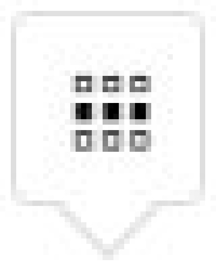
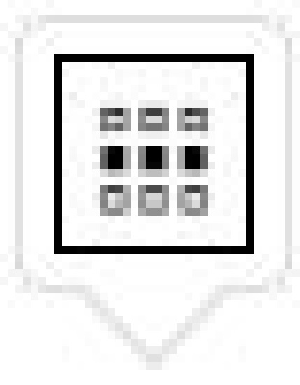
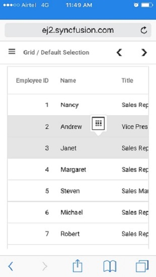

# Selection in React Grid Component

Selection in the Grid component provides interactive selection of specific cells, rows, or columns within the grid. Selection can be performed through mouse clicks, arrow keys (up, down, left, and right), or touch. This functionality highlights and allows manipulation or actions on specific cells, rows, or columns within the grid.

**Disabling selection**

To disable selection in the grid, set the [allowSelection](https://ej2.syncfusion.com/react/documentation/api/grid#allowselection) property to `false`.

**Selection types**

The Grid supports two selection types, configurable via the [selectionSettings.type](https://ej2.syncfusion.com/react/documentation/api/grid/selectionSettings#type) property:

* `Single` - Enables selection of only one row, cell, or column at a time.
* `Multiple` - Enables selection of multiple rows, cells, or columns.

**Multi-selection controls**

* **CTRL + Click:** Select or deselect separate rows ,cells or columns.
* **SHIFT + Click:** Select a range of rows, cells, or columns between two points.




import { DropDownListComponent } from '@syncfusion/ej2-react-dropdowns';
import { ColumnDirective, ColumnsDirective, GridComponent } from '@syncfusion/ej2-react-grids';
import * as React from 'react';
import { data } from './datasource';

function App() {
  let grid;
  const dropdownData = [
    { text: 'Single', value: 'Single' },
    { text: 'Multiple', value: 'Multiple' }
  ];
  const valueChange = (args) => {
    grid.selectionSettings.type = args.value;
  }
  return (

    <label style={{ padding: "30px 17px 0 0" }}>Choose selection type:</label>
    <DropDownListComponent index={0} width={150} dataSource={dropdownData} change={valueChange}></DropDownListComponent>
    <GridComponent ref={g => grid = g} dataSource={data} height={315}>
      <ColumnsDirective>
        <ColumnDirective field='OrderID' headerText='Order ID' width='120' textAlign="Right" />
        <ColumnDirective field='CustomerID' headerText='Customer ID' width='150' />
        <ColumnDirective field='ShipCity' headerText='Ship City' width='100' />
        <ColumnDirective field='ShipName' headerText='Ship Name' width='150' />
      </ColumnsDirective>
    </GridComponent>
)
};
export default App;




import { ChangeEventArgs, DropDownListComponent } from '@syncfusion/ej2-react-dropdowns';
import { ColumnDirective, ColumnsDirective, GridComponent } from '@syncfusion/ej2-react-grids';
import * as React from 'react';
import { data } from './datasource';

function App() {
  let grid: GridComponent | null;
  const dropdownData: { [key: string]: Object; }[] = [
    { text: 'Single', value: 'Single' },
    { text: 'Multiple', value: 'Multiple' }
  ];
  const valueChange = (args: ChangeEventArgs) => {
    (grid as GridComponent).selectionSettings.type = args.value;
  }
  return (

    <label style={{ padding: "30px 17px 0 0" }}>Choose selection type:</label>
    <DropDownListComponent index={0} width={150} dataSource={dropdownData} change={valueChange}></DropDownListComponent>
    <GridComponent ref={g => grid = g} dataSource={data} height={315}>
      <ColumnsDirective>
        <ColumnDirective field='OrderID' headerText='Order ID' width='120' textAlign="Right" />
        <ColumnDirective field='CustomerID' headerText='Customer ID' width='150' />
        <ColumnDirective field='ShipCity' headerText='Ship City' width='100' />
        <ColumnDirective field='ShipName' headerText='Ship Name' width='150' />
      </ColumnsDirective>
    </GridComponent>
)
};
export default App;










 

> By default, the Grid component includes essential selection functionality. The Selection module is automatically available without requiring explicit injection. Refer to the [Selection API](https://ej2.syncfusion.com/react/documentation/api/grid/selection) for complete configuration options.

## Selection mode

The selection mode feature allows switching between different modes for selecting rows, cells, or both within the grid based on specific requirements. This feature highlights and manipulates specific rows or cells in the grid.
To configure selection mode, set the [selectionSettings.mode](https://ej2.syncfusion.com/react/documentation/api/grid/selectionSettings#mode) property. The Grid component supports three types of selection modes:

* `Row` - Enables row selection only (default mode).
* `Cell` - Enables cell selection only.
* `Both` - Enables simultaneous row and cell selection.

The following example demonstrates dynamically enabling and changing the `selectionSettings.mode` using the `DropDownList` component:




import { ChangeEventArgs, DropDownListComponent } from '@syncfusion/ej2-react-dropdowns';
import { ColumnDirective, ColumnsDirective, GridComponent } from '@syncfusion/ej2-react-grids';
import * as React from 'react';
import { data } from './datasource';

function App() {
  let grid;
  const dropdownData = [
    { text: 'Row', value: 'Row' },
    { text: 'Cell', value: 'Cell' },
    { text: 'Both', value: 'Both' }
  ];
  const valueChange = (args) => {
    grid.selectionSettings.mode = args.value;
  }
  return (

    <label style={{ padding: "30px 17px 0 0" }}>Choose selection mode:</label>
    <DropDownListComponent index={0} width={150} dataSource={dropdownData} change={valueChange}></DropDownListComponent>
    <GridComponent ref={g => grid = g} dataSource={data} height={315}>
      <ColumnsDirective>
        <ColumnDirective field='OrderID' headerText='Order ID' width='120' textAlign="Right" />
        <ColumnDirective field='CustomerID' headerText='Customer ID' width='150' />
        <ColumnDirective field='ShipCity' headerText='Ship City' width='100' />
        <ColumnDirective field='ShipName' headerText='Ship Name' width='150' />
      </ColumnsDirective>
    </GridComponent>
)
};
export default App;




import { ChangeEventArgs, DropDownListComponent } from '@syncfusion/ej2-react-dropdowns';
import { ColumnDirective, ColumnsDirective, GridComponent } from '@syncfusion/ej2-react-grids';
import * as React from 'react';
import { data } from './datasource';

function App() {
  let grid: GridComponent | null;
  const dropdownData: { [key: string]: Object; }[] = [
    { text: 'Row', value: 'Row' },
    { text: 'Cell', value: 'Cell' },
    { text: 'Both', value: 'Both' }
  ];
  const valueChange = (args: ChangeEventArgs) => {
    (grid as GridComponent).selectionSettings.mode = args.value;
  }
  return (

    <label style={{ padding: "30px 17px 0 0" }}>Choose selection mode:</label>
    <DropDownListComponent index={0} width={150} dataSource={dropdownData} change={valueChange}></DropDownListComponent>
    <GridComponent ref={g => grid = g} dataSource={data} height={315}>
      <ColumnsDirective>
        <ColumnDirective field='OrderID' headerText='Order ID' width='120' textAlign="Right" />
        <ColumnDirective field='CustomerID' headerText='Customer ID' width='150' />
        <ColumnDirective field='ShipCity' headerText='Ship City' width='100' />
        <ColumnDirective field='ShipName' headerText='Ship Name' width='150' />
      </ColumnsDirective>
    </GridComponent>
)
};
export default App;










 

## Touch interaction

The touch interaction feature in grid provides easy interaction with the grid on touch screen devices. This feature improves the experience on mobile devices and tablets, making it easier to navigate and interact with the grid's content using touch gestures.

**Single row selection**

Tapping on a row selects it immediately, providing efficient single-row selection on touch interfaces.

**Multi-row selection**

Multiple rows can be selected by tapping a row, which triggers a popup as shown in the image. Once the popup is tapped, additional rows can be selected by tapping the required rows, enabling efficient multi-row interaction.

 

**Multi-row or cell selection**

The Grid supports selecting both multiple rows and cells. Tap the popup to switch to multi-row or cell selection mode, then tap desired rows or cells to select them, as shown in the following image:

> For multi-selection, it requires the selection [type](https://ej2.syncfusion.com/react/documentation/api/grid/selectionSettings#type) to be `Multiple`.

**Touch selection example**

The following screenshot illustrates how touch selection appears on a device:

## Toggle selection

Toggle selection provides efficient selection state switching by enabling single-click selection and deselection. When this feature is enabled, clicking a selected item deselects it, and clicking an unselected item selects it.

To enable the toggle selection feature, set the [selectionSettings.enableToggle](https://ej2.syncfusion.com/react/documentation/api/grid/selectionSettings#enabletoggle) property to `true`.

The following example demonstrates the toggle selection for cells and rows using the `selectionSettings.enableToggle` property:




import { DropDownListComponent } from '@syncfusion/ej2-react-dropdowns';
import { SwitchComponent } from '@syncfusion/ej2-react-buttons'
import { ColumnDirective, ColumnsDirective, GridComponent, SelectionSettingsModel } from '@syncfusion/ej2-react-grids';
import * as React from 'react';
import { data } from './datasource';

function App() {
    let grid;
    const selectionSettings = { type: 'Multiple' };
    const dropdownData = [
        { text: 'Row', value: 'Row' },
        { text: 'Cell', value: 'Cell' },
        { text: 'Both', value: 'Both' }
    ];
    const valueChange = (args) => {
        grid.selectionSettings.mode = args.value;
    }
    const toggleColumnSelection = (args) => {
        grid.selectionSettings.enableToggle = args.checked;
    }
    return (

        <label style={{ padding: "30px 17px 0 0" }}>Choose selection mode:</label>
        <DropDownListComponent index={0} width={150} dataSource={dropdownData} change={valueChange}></DropDownListComponent> 
        <label style={{ padding: "30px 17px 0 0" }}>Enable/Disable Toggle selection</label>
        <SwitchComponent change={toggleColumnSelection}></SwitchComponent>
        <GridComponent ref={g => grid = g} dataSource={data} height={315} selectionSettings={selectionSettings}>
            <ColumnsDirective>
                <ColumnDirective field='OrderID' width='120' textAlign="Right" />
                <ColumnDirective field='CustomerID' width='150' />
                <ColumnDirective field='ShipCity' width='100' />
                <ColumnDirective field='ShipName' width='150' />
            </ColumnsDirective>
        </GridComponent>
)
};
export default App;




import { ChangeEventArgs, DropDownListComponent } from '@syncfusion/ej2-react-dropdowns';
import { SwitchComponent } from '@syncfusion/ej2-react-buttons'
import { ColumnDirective, ColumnsDirective, GridComponent, SelectionSettingsModel } from '@syncfusion/ej2-react-grids';
import * as React from 'react';
import { data } from './datasource';

function App() {
  let grid: GridComponent | null;
  let enableToggle: boolean = true;
  const selectionSettings: SelectionSettingsModel = { type: 'Multiple' };
  const dropdownData: { [key: string]: Object; }[] = [
    { text: 'Row', value: 'Row' },
    { text: 'Cell', value: 'Cell' },
    { text: 'Both', value: 'Both' }
  ];
  const valueChange = (args: ChangeEventArgs) => {
    (grid as GridComponent).selectionSettings.mode = args.value;
  }
  const toggleColumnSelection = (args: ChangeEventArgs) => {
    (grid as GridComponent).selectionSettings.enableToggle = args.checked;
    (enableToggle as boolean) = args.checked;
  }
  return (

    <label style={{ padding: "30px 17px 0 0" }}>Choose selection mode:</label>
    <DropDownListComponent index={0} width={150} dataSource={dropdownData} change={valueChange}></DropDownListComponent> 
    <label style={{ padding: "30px 17px 0 0" }}>Enable/Disable Toggle selection</label>
    <SwitchComponent change={toggleColumnSelection} checked={enableToggle}></SwitchComponent>
    <GridComponent ref={g => grid = g} dataSource={data} height={315} selectionSettings={selectionSettings}>
      <ColumnsDirective>
        <ColumnDirective field='OrderID' width='120' textAlign="Right" />
        <ColumnDirective field='CustomerID' width='150' />
        <ColumnDirective field='ShipCity' width='100' />
        <ColumnDirective field='ShipName' width='150' />
      </ColumnsDirective>
    </GridComponent>
)
};
export default App;










 

> * If multi selection is enabled, then first click on any selected row (without pressing Ctrl key), it will clear the multi selection and in second click on the same row, it will be unselected.
> * Toggle selection is a feature that can be applied to all types of selections. When the [checkboxOnly](https://ej2.syncfusion.com/react/documentation/api/grid/selectionsettings#checkboxonly) property restricts row or cell selection to only occur through checkbox clicks. When this property is set to `true`, users cannot select rows or cells by clicking directly on them; instead, selection is only possible by clicking the corresponding checkboxes. Refer to the [Checkbox Selection](./check-box-selection#allow-selection-only-through-checkbox-click) feature to learn more about implementing checkbox-only selection.

## Clear selection programmatically

Use the [clearSelection](https://ej2.syncfusion.com/react/documentation/api/grid#clearselection) method to programmatically clear selected rows, cells, or columns.

The following example demonstrates clearing selection by calling the `clearSelection` method in a button click event:
















 

> In `Both` mode, if calling [clearCellSelection](https://ej2.syncfusion.com/react/documentation/api/grid/index-default#clearcellselection) first, it will clear cell selections, and then if calling [clearRowSelection](https://ej2.syncfusion.com/react/documentation/api/grid/index-default#clearrowselection), it will clear row selections. The order of method calls determines which type of selection is cleared first.
> To remove a specific selection in a row, cell, or column, utilize the following methods: `clearRowSelection` for clearing row selections, `clearCellSelection` for clearing cell selections, and [clearColumnSelection](https://ej2.syncfusion.com/react/documentation/api/grid/selection#clearcolumnselection) for clearing column selections.

## Persist selection

Persist selection maintains selected items across data manipulation and grid refresh operations. This functionality maintains tracking of the selected items across different grid operations.

To enable persist selection, set the [selectionSettings.persistSelection](https://ej2.syncfusion.com/react/documentation/api/grid/selectionSettings#persistselection) property to `true`.

> * Persist selection requires at least one "primary key" column in the grid for proper identification and retention of selected items. set the [column.isPrimaryKey](https://ej2.syncfusion.com/react/documentation/api/grid/columnmodel#isprimarykey) as `true` to define the "primary key" column.
> * The `persistSelection` feature is not supported for cell selections in the Syncfusion&reg; React Grid component.
> * The `persistSelection` feature is only supported for grid `Multiple` type selections.

The following example demonstrates persist selection for rows and columns using the `selectionSettings.persistSelection` property:
















 

## See also
- [Row selection](./row-selection)
- [Cell selection](./cell-selection)
- [Column selection](./column-selection)
- [Checkbox selection](./check-box-selection)
- [Selection API](https://ej2.syncfusion.com/react/documentation/api/grid/selection)
