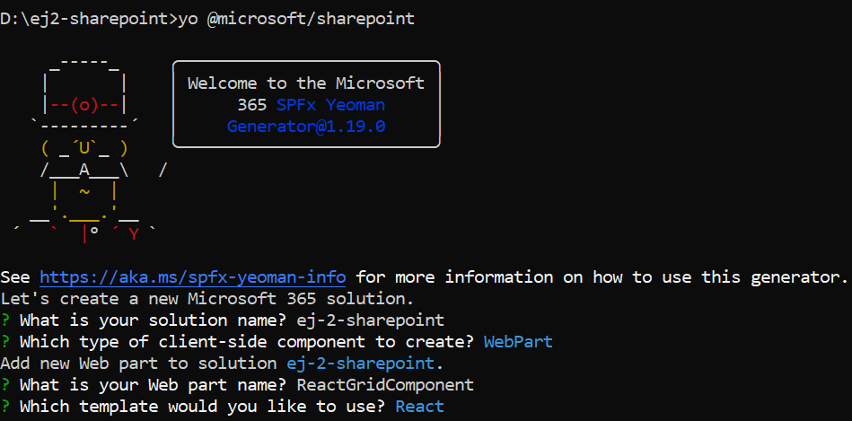
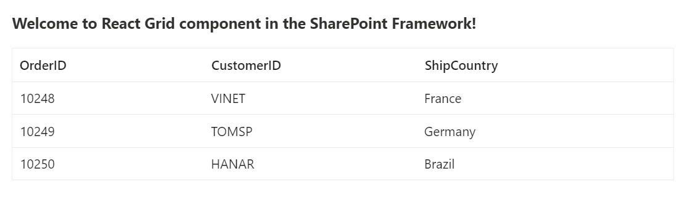

# Getting Started with React Grid Component in the SharePoint Framework

The [React Data Grid](https://www.syncfusion.com/react-components/react-data-grid) component can be integrated into a [SharePoint](https://learn.microsoft.com/en-us/sharepoint/dev) Framework (SPFx) project using the techniques outlined in this article. These steps will walk you through the process of adding a robust data grid to your SharePoint solutions.

`SharePoint` Framework (SPFx) is a development model and framework provided by Microsoft for building custom solutions and extensions for SharePoint and Microsoft Teams. It is a modern, client-side framework that allows developers to create web parts, extensions, and customizations that can be deployed and used within SharePoint sites and Teams applications.

## Prerequisites 

Before you start using Syncfusion<sup style="font-size:70%">&reg;</sup> React UI components, ensure that your system meets the following prerequisites by referring to the system requirements documentation. This documentation provides information about supported browsers, Node.js versions, and other dependencies required for using Syncfusion<sup style="font-size:70%">&reg;</sup> React UI components and `SharePoint` Framework effectively. 

* [System requirements for Syncfusion<sup style="font-size:70%">&reg;</sup> React UI components](https://ej2.syncfusion.com/react/documentation/system-requirement)

* [System requirements for the SharePoint Framework Development Environment](https://learn.microsoft.com/en-us/sharepoint/dev/spfx/set-up-your-development-environment)

## Set up the SharePoint project

Follow these steps to install and set up SharePoint Framework for your project:

**1. Create a New Project:** Create a new directory called **ej2-share-point**, open the command prompt from that directory.

**2. Install Gulp:** Gulp is a JavaScript-based task runner used to automate repetitive tasks. Install the Gulp CLI globally using the following command:

```bash
npm install gulp-cli --global
```

**3. Install Yeoman:** Yeoman helps you kick-start new projects and prescribes best practices and tools to help you stay productive. Install Yeoman globally using the following command:

```bash
npm install yo --global
```

**4. Install SharePoint Dependency:** Install the SharePoint dependency for the project using the following command:

```bash
npm install @microsoft/generator-sharepoint
```

**5. Create a New Client-Side Web Part:** Then, create a new client-side web part by running the following Yeoman SharePoint Generator command line.

```bash
yo @microsoft/sharepoint
```

After executing the above command, you will be prompted to configure the project settings. Follow the prompts and provide the necessary information:

**1. Solution Name:** Enter the name for your solution, such as "ej2-share-point". 

```bash
What is your solution name? **ej2-share-point**
```
**2. Client-Side Component Type:** Choose the type of client-side component you want to create:

```bash
Which type of client-side component to create? (Use arrow keys)
>   WebPart 
    Extension
    Library
    Adaptive Card Extension
```
**3. Web Part Name:** Specify a name for your web part, for example, "ReactGridComponent".

 ```bash
What is your Web part name? ReactGridComponent
```
**4. Template Selection:** Select the template you would like to use for your project:

```bash
Which template would you like to use?
    Minimal
    No framework
>   React
```

This generates the necessary files as shown in the below image.



**6. Change Serve JSON Path:** Update the initial path of the config/serve.json to your SharePoint site instead of **{tenantDomain}**. Modify it to https://**your-share-point-site**/_layouts/workbench.aspx.

**7. Establish Trust for Certificate:** After the project is created, establish trust for the development certificate by executing the following command: To establish trust for the certificate in the development environment, execute the provided command:

```bash
gulp trust-dev-cert
```

**8. Run the project:** To preview your SharePoint project, run the following command:

```bash
gulp serve
```

(https://www.syncfusion.com/react-components/react-data-grid) packages

To utilize [React Data Grid](https://www.syncfusion.com/react-components/react-data-grid) component in your project, you need to install the necessary npm package. 

```bash
npm install @syncfusion/ej2-react-grids
```

## Adding CSS reference

Syncfusion<sup style="font-size:70%">&reg;</sup> provides various themes for React components. You can import CSS styles for the desired theme into your project.  Refer to the [themes topic](https://ej2.syncfusion.com/react/documentation/appearance/theme) to learn more about built-in themes and different ways to refer to themes in a React project.

In this article, the `Material 3` theme is applied using CSS styles, which are available in installed packages. The necessary `Material 3` CSS styles for the Grid component were imported into the `~src/webparts/reactGridComponent/components/ReactGridComponent.tsx` file. 

To add Syncfusion<sup style="font-size:70%">&reg;</sup> Essential<sup style="font-size:70%">&reg;</sup> JS 2 style reference from npm packages:

```bash
require ('@syncfusion/ej2-react-grids/styles/material3.css');
```

or

To add Syncfusion<sup style="font-size:70%">&reg;</sup> Essential<sup style="font-size:70%">&reg;</sup> JS 2 style reference from CDN:

```bash
<link rel="stylesheet" href="https://cdn.syncfusion.com/ej2/32.1.19/ej2/material3.css" /> // use the latest version to refer the css through CDN//
```

## Adding Grid component

The grid code should be added to the **ReactGridComponent.tsx** file.




import * as React from 'react';
import styles from './ReactGridComponent.module.scss';
import type { IReactGridComponentProps } from './IReactGridComponentProps';
import { escape } from '@microsoft/sp-lodash-subset';
import { ColumnDirective, ColumnsDirective, GridComponent,} from '@syncfusion/ej2-react-grids';

const ReactGridComponent: React.FC<IReactGridComponentProps> = (props) => {
    const {
      hasTeamsContext,
    } = props;
    // Defines the data to be displayed in the Grid.
    const data = [
      { OrderID: 10248, CustomerID: 'VINET', EmployeeID: 5, ShipCountry: 'France', Freight: 32.38 },
      { OrderID: 10249, CustomerID: 'TOMSP', EmployeeID: 6, ShipCountry: 'Germany', Freight: 11.61 },
      { OrderID: 10250, CustomerID: 'HANAR', EmployeeID: 4, ShipCountry: 'Brazil', Freight: 65.83 }
    ];
    return (
      <section className={`${styles.reactGridComponent} ${hasTeamsContext ? styles.teams : ''}`}>
        <div>
          <h3>Welcome to React Grid component in the SharePoint Framework!</h3>
        </div>
          <link rel="stylesheet" href="https://cdn.syncfusion.com/ej2/32.1.19/ej2/material3.css" />
          {/* Assigns the dataset to the Grid component */}
          <GridComponent id='grid' dataSource={data} >
          {/* Define the columns to be displayed */}
            <ColumnsDirective>
              <ColumnDirective field='OrderID' isPrimaryKey={true} width='90' />
              <ColumnDirective field='CustomerID' width='100' />
              <ColumnDirective field='ShipCountry' width='120' />
            </ColumnsDirective>
          </GridComponent>
      </section>
    );
  }
export default ReactGridComponent;




**3. Run the project:** To preview your SharePoint project with the integrated React Grid component, run the following commands:

```bash
gulp trust-dev-cert
gulp serve
```

The output will appear as follows:



## See also

* [Grid Feature Modules](./module)