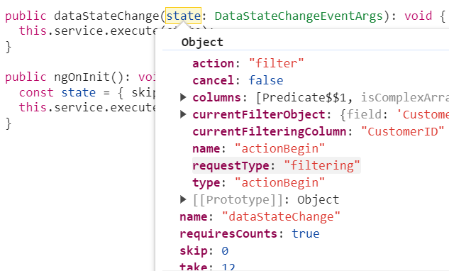
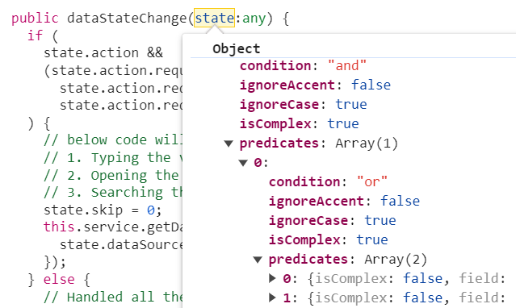
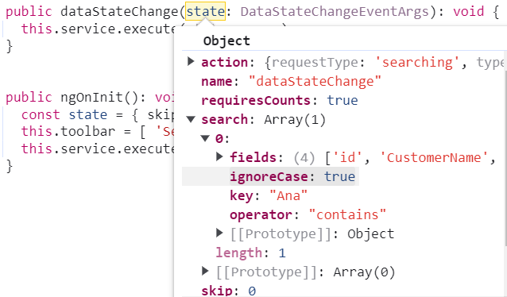
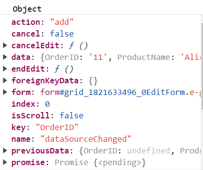
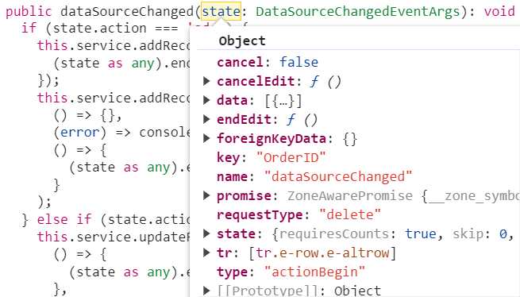

# Getting Started with React Grid Component in the SharePoint Framework

The Syncfusion<sup style="font-size:70%">&reg;</sup> React Grid component can be integrated into a [SharePoint](https://learn.microsoft.com/en-us/sharepoint/dev) Framework (SPFx) project using the techniques outlined in this article. These steps will walk you through the process of adding a robust data grid to your SharePoint solutions.

`SharePoint` Framework (SPFx) is a development model and framework provided by Microsoft for building custom solutions and extensions for SharePoint and Microsoft Teams. It is a modern, client-side framework that allows developers to create web parts, extensions, and customizations that can be deployed and used within SharePoint sites and Teams applications.

## Prerequisites 

Before you start using Syncfusion<sup style="font-size:70%">&reg;</sup> React UI components, ensure that your system meets the following prerequisites by referring to the system requirements documentation. This documentation provides information about supported browsers, Node.js versions, and other dependencies required for using Syncfusion<sup style="font-size:70%">&reg;</sup> React UI components and `SharePoint` Framework effectively. 

* [System requirements for Syncfusion<sup style="font-size:70%">&reg;</sup> React UI components](https://ej2.syncfusion.com/react/documentation/system-requirement)

* [System requirements for the SharePoint Framework Development Environment](https://learn.microsoft.com/en-us/sharepoint/dev/spfx/set-up-your-development-environment)

## Set up the SharePoint project

Follow these steps to install and set up SharePoint Framework for your project:

**1. Create a New Project:** Create a new directory called **ej2-sharepoint**, open the command prompt from that directory.

**2. Install Gulp:** Gulp is a JavaScript-based task runner used to automate repetitive tasks. Install the Gulp CLI globally using the following command:

```bash
npm install gulp-cli --global
```

**3. Install Yeoman:** Yeoman helps you kick-start new projects and prescribes best practices and tools to help you stay productive. Install Yeoman globally using the following command:

```bash
npm install yo --global
```

**4. Install SharePoint Dependency:** Install the SharePoint dependency for the project using the following command:

```bash
npm install @microsoft/generator-sharepoint
```

**5. Create a New Client-Side Web Part:** Then, create a new client-side web part by running the following Yeoman SharePoint Generator command line.

```bash
yo @microsoft/sharepoint
```

After executing the above command, you will be prompted to configure the project settings. Follow the prompts and provide the necessary information:

**1. Solution Name:** Enter the name for your solution, such as "ej-2-sharepoint". 

```bash
What is your solution name? **ej-2-sharepoint**
```
**2. Client-Side Component Type:** Choose the type of client-side component you want to create:

```bash
Which type of client-side component to create? (Use arrow keys)
>   WebPart 
    Extension
    Library
    Adaptive Card Extension
```
**3. Web Part Name:** Specify a name for your web part, for example, "ReactGridComponent".

 ```bash
What is your Web part name? ReactGridComponent
```
**4. Template Selection:** Select the template you would like to use for your project:

```bash
Which template would you like to use?
    Minimal
    No framework
>   React
```

This generates the necessary files as shown in the below image.


**6. Change Serve JSON Path:** Update the initial path of the config/serve.json to your SharePoint site instead of **{tenantDomain}**. Modify it to https://**your-sharepoint-site**/_layouts/workbench.aspx.

**7. Establish Trust for Certificate:** After the project is created, establish trust for the development certificate by executing the following command: To establish trust for the certificate in the development environment, execute the provided command:

```bash
gulp trust-dev-cert
```

**8. Run the project:** To preview your SharePoint project, run the following command:

```bash
gulp serve
```

## Add Syncfusion<sup style="font-size:70%">&reg;</sup> React packages

To utilize Syncfusion<sup style="font-size:70%">&reg;</sup> React Grid component in your project, you need to install the necessary npm package. 

```bash
npm install @syncfusion/ej2-react-grids
```

## Import Syncfusion<sup style="font-size:70%">&reg;</sup> CSS styles

Syncfusion<sup style="font-size:70%">&reg;</sup> provides various themes for React components. You can import CSS styles for the desired theme into your project.  Refer to the [themes topic](https://ej2.syncfusion.com/react/documentation/appearance/theme) to learn more about built-in themes and different ways to refer to themes in a React project.

In this article, the `Tailwind 3` theme is applied using CSS styles, which are available in installed packages. The necessary `Tailwind 3` CSS styles for the Grid component were imported into the `~src/webparts/reactGridComponent/components/ReactGridComponent.tsx` file. 

To add Syncfusion<sup style="font-size:70%">&reg;</sup> Essential<sup style="font-size:70%">&reg;</sup> JS 2 style reference from npm packages:

```bash
require ('@syncfusion/ej2-react-grids/styles/tailwind3.css');
```

or

To add Syncfusion<sup style="font-size:70%">&reg;</sup> Essential<sup style="font-size:70%">&reg;</sup> JS 2 style reference from CDN:

```bash
<link rel="stylesheet" href="https://cdn.syncfusion.com/ej2/32.1.19/ej2/tailwind3.css" /> // use the latest version to refer the css through CDN//
```

## Adding Grid component with local data

Follow these detailed steps to seamlessly add the React Grid component to your SharePoint project:

**1. Define Data Source:** In your React component file (`~src/webparts/reactGridComponent/components/ReactGridComponent.tsx`), define the grid's data source:

```js
const data = [
  { OrderID: 10248, CustomerID: 'VINET', EmployeeID: 5, ShipCountry: 'France', Freight: 32.38 },
  { OrderID: 10249, CustomerID: 'TOMSP', EmployeeID: 6, ShipCountry: 'Germany', Freight: 11.61 },
  { OrderID: 10250, CustomerID: 'HANAR', EmployeeID: 4, ShipCountry: 'Brazil', Freight: 65.83 }
];
```

**2. Define Grid component:** Define the Grid component with the [dataSource](https://ej2.syncfusion.com/react/documentation/api/grid#datasource) and column definitions as shown below:

```ts
import { ColumnDirective, ColumnsDirective, GridComponent } from '@syncfusion/ej2-react-grids';

const ReactGridComponent: React.FC<IReactGridComponentProps> = (props) => {
    return (
        <GridComponent dataSource={data}>
            <ColumnsDirective>
                <ColumnDirective field='OrderID' isPrimaryKey={true} width='90' />
                <ColumnDirective field='CustomerID' width='100' />
                <ColumnDirective field='ShipCountry' width='120' />
            </ColumnsDirective>
        </GridComponent>
    );
}
export default ReactGridComponent;
```
The code that summarizes the previous steps is as follows:




import * as React from 'react';
import styles from './ReactGridComponent.module.scss';
import type { IReactGridComponentProps } from './IReactGridComponentProps';
import { escape } from '@microsoft/sp-lodash-subset';
import { ColumnDirective, ColumnsDirective, GridComponent,} from '@syncfusion/ej2-react-grids';

const ReactGridComponent: React.FC<IReactGridComponentProps> = (props) => {
    const {
      hasTeamsContext,
    } = props;
    const data = [
      { OrderID: 10248, CustomerID: 'VINET', EmployeeID: 5, ShipCountry: 'France', Freight: 32.38 },
      { OrderID: 10249, CustomerID: 'TOMSP', EmployeeID: 6, ShipCountry: 'Germany', Freight: 11.61 },
      { OrderID: 10250, CustomerID: 'HANAR', EmployeeID: 4, ShipCountry: 'Brazil', Freight: 65.83 }
    ];
    return (
      <section className={`${styles.reactGridComponent} ${hasTeamsContext ? styles.teams : ''}`}>
        <div>
          <h3>Welcome to React Grid component in the SharePoint Framework!</h3>
        </div>
          <link rel="stylesheet" href="https://cdn.syncfusion.com/ej2/32.1.19/ej2/tailwind3.css" />
          <GridComponent id='grid' dataSource={data} >
            <ColumnsDirective>
              <ColumnDirective field='OrderID' isPrimaryKey={true} width='90' />
              <ColumnDirective field='CustomerID' width='100' />
              <ColumnDirective field='ShipCountry' width='120' />
            </ColumnsDirective>
          </GridComponent>
      </section>
    );
  }
export default ReactGridComponent;




**3. Run the project:** To preview your SharePoint project with the integrated React Grid component, run the following commands:

```bash
gulp trust-dev-cert
gulp serve
```

The output will appear as follows:


## Adding Grid component with custom binding 

The Syncfusion<sup style="font-size:70%">&reg;</sup> React Grid component provides support for integrating data from a Redux service using the observable binding feature. This allows you to connect the grid component to your Redux store and perform various data operations such as sorting, filtering, paging, and CRUD actions. 

When using custom binding, the Grid expects the result of the custom logic to be an object with properties `result` and `count`. The result property should contain the data to be displayed in the Grid, while the `count` property indicates the total number of records in the dataset for your application. To utilize custom binding, you can handle the [DataManager](https://ej2.syncfusion.com/react/documentation/data/getting-started). The DataManager integrates seamlessly with the React Grid to manage custom data processing and binding.

The Grid component offers various powerful features for managing grid actions such as **paging**, **grouping**, **sorting**, and **filtering**. These actions trigger the [dataStateChange](https://ej2.syncfusion.com/react/documentation/api/grid#datastatechange) event. For CRUD operations, including **Create**, **Read**, **Update**, and **Delete**, the [dataSourceChanged](https://ej2.syncfusion.com/react/documentation/api/grid#datasourcechanged) event is triggered. This event allows you to handle and manipulate data based on user interactions.

### Integrating the redux service with the Syncfusion<sup style="font-size:70%">&reg;</sup> React Grid

Follow these steps to integrate the Redux service into the grid component with SharePoint Framework for your project:

**Step 1 : Install Dependencies**

In your terminal, navigate to your project directory and run the following commands to install the required packages.

```bash
npm install @syncfusion/ej2-data 
npm install redux react-redux redux-thunk 
```

1. `redux`: Redux helps manage your app's state in a predictable way, making it easier to debug and maintain.

2. `react-redux`: This is the official tool for connecting React with Redux. It lets your React components interact with the Redux store, allowing you to manage state effectively.

3. `redux-thunk`: A middleware enabling asynchronous action creators in Redux, allowing functions to be returned instead of plain objects for handling side effects like API calls.

**Step 2 : Set Up Redux Store**

Once the dependencies are installed, you need to set up a Redux [store](https://redux.js.org/api/store) in your application. Add the following code to the **store.tsx** file.

1. Create a new file called  `~src/webparts/reactGridCustomCrud/store/gridstore.tsx` in your project's directory.

2. In the gridstore.tsx file, import the necessary Redux functions and create your store:
    ```ts
    import { createStore, applyMiddleware } from 'redux';
    import { thunk } from 'redux-thunk';
    import gridReducer from './reducer/gridreducer';

    const store = createStore(gridReducer, applyMiddleware(thunk));

    export default store;
    ```
In the above code, you import the `createStore` function  from the `redux` package to create the store, `applyMiddleware` for applying middleware and your reducer from the appropriate file. Then, you create your Redux `store` using the `createStore` function, passing in your reducer function and applying the Redux Thunk middleware.

**Step 3 : Connect Redux Provider**

To make the Redux `store` available to your React components, you need to wrap your application with the Redux [Provider](https://react-redux.js.org/api/provider) component. It uses the Redux `store` as a prop and connects all the components in its hierarchy. Follow these steps to connect the Redux provider:

1. Open your root component file (`~src/webparts/reactGridComponent/components/ReactGridComponent.tsx`).

2. Import the necessary dependencies:

    ```ts
    import React from 'react';
    import ReactDOM from 'react-dom/client';
    import { Provider } from 'react-redux';
    import store from './store';
    ```
3. Wrap your application component with the `Provider` component and pass the Redux `store` as a prop:

    ```ts
    return (
        <Provider store={store}>
            <GridComponent dataSource={data}>
                <ColumnsDirective>
                    <ColumnDirective field='OrderID' isPrimaryKey={true} width='90' />
                    <ColumnDirective field='CustomerID' width='100' />
                    <ColumnDirective field='ShipCountry' width='120' />
                </ColumnsDirective>
            </GridComponent>
        </Provider>
    );
    ```

**Step 4: Create a Actions**

According to Redux documentation, the Redux [actions](https://redux.js.org/tutorials/fundamentals/part-3-state-actions-reducers#designing-actions) are plain JavaScript objects that describe changes to be made to the application's state. These actions are dispatched to the Redux `store`, and `reducers` handle them to update the state accordingly.

The action type defines the name of the action that will be performed from your application. Each action type is a string that describes the specific operation being performed. 

Here's an example of a Redux action definition for sort operation. you can add the code in the `~src/webparts/reactGridCustomCrud/store/action/gridaction.tsx` file.

```ts
import { Query } from "@syncfusion/ej2/data";

export const Grid_FetchData = 'Grid_FetchData';

// Define your action creator
export const fetchData = (state: any, query?: Query) => {
  return {
    type: Grid_FetchData,
    payload: state,
    gridQuery: query
  };
};
```

**Step 5: Create a Reducer**

According to the Redux documentation, the Redux [reducers](https://redux.js.org/tutorials/fundamentals/part-3-state-actions-reducers#writing-reducers) are functions responsible for handling actions and updating the state of the application. Reducers specify how the state should change in response to different actions dispatched to the Redux `store`.

Here's an example of a Redux reducer definition for data rendering. You can add the reducer code in the  `~src/webparts/reactGridCustomCrud/store/reducer/gridreducer.tsx` file.

```ts
import { Grid_FetchData } from '../action/gridaction';
import { DataManager, Query } from '@syncfusion/ej2-data';
import { GridInitialState } from '../../../../grid-data';
import { RootState } from './type';

const initialState: RootState = {
    data: GridInitialState.dataSource,
    error: false,
    result: [],
    count: 0,
}

const gridReducer = (state = initialState, action: any) => {
    const dataSource = [...initialState.data];
    const query = new Query();

    switch (action.type) {
        case Grid_FetchData:
        query.isCountRequired = true;
        // Execute local data operations using the provided query
        const currentResult = new DataManager(dataSource).executeLocal(query);
        // Return the result along with the count of total records
        return ({
            data: {
                result: (currentResult as any).result, // Result of the data
                count: (currentResult as any).count // Total record count
            }
        }) 
        default:
        // The grid data should be returned as the result and count with the object type.
        query.page(1, GridInitialState.pageSettings?.pageSize as number);
        query.isCountRequired = true;
        const defaultResult: any = new DataManager(dataSource).executeLocal(query);
        return {
            data: {
                result: defaultResult.result, count: defaultResult.count,
            },
        };
    }
};

export default gridReducer;
```
> The grid expects an object  as **result** and **count** format.

**Step 6: Create a Dispatch**

According the Redux documentation, the [dispatch](https://redux.js.org/api/store#dispatchaction) function is a method provided by the Redux `store`. It is used to send actions to the `store`, triggering the state update process. Dispatching an action is the primary way to update the state in a Redux application.

When performing actions such as adding, updating, or deleting a row in the grid, it dispatches the corresponding actions to modify the data in the `store` and trigger updates to the grid component.

When the `dataSourceChanged` and `dataStateChange` event occur, the dispatch method is called according to their grid actions.

Add the following code to the `~src/webparts/reactGridComponent/components/ReactGridComponent.tsx` file to dispatch the action to the `store`.

```ts
// This event will be triggered when performing any grid action.
const dataStateChange = (state: DataStateChangeEventArgs) => {
    const query = (gridInstance as any).current.getDataModule().generateQuery();
    store.dispatch(fetchData(state, query)); 
    setGridData(store.getState().data);
}
```

**Step 7: Fetching Grid Data using useEffect**

To fetch grid data and populate the [dataSource](https://ej2.syncfusion.com/react/documentation/api/grid#datasource) property of the grid, you can use the [useEffect](https://react.dev/reference/react/useEffect) hook in React. The useEffect hook allows you to perform side effects, such as fetching data, after the component has rendered. Here's an example of how to fetch grid data using useEffect:

Add the following code to the `~src/webparts/reactGridComponent/components/ReactGridComponent.tsx` file.

```js
  useEffect(() => {
    if (gridInstance) {
      gridInstance.dataSource = state.data
    }
  }) 
```

The code that summarizes the previous steps is as follows:




import * as React from 'react';
import { useEffect, useRef, useState } from 'react';
import styles from './ReactGridComponent.module.scss';
import type { IReactGridComponentProps } from './IReactGridComponentProps';
import { ColumnDirective, ColumnsDirective, DataStateChangeEventArgs, 
   GridComponent, } from '@syncfusion/ej2-react-grids';
import { Provider } from 'react-redux';
import store from '../store/gridstore';
import { fetchData } from '../store/action/gridaction';

const ReactGridComponent: React.FC<IReactGridComponentProps> = (props) => {
  const {
    hasTeamsContext,
  } = props;

  const gridInstance = useRef<GridComponent | null>(null);
  const [gridData, setGridData] = useState(store.getState().data);
  
  const dataStateChange = (state: DataStateChangeEventArgs) => {
    const query = (gridInstance as any).current.getDataModule().generateQuery();
    store.dispatch(fetchData(state, query));
    setGridData(store.getState().data);
  }

  useEffect(() => {
    // Update grid's dataSource when Redux state changes
    if (gridInstance.current) {
      gridInstance.current.dataSource = gridData;
    }
  }, [gridData]);

  return (
    <Provider store={store}>
      <section className={`${styles.reactGridComponent} ${hasTeamsContext ? styles.teams : ''}`}>
        <div>
          <h3>Welcome to React Grid component in the SharePoint Framework!</h3>
        </div>
        <link rel="stylesheet" href="https://cdn.syncfusion.com/ej2/32.1.19/ej2/tailwind3.css" />
        <div>          
          <GridComponent ref={gridInstance} dataStateChange={dataStateChange.bind(this)}>
          <ColumnsDirective>
            <ColumnDirective field='OrderID' width='90' />
            <ColumnDirective field='CustomerID' width='100' />
            <ColumnDirective field='ProductName' width='120' />
          </ColumnsDirective>
        </GridComponent>
        </div>
      </section>
    </Provider>
  );
}
export default ReactGridComponent;




import { Grid_FetchData } from '../action/gridaction';
import { DataManager, Query } from '@syncfusion/ej2-data';
import { GridInitialState } from '../../../../grid-data';

interface RootState {
    data: any; // Define your data type
    error: boolean;
    result: any[]; // Define your result type
    count: number;
}

const initialState: RootState = {
    data: GridInitialState.dataSource,
    error: false,
    result: [],
    count: 0,
}

const gridReducer = (state = initialState, action: any) => {
    const dataSource = [...initialState.data];
    const query = new Query();

    switch (action.type) {
        case Grid_FetchData:
            // To get the count of the data
            query.isCountRequired = true;
            // Execute local data operations using the provided query
            const currentResult = new DataManager(dataSource).executeLocal(query);
            // Return the result along with the count of total records
            return ({
                data: {
                    result: (currentResult as any).result, // Result of the data
                    count: (currentResult as any).count // Total record count
                }
            })
        default:
            query.page(1, GridInitialState.pageSettings?.pageSize as number);
            query.isCountRequired = true;
            const defaultResult: any = new DataManager(dataSource).executeLocal(query);
            return {
                data: {
                    result: defaultResult.result, count: defaultResult.count,
                },
            };
    }
};
export default gridReducer;




import { Query } from "@syncfusion/ej2-data";

export const Grid_FetchData = 'Grid_FetchData';

// Define your action creator
export const fetchData = (state: any, query?: Query) => {
  return {
    type: Grid_FetchData,
    payload: state,
    gridQuery: query
  };
};




import { createStore, applyMiddleware } from 'redux';
import { thunk } from 'redux-thunk';
import gridReducer from './reducer/gridreducer';

const store = createStore(gridReducer, applyMiddleware(thunk));

export default store;




export const lazyLoadData: object[] = [];
export function createLazyLoadData(): void {
    if (lazyLoadData.length) {
        return;
    }
    const customerid: string[] = ['VINET', 'TOMSP', 'HANAR', 'VICTE', 'SUPRD', 'HANAR', 'CHOPS', 'RICSU', 'WELLI', 'HILAA',
        'ERNSH', 'CENTC', 'OTTIK', 'QUEDE', 'RATTC', 'ERNSH', 'FOLKO', 'BLONP', 'WARTH', 'FRANK', 'GROSR', 'WHITC', 'WARTH',
        'SPLIR', 'RATTC', 'QUICK', 'VINET', 'MAGAA', 'TORTU', 'MORGK', 'BERGS', 'LEHMS', 'BERGS', 'ROMEY', 'ROMEY', 'LILAS',
        'LEHMS', 'QUICK', 'QUICK', 'RICAR', 'REGGC', 'BSBEV', 'COMMI', 'QUEDE', 'TRADH', 'TORTU', 'RATTC', 'VINET', 'LILAS',
        'BLONP', 'HUNGO', 'RICAR', 'MAGAA', 'WANDK', 'SUPRD', 'GODOS', 'TORTU', 'OLDWO', 'ROMEY', 'LONEP', 'ANATR', 'HUNGO',
        'THEBI', 'DUMON', 'WANDK', 'QUICK', 'RATTC', 'ISLAT', 'RATTC', 'LONEP', 'ISLAT', 'TORTU', 'WARTH', 'ISLAT', 'PERIC',
        'KOENE', 'SAVEA', 'KOENE', 'BOLID', 'FOLKO', 'FURIB', 'SPLIR', 'LILAS', 'BONAP', 'MEREP', 'WARTH', 'VICTE',
        'HUNGO', 'PRINI', 'FRANK', 'OLDWO', 'MEREP', 'BONAP', 'SIMOB', 'FRANK', 'LEHMS', 'WHITC', 'QUICK', 'RATTC', 'FAMIA'];

    const product: string[] = ['Chai', 'Chang', 'Aniseed Syrup', 'Chef Anton\'s Cajun Seasoning', 'Chef Anton\'s Gumbo Mix',
        'Grandma\'s Boysenberry Spread', 'Uncle Bob\'s Organic Dried Pears', 'Northwoods Cranberry Sauce', 'Mishi Kobe Niku',
        'Ikura', 'Queso Cabrales', 'Queso Manchego La Pastora', 'Konbu', 'Tofu', 'Genen Shouyu', 'Pavlova', 'Alice Mutton',
        'Carnarvon Tigers', 'Teatime Chocolate Biscuits', 'Sir Rodney\'s Marmalade', 'Sir Rodney\'s Scones',
        'Gustaf\'s Knäckebröd', 'Tunnbröd', 'Guaraná Fantástica', 'NuNuCa Nuß-Nougat-Creme', 'Gumbär Gummibärchen',
        'Schoggi Schokolade', 'Rössle Sauerkraut', 'Thüringer Rostbratwurst', 'Nord-Ost Matjeshering', 'Gorgonzola Telino',
        'Mascarpone Fabioli', 'Geitost', 'Sasquatch Ale', 'Steeleye Stout', 'Inlagd Sill',
        'Gravad lax', 'Côte de Blaye', 'Chartreuse verte', 'Boston Crab Meat', 'Jack\'s New England Clam Chowder',
        'Singaporean Hokkien Fried Mee', 'Ipoh Coffee', 'Gula Malacca', 'Rogede sild', 'Spegesild', 'Zaanse koeken',
        'Chocolade', 'Maxilaku', 'Valkoinen suklaa', 'Manjimup Dried Apples', 'Filo Mix', 'Perth Pasties',
        'Tourtière', 'Pâté chinois', 'Gnocchi di nonna Alice', 'Ravioli Angelo', 'Escargots de Bourgogne',
        'Raclette Courdavault', 'Camembert Pierrot', 'Sirop d\'érable',
        'Tarte au sucre', 'Vegie-spread', 'Wimmers gute Semmelknödel', 'Louisiana Fiery Hot Pepper Sauce',
        'Louisiana Hot Spiced Okra', 'Laughing Lumberjack Lager', 'Scottish Longbreads',
        'Gudbrandsdalsost', 'Outback Lager', 'Flotemysost', 'Mozzarella di Giovanni', 'Röd Kaviar', 'Longlife Tofu',
        'Rhönbräu Klosterbier', 'Lakkalikööri', 'Original Frankfurter grüne Soße'];

    const customername: string[] = ['Maria', 'Ana Trujillo', 'Antonio Moreno', 'Thomas Hardy', 'Christina Berglund',
        'Hanna Moos', 'Frédérique Citeaux', 'Martín Sommer', 'Laurence Lebihan', 'Elizabeth Lincoln',
        'Victoria Ashworth', 'Patricio Simpson', 'Francisco Chang', 'Yang Wang', 'Pedro Afonso', 'Elizabeth Brown',
        'Sven Ottlieb', 'Janine Labrune', 'Ann Devon', 'Roland Mendel', 'Aria Cruz', 'Diego Roel',
        'Martine Rancé', 'Maria Larsson', 'Peter Franken', 'Carine Schmitt', 'Paolo Accorti', 'Lino Rodriguez',
        'Eduardo Saavedra', 'José Pedro Freyre', 'André Fonseca', 'Howard Snyder', 'Manuel Pereira',
        'Mario Pontes', 'Carlos Hernández', 'Yoshi Latimer', 'Patricia McKenna', 'Helen Bennett', 'Philip Cramer',
        'Daniel Tonini', 'Annette Roulet', 'Yoshi Tannamuri', 'John Steel', 'Renate Messner', 'Jaime Yorres',
        'Carlos González', 'Felipe Izquierdo', 'Fran Wilson', 'Giovanni Rovelli', 'Catherine Dewey', 'Jean Fresnière',
        'Alexander Feuer', 'Simon Crowther', 'Yvonne Moncada', 'Rene Phillips', 'Henriette Pfalzheim',
        'Marie Bertrand', 'Guillermo Fernández', 'Georg Pipps', 'Isabel de Castro', 'Bernardo Batista', 'Lúcia Carvalho',
        'Horst Kloss', 'Sergio Gutiérrez', 'Paula Wilson', 'Maurizio Moroni', 'Janete Limeira', 'Michael Holz',
        'Alejandra Camino', 'Jonas Bergulfsen', 'Jose Pavarotti', 'Hari Kumar', 'Jytte Petersen', 'Dominique Perrier',
        'Art Braunschweiger', 'Pascale Cartrain', 'Liz Nixon', 'Liu Wong', 'Karin Josephs', 'Miguel Angel Paolino',
        'Anabela Domingues', 'Helvetius Nagy', 'Palle Ibsen', 'Mary Saveley', 'Paul Henriot', 'Rita Müller',
        'Pirkko Koskitalo', 'Paula Parente', 'Karl Jablonski', 'Matti Karttunen', 'Zbyszek Piestrzeniewicz'];

    const customeraddress: string[] = ['507 - 20th Ave. E.\r\nApt. 2A', '908 W. Capital Way', '722 Moss Bay Blvd.',
        '4110 Old Redmond Rd.', '14 Garrett Hill', 'Coventry House\r\nMiner Rd.', 'Edgeham Hollow\r\nWinchester Way',
        '4726 - 11th Ave. N.E.', '7 Houndstooth Rd.', '59 rue de l\'Abbaye', 'Luisenstr. 48', '908 W. Capital Way',
        '722 Moss Bay Blvd.', '4110 Old Redmond Rd.', '14 Garrett Hill', 'Coventry House\r\nMiner Rd.',
        'Edgeham Hollow\r\nWinchester Way',
        '7 Houndstooth Rd.', '2817 Milton Dr.', 'Kirchgasse 6', 'Sierras de Granada 9993', 'Mehrheimerstr. 369',
        'Rua da Panificadora, 12', '2817 Milton Dr.', 'Mehrheimerstr. 369'];

    const quantityperunit: string[] = ['10 boxes x 20 bags', '24 - 12 oz bottles', '12 - 550 ml bottles',
        '48 - 6 oz jars', '36 boxes', '12 - 8 oz jars', '12 - 1 lb pkgs.', '12 - 12 oz jars',
        '18 - 500 g pkgs.', '12 - 200 ml jars',
        '1 kg pkg.', '10 - 500 g pkgs.', '2 kg box', '40 - 100 g pkgs.', '24 - 250 ml bottles', '32 - 500 g boxes',
        '20 - 1 kg tins', '16 kg pkg.', '10 boxes x 12 pieces', '30 gift boxes', '24 pkgs. x 4 pieces', '24 - 500 g pkgs.',
        '12 - 250 g pkgs.',
        '12 - 355 ml cans', '20 - 450 g glasses', '100 - 250 g bags'];

    const orderID: number = 10248;
    for (let i: number = 0; i < 20000; i++) {
        lazyLoadData.push({
            'OrderID': orderID + i,
            'CustomerID': customerid[Math.floor(Math.random() * customerid.length)],
            'CustomerName': customername[Math.floor(Math.random() * customername.length)],
            'CustomerAddress': customeraddress[Math.floor(Math.random() * customeraddress.length)],
            'ProductName': product[Math.floor(Math.random() * product.length)],
            'ProductID': i,
            'Quantity': quantityperunit[Math.floor(Math.random() * quantityperunit.length)]
        });
    }
}




import { createLazyLoadData,  lazyLoadData, } from './datasource';
import { GridModel } from '@syncfusion/ej2-react-grids'

createLazyLoadData();

export const GridInitialState: GridModel  = {
    dataSource:  lazyLoadData,
    pageSettings: { pageSize: 12 , pageSizes:true, pageCount:4},
};




### Handling filtering operations

When filtering operation is performed in the grid, the [dataStateChange](https://ej2.syncfusion.com/react/documentation/api/grid#datastatechange) event is triggered, providing access to the following referenced arguments within the event.



You can change the new grid data state of filter action as follows:

```typescript
const applyFiltering = (query: Query, filter: any) => {
    // Apply filtering based on direct filter conditions
    for (let i = 0; i < filter.length; i++) {
        const { fn, e } = filter[i];
        if (fn === 'onWhere') {
            query.where(e);
        }
    }
}
/** GET all data from the server */
const gridReducer = (state = initialState, action: any) => {
    const dataSource = [...initialState.data];
    const query = new Query();

    switch (action.type) {
        case Grid_FetchData:
        // filter
        if (action.payload.where || action.payload.action.requestType === "stringfilterrequest") {
            applyFiltering(query, action.gridQuery.queries);
        }
        // To get the count of the data
        query.isCountRequired = true;
        // Execute local data operations using the provided query
        const currentResult = new DataManager(dataSource).executeLocal(query);
        // Return the result along with the count of total records
        return ({
            data: {
                result: currentResult.result, // Result of the data
                count: currentResult.count // Total record count
            }
        })  
    }
};
```



When filtering multiple values, you can get the predicates as arguments in the `dataStateChange` event. You can create your predicate execution based on the predicates values.

### Handling searching operation

When performing a search operation in the grid, the `dataStateChange` event is triggered, allowing access to the following referenced arguments within the event



You can change the new grid data state of search action as follows:

```typescript
const applySearching = (query: Query, search: any) => {
  // Check if a search operation is requested
  if (search && search.length > 0) {
    // Extract the search key and fields from the search array
    const { fields, key } = search[0];
    // perform search operation using the field and key on the query
    query.search(key, fields);
  }
}
/** GET all data from the server */
const gridReducer = (state = initialState, action: any) => {
    const dataSource = [...initialState.data];
    const query = new Query();

    switch (action.type) {
        case Grid_FetchData:
        // search
        if (action.payload.search) {
            applySearching(query, action.gridQuery.queries);
        }
        // To get the count of the data
        query.isCountRequired = true;
        // Execute local data operations using the provided query
        const currentResult = new DataManager(dataSource).executeLocal(query);
        // Return the result along with the count of total records
        return ({
            data: {
                result: currentResult.result, // Result of the data
                count: currentResult.count // Total record count
            }
        })  
    }
};
```

### Handling sorting operation

When sorting operation is performed in the grid, the dataStateChange event is triggered, and within this event, you can access the following referenced arguments.


When performing multi-column sorting, you can get the below referred arguments in the `dataStateChange` event.


You can change the new grid data state of sort action as follows:

```typescript
const applySorting = (query: Query, sorted: any) => {
  // Check if sorting data is available
  if (sorted && sorted.length > 0) {
    // Iterate through each sorting info
    sorted.forEach(sort => {
        // Get the sort field name either by name or field
      const sortField = sort.name || sort.field;
      // Perform sort operation using the query based on the field name and direction
      query.sortBy(sortField as string, sort.direction);
    });
  }
}
/** GET all data from the server */
const gridReducer = (state = initialState, action: any) => {
    const dataSource = [...initialState.data];
    const query = new Query();

    switch (action.type) {
        case Grid_FetchData:
        // sorting
        if (!isNullOrUndefined(action.payload.sorted)) {
            applySorting(query, action.payload.sorted);
        }
        // To get the count of the data
        query.isCountRequired = true;
        // Execute local data operations using the provided query
        const currentResult = new DataManager(dataSource).executeLocal(query);
        // Return the result along with the count of total records
        return ({
            data: {
                result: currentResult.result, // Result of the data
                count: currentResult.count // Total record count
            }
        })  
    }
};
```

### Handling paging operation

When paging operation is performed in the grid, the `dataStateChange` event is triggered, and within this event, you can access the following referenced arguments.


You can change the new grid data state of page action as follows:

```typescript
const applyPaging = (query: any, page: any) => {
  // Check if both 'take' and 'skip' values are available
  if (page.take && page.skip) {
    // Calculate pageSkip and pageTake values to get pageIndex and pageSize
    const pageSkip = page.skip / page.take + 1;
    const pageTake = page.take;
    query.page(pageSkip, pageTake);
  }
  // If if only 'take' is available and 'skip' is 0, apply paging for the first page.
  else if (page.skip === 0 && page.take) {
    query.page(1, page.take);
  }
}
/** GET all data from the server */
const gridReducer = (state = initialState, action: any) => {
    const dataSource = [...initialState.data];
    const query = new Query();

    switch (action.type) {
        case Grid_FetchData:
        // paging
        applyPaging(query, action.payload);
        // To get the count of the data
        query.isCountRequired = true;
        // Execute local data operations using the provided query
        const currentResult = new DataManager(dataSource).executeLocal(query);
        // Return the result along with the count of total records
        return ({
            data: {
                result: currentResult.result, // Result of the data
                count: currentResult.count // Total record count
            }
        })  
    }
};
```

### Handling grouping operation

When grouping operation is performed in the grid, the `dataStateChange` event is triggered, providing access to the following referenced arguments within the event.


You can change the new grid data state of group action as follows:

```typescript
const applyGrouping = (query: Query, group: Object[]) => {
  // Check if grouping data is available
  if (group && group.length > 0) {
    for (let i = 0; i < group.length; i++) {
      // perform group operation using the column on the query
      query.group(group[i] as string);
    }
  }
}
/** GET all data from the server */
const gridReducer = (state = initialState, action: any) => {
    const dataSource = [...initialState.data];
    const query = new Query();

    switch (action.type) {
        case Grid_FetchData:
        // grouping
        if (!isNullOrUndefined(action.payload.group)) {
            applyGrouping(query, action.payload.group);
        }
        // To get the count of the data
        query.isCountRequired = true;
        // Execute local data operations using the provided query
        const currentResult = new DataManager(dataSource).executeLocal(query);
        // Return the result along with the count of total records
        return ({
            data: {
                result: (currentResult as any).result, // Result of the data
                count: (currentResult as any).count // Total record count
            }
        })  
    }
};
```

> * In order to utilize group actions, it is necessary to manage the sorting query within your service.

**Lazy load grouping**

In React, lazy loading refers to the technique of loading data dynamically when they are needed, instead of loading everything upfront. Lazy load grouping allows you to load and display grouped data efficiently by fetching only the required data on demand. 

To enable this feature, you need to set the [groupSettings.enableLazyLoading](https://ej2.syncfusion.com/react/documentation/api/grid/groupSettings#enableLazyLoading) property to **true**. Also, you need to manage the state based on the initial grid action as follows.

You can change the grid state as follows:

```typescript
const applyGrouping = (query: Query, group: Object[]) => {
  // Check if grouping data is available
  if (group && group.length > 0) {
    for (let i = 0; i < group.length; i++) {
      // perform group operation using the column on the query
      query.group(group[i] as string);
    }
  }
}
const applyLazyLoad = (query: Query, payload: payloadInfo) => {
  // Configure lazy loading for the main data
  if (payload.isLazyLoad) {
    query.lazyLoad.push({ key: 'isLazyLoad', value: true });
    // If on-demand group loading is enabled, configure lazy loading for grouped data
    if (payload.onDemandGroupInfo) {
      query.lazyLoad.push({
          key: 'onDemandGroupInfo',
          value: payload.action.lazyLoadQuery,
      });
    }
  }
}
/** GET all data from the server */
const gridReducer = (state = initialState, action: any) => {
    const dataSource = [...initialState.data];
    const query = new Query();

    switch (action.type) {
        case Grid_FetchData:
        // grouping
        if (!isNullOrUndefined(action.payload.group)) {
            applyGrouping(query, action.payload.group);
        }
        // lazy load goruping
        applyLazyLoad(query, action.payload);
        // To get the count of the data
        query.isCountRequired = true;
        // Execute local data operations using the provided query
        const currentResult = new DataManager(dataSource).executeLocal(query);
        // Return the result along with the count of total records
        return ({
            data: {
                result: currentResult.result, // Result of the data
                count: currentResult.count // Total record count
            }
        })  
    }
};
```

> Further information can be accessed in the respective documentation for [lazy load grouping](https://ej2.syncfusion.com/react/documentation/grid/grouping/lazy-load-grouping).

### Handling CRUD operations

To perform CRUD (Create, Read, Update, Delete) operations in the Syncfusion<sup style="font-size:70%">&reg;</sup> React Grid component, you can utilize the [dataSourceChanged](https://ej2.syncfusion.com/react/documentation/api/grid#datasourcechanged) event. This event is triggered when a CRUD action is performed in the grid, allowing you to capture the changes and update the Redux `store` or perform any other necessary operations.

**Integrating CRUD Operations**

To implement CRUD operations using Syncfusion<sup style="font-size:70%">&reg;</sup> React Grid, follow these steps:

1. **Configure grid settings:** Set up the necessary grid settings, such as allowing editing, adding, and deleting records. Define the toolbar options to facilitate your interactions.

2. **Handle data state changes:** Utilize the [dataStateChange](https://ej2.syncfusion.com/react/documentation/api/grid#datastatechange) event to respond to changes in the grid's data state. This event is triggered whenever you interact with the grid, such as paging or sorting.

3. **Execute CRUD operations:** Within the event handler for [dataSourceChanged](https://ej2.syncfusion.com/react/documentation/api/grid#datasourcechanged), implement logic to handle various CRUD actions based on the action or requestType property of the event arguments.

4. **Call endEdit method:** After performing CRUD operations (adding, editing, or deleting), call the [endEdit](https://ej2.syncfusion.com/react/documentation/api/grid#endedit) method to signal the completion of the operation and update the grid accordingly.

**Insert operation**

When an insert operation is performed in the grid, the `dataSourceChanged` event will be triggered, allowing access to the following referenced arguments within the event.



```typescript
const gridReducer = (state = initialState, action: any) => {
    const dataSource = [...initialState.data];
    const gridData = new DataManager(dataSource);
    let filter = [];
    const query = new Query();

    switch (action.type) {       
        case Grid_Add: {
            // Here, the insert action is performed using the DataManager
            gridData.insert(action.payload.data, '', undefined);
            const addedData = gridData.executeLocal(new Query());
            // Update the original state.
            initialState.data = [...addedData];
            const count = addedData.length;
            const result = new DataManager(addedData).executeLocal(action.gridQuery);
            // Execute the grid page query based on your skip and take values.
            const currentPageData = new DataManager(result).executeLocal(new Query().skip(action.payload.state.skip).take(action.payload.state.take));
            // The grid data must be returned as result and count with object type.
            return ({
                data: { result: currentPageData, count: filter.length ? result.length : count },
            })
        }
    }
}
```

**Edit operation**

When an edit operation is performed in the grid, the `dataSourceChanged` event will be triggered, providing access to the following referenced arguments within the event.


```typescript
const gridReducer = (state = initialState, action: any) => {
    const dataSource = [...initialState.data];
    const gridData = new DataManager(dataSource);
    let filter = [];
    const query = new Query();

    switch (action.type) {
        case Grid_Editing: {
            // Here, the update action is performed by using the DataManager.
            gridData.update('OrderID', action.payload.data);
            const updatedData = gridData.executeLocal(new Query());
            // Update the original state.
            initialState.data = [...updatedData];
            const count = updatedData.length;
            const result = new DataManager(updatedData).executeLocal(action.gridQuery);
            // Execute the grid page query based on your skip and take values.
            const currentPageData = new DataManager(result).executeLocal(new Query().skip(action.payload.state.skip).take(action.payload.state.take));
            // The grid data must be returned as result and count with object type.
            return ({
                data: { result: currentPageData, count: filter.length ? result.length : count }
            })
        }
    }
}
```

**Delete operation**

When a delete operation is performed in the grid, the `dataSourceChanged` event will be triggered, allowing access to the following referenced arguments within the event.



```typescript
const gridReducer = (state = initialState, action: any) => {
    const dataSource = [...initialState.data];
    const gridData = new DataManager(dataSource);
    let filter = [];
    const query = new Query();

    switch (action.type) {
        case Grid_Delete: {
            // Here, the delete action is performed by using DataManager.
            gridData.remove('OrderID', { OrderID: action.payload.data[0]['OrderID'] });
            const updatedData = gridData.executeLocal(new Query());
            // Update the original state.
            initialState.data = [...updatedData];
            const count = updatedData.length;
            const result = new DataManager(updatedData).executeLocal(action.gridQuery);
            // Execute the grid page query based on your skip and take values.
            const currentPageData = new DataManager(result).executeLocal(new Query().skip(action.payload.state.skip).take(action.payload.state.take));
            // The grid data must be returned as result and count with object type.
            return ({
                data: { result: currentPageData, count: filter.length ? result.length : count }
            })
        }
    }
}
```

The following example demonstrates how to bind custom data to handle grid actions and CRUD operation.




import * as React from 'react';
import { useEffect, useRef, useState } from 'react';
import styles from './ReactGridComponent.module.scss';
import type { IReactGridComponentProps } from './IReactGridComponentProps';
import { escape } from '@microsoft/sp-lodash-subset';
import { ColumnDirective, ColumnsDirective, DataSourceChangedEventArgs, 
    DataStateChangeEventArgs, Edit, Filter, GridComponent, Group, Inject, 
    LazyLoadGroup, Page, Sort, Toolbar, } from '@syncfusion/ej2-react-grids';
import { Provider } from 'react-redux';
import store from '../store/gridstore';
import { updateRow, deleteRow, addRow, fetchData } from '../store/action/gridaction';
import { GridInitialState } from '../../../grid-data';

const ReactGridComponent: React.FC<IReactGridComponentProps> = (props) => {
  const {
    description,
    isDarkTheme,
    environmentMessage,
    hasTeamsContext,
    userDisplayName
  } = props;

    const gridInstance = useRef<GridComponent | null>(null);
    const [gridData, setGridData] = useState(store.getState().data);
    const editOptions = { allowEditing: true, allowAdding: true, allowDeleting: true, mode: 'Normal', newRowPosition: 'Top' };
    const toolbarOptions = ['Add', 'Edit', 'Delete', 'Update', 'Cancel', 'Search'];
    const groupSettings={enableLazyLoading: true, showGroupedColumn: true};

    const dataSourceChanged = (state: DataSourceChangedEventArgs) => {
        const query = (gridInstance as any).current.getDataModule().generateQuery();
        if (state.requestType === "save") {
            if (state.action === "add") {
                store.dispatch(addRow(state, query)); // Dispatch the adding action.
                (state as any).endEdit()
            } else if (state.action === "edit") {
                store.dispatch(updateRow(state, query)); // Dispatch the editing action.
                (state as any).endEdit();
            }
        }
        if (state.requestType === 'delete') {
            store.dispatch(deleteRow(state, query)); // Dispatch the deleting action.
            (state as any).endEdit();
        }
    }
  const dataStateChange = (state: DataStateChangeEventArgs) => {
    const query = (gridInstance as any).current.getDataModule().generateQuery();
    store.dispatch(fetchData(state, query));
    setGridData(store.getState().data);
  }
  useEffect(() => {
    // Update grid's dataSource when Redux state changes
    if (gridInstance.current) {
      gridInstance.current.dataSource = gridData;
    }
  }, [gridData]);

  return (
    <Provider store={store}>
      <section className={`${styles.reactGridComponent} ${hasTeamsContext ? styles.teams : ''}`}>
        <div>
          <h3>Welcome to React Grid component in the SharePoint Framework!</h3>
        </div>
        <link rel="stylesheet" href="https://cdn.syncfusion.com/ej2/32.1.19/ej2/tailwind3.css" />
        <div>          
          <GridComponent id='grid' ref={gridInstance} allowFiltering={true} allowSorting={true} allowPaging={true} pageSettings={GridInitialState.pageSettings} 
          allowGrouping={true} groupSettings={groupSettings} editSettings={editOptions} toolbar={toolbarOptions}
          dataSourceChanged={dataSourceChanged.bind(this)} dataStateChange={dataStateChange.bind(this)}>
          <ColumnsDirective>
            <ColumnDirective field='OrderID' isPrimaryKey={true} width='90' />
            <ColumnDirective field='CustomerID' width='100' />
            <ColumnDirective field='ProductName' width='120' />
          </ColumnsDirective>
          <Inject services={[Filter, Sort, Group, LazyLoadGroup, Page, Edit, Toolbar]} />
        </GridComponent>
        </div>
      </section>
    </Provider>
  );
}
export default ReactGridComponent;




import { isNullOrUndefined } from '@syncfusion/ej2-base';
import { Grid_FetchData, Grid_Add, Grid_Editing, Grid_Delete } from '../action/gridaction';
import { DataManager, Query } from '@syncfusion/ej2-data';
import { GridInitialState } from '../../../../grid-data';

interface RootState {
    data: any; // Define your data type
    error: boolean;
    result: any[]; // Define your result type
    count: number;
}

const initialState: RootState = {
    data: GridInitialState.dataSource,
    error: false,
    result: [],
    count: 0,
}

const applyFiltering = (query: Query, filter: any) => {
    // Apply filtering based on direct filter conditions
    for (let i = 0; i < filter.length; i++) {
        const { fn, e } = filter[i];
        if (fn === 'onWhere') {
            query.where(e);
        }
    }
}

const applySearching = (query: Query, search: any) => {
    // Check if a search operation is requested
    if (search && search.length > 0) {
      // Extract the search key and fields from the search array
      const { fields, key } = search[0];
      // perform search operation using the field and key on the query
      query.search(key, fields);
    }
  }

const applySorting = (query: Query, sorted: any[]) => {
    // Check if sorting data is available
    if (sorted && sorted.length > 0) {
      // Iterate through each sorting info
      sorted.forEach(sort => {
          // Get the sort field name either by name or field
        const sortField = sort.name || sort.field;
        // Perform sort operation using the query based on the field name and direction
        query.sortBy(sortField as string, sort.direction);
      });
    }
  }

const applyPaging = (query: any, page: any) => {
    // Check if both 'take' and 'skip' values are available
    if (page.take && page.skip) {
      // Calculate pageSkip and pageTake values to get pageIndex and pageSize
      const pageSkip = page.skip / page.take + 1;
      const pageTake = page.take;
      query.page(pageSkip, pageTake);
    }
    // If if only 'take' is available and 'skip' is 0, apply paging for the first page.
    else if (page.skip === 0 && page.take) {
      query.page(1, page.take);
    }
  }

const applyGrouping = (query: Query, group: Object[]) => {
    // Check if grouping data is available
    if (group && group.length > 0) {
      for (let i = 0; i < group.length; i++) {
        // perform group operation using the column on the query
        query.group(group[i] as string);
      }
    }
  }


const applyLazyLoad = (query: Query, payload: any) => {
    // Configure lazy loading for the main data
    if (payload.isLazyLoad) {
      query.lazyLoad.push({ key: 'isLazyLoad', value: true });
      // If on-demand group loading is enabled, configure lazy loading for grouped data
      if (payload.onDemandGroupInfo) {
        query.lazyLoad.push({
            key: 'onDemandGroupInfo',
            value: payload.action.lazyLoadQuery,
        });
      }
    }
  }

const gridReducer = (state = initialState, action: any) => {
    const dataSource = [...initialState.data];
    const gridData = new DataManager(dataSource);
    let filter = [];
    const query = new Query();

    switch (action.type) {
        case Grid_FetchData:
            // filter
            if (action.payload.where || action.payload.action.requestType === "stringfilterrequest") {
                applyFiltering(query, action.gridQuery.queries);
            }
            // search
            if (action.payload.search) {
                applySearching(query, action.gridQuery.queries);
            }
            // sort
            if (!isNullOrUndefined(action.payload.sorted)) {
                applySorting(query, action.payload.sorted);
            }
            // group
            if (!isNullOrUndefined(action.payload.group)) {
                applyGrouping(query, action.payload.group);
            }
            // lazy load group
            applyLazyLoad(query, action.payload);
            // paging
            applyPaging(query, action.payload);
            // To get the count of the data
            query.isCountRequired = true;
            // Execute local data operations using the provided query
            const currentResult = new DataManager(dataSource).executeLocal(query);
            // Return the result along with the count of total records
            return ({
                data: {
                    result: (currentResult as any).result, // Result of the data
                    count: (currentResult as any).count // Total record count
                }
            })        
        case Grid_Add: {
            // Here, the insert action is performed using the DataManager
            gridData.insert(action.payload.data, '', undefined);
            const addedData = gridData.executeLocal(new Query());
            // Update the original state.
            initialState.data = [...addedData];
            const count = addedData.length;
            const result = new DataManager(addedData).executeLocal(action.gridQuery);
            // Execute the grid page query based on your skip and take values.
            const currentPageData = new DataManager(result).executeLocal(new Query().skip(action.payload.state.skip).take(action.payload.state.take));
            // The grid data must be returned as result and count with object type.
            return ({
                data: { result: currentPageData, count: filter.length ? result.length : count },
            })
        }
        case Grid_Editing: {
            // Here, the update action is performed by using the DataManager.
            gridData.update('OrderID', action.payload.data);
            const updatedData = gridData.executeLocal(new Query());
            // Update the original state.
            initialState.data = [...updatedData];
            const count = updatedData.length;
            const result = new DataManager(updatedData).executeLocal(action.gridQuery);
            // Execute the grid page query based on your skip and take values.
            const currentPageData = new DataManager(result).executeLocal(new Query().skip(action.payload.state.skip).take(action.payload.state.take));
            // The grid data must be returned as result and count with object type.
            return ({
                data: { result: currentPageData, count: filter.length ? result.length : count }
            })
        }
        case Grid_Delete: {
            // Here, the delete action is performed by using DataManager.
            gridData.remove('OrderID', { OrderID: action.payload.data[0]['OrderID'] });
            const updatedData = gridData.executeLocal(new Query());
            // Update the original state.
            initialState.data = [...updatedData];
            const count = updatedData.length;
            const result = new DataManager(updatedData).executeLocal(action.gridQuery);
            // Execute the grid page query based on your skip and take values.
            const currentPageData = new DataManager(result).executeLocal(new Query().skip(action.payload.state.skip).take(action.payload.state.take));
            // The grid data must be returned as result and count with object type.
            return ({
                data: { result: currentPageData, count: filter.length ? result.length : count }
            })
        }
        default:
        query.page(1, GridInitialState.pageSettings?.pageSize as number);
        query.isCountRequired = true;
        const defaultResult: any = new DataManager(dataSource).executeLocal(query);
        return {
            data: {
                result: defaultResult.result, count: defaultResult.count,
            },
        };
    }
};
export default gridReducer;




import { Query } from "@syncfusion/ej2-data";

export const Grid_FetchData = 'Grid_FetchData';
export const Grid_Add = "Grid_Add";
export const Grid_Delete = "Grid_Delete";
export const Grid_Editing = "Grid_Editing";
export const Grid_Paging = "Grid_Paging";

// Define your action creator
export const fetchData = (state: any, query?: Query) => {
  return {
    type: Grid_FetchData,
    payload: state,
    gridQuery: query
  };
};

// Action for adding
export const addRow = (state: any , query: any) => ({
    type: Grid_Add,
    payload: state,
    gridQuery: query
});

// Action for deleting  
export const deleteRow = (state: any , query: any) => ({
    type: Grid_Delete,
    payload: state,
    gridQuery: query
});

// Action for editing
export const updateRow = (state: any , query: any) => ({
    type: Grid_Editing,
    payload: state,
    gridQuery: query
});




import { createStore, applyMiddleware } from 'redux';
import { thunk } from 'redux-thunk';
import gridReducer from './reducer/gridreducer';

const store = createStore(gridReducer, applyMiddleware(thunk));

export default store;




export const lazyLoadData: object[] = [];
export function createLazyLoadData(): void {
    if (lazyLoadData.length) {
        return;
    }
    const customerid: string[] = ['VINET', 'TOMSP', 'HANAR', 'VICTE', 'SUPRD', 'HANAR', 'CHOPS', 'RICSU', 'WELLI', 'HILAA',
        'ERNSH', 'CENTC', 'OTTIK', 'QUEDE', 'RATTC', 'ERNSH', 'FOLKO', 'BLONP', 'WARTH', 'FRANK', 'GROSR', 'WHITC', 'WARTH',
        'SPLIR', 'RATTC', 'QUICK', 'VINET', 'MAGAA', 'TORTU', 'MORGK', 'BERGS', 'LEHMS', 'BERGS', 'ROMEY', 'ROMEY', 'LILAS',
        'LEHMS', 'QUICK', 'QUICK', 'RICAR', 'REGGC', 'BSBEV', 'COMMI', 'QUEDE', 'TRADH', 'TORTU', 'RATTC', 'VINET', 'LILAS',
        'BLONP', 'HUNGO', 'RICAR', 'MAGAA', 'WANDK', 'SUPRD', 'GODOS', 'TORTU', 'OLDWO', 'ROMEY', 'LONEP', 'ANATR', 'HUNGO',
        'THEBI', 'DUMON', 'WANDK', 'QUICK', 'RATTC', 'ISLAT', 'RATTC', 'LONEP', 'ISLAT', 'TORTU', 'WARTH', 'ISLAT', 'PERIC',
        'KOENE', 'SAVEA', 'KOENE', 'BOLID', 'FOLKO', 'FURIB', 'SPLIR', 'LILAS', 'BONAP', 'MEREP', 'WARTH', 'VICTE',
        'HUNGO', 'PRINI', 'FRANK', 'OLDWO', 'MEREP', 'BONAP', 'SIMOB', 'FRANK', 'LEHMS', 'WHITC', 'QUICK', 'RATTC', 'FAMIA'];

    const product: string[] = ['Chai', 'Chang', 'Aniseed Syrup', 'Chef Anton\'s Cajun Seasoning', 'Chef Anton\'s Gumbo Mix',
        'Grandma\'s Boysenberry Spread', 'Uncle Bob\'s Organic Dried Pears', 'Northwoods Cranberry Sauce', 'Mishi Kobe Niku',
        'Ikura', 'Queso Cabrales', 'Queso Manchego La Pastora', 'Konbu', 'Tofu', 'Genen Shouyu', 'Pavlova', 'Alice Mutton',
        'Carnarvon Tigers', 'Teatime Chocolate Biscuits', 'Sir Rodney\'s Marmalade', 'Sir Rodney\'s Scones',
        'Gustaf\'s Knäckebröd', 'Tunnbröd', 'Guaraná Fantástica', 'NuNuCa Nuß-Nougat-Creme', 'Gumbär Gummibärchen',
        'Schoggi Schokolade', 'Rössle Sauerkraut', 'Thüringer Rostbratwurst', 'Nord-Ost Matjeshering', 'Gorgonzola Telino',
        'Mascarpone Fabioli', 'Geitost', 'Sasquatch Ale', 'Steeleye Stout', 'Inlagd Sill',
        'Gravad lax', 'Côte de Blaye', 'Chartreuse verte', 'Boston Crab Meat', 'Jack\'s New England Clam Chowder',
        'Singaporean Hokkien Fried Mee', 'Ipoh Coffee', 'Gula Malacca', 'Rogede sild', 'Spegesild', 'Zaanse koeken',
        'Chocolade', 'Maxilaku', 'Valkoinen suklaa', 'Manjimup Dried Apples', 'Filo Mix', 'Perth Pasties',
        'Tourtière', 'Pâté chinois', 'Gnocchi di nonna Alice', 'Ravioli Angelo', 'Escargots de Bourgogne',
        'Raclette Courdavault', 'Camembert Pierrot', 'Sirop d\'érable',
        'Tarte au sucre', 'Vegie-spread', 'Wimmers gute Semmelknödel', 'Louisiana Fiery Hot Pepper Sauce',
        'Louisiana Hot Spiced Okra', 'Laughing Lumberjack Lager', 'Scottish Longbreads',
        'Gudbrandsdalsost', 'Outback Lager', 'Flotemysost', 'Mozzarella di Giovanni', 'Röd Kaviar', 'Longlife Tofu',
        'Rhönbräu Klosterbier', 'Lakkalikööri', 'Original Frankfurter grüne Soße'];

    const customername: string[] = ['Maria', 'Ana Trujillo', 'Antonio Moreno', 'Thomas Hardy', 'Christina Berglund',
        'Hanna Moos', 'Frédérique Citeaux', 'Martín Sommer', 'Laurence Lebihan', 'Elizabeth Lincoln',
        'Victoria Ashworth', 'Patricio Simpson', 'Francisco Chang', 'Yang Wang', 'Pedro Afonso', 'Elizabeth Brown',
        'Sven Ottlieb', 'Janine Labrune', 'Ann Devon', 'Roland Mendel', 'Aria Cruz', 'Diego Roel',
        'Martine Rancé', 'Maria Larsson', 'Peter Franken', 'Carine Schmitt', 'Paolo Accorti', 'Lino Rodriguez',
        'Eduardo Saavedra', 'José Pedro Freyre', 'André Fonseca', 'Howard Snyder', 'Manuel Pereira',
        'Mario Pontes', 'Carlos Hernández', 'Yoshi Latimer', 'Patricia McKenna', 'Helen Bennett', 'Philip Cramer',
        'Daniel Tonini', 'Annette Roulet', 'Yoshi Tannamuri', 'John Steel', 'Renate Messner', 'Jaime Yorres',
        'Carlos González', 'Felipe Izquierdo', 'Fran Wilson', 'Giovanni Rovelli', 'Catherine Dewey', 'Jean Fresnière',
        'Alexander Feuer', 'Simon Crowther', 'Yvonne Moncada', 'Rene Phillips', 'Henriette Pfalzheim',
        'Marie Bertrand', 'Guillermo Fernández', 'Georg Pipps', 'Isabel de Castro', 'Bernardo Batista', 'Lúcia Carvalho',
        'Horst Kloss', 'Sergio Gutiérrez', 'Paula Wilson', 'Maurizio Moroni', 'Janete Limeira', 'Michael Holz',
        'Alejandra Camino', 'Jonas Bergulfsen', 'Jose Pavarotti', 'Hari Kumar', 'Jytte Petersen', 'Dominique Perrier',
        'Art Braunschweiger', 'Pascale Cartrain', 'Liz Nixon', 'Liu Wong', 'Karin Josephs', 'Miguel Angel Paolino',
        'Anabela Domingues', 'Helvetius Nagy', 'Palle Ibsen', 'Mary Saveley', 'Paul Henriot', 'Rita Müller',
        'Pirkko Koskitalo', 'Paula Parente', 'Karl Jablonski', 'Matti Karttunen', 'Zbyszek Piestrzeniewicz'];

    const customeraddress: string[] = ['507 - 20th Ave. E.\r\nApt. 2A', '908 W. Capital Way', '722 Moss Bay Blvd.',
        '4110 Old Redmond Rd.', '14 Garrett Hill', 'Coventry House\r\nMiner Rd.', 'Edgeham Hollow\r\nWinchester Way',
        '4726 - 11th Ave. N.E.', '7 Houndstooth Rd.', '59 rue de l\'Abbaye', 'Luisenstr. 48', '908 W. Capital Way',
        '722 Moss Bay Blvd.', '4110 Old Redmond Rd.', '14 Garrett Hill', 'Coventry House\r\nMiner Rd.',
        'Edgeham Hollow\r\nWinchester Way',
        '7 Houndstooth Rd.', '2817 Milton Dr.', 'Kirchgasse 6', 'Sierras de Granada 9993', 'Mehrheimerstr. 369',
        'Rua da Panificadora, 12', '2817 Milton Dr.', 'Mehrheimerstr. 369'];

    const quantityperunit: string[] = ['10 boxes x 20 bags', '24 - 12 oz bottles', '12 - 550 ml bottles',
        '48 - 6 oz jars', '36 boxes', '12 - 8 oz jars', '12 - 1 lb pkgs.', '12 - 12 oz jars',
        '18 - 500 g pkgs.', '12 - 200 ml jars',
        '1 kg pkg.', '10 - 500 g pkgs.', '2 kg box', '40 - 100 g pkgs.', '24 - 250 ml bottles', '32 - 500 g boxes',
        '20 - 1 kg tins', '16 kg pkg.', '10 boxes x 12 pieces', '30 gift boxes', '24 pkgs. x 4 pieces', '24 - 500 g pkgs.',
        '12 - 250 g pkgs.',
        '12 - 355 ml cans', '20 - 450 g glasses', '100 - 250 g bags'];

    const orderID: number = 10248;
    for (let i: number = 0; i < 20000; i++) {
        lazyLoadData.push({
            'OrderID': orderID + i,
            'CustomerID': customerid[Math.floor(Math.random() * customerid.length)],
            'CustomerName': customername[Math.floor(Math.random() * customername.length)],
            'CustomerAddress': customeraddress[Math.floor(Math.random() * customeraddress.length)],
            'ProductName': product[Math.floor(Math.random() * product.length)],
            'ProductID': i,
            'Quantity': quantityperunit[Math.floor(Math.random() * quantityperunit.length)]
        });
    }
}




import { createLazyLoadData,  lazyLoadData, } from './datasource';
import { GridModel } from '@syncfusion/ej2-react-grids'

createLazyLoadData();

export const GridInitialState: GridModel  = {
    dataSource:  lazyLoadData,
    pageSettings: { pageSize: 12 , pageSizes:true, pageCount:4},
};




The following screenshot represents the grid action with custom binding


You can find the sample of the Syncfusion<sup style="font-size:70%">&reg;</sup> DataGrid Component in SharePoint Framework [here](https://github.com/SyncfusionExamples/react-data-grid-integration-with-sharepoint).
