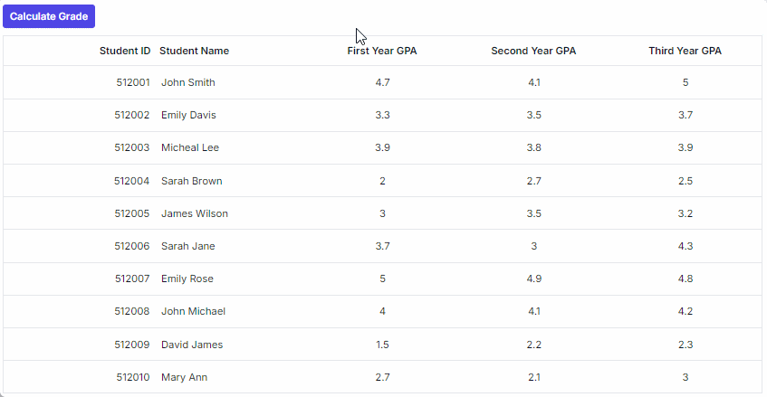
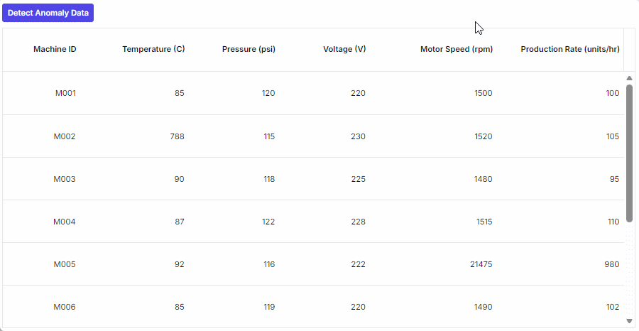
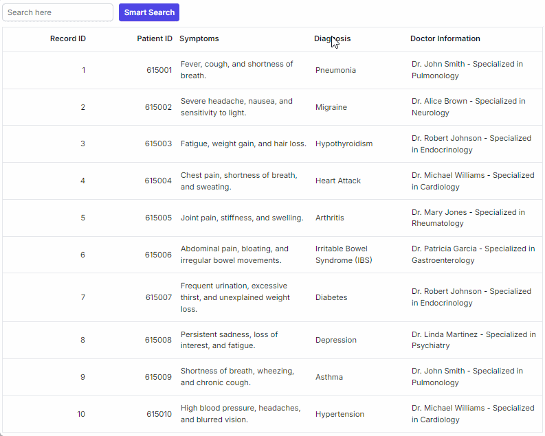

# Smart AI with Syncfusion React Grid

Easily integrate Syncfusion EJ2 React Grid with AI models (e.g., **OpenAI GPT-4o-mini**, **Azure OpenAI**) to enable predictive analysis, anomaly detection, and semantic filtering via natural language or data-driven prompts. This toolkit transforms your grid into an intelligent data explorer, predicting future values, spotting irregularities, and enabling semantic searches without exact keywords.

## Predictive analysis

Predictive analysis computes and fills missing or future values based on existing data patterns. To enable predictive analysis, add a button labeled **Calculate Grade** above the grid. When the user clicks this button, capture the grid's [dataSource](https://ej2.syncfusion.com/react/documentation/api/grid/index-default#datasource) and send it to your backend for predictive computation. The backend returns JSON object with predicted values for columns such as **Final Year GPA**, **Total GPA**, and **Total Grade**. Reveal these hidden columns using [showColumns](https://ej2.syncfusion.com/react/documentation/api/grid/index-default#showcolumns) and update rows using [setRowData](https://ej2.syncfusion.com/react/documentation/api/grid/index-default#setrowdata) with smooth animation for a better user experience. Apply conditional styling through the [queryCellInfo](https://ej2.syncfusion.com/react/documentation/api/grid/index-default#querycellinfo) event to highlight predicted values. 



















The following screenshot represents the predictive analysis,

## Anomaly detection using AI

Anomaly detection identifies irregular or illogical entries and provides explanations for flagged records. To integrate anomaly detection, add a button labeled **Detect Anomaly Data**. When clicked, send the full dataset to the backend for anomaly detection. The backend returns JSON object containing **Anomaly FieldName** and **Anomaly Description**. Reveal the hidden **Anomaly Description** column using [showColumns](https://ej2.syncfusion.com/react/documentation/api/grid/index-default#showcolumns) and update affected rows using [setRowData](https://ej2.syncfusion.com/react/documentation/api/grid/index-default#setrowdata). Highlight flagged cells in red and display anomaly descriptions using the [queryCellInfo](https://ej2.syncfusion.com/react/documentation/api/grid/index-default#querycellinfo) event for clarity.



















The following screenshot represents the anomaly detection,

## Semantic filtering

Semantic filtering enables natural language search for semantically related records. To enable semantic filtering, compute text embeddings in advance for all records during component mount, either locally or via a backend service. Add a search input and a **Smart Search** button to the UI. When the user clicks the button, generate an embedding for the search term and compute similarity against stored vectors. Select records above a similarity threshold, build a dynamic OR predicate using `Predicate`, and apply it through `grid.query`. 






















The following screenshot represents the semantic filtering,

