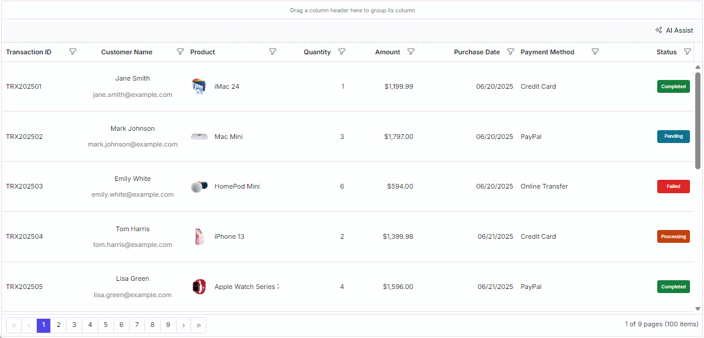

# Smart AI with Syncfusion React Grid

The AI Toolkit integrates natural language interaction into the EJ2 React Grid. By connecting the grid to a Large Language Model (LLM) such as **OpenAI GPT‑4o‑mini**, users can execute grid operations such as filtering, sorting, grouping, and pagination through simple text commands. Examples of grid operations:

* "Find iPhone 15 Pro"
* "Sort the Amount column from low to high"
* "Group by Status column"
* "Go to page 3"

This feature is particularly valuable for enterprise applications where efficient and user-friendly data manipulation is essential.

## How it works?

The AI Toolkit uses a **strict prompt** and **JSON output** strategy to ensure reliable and secure grid manipulation. Here's the workflow:

1. **User input:** The user enters a natural language query in the AI Assist panel.
2. **Prompt construction:** The client builds a strong prompt that combines the user query, column metadata (including field names and known values), and strict rules enforcing JSON-only output.
3. **LLM request:** The prompt is sent to a secure backend proxy (api/chat), which calls the LLM (e.g., GPT-4o-mini).
4. **Response processing:** The LLM returns a JSON object containing operations like: 
```typescript
{
    "filter": [{ "field": "status", "operator": "equal", "value": "Pending" }],
    "sort": [{ "field": "amount", "direction": "Ascending" }],
    "group": [{ "field": "quantity" }],
    "message": "Filtered by status = Pending, sorted by amount ascending and group by quantity."
}
```

5. **Apply changes:** The grid state can be updated either by modifying properties directly or by using Syncfusion Grid APIs, based on the JSON response. After applying the changes, the grid should be refreshed to reflect the updated state. The following example demonstrates how to update the grid state using properties: 

```typescript
    gridInstance.setProperties({ 
        filterSettings: { columns: data.filter },
        sortSettings = { columns: data.sort },
        groupSettings = { columns: data.group },
        pageSettings = { currentPage: data.page.pageNumber }
    }, true);
    gridInstance.refresh();
```

**Handle grid features**

AI is capable of performing a wide range of data operations and manipulations based on the provided input. The following features are handled in this user guide for executing actions using AI:

* Filtering – All Excel-style operators supported.
* Sorting – Multi-column, ascending/descending.
* Grouping – Group by one or more fields.
* Paging – Navigate to specific pages.
* Clearing – Remove filters, sorting, or grouping.

## Integrate AI with grid

To enable the AI Toolkit in your Syncfusion React Grid project, the following prerequisites must be satisfied:

Step 1: Syncfusion React Grid installed and configured

Follow the [getting started](https://ej2.syncfusion.com/react/documentation/grid/getting-started) to set up the grid in your application.

Step 2: Include Syncfusion's AI assist toolbar

Add the AI Assist toolbar component to your grid UI for AI interactions.

```typescript
<AIAssistViewComponent id="ai-grid-aiassistview" ref={(assist) => assistInstance = assist} toolbarSettings={toolbarSettings} promptRequest={onPromptRequest} promptSuggestionsHeader='Suggestions' responseItemTemplate={responseTemplate} >
    <ViewsDirective>
        <ViewDirective type='Assist' name=' Ask AI'></ViewDirective>
    </ViewsDirective>
</AIAssistViewComponent>
```

Step 3: LLM API key

Obtain an API key from your preferred Large Language Model provider, such as **OpenAI**, **Azure OpenAI**, or **Google Gemini**.

Step 4: Backend proxy

Implement a secure backend service to handle requests to the LLM API. This ensures your API key remains protected and allows you to apply rate limiting and security measures.

Step 5: Basic HTTP knowledge

Familiarity with making HTTP requests using fetch or axios is required for client-server communication.

## Build the prompt

The following prompt includes predefined rules to handle grid actions such as filtering, sorting, grouping, and pagination using **OpenAI GPT-4o-mini**. Similarly, you can create your own predefined rules to manage grid operations. To ensure consistency and machine-readability, use a strict template that enforces JSON-only output.

```typescript
Convert the following natural language query into a JSON object representing Syncfusion Query operations.

    Rules:
    - Output only the JSON object, with no extra text.
    - Available columns: ${JSON.stringify(columns)}.
    - Sort direction must be either "Ascending" or "Descending".
    
    Action Handling:
    - Include only actions explicitly mentioned in the query: filter, sort, page, group, clearFilter, clearSort, clearGroup.
    - Supported filter operators: startswith, endswith, contains, doesnotstartwith, doesnotendwith, doesnotcontain, equal, notequal, greaterthan, greaterthanorequal, lessthan, lessthanorequal, isnull, isnotnull, isempty, isnotempty, between, in, notin.
    - If the query involves only filtering, include only the "filter" key.
    - If the query involves only sorting, include only the "sort" key.
    - For clear actions:
    - Use clearFilter: [] to clear all filters.
    - Use clearSort: [] to clear all sorting.
    - Use clearGroup: [] to clear all grouping.
    - To clear specific fields, include them as arrays: clearFilter: ["field1"], clearSort: ["field2"], clearGroup: ["field3"].
    
    Supported Operations:
    - filter: [{ field, operator, value (array for "in"/"notin", otherwise single value), ignoreCase }]
    - sort: [{ field, direction }] // columns not available return [].
    - page: { pageNumber }  // for page navigation not pagesize.
    - group: [fields] - return group: [] if the columns not available.
    
    Additional Requirement:
    - sort/group/filter only by available columns.
    - Include a "message" field describing the interpreted query action and expected behavior.
    - Handled actions: paging, filtering, sorting, grouping.
    - If the action is not handled by this schema, need to clearly explain the action not handled in this schema and how to achieve it in Syncfusion React Grid. Dont explain the JSON structure.
    User Input: ${text}
```

## Apply grid actions

Convert the AI-generated prompt result into JSON format and execute the grid action based on that result. When using your own prompt, ensure the response is returned in JSON format. Parse the JSON and apply the action to the grid as shown below:

```typescript
    let jsonResult = result;
    if (result.indexOf("```json") !== -1) {
        jsonResult = result.split("```json")[1].split("```")[0].trim();
    }
    let data;
    data = JSON.parse(jsonResult);
    executeGridAction(data, gridInstance);
    assistInstance.addPromptResponse({ prompt: text, response: data });
```

The following code example demonstrates how to create a assistive grid to perform grid action using natural language. 

























The following screenshot represents the assistive grid action,

