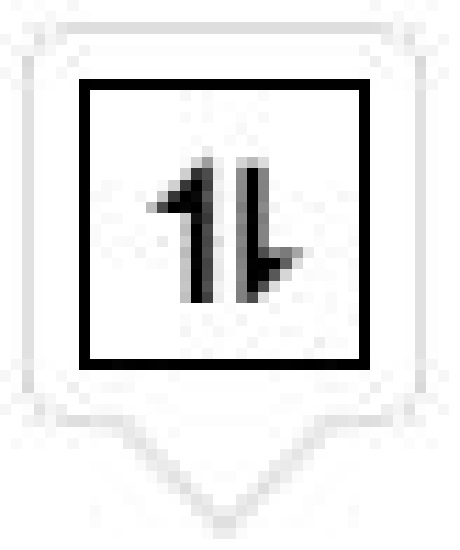
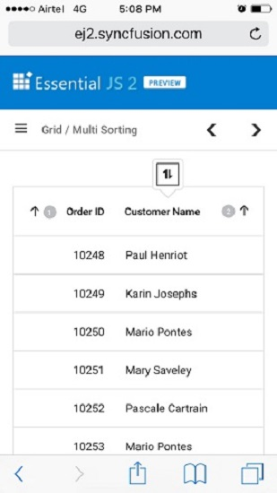

 
# Sorting in React Grid Component

The Grid component provides built-in support for sorting data-bound columns in ascending or descending order. To enable sorting in the grid, set the [allowSorting](https://ej2.syncfusion.com/react/documentation/api/grid#allowsorting) property to `true`.

Sorting a particular column is accomplished by clicking on its column header. Each click on the header toggles the sort order between `Ascending` and `Descending`.

To use the sorting feature, inject the `Sort` module in the grid.
















 

> * Grid column sorted in `Ascending` order. Clicking an already sorted column toggles the sort direction.
> * Sorting can be applied and cleared using the [sortColumn](https://ej2.syncfusion.com/react/documentation/api/grid#sortcolumn) and [clearSorting](https://ej2.syncfusion.com/react/documentation/api/grid#clearsorting) methods.
> * To disable sorting for a specific column, set the [allowSorting](https://ej2.syncfusion.com/react/documentation/api/grid/column#allowsorting) property to `false`.

## Initial sorting

The Grid component provided option to apply initial sorting by setting the [sortSettings.columns](https://ej2.syncfusion.com/react/documentation/api/grid/sortSettings#columns) property to the desired [field](https://ej2.syncfusion.com/react/documentation/api/grid/sortDescriptorModel#field) and sort [direction](https://ej2.syncfusion.com/react/documentation/api/grid/sortDescriptorModel#direction). This feature is useful for displaying data in a specific order when the grid initially loads.

The following example demonstrates setting [sortSettings.columns](https://ej2.syncfusion.com/react/documentation/api/grid/sortSettings#columns) for "OrderID" and "ShipCity" columns with a specified [direction](https://ej2.syncfusion.com/react/documentation/api/grid/sortDescriptorModel#direction).
















 

> The initial sorting defined in [sortSettings.columns](https://ej2.syncfusion.com/react/documentation/api/grid/sortSettings#columns) will override any sorting applied through user interaction.

## Multi-column sorting

The Grid component supports multi-column sorting, allowing multiple columns to be sorted simultaneously. To enable multi-column sorting, set the [allowSorting](https://ej2.syncfusion.com/react/documentation/api/grid#allowsorting) and the [allowMultiSorting](https://ej2.syncfusion.com/react/documentation/api/grid#allowmultisorting) properties to `true`. This enables sorting of multiple columns by holding the <kbd>CTRL</kbd> key and clicking the column headers. This feature is useful for sorting data based on multiple criteria to analyze it in various ways.

To clear multi-column sorting for a particular column, press <kbd>Shift</kbd> while clicking the column header.

> * The [allowSorting](https://ej2.syncfusion.com/react/documentation/api/grid#allowsorting) must be `true` while enabling multi-column sort.
> * Set [allowMultiSorting](https://ej2.syncfusion.com/react/documentation/api/grid#allowmultisorting) property as `false` to disable multi-column sorting.
















 

## Prevent sorting for particular column

The Grid component provides the ability to prevent sorting for a particular column. This is useful when certain columns should not be included in the sorting process. 

This is achieved by setting the [allowSorting](https://ej2.syncfusion.com/react/documentation/api/grid/column#allowsorting) property of the particular column to `false`. 

The following example demonstrates disabling sorting for "CustomerID" column.
















 

## Sort order

By default, the sorting order is "ascending → descending → none".

The first click on a column header sorts the column in ascending order. A second click sorts the column in descending order. A third click clears the sorting.

## Custom sorting 

The Grid component supports customizing the default sort action for a column by defining the [sortComparer](https://ej2.syncfusion.com/react/documentation/api/grid/column#sortcomparer) property. The `sortComparer` function works similarly to the [Array.sort](https://developer.mozilla.org/en-US/docs/Web/JavaScript/Reference/Global_Objects/Array/sort) comparer function, allowing custom sorting logic to be defined for a specific column.

The following example demonstrates defining a custom `sortComparer` function for the "Customer ID" column.
















 

> The "customSortComparer" function takes two parameters: a and b, which are the values being compared. The function returns -1, 0, or 1, depending on the comparison result.

### Display null values always at bottom 

By default, "null" values in a Syncfusion<sup style="font-size:70%">&reg;</sup> React Grid are displayed at the top when sorting in descending order and at the bottom when sorting in ascending order. However, "null" values can be configured to always display at the bottom of the grid regardless of sort direction. This is achieved by utilizing the [column.sortComparer](https://ej2.syncfusion.com/react/documentation/api/grid/column#sortcomparer) method. This feature is particularly useful when working with data sets where "null" values need to be clearly separated from actual data entries.

The example below demonstrates displaying "null" values at the bottom of the grid while sorting the "OrderDate" column in both ascending and descending order.
















 


## Touch interaction

On touch screen devices, tapping a grid header sorts the selected column and displays a popup  for multi-column sorting. Tapping the popup enables sorting of multiple columns . Additional columns can then be sorted by tapping their headers.

> The [allowMultiSorting](https://ej2.syncfusion.com/react/documentation/api/grid#allowmultisorting) and [allowSorting](https://ej2.syncfusion.com/react/documentation/api/grid#allowsorting) properties must be `true` for the popup to display.

The following screenshot represents a grid touch sorting in the device.



## Sort foreign key column based on text

Sorting based on a foreign key column is enabled by configuring the [dataSource](https://ej2.syncfusion.com/react/documentation/api/grid/column#datasource), [foreignKeyField](https://ej2.syncfusion.com/react/documentation/api/grid/column#foreignkeyfield), and [foreignKeyValue](https://ej2.syncfusion.com/react/documentation/api/grid/column#foreignkeyvalue) properties.

**Sort foreign key column based on text for local data**

In the case of local data in the grid, the sorting operation is performed based on the [foreignKeyValue](https://ej2.syncfusion.com/react/documentation/api/grid/column#foreignkeyvalue) property of the column. The `foreignKeyValue` property should be defined in the column definition with the corresponding foreign key value for each row. The grid sorts the foreign key column based on the text representation of the `foreignKeyValue` property.

The following example demonstrates sorting with a foreign key column enabled, where the "CustomerID" column acts as a foreign column displaying the "ContactName" column from foreign data.
















 

> The `ForeignKey` module must be injected in the grid to ensure its availability throughout the application.

**Sort foreign key column based on text for remote data**

In the case of remote data in the grid, the sorting operation is performed based on the [foreignKeyField](https://ej2.syncfusion.com/react/documentation/api/grid/column#foreignkeyfield) property of the column. The `foreignKeyField` property should be defined in the column definition with the corresponding foreign key field name. The grid sends a request to the server-side with the `foreignKeyField` name, and the server-side handles the sorting operation and returns the sorted data to the grid.

```typescript
import { DataManager, ODataV4Adaptor } from '@syncfusion/ej2-data';
import { ColumnDirective, ColumnsDirective, ForeignKey, GridComponent, Inject, Sort } from '@syncfusion/ej2-react-grids';
import * as React from 'react';

function App() {
  const data = new DataManager({
    adaptor: new ODataV4Adaptor,
    url: '/OData/Items'
  });
  const employeeData = new DataManager({
    adaptor: new ODataV4Adaptor,
    url: '/OData/Brands'
  });
  return <GridComponent dataSource={data} height={315}>
    <ColumnsDirective>
      <ColumnDirective field='OrderID' headerText='Order ID' width='100' textAlign="Right" />
      <ColumnDirective field='EmployeeID' foreignKeyValue='FirstName' foreignKeyField='EmployeeID'
        dataSource={employeeData} headerText='Employee Name' width='150' />
      <ColumnDirective field='Freight' headerText='Freight' width='80' textAlign="Right" format='C2' />
      <ColumnDirective field='ShipCity' headerText='Ship City' width='100' />
    </ColumnsDirective>
    <Inject services={[ForeignKey, Sort]} />
  </GridComponent>
};
export default App;
```

The following code example describes the handling of sorting operation at the server side.

```cs
public class ItemsController : ODataController
{
    [EnableQuery]
    public IQueryable<Item> Get()
    {
        List<Item> GridData = JsonConvert.DeserializeObject<Item[]>(Properties.Resources.ItemsJson).AsQueryable().ToList();
        List<Brand> empData = JsonConvert.DeserializeObject<Brand[]>(Properties.Resources.BrandsJson).AsQueryable().ToList();
        let queryString = HttpContext.Current.Request.QueryString;
        let allUrlKeyValues = ControllerContext.Request.GetQueryNameValuePairs();
        string key = allUrlKeyValues.LastOrDefault(x => x.Key == "$orderby").Value;
        if (key != null)
        {
            if (key == "EmployeeID") {
                GridData = SortFor(key); //Only for foreignKey Column ascending
            }
            else if(key == "EmployeeID desc") {
                GridData = SortFor(key); //Only for foreignKey Column descending
            }
        }
        let count = GridData.Count();
        let data = GridData.AsQueryable();
        return data;
    }

    public List<Item> SortFor(String Sorted)
    {
        List<Item> GridData = JsonConvert.DeserializeObject<Item[]>(Properties.Resources.ItemsJson).AsQueryable().ToList();
        List<Brand> empData = JsonConvert.DeserializeObject<Brand[]>(Properties.Resources.BrandsJson).AsQueryable().ToList();
        if (Sorted == "EmployeeID") //check whether ascending or descending
            empData = empData.OrderBy(e => e.FirstName).ToList();
        else if(Sorted == "EmployeeID desc")
            empData = empData.OrderByDescending(e => e.FirstName).ToList();
        List<Item> or = new List<Item>();
        for (int i = 0; i < empData.Count(); i++) {
            //Select the Field matching records
            IEnumerable<Item> list = GridData.Where(pred => pred.EmployeeID == empData[i].EmployeeID).ToList();
            or.AddRange(list);
        }
        return or;
    }
}
```

## Perform sorting based on its culture

Culture-based sorting in the Grid is achieved by utilizing the [locale](https://ej2.syncfusion.com/react/documentation/api/grid#locale) property. By setting the `locale` property to the desired culture code, sorting is enabled for that specific culture. This applies locale-specific sorting rules and ensures accurate ordering for different languages and regions.

In the following example, sorting is performed based on the "ar" locale using the [sortComparer](https://ej2.syncfusion.com/react/documentation/api/grid/column#sortcomparer) property.
















 

## customizing sort icon

Sort icon customization in the Grid is accomplished by overriding the default grid classes `.e-icon-ascending` and `.e-icon-descending` with custom content using CSS. The desired icons or symbols are specified using the `content` property as shown below:

```css
.e-grid .e-icon-ascending::before {
  content: '\e306';
}
	
.e-grid .e-icon-descending::before {
  content: '\e304';
}
```
The following sample demonstrates a grid rendered with a customized sort icon.
















 

## Sort columns externally

The Grid component provides flexibility in sorting based on external interactions. Columns can be sorted, sort columns removed, and sorting cleared using external button clicks.

### Add sort columns

External column sorting is accomplished using the [sortColumn](https://ej2.syncfusion.com/react/documentation/api/grid#sortcolumn) method with parameters `columnName`, `direction`, and `isMultiSort`. This method enables programmatic sorting of a specific column based on specified requirements.

The following example demonstrates adding sort columns to a grid. The `DropDownList` component selects the column and sort direction. When an external button is clicked, the [sortColumn](https://ej2.syncfusion.com/react/documentation/api/grid#sortcolumn) method is called with the specified `columnName`, `direction`, and `isMultiSort` parameters. 




import { ButtonComponent } from '@syncfusion/ej2-react-buttons';
import { DropDownListComponent } from '@syncfusion/ej2-react-dropdowns';
import { ColumnDirective, ColumnsDirective, GridComponent, Inject, Sort, SortDirection, SortSettingsModel } from '@syncfusion/ej2-react-grids';
import * as React from 'react';
import { data } from './datasource';

function App() {
  let grid;
  let dropColumn;
  let dropdirection;
  const columns = [
    { text: 'Order ID', value: 'OrderID' },
    { text: 'Customer ID', value: 'CustomerID' },
    { text: 'Freight', value: 'Freight' },
  ];
  const direction = [
    { text: 'Ascending', value: 'Ascending' },
    { text: 'Descending', value: 'Descending' },
  ];
  const field = { text: 'text', value: 'value' };
  const sortingOptions = {
    columns: [{ field: 'ShipName', direction: 'Ascending' }]
  };
  const addSortColumn = () => {
    grid.sortColumn(dropColumn.value, dropdirection.value, true);
  }
  return (<div>
    <div>
      <label style={{ padding: "30px 20px 0 0" }}> Column name :</label>
      <DropDownListComponent ref={dc => dropColumn = dc} index={0} width='120' dataSource={columns} fields={field}></DropDownListComponent></div>
    <div>
      <label style={{ padding: "30px 20px 0 0" }}> Sort direction :</label>
      <DropDownListComponent ref={dd => dropdirection = dd} index={0} width='120' dataSource={direction} fields={field}></DropDownListComponent></div>
    <ButtonComponent style={{ marginTop: "10px" }} cssClass='e-outline' onClick={addSortColumn}>Add Sort Column</ButtonComponent>
    <GridComponent ref={g => grid = g} dataSource={data} allowSorting={true} sortSettings={sortingOptions} height={315}>
      <ColumnsDirective>
        <ColumnDirective field='OrderID' headerText='Order ID' width='100' textAlign="Right" />
        <ColumnDirective field='CustomerID' headerText='Customer ID' width='100' />
        <ColumnDirective field='Freight' headerText='Freight' width='100' textAlign="Right" format='C'/>
        <ColumnDirective field='ShipName' headerText='Ship Name' width='100' />
      </ColumnsDirective>
      <Inject services={[Sort]} />
    </GridComponent></div>)
};
export default App;




import { ButtonComponent } from '@syncfusion/ej2-react-buttons';
import { DropDownListComponent } from '@syncfusion/ej2-react-dropdowns';
import { ColumnDirective, ColumnsDirective, GridComponent, Inject, Sort, SortDirection, SortSettingsModel } from '@syncfusion/ej2-react-grids';
import * as React from 'react';
import { data } from './datasource';

function App() {
  let grid: GridComponent | null;
  let dropColumn: DropDownListComponent | null;
  let dropdirection: DropDownListComponent | null;
  const columns: { [key: string]: Object; }[] = [
    { text: 'Order ID', value: 'OrderID' },
    { text: 'Customer ID', value: 'CustomerID' },
    { text: 'Freight', value: 'Freight' },
  ];
  const direction: { [key: string]: Object; }[] = [
    { text: 'Ascending', value: 'Ascending' },
    { text: 'Descending', value: 'Descending' },
  ];
  const field: Object = { text: 'text', value: 'value' };
  const sortingOptions: SortSettingsModel = {
    columns: [{ field: 'ShipName', direction: 'Ascending' }]
  };
  const addSortColumn = () => {
    (grid as GridComponent).sortColumn(((dropColumn as DropDownListComponent).value as string), ((dropdirection as DropDownListComponent).value as SortDirection), true);
  }
  return (<div>
    <div>
      <label style={{ padding: "30px 20px 0 0" }}> Column name :</label>
      <DropDownListComponent ref={dc => dropColumn = dc} index={0} width='120' dataSource={columns} fields={field}></DropDownListComponent></div>
    <div>
      <label style={{ padding: "30px 20px 0 0" }}> Sort direction :</label>
      <DropDownListComponent ref={dd => dropdirection = dd} index={0} width='120' dataSource={direction} fields={field}></DropDownListComponent></div>
    <ButtonComponent style={{ marginTop: "10px" }} cssClass='e-outline' onClick={addSortColumn}>Add Sort Column</ButtonComponent>
    <GridComponent ref={g => grid = g} dataSource={data} allowSorting={true} sortSettings={sortingOptions} height={315}>
      <ColumnsDirective>
        <ColumnDirective field='OrderID' headerText='Order ID' width='100' textAlign="Right" />
        <ColumnDirective field='CustomerID' headerText='Customer ID' width='100' />
        <ColumnDirective field='Freight' headerText='Freight' width='100' format='C' textAlign="Right" />
        <ColumnDirective field='ShipName' headerText='Ship Name' width='100' />
      </ColumnsDirective>
      <Inject services={[Sort]} />
    </GridComponent></div>)
};
export default App;










 

### Remove sort columns

External removal of sort columns is accomplished using the `removeSortColumn` method provided by the Grid component. This method removes the sorting applied to a specific column.

The following example demonstrates removing sort columns. The `DropDownList` component selects the column. When an external button is clicked, the `removeSortColumn` method removes the selected sort column.




import { ButtonComponent } from '@syncfusion/ej2-react-buttons';
import { DropDownListComponent } from '@syncfusion/ej2-react-dropdowns';
import { ColumnDirective, ColumnsDirective, GridComponent, Inject, Sort, SortSettingsModel } from '@syncfusion/ej2-react-grids';
import * as React from 'react';
import { data } from './datasource';

function App() {
  let grid;
  let dropColumn;
  const columns = [
    { text: 'Order ID', value: 'OrderID' },
    { text: 'Customer ID', value: 'CustomerID' },
    { text: 'ShipCity', value: 'ShipCity' },
    { text: 'ShipName', value: 'ShipName' }
  ];
  const field = { text: 'text', value: 'value' };
  const sortingOptions = {
    columns: [{ field: 'CustomerID', direction: 'Ascending' }, { field: 'ShipName', direction: 'Descending' }]
  };
  const addSortColumn = () => {
    grid.removeSortColumn(dropColumn.value);
  }
  return (<div>
    <div>
      <label style={{ padding: "30px 20px 0 0" }}> Column name :</label>
      <DropDownListComponent ref={dc => dropColumn = dc} index={0} width='120' dataSource={columns} fields={field}></DropDownListComponent></div>
    <ButtonComponent style={{ marginTop: "10px" }} cssClass='e-outline' onClick={addSortColumn}>Remove Sort Column</ButtonComponent>
    <GridComponent ref={g => grid = g} dataSource={data} allowSorting={true} sortSettings={sortingOptions} height={315}>
      <ColumnsDirective>
        <ColumnDirective field='OrderID' headerText='Order ID' width='100' textAlign="Right" />
        <ColumnDirective field='CustomerID' headerText='Customer ID' width='100' />
        <ColumnDirective field='ShipCity' headerText='Ship City' width='100' textAlign="Right" />
        <ColumnDirective field='ShipName' headerText='Ship Name' width='100' />
      </ColumnsDirective>
      <Inject services={[Sort]} />
    </GridComponent></div>)
};
export default App;




import { ButtonComponent } from '@syncfusion/ej2-react-buttons';
import { DropDownListComponent } from '@syncfusion/ej2-react-dropdowns';
import { ColumnDirective, ColumnsDirective, GridComponent, Inject, Sort, SortSettingsModel } from '@syncfusion/ej2-react-grids';
import * as React from 'react';
import { data } from './datasource';

function App() {
  let grid: GridComponent | null;
  let dropColumn: DropDownListComponent | null;
  const columns: { [key: string]: Object; }[] = [
    { text: 'Order ID', value: 'OrderID' },
    { text: 'Customer ID', value: 'CustomerID' },
    { text: 'ShipCity', value: 'ShipCity' },
    { text: 'ShipName', value: 'ShipName' }
  ];
  const field: Object = { text: 'text', value: 'value' };
  const sortingOptions: SortSettingsModel = {
    columns: [{ field: 'CustomerID', direction: 'Ascending' }, { field: 'ShipName', direction: 'Descending' }]
  };
  const removeSortColumn = () => {
    (grid as GridComponent).removeSortColumn(((dropColumn as DropDownListComponent).value as string));
  }
  return (<div>
    <div>
      <label style={{ padding: "30px 20px 0 0" }}> Column name :</label>
      <DropDownListComponent ref={dc => dropColumn = dc} index={0} width='120' dataSource={columns} fields={field}></DropDownListComponent></div>
    <ButtonComponent style={{ marginTop: "10px" }} cssClass='e-outline' onClick={removeSortColumn}>Remove Sort Column</ButtonComponent>
    <GridComponent ref={g => grid = g} dataSource={data} allowSorting={true} sortSettings={sortingOptions} height={315}>
      <ColumnsDirective>
        <ColumnDirective field='OrderID' headerText='Order ID' width='100' textAlign="Right" />
        <ColumnDirective field='CustomerID' headerText='Customer ID' width='100' />
        <ColumnDirective field='ShipCity' headerText='Ship City' width='100' textAlign="Right" />
        <ColumnDirective field='ShipName' headerText='Ship Name' width='100' />
      </ColumnsDirective>
      <Inject services={[Sort]} />
    </GridComponent></div>)
};
export default App;










 

### Clear sorting 

Sorting is cleared on an external button click using the [clearSorting](https://ej2.syncfusion.com/react/documentation/api/grid#clearsorting) method provided by the Grid component. This method clears the sorting applied to all columns in the grid. 

The following example demonstrates clearing sorting using the `clearSorting` method on an external button click.




import { ButtonComponent } from '@syncfusion/ej2-react-buttons';
import { ColumnDirective, ColumnsDirective, GridComponent, Inject, Sort, SortSettingsModel } from '@syncfusion/ej2-react-grids';
import * as React from 'react';
import { data } from './datasource';

function App() {
  let grid;
  const sortingOptions = {
    columns: [{ field: 'CustomerID', direction: 'Ascending' }, { field: 'ShipName', direction: 'Descending' }]
  };
  const clearSorting = () => {
    grid.clearSorting();
  }
  return (<div>
    <ButtonComponent style={{ marginTop: "10px" }} cssClass='e-outline' onClick={clearSorting}>Clear Sorting</ButtonComponent>
    <GridComponent ref={g => grid = g} dataSource={data} allowSorting={true} sortSettings={sortingOptions} height={315}>
      <ColumnsDirective>
        <ColumnDirective field='OrderID' headerText='Order ID' width='100' textAlign="Right" />
        <ColumnDirective field='CustomerID' headerText='Customer ID' width='100' />
        <ColumnDirective field='ShipCity' headerText='Ship City' width='100' textAlign="Right" />
        <ColumnDirective field='ShipName' headerText='Ship Name' width='100' />
      </ColumnsDirective>
      <Inject services={[Sort]} />
    </GridComponent></div>)
};
export default App;




import { ButtonComponent } from '@syncfusion/ej2-react-buttons';
import { ColumnDirective, ColumnsDirective, GridComponent, Inject, Sort, SortSettingsModel } from '@syncfusion/ej2-react-grids';
import * as React from 'react';
import { data } from './datasource';

function App() {
  let grid: GridComponent | null;
  const sortingOptions: SortSettingsModel = {
    columns: [{ field: 'CustomerID', direction: 'Ascending' }, { field: 'ShipName', direction: 'Descending' }]
  };
  const clearSorting = () => {
    (grid as GridComponent).clearSorting();
  }
  return (<div>
    <ButtonComponent style={{ marginTop: "10px" }} cssClass='e-outline' onClick={clearSorting}>Clear Sorting</ButtonComponent>
    <GridComponent ref={g => grid = g} dataSource={data} allowSorting={true} sortSettings={sortingOptions} height={315}>
      <ColumnsDirective>
        <ColumnDirective field='OrderID' headerText='Order ID' width='100' textAlign="Right" />
        <ColumnDirective field='CustomerID' headerText='Customer ID' width='100' />
        <ColumnDirective field='ShipCity' headerText='Ship City' width='100' textAlign="Right" />
        <ColumnDirective field='ShipName' headerText='Ship Name' width='100' />
      </ColumnsDirective>
      <Inject services={[Sort]} />
    </GridComponent></div>)
};
export default App;










 

## Sorting events

The Grid component provides two events that are triggered during the sorting action such as [actionBegin](https://ej2.syncfusion.com/react/documentation/api/grid#actionbegin) and [actionComplete](https://ej2.syncfusion.com/react/documentation/api/grid#actioncomplete). These events enable custom actions to be performed before and after the sorting action completes.

1. **actionBegin**: `actionBegin` event is triggered before the sorting action begins. It enables performing necessary operations before the sorting action takes place. This event provides a parameter containing the current grid state, including the current sorting column, direction, and data.

2. **actionComplete**: `actionComplete` event is triggered after the sorting action completes. It enables performing necessary operations after the sorting action has taken place. This event provides a parameter containing the current grid state, including the sorted data and column information.

The following example demonstrates the `actionBegin` and `actionComplete` events during sorting. The `actionBegin` event cancels sorting of the OrderID column. The `actionComplete` event displays a message.




import { ColumnDirective, ColumnsDirective, GridComponent, Inject, Sort } from '@syncfusion/ej2-react-grids';
import * as React from 'react';
import { useState } from 'react';
import { data } from './datasource';

function App() {
  const [message, setMessage] = useState('');
  const actionBegin = (args) => {
    if (args.requestType === 'sorting' && args.columnName === 'OrderID') {
      setMessage(args.requestType + ' action cancelled for ' + args.columnName + ' column');
      args.cancel = true;
    }
  }
  const actionComplete = (args) => {
    setMessage(args.requestType + ' action completed for ' + args.columnName + ' column');
  }
  return (<div>
    <div style={{ marginLeft: "100px" }}><p style={{ color: "red" }} id="message">{message}</p></div>
    <GridComponent dataSource={data} allowSorting={true} height={315} actionBegin={actionBegin} actionComplete={actionComplete}>
      <ColumnsDirective>
        <ColumnDirective field='OrderID' headerText='Order ID' width='100' textAlign="Right" />
        <ColumnDirective field='CustomerID' headerText='Customer ID' width='100' />
        <ColumnDirective field='ShipCity' headerText='Ship City' width='100' textAlign="Right" />
        <ColumnDirective field='ShipName' headerText='Ship Name' width='100' />
      </ColumnsDirective>
      <Inject services={[Sort]} />
    </GridComponent></div>)
};
export default App;




import { ColumnDirective, ColumnsDirective, GridComponent, Inject, Sort, SortEventArgs } from '@syncfusion/ej2-react-grids';
import * as React from 'react';
import { useState } from 'react';
import { data } from './datasource';

function App() {
  const [message, setMessage] = useState('');
  const actionBegin = (args: SortEventArgs) => {
    if (args.requestType === 'sorting' && args.columnName === 'OrderID') {
      setMessage(args.requestType + ' action cancelled for ' + args.columnName + ' column');
      args.cancel = true;
    }
  }
  const actionComplete = (args: SortEventArgs) => {
    setMessage(args.requestType + ' action completed for ' + args.columnName + ' column');
  }
  return (<div>
    <div style={{ marginLeft: "100px" }}><p style={{ color: "red" }} id="message">{message}</p></div>
    <GridComponent dataSource={data} allowSorting={true} height={315} actionBegin={actionBegin} actionComplete={actionComplete}>
      <ColumnsDirective>
        <ColumnDirective field='OrderID' headerText='Order ID' width='100' textAlign="Right" />
        <ColumnDirective field='CustomerID' headerText='Customer ID' width='100' />
        <ColumnDirective field='ShipCity' headerText='Ship City' width='100' textAlign="Right" />
        <ColumnDirective field='ShipName' headerText='Ship Name' width='100' />
      </ColumnsDirective>
      <Inject services={[Sort]} />
    </GridComponent></div>)
};
export default App;










 

> [args.requestType](https://ej2.syncfusion.com/react/documentation/api/grid/sortEventArgs#requesttype) refers to the current action being performed. For example in sorting, the `args.requestType` value is "sorting".

## See also

[How to change loading indicator in React Grid](./data-binding/data-binding#loading-animation)