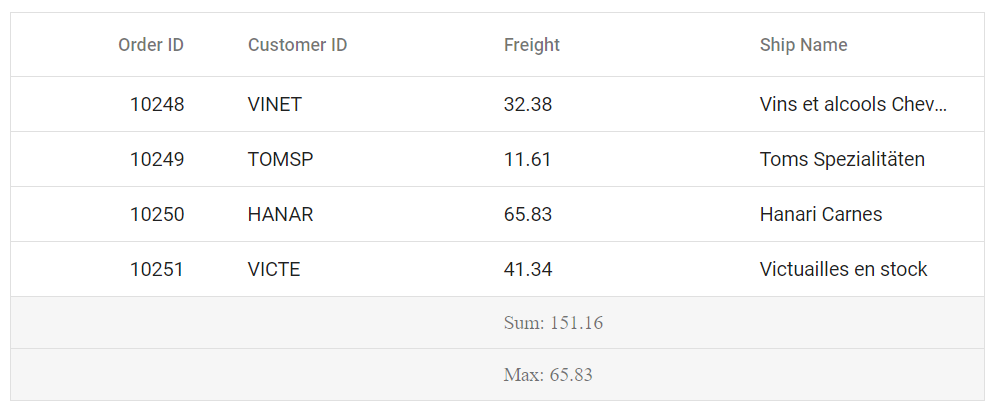
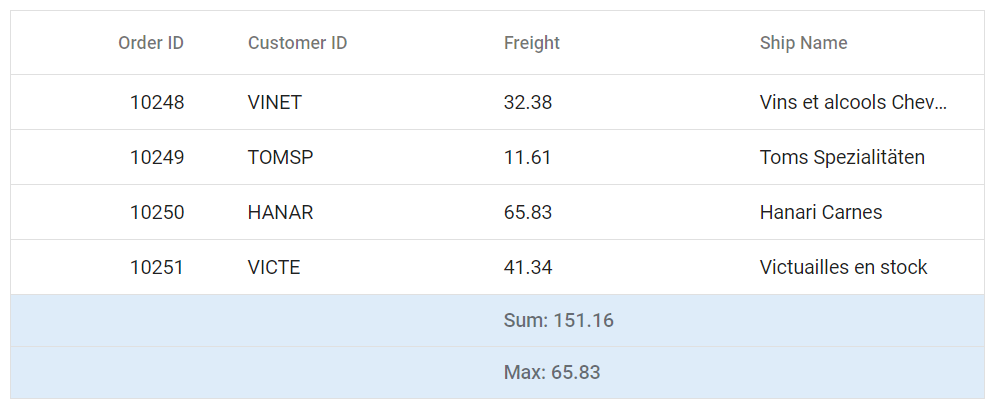

# Aggregate Customization in React Grid Component

The appearance of aggregate elements in the Syncfusion<sup style="font-size:70%">&reg;</sup> React Grid component can be customized using CSS. Below are examples for customizing the aggregate root element and the aggregate cell elements.

## Customizing the aggregate root element

The `.e-gridfooter` class is used to style the aggregate root element in the grid footer.

```css
.e-grid .e-gridfooter {
    font-family: cursive;
}
```



## Customizing the aggregate cell elements

The `.e-summaryrow` class is used to style the summary row, and the `.e-summarycell` class is used to style individual aggregate cells.

```css
.e-grid .e-summaryrow .e-summarycell {
    background-color: #deecf9;
}
```

