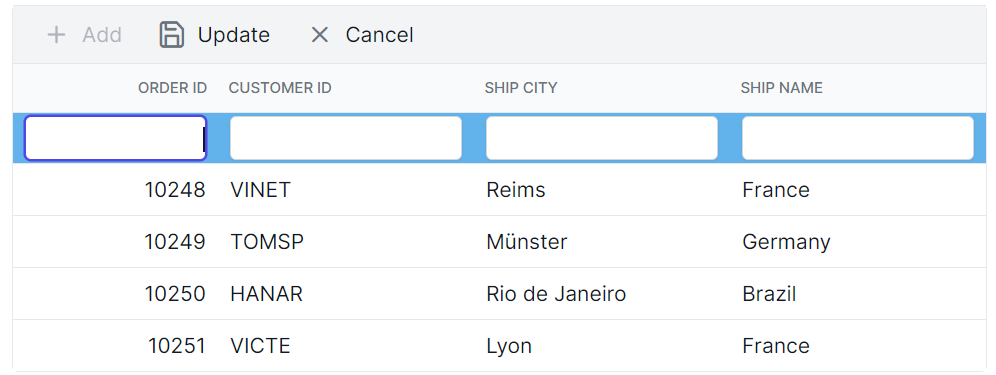
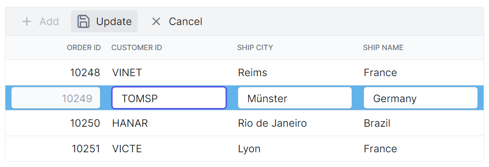
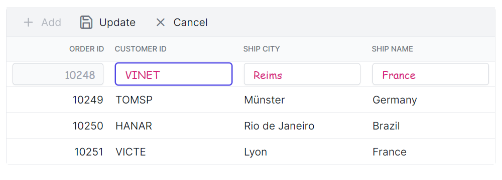
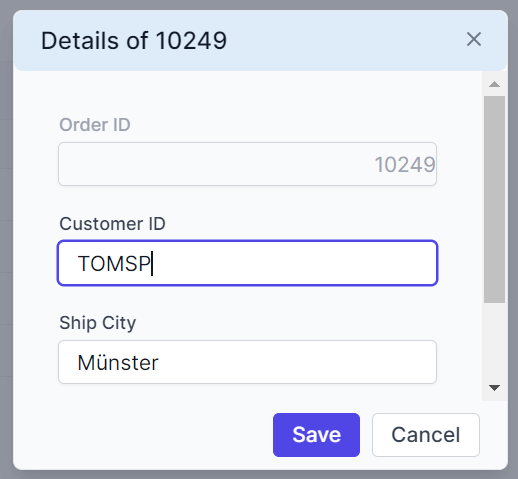
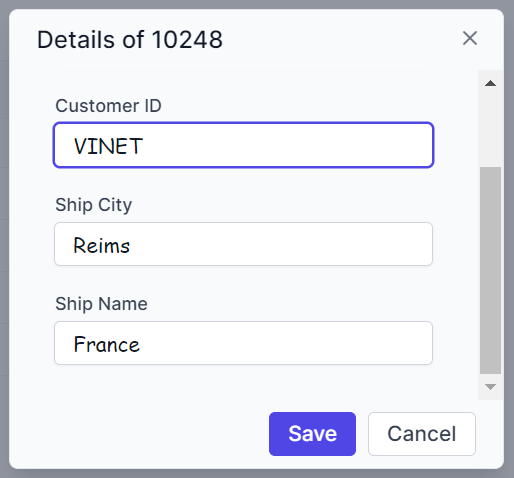
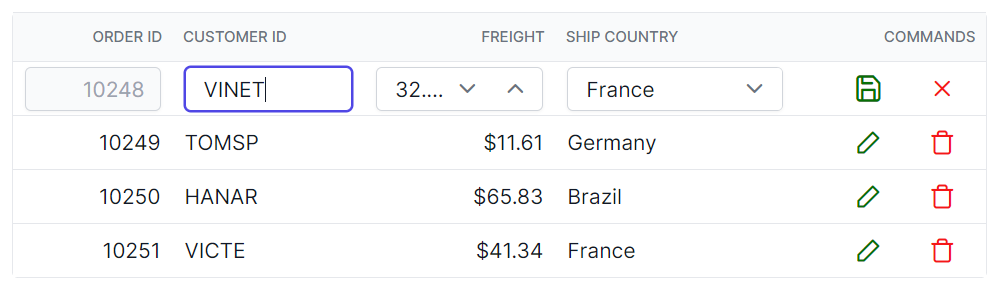

# Editing Customization in React Grid Component

The appearance of editing-related elements in the Syncfusion<sup style="font-size:70%">&reg;</sup> React Grid component can be customized using CSS. Below are examples for customizing various editing-related elements.

## Customizing the edited and added row element

The `.e-editedrow` and `.e-addedrow` classes are used to style edited and added row table elements.

```css
.e-grid .e-editedrow table, .e-grid .e-addedrow table {
    background-color: #62b2eb;
}
```




## Customizing the edited row input element

The `.e-gridform` and `.e-input` classes are used to style edited form row input element.

```css
.e-grid .e-gridform .e-rowcell .e-input-group .e-input.e-field {
    font-family: cursive;
    color:rgb(214, 33, 123)
}
```



## Customizing the edit dialog header element

The `.e-edit-dialog` and `.e-dlg-header-content` classes are used to style the dialog header element.

```css
.e-grid .e-edit-dialog .e-dlg-header-content {
    background-color: #deecf9;
}
```



## Customizing the edited row input element in dialog edit mode

The `.e-gridform` and `.e-float-input` classes are used to customize the input elements within the edit dialog.

```css
.e-grid .e-gridform .e-rowcell .e-float-input .e-field {
    font-family: cursive;
}
```



## Customizing the command column buttons

The  `.e-edit`, `.e-delete`, `.e-update`, and `.e-cancel-icon`  classes are used to style the respective command column buttons in the grid.

```css
.e-grid .e-delete::before ,.e-grid .e-cancel-icon::before{
    color: #f51717;
}
.e-grid .e-edit::before, .e-grid .e-update::before {
    color: #077005;
}
```


