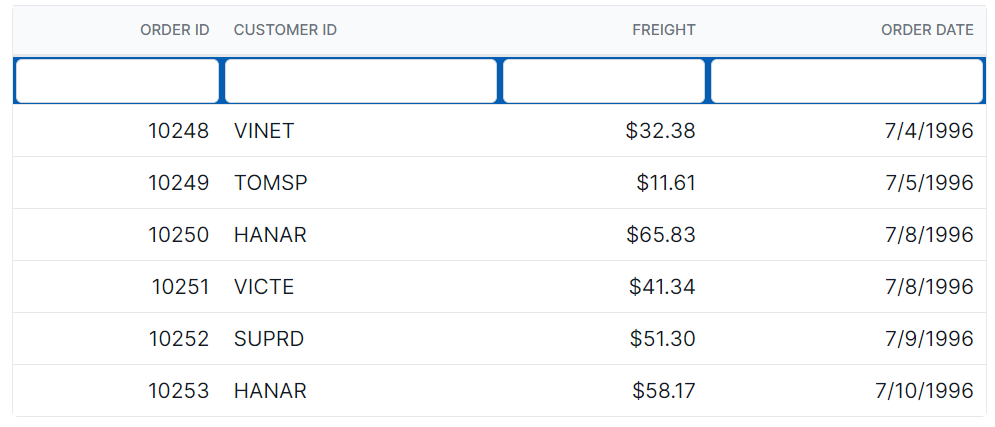
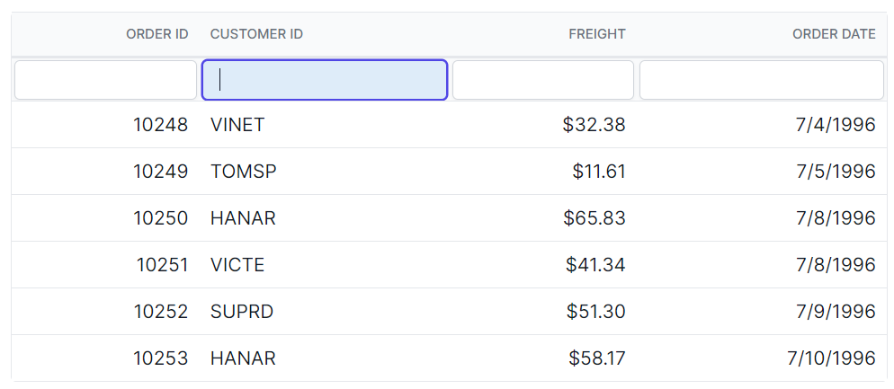
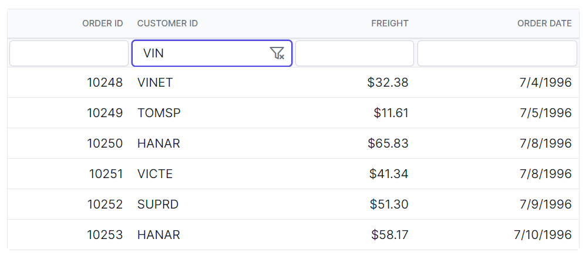
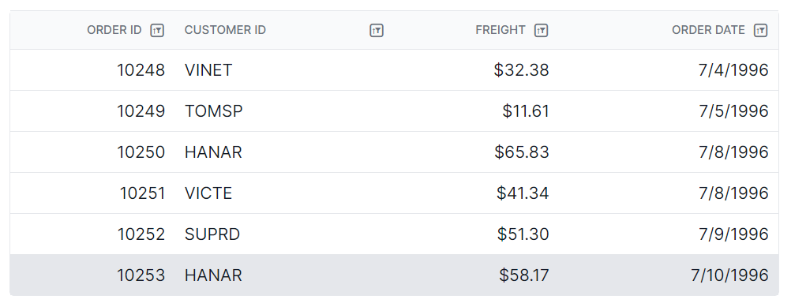
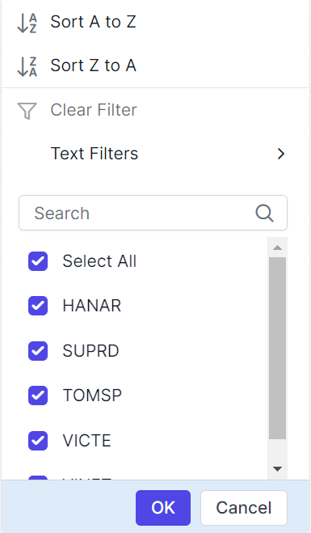
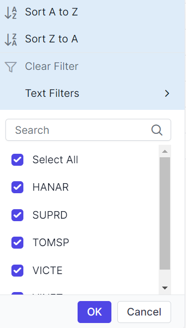

# Filter Customization in React Grid Component

The appearance of filtering elements in the Syncfusion<sup style="font-size:70%">&reg;</sup> React Grid component can be customized using CSS. Below are examples for customizing various filtering elements, including filter bar cell elements, filter bar input elements, focus styles, clear icons, filter icons, filter dialog content, filter dialog footer, filter dialog input elements, filter dialog button elements, and excel filter dialog number filters.

## Customizing the filter bar cell element

The `.e-filterbarcell` class is used to style the filter bar cell element in the grid header.

```css
.e-grid .e-filterbarcell {
      background-color: #045fb4;
}
```



## Customizing the filter bar input element

The `.e-filterbarcell` and `.e-input` classes are used to style the filter bar input element.

```css
.e-grid .e-filterbarcell .e-input-group input.e-input{
      font-family: cursive;
}
```


## Customizing the filter bar input focus

The `.e-filterbarcell` and `.e-input-group.e-input-focus` classes are used to style the focused filter bar input element.

```css
.e-grid .e-filterbarcell .e-input-group.e-input-focus{
      background-color: #deecf9;
}
```




## Customizing the filter bar input clear icon

The `.e-clear-icon` class is used to style the clear icon element within the input group.

```css
.e-grid .e-filterbarcell .e-input-group .e-clear-icon::before {
      content: '\e72c';
}
```



## Customizing the grid filtering icon

The `.e-icon-filter` class is used to style the filtering icon element in the grid header.

```css
.e-grid .e-icon-filter::before{
      content: '\e81e';
}
```



## Customizing the filter dialog content

The `.e-filter-popup .e-dlg-content` classes are used to style the content element within the filter dialog.

```css
.e-grid .e-filter-popup .e-dlg-content {
      background-color: #deecf9;
}
```


## Customizing the filter dialog footer

The `.e-filter-popup .e-footer-content` classes are used to style the footer element within the filter dialog.

```css
.e-grid .e-filter-popup .e-footer-content {
      background-color: #deecf9;
}
```



## Customizing the filter dialog input element

The `.e-filter-popup` and `.e-input` classes are used to style the input elements within the filter dialog.

```css
.e-grid .e-filter-popup .e-input-group input.e-input{
      font-family: cursive;
}
```


## Customizing the filter dialog button element

The `.e-filter-popup` and `.e-btn` classes are used to style the button elements within the filter dialog.

```css
.e-grid .e-filter-popup .e-btn{
      font-family: cursive;
}
```


## Customizing the excel filter dialog number filters element

The `.e-filter-popup .e-contextmenu-wrapper ul` classes are used to style the number filter elements within the `Excel` filter dialog.

```css
.e-grid .e-filter-popup .e-contextmenu-wrapper ul{
      background-color: #deecf9;
}
```

