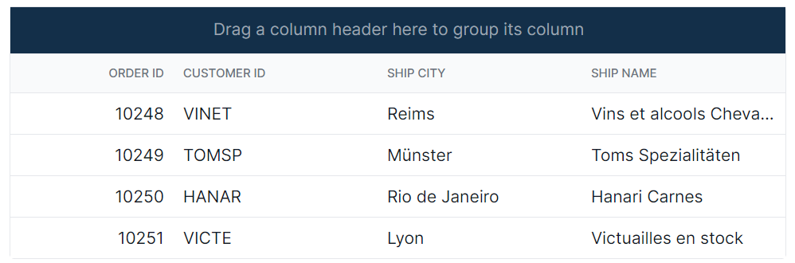
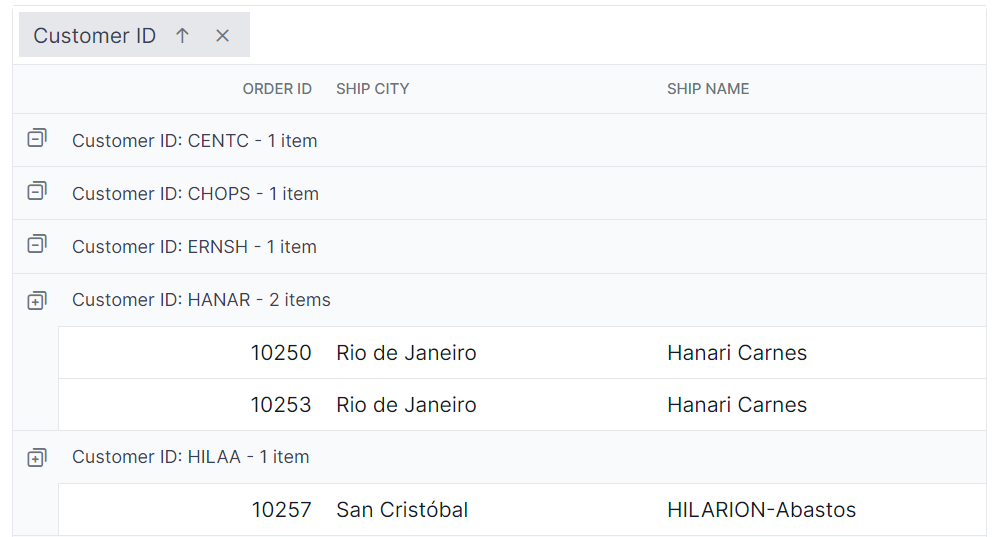
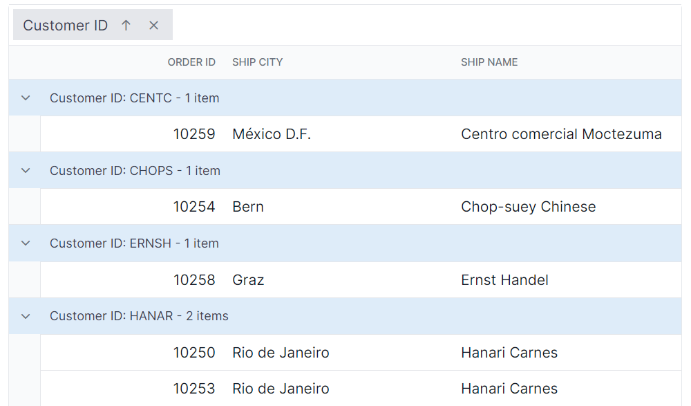
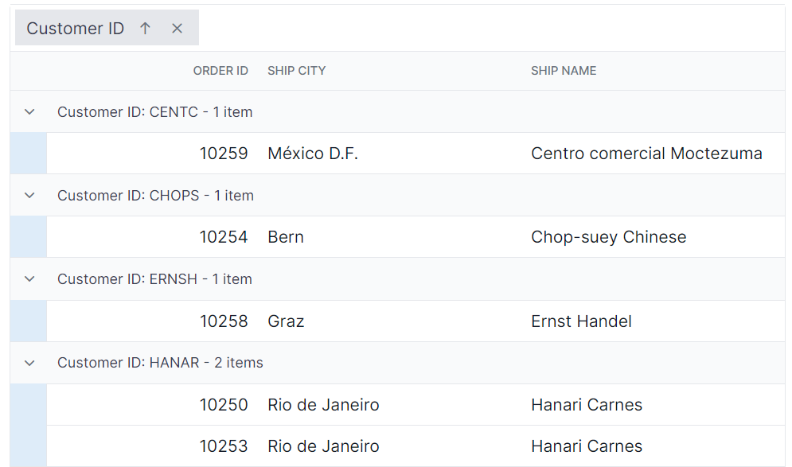

# Grouping Customization in React Grid Component

The appearance of grouping elements in the Syncfusion<sup style="font-size:70%">&reg;</sup> React Grid component can be customized using CSS. Here are examples for customizing the group header, group expand/collapse icons, group caption row, and grouping indent cell.

## Customizing the group header

The `.e-groupdroparea` class is used to style the group header element.

```css
.e-grid .e-groupdroparea {
    background-color: #132f49;
}
```



## Customizing the group expand or collapse icons

The `.e-icon-gdownarrow` and `.e-icon-grightarrow` classes are used to style the expand and collapse icons.

```css
.e-grid .e-icon-gdownarrow::before{
    content:'\e7c9'
    }
    .e-grid .e-icon-grightarrow::before{
    content:'\e80f'
}
```

In this example, the `content` property is modified to change the icon displayed. Available Syncfusion<sup style="font-size:70%">&reg;</sup> icons can be used based on the active theme.



## Customizing the group caption row

The `.e-groupcaption` class is used to style the group caption row element, and the `.e-recordplusexpand` and `.e-recordpluscollapse` classes are used for the icons indicating record expansion or collapse.

```css
.e-grid .e-groupcaption {
    background-color: #deecf9;
}

.e-grid .e-recordplusexpand,
.e-grid .e-recordpluscollapse {
    background-color: #deecf9;
}
```



## Customizing the grouping indent cell

The `.e-indentcell` class is used to style the indent cell that appears in grouped grid rows.

```css
.e-grid .e-indentcell {
    background-color: #deecf9;
}
```

