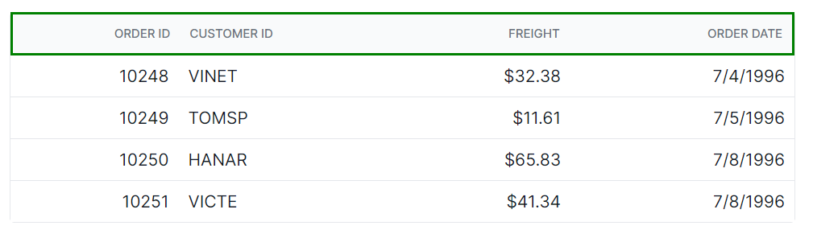
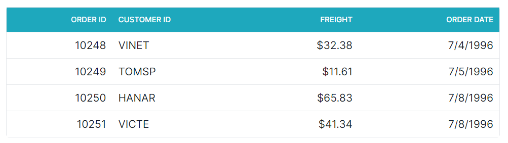

# Header in React Grid Component

The appearance of the header elements in the Syncfusion<sup style="font-size:70%">&reg;</sup> React Grid component can be customized using CSS. Here are examples for customizing the grid header, header cell, and header cell div element.

## Customizing the grid header

The `.e-gridheader` class is used to style the root element of the grid header.

```css
.e-grid .e-gridheader {
    border: 2px solid green;
}
```



## Customizing the grid header cell

The `.e-headercell` class is used to style the root element of the header cell elements.

```css
.e-grid .e-headercell {
    color: #ffffff;
    background-color: #1ea8bd;
}
```



## Customizing the grid header cell div element

The `.e-headercelldiv` class is used to apply custom styles to the div element inside each grid header cell.

```css
.e-grid .e-headercelldiv {
    font-size: 15px;
    font-weight: bold;
    color: darkblue;
}
```

