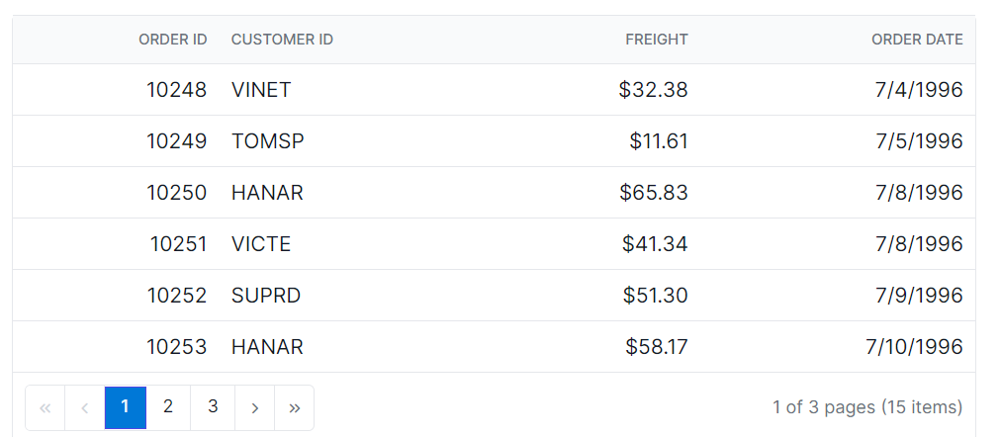

# Paging Customization in React Grid Component

The appearance of the paging elements in the Syncfusion<sup style="font-size:70%">&reg;</sup> React Grid component can be customized using CSS. Here are examples for customizing the pager root element, pager container element, pager navigation elements, pager page numeric link elements, and the pager current page numeric element.

## Customizing the grid pager root element

The `.e-gridpager` class is used to style the pager root element.

```css
.e-grid .e-gridpager {
    font-family: cursive;
    background-color: #deecf9;
}
```


## Customizing the grid pager container element

The `.e-pagercontainer` class is used to style the pager container element.

```css
.e-grid .e-pagercontainer {
    border: 2px solid #00b5ff;
    font-family: cursive;
}
```


## Customizing the grid pager navigation elements

The classes `.e-prevpagedisabled`, `.e-prevpage`, `.e-nextpage`, `.e-nextpagedisabled`, `.e-lastpagedisabled`, `.e-lastpage`, .`e-firstpage`, and `.e-firstpagedisabled` are used to style the various pager navigation elements.

```css
.e-grid .e-gridpager .e-prevpagedisabled,
.e-grid .e-gridpager .e-prevpage,
.e-grid .e-gridpager .e-nextpage,
.e-grid .e-gridpager .e-nextpagedisabled,
.e-grid .e-gridpager .e-lastpagedisabled,
.e-grid .e-gridpager .e-lastpage,
.e-grid .e-gridpager .e-firstpage,
.e-grid .e-gridpager .e-firstpagedisabled {
    background-color: #deecf9;
}
```


## Customizing the grid pager page numeric link elements

The `.e-numericitem` class is used to style the page numeric link elements.

```css
.e-grid .e-gridpager .e-numericitem {
    background-color: #5290cb;
    color: #ffffff;
    cursor: pointer;
    }
    
    .e-grid .e-gridpager .e-numericitem:hover {
    background-color: white;
    color:  #007bff;
}
```


## Customizing the grid pager current page numeric element

The `.e-currentitem` class is used to style the current page numeric item.

```css
.e-grid .e-gridpager .e-currentitem {
    background-color: #0078d7;
    color: #fff;
}
```

