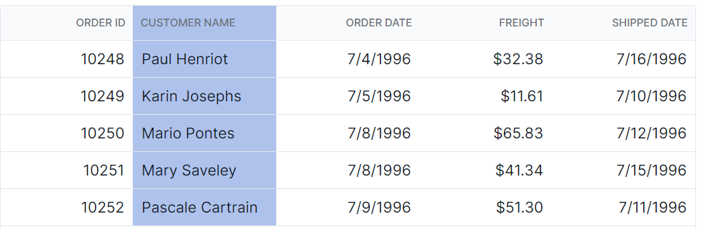

# Selection Customization in React Grid Component

The appearance of selection in the Syncfusion<sup style="font-size:70%">&reg;</sup> React Grid component can be customized using CSS. Here are examples for customizing the row selection background, cell selection background, and column selection background.

## Customizing the row selection background

The `.e-selectionbackground` class is used to style the row selection background.

```css
.e-grid td.e-selectionbackground {
    background-color: #00b7ea;
}
```


## Customizing the cell selection background

The `.e-cellselectionbackground` class is used to style the cell selection background.

```css
.e-grid td.e-cellselectionbackground {
    background-color: #00b7ea;
}
```


## Customizing the column selection background

The `.e-columnselection` class is used to style the column selection background.

```css
.e-grid .e-columnselection {
    background-color: #aec2ec;
}
```

