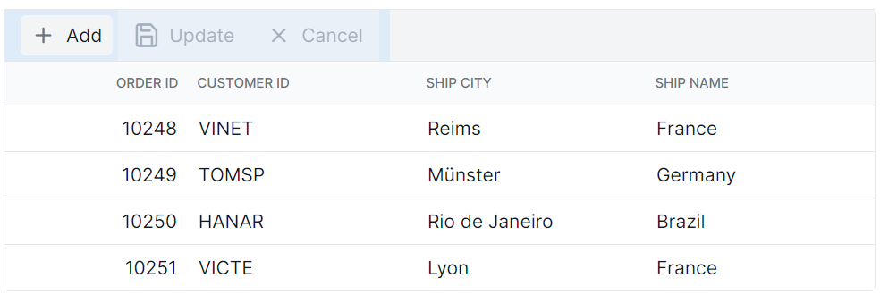

# Toolbar Customization in React Grid Component

The appearance of the toolbar in the Syncfusion<sup style="font-size:70%">&reg;</sup> React Grid component can be customized using CSS. Here are examples for customizing the toolbar root element and toolbar button element.

## Customizing the toolbar root element

The `.e-toolbar-items` class is used to style the toolbar root element.

```css
.e-grid .e-toolbar-items {
    background-color: #deecf9;
} 
```



## Customizing the toolbar button element

The `.e-toolbar .e-btn` selector is used to style the toolbar button elements.

```css
.e-grid .e-toolbar .e-btn {
    background-color: #deecf9;
}
```

