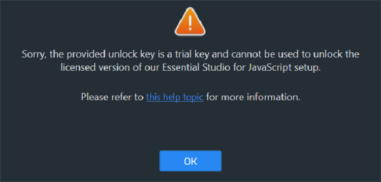
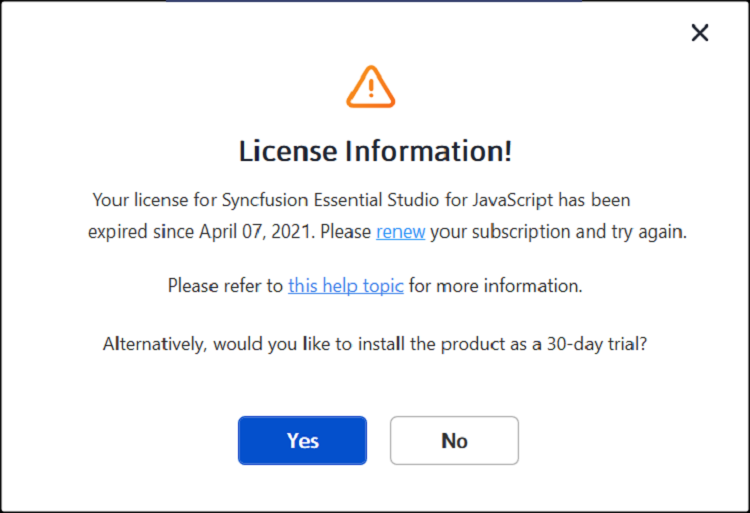
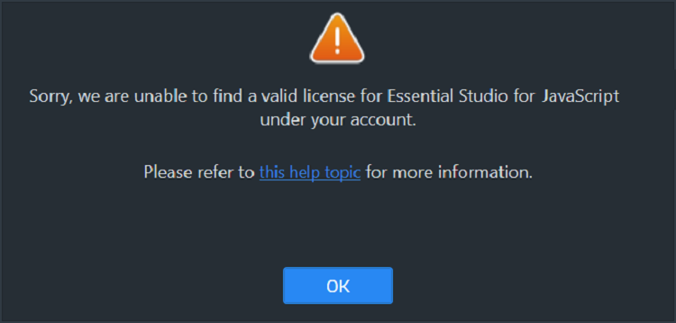
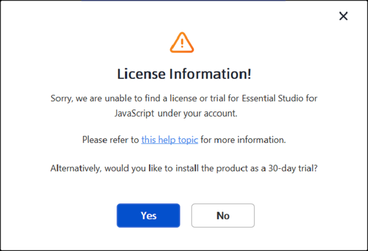
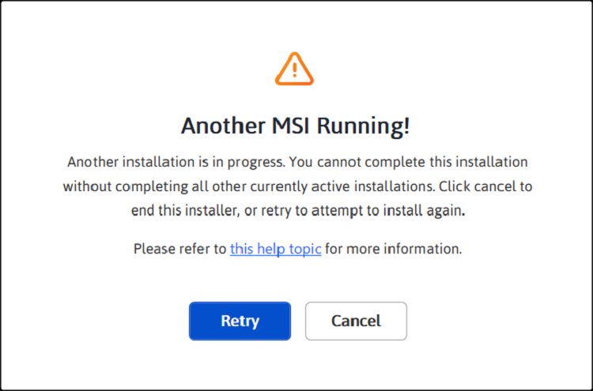
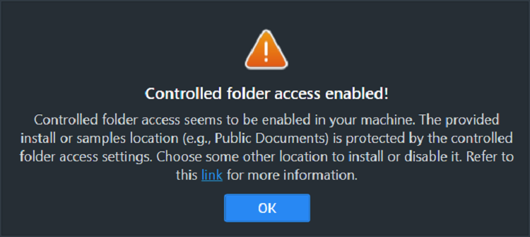

# Common installation errors for React components

This article describes the most common installation errors, their causes, and suggested solutions.

* [Unlocking the license installer using the trial key](#unlocking-the-license-installer-using-the-trial-key)
* [License expiration](#license-expiration)
* [Unable to find a valid license or trial](#unable-to-find-a-valid-license-or-trial)
* [Unable to install because of another installation](#unable-to-install-because-of-another-installation)
* [Unable to install due to controlled folder access](#unable-to-install-due-to-controlled-folder-access)

## Unlocking the license installer using the trial key

**Error Message:** Sorry, the provided unlock key is a trial unlock key and cannot be used to unlock the licensed version of our Essential Studio&reg; for JavaScript installer.

**Reason:**
You are trying to use a trial unlock key to unlock the licensed installer.

**Suggested Solution:**
Only a licensed unlock key can unlock the licensed installer. To generate a licensed unlock key, refer to [this article](https://www.syncfusion.com/kb/2326/how-to-generate-syncfusion-setup-unlock-key-from-syncfusion-support-account).

## License Expiration

**Error Message:** Your license for Syncfusion&reg; Essential Studio&reg; for JavaScript - EJ2 expired on {date}. Please renew your subscription and try again.

***Online Installer:***

**Reason:**
This error appears when the license associated with the account has expired.

**Suggested Solution:**
Choose one of the following options:

1. Renew the subscription [here](https://www.syncfusion.com/account/my-renewals).
2. Purchase a new license [here](https://www.syncfusion.com/sales/products).
3. Contact the sales team: sales@syncfusion.com.
4. Contact support or sales to request options for extending the 30-day trial period.

## Unable to find a valid license or trial

**Error Message:** Sorry, we are unable to find a valid license or trial for Essential Studio&reg; for JavaScript - EJ2 under your account.

***Offline installer:***

***Online installer:***

**Reason:**
Possible causes of this error include:

* The trial period has expired.
* There is no license or active trial associated with the account.
* The current user is not the license holder.
* The account administrator has not assigned a license to the user.

**Suggested Solution:**

1. Purchase a new license [here](https://www.syncfusion.com/sales/products).
2. Contact the account administrator to verify license assignment.
3. Email clientrelations@syncfusion.com to request license assignment.
4. Contact the sales team: sales@syncfusion.com.

## Unable to install because of another installation

**Error Message:** Another installation is in progress. You cannot start this installation without completing all other currently active installations. Click cancel to end this installer or retry to attempt after currently active installation completed to install again.

**Reason:**
You are trying to install while another installation is already running on your machine.

**Suggested Solution:**
If possible, save work and restart the computer before attempting to terminate installer processes. If an immediate termination is required, end the `msiexec.exe` process and retry the Syncfusion&reg; installer.

1. Open the Windows Task Manager.
2. Go to the **Details** tab.
3. Select **msiexec.exe** and click **End task**.

## Unable to install due to controlled folder access

***Offline Installer:***

**Error Message:** Controlled folder access appears to be enabled on your machine. The chosen install or samples location (for example, Public Documents) is protected by controlled folder access settings.

***Online Installer:***

**Error Message:** Controlled folder access seems to be enabled in your machine. The provided install, samples, or download location (e.g., Public Documents) is protected by the controlled folder access settings.

**Reason:**
Controlled folder access is enabled on the computer and is preventing the installer from writing to protected locations.

**Suggested Solution:**

### Option 1: Temporarily Disable Controlled Folder Access

1. By default, demos are installed in the Public Documents folder.
2. When controlled folder access is enabled, demos cannot be installed in the Documents folder.
3. To allow installation in the Documents folder, follow the steps in [this Microsoft article](https://support.microsoft.com/en-us/windows/allow-an-app-to-access-controlled-folders-b5b6627a-b008-2ca2-7931-7e51e912b034) to temporarily disable controlled folder access or allow the installer.
4. Re-enable controlled folder access after the Syncfusion&reg; setup completes, if desired.

### Option 2: Change Installation Directory

If you do not want to disable controlled folder access, install the demos in another directory that is not protected by controlled folder access.

## Need Additional Help?

If you encounter installation errors not covered in this article, contact Syncfusion&reg; support:

* Email support@syncfusion.com
* Refer to the [Syncfusion Knowledge Base](https://www.syncfusion.com/kb) for additional troubleshooting articles