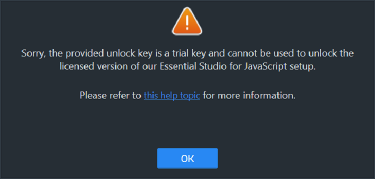
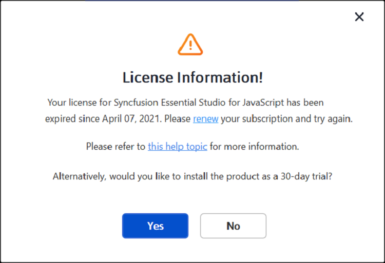
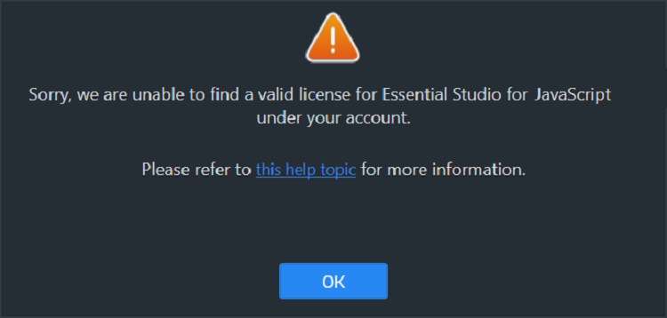
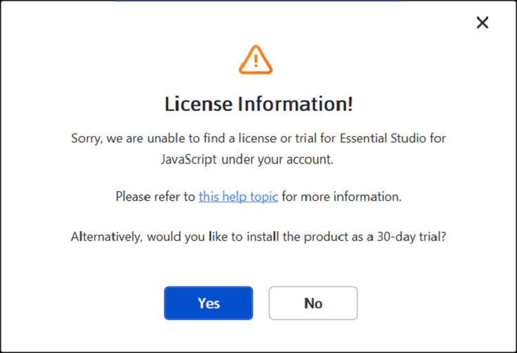
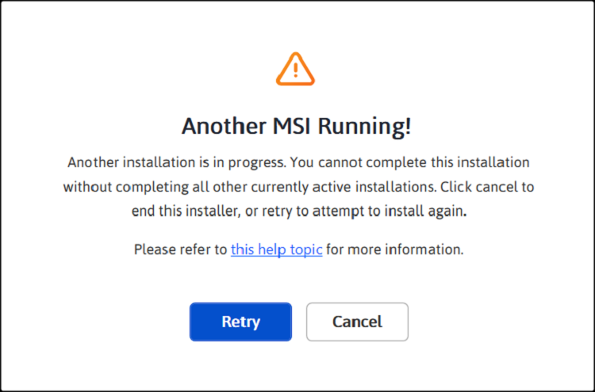
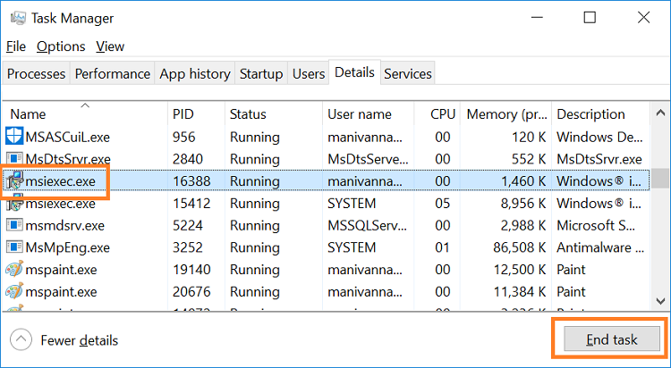
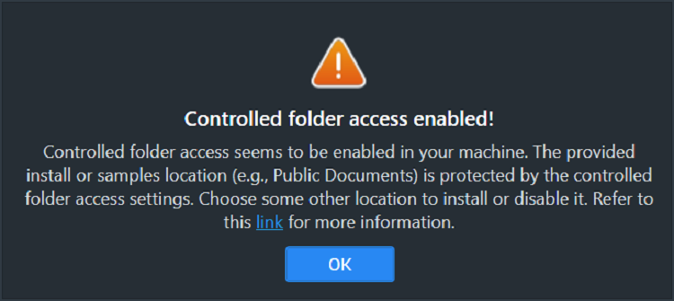
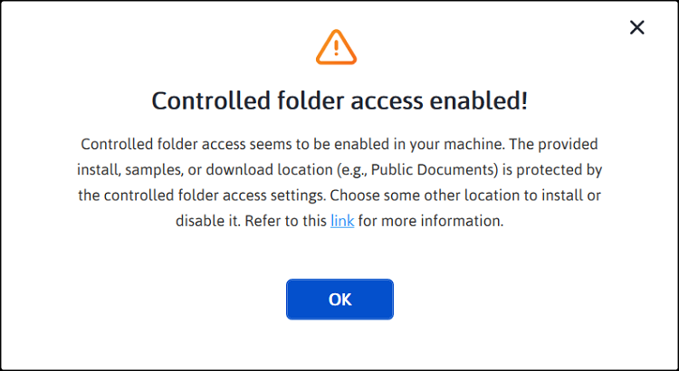

# Common installation errors for React (JavaScript - EJ2) components

This article describes the most common installation errors, their causes, and suggested solutions.

* [Unlocking the license installer using the trial key](#unlocking-the-license-installer-using-the-trial-key)
* [License expiration](#license-expiration)
* [Unable to find a valid license or trial](#unable-to-find-a-valid-license-or-trial)
* [Unable to install because of another installation](#unable-to-install-because-of-another-installation)
* [Unable to install due to controlled folder access](#unable-to-install-due-to-controlled-folder-access)

## Unlocking the license installer using the trial key

**Error Message:** Sorry, the provided unlock key is a trial unlock key and cannot be used to unlock the licensed version of our Essential Studio<sup style="font-size:70%">&reg;</sup> for JavaScript installer.



**Reason:**
You are trying to use a trial unlock key to unlock the licensed installer. Trial unlock keys can only unlock the trial installer.

**Suggested Solution:**
Only a licensed unlock key can unlock the licensed installer. To generate a licensed unlock key, refer to the [How to generate an unlock key for Essential Studio products](https://www.syncfusion.com/kb/8069/how-to-generate-unlock-key-for-essentials-studio-products) article.

## License Expiration

**Error Message:** Your license for Syncfusion<sup style="font-size:70%">&reg;</sup> Essential Studio<sup style="font-size:70%">&reg;</sup> for JavaScript - EJ2 expired on {date}. Please renew your subscription and try again.

> The `{date}` placeholder is replaced with the actual expiration date in the error message you see in the installer.

**Offline installer:**



**Web installer:**


**Reason:**
This error appears when the license associated with the account has expired.

**Suggested Solution:**
Choose one of the following options:

1. [Renew your subscription](https://www.syncfusion.com/account/my-renewals).
2. [Purchase a new license](https://www.syncfusion.com/sales/products).
3. Contact the sales team at [sales@syncfusion.com](mailto:sales@syncfusion.com).
4. Contact support or sales to request options for extending the 30-day trial period.

## Unable to find a valid license or trial

**Error Message:** Sorry, we are unable to find a valid license or trial for Essential Studio<sup style="font-size:70%">&reg;</sup> for JavaScript - EJ2 under your account.

**Offline installer:**



**Web installer:**



**Reason:**
Possible causes of this error include:

* The trial period has expired.
* There is no license or active trial associated with the account.
* The current user is not the license holder.
* The account administrator has not assigned a license to the user.
* You are signed in with a different Syncfusion account than the one holding the license or trial.

**Suggested Solution:**

1. [Purchase a new license](https://www.syncfusion.com/sales/products).
2. Contact the account administrator to verify license assignment.
3. Email [clientrelations@syncfusion.com](mailto:clientrelations@syncfusion.com) to request license assignment.
4. Sign out and sign in with the Syncfusion account that holds the active license or trial.
5. Contact the sales team at [sales@syncfusion.com](mailto:sales@syncfusion.com).

## Unable to install because of another installation

**Error Message:** Another installation is in progress. You cannot start this installation without completing all other currently active installations. Click cancel to end this installer or retry to attempt after currently active installation completed to install again.



**Reason:**
You are trying to install while another Microsoft Installer (`msiexec.exe`) transaction is already running on your machine. The Syncfusion<sup style="font-size:70%">&reg;</sup> installer requires exclusive access to the Windows Installer service.

**Suggested Solution:**
If possible, save work and restart the computer before attempting to terminate installer processes. If an immediate termination is required, end the `msiexec.exe` process and retry the Syncfusion<sup style="font-size:70%">&reg;</sup> installer.

1. Open the Windows Task Manager.
2. Go to the **Details** tab.
3. Select all `msiexec.exe` entries and click **End task**. (Multiple `msiexec.exe` processes may exist; end each one.)
4. Retry the Syncfusion<sup style="font-size:70%">&reg;</sup> installer.



## Unable to install due to controlled folder access

**Offline installer:**

**Error Message:** Controlled folder access appears to be enabled on your machine. The chosen install or samples location (for example, Public Documents) is protected by controlled folder access settings.



**Web installer:**

**Error Message:** Controlled folder access seems to be enabled in your machine. The provided install, samples, or download location (e.g., Public Documents) is protected by the controlled folder access settings.



**Reason:**
Controlled folder access is enabled on the computer and is preventing the installer from writing to protected locations such as `C:\Users\Public\Documents`.

**Suggested Solution:**

### Option 1: Temporarily disable controlled folder access

1. By default, demos are installed in the `C:\Users\Public\Documents` folder.
2. When controlled folder access is enabled, demos cannot be installed in the Documents folder.
3. To allow installation in the Documents folder, follow the steps in the Microsoft article [Allow an app to access controlled folders](https://support.microsoft.com/en-us/windows/allow-an-app-to-access-controlled-folders-b5b6627a-b008-2ca2-7931-7e51e912b034) to temporarily disable controlled folder access or allow the installer.
4. Re-enable controlled folder access after the Syncfusion<sup style="font-size:70%">&reg;</sup> setup completes, if desired.

### Option 2: Change the installation directory

If you do not want to disable controlled folder access, install the demos in another directory that is not protected by controlled folder access.

1. On the installer **Configuration** step, click **Browse** next to **Install Location** and select a folder that is not protected (for example, `C:\Syncfusion`).
2. Click **Browse** next to **Samples Location** and select an unprotected folder as well.
3. Click **Next** to continue with the installation.

## Insufficient disk space

**Error Message:** There is not enough space on the disk to extract the package. Free up some space and try again.

**Reason:**
The drive selected for installation does not have enough free space to hold the extracted installer, the installed content, and the demos.

**Suggested Solution:**

1. Free up space on the target drive (or use a drive with at least 4 GB of free space).
2. On the installer **Configuration** step, change the **Install Location**, **Demos Location**, and **Download Location** (web installer) to a drive with sufficient space.
3. Retry the installation.

## NPM peer-dependency or invalid-package errors

**Error Message:** `npm install` fails with `EINVALIDPKG`, `peer dependencies...`, or `EINVALIDTAG` errors when consuming Syncfusion<sup style="font-size:70%">&reg;</sup> NPM packages.

**Reason:**
Common causes include an outdated Node.js / npm version, an unsupported React version, or an invalid tag such as `@latest` versus `@dev`.

**Suggested Solution:**

1. Verify that Node.js 18.x or later is installed (`node --version`).
2. Clear the npm cache and reinstall:

    ```bash
    npm cache clean --force
    rm -rf node_modules package-lock.json
    npm install
    ```

3. Make sure the package name and version match the values listed in the [Syncfusion NPM registration](https://ej2.syncfusion.com/react/documentation/licensing/license-key-registration) guide.
4. If the error persists, see the [Finding installation logs](#finding-installation-logs) section below to capture npm logs for support.

## Finding installation logs

If the installer fails before the progress page is shown, the log file can help Syncfusion<sup style="font-size:70%">&reg;</sup> support diagnose the issue.

1. Press **Win + R**, type `%temp%`, and press **Enter** to open the Temp folder.
2. Sort by **Date modified** to find the most recent log file. Installer logs are typically named `SyncfusionInstaller*.log` or `MSI*.log`.
3. Attach the most recent log file to your support request.

For NPM-related issues, also include the output of `npm install --verbose` to capture the npm debug log.

## Need additional help

If you encounter installation errors not covered in this article, contact Syncfusion<sup style="font-size:70%">&reg;</sup> support:

* Email [support@syncfusion.com](mailto:support@syncfusion.com).
* Refer to the [Syncfusion Knowledge Base](https://www.syncfusion.com/kb) for additional troubleshooting articles.
* Submit a ticket through the [Syncfusion support portal](https://www.syncfusion.com/support).