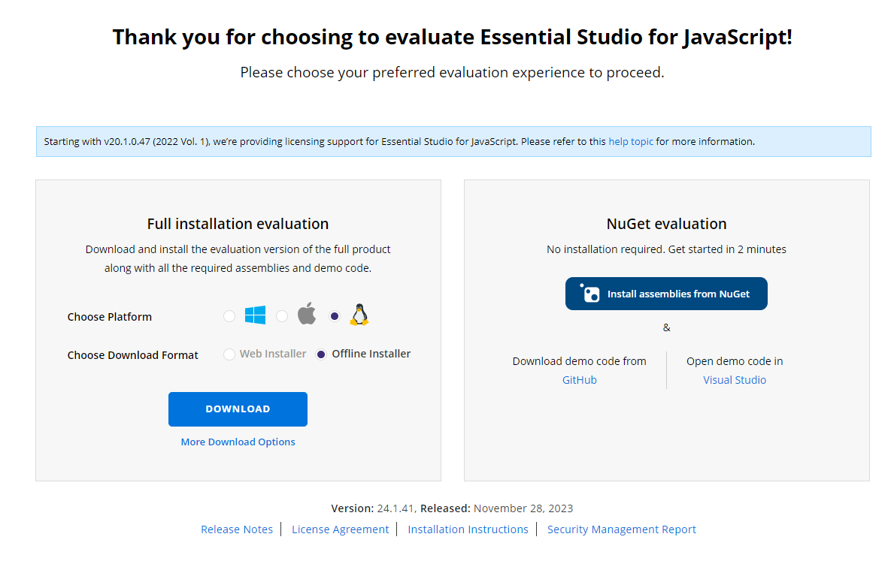
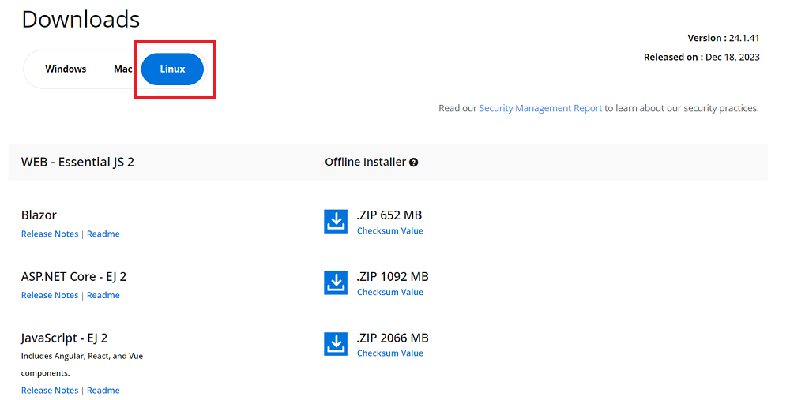

# Download Syncfusion&reg; React Linux Installer

Download the Syncfusion&reg; JavaScript/React Linux installer from the [Syncfusion](https://www.syncfusion.com/) website. Depending on the license type, download either the trial installer or the licensed installer.

- **Trial Installer**: For evaluating the product for 30 days.
- **Licensed Installer**: For customers with a valid Syncfusion license.

## Prerequisites

Before downloading, ensure the following:

* A registered Syncfusion account (required for both trial and licensed downloads).
* For licensed downloads, a valid Syncfusion license associated with your account.
* The installer is a `.zip` archive; on Linux, ensure you have a tool such as `unzip` available to extract it.

## Download the Free Trial Version

The 30-day trial can be obtained in two ways:

1. Downloading the Free Trial setup.
2. Starting a trial from the account pages if components were installed via [NPM](https://www.npmjs.com/search?q=syncfusion%20ej2).

### Download Free Trial Setup

1. Visit the [Download Free Trial](https://www.syncfusion.com/downloads) page and select the Syncfusion product to evaluate.
2. Complete the download form or sign in with a registered Syncfusion&reg; account, then download the trial installer from the confirmation page.

   

3. Trial downloads provide the latest installer version only.
4. An unlock key is not required to run the Syncfusion&reg; JavaScript/React Linux trial installer.
5. While an active trial exists, the installer can also be downloaded from the [Trials & Downloads](https://www.syncfusion.com/account/manage-trials/downloads) page in the account.

   

6. Click the **More Download Options** button (labeled 2 in the screenshot above) to access the JavaScript/React offline trial installer (ZIP format).

   

### Start Trial for NPM Users

If components were installed via [NPM](https://www.npmjs.com/search?q=syncfusion%20ej2), start an evaluation to obtain the license key required for using trial packages in applications.

1. Start the 30-day free trial from the [Start Trial](https://www.syncfusion.com/account/manage-trials/start-trials) page in the account.

   > A license key for active trial products can be generated on the [Trials & Downloads](https://www.syncfusion.com/account/manage-trials/downloads) page. This license key is required when using trial packages in applications. Refer to the [Licensing overview](https://help.syncfusion.com/common/essential-studio/licensing/overview) for details.

   

2. Sign in with the registered Syncfusion&reg; account and select the product to begin the trial.

   > If an active trial for the same product already exists and has not expired, it cannot be restarted.

3. After starting the trial, download the latest installer from the [Trials & Downloads](https://www.syncfusion.com/account/manage-trials/downloads) page. Older installers may require an unlock key; generate the [unlock key](https://www.syncfusion.com/kb/8069/how-to-generate-unlock-key-for-essentials-studio-products) (if applicable) or the license key from the same page.

   

4. Active trial products are listed on the [Trials & Downloads](https://www.syncfusion.com/account/manage-trials/downloads) page.

## Download the Licensed Version

1. Licensed products are available on the [License & Downloads](https://www.syncfusion.com/account/downloads) page in the registered Syncfusion&reg; account.
2. The page lists all licenses (active and expired) associated with the account.
3. To download the JavaScript/React Linux licensed installer, select the product and click **More Download Options** (labeled 3 in the screenshot below).

   

4. An unlock key is not required to install the JavaScript/React Linux licensed installer. For package activation in NPM scenarios, a license key may still be required; obtain it from the account pages if needed.
5. For Linux, the installer is provided as a downloadable archive file (ZIP offline installer).

   

Refer to the [**Installation using Linux Installer**](https://ej2.syncfusion.com/react/documentation/installation/linux-installer/installation-using-linux-installer) guide for step-by-step installation instructions.