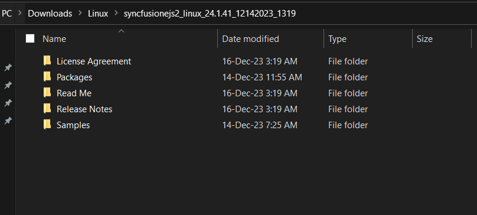

# Installing Syncfusion&reg; React (JavaScript - EJ2) Linux Installer

## Step-by-Step Installation

Follow the steps below to install the JavaScript Linux installer:

1. Extract the downloaded Syncfusion&reg; JavaScript Linux installer (`.zip`) file to your desired directory.

   

2. Once extracted, the directory will typically contain the following folders:

   * **Samples**: Contains the local demos and source code for the components.
   * **Packages** (or similar): May contain local package feeds, if applicable.

      
   
   > An unlock key is not required to install or extract the Linux installer.

3. Launch the demo sources or use the included packages locally in a development environment.

## License Key Registration in Samples

A license key is required to register and run the demo sources included with the Linux installer. For instructions on registering the license key, refer to the following topics:

* [Register Syncfusion&reg; License key in the project](https://ej2.syncfusion.com/react/documentation/licensing/license-key-registration#register-syncfusion-license-key-in-the-project)
* [Register the license key using the npx command](https://ej2.syncfusion.com/react/documentation/licensing/license-key-registration#register-syncfusion-license-key-using-the-npx-command)