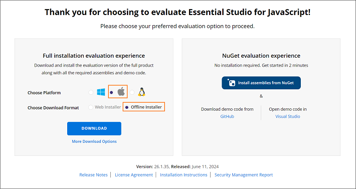

# Download Syncfusion&reg; React Mac Installer

The Syncfusion&reg; React (JavaScript - EJ2) Mac installer can be downloaded from the Syncfusion&reg; website. Depending on your license type, you can download either the licensed installer or the trial installer.

Download the Syncfusion&reg; JavaScript - EJ2 Mac installer from the Syncfusion&reg; website. Depending on the license, download either the trial or the licensed installer.

- **Trial Installer**: For evaluating the product.
- **Licensed Installer**: For customers with a valid license.

## Download the Trial Version

The 30-day trial can be obtained in two ways:

1. Downloading the Free Trial Setup.
2. Starting a trial if using components via [npm](https://www.npmjs.com/~syncfusionorg).

### Download Free Trial Setup

1. Evaluate the 30-day free trial by visiting the [Download Free Trial](https://www.syncfusion.com/downloads) page and selecting the JavaScript platform.

2. After completing the form or logging in with your registered Syncfusion&reg; account, download the JavaScript - EJ2 trial installer from the confirmation page.

   

3. Trial licenses provide access only to the latest trial installer version.
4. Unlock the trial installer either with a trial unlock key or with registered Syncfusion&reg; account credentials. For details on generating an unlock key, see [this article](https://www.syncfusion.com/kb/8069/how-to-generate-unlock-key-for-essentials-studio-products).
5. Before the trial expires, download the trial installer at any time from the [Trials & Downloads](https://www.syncfusion.com/account/manage-trials/downloads) page in the registered account.

   

6. Click the **More Download Options** button (labeled 2 in the screenshot above) to access the Essential Studio&reg; JavaScript - EJ2 offline trial installer in DMG format.

   

### Start Trial for npm Users

If components were installed via [npm](https://www.npmjs.com/~syncfusionorg), start an evaluation to obtain a license key.

1. Start the 30-day trial for JavaScript - EJ2 from the [Start Trial](https://www.syncfusion.com/account/manage-trials/start-trials) page in the account.

   

2. Log in with the registered Syncfusion&reg; account to access the page.
3. Begin the trial by selecting the **JavaScript - EJ2 product**.

   > If an active trial for the product exists and has not expired, the trial cannot be restarted.

4. After starting the trial, visit the [Trials & Downloads](https://www.syncfusion.com/account/manage-trials/downloads) page to download the latest trial installer. Generate the [unlock key](https://www.syncfusion.com/kb/8069/how-to-generate-unlock-key-for-essentials-studio-products) and the [license key](https://ej2.syncfusion.com/react/documentation/licensing/overview/) from this page before the trial expires.

   

5. Active trial products are listed on the [Trials & Downloads](https://www.syncfusion.com/account/manage-trials/downloads) page.

## Download the Licensed Version

1. Licensed installers are available on the [License & Downloads](https://www.syncfusion.com/account/downloads) page of the registered Syncfusion&reg; account.
2. This page lists all licenses (active and expired) associated with the account.
3. To download the JavaScript - EJ2 Mac licensed installer, click **More Download Options** (labeled 3 in the screenshot below).

   

4. An unlock key is not required to install the Syncfusion&reg; JavaScript - EJ2 Mac licensed installer.
5. For macOS, the installer is available in DMG format.

   

Refer to the [**JavaScript - EJ2 Mac installer**](https://ej2.syncfusion.com/react/documentation/installation/mac-installer/installation-using-mac-installer) guide for step-by-step installation instructions.