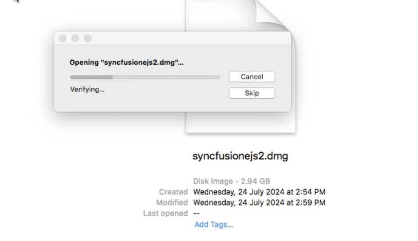
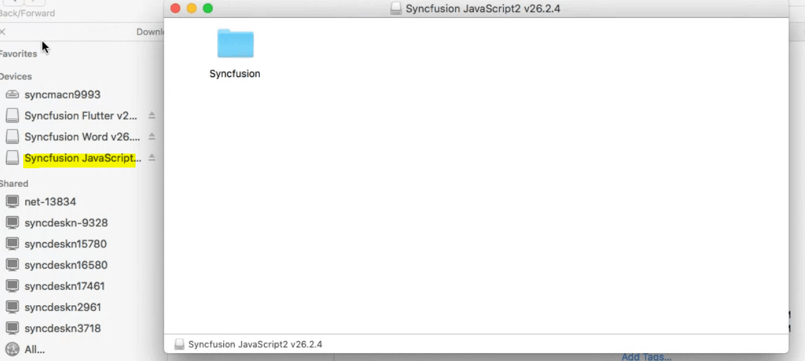
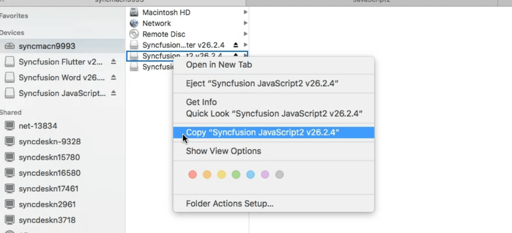
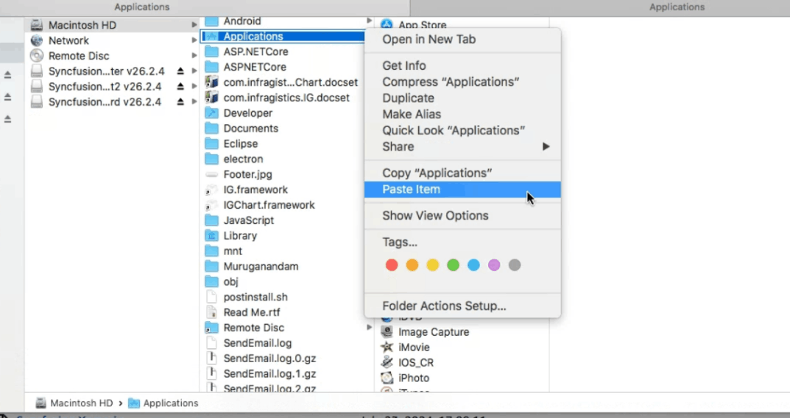
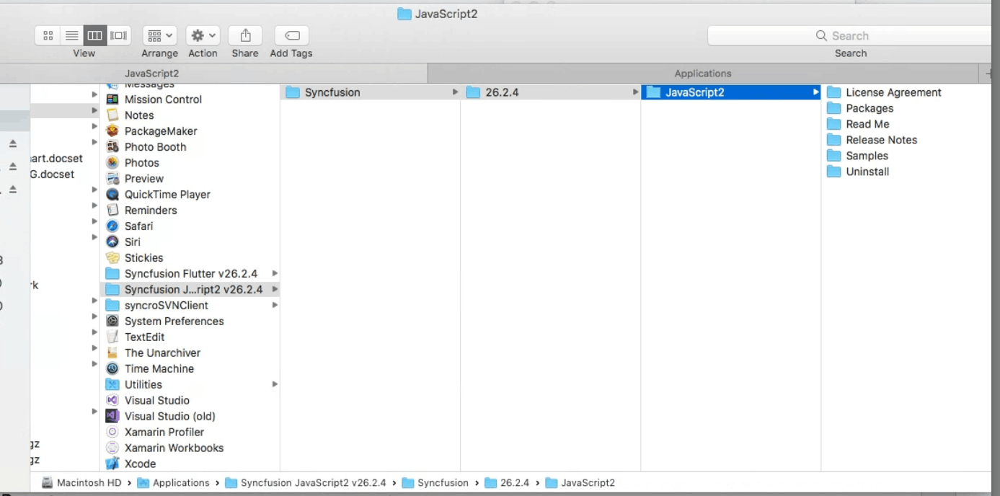
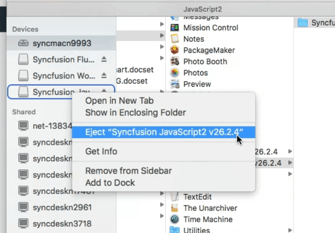

# Installing Syncfusion&reg; JavaScript - EJ2 Mac Installer

## Resolving Security Warnings on macOS Catalina or Later

When running the Essential Studio&reg; JavaScript - EJ2 Mac Installer on macOS Catalina or later, you may encounter the following security alert:

If this alert appears, follow these steps:

1. Right-click the downloaded DMG file.
2. Select **Open With** and choose **DiskImageMounter (Default)**. The following dialog appears:

   

3. Click **Open** to proceed with mounting the installer.

4. If macOS still prevents the installer from opening, open **System Preferences > Security & Privacy > General**, locate the blocked app message, and click **Open Anyway**. Then repeat step 3.

## Step-by-Step Installation

Follow the steps below to install the Essential Studio&reg; JavaScript - EJ2 Mac installer:

1. Locate the downloaded DMG file and double-click it to mount the disk image.

   

2. The disk image will automatically mount, creating a virtual drive on your desktop or in the Finder sidebar, displaying the installer contents.

   

3. Drag the Syncfusion application icon to the **Applications** folder shortcut within the installer window.

   

4. The application will be copied to your Applications folder, completing the installation.

   

   > No unlock key is required to install the Mac installer. However, a **license key is required** to use the Syncfusion&reg; Essential Studio JavaScript - EJ2 components in your applications (see [License Key Registration](#license-key-registration-in-samples) below).

5. Navigate to the Applications folder to access the installed Syncfusion&reg; Essential Studio&reg; content, including demos and documentation.

   

6. After installation is complete, you can eject the DMG file by right-clicking the virtual drive on your desktop or in the Finder sidebar and selecting **Eject**. You may also delete the downloaded DMG file if desired.

   

   > The installed application remains in your Applications folder and is not affected by ejecting or deleting the DMG file.

## License Key Registration in Samples

After installation, a license key is required to run the demo source included in the Mac installer. For instructions on registering the license key for JavaScript - EJ2, refer to the following topics:

* [Register Syncfusion&reg; License key in the project](https://ej2.syncfusion.com/react/documentation/licensing/license-key-registration#register-syncfusion-license-key-in-the-project)
* [Register the license key using the npx command](https://ej2.syncfusion.com/react/documentation/licensing/license-key-registration#register-syncfusion-license-key-using-the-npx-command)

## System Requirements

The Syncfusion&reg; JavaScript - EJ2 Mac installer is compatible with:

* macOS 10.13 (High Sierra) or later
* Node.js 14.x or later (LTS recommended) (for running demos and using npm packages)

For the latest system requirements, refer to the [Syncfusion system requirements documentation](https://ej2.syncfusion.com/react/documentation/system-requirements).