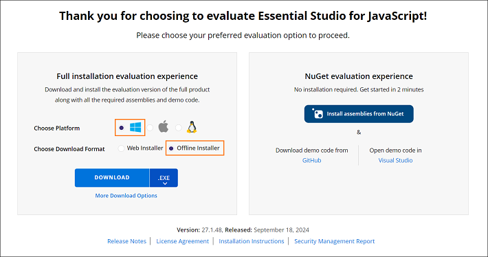
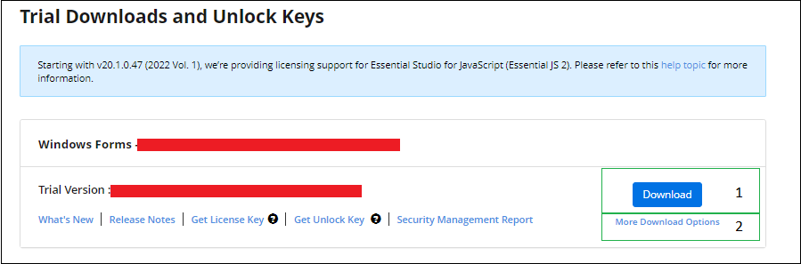

# Download React (JavaScript - EJ2) Installer

The Syncfusion&reg; React (JavaScript - EJ2) installer is available from the Syncfusion&reg; website. Depending on the license type, download either the licensed installer or the trial installer.

- **Trial installer**: For evaluating the product.
- **Licensed installer**: For customers with a valid license.

## Download the Trial Version

The 30-day trial is available in two ways:

1. Download the free trial setup.
2. Start a trial if components were installed via [npm](https://www.npmjs.com/~syncfusionorg).

### Download free trial setup

1. Visit the [Download Free Trial](https://www.syncfusion.com/downloads) page and select the JavaScript platform.

2. After completing the form or signing in with a registered Syncfusion&reg; account, download the JavaScript - EJ2 trial installer from the confirmation page.

    

3. Trial licenses provide access to the latest trial installer only.

4. The Syncfusion&reg; JavaScript - EJ2 trial installer can be unlocked with a trial unlock key or a registered Syncfusion&reg; account. For details on generating an unlock key, see [this article](https://www.syncfusion.com/kb/8069/how-to-generate-unlock-key-for-essentials-studio-products).

5. Before the trial expires, download the trial installer at any time from the Trials & Downloads page in your account.

    

6. Click the **Download** button (labeled 1 in the screenshot) to obtain the Syncfusion&reg; Essential Studio&reg; JavaScript - EJ2 web installer.

    

7. Click **More Download Options** (labeled 2) to access the JavaScript - EJ2 Offline trial installer, available in these formats:
   * **Windows**: EXE and ZIP
   * **macOS**: DMG
   * **Linux**: ZIP

    

### Start trial for npm users

If components were installed via [npm](https://www.npmjs.com/~syncfusionorg), start an evaluation to obtain a license key.

1. Start the 30-day trial for JavaScript - EJ2 from the [Start Trial](https://www.syncfusion.com/account/manage-trials/start-trials) page in the account.

    

2. Sign in with the registered Syncfusion&reg; account.

3. Select the **JavaScript - EJ2** product to begin the trial.

    > If an active trial already exists and has not expired, the same product trial cannot be restarted.

4. After starting the trial, go to the [Trials & Downloads](https://www.syncfusion.com/account/manage-trials/downloads) page to download the latest trial installer or to generate an unlock key.

    

5. Active trial products appear on the [Trials & Downloads](https://www.syncfusion.com/account/manage-trials/downloads) page.

## Download the licensed version

1. Licensed products are available on the [License & Downloads](https://www.syncfusion.com/account/downloads) page in the registered Syncfusion&reg; account.

2. This page lists all licenses (active and expired) associated with the account.

3. Click the **Download** button (labeled 1 in the screenshot) to download the installer for the chosen product.

4. The most recent installer version is provided by default.

5. To access older installers, select **Downloads Older Versions** (labeled 2).

6. For additional platforms or add-on installers, choose **More Downloads Options** (labeled 3).

7. Offline installers are available in these formats:
    * **Windows**: EXE and ZIP
    * **macOS**: DMG
    * **Linux**: ZIP

     

## Next steps

After downloading the installer, refer to the [Offline Installer Installation Guide](https://ej2.syncfusion.com/react/documentation/installation-and-upgrade/installation-using-offline-installer/) for step-by-step installation instructions.
