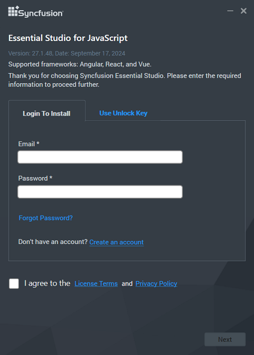

# Installation using Offline Installer

The Syncfusion<sup style="font-size:70%">&reg;</sup> JavaScript - EJ2 offline installer supports the following frameworks:

* JavaScript (ES5)
* JavaScript (ES6+)
* Angular
* React
* Vue

> The offline installer includes shared resources and samples for all supported frameworks. Once installed, you can access React-specific content and demos.

## System Requirements

Before installation, ensure the system meets these requirements:

- **Operating System**: Windows 7 SP1 or later, macOS 10.13 or later, Linux (Ubuntu 16.04 or later)
- **Disk space**: At least 2 GB of free disk space
- **Node.js**: Version 14.x or later (required to run demos)

## Installing with UI (Windows)

These steps describe installing the Essential Studio<sup style="font-size:70%">&reg;</sup> JavaScript - EJ2 offline installer using the graphical interface on Windows.

### Step 1: Launch the Installer

1. Double-click the downloaded Syncfusion<sup style="font-size:70%">&reg;</sup> JavaScript - EJ2 offline installer (.exe) to open the Installer Wizard; the package is extracted automatically.

    

    > The installer displays an extraction progress dialog while unpacking the installation files.

### Step 2: Unlock the Installer

2. To unlock the installer, choose one of the following options:

    **Option 1: Login to install**

    Enter the Syncfusion<sup style="font-size:70%">&reg;</sup> account email and password. If an account is not available, select **Create an account**. Use **Forgot Password** to reset credentials if necessary, then click **Next**.

    

    **Option 2: Use unlock key**

    Unlock keys are platform- and version-specific. Provide a licensed or trial unlock key to proceed; trial keys are valid for 30 days.

    For instructions on generating an unlock key, see the Knowledge Base article: [Syncfusion Knowledge Base - How to generate unlock key](https://www.syncfusion.com/kb/2326).

    

### Step 3: Accept License Agreement

3. After reading the License Terms and Privacy Policy, check the **"I agree to the License Terms and Privacy Policy"** checkbox and click **Next**.

### Step 4: Configure Installation Settings

4. Specify the installation and sample locations, or accept the defaults. Click **Next** or **Install** to continue.

    

    **Additional settings:**

    * **Install Demos**: Installs sample projects and demos when checked; uncheck to skip demo installation.
    * **Create Desktop Shortcut**: Adds a Syncfusion<sup style="font-size:70%">&reg;</sup> Control Panel shortcut to the desktop.
    * **Create Start Menu Shortcut**: Adds a Syncfusion<sup style="font-size:70%">&reg;</sup> Control Panel shortcut to the Start Menu.

    > The "Configure Syncfusion Extensions in Visual Studio" option applies only to ASP.NET development and does not affect React projects.

### Step 5: Uninstall Previous Versions (Optional)

5. If previous versions are detected, the **Uninstall Previous Version(s)** wizard appears; select versions to remove and click **Proceed**.

    

    > Starting with the 2021 Volume 1 release, Syncfusion<sup style="font-size:70%">&reg;</sup> offers the option to uninstall versions 18.1 and later during installation.

    **Confirmation dialog:**

    

    **Uninstall progress:**

    

### Step 6: Monitor Installation Progress

6. The installer displays progress for uninstallation (if selected) and for installation.

    **Installation progress:**

    

### Step 7: Complete Installation

7. After installation completes, the completion screen displays the status.

    

8. Click **Launch Control Panel** to open the Syncfusion<sup style="font-size:70%">&reg;</sup> Control Panel, or click **Finish** to exit.

## Installing in Silent Mode (Windows)

The Syncfusion<sup style="font-size:70%">&reg;</sup> Essential Studio<sup style="font-size:70%">&reg;</sup> JavaScript - EJ2 installer supports silent installation and uninstallation via the command line on Windows.

### Silent mode installation

1. Run the installer by double-clicking it; the installer extracts files to the Temp directory.
2. Open the Temp folder by typing `%temp%` in File Explorer or the Run dialog.
3. Locate the extracted `syncfusionejs2_x.x.x.x.exe` file and copy it to a local drive (for example, `D:\Temp`).
4. Exit the Installer Wizard.
5. Open an elevated Command Prompt (Run as administrator) and run the command using this syntax:

    **Syntax:**
    ```
    "installer_path\\syncfusionejs2_x.x.x.x.exe" /Install silent /UNLOCKKEY:"your_unlock_key" [/log "log_file_path"] [/InstallPath:"install_location"] [/InstallSamples:true|false]
    ```

    **Example:**
    ```
    "D:\Temp\\syncfusionejs2_20.1.0.47.exe" /Install silent /UNLOCKKEY:"ABC123XYZ456" /log "C:\Temp\\install.log" /InstallPath:"C:\Syncfusion\\20.1.0.47" /InstallSamples:true
    ```

    **Parameters:**
    * `/Install silent`: Runs the installer in silent mode.
    * `/UNLOCKKEY`: Specifies the unlock key for the version being installed.
    * `/log`: (Optional) Specifies the log file path.
    * `/InstallPath`: (Optional) Specifies the installation directory.
    * `/InstallSamples`: (Optional) Install samples using `/InstallSamples:true` or `/InstallSamples:false`.

6. The installation completes silently. Check the log file (if specified) for details.

### Silent mode uninstallation

1. Follow steps 1–4 from the silent installation procedure to locate the installer executable.
2. Open Command Prompt in administrator mode and run the uninstallation command:

    **Syntax:**
    ```
    "installer_path\\syncfusionejs2_x.x.x.x.exe" /Uninstall silent
    ```

    **Example:**
    ```
    "D:\Temp\\syncfusionejs2_20.1.0.47.exe" /Uninstall silent
    ```

3. The uninstallation completes silently.

## Post-Installation

After installation:

- **Access demos**: Navigate to the installation directory (default: `C:\Program Files (x86)\Syncfusion\Essential Studio\JavaScript - EJ2\\x.x.x.x`) to find sample projects.
- **Launch Control Panel**: Use the desktop or Start Menu shortcut to open the Syncfusion<sup style="font-size:70%">&reg;</sup> Control Panel for utilities and documentation.
- **Register license key**: For licensed installations, register the license key in React projects. See the License Key Registration Guide: Syncfusion - License Key Registration (https://ej2.syncfusion.com/react/documentation/licensing/license-key-registration).
