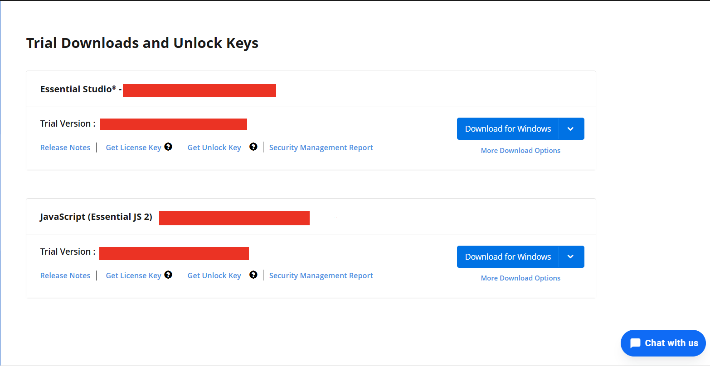
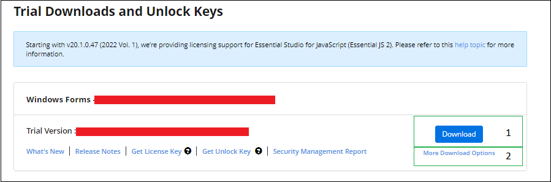
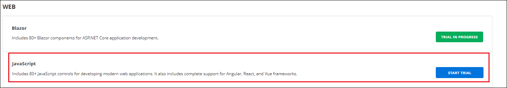

# Download Syncfusion&reg; (JavaScript - EJ2) Web Installer

The Syncfusion&reg; React (JavaScript - EJ2) web installer can be downloaded from the [Syncfusion](https://www.syncfusion.com/react-ui-components) website. The web installer is a small executable that downloads only the components you select during installation, which makes it faster to obtain than the full offline installer.

* **Trial installer**: For evaluating the product for 30 days.
* **Licensed installer**: For customers with a valid license.

## Prerequisites

Before downloading, ensure the following:

* A registered Syncfusion account (required for both trial and licensed downloads).
* For licensed downloads, a valid Syncfusion license associated with your account.
* A stable internet connection during installation — the web installer downloads the selected components at install time.
* Windows 7 SP1 or later, with administrator privileges required to run the installer.

## Download the free trial version

Obtain the 30-day trial in either of the following ways:

1. Download the free trial setup.
2. Start a trial if components were installed via [NPM](https://www.npmjs.com/~syncfusionorg).

### Download free trial setup

1. Visit the [Download Free Trial](https://www.syncfusion.com/downloads) page and select the **JavaScript - EJ2** product to start the evaluation.

2. After completing the form or signing in with a registered Syncfusion&reg; account, download the JavaScript - EJ2 trial installer from the confirmation page.

    

3. Trial installers are available only for the latest product version.

4. The Syncfusion&reg; JavaScript - EJ2 trial installer can be unlocked using a trial unlock key or the registered Syncfusion&reg; account credentials.

5. Before the trial expires, download the installer at any time from the [Trials & Downloads](https://www.syncfusion.com/account/manage-trials/downloads) page in the registered account.

    

6. Click the **Download** button (labeled 1 in the screenshot below) to obtain the Syncfusion&reg; Essential Studio&reg; JavaScript - EJ2 web installer.

    

### Start trial for NPM users

If components were installed via [NPM](https://www.npmjs.com/~syncfusionorg), start an evaluation to obtain a license key:

1. Start the 30-day free trial for JavaScript - EJ2 from the [Start Trial](https://www.syncfusion.com/account/manage-trials/start-trials) page in the Syncfusion account.

    

2. Sign in with the registered Syncfusion&reg; account.

3. Select the **JavaScript - EJ2** product to begin the trial.

    > If an active trial exists and has not expired, the trial cannot be restarted for the same product.

4. After starting the trial, visit the [Trials & Downloads](https://www.syncfusion.com/account/manage-trials/downloads) page to download the latest trial installer. Generate the [unlock key](https://www.syncfusion.com/kb/8069/how-to-generate-unlock-key-for-essentials-studio-products) and the [license key](https://ej2.syncfusion.com/react/documentation/licensing/license-key-registration) from this page before the trial expires. Active trial products are listed on the [Trials & Downloads](https://www.syncfusion.com/account/manage-trials/downloads) page.

    

## Download the licensed version

1. Licensed installers are available on the [License & Downloads](https://www.syncfusion.com/account/downloads) page in the registered Syncfusion&reg; account.

2. This page lists all licenses (active and expired) associated with the account.

3. Click the **Download** button (labeled 1 in the screenshot below) to obtain the installer for the selected product.

4. The most recent installer version is downloaded by default.

5. To access older installers, open **Downloads Older Versions** (labeled 2 in the screenshot below).

6. For additional platforms or add-on installers, choose **More Download Options** (labeled 3 in the screenshot below).

    

## Next steps

After downloading the web installer, refer to the [Web Installer Installation Guide](https://ej2.syncfusion.com/react/documentation/installation/web-installer/installation-using-web-installer) for step-by-step installation instructions.