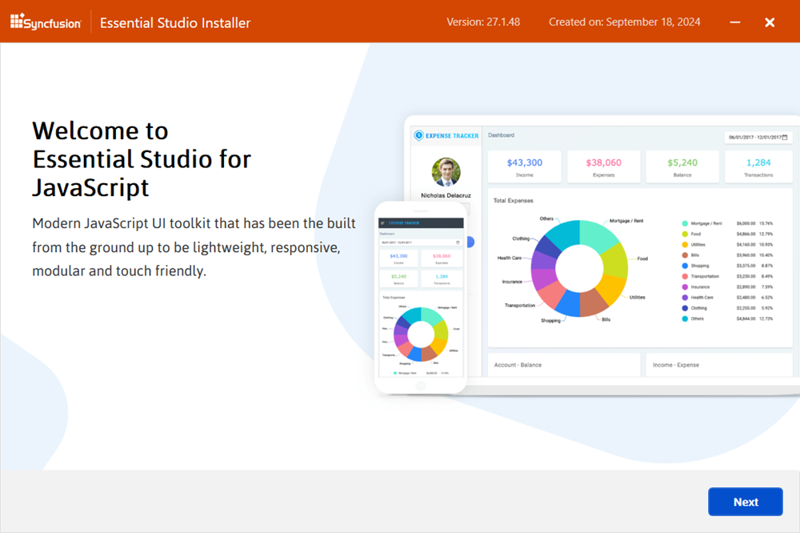
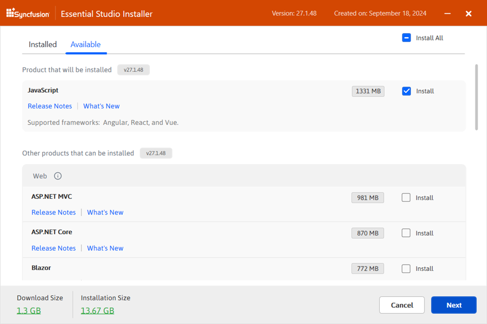
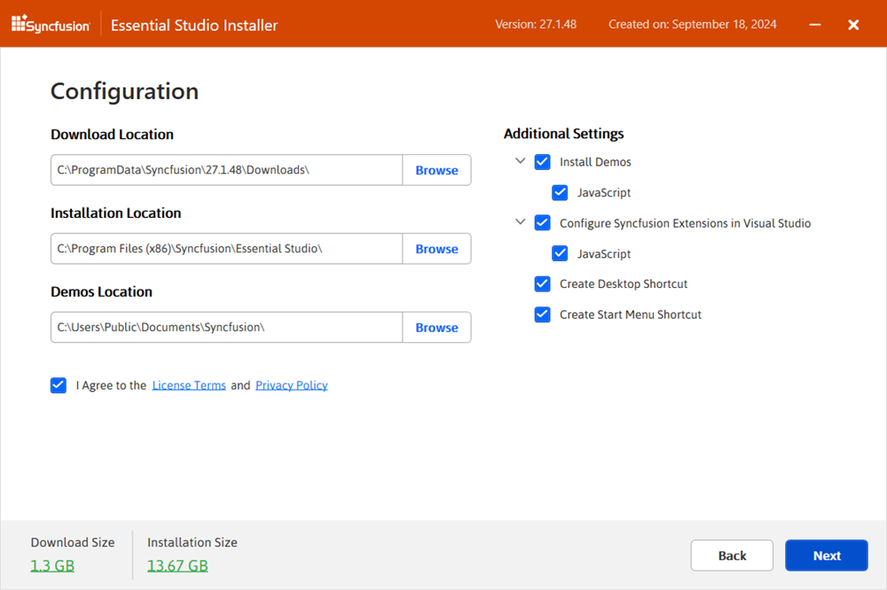
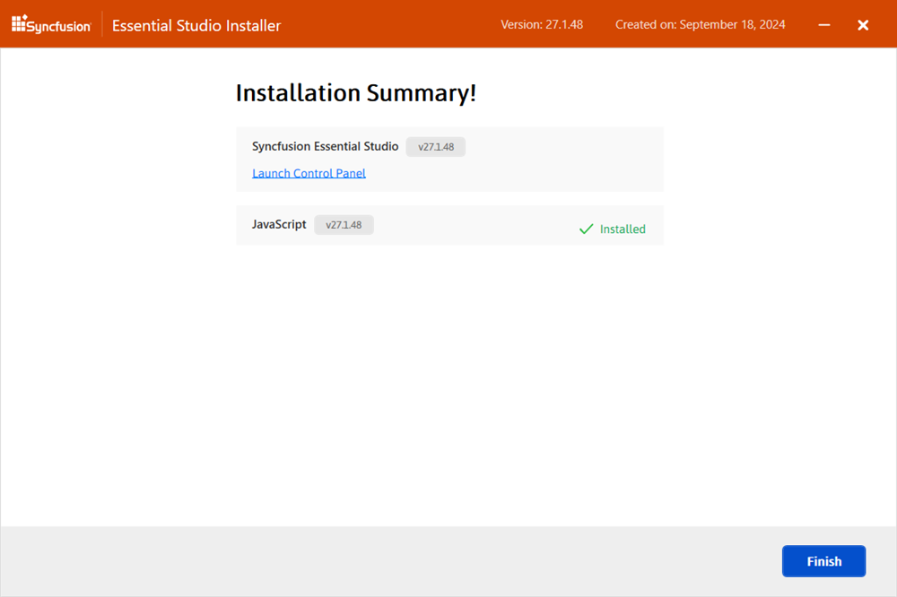

# Installing React (JavaScript - EJ2) components using web installer

## Overview

For the Essential Studio® for JavaScript - EJ2 product, Syncfusion® provides a Web Installer that avoids downloading a large offline installer. Download and run the smaller online installer; it will download only the Essential Studio® products selected. Obtain the latest Web Installer from the [Syncfusion Downloads page](https://www.syncfusion.com/account/downloads).

The following frameworks are supported by the Web Installer:

- JavaScript (ES5)
- JavaScript (ES6+)
- Angular
- React
- Vue

## Installation

Follow these steps to install Essential Studio® for JavaScript - EJ2 using the Web Installer:

1. Double-click the downloaded Syncfusion® Essential Studio® for JavaScript - EJ2 Web Installer file. The Installer Wizard opens and extracts the package.

    

    > The installer displays a dialog showing extraction progress.

2. When the welcome page appears, click **Next**.

    

3. In the Platform Selection Wizard, open the **Available** tab and select the products to install. To install all products, select **Install All**.

    **Available Products:**

    

    If multiple products from the same version are already installed, they appear under the **Installed** tab. Use the **Installed** tab to select products for uninstallation. Click **Next** to continue.

    **Installed Products:**

    

    > If required software for the selected product is not installed, an **Additional Software Required** alert appears. Installation can continue; missing prerequisites can be installed later.

    **Required Software:**

    

4. If the installer detects previous versions of the selected products, the Uninstall Previous Versions wizard appears. Review the list of installed versions. To remove all detected versions, select **Uninstall All**. Click **Next**.

    

    > Starting with the 2021 Volume 1 release, Syncfusion provides an option to uninstall previous versions (version 18.1 and later) while installing a new release.

5. Confirm the uninstallation of selected previous versions in the confirmation dialog.

    

6. The Confirmation Wizard displays the full list of products to be installed and/or uninstalled. Review and modify the list as needed.

    

    > Click the **Download Size** and **Installation Size** links to view approximate download and disk space requirements.

7. Configure installation locations and options on the Configuration Wizard. Change the Download, Install, and Demos locations as needed. Modify additional product-level settings if required. Click **Next** to proceed with default settings.

    

    **Additional Settings:**
    - Select **Install Demos** to install Syncfusion samples, or leave it unchecked to skip samples.
    - The **Configure Syncfusion Extensions controls in Visual Studio** option applies to ASP.NET development and does not affect React usage.
    - Enable **Create Desktop Shortcut** to add a desktop shortcut for the Syncfusion Control Panel.
    - Enable **Create Start Menu Shortcut** to add a Start Menu shortcut for the Syncfusion Control Panel.

8. Read the License Terms and Conditions, select **I agree to the License Terms and Privacy Policy**, then click **Next**.

9. On the login page, enter the Syncfusion® account email address and password. If an account does not exist, click **Create an Account**. Use **Forgot Password** to reset credentials if needed. Click **Install** to begin installation.

    

    > Products are installed according to the Syncfusion license associated with the account (trial or licensed).

10. Monitor download and installation/uninstallation progress on the progress page.

    

11. When installation completes, the Summary wizard lists products installed successfully and any failures. Click **Finish** to close the wizard.

    

    - Click **Launch Control Panel** to open the Syncfusion Control Panel.

12. After installation, two Syncfusion Control Panel entries may appear:
    - **Essential Studio {version}** — manages all Syncfusion products installed in the same version (use to uninstall all products at once).
    - **Essential Studio for JavaScript - EJ2 {version}** — manages only the JavaScript - EJ2 product (use to uninstall JavaScript - EJ2 specifically).

    

## Uninstallation

The Syncfusion Essential Studio installer supports two uninstallation methods:

- Uninstall using the Syncfusion Web Installer
- Uninstall from the Windows Control Panel

### Option 1: Uninstall using the web installer

The Web Installer can remove products of the same version directly. Open the **Installed** tab, select products to uninstall, and the installer will remove them in sequence.

### Option 2: Uninstall from Windows Control Panel

To remove all installed Syncfusion products for a version, select **Syncfusion Essential Studio {version}** in the Windows Control Panel. To remove only JavaScript - EJ2, select **Syncfusion Essential Studio for JavaScript - EJ2 {version}**.

> If **Syncfusion Essential Studio for JavaScript - EJ2 {version}** is selected, only the JavaScript - EJ2 product is removed and the standard MSI uninstallation window is displayed.