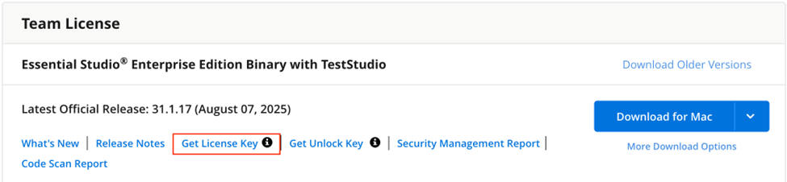
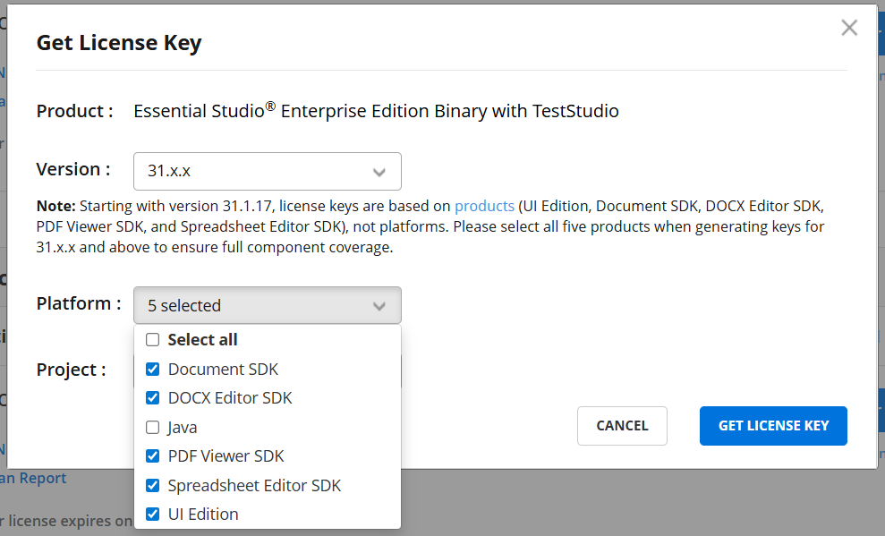
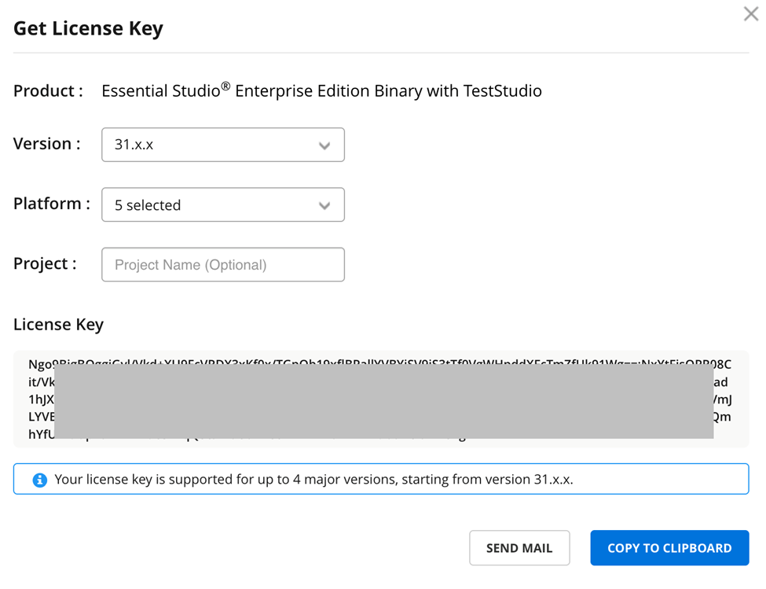
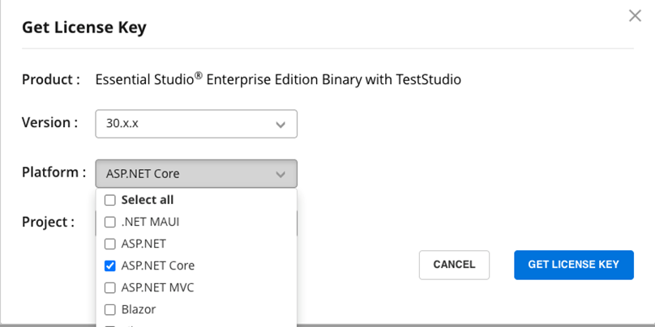

# Generate Syncfusion® ReactJS License Key

Syncfusion® license keys can be generated from the [License & Downloads](https://syncfusion.com/account/downloads) page or [Trial & Downloads](https://www.syncfusion.com/account/manage-trials/downloads) page of the Syncfusion&reg; website.

> * Syncfusion&reg; license keys are **version and platform specific**. Refer to this [KB article](https://www.syncfusion.com/kb/8976/how-to-generate-license-key-for-licensed-products) to generate the license key for the required version and platform.
> * Refer to this [KB article](https://www.syncfusion.com/kb/8951/which-version-syncfusion-license-key-should-i-use-in-my-application) to know which version of the Syncfusion&reg; license key should be used in the application.

## Claim License Key

Syncfusion&reg; License keys can also be generated from the **"Claim License Key"** page based on the trial or valid license associated with your Syncfusion&reg; account.

You can obtain the license key based on license availability in your Syncfusion&reg; account.

### Active License

If you have a Syncfusion&reg; account associated with a valid license, a license key will be generated from the claim license key page.

### Active Trial

If you have a Syncfusion&reg; account associated with a valid trial license, a license key will be generated from the claim license key page with an expiry date.

### Expired License

If you have a Syncfusion&reg; account with an expired license, your license subscription must be renewed to obtain a valid license key for the latest Essential Studio&reg; version. Meanwhile, a temporary license key with a five-day validity period will be generated.

### No Trial, No License, or Expired Trial

If the Syncfusion&reg; account is not associated with a trial, license, or has an expired trial, you can claim either a trial or a valid license from the claim license page.

## Licensing Update for Essential Studio (v31.1 and Later)

Starting with Essential Studio version 31.1.17 (2025 Volume 3 release), Syncfusion&reg; has transitioned from a platform-based to an edition-based licensing model. This change simplifies license management by aligning keys with specific editions rather than individual platforms.

The editions are:

- **Essential Studio UI Edition** (covers all UI components across all platforms)
- **Essential Studio Document SDK**
- **Essential Studio PDF Viewer SDK**
- **Essential Studio DOCX Editor SDK**
- **Essential Studio Spreadsheet Editor SDK**
- **Essential Studio Enterprise Edition** (includes all of the above)

## Key Changes in the Licensing Model

Effective from the 2025 Volume 3 release (v31.1.17), the licensing model has been updated as follows:

- **Edition-Based License Keys**: License keys are now generated per edition (e.g., UI Edition, Document SDK) instead of per platform (e.g., Angular, ASP.NET Core, Blazor). This reduces the need for multiple platform-specific keys.

- **Enterprise Edition Coverage**: A single Enterprise Edition license key unlocks all editions and SDKs. This key is available to customers with an Enterprise Edition license or those who purchased or registered before v31.1.17 by selecting all options during key generation.

- **Unchanged Registration Process**: The method for registering license keys within your application remains the same. See the [License Key Registration Guide](https://ej2.syncfusion.com/react/documentation/licensing/license-key-registration) for instructions.

- **Recommendation for Existing Customers**: Users with licenses from before v31.1.17 are advised to select all five editions (UI Component Suite, Document SDK, DOCX Editor SDK, PDF Viewer SDK, Spreadsheet Editor SDK) when generating a key for v31.1.17 or higher to ensure compatibility with applications using controls or libraries from multiple editions.

## How to Generate License Keys (v31.1.17 or Higher)

Follow these steps for the edition-based model:

**Step 1:** Go to the [Downloads and Keys](https://www.syncfusion.com/account/downloads) page.

**Step 2:** Click the **Get License Key** link.

**Step 3:** In the pop-up, select version 31.x.x or higher.

**Step 4:** Select the required edition(s) or SDK(s) from the drop-down menu based on your application's component usage.

- Customers who purchased or registered before v31.1.17 will see all available editions and SDKs.
- New customers purchasing the Essential Studio&reg; Enterprise Edition will also see all available editions and SDKs.
- New customers purchasing specific editions or SDKs will see only those in the drop-down menu.

To generate an Enterprise Edition key, select all available options:

- UI Edition
- Document SDK
- DOCX Editor SDK
- PDF Viewer SDK
- Spreadsheet Editor SDK

> Customers who purchased a license before v31.x.x are strongly advised to select all five editions and SDKs when generating a key for v31.x.x or higher to ensure continued functionality, as your application might use resources from multiple editions.

**Step 5:** Click **Get License Key**. This generates the Enterprise Edition license key, which covers all SDKs and UI components.

> If you generate a key with only one edition but your application uses components from multiple editions, you may encounter licensing errors. In such cases, regenerate the key with all required editions selected.

## How to Generate License Keys (v30.x.x or Earlier)

For versions 30.x.x and earlier, follow the platform-based licensing model:

**Step 1:** Go to the [Downloads and Keys](https://www.syncfusion.com/account/downloads) page.

**Step 2:** Click the **Get License Key** link.

**Step 3:** In the pop-up dialog, select the required version (v30.x.x or earlier).

**Step 4:** From the drop-down menu, select the platform(s) used in your application. You can select multiple platforms.

> When selecting an older version, the menu will display platforms (e.g., React, JavaScript, Angular) instead of the new editions.

**Step 5:** Click **Get License Key** to generate the platform-specific key.

## See Also

* [How to register Syncfusion&reg; license key in the application?](https://ej2.syncfusion.com/react/documentation/licensing/license-key-registration)
* [Syncfusion&reg; Licensing Overview](https://ej2.syncfusion.com/react/documentation/licensing/overview)
* [Licensing FAQ](https://ej2.syncfusion.com/react/documentation/licensing/licensing-troubleshoot)