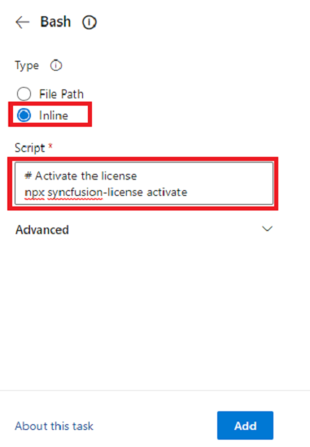

# Register Syncfusion<sup style="font-size:70%">&reg;</sup> License Key in ReactJS Application

The Syncfusion<sup style="font-size:70%">&reg;</sup> license key must be registered if your project uses Syncfusion<sup style="font-size:70%">&reg;</sup> ReactJS packages. The generated license key is a string that needs to be registered after any [Syncfusion<sup style="font-size:70%">&reg;</sup> ReactJS reference](https://ej2.syncfusion.com/react/documentation/getting-started/quick-start/#preparing-the-application).

> Syncfusion<sup style="font-size:70%">&reg;</sup> license validation is performed offline during application execution and does not require internet access. Apps registered with a Syncfusion<sup style="font-size:70%">&reg;</sup> license key can be deployed on any system without an internet connection.

Generate the [Syncfusion<sup style="font-size:70%">&reg;</sup> license key](https://ej2.syncfusion.com/react/documentation/licensing/license-key-generation/) and register it using one of the following methods:

* [Register the license key in the project](#register-syncfusion-license-key-in-the-project)
* [Register the license key using the npx command](#register-syncfusion-license-key-using-the-npx-command)

## Register Syncfusion<sup style="font-size:70%">&reg;</sup> License Key in the Project

Register the license key in the `index.js` file of the React project:

```ts
import React from 'react';
import ReactDOM from 'react-dom';
import './index.css';
import App from './App';
import reportWebVitals from './reportWebVitals';
import { registerLicense } from '@syncfusion/ej2-base';

// Registering Syncfusion license key
registerLicense('Replace your generated license key here');

ReactDOM.render(
  <React.StrictMode>
    <App />
  </React.StrictMode>,
  document.getElementById('root')
);
```

> License key registration is required only from 2022 Vol 1 (v20.1.0.47) onwards for Essential<sup style="font-size:70%">&reg;</sup> JavaScript 2 products.

## Register Syncfusion<sup style="font-size:70%">&reg;</sup> License Key Using the npx Command

Register the Syncfusion<sup style="font-size:70%">&reg;</sup> license key through the npx command using one of the following methods:

* [Register the license key with the license file](#register-the-license-key-with-the-license-file)
* [Register the license key with the environment variable](#register-the-license-key-with-the-environment-variable)

> If both the license text file and the environment variable are used for license registration, priority is given to the `syncfusion-license.txt` file. To use the environment variable for license registration, remove the license text file from the application.

### Register the License Key with the License File

The following steps show how to register the Syncfusion<sup style="font-size:70%">&reg;</sup> license key using a license text file:

* Create a `syncfusion-license.txt` file in the application root directory and paste the license key.

* Open the command prompt in the application root directory and activate the license key using the following command:

      ```bash
       npx syncfusion-license activate
      ```

* Once the Syncfusion<sup style="font-size:70%">&reg;</sup> license key is activated, the following console message will appear:

  **License message:** <br /> (INFO) Syncfusion<sup style="font-size:70%">&reg;</sup> License imported successfully.

* Remove the `.cache` folder from `node_modules` in the application.

* Now run the application. If you encounter a license validation error, refer to this [link](https://ej2.syncfusion.com/react/documentation/licensing/licensing-errors/) to resolve it. Also, find the most frequently asked license registration questions at this [link](https://ej2.syncfusion.com/react/documentation/licensing/licensing-troubleshoot/).

> If you don't want to use the license text file in the application, refer to [this section](#register-the-license-key-with-the-environment-variable) to use an environment variable and register the Syncfusion<sup style="font-size:70%">&reg;</sup> license key. Also, check out common licensing FAQs while registering the license key using the npx command from this [link](https://ej2.syncfusion.com/react/documentation/licensing/licensing-troubleshoot#reactivating-license-once-after-updating-the-package-version-while-using-npx).

### Register the License Key with the Environment Variable

You can set the environment variable `SYNCFUSION_LICENSE` in your system and paste the license key as its value. This can be used in all applications on your machine.

The following steps show how to set the environment variable in different operating systems and register the Syncfusion<sup style="font-size:70%">&reg;</sup> license key:

* Set the environment variable in different operating systems as shown below:

#### Windows

* Open the command prompt and use the [setx](https://docs.microsoft.com/en-us/windows-server/administration/windows-commands/setx) command to add the new environment variable:

    ```bash
     setx SYNCFUSION_LICENSE "license key"
    ```

#### Mac

* Open the terminal and use the `env` command to view the variables list.

* Set the environment variable using the following command:

    ```bash
    echo 'export SYNCFUSION_LICENSE="license key"' >> ~/.bash_profile
    ```

* To modify the environment variable in the bash profile, use the following command:

     ```bash
     nano .bash_profile
     ```

* Once modified, press `Ctrl+X` to exit, then press `Y` and `Enter` to save the changes.

* Close the terminal and reopen it to see the environment variable changes using the `env` command.

#### Linux

* Open the terminal and use the `env` command to view the variables list.

* Set or modify the [environment variable](https://help.ubuntu.com/community/EnvironmentVariables) using the following command:

    ```bash
    export SYNCFUSION_LICENSE='license key'
    ```

* Once the `SYNCFUSION_LICENSE` environment variable is set, restart the IDE or application terminal before using the license activation command.

* Open the command prompt in the application root directory and activate the license key using the following command:

     ```bash
     npx syncfusion-license activate
     ```

* Once the Syncfusion<sup style="font-size:70%">&reg;</sup> license key is activated, the following console message will appear:

  **License message:** <br /> (INFO) Syncfusion<sup style="font-size:70%">&reg;</sup> License imported successfully.

* Remove the `.cache` folder from `node_modules` in the application.

* Now run the application. If you encounter a license validation error, refer to this [link](https://ej2.syncfusion.com/react/documentation/licensing/licensing-errors/) to resolve it. Also, find the most frequently asked license registration questions at this [link](https://ej2.syncfusion.com/react/documentation/licensing/licensing-troubleshoot/).

### Register Syncfusion<sup style="font-size:70%">&reg;</sup> License Key in CI Services

The following sections show how to use an environment variable in CI services.

#### GitHub Actions

* Create a [new Repository Secret](https://docs.github.com/en/actions/security-guides/encrypted-secrets#creating-encrypted-secrets-for-a-repository) or an [Organization Secret](https://docs.github.com/en/actions/security-guides/encrypted-secrets#creating-encrypted-secrets-for-an-organization). Set the name of the secret to `SYNCFUSION_LICENSE` and use the license key as the value.

* Add the Syncfusion<sup style="font-size:70%">&reg;</sup> license activation command after running npm install or yarn:

```yaml
  steps:
  - name: Install node modules
    run: npm install

  - name: Activate Syncfusion License
    run: npx syncfusion-license activate
    env:
      SYNCFUSION_LICENSE: ${{ secrets.SYNCFUSION_LICENSE }}
```

#### Azure Pipelines (YAML)

* Create a new [User-defined Variable](https://docs.microsoft.com/en-us/azure/devops/pipelines/process/variables?view=azure-devops&tabs=yaml%2Cbatch) named `SYNCFUSION_LICENSE`. Use the license key as the value.

* Add the Syncfusion<sup style="font-size:70%">&reg;</sup> license activation command after running npm install or yarn.

The following example shows the syntax for Windows build agents:

```yaml
pool:
  vmImage: 'windows-latest'

steps:
- script: call npm install
  displayName: 'Install node modules'

- script: call npx syncfusion-license activate
  displayName: 'Activate Syncfusion License'
  env:
    SYNCFUSION_LICENSE: $(SYNCFUSION_LICENSE)
```

The following example shows the syntax for Linux build agents:

```yaml
pool:
  vmImage: 'ubuntu-latest'

steps:
  - script: npm install
    displayName: 'Install node modules'

  - script: npx syncfusion-license activate
    displayName: 'Activate Syncfusion License'
    env:
      SYNCFUSION_LICENSE: $(SYNCFUSION_LICENSE)
```

#### Azure Pipelines (Classic)

* Create a new [User-defined Variable](https://docs.microsoft.com/en-us/azure/devops/pipelines/process/variables?view=azure-devops&tabs=yaml%2Cbatch) named `SYNCFUSION_LICENSE`. Use the license key as the value.

* Add the Syncfusion<sup style="font-size:70%">&reg;</sup> license activation command after running npm install or yarn using a bash task:

   ```bash
    # Activate the license
   npx syncfusion-license activate
   ```



## See Also

* [Licensing FAQ](https://ej2.syncfusion.com/react/documentation/licensing/licensing-troubleshoot/)